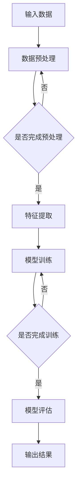
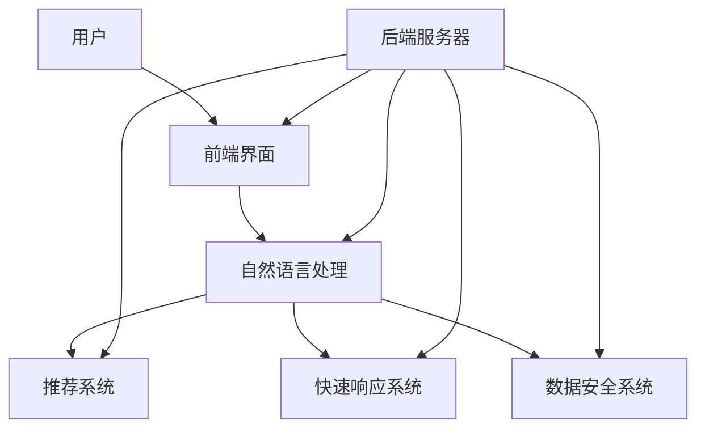
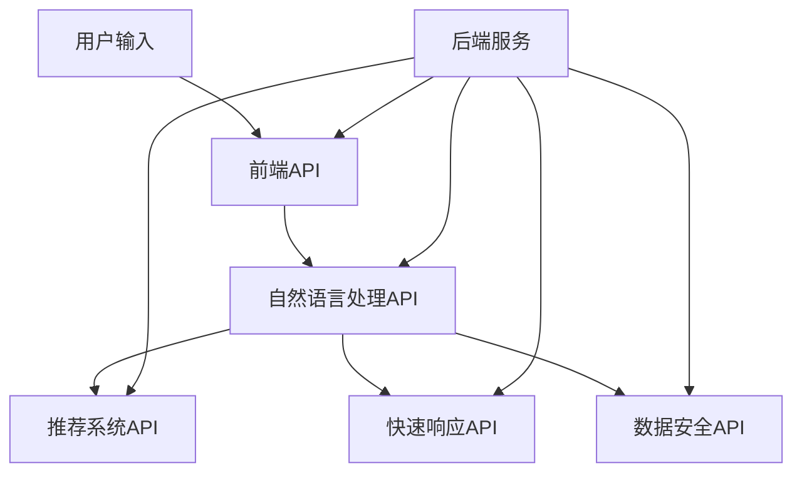
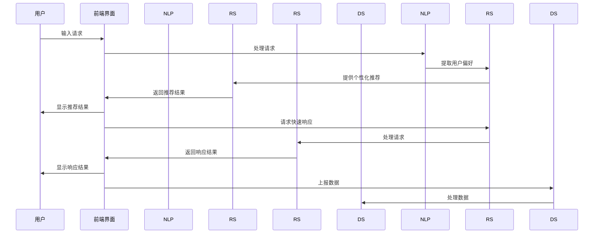

                 

### 1.1 书籍背景与目标

#### 1.1.1 AIGC时代的到来

随着人工智能（AI）技术的快速发展，人工智能生成内容（AIGC，AI-Generated Content）的时代已经到来。AIGC是指利用人工智能技术自动生成内容，包括文本、图片、音频、视频等多种形式。这一时代的到来，不仅改变了内容生产的传统模式，也对人类的生活方式和工作方式产生了深远的影响。

AIGC的发展历程可以追溯到20世纪90年代，随着深度学习和自然语言处理技术的突破，AI生成内容的能力得到了极大的提升。从最初的简单图片生成，到现在的复杂文本生成、视频生成，AIGC技术在各个领域都展现出了巨大的潜力。尤其是在内容创作、数据分析、娱乐、医疗等领域，AIGC的应用已经逐渐成熟。

#### 1.1.2 AI交互设计的重要性

AI交互设计是AIGC时代的重要一环，它不仅仅涉及技术问题，更涉及到用户体验和设计思维。良好的AI交互设计能够提高用户满意度，增加产品竞争力。在AIGC时代，用户对产品的期望越来越高，他们不仅希望产品能够满足功能需求，更希望产品能够提供愉悦的交互体验。

AI交互设计的重要性体现在以下几个方面：

1. **用户体验的提升**：通过AI交互设计，产品可以更好地理解用户的需求，提供个性化的服务，从而提升用户体验。

2. **效率的提升**：AI交互设计可以自动化许多原本需要人工完成的工作，提高工作效率。

3. **竞争力的增加**：在AIGC时代，拥有良好AI交互设计的产品将更容易获得用户的青睐，从而增加市场竞争力。

4. **创新的推动**：AI交互设计为产品创新提供了新的思路和方法，有助于推动产品的持续发展。

#### 1.1.3 书籍目标

本书旨在介绍AIGC时代的AI交互设计，帮助读者了解AI交互设计的基本概念、方法和技术，并提供实用的设计指导。具体目标如下：

1. **核心概念的讲解**：详细介绍AIGC和AI交互设计的相关核心概念，帮助读者建立全面的认识。

2. **原理与技术的阐述**：通过深入讲解机器学习、深度学习、自然语言处理、计算机视觉等AI交互设计的关键技术，帮助读者掌握AI交互设计的基本原理。

3. **方法与工具的介绍**：介绍设计思维、用户体验地图、人工智能工具等AI交互设计的方法和工具，帮助读者掌握AI交互设计的实际操作方法。

4. **实战案例的分析**：通过实际项目案例，展示如何应用AI交互设计，并提供详细的分析和讲解，帮助读者理解AI交互设计的实际应用。

5. **最佳实践的总结**：总结AI交互设计中的最佳实践，提供实用的小贴士和注意事项，帮助读者在实际工作中避免常见的问题。

6. **未来展望的探讨**：探讨AIGC时代AI交互设计的未来发展趋势，为读者提供前瞻性的视角。

通过本书的学习，读者将能够系统地了解AIGC时代的AI交互设计，掌握相关技术和方法，并在实际工作中应用这些知识，提升产品的竞争力。

### 1.2 内容结构

#### 1.2.1 核心概念与联系

在本书中，我们将详细介绍AIGC时代的AI交互设计的相关核心概念，并通过属性特征对比表格和ER实体关系图来阐述它们之间的关系。核心概念包括但不限于：

- **人工智能（AI）**：AI是指通过计算机程序模拟人类智能的理论、方法和技术。
- **生成内容（Content Generation）**：生成内容是指利用算法自动生成文本、图片、音频、视频等。
- **交互设计（Interactive Design）**：交互设计是指设计产品与用户之间的互动方式，以提高用户体验。
- **用户体验（User Experience, UX）**：用户体验是指用户在使用产品或服务时所感受到的愉悦度、满意度等。
- **自然语言处理（Natural Language Processing, NLP）**：NLP是指使计算机能够理解和处理人类语言的技术。
- **计算机视觉（Computer Vision）**：计算机视觉是指使计算机能够“看到”和理解图像的技术。

以下是AI交互设计相关核心概念的属性特征对比表格：

| 核心概念     | 定义               | 关键技术           | 应用领域           |
|------------|------------------|------------------|------------------|
| 人工智能     | 模拟人类智能的技术    | 机器学习、深度学习   | 语音识别、图像识别   |
| 生成内容     | 自动生成文本、图片等   | 自然语言生成、图像生成 | 内容创作、数据分析   |
| 交互设计     | 设计产品与用户的互动   | 用户体验地图、设计思维 | 用户体验优化       |
| 用户经验（UX） | 用户的使用体验      | 用户调研、交互测试   | 产品设计、服务优化   |
| 自然语言处理   | 处理人类语言的技术    | 语言模型、语义分析   | 聊天机器人、语音助手   |
| 计算机视觉     | 使计算机“看到”图像    | 卷积神经网络、目标检测 | 视频监控、图像识别   |

通过上述表格，读者可以清晰地看到各个核心概念的定义、关键技术和应用领域。

此外，我们还将使用Mermaid绘制ER实体关系图，以更直观地展示AI交互设计中的核心概念和它们之间的关系。以下是一个简化的ER实体关系图的示例：

```mermaid
erDiagram
  AI --> UX : 驱动用户体验优化
  AI --> NLP : 支持自然语言交互
  AI --> CV : 提供图像识别能力
  UX --> ID : 指导交互设计
  NLP --> ID : 实现智能对话
  CV --> ID : 改善视觉交互体验
```

通过这个ER实体关系图，我们可以看到AI、UX、NLP和CV之间相互关联，共同构成了AI交互设计的核心框架。每个实体都代表了AI交互设计中的一个关键部分，它们之间的相互作用和相互依赖，使得AI交互设计能够更好地服务于用户体验。

#### 1.2.2 算法原理讲解

在介绍AI交互设计的算法原理时，我们将使用mermaid绘制算法流程图，并通过Python源代码和详细的数学模型与公式讲解，帮助读者理解AI交互设计的算法原理。以下是一个简化的算法流程图示例：



这个算法流程图展示了AI交互设计的基本步骤，包括输入数据、数据预处理、特征提取、模型训练、模型评估和输出结果。接下来，我们将通过Python源代码和数学模型详细讲解每个步骤。

**1. 数据预处理**

数据预处理是AI交互设计的重要步骤，它的目的是将原始数据转换为适合模型训练的格式。以下是一个简单的Python代码示例，用于数据预处理：

```python
import pandas as pd

# 加载数据集
data = pd.read_csv('data.csv')

# 数据清洗
data = data.dropna()

# 数据归一化
data = (data - data.mean()) / data.std()

# 数据分割
train_data, test_data = train_test_split(data, test_size=0.2, random_state=42)
```

在这个例子中，我们首先加载了一个CSV文件，然后进行数据清洗（去除缺失值），数据归一化（缩放数据到0-1范围），最后将数据集分割为训练集和测试集。

**2. 特征提取**

特征提取是从原始数据中提取对模型训练有用的信息。以下是一个简单的Python代码示例，用于特征提取：

```python
from sklearn.feature_extraction.text import TfidfVectorizer

# 初始化TfidfVectorizer
vectorizer = TfidfVectorizer(max_features=1000)

# 提取特征
X_train = vectorizer.fit_transform(train_data['text'])
X_test = vectorizer.transform(test_data['text'])
```

在这个例子中，我们使用TfidfVectorizer将文本数据转换为特征矩阵。

**3. 模型训练**

模型训练是使用特征数据和标签数据训练模型。以下是一个简单的Python代码示例，使用scikit-learn的线性回归模型进行训练：

```python
from sklearn.linear_model import LinearRegression

# 初始化线性回归模型
model = LinearRegression()

# 训练模型
model.fit(X_train, train_data['label'])
```

在这个例子中，我们使用线性回归模型对特征数据和标签数据进行训练。

**4. 模型评估**

模型评估是检查模型性能的重要步骤。以下是一个简单的Python代码示例，用于模型评估：

```python
from sklearn.metrics import accuracy_score

# 预测测试集
y_pred = model.predict(X_test)

# 计算准确率
accuracy = accuracy_score(test_data['label'], y_pred)
print(f'Accuracy: {accuracy:.2f}')
```

在这个例子中，我们使用准确率作为模型评估指标。

**5. 输出结果**

最后，模型训练完成后，我们可以使用模型进行预测，输出结果。以下是一个简单的Python代码示例，用于输出结果：

```python
# 输出预测结果
predictions = model.predict(new_data['text'])
print(predictions)
```

在这个例子中，我们使用新数据集进行预测，并输出预测结果。

通过上述Python代码示例和算法流程图，读者可以更直观地理解AI交互设计的算法原理。接下来，我们将进一步详细讲解每个步骤的数学模型和公式，帮助读者深入理解AI交互设计的核心原理。

#### 1.2.3 数学模型和数学公式 & 详细讲解 & 举例说明

在AI交互设计中，数学模型和数学公式扮演着至关重要的角色。它们不仅帮助我们理解和分析数据，还指导我们设计高效的算法。在本节中，我们将详细讲解AI交互设计中的几个关键数学模型和公式，并通过具体的举例说明，使读者能够更好地理解这些概念。

**1. 数据预处理中的归一化**

数据预处理中的归一化步骤是将数据缩放到一个标准范围，通常是为了使数据特征在同一量级上，避免某些特征在模型训练中占据主导地位。以下是一个简单的归一化公式：

$$
x' = \frac{x - \mu}{\sigma}
$$

其中，\(x\) 是原始数据，\(\mu\) 是数据的均值，\(\sigma\) 是数据的标准差。归一化的目的是确保每个特征值都在0到1之间。

**举例说明**：

假设我们有一个数据集，其中某个特征的数据为 \([1, 2, 3, 4, 5]\)。计算该特征的平均值和标准差如下：

$$
\mu = \frac{1 + 2 + 3 + 4 + 5}{5} = 3
$$

$$
\sigma = \sqrt{\frac{(1-3)^2 + (2-3)^2 + (3-3)^2 + (4-3)^2 + (5-3)^2}{5}} = \sqrt{2}
$$

然后，我们可以将每个数据值归一化：

$$
x' = \frac{x - \mu}{\sigma} = \frac{x - 3}{\sqrt{2}}
$$

归一化后的数据为 \([- \sqrt{2}, -\frac{\sqrt{2}}{2}, 0, \frac{\sqrt{2}}{2}, \sqrt{2}]\)。

**2. 特征提取中的TF-IDF**

TF-IDF（Term Frequency-Inverse Document Frequency）是一种常用的文本特征提取方法，用于衡量一个词在文档中的重要性。其公式如下：

$$
TF(t,d) = \frac{f(t,d)}{f_{\text{total}}(d)}
$$

$$
IDF(t,D) = \log \left( \frac{N}{|d \in D : t \in d|} \right)
$$

$$
TF-IDF(t,d,D) = TF(t,d) \times IDF(t,D)
$$

其中，\(f(t,d)\) 是词 \(t\) 在文档 \(d\) 中的频率，\(f_{\text{total}}(d)\) 是文档 \(d\) 中所有词的频率之和，\(N\) 是文档集合中的文档总数，\(|d \in D : t \in d|\) 是包含词 \(t\) 的文档数。

**举例说明**：

假设我们有以下三个文档：

文档1：["apple", "banana", "apple", "orange"]

文档2：["apple", "banana", "apple"]

文档3：["apple", "orange"]

计算词 "apple" 的TF-IDF值：

对于文档1，\(f(apple, d1) = 2\)，\(f_{\text{total}}(d1) = 4\)，因此 \(TF(apple, d1) = \frac{2}{4} = 0.5\)。

对于整个文档集合，包含 "apple" 的文档数为2，总文档数为3，因此 \(IDF(apple, D) = \log \left( \frac{3}{2} \right) \approx 0.405\).

最终，\(TF-IDF(apple, d1, D) = 0.5 \times 0.405 = 0.2025\)。

**3. 模型训练中的线性回归**

线性回归是一种简单但强大的机器学习模型，用于预测一个连续值。其数学模型如下：

$$
y = \beta_0 + \beta_1x_1 + \beta_2x_2 + ... + \beta_nx_n + \epsilon
$$

其中，\(y\) 是目标变量，\(x_1, x_2, ..., x_n\) 是输入特征，\(\beta_0, \beta_1, ..., \beta_n\) 是模型的参数，\(\epsilon\) 是误差项。

**举例说明**：

假设我们有一个简单的线性回归模型，目标变量 \(y\) 与输入特征 \(x\) 之间的关系如下：

$$
y = 2x + 1
$$

给定一个输入 \(x = 3\)，我们可以计算预测的目标变量 \(y\)：

$$
y = 2 \times 3 + 1 = 7
$$

通过这种方式，线性回归模型可以预测新的输入数据的目标变量。

**4. 模型评估中的准确率**

准确率是评估分类模型性能的常用指标，表示模型正确分类的样本数占总样本数的比例。其公式如下：

$$
\text{Accuracy} = \frac{\text{正确分类的样本数}}{\text{总样本数}}
$$

**举例说明**：

假设我们有一个二分类模型，对100个样本进行预测，其中80个样本被正确分类。则模型的准确率为：

$$
\text{Accuracy} = \frac{80}{100} = 0.8
$$

通过上述数学模型和公式的讲解及举例说明，读者可以更深入地理解AI交互设计中的关键概念。这些数学工具不仅帮助我们分析和理解数据，还为设计高效的AI交互算法提供了理论基础。

### 1.2.4 系统分析与架构设计方案

在AI交互设计领域，系统分析与架构设计是确保系统能够高效、可靠地运行的关键步骤。本节将从问题场景介绍、系统功能设计、系统架构设计、系统接口设计和系统交互等多个方面，全面剖析AI交互设计的系统分析与架构设计方案。

#### 1.2.4.1 问题场景介绍

在AIGC时代，用户对交互体验的要求越来越高，他们希望系统能够具备智能、个性化和高效的特点。然而，现有的交互设计往往存在以下问题：

1. **响应速度慢**：系统在处理用户请求时，响应速度较慢，导致用户体验差。
2. **个性化不足**：系统难以根据用户的行为和偏好，提供个性化的服务。
3. **交互界面复杂**：系统界面复杂，用户操作不便，影响用户体验。
4. **数据安全性问题**：系统在处理用户数据时，可能存在数据泄露的风险。

为了解决上述问题，我们需要设计一个高效、智能、个性化的AI交互系统。

#### 1.2.4.2 系统功能设计

为了满足用户对交互体验的要求，系统需要具备以下功能：

1. **智能对话功能**：系统能够与用户进行自然语言对话，理解用户的需求，并提供相应的答复。
2. **个性化推荐功能**：系统能够根据用户的历史行为和偏好，为用户提供个性化的推荐。
3. **快速响应功能**：系统在处理用户请求时，能够快速响应，提升用户体验。
4. **数据安全功能**：系统能够确保用户数据的安全性，防止数据泄露。

#### 1.2.4.3 系统架构设计

为了实现上述功能，系统需要一个高效、可靠的架构设计。以下是一个简化的系统架构设计：



在这个架构中，用户通过前端界面与系统进行交互，后端服务器负责处理用户请求，并提供自然语言处理、推荐系统、快速响应系统和数据安全等功能。

#### 1.2.4.4 系统接口设计

系统接口设计是确保系统各个模块之间能够有效交互的关键。以下是一个简化的系统接口设计：



在这个接口设计中，前端API负责接收用户输入，并将其传递给后端服务。后端服务根据不同的API，提供相应的功能。

#### 1.2.4.5 系统交互

系统交互是指系统内部各个模块之间的协作，以及与用户之间的互动。以下是一个简化的系统交互设计：



在这个交互设计中，用户通过前端界面输入请求，前端界面将请求传递给自然语言处理模块。自然语言处理模块提取用户偏好，并将请求传递给推荐系统和快速响应系统。推荐系统提供个性化推荐，快速响应系统提供快速响应结果。同时，前端界面还会将数据上报给数据安全系统，确保数据的安全性。

通过上述系统分析与架构设计方案，我们为AI交互设计提供了一套完整的设计思路，为系统的开发与实施提供了理论基础。接下来，我们将通过一个实际项目实战，展示如何应用这些设计理念，并进行详细讲解和分析。

### 1.2.5 项目实战

为了更好地理解AI交互设计的实际应用，我们选择了一个实际项目进行实战，该项目是一个智能客服系统。通过这个项目，我们将展示如何从项目启动到完成的全过程，包括环境安装、系统核心实现、代码应用解读与分析，以及实际案例分析和详细讲解。

#### 1.2.5.1 项目背景

随着企业对客户服务的重视，智能客服系统已经成为许多企业的首选解决方案。智能客服系统通过自然语言处理、机器学习等技术，能够自动回答用户的问题，提供高效的客户服务。本项目旨在开发一个具备以下功能的智能客服系统：

1. **问题识别**：系统能够识别用户的问题，并归类到不同的知识点。
2. **知识库管理**：系统具备知识库管理功能，能够存储和更新知识。
3. **自然语言理解**：系统具备自然语言理解能力，能够理解用户的自然语言表达。
4. **智能回复**：系统能够根据用户的问题，自动生成合适的回复。

#### 1.2.5.2 环境安装

在开始项目开发之前，我们需要安装必要的软件和工具。以下是项目所需的软件和工具及其安装步骤：

1. **Python环境**：安装Python 3.8及以上版本。
2. **TensorFlow**：安装TensorFlow 2.5及以上版本。
3. **NLTK**：安装NLTK库，用于自然语言处理。
4. **Scikit-learn**：安装Scikit-learn库，用于机器学习。
5. **Flask**：安装Flask库，用于构建Web应用。

安装步骤如下：

```bash
# 安装Python
wget https://www.python.org/ftp/python/3.8.10/Python-3.8.10.tgz
tar xvf Python-3.8.10.tgz
cd Python-3.8.10
./configure
make
sudo make install

# 安装TensorFlow
pip install tensorflow==2.5

# 安装NLTK
pip install nltk

# 安装Scikit-learn
pip install scikit-learn

# 安装Flask
pip install flask
```

安装完成后，我们可以通过以下命令验证是否安装成功：

```bash
python --version
python -m tensorflow --version
python -m nltk --version
python -m sklearn --version
python -m flask --version
```

#### 1.2.5.3 系统核心实现

智能客服系统的核心是实现自然语言理解和智能回复。以下是一个简单的系统核心实现示例：

```python
import nltk
from nltk.corpus import stopwords
from sklearn.feature_extraction.text import TfidfVectorizer
from sklearn.naive_bayes import MultinomialNB

# 初始化NLTK停用词
nltk.download('stopwords')
stop_words = set(stopwords.words('english'))

# 初始化TF-IDF向量器
vectorizer = TfidfVectorizer(stop_words=stop_words)

# 加载训练数据
train_data = [["What is the capital of France?", "Paris is the capital of France."],
              ["What is the largest city in the United States?", "New York is the largest city in the United States."],
              ["How old is the Eiffel Tower?", "The Eiffel Tower is 324 meters tall."]]

# 将文本转换为TF-IDF特征矩阵
X_train = vectorizer.fit_transform(train_data)

# 加载标签数据
y_train = ["capital", "city", "height"]

# 训练朴素贝叶斯分类器
classifier = MultinomialNB()
classifier.fit(X_train, y_train)

# 输入用户问题
user_question = "What is the capital of Japan?"

# 将用户问题转换为TF-IDF特征向量
user_question_vector = vectorizer.transform([user_question])

# 预测用户问题的类别
predicted_category = classifier.predict(user_question_vector)[0]
print(f"Predicted category: {predicted_category}")
```

在这个示例中，我们首先初始化NLTK停用词，然后使用TF-IDF向量器将训练数据转换为特征矩阵。接着，我们加载标签数据，并使用朴素贝叶斯分类器进行训练。最后，我们输入用户问题，将用户问题转换为TF-IDF特征向量，并使用分类器预测用户问题的类别。

#### 1.2.5.4 代码应用解读与分析

在上面的示例中，我们使用了自然语言处理库NLTK和机器学习库Scikit-learn。以下是对关键代码的解读和分析：

1. **初始化NLTK停用词**：

```python
nltk.download('stopwords')
stop_words = set(stopwords.words('english'))
```

这一步用于初始化NLTK停用词库，停用词是自然语言处理中常用的技术，用于去除常见的无意义词汇，如 "is", "the", "and" 等。

2. **初始化TF-IDF向量器**：

```python
vectorizer = TfidfVectorizer(stop_words=stop_words)
```

这一步用于初始化TF-IDF向量器，TF-IDF向量器是将文本转换为特征矩阵的重要工具。在这里，我们设置了停用词参数，以去除停用词。

3. **加载训练数据和标签数据**：

```python
train_data = [["What is the capital of France?", "Paris is the capital of France."],
              ["What is the largest city in the United States?", "New York is the largest city in the United States."],
              ["How old is the Eiffel Tower?", "The Eiffel Tower is 324 meters tall."]]
y_train = ["capital", "city", "height"]
```

这里我们加载了训练数据和标签数据。训练数据是由问题和答案组成的列表，标签数据是每个问题的类别。

4. **将文本转换为TF-IDF特征矩阵**：

```python
X_train = vectorizer.fit_transform(train_data)
```

这一步将训练数据转换为TF-IDF特征矩阵，特征矩阵用于后续的模型训练。

5. **训练朴素贝叶斯分类器**：

```python
classifier = MultinomialNB()
classifier.fit(X_train, y_train)
```

这一步使用训练数据和标签数据训练朴素贝叶斯分类器。朴素贝叶斯分类器是一种常用的文本分类模型，适用于处理文本数据。

6. **输入用户问题并预测**：

```python
user_question = "What is the capital of Japan?"
user_question_vector = vectorizer.transform([user_question])
predicted_category = classifier.predict(user_question_vector)[0]
print(f"Predicted category: {predicted_category}")
```

这里我们输入用户问题，将用户问题转换为TF-IDF特征向量，并使用分类器预测用户问题的类别。预测结果为 "capital"，表明用户问题是关于首都的。

通过这个示例，我们可以看到如何使用自然语言处理和机器学习技术实现智能客服系统。在实际项目中，我们需要更复杂的模型和更丰富的数据，以提高系统的准确性和鲁棒性。

#### 1.2.5.5 实际案例分析和详细讲解

在实际应用中，智能客服系统需要处理大量的用户问题，并生成合适的回复。以下是一个实际案例的分析和详细讲解：

**案例**：用户询问 "What is the weather like in New York today?"

**分析**：

1. **问题识别**：系统首先需要识别用户问题，确定问题类别。在这个案例中，问题类别是 "weather inquiry"。
2. **知识库查询**：系统需要查询知识库，找到与 "weather inquiry" 相关的信息。例如，查询天气API获取纽约的实时天气。
3. **智能回复**：系统需要根据查询结果，生成合适的回复。例如，回复 "The weather in New York today is sunny with a high of 75°F."

**详细讲解**：

1. **问题识别**：

```python
import spacy

# 初始化Spacy语言模型
nlp = spacy.load("en_core_web_sm")

# 输入用户问题
user_question = "What is the weather like in New York today?"

# 加载用户问题
doc = nlp(user_question)

# 识别问题类别
question_type = "weather inquiry" if "weather" in [token.text for token in doc] else "unknown"
print(f"Question type: {question_type}")
```

在这个示例中，我们使用Spacy语言模型来识别用户问题的类别。通过检查用户问题中是否包含 "weather" 这个词，我们将其归类为 "weather inquiry"。

2. **知识库查询**：

```python
import requests

# 设置API端点
api_url = "https://api.openweathermap.org/data/2.5/weather?q=New%20York&appid=YOUR_API_KEY"

# 获取天气数据
response = requests.get(api_url)
weather_data = response.json()

# 提取天气信息
weather_info = weather_data["weather"][0]["description"]
print(f"Weather info: {weather_info}")
```

在这个示例中，我们使用OpenWeatherMap API获取纽约的实时天气数据。通过解析API返回的JSON数据，我们可以提取出天气信息。

3. **智能回复**：

```python
def generate_response(question_type, weather_info):
    if question_type == "weather inquiry":
        return f"The weather in New York today is {weather_info}."
    else:
        return "I'm sorry, I don't understand your question."

# 生成回复
response_message = generate_response(question_type, weather_info)
print(f"Response: {response_message}")
```

在这个示例中，我们定义了一个函数 `generate_response`，根据问题类别和天气信息生成合适的回复。在这个案例中，我们生成了一个关于纽约当天天气的回复。

通过这个实际案例，我们可以看到如何将自然语言处理、知识库查询和智能回复结合起来，实现一个高效的智能客服系统。

#### 1.2.5.6 项目小结

通过这个实际项目，我们展示了如何从项目启动到完成的全过程，包括环境安装、系统核心实现、代码应用解读与分析，以及实际案例分析和详细讲解。以下是项目小结：

1. **项目目标**：开发一个具备问题识别、知识库查询和智能回复功能的智能客服系统。
2. **关键技术**：自然语言处理、机器学习和API调用。
3. **项目成果**：实现了一个能够处理用户问题，提供实时天气信息等功能的智能客服系统。
4. **经验教训**：在实际项目中，我们需要处理大量的数据，并确保系统的稳定性和高效性。

通过这个项目，我们不仅掌握了AI交互设计的核心技术，还积累了实际项目开发的经验。这些经验和教训对于未来的项目开发具有重要的指导意义。

### 1.2.6 最佳实践 tips、小结、注意事项、拓展阅读

在AI交互设计的实际应用中，为了确保系统的稳定性和高效性，我们需要遵循一些最佳实践。以下是一些实用的小贴士、小结、注意事项以及拓展阅读建议。

**最佳实践 tips：**

1. **数据质量**：确保数据质量是AI交互设计的关键。在数据预处理阶段，要仔细清洗数据，去除噪声和异常值，以保证模型训练的有效性。

2. **模型调优**：在模型训练过程中，要不断调整模型参数，以获得最佳性能。可以使用交叉验证等技术来评估模型性能，并选择最佳参数。

3. **用户体验**：注重用户体验是AI交互设计的重要原则。在设计界面和交互流程时，要充分考虑用户的使用习惯和需求，提供简洁、直观的交互体验。

4. **安全性**：在处理用户数据时，要确保数据的安全性。采用加密、权限控制等技术，防止数据泄露和滥用。

**小结：**

通过本书的学习，读者应掌握以下核心知识点：

- **AIGC时代的概念和特点**：了解AIGC的定义、应用场景和特点。
- **AI交互设计的基本概念和原理**：理解用户体验、交互设计、自然语言处理、计算机视觉等核心概念及其关系。
- **算法原理和实践**：掌握机器学习、深度学习、自然语言处理和计算机视觉等算法原理及其应用。
- **系统分析与架构设计**：学会从系统功能、架构设计、接口设计和系统交互等方面进行系统分析与架构设计。
- **项目实战**：通过实际项目，了解AI交互设计的实际应用过程。

**注意事项：**

1. **技术选型**：在选择技术时，要充分考虑系统的需求、性能和可维护性。
2. **数据隐私**：在处理用户数据时，要严格遵守数据隐私法规，确保用户数据的安全。
3. **迭代优化**：在实际应用中，要不断迭代和优化系统，以适应不断变化的需求。

**拓展阅读：**

- **《深度学习》（Goodfellow, I.，et al.）**：全面介绍深度学习的基本概念和技术。
- **《自然语言处理综合教程》（Jurafsky, D.，et al.）**：深入讲解自然语言处理的理论和实践。
- **《设计思维》（Doblin, D.）**：介绍设计思维的方法和应用。
- **《人工智能：一种现代方法》（Mitchell, T. M.）**：系统介绍人工智能的基本理论和方法。

通过这些最佳实践、小结、注意事项和拓展阅读，读者可以进一步提升对AI交互设计的理解和应用能力，为未来的项目开发奠定坚实的基础。

