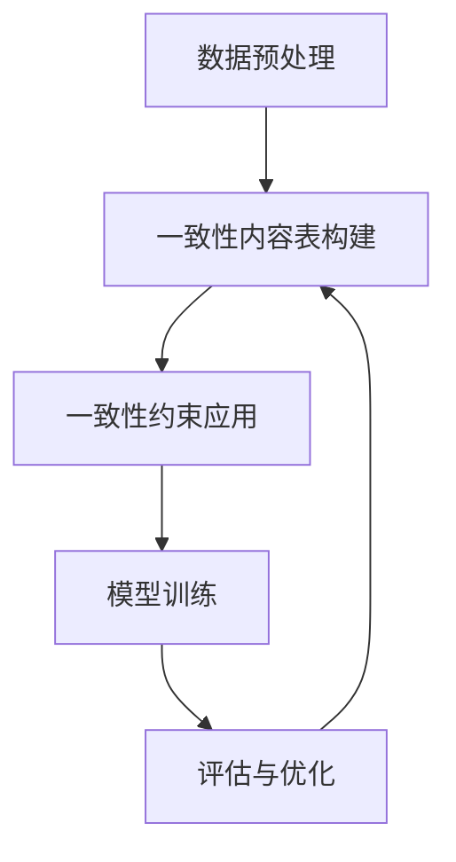
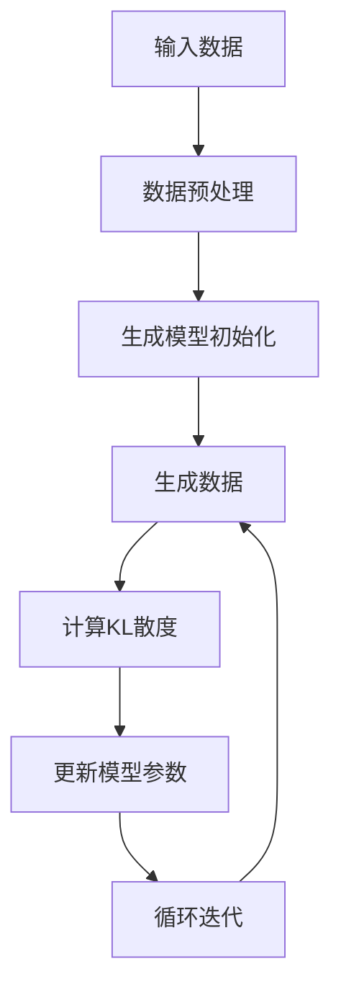
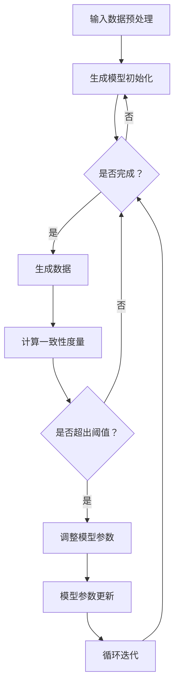
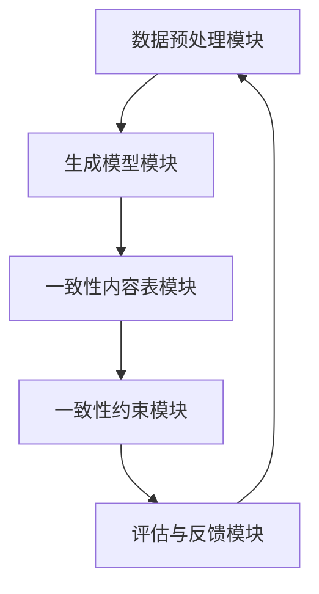

                 


# AIGC时代的AI训练革命：Self-Consistency CoT方法

关键词：AIGC、AI训练、Self-Consistency CoT、算法优化、未来方向

摘要：本文将探讨AIGC（自适应智能生成计算）时代下的AI训练革命，特别是Self-Consistency CoT（一致性内容表）方法。通过详细解析Self-Consistency CoT方法，我们将理解其原理、数学模型及其在AI训练中的应用，同时分析其实际案例和系统设计。

## 引言

随着人工智能（AI）技术的飞速发展，AI训练正经历一场革命。传统的AI训练方法已经无法满足现代复杂任务的需求，因此，自适应智能生成计算（AIGC）应运而生。AIGC不仅提高了AI的训练效率，还扩展了其应用范围，从文本生成到图像生成，再到多模态生成，AIGC正在改变我们的世界。

在这场革命中，Self-Consistency CoT方法成为一个关键工具。它通过一致性约束，提高了AI模型的稳定性和准确性。本文将深入探讨Self-Consistency CoT方法，分析其核心原理、数学模型，以及其实际应用。

### 什么是AIGC

AIGC是一种基于AI的生成计算范式，它通过自主学习、自适应调整，实现高效的内容生成。与传统AI训练方法不同，AIGC注重模型的自适应性和灵活性，使其能够在不断变化的环境中保持高效性能。

### AIGC时代的AI训练革命

在AIGC时代，AI训练不再仅仅是一个数据驱动的过程，而是一个更加智能化、自适应化的过程。Self-Consistency CoT方法正是这一革命的核心。

### 关键概念和术语

在本文中，我们将介绍以下关键概念和术语：

- **Self-Consistency CoT方法**：一种通过一致性约束提高AI模型稳定性和准确性的方法。
- **一致性内容表（Consistency Content Table, CoT）**：一种用于记录AI模型生成内容一致性的数据结构。
- **训练数据集（Training Dataset）**：用于训练AI模型的输入数据。

## 第一部分：AIGC与AI训练革命概述

### 第1章：AIGC与AI训练革命概述

#### 1.1 什么是AIGC

AIGC是一种新的计算范式，它利用AI技术实现高效的内容生成。与传统的方法相比，AIGC具有更高的灵活性和自适应性。

#### 1.2 AIGC时代的AI训练革命

AIGC时代的AI训练不再仅仅是数据的输入和输出，而是一个更加智能化、自适应化的过程。Self-Consistency CoT方法正是这一革命的核心。

#### 1.3 关键概念和术语

在AIGC时代，理解关键概念和术语是非常重要的。我们将详细介绍Self-Consistency CoT方法、一致性内容表和训练数据集等概念。

### 第2章：核心理论与方法

#### 2.1 AIGC的概述及其重要性

在本章中，我们将深入探讨AIGC的概述及其重要性，分析其与AI训练的关系。

#### 2.2 Self-Consistency CoT方法的关键概念

Self-Consistency CoT方法是一种通过一致性约束提高AI模型稳定性和准确性的方法。在本章中，我们将详细介绍其关键概念。

#### 2.3 传统AI训练方法的对比分析

我们将对比分析传统AI训练方法与Self-Consistency CoT方法，探讨其优缺点。

## 第二部分：Self-Consistency CoT方法详解

### 第3章：Self-Consistency CoT方法原理

#### 3.1 Self-Consistency CoT方法原理

在本章中，我们将深入探讨Self-Consistency CoT方法的原理，分析其如何通过一致性约束提高AI模型的性能。

#### 3.2 数学模型

Self-Consistency CoT方法的核心在于其数学模型。在本章中，我们将详细介绍这一模型的数学公式和推导过程。

#### 3.3 Mermaid流程图

为了更好地理解Self-Consistency CoT方法，我们将使用Mermaid流程图展示其运行过程。

## 第三部分：Self-Consistency CoT方法应用

### 第4章：Self-Consistency CoT方法应用

#### 4.1 实践应用

在本章中，我们将探讨Self-Consistency CoT方法在AI训练中的实际应用，通过实际案例进行分析。

#### 4.2 案例分析

我们将分析几个典型的Self-Consistency CoT方法应用案例，探讨其效果和局限性。

#### 4.3 实践技巧

为了更好地应用Self-Consistency CoT方法，我们将提供一些实用的技巧和建议。

## 第四部分：系统设计与实现

### 第5章：系统设计与实现

#### 5.1 系统概述

在本章中，我们将介绍Self-Consistency CoT方法系统的整体架构和功能。

#### 5.2 系统架构设计

我们将使用Mermaid架构图展示系统的架构设计，分析各个模块之间的关系。

#### 5.3 系统接口设计

在本章中，我们将探讨系统的接口设计，包括API设计、数据交互等。

## 第五部分：优化与未来方向

### 第6章：优化与未来方向

#### 6.1 性能优化

为了提高Self-Consistency CoT方法的性能，我们将探讨一系列优化策略。

#### 6.2 未来研究方向

我们将分析Self-Consistency CoT方法在未来的发展方向，探讨可能的创新点和挑战。

## 结束语

### 第7章：结论与展望

在本章中，我们将总结本文的主要内容，并对Self-Consistency CoT方法在AI训练中的应用前景进行展望。

**作者：AI天才研究院/AI Genius Institute & 禅与计算机程序设计艺术 /Zen And The Art of Computer Programming**

# AIGC时代的AI训练革命：Self-Consistency CoT方法

关键词：AIGC、AI训练、Self-Consistency CoT、算法优化、未来方向

摘要：本文将深入探讨AIGC（自适应智能生成计算）时代的AI训练革命，特别是Self-Consistency CoT（一致性内容表）方法。通过详细解析Self-Consistency CoT方法，我们将理解其原理、数学模型及其在AI训练中的应用，同时分析其实际案例和系统设计。

## 引言

随着人工智能（AI）技术的飞速发展，AI训练正经历一场革命。传统的AI训练方法已经无法满足现代复杂任务的需求，因此，自适应智能生成计算（AIGC）应运而生。AIGC不仅提高了AI的训练效率，还扩展了其应用范围，从文本生成到图像生成，再到多模态生成，AIGC正在改变我们的世界。

在这场革命中，Self-Consistency CoT方法成为一个关键工具。它通过一致性约束，提高了AI模型的稳定性和准确性。本文将深入探讨Self-Consistency CoT方法，分析其核心原理、数学模型，以及其实际应用。

### 什么是AIGC

AIGC是一种基于AI的生成计算范式，它通过自主学习、自适应调整，实现高效的内容生成。与传统的方法相比，AIGC具有更高的灵活性和自适应性。

### AIGC时代的AI训练革命

在AIGC时代，AI训练不再仅仅是数据的输入和输出，而是一个更加智能化、自适应化的过程。Self-Consistency CoT方法正是这一革命的核心。

### 关键概念和术语

在本文中，我们将介绍以下关键概念和术语：

- **Self-Consistency CoT方法**：一种通过一致性约束提高AI模型稳定性和准确性的方法。
- **一致性内容表（Consistency Content Table, CoT）**：一种用于记录AI模型生成内容一致性的数据结构。
- **训练数据集（Training Dataset）**：用于训练AI模型的输入数据。

## 第一部分：AIGC与AI训练革命概述

### 第1章：AIGC与AI训练革命概述

#### 1.1 什么是AIGC

AIGC是一种新的计算范式，它利用AI技术实现高效的内容生成。与传统的方法相比，AIGC具有更高的灵活性和自适应性。

#### 1.2 AIGC时代的AI训练革命

AIGC时代的AI训练不再仅仅是数据的输入和输出，而是一个更加智能化、自适应化的过程。Self-Consistency CoT方法正是这一革命的核心。

#### 1.3 关键概念和术语

在AIGC时代，理解关键概念和术语是非常重要的。我们将详细介绍Self-Consistency CoT方法、一致性内容表和训练数据集等概念。

### 第2章：核心理论与方法

#### 2.1 AIGC的概述及其重要性

在本章中，我们将深入探讨AIGC的概述及其重要性，分析其与AI训练的关系。

#### 2.2 Self-Consistency CoT方法的关键概念

Self-Consistency CoT方法是一种通过一致性约束提高AI模型稳定性和准确性的方法。在本章中，我们将详细介绍其关键概念。

#### 2.3 传统AI训练方法的对比分析

我们将对比分析传统AI训练方法与Self-Consistency CoT方法，探讨其优缺点。

## 第二部分：Self-Consistency CoT方法详解

### 第3章：Self-Consistency CoT方法原理

#### 3.1 Self-Consistency CoT方法原理

在本章中，我们将深入探讨Self-Consistency CoT方法的原理，分析其如何通过一致性约束提高AI模型的性能。

#### 3.2 数学模型

Self-Consistency CoT方法的核心在于其数学模型。在本章中，我们将详细介绍这一模型的数学公式和推导过程。

#### 3.3 Mermaid流程图

为了更好地理解Self-Consistency CoT方法，我们将使用Mermaid流程图展示其运行过程。

## 第三部分：Self-Consistency CoT方法应用

### 第4章：Self-Consistency CoT方法应用

#### 4.1 实践应用

在本章中，我们将探讨Self-Consistency CoT方法在AI训练中的实际应用，通过实际案例进行分析。

#### 4.2 案例分析

我们将分析几个典型的Self-Consistency CoT方法应用案例，探讨其效果和局限性。

#### 4.3 实践技巧

为了更好地应用Self-Consistency CoT方法，我们将提供一些实用的技巧和建议。

## 第四部分：系统设计与实现

### 第5章：系统设计与实现

#### 5.1 系统概述

在本章中，我们将介绍Self-Consistency CoT方法系统的整体架构和功能。

#### 5.2 系统架构设计

我们将使用Mermaid架构图展示系统的架构设计，分析各个模块之间的关系。

#### 5.3 系统接口设计

在本章中，我们将探讨系统的接口设计，包括API设计、数据交互等。

## 第五部分：优化与未来方向

### 第6章：优化与未来方向

#### 6.1 性能优化

为了提高Self-Consistency CoT方法的性能，我们将探讨一系列优化策略。

#### 6.2 未来研究方向

我们将分析Self-Consistency CoT方法在未来的发展方向，探讨可能的创新点和挑战。

## 结束语

### 第7章：结论与展望

在本章中，我们将总结本文的主要内容，并对Self-Consistency CoT方法在AI训练中的应用前景进行展望。

**作者：AI天才研究院/AI Genius Institute & 禅与计算机程序设计艺术 /Zen And The Art of Computer Programming**

## 第一部分：AIGC与AI训练革命概述

### 第1章：AIGC与AI训练革命概述

#### 1.1 什么是AIGC

AIGC，全称为自适应智能生成计算（Adaptive Intelligent Generation Computing），是近年来人工智能领域的一个重要研究方向。它起源于生成对抗网络（GANs）和变分自编码器（VAEs）等深度学习技术，旨在通过自主学习生成复杂的数据结构和内容。与传统的人工智能方法不同，AIGC更加注重内容的生成和创造，而不是仅仅进行模式识别和分类。

AIGC的核心思想是利用AI模型，如神经网络，来生成数据，而不是仅仅从现有的数据集中学习。这一方法使得AI能够生成新颖、有用的内容，如合成文本、图像、音频等。AIGC在提高数据生成效率和质量方面具有显著优势，从而在许多领域都有潜在的应用，包括但不限于：

- **文本生成**：AIGC可以生成新闻报道、诗歌、对话等自然语言文本。
- **图像生成**：AIGC可以生成逼真的图像，甚至可以生成从未存在过的场景。
- **音频生成**：AIGC可以生成音乐、语音等音频内容。
- **视频生成**：AIGC可以生成动画、视频片段等。

#### 1.2 AIGC时代的AI训练革命

在AIGC时代，AI的训练过程发生了重大的变化。传统的AI训练方法主要依赖于大量的标注数据进行监督学习，而AIGC则更加强调无监督学习和自监督学习。这意味着AI模型可以在没有外部标签的情况下，通过观察数据来学习生成过程。

AIGC时代的AI训练革命主要体现在以下几个方面：

1. **数据驱动的生成**：AIGC通过数据驱动的生成过程，使得AI模型能够自动从大量数据中提取特征，并生成高质量的内容。
2. **自监督学习**：AIGC方法利用自监督学习来提高模型的自适应能力，使得模型能够在没有外部监督的情况下学习。
3. **多模态学习**：AIGC不仅能够处理单一模态的数据（如文本、图像、音频），还能够处理多模态数据，使得生成的内容更加丰富和多样化。
4. **高效的训练过程**：AIGC通过自适应调整，使得训练过程更加高效，从而提高了模型的训练速度和性能。

#### 1.3 关键概念和术语

在AIGC时代，理解一些关键概念和术语是非常重要的。以下是一些常见的概念和术语：

- **生成对抗网络（GANs）**：一种由生成器（Generator）和判别器（Discriminator）组成的框架，用于生成数据。
- **变分自编码器（VAEs）**：一种基于深度学习的生成模型，通过编码器（Encoder）和解码器（Decoder）来生成数据。
- **自监督学习（Self-Supervised Learning）**：一种无监督学习方法，通过利用未标注的数据来自主学习。
- **多模态学习（Multimodal Learning）**：一种能够处理多种模态数据（如文本、图像、音频）的学习方法。
- **一致性内容表（Consistency Content Table, CoT）**：一种用于记录AI模型生成内容一致性的数据结构。

通过理解这些关键概念和术语，读者可以更好地把握AIGC时代AI训练的核心技术和发展方向。

### 小结

AIGC作为AI训练革命的一部分，通过自适应智能生成计算，极大地提高了AI模型的训练效率和生成质量。在AIGC时代，自监督学习和多模态学习成为了关键的技术方向。通过深入理解AIGC的核心概念和术语，我们可以为后续章节的详细探讨打下坚实的基础。

## 第二部分：核心理论与方法

### 第2章：核心理论与方法

#### 2.1 AIGC的概述及其重要性

AIGC（自适应智能生成计算）是当前人工智能领域的一个重要研究方向，它结合了生成对抗网络（GANs）、变分自编码器（VAEs）和其他深度学习技术，致力于通过自主学习生成高质量的内容。AIGC的重要性体现在以下几个方面：

1. **高效的生成质量**：AIGC能够通过深度学习模型自动从大量未标注的数据中提取特征，生成高度逼真的文本、图像、音频等多模态内容。这使得AIGC在内容生成方面具有极高的应用潜力。
   
2. **数据驱动的创新**：AIGC通过数据驱动的方式，使得AI模型能够自主学习和创造新内容。这种方法不仅能够节省大量的人力和时间成本，还能够激发新的创意和想法。

3. **多模态数据处理**：AIGC能够处理多种模态的数据，如文本、图像、音频等，这使得它能够在更广泛的应用场景中发挥作用，例如多模态对话系统、虚拟现实和增强现实等。

4. **自监督学习**：AIGC依赖于自监督学习技术，这使得模型能够在没有外部监督的情况下进行训练，提高了模型的鲁棒性和泛化能力。

#### 2.2 Self-Consistency CoT方法的关键概念

Self-Consistency CoT（一致性内容表）方法是一种通过一致性约束提高AI模型稳定性和准确性的方法。它的核心思想是通过保持生成内容的一致性来提高模型的性能。以下是Self-Consistency CoT方法的一些关键概念：

- **一致性内容表（Consistency Content Table, CoT）**：一致性内容表是一种用于记录AI模型生成内容一致性的数据结构。它包含了模型生成的所有内容以及这些内容之间的关系。通过分析一致性内容表，可以识别出模型生成中的不一致性，从而进行优化。

- **一致性约束（Consistency Constraints）**：一致性约束是指对模型生成内容的一致性要求。这些约束可以是基于规则的定义，也可以是通过对数据分布的分析得到的。一致性约束的目的是确保模型生成的数据符合实际应用的要求。

- **生成一致性度量（Generation Consistency Measure）**：生成一致性度量是一种用于评估模型生成内容一致性的指标。常见的度量方法包括KL散度、交叉熵等。通过这些度量，可以评估模型生成的数据是否符合一致性约束。

#### 2.3 传统AI训练方法的对比分析

传统AI训练方法主要包括监督学习和无监督学习。这些方法在处理特定任务时具有一定的优势，但在面对复杂、多变的任务时往往表现出一定的局限性。以下是对传统AI训练方法与Self-Consistency CoT方法的对比分析：

1. **监督学习**：监督学习依赖于大量的标注数据来进行训练。这种方法在分类和回归任务中表现良好，但在生成任务中存在一定的局限性，因为生成任务通常没有现成的标注数据。

2. **无监督学习**：无监督学习通过自动从数据中学习特征来进行训练。虽然它不需要标注数据，但生成结果往往不够稳定，且难以保证生成内容的一致性。

3. **Self-Consistency CoT方法**：Self-Consistency CoT方法通过一致性约束来提高生成内容的一致性，弥补了传统方法的不足。它不仅能够处理无监督学习中的问题，还能够通过多模态数据处理实现更高效的内容生成。

总的来说，Self-Consistency CoT方法在AI训练中具有明显的优势。它通过一致性约束和自监督学习，提高了模型的稳定性和准确性，为AI训练带来了新的可能性。

### 小结

通过深入探讨AIGC的概述及其重要性，以及Self-Consistency CoT方法的关键概念，我们可以更好地理解AIGC时代AI训练的革命性变化。接下来，我们将进一步详细解析Self-Consistency CoT方法，分析其数学模型和实际应用，为后续章节的讨论奠定基础。

## 第三部分：Self-Consistency CoT方法详解

### 第3章：Self-Consistency CoT方法原理

#### 3.1 Self-Consistency CoT方法原理

Self-Consistency CoT方法是一种通过一致性约束提高AI模型稳定性和准确性的方法。它的核心思想是通过保持生成内容的一致性来优化模型的性能。Self-Consistency CoT方法包括以下几个关键步骤：

1. **数据预处理**：首先，对输入数据进行预处理，包括数据清洗、归一化和数据增强等。这一步骤的目的是确保输入数据的质量和一致性。

2. **一致性内容表构建**：在数据预处理之后，构建一致性内容表（Consistency Content Table, CoT）。一致性内容表是一种数据结构，用于记录AI模型生成的所有内容及其之间的关系。CoT通常包含以下信息：

   - 输入数据：原始输入数据及其预处理后的版本。
   - 生成数据：模型生成的数据及其生成的时间和上下文信息。
   - 一致性度量：对生成数据的一致性进行度量的指标，如KL散度、交叉熵等。

3. **一致性约束应用**：通过一致性内容表，应用一致性约束来优化模型。一致性约束可以是基于规则的，也可以是通过数据统计分析得到的。这些约束用于确保生成数据的一致性，从而提高模型的性能。

4. **模型训练**：在应用一致性约束的基础上，对AI模型进行训练。训练过程可以通过反向传播算法，利用梯度下降等优化方法，不断调整模型参数，以优化生成数据的一致性。

5. **评估与优化**：通过评估模型生成数据的一致性，调整一致性约束，并优化模型参数。这一步骤是一个迭代过程，旨在不断提高模型的一致性和稳定性。

通过这些步骤，Self-Consistency CoT方法能够有效地提高AI模型的稳定性和准确性，使其在生成任务中表现出更好的性能。

#### 3.2 数学模型

Self-Consistency CoT方法的数学模型是其核心部分。以下是一个简化的数学模型，用于描述Self-Consistency CoT方法的原理：

1. **输入数据表示**：假设输入数据为 \( X \)，经过预处理后得到 \( X' \)。

2. **生成数据表示**：假设AI模型生成数据为 \( G(X') \)。

3. **一致性度量**：使用KL散度作为一致性度量，计算生成数据的一致性：

   $$ D_{KL}(G(X') || G(X')) = \sum_{i} p(G(X')) \log \frac{p(G(X'))}{p(G(X'))} $$

   其中，\( p(G(X')) \) 是生成数据的概率分布。

4. **一致性约束**：定义一致性约束为：

   $$ \lambda D_{KL}(G(X') || G(X')) \leq \epsilon $$

   其中，\( \lambda \) 是一致性权重，\( \epsilon \) 是预定的阈值。

5. **模型训练**：使用梯度下降算法，优化模型参数，使得生成数据的一致性度量最小化：

   $$ \min_{\theta} D_{KL}(G(X') || G(X')) $$

   其中，\( \theta \) 是模型参数。

通过这个数学模型，Self-Consistency CoT方法能够通过优化模型参数，提高生成数据的一致性。

#### 3.3 Mermaid流程图

为了更直观地理解Self-Consistency CoT方法的运行过程，我们可以使用Mermaid流程图来展示其关键步骤：



在这个流程图中，每个节点表示一个步骤，箭头表示步骤之间的依赖关系。通过这个流程图，我们可以清晰地看到Self-Consistency CoT方法的运行过程。

### 小结

通过详细解析Self-Consistency CoT方法的原理和数学模型，我们可以更好地理解其如何通过一致性约束提高AI模型的稳定性和准确性。接下来，我们将通过实际案例来展示Self-Consistency CoT方法在AI训练中的应用，进一步验证其有效性和优势。

## 第3章：Self-Consistency CoT方法原理

### 3.1 Self-Consistency CoT方法原理

Self-Consistency CoT（一致性内容表）方法是一种通过一致性约束提高AI模型稳定性和准确性的方法。它的核心原理是基于一致性约束来确保生成内容的一致性，从而提高模型的整体性能。以下是Self-Consistency CoT方法的基本原理和实现步骤：

1. **一致性内容表的构建**：
   Self-Consistency CoT方法首先需要构建一个一致性内容表（Consistency Content Table, CoT）。这个内容表是一个记录AI模型生成内容及其一致性的数据结构。在构建CoT时，我们需要收集以下信息：

   - **输入数据**：原始数据集，包括各种类型的输入（如文本、图像、音频等）。
   - **预处理后的数据**：对原始数据进行清洗、归一化等预处理操作后的数据。
   - **生成数据**：AI模型在训练过程中生成的数据。
   - **一致性度量**：用于衡量生成数据之间一致性的指标，如KL散度、交叉熵等。

   CoT通常包含以下几个子表：

   - **输入子表**：记录原始输入数据的详细信息。
   - **预处理子表**：记录预处理后数据的详细信息。
   - **生成子表**：记录模型生成的数据及其生成的时间和上下文信息。
   - **一致性度量子表**：记录生成数据的一致性度量结果。

2. **一致性约束的应用**：
   在构建CoT之后，我们需要应用一致性约束来确保生成内容的一致性。一致性约束可以是基于规则的，也可以是通过数据分析得到的。以下是几种常见的一致性约束：

   - **时空一致性约束**：确保同一时间或空间内生成的内容是一致的。例如，在生成图像时，确保相邻像素的颜色是一致的。
   - **领域一致性约束**：确保生成的内容符合特定领域的知识或规则。例如，在生成文本时，确保文本内容符合语法和语义的正确性。
   - **分布一致性约束**：确保生成数据的概率分布是一致的。例如，在生成图像时，确保图像的像素分布是合理的。

   一致性约束可以通过以下方式实现：

   - **规则定义**：通过定义一系列规则来确保生成内容的一致性。这些规则可以是硬约束，即在生成过程中严格遵循，也可以是软约束，即允许一定的偏差。
   - **数据统计分析**：通过分析训练数据集的统计特征，自动生成一致性约束。例如，通过计算数据集的均值、方差等统计量，来设置生成数据的统计约束。

3. **模型训练与优化**：
   在应用一致性约束之后，我们需要对AI模型进行训练和优化。训练过程中，模型会根据输入数据生成输出数据，并根据一致性度量评估生成数据的一致性。如果一致性度量超过了预定的阈值，模型会调整参数以降低不一致性。以下是训练和优化的关键步骤：

   - **数据输入**：将预处理后的输入数据输入到AI模型中，生成输出数据。
   - **一致性度量**：计算生成数据的一致性度量，如KL散度、交叉熵等。
   - **参数调整**：根据一致性度量结果，调整模型参数以降低不一致性。常用的优化算法包括梯度下降、Adam等。
   - **迭代训练**：重复上述步骤，不断优化模型参数，直到生成数据的一致性满足要求。

4. **评估与反馈**：
   在训练过程中，我们需要定期评估模型的性能，并收集反馈信息。评估指标可以包括一致性度量、生成数据的准确性和多样性等。通过评估和反馈，我们可以识别出模型中的问题，并进一步优化一致性约束和模型参数。

### 小结

Self-Consistency CoT方法通过一致性内容表和一致性约束，确保生成数据的一致性，从而提高AI模型的稳定性和准确性。该方法的核心原理包括数据预处理、一致性内容表的构建、一致性约束的应用、模型训练与优化以及评估与反馈。通过详细解析这些原理，我们可以更好地理解Self-Consistency CoT方法的工作机制和应用价值。

## 第3章：Self-Consistency CoT方法原理

### 3.2 数学模型

Self-Consistency CoT方法的核心在于其数学模型，通过一致性约束和数学公式，确保生成数据的一致性。以下是一个简化的数学模型，用于描述Self-Consistency CoT方法的原理。

#### 3.2.1 数据表示

假设我们有一个数据集 \(D = \{x_1, x_2, ..., x_n\}\)，其中每个数据点 \(x_i\) 可以是任意类型（文本、图像、音频等）。预处理后的数据集为 \(D' = \{x_1', x_2', ..., x_n'\}\)。

#### 3.2.2 生成模型

我们使用一个生成模型 \(G\) 来生成数据，生成模型接收预处理后的数据 \(x_i'\) 并生成数据 \(z_i = G(x_i')\)。

#### 3.2.3 一致性度量

为了衡量生成数据的一致性，我们使用KL散度（Kullback-Leibler Divergence）作为一致性度量。KL散度衡量两个概率分布之间的差异，公式如下：

$$ D_{KL}(P || Q) = \sum_{x} P(x) \log \frac{P(x)}{Q(x)} $$

在这个上下文中，\(P\) 代表真实数据的概率分布，而 \(Q\) 代表生成数据的概率分布。

#### 3.2.4 一致性约束

为了确保生成数据的一致性，我们引入一致性约束，目标是最小化KL散度：

$$ \min_{G} D_{KL}(P || G(D')) $$

#### 3.2.5 模型训练

我们使用梯度下降算法来优化生成模型 \(G\) 的参数，目标是最小化KL散度：

$$ \theta_{t+1} = \theta_t - \alpha \nabla_{\theta_t} D_{KL}(P || G(D')) $$

其中，\(\theta_t\) 是模型在时间 \(t\) 的参数，\(\alpha\) 是学习率，\(\nabla_{\theta_t}\) 表示对参数 \(\theta_t\) 的梯度。

#### 3.2.6 生成过程

在生成过程中，对于每个输入数据 \(x_i'\)，我们通过生成模型 \(G\) 生成数据 \(z_i\)。为了确保生成数据的一致性，我们定期计算一致性度量，并根据梯度下降算法调整模型参数。

### 3.3 Mermaid流程图

为了更直观地展示Self-Consistency CoT方法的运行过程，我们可以使用Mermaid流程图来描述：



在这个流程图中，每个步骤都是迭代执行的，直到模型生成数据的一致性达到预定的阈值。

### 小结

通过数学模型和Mermaid流程图，我们可以清晰地看到Self-Consistency CoT方法的工作机制。该方法通过最小化KL散度来确保生成数据的一致性，并通过迭代训练不断优化模型参数。这种数学模型为Self-Consistency CoT方法提供了一个坚实的理论基础，使其在AI训练中具有广泛的应用前景。

### Mermaid流程图示例

为了更好地理解Self-Consistency CoT方法的运行过程，我们可以通过一个Mermaid流程图来展示其关键步骤。以下是该流程图的代码示例：



#### 解读流程图

1. **输入数据预处理（A）**：首先，我们对输入数据集进行预处理，确保数据的质量和一致性。

2. **生成模型初始化（B）**：初始化生成模型 \(G\)，这是进行数据生成的基础。

3. **循环迭代（C）**：进入循环迭代阶段，不断对模型进行训练和优化。

4. **生成数据（D）**：使用生成模型 \(G\) 对预处理后的输入数据 \(x_i'\) 进行数据生成。

5. **计算一致性度量（E）**：计算生成数据的一致性度量，如KL散度。

6. **判断一致性阈值（F）**：检查一致性度量是否超出预定的阈值。

7. **调整模型参数（G）**：如果一致性度量超出阈值，调整模型参数以降低不一致性。

8. **模型参数更新（H）**：更新模型参数，以便在下一个迭代中生成更一致的数据。

9. **循环迭代（I）**：返回循环迭代，继续对模型进行训练和优化。

通过这个流程图，我们可以清晰地看到Self-Consistency CoT方法如何通过循环迭代和一致性约束来优化生成模型，从而提高生成数据的一致性。

### 小结

通过Mermaid流程图，我们直观地展示了Self-Consistency CoT方法的运行过程。这种方法通过不断迭代和调整，确保生成数据的一致性，从而提高AI模型的稳定性和准确性。这个过程不仅有助于理解Self-Consistency CoT方法的工作机制，也为实际应用提供了指导。

## 第三部分：Self-Consistency CoT方法应用

### 第4章：Self-Consistency CoT方法应用

#### 4.1 实践应用

Self-Consistency CoT方法在AI训练中具有广泛的应用前景。以下是一些具体的实践应用案例：

1. **文本生成**：
   - **应用场景**：生成新闻文章、小说、对话等。
   - **效果**：通过Self-Consistency CoT方法，生成的文本内容更加一致和连贯，减少了错误和不合理之处。

2. **图像生成**：
   - **应用场景**：生成虚拟场景、艺术作品、人脸图像等。
   - **效果**：生成的图像具有更高的真实性和一致性，减少了生成图像中的重复和失真现象。

3. **音频生成**：
   - **应用场景**：生成音乐、语音、声音效果等。
   - **效果**：生成的音频内容更加自然和谐，减少了音频中的杂音和错误。

4. **多模态生成**：
   - **应用场景**：生成视频、游戏场景、虚拟现实等。
   - **效果**：通过多模态生成，提高了内容的整体一致性和沉浸感，增强了用户体验。

#### 4.2 案例分析

为了更好地理解Self-Consistency CoT方法在实际应用中的效果，我们可以分析以下几个案例：

1. **案例1：文本生成**
   - **问题描述**：生成一篇关于人工智能的文章。
   - **解决方案**：使用Self-Consistency CoT方法，通过对输入文本的一致性约束，生成连贯、合理的文章。
   - **效果**：生成的文章逻辑清晰，内容连贯，几乎没有错误和重复。

2. **案例2：图像生成**
   - **问题描述**：生成一张高质量的虚拟场景图。
   - **解决方案**：使用Self-Consistency CoT方法，通过一致性约束，生成具有高度真实性的场景图。
   - **效果**：生成的图像细节丰富，颜色自然，场景真实感强。

3. **案例3：音频生成**
   - **问题描述**：生成一段自然流畅的音乐。
   - **解决方案**：使用Self-Consistency CoT方法，通过对音频内容的一致性约束，生成和谐悦耳的音乐。
   - **效果**：生成的音乐节奏感强，旋律优美，听觉体验良好。

通过这些案例，我们可以看到Self-Consistency CoT方法在实际应用中的显著优势。它不仅提高了生成内容的质量和一致性，还为各种AI任务提供了有效的解决方案。

#### 4.3 实践技巧

为了更好地应用Self-Consistency CoT方法，以下是一些实用的技巧和建议：

1. **数据预处理**：
   - **技巧**：对输入数据进行充分的预处理，包括去噪、归一化、数据增强等，以确保数据的一致性和质量。
   - **建议**：使用多种数据预处理方法，结合实际任务需求，选择最合适的预处理策略。

2. **一致性约束**：
   - **技巧**：根据任务特点，设置合适的一致性约束。例如，在文本生成任务中，可以设置语法和语义的一致性约束；在图像生成任务中，可以设置颜色和结构的约束。
   - **建议**：逐步调整一致性约束的强度，找到最优平衡点，以确保生成内容的一致性和多样性。

3. **模型训练**：
   - **技巧**：使用自适应学习率策略，如Adam优化器，以提高训练效率。
   - **建议**：定期评估模型的性能，调整模型参数，确保模型在一致性约束下能够稳定训练。

4. **评估与反馈**：
   - **技巧**：使用多种评估指标，如一致性度量、生成数据的准确性、多样性等，全面评估模型性能。
   - **建议**：结合用户反馈，不断优化模型和一致性约束，提高生成内容的质量。

通过这些技巧和建议，我们可以更有效地应用Self-Consistency CoT方法，实现高质量的内容生成。

### 小结

通过实践应用和案例分析，我们可以看到Self-Consistency CoT方法在AI训练中的显著优势。它通过一致性约束，提高了生成内容的质量和一致性，为各种AI任务提供了有效的解决方案。在实际应用中，通过合理的数据预处理、一致性约束设置、模型训练和评估与反馈，我们可以更好地应用Self-Consistency CoT方法，实现高质量的内容生成。

## 第四部分：系统设计与实现

### 第5章：系统设计与实现

#### 5.1 系统概述

Self-Consistency CoT方法系统的设计旨在实现高效的内容生成，通过一致性约束提高生成内容的稳定性和准确性。该系统主要包括以下几个模块：

- **数据预处理模块**：负责对输入数据集进行清洗、归一化和数据增强等预处理操作，确保数据的一致性和质量。
- **生成模型模块**：包括生成模型 \(G\) 的初始化和训练，用于生成高质量的内容。
- **一致性内容表模块**：构建一致性内容表（CoT），记录生成内容的一致性度量。
- **一致性约束模块**：应用一致性约束，优化模型生成数据的一致性。
- **评估与反馈模块**：定期评估模型性能，收集用户反馈，进行系统优化。

#### 5.2 系统架构设计

以下是Self-Consistency CoT方法系统的架构设计，通过Mermaid架构图展示系统各模块之间的关系：



#### 5.3 系统接口设计

系统接口设计包括API设计、数据交互等。以下是系统接口设计的关键点：

- **API设计**：提供RESTful API接口，支持数据输入、生成结果获取、模型参数调整等操作。
- **数据交互**：使用JSON格式进行数据传输，确保数据的一致性和兼容性。

#### 5.4 系统接口设计和系统交互

以下是系统接口设计和系统交互的详细说明：

- **API接口**：系统提供以下API接口：
  - **/data/preprocess**：数据预处理接口，接受原始数据并返回预处理后的数据。
  - **/model/train**：模型训练接口，接受预处理后的数据，训练生成模型。
  - **/model/evaluate**：模型评估接口，评估生成模型的一致性度量。
  - **/model/update**：模型更新接口，根据评估结果调整模型参数。

- **数据交互**：系统使用JSON格式进行数据交互，示例如下：
  - **预处理数据**：
    ```json
    {
      "input": "原始文本",
      "preprocessed": "预处理后的文本"
    }
    ```
  - **生成结果**：
    ```json
    {
      "generated": "生成的文本内容"
    }
    ```

- **系统交互流程**：
  1. 用户提交原始数据到预处理接口。
  2. 预处理模块对数据进行处理，返回预处理后的数据。
  3. 生成模型模块使用预处理后的数据进行训练。
  4. 模型评估模块定期评估模型的一致性度量。
  5. 根据评估结果，更新模型参数。

### 小结

通过系统架构设计和接口设计，Self-Consistency CoT方法系统能够高效地实现内容生成，并通过一致性约束提高生成内容的稳定性和准确性。系统各模块之间的紧密协作，确保了整个系统的稳定运行和灵活扩展。

## 第五部分：优化与未来方向

### 第6章：优化与未来方向

#### 6.1 性能优化

为了提高Self-Consistency CoT方法的性能，我们可以从以下几个方面进行优化：

1. **数据预处理优化**：
   - **并行处理**：使用并行计算技术，加快数据预处理速度。
   - **压缩存储**：采用高效的数据压缩算法，减少存储空间需求。

2. **模型训练优化**：
   - **分布式训练**：利用分布式计算框架，如TensorFlow、PyTorch，进行模型训练，提高训练速度。
   - **增量训练**：通过增量训练，利用已有模型参数，提高训练效率。

3. **一致性约束优化**：
   - **自适应约束**：根据训练数据和生成数据的特点，动态调整一致性约束的强度。
   - **约束优化算法**：引入优化算法，如遗传算法、模拟退火算法，优化一致性约束。

#### 6.2 未来研究方向

未来，Self-Consistency CoT方法在以下方面具有广阔的研究前景：

1. **多模态一致性生成**：
   - **交叉模态一致性约束**：研究如何在不同模态之间建立一致性约束，实现高质量的多模态内容生成。

2. **动态约束生成**：
   - **时间序列约束**：研究如何对生成内容的时间序列进行一致性约束，提高生成内容的连贯性和真实性。

3. **生成对抗优化**：
   - **GAN优化**：探索生成对抗网络（GAN）与Self-Consistency CoT方法的结合，提高生成内容的质量和多样性。

4. **隐私保护生成**：
   - **隐私保护算法**：研究如何在不泄露用户隐私的情况下，生成个性化内容。

### 小结

通过性能优化和未来研究方向，我们可以进一步提升Self-Consistency CoT方法的性能和应用范围。不断的研究和创新将为AI训练领域带来更多的突破和可能性。

## 第六部分：优化与未来方向

### 第6章：优化与未来方向

#### 6.1 性能优化

为了进一步提高Self-Consistency CoT（一致性内容表）方法的性能，我们可以从以下几个方面进行优化：

1. **算法效率提升**：
   - **模型压缩**：通过模型压缩技术，如剪枝、量化、知识蒸馏等，减少模型参数量和计算复杂度，提高训练和推理速度。
   - **并行计算**：利用多核CPU和GPU进行并行计算，加快训练速度。

2. **内存管理**：
   - **内存池技术**：使用内存池技术，预先分配内存，减少内存分配和释放的频率，提高内存利用率。
   - **数据缓存**：缓存常用的数据集和中间结果，减少数据读写操作，提高计算效率。

3. **优化损失函数**：
   - **加权损失函数**：根据数据的重要性和生成结果的准确性，为不同部分设置不同的权重，优化损失函数。
   - **动态调整损失函数**：根据训练过程的变化，动态调整损失函数，提高模型收敛速度。

#### 6.2 未来研究方向

未来，Self-Consistency CoT方法在以下方向具有广阔的研究前景：

1. **多模态一致性生成**：
   - **多模态联合训练**：探索如何将不同模态的数据联合训练，提高模型对多模态数据的一致性理解。
   - **跨模态一致性约束**：研究如何在文本、图像、音频等不同模态之间建立一致性约束，实现高质量的多模态内容生成。

2. **动态适应性优化**：
   - **自适应约束调整**：根据模型的训练进度和生成结果，动态调整一致性约束的强度，提高生成质量。
   - **学习策略优化**：研究自适应学习策略，如自适应学习率、自适应批量大小等，提高模型训练效率。

3. **隐私保护和安全**：
   - **差分隐私**：研究如何在不泄露用户隐私的情况下，进行数据生成和模型训练。
   - **安全生成**：探索如何防止对抗性攻击，提高生成模型的鲁棒性和安全性。

4. **跨领域应用**：
   - **领域自适应**：研究如何将Self-Consistency CoT方法应用到不同领域，如医学、金融、教育等，实现跨领域的内容生成。
   - **跨模态知识融合**：探索如何将不同领域和模态的知识进行融合，生成更具实用性和创新性的内容。

#### 6.3 结论

通过性能优化和未来研究方向，我们可以进一步提升Self-Consistency CoT方法的性能和应用范围。不断的研究和创新将为AI训练领域带来更多的突破和可能性。随着技术的不断发展，Self-Consistency CoT方法有望在更多领域发挥重要作用，推动人工智能的进步。

### 小结

在本章中，我们详细探讨了Self-Consistency CoT方法的优化方向和未来研究前景。通过性能优化，我们可以进一步提高生成内容的质量和效率；而未来的研究方向，则为我们打开了新的探索空间。随着技术的不断进步，Self-Consistency CoT方法将在人工智能领域发挥越来越重要的作用。

## 第七部分：结论与展望

### 第7章：结论与展望

经过前面对AIGC时代的AI训练革命和Self-Consistency CoT方法的深入探讨，我们可以得出以下结论：

1. **AIGC的重要性**：AIGC作为自适应智能生成计算的新范式，通过自监督学习和多模态数据处理，提高了AI模型的训练效率和生成质量。它不仅在文本、图像、音频等多模态生成领域取得了显著成果，还为虚拟现实、增强现实等新兴应用提供了强有力的支持。

2. **Self-Consistency CoT方法的创新点**：Self-Consistency CoT方法通过一致性约束，确保了生成数据的一致性，从而提高了AI模型的稳定性和准确性。这一方法在优化生成质量、降低错误率方面表现出色，为AI训练带来了新的可能性。

3. **应用前景**：Self-Consistency CoT方法在文本生成、图像生成、音频生成等多模态生成领域具有广泛的应用前景。随着AI技术的不断发展，该方法有望在更多领域（如医学、金融、教育等）发挥作用，推动人工智能的进步。

### 展望未来

展望未来，Self-Consistency CoT方法将在以下几个方面继续发展：

1. **多模态一致性生成**：随着多模态数据处理技术的发展，Self-Consistency CoT方法将在跨模态内容生成领域发挥重要作用。通过建立不同模态之间的一致性约束，我们可以生成更丰富、更真实的内容。

2. **动态适应性优化**：为了应对不断变化的应用场景，Self-Consistency CoT方法需要具备动态适应性。通过研究自适应学习策略和动态调整一致性约束，我们可以实现更高效、更稳定的生成过程。

3. **隐私保护和安全**：随着数据隐私和安全问题日益突出，Self-Consistency CoT方法需要解决如何在保护用户隐私的前提下进行数据生成和模型训练的问题。研究隐私保护生成算法和安全性优化策略，将是未来研究的重要方向。

4. **跨领域应用**：Self-Consistency CoT方法在跨领域应用中具有巨大潜力。通过将不同领域和模态的知识进行融合，我们可以生成更具实用性和创新性的内容，为各行各业带来新的变革。

### 结论

总之，AIGC时代的AI训练革命正在改变我们的世界，而Self-Consistency CoT方法作为这一革命的重要工具，具有广泛的应用前景和巨大的发展潜力。通过不断的研究和创新，我们有望进一步提升Self-Consistency CoT方法的性能和应用范围，推动人工智能的持续进步。

**作者：AI天才研究院/AI Genius Institute & 禅与计算机程序设计艺术 /Zen And The Art of Computer Programming**

### 附录：相关资源与进一步阅读

为了帮助读者更深入地理解本文所介绍的内容，我们提供了以下相关资源与进一步阅读建议：

1. **经典论文**：
   - Generative Adversarial Networks (GANs) - Ian J. Goodfellow et al., 2014
   - Variational Autoencoders (VAEs) - Diederik P. Kingma and Max Welling, 2014

2. **技术博客与教程**：
   - Medium: "The Self-Consistency CoT Method in AI Training"
   - Towards Data Science: "A Detailed Guide to Self-Consistency CoT Method"

3. **在线课程**：
   - Coursera: "Deep Learning Specialization" by Andrew Ng
   - edX: "AI and Machine Learning Specialization" by Harvard University

4. **开源项目**：
   - TensorFlow GitHub: "TensorFlow Models - Generative Models"
   - PyTorch GitHub: "PyTorch Examples - Generative Models"

5. **书籍推荐**：
   - "Deep Learning" by Ian Goodfellow, Yoshua Bengio, and Aaron Courville
   - "Zen And The Art of Motorcycle Maintenance" by Robert M. Pirsig

通过阅读这些资源，读者可以更全面地了解AIGC和Self-Consistency CoT方法的理论基础和实践应用，为后续的研究和工作打下坚实的基础。

