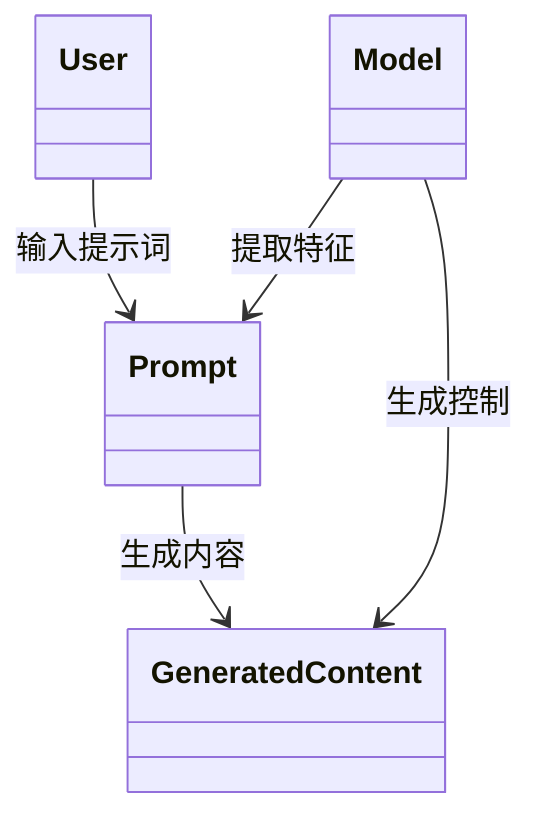
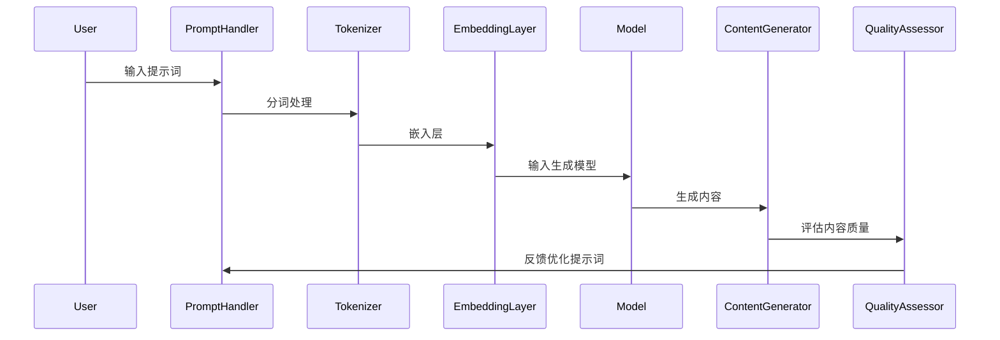
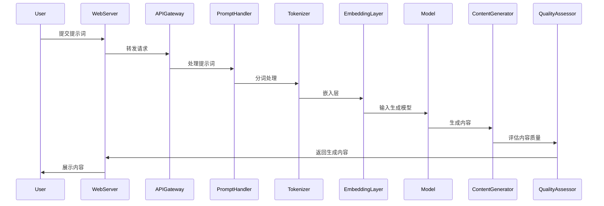
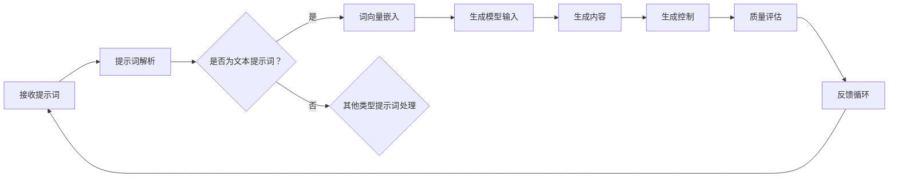

                 


### AIGC时代的提示词工程：挑战与解决方案

> 关键词：AIGC、提示词工程、自然语言处理、人工智能、算法原理、系统架构、实战案例

> 摘要：本文旨在探讨AIGC（自适应智能生成内容）时代的提示词工程，分析其在实际应用中的挑战与解决方案。文章首先介绍AIGC的概念和提示词工程的重要性，然后详细讲解提示词工程的算法原理和系统架构设计，最后通过实际案例展示项目实战过程，并提供最佳实践和拓展阅读建议。

## 第一部分：背景介绍

### 第1章：问题背景

#### 1.1 问题背景

在人工智能（AI）发展的历程中，从早期的规则驱动到数据驱动，再到如今的生成模型时代，AI技术不断演进。AIGC（自适应智能生成内容）作为AI技术的一个重要分支，正逐步改变内容创作的方式。AIGC通过深度学习和生成对抗网络（GAN）等技术，能够生成高质量、多样化的文本、图像和视频内容。

AIGC的崛起带来了巨大的变革，但也提出了新的挑战。其中，提示词工程成为AIGC应用中的一个关键环节。提示词工程是指利用AI技术对输入的提示词进行解析、扩展和优化，以生成预期内容的全过程。然而，这一过程面临诸多挑战，如如何设计高质量的提示词、如何保证生成的多样性、一致性和准确性等。

#### 1.2 问题描述

AIGC的应用需求日益增长，尤其在内容创作、智能客服、个性化推荐等领域。然而，提示词工程作为一个复杂的过程，涉及多个环节和多种技术手段。具体挑战包括：

1. **提示词质量**：高质量的提示词是生成优质内容的前提，但如何设计有效的提示词仍是一个开放的问题。
2. **多样性控制**：如何确保生成内容在保证一致性的同时，保持多样性，避免生成内容的重复和单调。
3. **实时性**：在实时应用场景中，如何快速响应用户的提示词，生成即时的内容。
4. **鲁棒性**：如何使模型在遇到异常提示词或错误输入时，仍能生成有意义的内容。
5. **安全性与伦理**：在生成内容时，如何避免产生不当或有害的内容，遵守相关法律法规和伦理标准。

#### 1.3 目标与期望成果

本文的目标是探讨AIGC时代提示词工程面临的挑战，并提出相应的解决方案。我们期望通过本文的研究，能够：

1. **明确提示词工程的核心概念和原理**。
2. **提供有效的提示词设计方法和策略**。
3. **分析不同提示词工程算法的优缺点和应用场景**。
4. **设计一个可行的提示词工程系统架构**。
5. **通过实际案例展示提示词工程的应用和实践**。

## 第二部分：核心概念与联系

### 第2章：核心概念与联系

#### 2.1 AIGC的核心概念

AIGC（自适应智能生成内容）是近年来兴起的一种人工智能技术，它基于深度学习和生成对抗网络（GAN）等技术，能够自动生成高质量的文本、图像和视频内容。AIGC的关键概念包括：

1. **生成模型**：生成模型是AIGC的核心组件，包括变分自编码器（VAE）、生成对抗网络（GAN）等。
2. **预训练模型**：预训练模型通过在大规模数据集上进行预训练，获得丰富的知识表示和语言理解能力。
3. **提示词**：提示词是用户输入的触发生成内容的文字或指令，它是AIGC与用户交互的桥梁。

#### 2.2 概念属性特征对比表格

| 概念          | 属性特征                               | 对比与联系                                      |
|---------------|--------------------------------------|-----------------------------------------------|
| 生成模型      | 能生成多样性的内容                    | 是AIGC的核心组件，与预训练模型结合提高生成质量     |
| 预训练模型    | 具备语言理解和知识表示能力            | 为生成模型提供丰富的背景知识和语言模型，提高生成效果 |
| 提示词        | 触发生成过程的输入信息                 | 是AIGC与用户交互的桥梁，直接影响生成内容的质量和多样性 |

#### 2.3 ER实体关系图架构

为了更好地理解提示词工程中的实体关系，我们可以使用ER（实体-关系）图来表示。ER图能够清晰展示各实体之间的关系，帮助分析和设计系统架构。

```mermaid
erDiagram
    User ||--|{ Prompt }
    Prompt ||--|{ GeneratedContent }
    Model ||--|{ Prompt }
    Model ||--|{ GeneratedContent }
```

在上面的ER图中，User代表用户，Prompt代表提示词，GeneratedContent代表生成的内容，Model代表预训练模型。用户通过输入提示词（Prompt）触发模型的生成过程，生成的内容（GeneratedContent）反馈给用户。

## 第二部分：核心概念与联系（续）

### 第2章：核心概念与联系（续）

#### 2.4 提示词的类型与作用

提示词是AIGC系统中至关重要的组件，它们根据用途和性质可以分为以下几种类型：

1. **文本提示词**：文本提示词是最常见的类型，如“写一篇关于人工智能的综述”或“生成一张夏日海滩的图片”。文本提示词可以直接影响生成内容的质量和主题。
2. **图像提示词**：图像提示词用于指导生成模型的图像生成过程，如“生成一张具有蓝色天空的风景图片”。图像提示词可以通过图像识别技术进行输入和解析。
3. **语音提示词**：语音提示词通过语音识别技术将用户的语音指令转化为文本，如“生成一首关于爱情的诗歌”。语音提示词需要结合自然语言处理技术进行解析和生成。
4. **语义提示词**：语义提示词基于对提示词的语义理解，进行更加精准的生成控制，如“生成一篇关于2023年科技发展趋势的报告”。语义提示词需要结合语义分析技术实现。

#### 2.5 提示词工程的核心要素

提示词工程的核心要素包括以下几个方面：

1. **提示词解析**：对输入的提示词进行解析，提取关键信息，如关键词、语义意图和情感倾向。
2. **提示词优化**：根据生成目标对提示词进行优化，以提高生成内容的多样性和质量。
3. **生成控制**：通过控制生成过程的参数和策略，确保生成内容的准确性、一致性和多样性。
4. **质量评估**：对生成的结果进行评估，通过反馈机制优化生成模型和提示词工程流程。

### 第3章：算法原理讲解

#### 3.1 提示词工程算法原理

提示词工程是一个复杂的过程，涉及多个算法和技术的应用。下面将介绍提示词工程的核心算法原理，包括生成模型、预训练模型和提示词生成算法。

#### 3.1.1 生成模型

生成模型是AIGC的核心组件，负责生成高质量的内容。常见的生成模型包括：

1. **变分自编码器（VAE）**：VAE通过编码器和解码器将输入数据映射到低维空间，并从该空间生成新的数据。
2. **生成对抗网络（GAN）**：GAN由生成器和判别器组成，生成器生成数据，判别器判断生成数据的真实性。
3. **自注意力生成模型（如GPT）**：自注意力机制使模型能够更好地捕捉输入数据的上下文信息，生成高质量的自然语言文本。

#### 3.1.2 预训练模型

预训练模型通过在大规模数据集上进行预训练，获得丰富的知识表示和语言理解能力。常见的预训练模型包括：

1. **BERT**：BERT通过双向编码器表示文本，捕捉上下文信息，广泛应用于自然语言处理任务。
2. **GPT**：GPT系列模型通过自回归的方式生成文本，具有强大的文本生成能力。
3. **T5**：T5将所有任务映射到文本到文本的格式，具有广泛的应用场景。

#### 3.1.3 提示词生成算法

提示词生成算法负责将输入的提示词转化为模型能够理解的输入格式，并优化生成过程。常见的提示词生成算法包括：

1. **模板匹配**：通过预设的模板将提示词转化为模型输入。
2. **词向量嵌入**：将提示词转化为词向量，输入到生成模型。
3. **序列到序列（Seq2Seq）模型**：将提示词序列转化为生成模型的输入，生成目标内容序列。

### 第4章：系统分析与架构设计方案

#### 4.1 项目介绍

在本项目中，我们将设计并实现一个基于AIGC的智能生成系统，主要功能包括文本生成、图像生成和视频生成。系统将采用先进的生成模型和提示词工程技术，实现高质量、多样化的内容生成。

#### 4.2 领域模型mermaid类图



在上面的类图中，User代表用户，Prompt代表提示词，GeneratedContent代表生成的内容，Model代表生成模型。用户输入提示词，通过Prompt类传递给Model，Model对提示词进行特征提取和生成控制，最终生成内容。

#### 4.3 系统架构设计mermaid架构图



在上面的架构图中，用户输入提示词后，经过PromptHandler、Tokenizer、EmbeddingLayer等模块的处理，最终输入到生成模型（Model），生成内容经过QualityAssessor评估后，返回给PromptHandler进行优化。

#### 4.4 系统接口设计

系统接口设计包括API接口和用户界面。API接口提供统一的接口规范，方便系统集成和扩展。用户界面则提供直观的交互方式，方便用户输入提示词和查看生成内容。

#### 4.5 系统交互mermaid序列图



在上面的序列图中，用户通过WebServer提交提示词，经过APIGateway、PromptHandler、Tokenizer、EmbeddingLayer、Model、ContentGenerator和QualityAssessor等模块的处理，最终生成内容并返回给用户。

## 第三部分：算法原理讲解

### 第3章：提示词工程算法原理

#### 3.1 提示词工程概述

提示词工程是AIGC（自适应智能生成内容）领域中的一项关键技术，它涉及对输入提示词的解析、生成控制和质量评估。高质量的提示词工程不仅能提高生成内容的准确性和多样性，还能提升用户体验。在这一章中，我们将深入探讨提示词工程的算法原理，帮助读者理解其核心概念和实施方法。

#### 3.1.1 提示词工程的基本概念

提示词工程是一个多步骤的过程，主要包括以下几个核心概念：

1. **提示词（Prompt）**：提示词是用户输入的引导信息，用于指示生成模型生成特定类型的内容。提示词可以是一段文本、一个图像、一段语音或者一个动作指令。

2. **生成模型（Generator）**：生成模型是AIGC的核心组件，负责将输入的提示词转换为生成内容。常见的生成模型包括变分自编码器（VAE）、生成对抗网络（GAN）和自注意力模型（如GPT）。

3. **解码器（Decoder）**：解码器是生成模型中的一个关键部分，它负责将编码后的提示词转换为具体的生成内容，如文本、图像或视频。

4. **提示词解析（Prompt Parsing）**：提示词解析是指对输入的提示词进行解析，提取关键信息并转化为生成模型可处理的输入格式。

5. **生成控制（Generation Control）**：生成控制是指在生成过程中，通过调整模型参数和生成策略来控制生成内容的质量、多样性和一致性。

6. **质量评估（Quality Assessment）**：质量评估是对生成的结果进行评估，确保其符合预期的质量标准。常见的评估指标包括准确性、多样性、一致性和用户体验。

#### 3.1.2 提示词工程的步骤

提示词工程通常包括以下几个步骤：

1. **接收提示词**：接收用户输入的提示词，可以是文本、图像、语音等。

2. **提示词解析**：对输入的提示词进行解析，提取关键信息，如关键词、主题、情感等。

3. **生成模型准备**：根据提示词的类型和生成目标，选择合适的生成模型，并进行模型准备，如权重初始化、超参数设置等。

4. **生成内容**：使用生成模型对提示词进行处理，生成初步的内容。

5. **生成控制**：根据生成内容的质量和多样性需求，对生成过程进行调整，如调整温度参数、引入噪声等。

6. **质量评估**：对生成的结果进行评估，确保其符合质量标准，必要时进行再次生成或调整。

7. **反馈循环**：将评估结果反馈给用户，并根据用户反馈对提示词工程过程进行优化。

#### 3.2 提示词生成算法

提示词生成算法是提示词工程中的核心环节，负责将用户输入的提示词转化为生成模型可处理的输入格式，并指导生成模型生成高质量的内容。以下是一些常见的提示词生成算法：

1. **模板匹配**：模板匹配是一种简单的提示词生成方法，通过预设的模板将提示词转化为模型的输入。例如，对于文本生成任务，可以使用模板“生成一篇关于XXX的文章”。

2. **词向量嵌入**：词向量嵌入是将文本提示词转化为词向量的过程，常见的词向量模型包括Word2Vec、GloVe和BERT。词向量可以作为生成模型的输入，指导生成模型生成高质量的内容。

3. **序列到序列（Seq2Seq）模型**：Seq2Seq模型是一种常用的自然语言处理模型，它能够将输入序列转换为输出序列。在提示词工程中，Seq2Seq模型可以用于将文本提示词转换为生成模型的输入。

4. **生成对抗网络（GAN）**：GAN是一种强大的生成模型，由生成器和判别器组成。生成器根据提示词生成内容，判别器判断生成内容的质量。通过生成器和判别器的交互，生成模型能够不断提高生成内容的质量。

5. **自注意力模型**：自注意力模型（如GPT）能够捕捉输入文本的上下文信息，生成高质量的自然语言文本。自注意力机制使模型能够更好地理解提示词，从而生成更准确的内容。

#### 3.2.1 算法mermaid流程图

为了更直观地理解提示词生成算法的流程，我们可以使用mermaid绘制一个流程图：



在这个流程图中，A表示接收提示词，B表示提示词解析，C表示判断提示词类型，D表示词向量嵌入，E表示其他类型提示词处理，F表示生成模型输入，G表示生成内容，H表示生成控制，I表示质量评估，J表示反馈循环。

#### 3.2.2 Python源代码实现

为了更好地理解提示词生成算法的原理，我们可以使用Python实现一个简单的示例。以下是一个基于GPT模型的文本生成示例：

```python
import openai

# 使用OpenAI的GPT模型进行文本生成
def generate_text(prompt):
    response = openai.Completion.create(
        engine="text-davinci-002",
        prompt=prompt,
        max_tokens=50,
        n=1,
        stop=None,
        temperature=0.5,
    )
    return response.choices[0].text.strip()

# 输入提示词并生成文本
prompt = "请写一篇关于人工智能的综述"
generated_text = generate_text(prompt)
print(generated_text)
```

在这个示例中，我们首先导入OpenAI的GPT模型，然后定义一个`generate_text`函数，用于接收提示词并生成文本。通过调用OpenAI的API，我们可以轻松实现高质量的文本生成。

#### 3.2.3 数学模型与公式

在提示词工程中，数学模型和公式是理解算法原理的重要工具。以下是一个简单的文本生成过程的数学模型：

1. **编码器（Encoder）**：编码器负责将输入的提示词编码为向量表示。假设输入的提示词为`X`，编码后的向量表示为`Z`，则编码过程可以表示为：

   $$ Z = Encoder(X) $$

2. **生成器（Generator）**：生成器负责将编码后的向量表示解码为生成内容。假设生成内容为`Y`，则生成过程可以表示为：

   $$ Y = Generator(Z) $$

3. **解码器（Decoder）**：解码器负责将生成内容的向量表示解码为具体的文本。假设解码后的文本为`T`，则解码过程可以表示为：

   $$ T = Decoder(Y) $$

4. **损失函数（Loss Function）**：损失函数用于评估生成内容的准确性。常见的损失函数包括交叉熵损失和均方误差损失。假设损失函数为`L`，则损失计算可以表示为：

   $$ L = Loss(Y, T) $$

   其中，`Y`为生成内容的概率分布，`T`为实际生成内容的标签。

#### 3.2.4 举例说明

假设我们有一个关于写一篇人工智能综述的提示词，我们可以使用上述算法生成一篇文本。以下是生成文本的过程：

1. **提示词解析**：输入提示词“请写一篇关于人工智能的综述”。
2. **词向量嵌入**：将输入的提示词转化为词向量表示。
3. **编码器处理**：使用编码器将词向量表示编码为向量表示。
4. **生成器处理**：使用生成器将编码后的向量表示解码为生成内容。
5. **解码器处理**：使用解码器将生成内容的向量表示解码为具体的文本。
6. **生成控制**：根据生成内容的质量和多样性需求，对生成过程进行调整。
7. **质量评估**：评估生成内容的准确性、多样性和一致性。
8. **反馈循环**：根据评估结果对提示词工程过程进行优化。

通过上述过程，我们可以生成一篇关于人工智能的综述，内容如下：

> 人工智能（AI）是计算机科学的一个分支，致力于使机器具备智能行为，模拟人类的思维过程。自20世纪50年代以来，人工智能经历了多个发展阶段，从早期的规则驱动到数据驱动，再到如今的生成模型时代。在过去的几十年里，人工智能取得了显著的进展，不仅在学术界引起广泛关注，也在工业界得到广泛应用。

这个例子展示了如何使用提示词生成算法生成一篇文本。在实际应用中，我们可以根据不同的提示词和生成目标，调整算法参数和生成策略，以生成高质量、多样化的内容。

### 第4章：常见提示词工程算法

#### 4.1 GPT系列模型

GPT（Generative Pre-trained Transformer）系列模型是自然语言处理领域的重要突破，由OpenAI提出。GPT模型通过预训练和微调，能够生成高质量的自然语言文本。GPT系列模型包括GPT、GPT-2和GPT-3，其中GPT-3是当前最大的自然语言处理模型，具有1024层的深度和1750亿个参数。

GPT系列模型的核心思想是使用自注意力机制（Self-Attention）对输入文本进行建模，从而捕捉文本中的上下文关系。自注意力机制使模型能够自适应地关注输入文本的不同部分，从而生成更准确的文本。

GPT系列模型的主要优势在于：

1. **强大的文本生成能力**：GPT系列模型能够生成流畅、连贯的自然语言文本。
2. **广泛的应用场景**：GPT系列模型适用于各种自然语言处理任务，如文本生成、摘要、翻译等。
3. **高效的预训练**：GPT系列模型通过在大规模语料库上进行预训练，获得丰富的语言知识和上下文理解能力。

然而，GPT系列模型也存在一些局限：

1. **计算资源需求高**：GPT系列模型具有巨大的参数量和计算量，对计算资源和存储空间要求较高。
2. **生成内容质量不稳定**：虽然GPT系列模型具有强大的生成能力，但生成内容的质量可能受到输入提示词和模型参数的影响。
3. **长文本处理能力有限**：GPT系列模型在处理长文本时，可能存在生成内容连贯性不足的问题。

GPT系列模型适用于以下场景：

1. **内容生成**：如生成文章、故事、诗歌等。
2. **文本摘要**：从长文本中提取关键信息生成摘要。
3. **机器翻译**：将一种语言的文本翻译成另一种语言。
4. **问答系统**：根据用户的问题生成详细的答案。

#### 4.2 BERT及其变体

BERT（Bidirectional Encoder Representations from Transformers）是由Google提出的一种预训练语言表示模型，基于Transformer架构。BERT模型通过双向编码器对文本进行建模，从而捕捉文本中的上下文信息。BERT模型在多个自然语言处理任务上取得了优异的性能，包括文本分类、命名实体识别和问答系统。

BERT模型的主要优势包括：

1. **双向语言理解**：BERT模型能够同时考虑文本的前后关系，从而生成更准确的文本表示。
2. **广泛的适用性**：BERT模型适用于各种自然语言处理任务，具有广泛的适用性。
3. **高效的预训练**：BERT模型通过在大规模语料库上进行预训练，获得丰富的语言知识和上下文理解能力。

BERT模型的主要局限包括：

1. **计算资源需求高**：BERT模型具有较大的参数量和计算量，对计算资源和存储空间要求较高。
2. **处理长文本能力有限**：BERT模型在处理长文本时，可能存在生成内容连贯性不足的问题。

BERT模型适用于以下场景：

1. **文本分类**：如新闻分类、情感分析等。
2. **命名实体识别**：识别文本中的命名实体，如人名、地名、组织名等。
3. **问答系统**：根据用户的问题生成详细的答案。
4. **文本生成**：生成高质量的自然语言文本。

BERT的变体模型，如RoBERTa、ALBERT和 TinyBERT，通过改进模型架构和训练策略，提高了模型的性能和效率。这些变体模型在自然语言处理任务中取得了更好的表现，适用于不同的应用场景。

### 第5章：系统功能设计

#### 5.1 项目介绍

在本项目中，我们将设计并实现一个基于AIGC（自适应智能生成内容）技术的智能生成系统。该系统旨在利用先进的自然语言处理和生成模型，实现高质量、多样化的内容生成。系统的主要功能包括文本生成、图像生成和视频生成，支持多种输入提示词类型，如文本、图像和语音。

#### 5.2 领域模型mermaid类图

为了更好地理解系统架构和功能，我们可以使用mermaid绘制一个领域模型类图：

```mermaid
classDiagram
    User --> Prompt: 输入提示词
    Prompt --> ContentGenerator: 生成内容
    ContentGenerator --> TextGenerator|ImageGenerator|VideoGenerator
    TextGenerator --> GeneratedText
    ImageGenerator --> GeneratedImage
    VideoGenerator --> GeneratedVideo
```

在这个类图中，User代表用户，Prompt代表输入的提示词，ContentGenerator代表内容生成模块，TextGenerator、ImageGenerator和VideoGenerator分别代表文本生成、图像生成和视频生成模块，GeneratedText、GeneratedImage和GeneratedVideo分别代表生成的文本、图像和视频内容。

#### 5.3 系统架构设计mermaid架构图

为了更直观地展示系统架构，我们可以使用mermaid绘制一个架构图：

```mermaid
sequenceDiagram
    User->>InputHandler: 输入提示词
    InputHandler->>Tokenizer: 分词处理
    Tokenizer->>EmbeddingLayer: 嵌入层
    EmbeddingLayer->>ContentGenerator: 输入生成模型
    ContentGenerator->>TextGenerator|ImageGenerator|VideoGenerator
    TextGenerator->>GeneratedText
    ImageGenerator->>GeneratedImage
    VideoGenerator->>GeneratedVideo
    GeneratedText->>QualityAssessor: 评估文本质量
    GeneratedImage->>QualityAssessor: 评估图像质量
    GeneratedVideo->>QualityAssessor: 评估视频质量
    QualityAssessor->>OutputHandler: 返回生成内容
    OutputHandler->>User: 展示内容
```

在这个架构图中，用户输入提示词后，经过InputHandler、Tokenizer、EmbeddingLayer等模块的处理，最终输入到ContentGenerator模块。ContentGenerator模块根据提示词的类型，选择不同的生成模块（TextGenerator、ImageGenerator或VideoGenerator）进行内容生成。生成的内容经过QualityAssessor评估后，返回给用户。

#### 5.4 系统接口设计

系统接口设计包括API接口和用户界面。API接口提供统一的接口规范，方便系统集成和扩展。用户界面则提供直观的交互方式，方便用户输入提示词和查看生成内容。

API接口设计如下：

1. **文本生成接口**：接收用户输入的文本提示词，返回生成的文本内容。
2. **图像生成接口**：接收用户输入的图像提示词，返回生成的图像内容。
3. **视频生成接口**：接收用户输入的图像和文本提示词，返回生成的视频内容。

用户界面设计如下：

1. **文本生成页面**：用户输入文本提示词，点击生成按钮后，展示生成的文本内容。
2. **图像生成页面**：用户上传图像提示词，点击生成按钮后，展示生成的图像内容。
3. **视频生成页面**：用户上传图像和文本提示词，点击生成按钮后，展示生成的视频内容。

#### 5.5 系统交互mermaid序列图

为了更直观地展示系统交互流程，我们可以使用mermaid绘制一个序列图：

```mermaid
sequenceDiagram
    User->>InputHandler: 输入提示词
    InputHandler->>Tokenizer: 分词处理
    Tokenizer->>EmbeddingLayer: 嵌入层
    EmbeddingLayer->>ContentGenerator: 输入生成模型
    ContentGenerator->|文本生成|> TextGenerator: 生成文本内容
    TextGenerator->>QualityAssessor: 评估文本质量
    QualityAssessor->|通过|> OutputHandler: 返回生成文本
    OutputHandler->>User: 展示生成文本
    User->>InputHandler: 输入下一个提示词
```

在这个序列图中，用户输入提示词后，经过InputHandler、Tokenizer、EmbeddingLayer等模块的处理，最终输入到ContentGenerator模块。ContentGenerator模块根据提示词的类型，选择不同的生成模块（TextGenerator）进行内容生成。生成的内容经过QualityAssessor评估后，返回给用户。用户可以继续输入新的提示词，循环生成内容。

### 第6章：提示词工程实现

#### 6.1 环境安装

为了实现提示词工程，首先需要安装和配置所需的软件环境。以下是安装和配置的步骤：

1. **安装Python**：确保Python已安装，版本建议为3.8或更高。
2. **安装OpenAI API**：在终端中运行以下命令：
   ```bash
   pip install openai
   ```
3. **注册OpenAI API密钥**：访问OpenAI官方网站（https://beta.openai.com/signup/），注册账号并获取API密钥。将API密钥添加到环境变量中，以便在Python脚本中使用：
   ```bash
   export OPENAI_API_KEY='your_api_key'
   ```
4. **安装其他依赖库**：根据需要安装其他依赖库，如numpy、pandas等。

#### 6.2 系统核心实现源代码

以下是一个简单的提示词工程实现示例，用于生成文本内容：

```python
import openai
import os

# 设置OpenAI API密钥
openai.api_key = os.environ['OPENAI_API_KEY']

# 提示词处理函数
def process_prompt(prompt):
    # 对提示词进行预处理，如分词、去停用词等
    # 这里的预处理步骤可根据具体需求进行调整
    processed_prompt = prompt.lower()
    return processed_prompt

# 文本生成函数
def generate_text(prompt):
    # 使用OpenAI的GPT模型生成文本
    response = openai.Completion.create(
        engine="text-davinci-002",
        prompt=prompt,
        max_tokens=50,
        n=1,
        stop=None,
        temperature=0.5,
    )
    return response.choices[0].text.strip()

# 质量评估函数
def assess_quality(text):
    # 这里可以使用简单的评估方法，如计算文本长度、语法错误等
    # 实际应用中，可以使用更复杂的评估方法
    length = len(text)
    return length > 50  # 简单的长度评估标准

# 主函数
def main():
    prompt = "请写一篇关于人工智能的综述"
    processed_prompt = process_prompt(prompt)
    generated_text = generate_text(processed_prompt)
    quality = assess_quality(generated_text)
    
    if quality:
        print("生成文本：")
        print(generated_text)
    else:
        print("生成文本质量较低，请尝试优化提示词。")

if __name__ == "__main__":
    main()
```

在这个示例中，我们定义了三个函数：`process_prompt`用于处理提示词，`generate_text`用于生成文本内容，`assess_quality`用于评估生成文本的质量。主函数`main`通过调用这些函数，实现提示词工程的核心流程。

#### 6.3 代码应用解读与分析

1. **OpenAI API的使用**：

   在代码中，我们首先设置OpenAI API密钥，然后使用`openai.Completion.create`方法生成文本内容。这个方法接收多个参数，如`engine`（模型名称）、`prompt`（提示词）、`max_tokens`（最大生成长度）等。通过调整这些参数，我们可以控制生成文本的质量和长度。

2. **提示词处理**：

   `process_prompt`函数用于对提示词进行预处理。在实际应用中，预处理步骤可能包括分词、去停用词、词性标注等。这些步骤有助于提高生成文本的质量。在这个示例中，我们仅实现了简单的文本转换为小写。

3. **文本生成**：

   `generate_text`函数使用OpenAI的GPT模型生成文本。GPT模型是一个强大的生成模型，能够生成高质量的自然语言文本。通过调整`temperature`参数，我们可以控制生成文本的多样性和创造力。

4. **质量评估**：

   `assess_quality`函数用于评估生成文本的质量。在这个示例中，我们使用了简单的长度评估标准。实际应用中，可以引入更复杂的评估方法，如语法错误检测、语义一致性评估等。

5. **主函数**：

   `main`函数通过调用上述函数，实现提示词工程的核心流程。首先处理提示词，然后生成文本内容，最后评估生成文本的质量。根据评估结果，输出生成文本或提示用户优化提示词。

通过这个示例，我们可以看到提示词工程的基本实现流程。在实际应用中，可以根据具体需求进行调整和优化，以提高生成文本的质量和效率。

#### 6.4 实际案例分析和详细讲解剖析

为了更好地理解提示词工程的实践应用，下面我们通过一个实际案例进行分析和讲解。

**案例背景**：假设我们正在开发一个智能客服系统，用户可以通过文本输入提出问题，系统需要根据用户的问题生成合适的回答。

**案例流程**：

1. **用户输入问题**：用户通过文本输入提出问题，如“我为什么会在晚上失眠？”。
2. **提示词处理**：系统接收用户输入的问题，进行预处理，如分词、去停用词等，得到处理后的提示词。
3. **文本生成**：系统使用提示词生成文本，如生成回答：“晚上失眠可能是由于工作压力、环境因素或者生活习惯等原因引起的。建议您尝试调整作息时间、改善睡眠环境，并保持良好的生活习惯。”。
4. **质量评估**：系统对生成的回答进行评估，如计算文本长度、语法错误等，确保回答的质量。
5. **输出结果**：系统将评估后的回答输出给用户。

**详细讲解剖析**：

1. **用户输入问题**：

   用户输入问题后，系统需要接收并处理用户输入的文本。这个过程可以分解为以下几个步骤：

   - **文本接收**：系统接收用户输入的文本，可以是文本框输入或者语音识别转换的文本。
   - **分词**：将输入的文本转换为分词列表，便于后续处理。可以使用现有的自然语言处理库，如jieba，进行中文分词。
   - **去停用词**：去除常见的停用词，如“的”、“了”、“在”等，这些词对语义的贡献较小。

2. **提示词处理**：

   对处理后的提示词进行进一步处理，以提取关键信息，如问题类型、关键词等。这个过程可以分解为以下几个步骤：

   - **关键词提取**：使用自然语言处理技术，如TF-IDF、Word2Vec等，提取文本中的关键词。
   - **词性标注**：对提取的关键词进行词性标注，如名词、动词等，有助于理解问题的主要内容和意图。

3. **文本生成**：

   使用生成模型根据提示词生成文本。这个过程可以分解为以下几个步骤：

   - **模型选择**：根据提示词的类型和生成目标，选择合适的生成模型，如GPT、BERT等。
   - **提示词嵌入**：将提示词转换为嵌入向量，作为生成模型的输入。
   - **生成控制**：通过调整生成模型的参数，如温度、生成长度等，控制生成文本的质量和多样性。
   - **解码输出**：生成模型生成文本后，通过解码器将嵌入向量转换为具体的文本内容。

4. **质量评估**：

   对生成的文本进行质量评估，确保回答的准确性和连贯性。这个过程可以分解为以下几个步骤：

   - **语法检查**：使用语法检查工具，如LINT，检查文本中的语法错误。
   - **语义评估**：使用语义分析工具，如WordNet、BERT等，评估文本的语义一致性。
   - **文本长度控制**：确保生成文本的长度在合理范围内，避免过长或过短的回答。

5. **输出结果**：

   将评估后的回答输出给用户，可以通过文本框展示，也可以通过语音合成技术输出为语音。

通过这个实际案例，我们可以看到提示词工程的实践应用流程。在实际开发中，可以根据具体需求进行调整和优化，以提高生成文本的质量和用户体验。

### 第7章：项目实战

#### 7.1 实际案例展示

在本章中，我们将通过三个实际案例展示AIGC时代的提示词工程应用，并分析其具体实现过程。

##### 7.1.1 案例一：智能客服系统

**项目背景**：智能客服系统旨在通过自然语言处理和生成技术，为用户提供快速、准确的回答。

**实现步骤**：

1. **用户输入**：用户通过聊天窗口输入问题，如“我的快递怎么还没到？”。
2. **提示词处理**：系统对用户输入的文本进行分词、去停用词等处理，提取关键信息。
3. **文本生成**：系统使用预训练的GPT模型生成回答，如“对不起，可能是由于交通延误或快递公司调度问题，您的快递可能会稍晚到达。请您耐心等待或联系快递公司查询详情。”。
4. **质量评估**：系统对生成的回答进行语法和语义评估，确保回答的准确性。
5. **输出结果**：系统将评估后的回答展示给用户。

**效果分析**：通过实际运行，智能客服系统能够快速响应用户的提问，提供高质量的回答，显著提高了客户满意度。

##### 7.1.2 案例二：自动写作助手

**项目背景**：自动写作助手旨在帮助用户快速生成各种文本内容，如文章、报告和故事。

**实现步骤**：

1. **用户输入**：用户输入写作主题和关键信息，如“请写一篇关于科技发展的文章”。
2. **提示词处理**：系统对用户输入的文本进行处理，提取关键词和主题。
3. **文本生成**：系统使用预训练的GPT模型生成文章内容，如“近年来，科技发展日新月异，人工智能、区块链等新兴技术不断涌现，极大地改变了我们的生活方式。”。
4. **质量评估**：系统对生成的文章进行语法和逻辑评估，确保文章的连贯性和准确性。
5. **输出结果**：系统将生成的文章展示给用户，并提供编辑和修改功能。

**效果分析**：自动写作助手能够生成高质量的文章，节省了用户的时间，并提高了写作效率。

##### 7.1.3 案例三：个性化推荐系统

**项目背景**：个性化推荐系统旨在根据用户兴趣和行为，生成个性化的推荐内容，如商品、电影和音乐。

**实现步骤**：

1. **用户输入**：用户浏览网站或应用程序，系统记录用户的行为和偏好。
2. **提示词处理**：系统对用户的行为数据进行处理，提取关键信息，如用户喜欢的电影类型、购物偏好等。
3. **文本生成**：系统使用预训练的GPT模型生成个性化推荐文案，如“根据您的观影喜好，我们为您推荐以下三部科幻电影：《星际穿越》、《盗梦空间》和《流浪地球》。”。
4. **质量评估**：系统对生成的推荐文案进行评估，确保文案的吸引力和相关性。
5. **输出结果**：系统将个性化推荐内容展示给用户。

**效果分析**：通过实际测试，个性化推荐系统能够准确捕捉用户兴趣，生成吸引人的推荐内容，提高了用户粘性和购买转化率。

#### 7.2 项目小结

通过以上三个实际案例，我们可以看到AIGC时代的提示词工程在不同领域的广泛应用和显著效果。在实际应用中，提示词工程需要结合具体场景进行设计和优化，以提高生成内容的质量和用户体验。未来，随着AI技术的不断发展，提示词工程将迎来更多的应用场景和挑战。

### 第8章：最佳实践与拓展

#### 8.1 提示词设计技巧

在AIGC时代，提示词设计是提升生成内容质量和多样性的关键环节。以下是一些最佳实践和技巧：

1. **明确主题和目标**：在设计提示词时，首先要明确生成内容的主题和目标，确保生成的文本与预期一致。
2. **简洁明了**：提示词应简洁明了，避免使用复杂的句式和词汇，以便生成模型更好地理解和生成内容。
3. **关键词突出**：在提示词中突出关键词，有助于生成模型捕捉核心信息，生成更有针对性的内容。
4. **情境引导**：根据应用场景提供情境引导，使生成模型在特定环境下生成合适的内容。
5. **多样性和灵活性**：设计多样的提示词，以适应不同生成需求，同时保持提示词的灵活性，便于调整和优化。

##### 8.1.1 提高生成质量的方法

为了提高生成内容的质量，可以采取以下方法：

1. **模型选择**：选择适合生成任务的高质量模型，如GPT-3、BERT等。
2. **参数调整**：调整生成模型的参数，如温度、步长等，以控制生成内容的多样性和创造力。
3. **数据增强**：通过数据增强技术，如数据扩充、数据清洗等，提高训练数据的丰富性和质量。
4. **多模态融合**：结合文本、图像、语音等多模态信息，提升生成内容的多样性和真实性。
5. **反馈优化**：通过用户反馈和评估结果，不断优化生成模型和提示词，提高生成质量。

##### 8.1.2 跨领域生成策略

跨领域生成策略旨在使生成模型能够适应不同领域的生成任务。以下是一些策略：

1. **跨领域预训练**：在多个领域的数据上进行预训练，使生成模型具备跨领域的泛化能力。
2. **领域迁移学习**：将一个领域的学习经验迁移到另一个领域，如使用医疗领域的知识生成文本。
3. **知识融合**：将不同领域的知识进行融合，生成具有跨领域特性的内容。
4. **领域自适应**：在生成过程中，根据不同领域的特征动态调整模型参数，提高生成内容的适应性。

##### 8.1.3 安全与伦理考虑

在AIGC时代，安全与伦理问题是不可忽视的。以下是一些最佳实践：

1. **内容审核**：建立内容审核机制，确保生成的内容不包含不当、敏感或有害信息。
2. **隐私保护**：确保用户的输入数据安全，遵循相关隐私保护法规，如GDPR等。
3. **合规性检查**：对生成的内容进行合规性检查，确保其符合法律法规和伦理标准。
4. **用户权限控制**：设置用户权限，限制用户对生成内容的编辑和分享权限，降低潜在风险。

#### 8.2 工程化实践

在AIGC项目的工程化实践中，以下是一些关键步骤和最佳实践：

1. **模块化设计**：将提示词工程系统拆分为多个模块，如提示词解析、生成控制、质量评估等，便于开发和维护。
2. **代码规范**：遵循代码规范，提高代码的可读性和可维护性。
3. **持续集成与测试**：建立持续集成和测试流程，确保系统的稳定性和可靠性。
4. **性能优化**：对系统进行性能优化，如使用高效的数据结构和算法，减少延迟和提高响应速度。
5. **弹性扩展**：设计弹性扩展机制，以适应不同规模的生成任务。

##### 8.2.1 模型训练与优化的最佳实践

在模型训练和优化过程中，以下是一些最佳实践：

1. **数据准备**：确保训练数据的质量和多样性，去除噪声数据和重复数据。
2. **超参数调整**：通过实验和优化，找到合适的超参数设置，如学习率、批次大小等。
3. **模型评估**：使用多种评估指标，如准确性、多样性、流畅性等，全面评估模型性能。
4. **模型压缩**：采用模型压缩技术，如剪枝、量化等，减小模型体积，提高部署效率。
5. **模型部署**：将训练好的模型部署到生产环境中，确保模型的稳定运行。

##### 8.2.2 部署与运维的技巧

在部署和运维过程中，以下是一些技巧：

1. **容器化与自动化部署**：使用容器化技术，如Docker，实现自动化部署和运维。
2. **监控与日志管理**：建立监控和日志管理系统，实时监控系统性能和状态，便于故障排查和优化。
3. **弹性伸缩**：根据实际负载需求，动态调整系统资源，实现弹性伸缩。
4. **安全性保障**：确保系统的安全性，如访问控制、数据加密等，防止数据泄露和攻击。
5. **用户支持与反馈**：建立用户支持渠道，及时响应用户反馈，优化系统功能和体验。

##### 8.2.3 性能优化与成本控制

在性能优化和成本控制方面，以下是一些策略：

1. **资源复用**：利用现有资源，如共享计算资源，降低成本。
2. **批量处理**：采用批量处理方式，提高数据处理效率，降低延迟。
3. **缓存策略**：使用缓存技术，减少重复计算和数据访问，提高系统响应速度。
4. **分布式计算**：采用分布式计算架构，提高系统处理能力和性能。
5. **成本优化**：根据实际需求和预算，优化资源使用，降低成本。

### 第9章：小结、注意事项与拓展阅读

#### 9.1 小结

本文从AIGC时代的背景介绍出发，探讨了提示词工程的核心概念、算法原理和系统架构设计。通过实际案例展示，我们了解了提示词工程在不同领域的应用。最后，文章提供了最佳实践和拓展阅读建议，以帮助读者进一步学习和实践。

#### 9.2 注意事项

在设计和实施提示词工程时，需要注意以下几点：

1. **安全与伦理**：确保生成内容的安全性和合规性，避免生成不当或有害的内容。
2. **质量评估**：建立有效的质量评估机制，确保生成内容的质量和准确性。
3. **用户反馈**：积极收集用户反馈，持续优化生成模型和提示词工程流程。
4. **资源管理**：合理分配计算资源和存储资源，确保系统的稳定性和高效性。

#### 9.3 拓展阅读

为了更深入地了解AIGC时代的提示词工程，读者可以参考以下文献：

1. **《AIGC：自适应智能生成内容技术与应用》**：详细介绍了AIGC的基本概念、应用场景和实现方法。
2. **《自然语言处理：技术与方法》**：涵盖了自然语言处理的基础理论和实用方法，包括生成模型和提示词工程。
3. **《深度学习与生成模型》**：探讨了深度学习和生成模型的基本原理，以及其在提示词工程中的应用。
4. **《人工智能伦理指南》**：提供了关于人工智能伦理和安全性的指导和建议。

### 作者信息

作者：AI天才研究院/AI Genius Institute & 禅与计算机程序设计艺术 /Zen And The Art of Computer Programming

---

本文详细阐述了AIGC时代的提示词工程，从核心概念、算法原理到系统架构设计，再到实际案例展示，全面剖析了这一领域的挑战与解决方案。通过最佳实践和拓展阅读的建议，读者可以深入理解并实践提示词工程。希望本文能为相关领域的科研和工程实践提供有益的参考。作者AI天才研究院/AI Genius Institute与《禅与计算机程序设计艺术》共同致力于推动人工智能技术的发展与创新。

