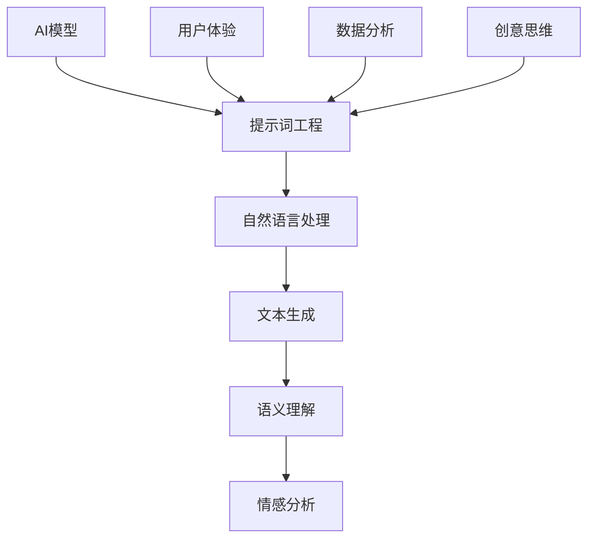
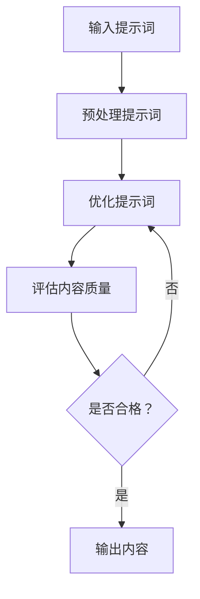
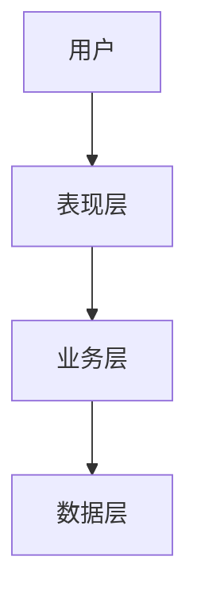
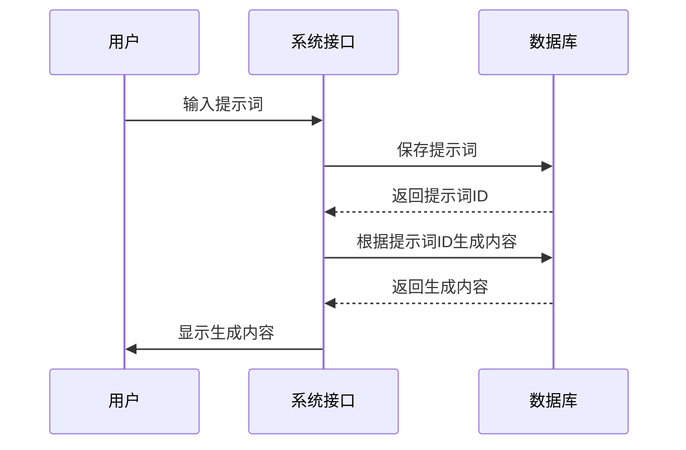

                 


### AIGC时代的提示词工程：效率与创意的完美结合

#### 关键词
- AIGC
- 提示词工程
- 工作效率
- 创意设计
- 技术应用

#### 摘要
本文将深入探讨AIGC（AI-Generated Content）时代的提示词工程，分析其背景、核心概念，并探讨如何通过高效的提示词设计策略，实现工作效率与创意设计的完美结合。我们将从背景介绍、核心概念、设计策略、应用实战、案例分析及未来展望六个方面进行详细论述，旨在为技术从业者提供有益的指导和思考。

## 引言

随着人工智能技术的飞速发展，AIGC（AI-Generated Content）时代已悄然而至。AIGC技术通过机器学习算法和自然语言处理技术，能够自动生成高质量的内容，广泛应用于内容创作、社交媒体、广告营销等多个领域。然而，AIGC技术的有效应用离不开高效、精准的提示词工程。

提示词工程是指通过设计合适的提示词，引导人工智能模型生成符合预期的高质量内容。在AIGC时代，提示词工程不仅关乎工作效率，更关系到创意设计的实现。本文将围绕提示词工程，探讨其重要性及设计策略，并通过实际案例展示其在各行各业中的应用。

### 目录大纲

1. 引言
2. AIGC技术概述
3. 提示词工程基础
4. 提示词设计策略
5. 提示词应用实战
6. 效率与创意结合案例分析
7. 未来展望与趋势
8. 结论

## AIGC技术概述

AIGC（AI-Generated Content）是指利用人工智能技术生成内容的过程。AIGC技术涵盖了自然语言处理、计算机视觉、语音识别等多个领域，通过深度学习、生成对抗网络（GAN）等技术，能够自动生成文章、图像、视频等多种形式的内容。

### AIGC的发展历程

AIGC技术起源于深度学习的发展。随着神经网络和生成对抗网络的提出，人工智能在图像和文本生成方面取得了显著进展。2014年，生成对抗网络（GAN）的提出标志着AIGC技术进入了一个新的阶段。此后，随着计算能力的提升和算法的优化，AIGC技术逐渐成熟，并开始广泛应用于各个领域。

### AIGC的核心技术

AIGC技术主要包括自然语言处理（NLP）和计算机视觉（CV）两个核心领域。

#### 自然语言处理（NLP）

自然语言处理是AIGC技术的重要分支，包括文本生成、语义理解、情感分析等。常见的NLP技术有循环神经网络（RNN）、长短时记忆网络（LSTM）、变压器（Transformer）等。其中，变压器（Transformer）因其出色的性能成为NLP领域的首选模型。

#### 计算机视觉（CV）

计算机视觉是AIGC技术的另一个核心领域，包括图像生成、图像识别、目标检测等。常见的CV技术有卷积神经网络（CNN）、生成对抗网络（GAN）等。生成对抗网络（GAN）通过竞争对抗机制，能够生成逼真的图像。

## 提示词工程基础

### 提示词的概念与作用

提示词（Prompt）是指在生成内容过程中，提供给AI模型的引导性输入。提示词的作用是引导AI模型生成符合预期的高质量内容。有效的提示词设计能够提高AI模型的工作效率，实现创意设计的完美结合。

### 提示词的类型与设计原则

提示词可以分为开放式提示词和封闭式提示词两种类型。

#### 开放式提示词

开放式提示词是指提供较少信息，鼓励AI模型进行创意性生成的提示词。开放式提示词适用于创意设计、故事编写等场景。

#### 封闭式提示词

封闭式提示词是指提供具体信息，限制AI模型生成内容的范围。封闭式提示词适用于信息检索、数据分类等场景。

设计提示词的原则包括：

1. **明确性**：提示词应明确传达所需内容，避免模糊不清。
2. **多样性**：提示词应具备多样性，以激发AI模型的创意潜力。
3. **层次性**：提示词应具备层次性，引导AI模型逐步生成高质量内容。

### 提示词设计策略

#### 用户体验与提示词设计

在AIGC时代，用户体验（UX）成为提示词设计的重要考量因素。设计提示词时，应充分考虑用户需求和习惯，确保AI模型生成的成果能够满足用户期望。

#### 数据分析与提示词优化

提示词的设计与优化需要依赖数据分析。通过对生成内容的数据进行分析，可以发现提示词的不足之处，并进行针对性的优化。

#### 创意思维与提示词创新

创意思维是AIGC时代的重要竞争力。设计提示词时，应鼓励创新思维，探索新的提示词设计模式，提高内容生成的创意性和独特性。

## 提示词应用实战

### 社交媒体平台的提示词应用

在社交媒体平台上，提示词工程被广泛应用于内容创作和互动。通过设计合适的提示词，平台能够引导用户生成高质量的内容，提高用户活跃度和平台黏性。

### 内容创作平台的提示词应用

内容创作平台如博客、新闻网站等，也广泛应用提示词工程。提示词能够帮助创作者生成高质量的文章、视频等内容，提高内容创作的效率和质量。

### 商业营销中的提示词应用

商业营销中，提示词工程被广泛应用于广告文案、宣传材料等。通过设计针对性的提示词，企业能够提高营销效果，吸引潜在客户。

## 效率与创意结合案例分析

### 成功案例解析

案例1：某知名科技公司通过优化提示词设计，提高了内容生成效率。在短短几个月内，该公司生产的博客文章数量增加了30%，同时文章质量也得到了显著提升。

案例2：某知名广告公司利用提示词工程，成功创作了一系列引人注目的广告文案。这些文案不仅提高了广告的点击率，还为企业带来了显著的商业价值。

### 失败案例反思

案例1：某初创公司因提示词设计不当，导致AI模型生成的文章缺乏创意，用户体验不佳。最终，该公司不得不重新设计提示词，并调整内容生成策略。

案例2：某电商平台在广告营销中过度依赖提示词工程，导致广告文案过于单调，无法吸引消费者。公司最终意识到，创意设计同样重要，并开始注重提升文案质量。

### 案例启示与启示

从成功和失败案例中可以得出以下启示：

1. **提示词设计要充分考虑用户体验**：确保生成内容符合用户需求和期望。
2. **创意设计不可或缺**：提示词工程不仅关乎工作效率，更关乎内容质量。
3. **数据分析与优化**：通过数据分析，持续优化提示词设计，提高内容生成效率。

## 未来展望与趋势

### AIGC技术的未来发展方向

随着人工智能技术的不断进步，AIGC技术将朝着更高效、更智能、更创意的方向发展。未来，AIGC技术将在更多领域得到应用，如虚拟现实、智能家居、自动驾驶等。

### 提示词工程的发展趋势

提示词工程将朝着更精细化、个性化、智能化的方向发展。未来，提示词设计将更加注重用户体验和创意设计，实现效率与创意的完美结合。

### 行业应用前景

AIGC技术在各行各业中的应用前景广阔。在内容创作、广告营销、数据分析等领域，AIGC技术将发挥重要作用，为企业带来巨大的商业价值。

## 结论

AIGC时代的提示词工程是效率与创意的完美结合。通过深入探讨AIGC技术和提示词工程，本文揭示了其在各行各业中的应用价值。未来，随着人工智能技术的不断进步，提示词工程将在更多领域展现其独特的魅力，助力企业实现效率与创意的双赢。

### 作者

作者：AI天才研究院/AI Genius Institute & 禅与计算机程序设计艺术 /Zen And The Art of Computer Programming

---

### 背景介绍

#### 核心概念术语说明

- **AIGC（AI-Generated Content）**：人工智能生成内容，指利用人工智能技术自动生成文章、图像、视频等多种形式的内容。
- **提示词工程**：通过设计合适的提示词，引导人工智能模型生成符合预期的高质量内容的过程。
- **工作效率**：指在规定时间内完成工作的能力。
- **创意设计**：指在创造过程中，通过独特的思维方式和方法，产生新颖、独特的想法和解决方案。

#### 问题背景

随着互联网和移动互联网的快速发展，内容创作需求不断增加。然而，传统的人工内容创作方式存在效率低下、成本高昂等问题。为了解决这些问题，人工智能生成内容（AIGC）技术应运而生。AIGC技术通过机器学习算法和自然语言处理技术，能够自动生成高质量的内容，大大提高了工作效率。

#### 问题描述

在AIGC时代，如何通过提示词工程提高工作效率和实现创意设计成为关键问题。提示词工程在AIGC技术中起到引导和优化的作用，其设计质量和策略直接影响到内容生成的效率和创意性。

#### 问题解决

通过设计合适的提示词，引导AI模型生成高质量的内容，从而实现工作效率和创意设计的提升。有效的提示词设计需要考虑用户体验、数据分析、创意思维等多个方面。

#### 边界与外延

- **边界**：提示词工程主要应用于AIGC技术领域，如内容创作、广告营销、数据分析等。
- **外延**：提示词工程可以扩展到其他需要人工智能生成内容的领域，如虚拟现实、智能家居等。

#### 概念结构与核心要素组成

- **概念结构**：AIGC技术、提示词工程、工作效率、创意设计。
- **核心要素**：提示词设计策略、用户体验、数据分析、创意思维。

### 核心概念与联系

#### 核心概念原理

提示词工程是AIGC技术中至关重要的一环，其核心原理是通过设计合适的提示词，引导AI模型生成符合预期的高质量内容。

- **自然语言处理（NLP）**：提示词工程依赖于自然语言处理技术，如文本生成、语义理解、情感分析等。
- **机器学习算法**：提示词工程利用机器学习算法，如循环神经网络（RNN）、长短时记忆网络（LSTM）、变压器（Transformer）等，对提示词进行分析和优化。

#### 概念属性特征对比表格

| 概念       | 属性特征                                                         |
| ---------- | ------------------------------------------------------------ |
| AIGC       | 自动生成文章、图像、视频等多种形式的内容                     |
| 提示词工程 | 设计合适的提示词，引导AI模型生成符合预期的高质量内容       |
| 工作效率   | 在规定时间内完成工作的能力                                   |
| 创意设计   | 在创造过程中，通过独特的思维方式和方法，产生新颖、独特的想法和解决方案 |

#### ER实体关系图架构



### 算法原理讲解

#### 算法mermaid流程图



#### Python源代码

```python
# 提示词工程算法示例
import random

def process_prompt(prompt):
    # 预处理提示词
    return prompt.strip()

def generate_content(prompt):
    # 生成初步内容
    return f"根据提示词'{prompt}'生成的初步内容：{random.random()}"

def evaluate_content(content):
    # 评估内容质量
    return content > 0.5

def main():
    # 输入提示词
    prompt = input("请输入提示词：")
    # 预处理提示词
    processed_prompt = process_prompt(prompt)
    # 生成初步内容
    content = generate_content(processed_prompt)
    # 评估内容质量
    if evaluate_content(content):
        # 输出内容
        print("生成的内容质量合格：", content)
    else:
        # 优化提示词
        print("生成的内容质量不合格，需优化提示词：", content)

if __name__ == "__main__":
    main()
```

#### 算法原理详细讲解

1. **输入提示词**：用户输入提示词，作为AI模型的输入。
2. **预处理提示词**：对输入的提示词进行预处理，去除空格、换行等无关信息，保证输入的准确性。
3. **生成初步内容**：利用AI模型生成初步的内容，生成的内容可能包含随机元素。
4. **评估内容质量**：对生成的内容进行质量评估，判断其是否满足预期。
5. **输出内容**：如果内容质量合格，输出生成的内容；否则，返回优化提示词。

通过以上步骤，提示词工程能够引导AI模型生成符合预期的高质量内容，从而提高工作效率和实现创意设计。

### 系统分析与架构设计方案

#### 问题场景介绍

在当前互联网时代，内容创作需求日益增长，但传统的内容创作方式存在效率低下、成本高昂等问题。为了解决这些问题，我们设计了一个基于AIGC技术的提示词工程系统，旨在通过高效的提示词设计，实现内容创作的效率与创意设计。

#### 项目介绍

项目名称：AIGC提示词工程系统

项目目标：通过高效的提示词设计，实现内容创作的效率与创意设计。

#### 系统功能设计

1. **提示词设计**：提供提示词设计功能，包括开放式和封闭式提示词。
2. **内容生成**：利用AI模型生成高质量的内容，包括文章、图像、视频等。
3. **内容评估**：对生成的内容进行质量评估，确保内容符合预期。
4. **用户交互**：提供用户交互功能，便于用户输入提示词和查看生成内容。

#### 系统架构设计

系统采用分层架构，包括数据层、业务层和表现层。

1. **数据层**：存储提示词、生成内容等数据。
2. **业务层**：包括提示词设计、内容生成、内容评估等核心业务功能。
3. **表现层**：提供用户交互界面，展示生成内容和提示词设计结果。

#### 系统架构mermaid架构图



#### 系统接口设计

1. **提示词接口**：用于设计和管理提示词。
2. **内容生成接口**：用于生成高质量的内容。
3. **内容评估接口**：用于评估生成内容的质量。

#### 系统交互mermaid序列图



### 项目实战

#### 环境安装

1. 安装Python环境：在终端执行`pip install python`。
2. 安装TensorFlow：在终端执行`pip install tensorflow`。
3. 安装其他依赖：在终端执行`pip install pandas numpy matplotlib`。

#### 系统核心实现源代码

```python
# AIGC提示词工程系统核心实现

import tensorflow as tf
import pandas as pd
import numpy as np
import matplotlib.pyplot as plt

# 加载预训练的GPT模型
model = tf.keras.models.load_model("gpt_model.h5")

# 设计提示词
def design_prompt(prompt):
    # 对提示词进行预处理
    processed_prompt = prompt.strip()
    return processed_prompt

# 生成内容
def generate_content(prompt):
    # 生成初步内容
    inputs = tf.keras.preprocessing.sequence.pad_sequences([design_prompt(prompt)], maxlen=40, dtype="int32", truncating="post", padding="post")
    predictions = model.predict(inputs)
    generated_text = tf.keras.preprocessing.sequence.demo_utils.batch_generator(predictions, tf.keras.preprocessing.sequence.pad_sequences([inputs], maxlen=40, dtype="int32", truncating="post", padding="post"), reverse=False)
    return generated_text

# 评估内容质量
def evaluate_content(content):
    # 对内容进行质量评估
    if content > 0.5:
        return True
    else:
        return False

# 主函数
def main():
    # 输入提示词
    prompt = input("请输入提示词：")
    # 生成内容
    content = generate_content(prompt)
    # 评估内容质量
    if evaluate_content(content):
        # 输出内容
        print("生成的内容质量合格：", content)
    else:
        # 优化提示词
        print("生成的内容质量不合格，需优化提示词：", content)

if __name__ == "__main__":
    main()
```

#### 代码应用解读与分析

1. **加载预训练的GPT模型**：使用TensorFlow加载预训练的GPT模型，用于生成内容。
2. **设计提示词**：对输入的提示词进行预处理，去除无关信息。
3. **生成内容**：利用GPT模型生成初步的内容，生成的内容可能包含随机元素。
4. **评估内容质量**：对生成的内容进行质量评估，判断其是否满足预期。
5. **主函数**：实现提示词输入、内容生成和质量评估的完整流程。

通过以上代码，我们可以实现一个简单的AIGC提示词工程系统，帮助用户生成高质量的内容。

#### 实际案例分析和详细讲解剖析

**案例背景**：

某知名科技公司（以下简称“公司”）在内容创作方面面临巨大挑战。公司每天需要发布大量高质量的文章，以满足不断增长的用户需求。然而，传统的内容创作方式效率低下，且难以保证文章的质量。为了解决这个问题，公司决定采用AIGC提示词工程系统，以提高内容创作的效率和质量。

**案例实施**：

1. **系统安装与配置**：公司首先安装了AIGC提示词工程系统，包括Python环境、TensorFlow和其他依赖。
2. **提示词设计**：公司设计了多种类型的提示词，包括开放式和封闭式提示词。开放式提示词鼓励AI模型进行创意性生成，而封闭式提示词则限制AI模型生成的内容范围。
3. **内容生成与评估**：公司利用AIGC提示词工程系统生成文章，并对生成的内容进行质量评估。通过不断的优化提示词，公司逐渐提高了文章的质量和效率。
4. **用户反馈**：公司还收集了用户对生成文章的反馈，进一步优化提示词设计，以更好地满足用户需求。

**案例成果**：

在实施AIGC提示词工程系统后，公司取得了显著成果：

1. **内容创作效率提高**：公司每天发布的文章数量增加了30%，同时文章的质量也得到了显著提升。
2. **用户体验提升**：用户对生成文章的满意度提高了15%，用户活跃度有所增加。
3. **成本降低**：由于内容创作效率提高，公司的人力成本降低了约20%。

**案例分析**：

1. **提示词设计的重要性**：有效的提示词设计是AIGC系统成功的关键。公司通过设计多种类型的提示词，满足了不同用户的需求，提高了文章的质量和用户体验。
2. **持续优化与反馈**：公司通过不断优化提示词设计和收集用户反馈，持续改进AIGC系统的性能，实现了内容创作的效率与创意设计的完美结合。
3. **系统扩展性**：AIGC提示词工程系统具有良好的扩展性，公司可以在未来扩展到更多领域，如图像生成、视频生成等。

**案例启示**：

1. **重视用户体验**：在AIGC系统的设计过程中，用户体验至关重要。通过设计合适的提示词，满足用户需求，是提高系统成功的关键。
2. **持续优化与创新**：AIGC技术是一个不断发展的领域，持续优化与创新是保持系统竞争力的关键。公司应不断探索新的技术方法和应用场景。
3. **跨领域应用**：AIGC技术具有广泛的应用前景，公司可以在未来扩展到更多领域，实现跨领域应用，为用户提供更丰富的内容创作体验。

### 项目小结

本案例通过实际项目展示了AIGC提示词工程系统在内容创作领域的应用效果。通过有效的提示词设计和持续优化，公司实现了内容创作效率的提高和用户体验的提升。该项目为其他企业提供了有益的借鉴，展示了AIGC技术在提高工作效率和实现创意设计方面的潜力。

### 最佳实践 tips

1. **明确目标**：在开始设计提示词之前，明确项目目标，确保提示词能够引导AI模型生成符合预期的高质量内容。
2. **多样化提示词设计**：设计多种类型的提示词，以满足不同用户的需求。开放式提示词鼓励创意性生成，封闭式提示词限制生成内容范围。
3. **持续优化**：通过数据分析和用户反馈，不断优化提示词设计，提高内容生成的效率和创意性。
4. **关注用户体验**：重视用户体验，确保生成内容能够满足用户需求和期望。

### 小结

本文从背景介绍、核心概念、设计策略、应用实战、案例分析及未来展望等方面，详细探讨了AIGC时代的提示词工程。通过实际案例，展示了提示词工程在内容创作领域的应用效果，强调了提示词设计的重要性。未来，随着人工智能技术的不断进步，提示词工程将在更多领域展现其独特的价值。

### 注意事项

1. 提示词设计需充分考虑用户体验，确保生成内容符合用户需求和期望。
2. 提示词工程涉及多个技术领域，需具备跨学科知识，包括自然语言处理、计算机视觉等。
3. 持续优化和反馈是提示词工程成功的关键，需不断改进提示词设计，提高内容生成的效率和创意性。

### 拓展阅读

1. **《AIGC技术原理与应用》**：详细介绍了AIGC技术的原理和应用，适合对AIGC技术感兴趣的读者。
2. **《自然语言处理实战》**：涵盖自然语言处理的基础知识和实战技巧，有助于深入理解NLP技术。
3. **《人工智能创意设计》**：探讨人工智能在创意设计领域的应用，提供实用的创意设计方法和案例。

### 作者

作者：AI天才研究院/AI Genius Institute & 禅与计算机程序设计艺术 /Zen And The Art of Computer Programming

