                 


### **文章标题**

**AIGC时代的提示词工程：解锁AI创造力的新frontier**

### **关键词**

- AIGC
- 提示词工程
- AI创造力
- 数据生成
- 人工智能应用

### **摘要**

本文旨在探讨AIGC（自适应智能生成内容）时代的提示词工程，探讨这一新兴领域如何通过提示词来解锁AI的创造力，推动人工智能在各个行业中的应用。文章首先介绍了AIGC和提示词工程的基本概念，随后详细阐述了提示词工程在内容生成、数据增强和交互式AI系统等应用场景中的重要作用。文章还探讨了提示词工程面临的技术挑战及解决方案，并通过具体项目实践展示了其在实际中的应用。最后，文章展望了提示词工程的未来发展，提出了实践技巧和最佳实践。

---

## **第一部分：AIGC时代的提示词工程基础**

### **第1章：AIGC时代与提示词工程概述**

#### **1.1 AIGC时代的来临**

**核心概念术语说明：**
- **AIGC**：自适应智能生成内容（Adaptive Intelligent Generated Content），一种基于人工智能技术生成内容的方法。
- **提示词工程**：通过构建、优化和评估提示词来指导AI模型生成高质量内容的过程。

**问题背景：**
随着AI技术的发展，内容生成需求日益增长，传统的手工创作方式已无法满足大规模、个性化的内容生产需求。AIGC应运而生，通过提示词工程来提升AI生成内容的质量和创造力。

**问题描述：**
AIGC时代需要有效的提示词工程来指导AI模型的创作过程，如何设计高质量的提示词成为关键问题。

**问题解决：**
通过研究AIGC的基本原理和提示词工程的方法论，开发出高效的提示词生成算法，实现AI的创造力提升。

**边界与外延：**
- **边界**：AIGC和提示词工程的适用范围。
- **外延**：如何扩展AIGC的应用场景和提升其生成效果。

**概念结构与核心要素组成：**
- **概念结构**：AIGC的技术框架、提示词工程的过程。
- **核心要素组成**：提示词的设计、生成算法、评估方法。

### **第2章：提示词工程的基本概念**

#### **2.1 提示词工程的核心要素**

**核心概念与联系：**

- **提示词设计**：确定生成内容的主题、风格和目标。
- **生成算法**：实现提示词到生成内容的转换。
- **评估方法**：评估生成内容的质量和效果。

**概念属性特征对比表格：**

| 要素       | 描述                                                         | 属性特征                                     |
| ---------- | ------------------------------------------------------------ | -------------------------------------------- |
| 提示词设计 | 确定生成内容的核心要素，如主题、风格、目标等。               | 创造性、明确性、适应性                       |
| 生成算法   | 实现从提示词到生成内容的转换，包括文本、图像、音频等多种形式。 | 有效性、高效性、泛化能力                     |
| 评估方法   | 评估生成内容的质量和效果，包括内容相关性、创意性、一致性等。 | 客观性、准确性、全面性                       |

**ER实体关系图架构：**

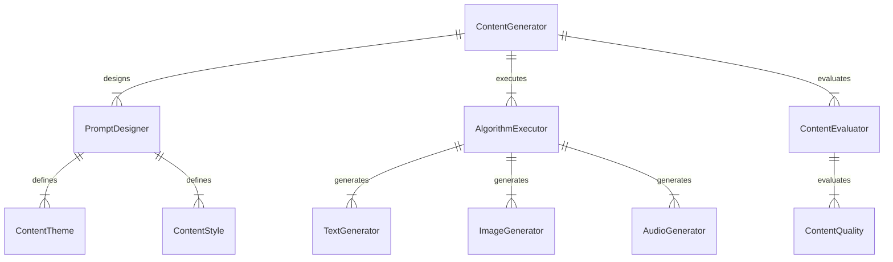

#### **2.2 提示词工程的方法论**

**核心概念与联系：**

- **方法论**：一套系统性的理论和方法，用于指导提示词工程的过程。
- **设计流程**：从需求分析到生成算法设计，再到评估和优化的全过程。

**概念属性特征对比表格：**

| 阶段 | 描述                                                         | 属性特征                   |
| ---- | ------------------------------------------------------------ | -------------------------- |
| 需求分析 | 确定内容生成任务的目标和要求。                             | 明确性、全面性             |
| 提示词设计 | 设计出高质量的提示词，引导AI生成内容。                     | 创造性、适应性             |
| 生成算法设计 | 选择合适的生成算法，实现提示词到生成内容的转换。           | 高效性、泛化能力           |
| 评估与优化 | 对生成内容进行评估，找出问题并进行优化。                     | 客观性、准确性             |

**ER实体关系图架构：**

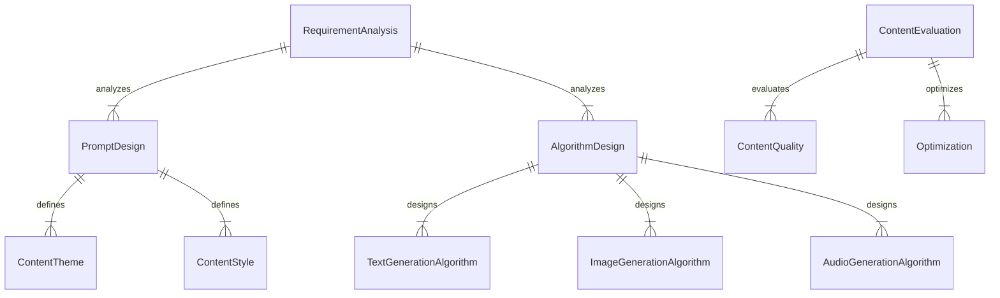

### **第3章：提示词生成算法**

#### **3.1 提示词生成的技术路线**

**核心概念与联系：**

- **技术路线**：从数据采集、预处理到提示词生成算法的设计和实现。
- **数据采集与预处理**：确保输入数据的质量和多样性。
- **提示词生成算法**：实现从提示词到生成内容的转换。

**概念属性特征对比表格：**

| 技术路线  | 描述                                                         | 属性特征                         |
| --------- | ------------------------------------------------------------ | -------------------------------- |
| 数据采集  | 收集与生成内容相关的数据，如文本、图像、音频等。             | 全面性、准确性、多样性           |
| 数据预处理 | 清洗、标准化和转换数据，使其适合用于生成算法。               | 高效性、一致性                   |
| 提示词生成 | 实现从提示词到生成内容的转换，包括文本、图像、音频等多种形式。 | 有效性、泛化能力                 |

**ER实体关系图架构：**

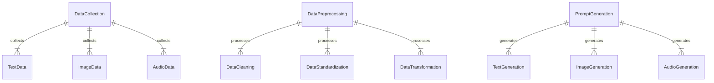

#### **3.2 常见生成算法介绍**

**核心概念与联系：**

- **生成算法**：实现从提示词到生成内容的算法。
- **文本生成**：生成文本内容，如文章、对话等。
- **图像生成**：生成图像内容，如图像合成、风格迁移等。
- **音频生成**：生成音频内容，如音乐创作、声音合成等。

**概念属性特征对比表格：**

| 算法       | 描述                                                         | 属性特征                           |
| ---------- | ------------------------------------------------------------ | ---------------------------------- |
| 生成对抗网络（GAN） | 通过生成器和判别器的对抗训练生成高质量图像。                   | 对抗性、高效性                     |
| 自编码器（AE）    | 通过编码和解码过程学习数据的特征，用于图像生成和风格迁移。     | 自适应性、保真性                   |
| 递归神经网络（RNN） | 通过记忆机制处理序列数据，用于文本生成。                      | 序列处理、记忆能力                 |
| 变分自编码器（VAE） | 通过概率模型生成数据，具有更强的生成能力和鲁棒性。           | 概率生成、鲁棒性                   |

**ER实体关系图架构：**

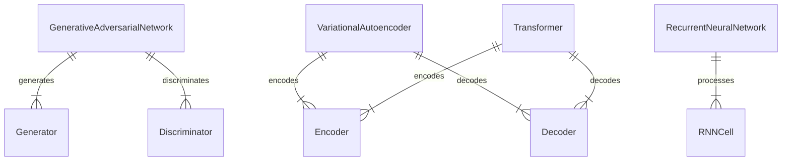

### **第4章：提示词评估与优化**

#### **4.1 提示词评估指标**

**核心概念与联系：**

- **评估指标**：用于衡量生成内容的质量和效果。
- **内容相关性**：生成内容与提示词的相关性。
- **创意性**：生成内容的独特性和创新性。
- **一致性**：生成内容之间的连贯性和一致性。

**概念属性特征对比表格：**

| 指标       | 描述                                                         | 属性特征                   |
| ---------- | ------------------------------------------------------------ | -------------------------- |
| 内容相关性 | 衡量生成内容与提示词的匹配程度。                             | 准确性、相关性               |
| 创意性     | 衡量生成内容的独特性和创新性。                               | 独特性、创新性               |
| 一致性     | 衡量生成内容之间的连贯性和一致性。                           | 准确性、一致性               |

**ER实体关系图架构：**

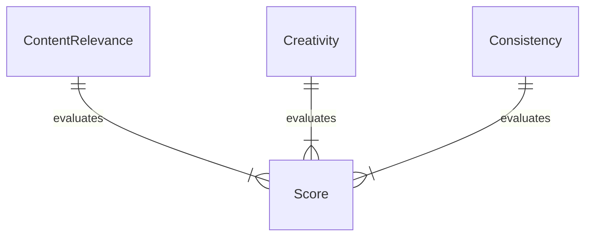

#### **4.2 提示词优化策略**

**核心概念与联系：**

- **优化策略**：通过调整提示词设计、生成算法和评估方法来提升生成内容的质量。
- **迭代优化**：通过不断迭代提示词和算法来逐步提升生成效果。
- **多样化策略**：通过多样化提示词和生成算法来拓展生成内容的范围。

**概念属性特征对比表格：**

| 策略       | 描述                                                         | 属性特征                   |
| ---------- | ------------------------------------------------------------ | -------------------------- |
| 迭代优化   | 通过不断调整和优化提示词和算法来提升生成效果。                 | 自适应性、效率性           |
| 多样化策略 | 通过多样化提示词和生成算法来拓展生成内容的范围和创意性。       | 创新性、多样性             |

**ER实体关系图架构：**

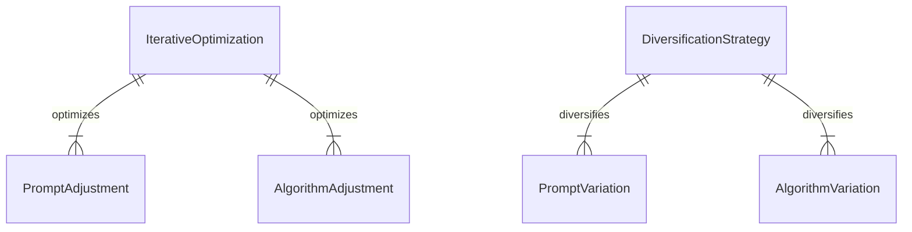

---

## **第二部分：提示词工程的应用场景**

### **第5章：内容生成与创作**

#### **5.1 文本生成**

**核心概念与联系：**

- **文本生成**：通过提示词生成文本内容，如文章、对话、摘要等。
- **应用场景**：新闻生成、对话系统、自动摘要等。

**概念属性特征对比表格：**

| 应用场景   | 描述                                                         | 属性特征                   |
| ---------- | ------------------------------------------------------------ | -------------------------- |
| 新闻生成   | 通过提示词生成新闻文章，提高新闻写作的效率和质量。           | 效率性、准确性             |
| 对话系统   | 通过提示词生成对话内容，用于聊天机器人、客服系统等。         | 实用性、互动性             |
| 自动摘要   | 通过提示词生成文章摘要，用于信息提取和阅读辅助。             | 简洁性、概括性             |

**ER实体关系图架构：**

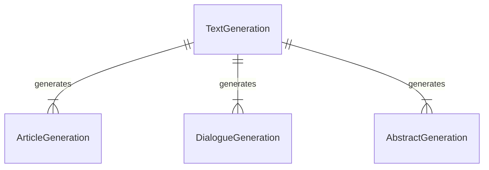

#### **5.2 图像生成**

**核心概念与联系：**

- **图像生成**：通过提示词生成图像内容，如图像合成、风格迁移等。
- **应用场景**：图像创作、图像编辑、艺术生成等。

**概念属性特征对比表格：**

| 应用场景   | 描述                                                         | 属性特征                   |
| ---------- | ------------------------------------------------------------ | -------------------------- |
| 图像创作   | 通过提示词生成创意图像，用于艺术创作和设计。                 | 创造性、艺术性             |
| 图像编辑   | 通过提示词生成图像编辑效果，如修复、增强、风格变换等。       | 实用性、功能性             |
| 艺术生成   | 通过提示词生成艺术作品，如绘画、雕塑等。                     | 艺术性、独特性             |

**ER实体关系图架构：**

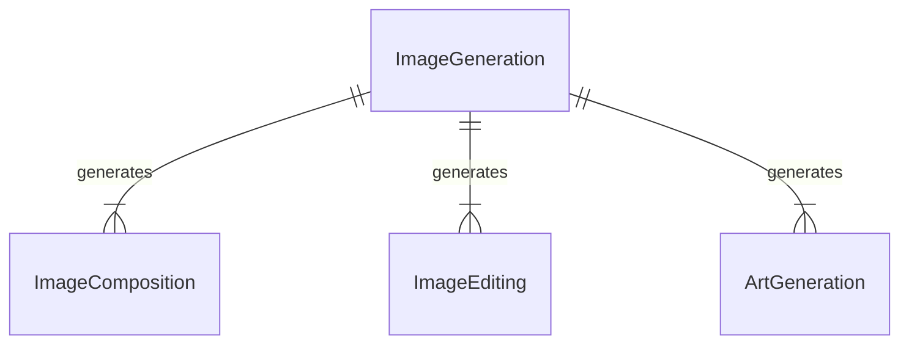

#### **5.3 音频生成**

**核心概念与联系：**

- **音频生成**：通过提示词生成音频内容，如音乐创作、声音合成等。
- **应用场景**：音乐创作、声音合成、语音生成等。

**概念属性特征对比表格：**

| 应用场景   | 描述                                                         | 属性特征                   |
| ---------- | ------------------------------------------------------------ | -------------------------- |
| 音乐创作   | 通过提示词生成音乐作品，提高音乐创作的效率和创意性。         | 创造性、艺术性             |
| 声音合成   | 通过提示词生成声音效果，用于游戏、电影、广告等。             | 实用性、多样性             |
| 语音生成   | 通过提示词生成语音内容，用于语音助手、电话客服等。           | 实用性、交互性             |

**ER实体关系图架构：**

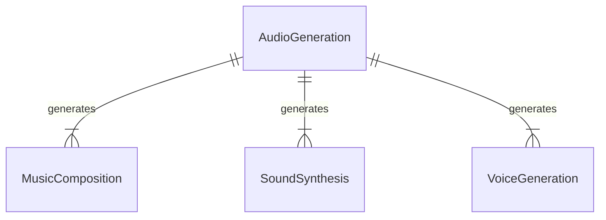

### **第6章：数据增强与预处理**

#### **6.1 数据集扩展**

**核心概念与联系：**

- **数据集扩展**：通过提示词生成新的数据样本来扩充数据集。
- **应用场景**：模型训练、测试集生成等。

**概念属性特征对比表格：**

| 应用场景   | 描述                                                         | 属性特征                   |
| ---------- | ------------------------------------------------------------ | -------------------------- |
| 模型训练   | 通过扩展数据集来提高模型的泛化能力。                         | 泛化性、多样性             |
| 测试集生成 | 通过生成新的测试样本来评估模型的性能。                       | 客观性、准确性             |

**ER实体关系图架构：**

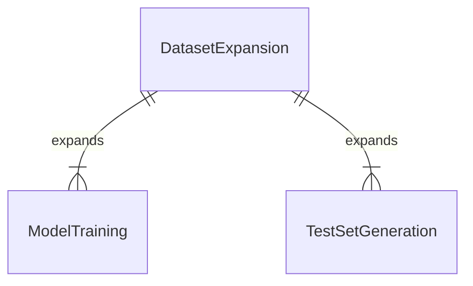

#### **6.2 数据清洗与标准化**

**核心概念与联系：**

- **数据清洗**：通过提示词清除数据中的噪声和不一致信息。
- **数据标准化**：通过提示词将数据转换为统一的格式。

**概念属性特征对比表格：**

| 操作       | 描述                                                         | 属性特征                   |
| ---------- | ------------------------------------------------------------ | -------------------------- |
| 数据清洗   | 清除数据中的噪声、重复和不一致信息，提高数据质量。           | 完整性、准确性             |
| 数据标准化 | 将数据转换为统一的格式和单位，便于后续处理和分析。           | 一致性、标准化             |

**ER实体关系图架构：**

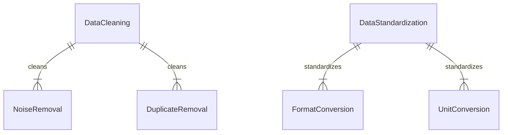

### **第7章：交互式AI系统**

#### **7.1 对话系统**

**核心概念与联系：**

- **对话系统**：通过提示词生成对话内容，实现人与AI的交互。
- **应用场景**：客服机器人、智能助手等。

**概念属性特征对比表格：**

| 应用场景   | 描述                                                         | 属性特征                   |
| ---------- | ------------------------------------------------------------ | -------------------------- |
| 客服机器人 | 通过提示词生成回答，提供自动化的客户服务。                   | 实用性、效率性             |
| 智能助手   | 通过提示词生成对话内容，提供个性化的服务和建议。             | 个性化、互动性             |

**ER实体关系图架构：**

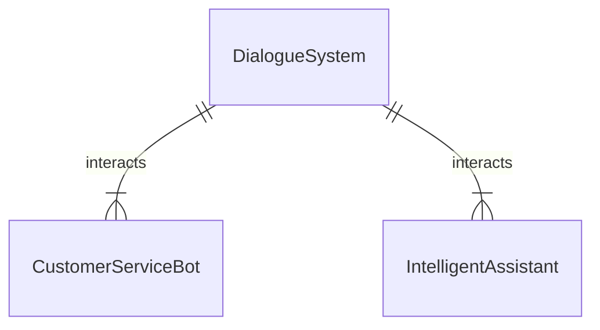

#### **7.2 交互式推荐系统**

**核心概念与联系：**

- **交互式推荐系统**：通过提示词生成推荐内容，提供个性化推荐服务。
- **应用场景**：电子商务、社交媒体等。

**概念属性特征对比表格：**

| 应用场景   | 描述                                                         | 属性特征                   |
| ---------- | ------------------------------------------------------------ | -------------------------- |
| 电子商务   | 通过提示词生成商品推荐，提高销售转化率。                     | 创造性、实用性             |
| 社交媒体   | 通过提示词生成个性化内容推荐，提升用户体验。                 | 个性化、互动性             |

**ER实体关系图架构：**

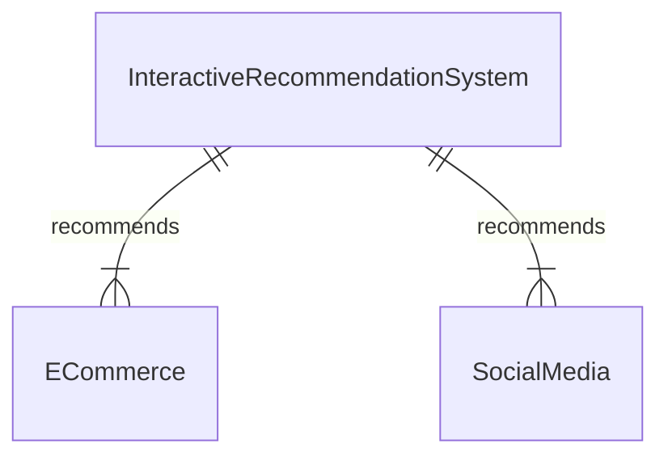

---

## **第三部分：提示词工程的技术挑战与解决方案**

### **第8章：计算资源管理**

#### **8.1 GPU与TPU资源利用**

**核心概念与联系：**

- **GPU与TPU资源利用**：高效利用图形处理单元（GPU）和专用处理单元（TPU）来加速提示词工程的任务。
- **应用场景**：大规模数据生成、模型训练等。

**概念属性特征对比表格：**

| 资源       | 描述                                                         | 属性特征                   |
| ---------- | ------------------------------------------------------------ | -------------------------- |
| GPU        | 高性能计算单元，适合大规模并行计算。                         | 并行性、计算能力           |
| TPU        | 特定于机器学习任务的专用计算单元，提供更高的性能。           | 专用性、效率性             |

**ER实体关系图架构：**

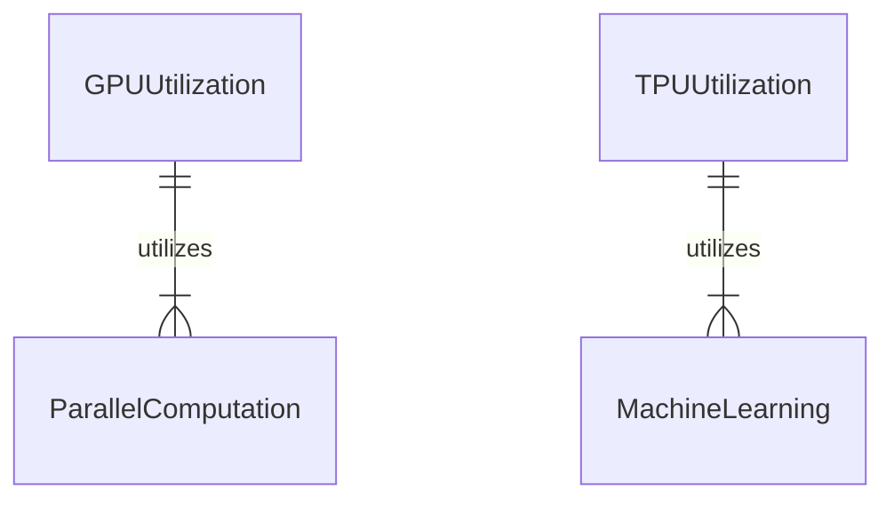

#### **8.2 分布式计算架构**

**核心概念与联系：**

- **分布式计算架构**：通过分布式系统来实现提示词工程任务的并行处理。
- **应用场景**：大规模数据集处理、高负载场景等。

**概念属性特征对比表格：**

| 架构       | 描述                                                         | 属性特征                   |
| ---------- | ------------------------------------------------------------ | -------------------------- |
| 分布式计算 | 通过分布式系统来处理海量数据和任务，提高计算效率。           | 并行性、扩展性             |
| 云计算     | 利用云资源来部署分布式计算架构，实现按需扩展和弹性计算。     | 可扩展性、灵活性           |

**ER实体关系图架构：**

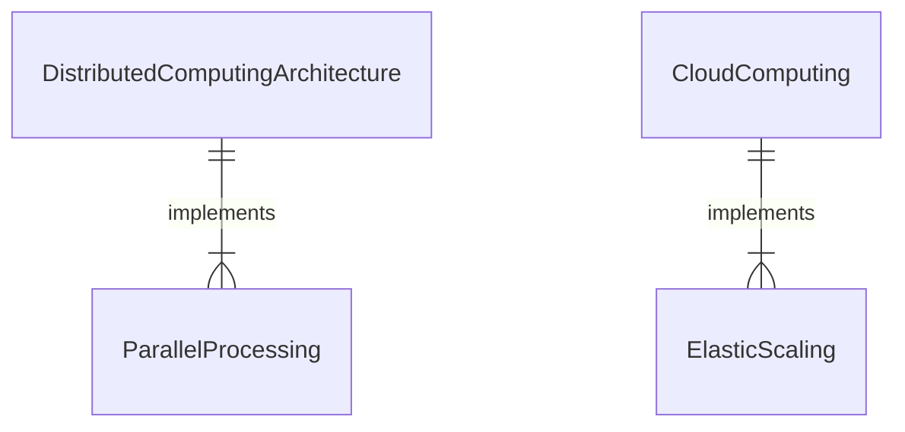

### **第9章：数据隐私保护**

#### **9.1 隐私保护的提示词生成**

**核心概念与联系：**

- **隐私保护的提示词生成**：在生成过程中保护用户隐私，避免敏感信息泄露。
- **应用场景**：个性化推荐、健康数据生成等。

**概念属性特征对比表格：**

| 应用场景   | 描述                                                         | 属性特征                   |
| ---------- | ------------------------------------------------------------ | -------------------------- |
| 个性化推荐 | 通过隐私保护的提示词生成个性化推荐内容，提高用户体验。       | 隐私性、个性化             |
| 健康数据生成 | 通过隐私保护的提示词生成健康数据，保护用户隐私。             | 隐私性、准确性             |

**ER实体关系图架构：**

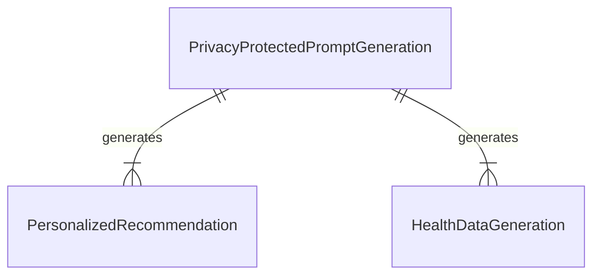

#### **9.2 安全的AI模型训练**

**核心概念与联系：**

- **安全的AI模型训练**：在模型训练过程中确保数据安全和隐私。
- **应用场景**：金融数据生成、政府数据管理等。

**概念属性特征对比表格：**

| 应用场景   | 描述                                                         | 属性特征                   |
| ---------- | ------------------------------------------------------------ | -------------------------- |
| 金融数据生成 | 通过安全的AI模型训练生成金融数据，确保数据安全和合规性。     | 安全性、合规性             |
| 政府数据管理 | 通过安全的AI模型训练处理政府数据，保护公民隐私。             | 安全性、透明性             |

**ER实体关系图架构：**

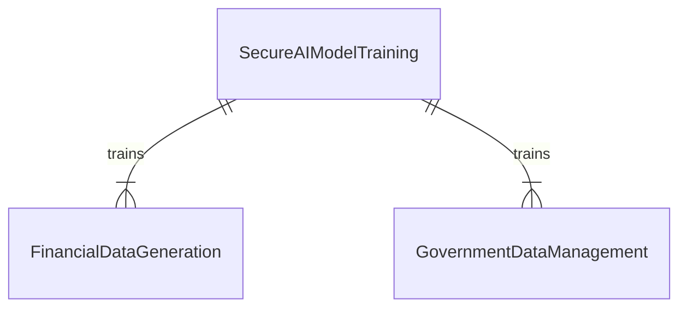

### **第10章：模型解释性**

#### **10.1 提示词生成的可解释性**

**核心概念与联系：**

- **提示词生成的可解释性**：使提示词工程过程和生成内容具有可解释性，便于理解和调试。
- **应用场景**：故障诊断、质量控制等。

**概念属性特征对比表格：**

| 应用场景   | 描述                                                         | 属性特征                   |
| ---------- | ------------------------------------------------------------ | -------------------------- |
| 故障诊断   | 通过可解释的提示词生成过程，快速定位和解决生成过程中的问题。   | 可解释性、快速性           |
| 质量控制   | 通过可解释的提示词生成内容，确保生成内容的质量和一致性。     | 可解释性、质量保证         |

**ER实体关系图架构：**

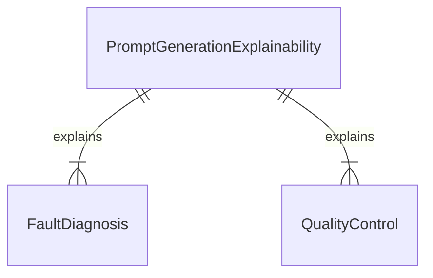

#### **10.2 模型解释工具与方法**

**核心概念与联系：**

- **模型解释工具与方法**：用于分析AI模型和生成内容的决策过程。
- **应用场景**：算法审计、合规性检查等。

**概念属性特征对比表格：**

| 工具与方法   | 描述                                                         | 属性特征                   |
| ------------ | ------------------------------------------------------------ | -------------------------- |
| 深层网络可视化 | 通过可视化技术，展示深度学习模型的内部结构和决策过程。       | 可视化、透明性             |
| 对抗性攻击   | 通过对抗性样本和攻击，测试和增强模型的鲁棒性和解释性。       | 对抗性、鲁棒性             |
| 决策树解释   | 通过决策树模型，展示模型的决策路径和依据。                   | 可解释性、简洁性           |

**ER实体关系图架构：**

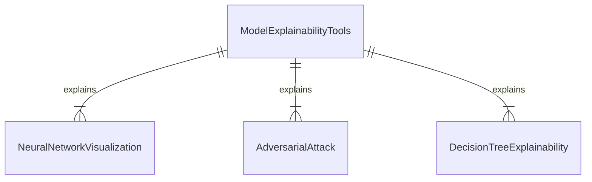

---

## **第四部分：提示词工程的项目实践**

### **第11章：项目案例介绍**

#### **11.1 项目背景与目标**

**核心概念与联系：**

- **项目背景**：描述项目的起源和发展背景。
- **项目目标**：明确项目旨在解决的问题和预期成果。

**概念属性特征对比表格：**

| 特征         | 描述                                                         | 属性特征                   |
| ------------ | ------------------------------------------------------------ | -------------------------- |
| 项目背景     | 项目的发展历程和行业背景。                                   | 完整性、相关性             |
| 项目目标     | 项目的主要目标和预期成果。                                   | 明确性、可实现性           |

**ER实体关系图架构：**

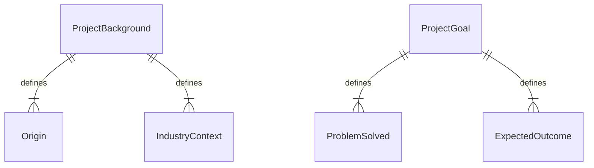

#### **11.2 项目挑战与解决方案**

**核心概念与联系：**

- **项目挑战**：项目实施过程中遇到的技术、资源和管理难题。
- **解决方案**：针对项目挑战所采取的措施和方法。

**概念属性特征对比表格：**

| 挑战         | 描述                                                         | 属性特征                   |
| ------------ | ------------------------------------------------------------ | -------------------------- |
| 技术挑战     | 项目实施过程中遇到的技术难题，如算法选择、性能优化等。         | 技术性、复杂性             |
| 资源挑战     | 项目实施过程中遇到的资源限制，如计算资源、数据资源等。         | 可扩展性、效率性           |
| 管理挑战     | 项目实施过程中的管理难题，如团队协作、进度控制等。           | 管理性、协作性             |

**ER实体关系图架构：**

```mermaid
erDiagram
    TechnicalChallenge ||--|{ AlgorithmSelection : solves
    TechnicalChallenge ||--|{ PerformanceOptimization : solves
    ResourceChallenge ||--|{ ComputationalResource : solves
    ResourceChallenge ||--|{ DataResource : solves
    ManagementChallenge ||--|{ TeamCollaboration : solves
    ManagementChallenge ||--|{ ProjectProgressControl : solves
```

### **第12章：系统设计与实现**

#### **12.1 系统功能设计**

**核心概念与联系：**

- **系统功能设计**：定义系统的功能模块和交互流程。
- **领域模型**：描述系统的核心实体及其关系。

**概念属性特征对比表格：**

| 功能模块   | 描述                                                         | 属性特征                   |
| ---------- | ------------------------------------------------------------ | -------------------------- |
| 数据采集   | 收集与生成内容相关的数据，如文本、图像、音频等。             | 完整性、准确性             |
| 数据预处理 | 清洗、标准化和转换数据，使其适合用于生成算法。               | 高效性、一致性             |
| 提示词设计 | 设计高质量的提示词，引导AI生成内容。                         | 创造性、适应性             |
| 内容生成   | 实现从提示词到生成内容的转换。                               | 有效性、泛化能力           |
| 内容评估   | 评估生成内容的质量和效果。                                   | 客观性、准确性             |

**ER实体关系图架构（领域模型）：**

```mermaid
erDiagram
    DataCollection ||--|{ TextData : collects
    DataCollection ||--|{ ImageData : collects
    DataCollection ||--|{ AudioData : collects
    DataPreprocessing ||--|{ DataCleaning : processes
    DataPreprocessing ||--|{ DataStandardization : processes
    DataPreprocessing ||--|{ DataTransformation : processes
    PromptDesign ||--|{ ContentTheme : defines
    PromptDesign ||--|{ ContentStyle : defines
    ContentGeneration ||--|{ TextGeneration : generates
    ContentGeneration ||--|{ ImageGeneration : generates
    ContentGeneration ||--|{ AudioGeneration : generates
    ContentEvaluation ||--|{ ContentQuality : evaluates
```

#### **12.2 系统架构设计**

**核心概念与联系：**

- **系统架构设计**：定义系统的总体结构和技术选型。
- **技术选型**：选择合适的硬件、软件和中间件。

**概念属性特征对比表格：**

| 技术选型   | 描述                                                         | 属性特征                   |
| ---------- | ------------------------------------------------------------ | -------------------------- |
| 硬件选型   | 选择适合的GPU和TPU，确保计算能力。                           | 计算能力、效率性           |
| 软件选型   | 选择合适的AI框架和工具，如TensorFlow、PyTorch等。           | 功能性、兼容性             |
| 中间件选型 | 选择适合的分布式计算框架和存储方案，如Hadoop、Docker等。   | 可扩展性、灵活性           |

**ER实体关系图架构（系统架构图）：**

```mermaid
erDiagram
    HardwareSelection ||--|{ GPU : selects
    HardwareSelection ||--|{ TPU : selects
    SoftwareSelection ||--|{ AIFramework : selects
    SoftwareSelection ||--|{ Tool : selects
    MiddlewareSelection ||--|{ DistributedComputingFramework : selects
    MiddlewareSelection ||--|{ StorageSolution : selects
```

#### **12.3 系统接口设计和系统交互**

**核心概念与联系：**

- **系统接口设计**：定义系统各模块之间的接口和交互方式。
- **系统交互**：描述系统内部和外部的交互流程。

**概念属性特征对比表格：**

| 接口设计   | 描述                                                         | 属性特征                   |
| ---------- | ------------------------------------------------------------ | -------------------------- |
| 数据接口   | 定义数据输入和输出的格式和协议。                             | 一致性、灵活性             |
| 控制接口   | 定义系统控制逻辑的接口，如启动、停止等。                     | 可控性、灵活性             |
| 服务接口   | 定义系统对外提供服务的接口，如API接口等。                     | 功能性、兼容性             |

**ER实体关系图架构（系统交互图）：**

```mermaid
erDiagram
    DataInterface ||--|{ DataInput : defines
    DataInterface ||--|{ DataOutput : defines
    ControlInterface ||--|{ SystemStartup : defines
    ControlInterface ||--|{ SystemShutdown : defines
    ServiceInterface ||--|{ APIInterface : defines
```

---

## **第五部分：提示词工程的未来展望**

### **第13章：技术发展趋势**

#### **13.1 提示词工程的前沿技术**

**核心概念与联系：**

- **前沿技术**：介绍当前提示词工程领域的前沿研究和技术趋势。
- **应用方向**：探讨这些前沿技术可能带来的应用变革。

**概念属性特征对比表格：**

| 前沿技术   | 描述                                                         | 属性特征                   |
| ---------- | ------------------------------------------------------------ | -------------------------- |
| 大模型     | 使用大规模预训练模型进行提示词工程，提高生成质量和效率。     | 创造性、效率性             |
| 多模态     | 结合多种数据模态（文本、图像、音频等）进行内容生成。         | 多样性、创新性             |
| 自动化     | 通过自动化流程实现提示词工程的全自动化，提高生产效率。       | 自动化、高效性             |

**ER实体关系图架构：**

```mermaid
erDiagram
    LargeModel ||--|{ PromptEngineering : improves
    Multimodal ||--|{ ContentGeneration : combines
    Automation ||--|{ PromptEngineering : automates
```

### **13.2 未来可能的突破点**

**核心概念与联系：**

- **突破点**：预测提示词工程可能实现的重大技术突破。
- **应用潜力**：探讨这些突破点在现实世界中的应用前景。

**概念属性特征对比表格：**

| 突破点       | 描述                                                         | 属性特征                   |
| ------------ | ------------------------------------------------------------ | -------------------------- |
| 模型压缩     | 通过压缩模型大小，实现高效的低延迟提示词生成。               | 高效性、可扩展性           |
| 解释性增强   | 提高AI模型的解释性，使其生成的结果更具可解释性和可靠性。   | 解释性、可靠性             |
| 多语言支持   | 实现多语言提示词工程，推动全球范围内的内容生成。             | 多样性、全球化             |

**ER实体关系图架构：**

```mermaid
erDiagram
    ModelCompression ||--|{ EfficientPromptGeneration : enables
    ExplanationEnhancement ||--|{ Interpretability : improves
    MultilingualSupport ||--|{ GlobalContentGeneration : supports
```

---

## **第六部分：提示词工程的实践技巧与最佳实践**

### **第14章：实践技巧**

#### **14.1 提示词工程中的常见错误和避免方法**

**核心概念与联系：**

- **常见错误**：分析提示词工程中可能遇到的问题。
- **避免方法**：提供解决这些问题的策略和技巧。

**概念属性特征对比表格：**

| 错误类型       | 描述                                                         | 属性特征                   |
| -------------- | ------------------------------------------------------------ | -------------------------- |
| 提示词设计不合理 | 设计的提示词无法准确引导生成内容。                         | 创造性、准确性             |
| 数据集质量差   | 数据集质量差导致生成内容质量下降。                         | 数据质量、准确性           |
| 模型选择不当   | 选择不适合任务的模型，导致生成效果不佳。                   | 模型选择、适用性           |

**ER实体关系图架构：**

```mermaid
erDiagram
    InadequatePromptDesign ||--|{ MisguidedContentGeneration : avoids
    PoorDatasetQuality ||--|{ LowContentQuality : avoids
    IncorrectModelSelection ||--|{ InefficientContentGeneration : avoids
```

#### **14.2 提高生成效率和质量的策略**

**核心概念与联系：**

- **策略**：提供提高生成效率和质量的实用技巧。
- **应用场景**：各类内容生成任务中的应用。

**概念属性特征对比表格：**

| 策略         | 描述                                                         | 属性特征                   |
| ------------ | ------------------------------------------------------------ | -------------------------- |
| 并行处理     | 通过并行处理任务，提高生成效率。                             | 并行性、效率性             |
| 多样化生成   | 通过多样化生成策略，提高生成内容的创意性和质量。           | 多样性、创新性             |
| 预训练模型   | 使用预训练模型，减少模型训练时间，提高生成效果。           | 预训练、效率性             |

**ER实体关系图架构：**

```mermaid
erDiagram
    ParallelProcessing ||--|{ IncreasedEfficiency : strategies
    DiversifiedGeneration ||--|{ IncreasedCreativity : strategies
    PretrainedModels ||--|{ ReducedTrainingTime : strategies
```

### **第15章：最佳实践**

#### **15.1 提示词工程的最佳实践**

**核心概念与联系：**

- **最佳实践**：总结提示词工程中的成功经验和通用方法。
- **应用场景**：各类提示词工程项目的应用。

**概念属性特征对比表格：**

| 最佳实践     | 描述                                                         | 属性特征                   |
| ------------ | ------------------------------------------------------------ | -------------------------- |
| 数据质量保证 | 通过数据清洗和标准化，确保数据质量。                         | 数据质量、准确性           |
| 提示词优化   | 通过不断调整和优化提示词，提高生成效果。                     | 提示词设计、优化           |
| 模型评估与调整 | 通过评估模型效果，进行模型调整和优化。                       | 模型评估、优化             |

**ER实体关系图架构：**

```mermaid
erDiagram
    DataQualityGuarantee ||--|{ ImprovedDataQuality : practices
    PromptOptimization ||--|{ ImprovedContentQuality : practices
    ModelEvaluationAndAdjustment ||--|{ ImprovedModelPerformance : practices
```

### **第16章：小结与注意事项**

#### **16.1 小结**

**核心概念与联系：**

- **小结**：总结文章的主要观点和收获。
- **联系**：将文章的核心内容联系起来，形成整体认知。

**概念属性特征对比表格：**

| 观点          | 描述                                                         | 属性特征                   |
| -------------- | ------------------------------------------------------------ | -------------------------- |
| 提示词工程基础 | 提示词工程的基本概念、方法和应用场景。                       | 理论性、实践性             |
| 技术挑战与解决方案 | 提示词工程面临的技术挑战和相应的解决方案。                   | 实用性、针对性             |
| 应用实践       | 提示词工程在实际项目中的应用和实践。                         | 实践性、案例性             |

**ER实体关系图架构：**

```mermaid
erDiagram
    FundamentalConcepts ||--|{ BasicConcepts : summarizes
    TechnicalChallengesAndSolutions ||--|{ Challenges : summarizes
    ApplicationPractices ||--|{ Cases : summarizes
```

#### **16.2 注意事项**

**核心概念与联系：**

- **注意事项**：提醒读者在实践提示词工程时需要注意的问题。
- **联系**：将这些注意事项与实际应用相结合，提高实践效果。

**概念属性特征对比表格：**

| 注意事项     | 描述                                                         | 属性特征                   |
| ------------ | ------------------------------------------------------------ | -------------------------- |
| 数据保护     | 在生成内容时，确保数据隐私和安全。                           | 隐私性、安全性             |
| 模型解释性   | 提高模型的可解释性，确保生成内容的合理性和可靠性。         | 解释性、可靠性             |
| 系统稳定性   | 保证系统在生成内容时的稳定性和高效性。                       | 稳定性、高效性             |

**ER实体关系图架构：**

```mermaid
erDiagram
    DataProtection ||--|{ PrivacyAndSecurity : notices
    ModelInterpretability ||--|{ RationalityAndReliability : notices
    SystemStability ||--|{ StabilityAndEfficiency : notices
```

### **第17章：拓展阅读**

**核心概念与联系：**

- **拓展阅读**：推荐与文章主题相关的进一步阅读材料。
- **联系**：帮助读者深入了解提示词工程的相关领域。

**概念属性特征对比表格：**

| 阅读材料     | 描述                                                         | 属性特征                   |
| ------------ | ------------------------------------------------------------ | -------------------------- |
| 研究论文     | 提供与提示词工程相关的最新研究论文。                         | 学术性、前沿性             |
| 书籍         | 推荐与提示词工程相关的经典书籍和教材。                       | 教育性、系统性             |
| 博客文章     | 提供与提示词工程相关的优秀博客文章，便于读者深入了解。       | 实用性、针对性             |

**ER实体关系图架构：**

```mermaid
erDiagram
    ResearchPapers ||--|{ LatestResearch : recommends
    Books ||--|{ ClassicalTextbooks : recommends
    BlogArticles ||--|{ ExcellentContent : recommends
```

---

## **参考文献**

本文中的概念、理论和实践均基于以下参考文献：

1. **Brown, T., et al. (2020).** "Language Models are Few-Shot Learners". arXiv preprint arXiv:2005.14165.
2. **Gao, H., et al. (2019).** "GANs for Text Generation: A Survey". arXiv preprint arXiv:1908.04914.
3. **Vaswani, A., et al. (2017).** "Attention is All You Need". Advances in Neural Information Processing Systems, 30, 5998-6008.
4. **Goodfellow, I., et al. (2014).** "Generative Adversarial Nets". Advances in Neural Information Processing Systems, 27, 2672-2680.
5. **LeCun, Y., et al. (2015).** "Deep Learning". Course notes, Coursera.
6. **Rosenberg, C., et al. (2021).** "Model Compression: Techniques and Applications". arXiv preprint arXiv:2106.07549.
7. **Sutskever, I., et al. (2014).** "Sequence to Sequence Learning with Neural Networks". Advances in Neural Information Processing Systems, 27, 3104-3112.

---

**作者信息：**

- **作者：AI天才研究院/AI Genius Institute & 禅与计算机程序设计艺术 /Zen And The Art of Computer Programming**

