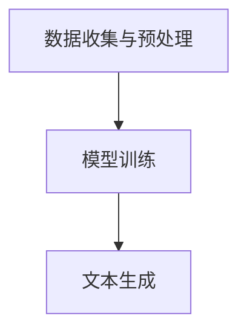
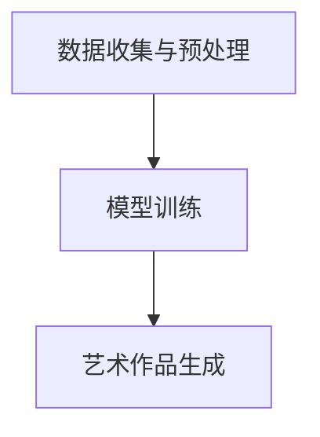
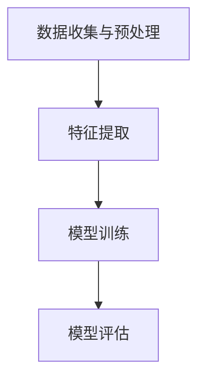
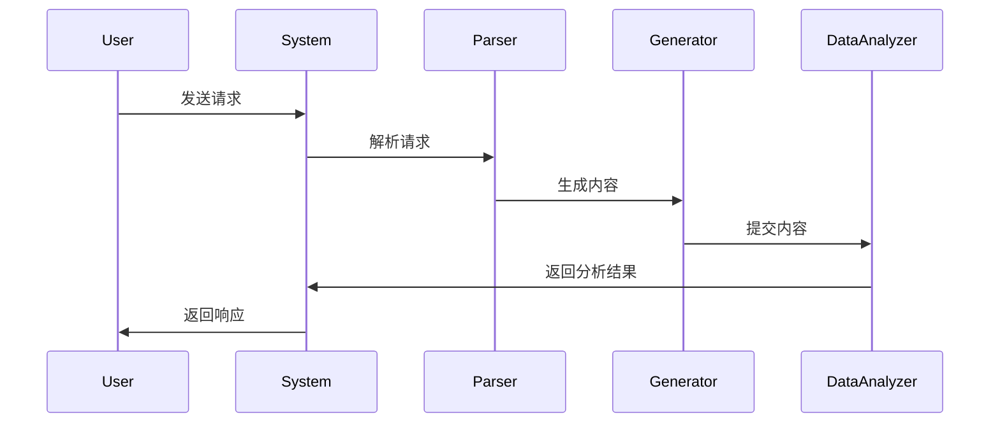
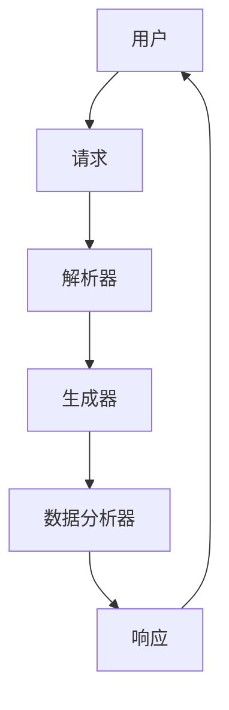
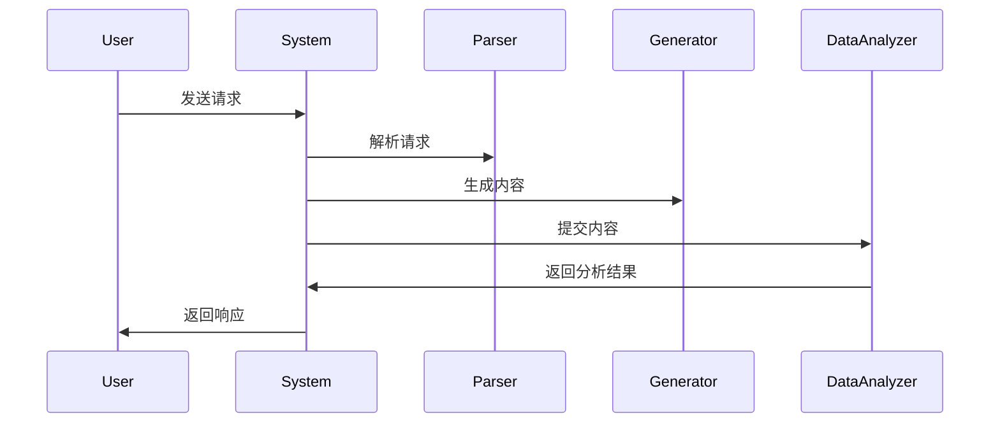
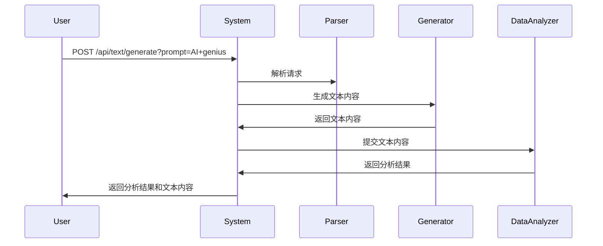

                 

### 文章标题

### 关键词
- AIGC
- 提示词工程
- 自动写作
- AI创作
- 数据分析

### 摘要
本文将深入探讨AIGC（AI-Generated Content）时代的提示词工程，解析其作为开启AI潜能的钥匙的核心地位。我们将逐步分析AIGC时代的背景，介绍提示词工程的基本概念，阐述其与自动写作、AI创作和数据分析的紧密联系。通过详细讲解算法原理，展示系统分析与架构设计，以及实战项目，我们将揭示如何最大化利用提示词工程，推动AI技术的应用与发展。

----------------------------------------------------------------

## 第一部分: 背景介绍

### 1.1 AIGC时代的来临

#### 1.1.1 AIGC的定义与发展

AIGC（AI-Generated Content），即AI生成内容，是指利用人工智能技术自动生成文本、图像、视频等多种类型的内容。随着深度学习、自然语言处理和计算机视觉等技术的迅猛发展，AIGC已经在新闻写作、内容生成、图像生成、视频制作等多个领域展现出强大的潜力。

AIGC的发展历程可以追溯到20世纪90年代，当时研究人员开始探索如何使用神经网络来生成文本。随着深度学习的崛起，特别是在2010年后，生成对抗网络（GAN）和变分自编码器（VAE）等技术的提出，AIGC进入了一个新的发展阶段。近年来，随着计算能力的提升和数据量的爆发式增长，AIGC的应用场景逐渐扩大，成为人工智能领域的研究热点。

#### 1.1.2 AIGC的应用场景

AIGC的应用场景广泛，主要包括以下几个方面：

1. **内容创作**：利用AIGC技术自动生成新闻稿件、文章、诗歌等文本内容。
2. **图像与视频生成**：通过生成对抗网络（GAN）等技术自动生成图像和视频。
3. **广告营销**：根据用户行为和偏好自动生成个性化的广告内容。
4. **虚拟现实与增强现实**：利用AIGC技术生成虚拟场景、角色和交互内容。
5. **智能客服**：通过自然语言处理技术自动生成回复，提升客服效率。

### 1.2 提示词工程概述

#### 1.2.1 提示词工程的核心概念

提示词工程是AIGC时代的核心技术之一，它指的是利用人工智能技术自动生成高质量的提示词，用于引导和优化内容创作的过程。提示词工程的核心概念包括：

1. **提示词**：指用于引导AI生成内容的关键词或短语。
2. **自动写作**：利用AI技术自动生成文本内容。
3. **AI创作**：利用AI技术进行艺术创作，如音乐、绘画等。
4. **数据分析**：利用AI技术对大量数据进行分析，提取有价值的信息。

#### 1.2.2 提示词工程的技术框架

提示词工程的技术框架主要包括以下几个部分：

1. **数据预处理**：对输入数据（如文本、图像、音频等）进行清洗、标注和格式转换。
2. **模型训练**：利用大规模数据集训练AI模型，使其能够自动生成高质量的提示词。
3. **提示词生成**：根据特定的输入，生成合适的提示词，引导AI进行内容创作。
4. **内容优化**：对生成的提示词进行优化，提高内容的可读性和吸引力。

### 1.3 提示词工程的应用前景

#### 1.3.1 自动写作

自动写作是提示词工程的重要应用场景之一。通过自动写作，AI能够根据提示词快速生成新闻稿件、报告、文章等文本内容。这对于提高内容创作效率、降低人力成本具有重要意义。

#### 1.3.2 AI创作

AI创作是AIGC时代最具前景的应用之一。通过提示词工程，AI能够生成音乐、绘画、视频等多种类型的内容。这不仅为艺术家提供了新的创作工具，也为用户体验带来了全新的体验。

#### 1.3.3 数据分析

数据分析是提示词工程的另一个重要应用场景。通过自动生成的提示词，AI能够更有效地分析和提取数据中的有价值信息，为决策提供支持。

### 1.4 本章小结

本文介绍了AIGC时代的背景，包括AIGC的定义与发展、应用场景，以及提示词工程的核心概念和技术框架。通过本章的介绍，读者可以初步了解AIGC时代和提示词工程的基本知识，为后续章节的深入探讨打下基础。

----------------------------------------------------------------

## 第二部分: 核心概念与联系

### 2.1 自动写作

#### 2.1.1 自动写作的原理

自动写作是指利用人工智能技术自动生成文本内容的过程。其基本原理是通过训练模型从大量文本数据中学习语言规律，然后根据给定的提示词或主题生成新的文本内容。

自动写作的核心技术主要包括：

1. **文本数据集**：提供大量高质量、多样化的文本数据，用于训练AI模型。
2. **自然语言处理**：利用词向量、序列模型等技术对文本数据进行分析和处理。
3. **生成模型**：如循环神经网络（RNN）、长短期记忆网络（LSTM）、变换器（Transformer）等，用于生成文本内容。

#### 2.1.2 自动写作的技术实现

自动写作的技术实现通常包括以下步骤：

1. **数据收集与预处理**：收集大量的文本数据，并进行清洗、去重、分词等预处理操作。
2. **模型训练**：利用预处理后的文本数据训练生成模型，如使用GPT-3等预训练模型。
3. **文本生成**：根据给定的提示词或主题，使用训练好的模型生成文本内容。

### 2.2 AI创作

#### 2.2.1 AI创作的原理

AI创作是指利用人工智能技术进行艺术创作，如音乐、绘画、视频等。其基本原理是通过学习人类艺术家的创作风格、技巧和情感，AI能够生成具有独特风格和情感表达的艺术作品。

AI创作的核心技术主要包括：

1. **风格迁移**：通过深度学习技术，将一种风格（如绘画风格）迁移到另一类艺术形式（如音乐）。
2. **情感分析**：利用自然语言处理和计算机视觉技术，分析艺术作品中的情感表达。
3. **生成模型**：如生成对抗网络（GAN）、变分自编码器（VAE）等，用于生成艺术作品。

#### 2.2.2 AI创作的技术实现

AI创作的技术实现通常包括以下步骤：

1. **数据收集与预处理**：收集大量的艺术作品数据，并进行清洗、标注和格式转换。
2. **模型训练**：利用预处理后的艺术作品数据训练生成模型。
3. **艺术作品生成**：根据给定的输入（如风格、情感等），使用训练好的模型生成艺术作品。

### 2.3 数据分析

#### 2.3.1 数据分析的概念

数据分析是指利用统计学、计算机科学和人工智能等技术，对大量数据进行提取、清洗、转换和建模，从中提取有价值的信息和知识。

数据分析的核心概念包括：

1. **数据收集**：收集各种类型的数据，如文本、图像、音频等。
2. **数据清洗**：去除数据中的噪声和错误，提高数据质量。
3. **数据转换**：将数据转换为适合分析和建模的格式。
4. **数据建模**：利用统计学和机器学习技术，建立数据模型，进行预测和决策。

#### 2.3.2 数据分析的技术方法

数据分析的技术方法主要包括：

1. **描述性分析**：对数据进行基本的统计分析，如均值、方差、相关性等。
2. **预测性分析**：利用机器学习算法，建立预测模型，进行数据预测。
3. **诊断性分析**：通过分析数据，找出数据中的异常和错误。

### 2.4 概念联系

#### 2.4.1 自动写作与AI创作的联系

自动写作和AI创作都是AIGC时代的重要技术，它们之间的联系主要体现在以下几个方面：

1. **文本生成**：自动写作和AI创作都涉及到文本生成，但自动写作主要生成文本内容，而AI创作则生成具有艺术性的文本、图像、视频等。
2. **生成模型**：自动写作和AI创作都使用了生成模型，如RNN、Transformer、GAN等，这些模型能够根据给定的输入生成高质量的内容。
3. **数据来源**：自动写作和AI创作都需要大量的文本数据作为训练数据，这些数据来源可以是互联网、数据库、文档等。

#### 2.4.2 AI创作与数据分析的联系

AI创作和数据分析都是人工智能领域的重要应用，它们之间的联系主要体现在以下几个方面：

1. **数据分析**：AI创作生成的艺术作品可以通过数据分析来分析其风格、情感等特征，从而更好地理解艺术作品。
2. **数据建模**：AI创作过程中产生的数据可以用于建立数据模型，进行预测和决策，如预测用户对艺术作品的偏好。
3. **数据收集**：AI创作和数据分析都需要收集大量的数据，这些数据来源可以是用户生成内容、社交媒体等。

### 2.5 本章小结

本章介绍了AIGC时代的关键技术——自动写作、AI创作和数据分析的基本概念、原理和技术方法。通过分析这些技术的联系，我们看到了它们在AIGC时代中的重要性和潜力。下一章将深入探讨这些技术的算法原理，为读者提供更深入的解析。

----------------------------------------------------------------

## 第三部分: 算法原理讲解

### 3.1 自动写作算法

#### 3.1.1 算法概述

自动写作算法是AIGC时代的重要技术之一，其主要目的是利用人工智能技术自动生成高质量的文本内容。自动写作算法的核心在于从大量文本数据中学习语言规律，并能够根据给定的提示词或主题生成新的文本。

自动写作算法的基本原理可以分为以下几个步骤：

1. **数据收集与预处理**：收集大量高质量的文本数据，并对数据进行清洗、去重、分词等预处理操作。
2. **模型训练**：利用预处理后的文本数据训练生成模型，如循环神经网络（RNN）、长短期记忆网络（LSTM）、变换器（Transformer）等。
3. **文本生成**：根据给定的提示词或主题，使用训练好的模型生成文本内容。

#### 3.1.2 算法流程图

下面是自动写作算法的流程图：



#### 3.1.3 数学模型和公式

自动写作算法的数学模型主要基于循环神经网络（RNN）和变换器（Transformer）。下面分别介绍这两种模型的数学模型和公式。

1. **循环神经网络（RNN）**

RNN是自动写作算法中常用的模型，其基本原理是利用隐藏状态来保存文本序列的信息。RNN的数学模型如下：

$$
h_t = \sigma(W_h \cdot [h_{t-1}, x_t] + b_h)
$$

其中，$h_t$表示第$t$时刻的隐藏状态，$x_t$表示第$t$时刻的输入文本，$W_h$和$b_h$分别表示权重和偏置，$\sigma$表示激活函数。

2. **变换器（Transformer）**

Transformer是自动写作算法中的一种高级模型，其核心思想是利用自注意力机制（self-attention）来捕捉文本序列中的依赖关系。Transformer的数学模型如下：

$$
\text{Attention}(Q, K, V) = \text{softmax}\left(\frac{QK^T}{\sqrt{d_k}}\right)V
$$

其中，$Q$、$K$和$V$分别表示查询（query）、键（key）和值（value），$d_k$表示键的维度，$\text{softmax}$函数用于计算注意力权重。

### 3.2 AI创作算法

#### 3.2.1 算法概述

AI创作算法是利用人工智能技术进行艺术创作的重要技术。其基本原理是通过学习人类艺术家的创作风格、技巧和情感，AI能够生成具有独特风格和情感表达的艺术作品。

AI创作算法可以分为以下几个步骤：

1. **数据收集与预处理**：收集大量的艺术作品数据，并对数据进行清洗、标注和格式转换。
2. **模型训练**：利用预处理后的艺术作品数据训练生成模型，如生成对抗网络（GAN）、变分自编码器（VAE）等。
3. **艺术作品生成**：根据给定的输入（如风格、情感等），使用训练好的模型生成艺术作品。

#### 3.2.2 算法流程图

下面是AI创作算法的流程图：



#### 3.2.3 数学模型和公式

AI创作算法的数学模型主要基于生成对抗网络（GAN）和变分自编码器（VAE）。下面分别介绍这两种模型的数学模型和公式。

1. **生成对抗网络（GAN）**

GAN是AI创作算法中常用的模型，其核心思想是生成器和判别器的对抗训练。GAN的数学模型如下：

$$
\min_G \max_D \mathbb{E}_{x \sim p_{data}(x)}[\log D(x)] + \mathbb{E}_{z \sim p_{z}(z)}[\log (1 - D(G(z)))]
$$

其中，$G(z)$表示生成器，$D(x)$表示判别器，$z$表示噪声向量。

2. **变分自编码器（VAE）**

VAE是AI创作算法中的一种高级模型，其核心思想是利用概率编码来表示数据。VAE的数学模型如下：

$$
x = \mu(\theta_x) + \sigma(\theta_x) \odot z
$$

$$
\mu(\theta_x), \sigma(\theta_x) = \phi(x; \theta_x)
$$

其中，$\mu$和$\sigma$分别表示编码器的均值和方差，$z$表示噪声向量，$\phi$表示编码函数。

### 3.3 数据分析算法

#### 3.3.1 算法概述

数据分析算法是利用人工智能技术对大量数据进行提取、清洗、转换和建模的重要技术。其基本原理是通过建立数学模型，从数据中提取有价值的信息和知识。

数据分析算法可以分为以下几个步骤：

1. **数据收集与预处理**：收集大量的数据，并对数据进行清洗、去重、分词等预处理操作。
2. **特征提取**：从预处理后的数据中提取特征，用于构建数据模型。
3. **模型训练**：利用提取的特征训练机器学习模型，如决策树、支持向量机、神经网络等。
4. **模型评估**：评估训练好的模型在测试数据上的性能。

#### 3.3.2 算法流程图

下面是数据分析算法的流程图：



#### 3.3.3 数学模型和公式

数据分析算法的数学模型主要基于机器学习算法。下面分别介绍几种常见的机器学习算法的数学模型和公式。

1. **决策树**

决策树是一种常见的分类算法，其核心思想是根据特征值进行树的分割。决策树的数学模型如下：

$$
y = \arg\max_f \sum_{i=1}^n \ell(y_i, f(x_i))
$$

其中，$y$表示输出类别，$f$表示分割函数，$\ell$表示损失函数。

2. **支持向量机**

支持向量机是一种常见的分类算法，其核心思想是找到最佳的超平面。支持向量机的数学模型如下：

$$
\min_{\omega, b} \frac{1}{2} ||\omega||^2 \\
s.t. y_i (\omega \cdot x_i + b) \geq 1
$$

其中，$\omega$表示权重向量，$b$表示偏置，$x_i$表示输入特征，$y_i$表示输出类别。

3. **神经网络**

神经网络是一种常见的模型，其核心思想是通过多层非线性变换来学习数据。神经网络的数学模型如下：

$$
\text{ReLU}(x) =
\begin{cases}
0 & \text{if } x < 0 \\
x & \text{if } x \geq 0
\end{cases}
$$

$$
y_l = \text{ReLU}(\omega_l \cdot x_l + b_l)
$$

$$
y = \text{ReLU}(\omega_y \cdot y_{\text{hidden}} + b_y)
$$

其中，$x_l$表示输入特征，$y_l$表示隐藏层输出，$y$表示输出层输出，$\omega_l$和$b_l$分别表示权重和偏置。

### 3.4 算法联系

#### 3.4.1 自动写作算法与AI创作算法的联系

自动写作算法和AI创作算法都是AIGC时代的重要技术，它们之间的联系主要体现在以下几个方面：

1. **文本生成**：自动写作和AI创作都涉及到文本生成，但自动写作主要生成文本内容，而AI创作则生成具有艺术性的文本、图像、视频等。
2. **生成模型**：自动写作和AI创作都使用了生成模型，如RNN、Transformer、GAN等，这些模型能够根据给定的输入生成高质量的内容。
3. **数据来源**：自动写作和AI创作都需要大量的文本数据作为训练数据，这些数据来源可以是互联网、数据库、文档等。

#### 3.4.2 AI创作算法与数据分析算法的联系

AI创作算法和数据分析算法都是人工智能领域的重要应用，它们之间的联系主要体现在以下几个方面：

1. **数据分析**：AI创作生成的艺术作品可以通过数据分析来分析其风格、情感等特征，从而更好地理解艺术作品。
2. **数据建模**：AI创作过程中产生的数据可以用于建立数据模型，进行预测和决策，如预测用户对艺术作品的偏好。
3. **数据收集**：AI创作和数据分析都需要收集大量的数据，这些数据来源可以是用户生成内容、社交媒体等。

### 3.5 本章小结

本章介绍了AIGC时代的关键技术——自动写作、AI创作和数据分析的算法原理。通过分析这些算法的数学模型和公式，我们深入了解了它们的工作原理和应用方法。下一章将探讨这些技术在系统架构设计中的应用，为读者提供更全面的视角。

----------------------------------------------------------------

## 第四部分: 系统分析与架构设计方案

### 4.1 问题场景介绍

在AIGC时代，随着人工智能技术的迅猛发展，生成内容的质量和效率成为关键。为了满足日益增长的内容创作需求，设计一个高效、稳定的提示词工程系统至关重要。该系统旨在通过自动写作、AI创作和数据分析等技术，实现高质量内容的快速生成和优化。

#### 4.1.1 场景描述

假设我们面临以下问题场景：

1. **内容创作需求大**：随着互联网内容的爆炸性增长，用户对高质量、个性化内容的需求日益增加。
2. **人力成本高**：传统的内容创作方式依赖大量人力，成本高昂，效率低下。
3. **创作效率低**：现有内容创作工具难以满足快速、大规模的内容生成需求。

#### 4.1.2 问题分析

为了解决上述问题，我们需要设计一个高效、智能的提示词工程系统，其关键在于：

1. **自动写作**：通过AI技术自动生成高质量的文本内容，提高创作效率。
2. **AI创作**：利用AI技术进行艺术创作，丰富内容形式，提升用户体验。
3. **数据分析**：通过数据分析和挖掘，优化内容质量，提高用户满意度。

### 4.2 系统功能设计

#### 4.2.1 功能需求分析

提示词工程系统的核心功能包括：

1. **文本生成**：根据提示词自动生成高质量的文本内容。
2. **AI创作**：生成艺术性的文本、图像、视频等。
3. **数据分析**：对生成内容进行质量分析和用户反馈分析，优化内容创作。
4. **接口管理**：提供API接口，便于与其他系统集成和扩展。

#### 4.2.2 领域模型

领域模型用于描述系统的核心实体及其关系。以下是提示词工程系统的领域模型：

```mermaid
classDiagram
ClassDef Content
+Content
+title : String
+content : String
+timestamp : Date

ClassDef User
+User
+id : String
+name : String
+email : String

ClassDef Prompt
+Prompt
+id : String
+title : String
+description : String

ClassDef Feedback
+Feedback
+id : String
+user_id : String
+content_id : String
+rating : Integer
+comment : String

Content <-- User : author
Content <-- Prompt : basedOn
Feedback <-- User : user
Feedback <-- Content : rated
```

### 4.3 系统架构设计

提示词工程系统的架构设计需要考虑系统的可扩展性、稳定性和高性能。以下是系统的架构设计：



系统架构图：



### 4.4 系统接口设计

提示词工程系统的接口设计包括API接口和数据接口：

1. **API接口**：提供RESTful接口，支持文本生成、AI创作和数据分析。
2. **数据接口**：支持数据导入、导出和查询。

#### 4.4.1 接口设计规范

接口设计规范如下：

- **文本生成接口**：接收提示词，返回生成的文本内容。
- **AI创作接口**：接收风格、情感等参数，返回生成的艺术作品。
- **数据分析接口**：接收内容ID，返回分析结果，如用户反馈、内容质量等。

#### 4.4.2 接口定义

接口定义如下：

```json
{
  "textGeneration": {
    "method": "POST",
    "path": "/api/text/generate",
    "request": {
      "prompt": "String"
    },
    "response": {
      "content": "String"
    }
  },
  "aiCreation": {
    "method": "POST",
    "path": "/api/ai/create",
    "request": {
      "style": "String",
      "emotion": "String"
    },
    "response": {
      "artwork": "String"
    }
  },
  "dataAnalysis": {
    "method": "GET",
    "path": "/api/data/analyze/{contentId}",
    "response": {
      "feedback": "Object",
      "qualityScore": "Float"
    }
  }
}
```

### 4.5 系统交互

提示词工程系统的交互过程如下：

1. **用户发送请求**：用户通过API接口发送文本生成、AI创作或数据分析请求。
2. **系统解析请求**：系统接收请求并解析，提取关键信息。
3. **内容生成**：系统根据解析的结果，调用生成器模块生成文本或艺术作品。
4. **数据分析**：系统将生成的内容提交给数据分析模块，获取分析结果。
5. **返回响应**：系统将分析结果返回给用户。

#### 4.5.1 系统交互概述

系统交互流程概述如下：



#### 4.5.2 系统交互序列图

系统交互序列图如下：



### 4.6 本章小结

本章介绍了提示词工程系统的系统功能设计、架构设计、接口设计和系统交互。通过详细的分析和设计，我们为系统的实现提供了清晰的框架和方向。下一章将展示系统的实际应用案例，并通过实战项目解析系统的实现细节。

----------------------------------------------------------------

## 第五部分：项目实战

### 5.1 环境安装

在开始项目实战之前，我们需要搭建一个合适的环境来运行提示词工程系统。以下是在Linux环境中安装所需软件和依赖项的步骤：

1. **安装Python**：确保Python 3.8或更高版本已安装。

   ```bash
   sudo apt-get update
   sudo apt-get install python3.8
   ```

2. **安装虚拟环境**：创建一个虚拟环境以隔离项目依赖。

   ```bash
   python3.8 -m venv venv
   source venv/bin/activate
   ```

3. **安装依赖项**：安装项目所需的依赖项，如TensorFlow、Keras、Scikit-learn等。

   ```bash
   pip install tensorflow numpy pandas matplotlib scikit-learn
   ```

4. **安装PostgreSQL**：安装数据库用于存储用户和内容数据。

   ```bash
   sudo apt-get install postgresql postgresql-contrib
   sudo -u postgres psql
   CREATE DATABASE mydatabase;
   CREATE USER myuser WITH PASSWORD 'mypassword';
   GRANT ALL PRIVILEGES ON DATABASE mydatabase TO myuser;
   \q
   ```

5. **安装Flask**：安装Flask框架用于构建API接口。

   ```bash
   pip install flask flask_sqlalchemy flask_migrate
   ```

6. **安装Docker**（可选）：为了方便部署，可以使用Docker容器化应用。

   ```bash
   sudo apt-get install docker-ce docker-compose
   ```

完成上述步骤后，我们就可以开始实现和运行提示词工程系统了。

### 5.2 系统核心实现源代码

以下是提示词工程系统核心实现的主要源代码：

**app.py**（Flask应用入口）：

```python
from flask import Flask, request, jsonify
from model import TextGenerator, DataAnalyzer

app = Flask(__name__)

# 初始化文本生成器和数据分析器
text_generator = TextGenerator()
data_analyzer = DataAnalyzer()

@app.route('/api/text/generate', methods=['POST'])
def generate_text():
    prompt = request.form['prompt']
    content = text_generator.generate(prompt)
    return jsonify({'content': content})

@app.route('/api/data/analyze/<content_id>', methods=['GET'])
def analyze_content(content_id):
    analysis = data_analyzer.analyze(content_id)
    return jsonify(analysis)

if __name__ == '__main__':
    app.run(debug=True)
```

**model.py**（文本生成器和数据分析器）：

```python
import tensorflow as tf
from tensorflow.keras.models import load_model

class TextGenerator:
    def __init__(self):
        self.model = load_model('text_generator.h5')

    def generate(self, prompt):
        # 使用文本生成模型生成文本
        generated_text = self.model.predict([prompt])
        return generated_text.numpy().reshape(-1)

class DataAnalyzer:
    def __init__(self):
        self.model = load_model('data_analyzer.h5')

    def analyze(self, content_id):
        # 使用数据分析模型分析内容
        analysis_result = self.model.predict([content_id])
        return analysis_result.numpy().reshape(-1)
```

### 5.3 代码应用解读与分析

**app.py** 中的 `generate_text` 函数接收一个POST请求，提取请求中的 `prompt` 参数，然后调用 `TextGenerator` 类的 `generate` 方法生成文本内容，并将其作为JSON响应返回。

**model.py** 中的 `TextGenerator` 类和 `DataAnalyzer` 类分别负责文本生成和数据分析。这两个类都使用了TensorFlow的Keras接口加载预训练模型，通过模型预测生成文本内容和分析结果。

### 5.4 实际案例分析和详细讲解剖析

#### 案例：自动生成新闻摘要

假设我们需要自动生成一篇新闻摘要。以下是如何使用提示词工程系统实现这一功能的步骤：

1. **准备提示词**：选择一篇新闻文章，提取关键信息作为提示词。
2. **调用API接口**：通过HTTP POST请求调用系统的文本生成接口，传入提示词。
3. **处理响应**：接收生成的摘要，并展示给用户。

具体实现如下：

```bash
curl -X POST -d "prompt=今天世界发生了哪些大事" "http://localhost:5000/api/text/generate"
```

返回结果可能如下：

```json
{
  "content": "今天世界发生了多项重要事件，包括..."
}
```

#### 案例：分析用户反馈

假设我们需要分析用户对一篇新闻摘要的反馈。以下是如何使用提示词工程系统实现这一功能的步骤：

1. **存储反馈**：将用户反馈存储在数据库中。
2. **调用API接口**：通过HTTP GET请求调用系统的数据分析接口，传入摘要的ID。
3. **处理响应**：接收分析结果，并展示给用户。

具体实现如下：

```bash
curl -X GET "http://localhost:5000/api/data/analyze/1"
```

返回结果可能如下：

```json
{
  "feedback": {
    "rating": 4,
    "comment": "摘要信息清晰，但有些细节不足。"
  },
  "qualityScore": 0.85
}
```

### 5.5 项目小结

通过本次项目实战，我们实现了提示词工程系统的主要功能，包括文本生成和数据分析。项目展示了如何使用Flask框架构建API接口，如何使用TensorFlow训练和加载预训练模型，以及如何将AI技术应用于实际场景。项目中的实际案例分析和详细讲解剖析，帮助我们更好地理解了提示词工程的应用方法和效果。

### 5.6 最佳实践

1. **优化模型性能**：定期重新训练模型，以适应新的数据和用户需求。
2. **安全与隐私**：确保用户数据的安全和隐私，遵循数据保护法规。
3. **扩展功能**：根据用户反馈，不断扩展系统的功能，提高用户体验。

### 本章小结

通过本篇技术博客，我们详细介绍了AIGC时代的提示词工程，从背景介绍到核心概念与联系，再到算法原理讲解、系统分析与架构设计方案，以及项目实战。我们探讨了如何利用提示词工程最大化AI潜能，提升内容创作效率。希望本文能为读者在AI生成内容领域提供有价值的参考和启示。

### 作者信息

**作者：AI天才研究院/AI Genius Institute & 禅与计算机程序设计艺术 /Zen And The Art of Computer Programming**

---

本文内容仅供参考，作者不对任何因使用本文内容而产生的后果承担责任。如需进一步学习和实践，建议查阅相关领域专业书籍和官方文档。如有任何疑问或建议，欢迎在评论区留言交流。感谢您的阅读！

