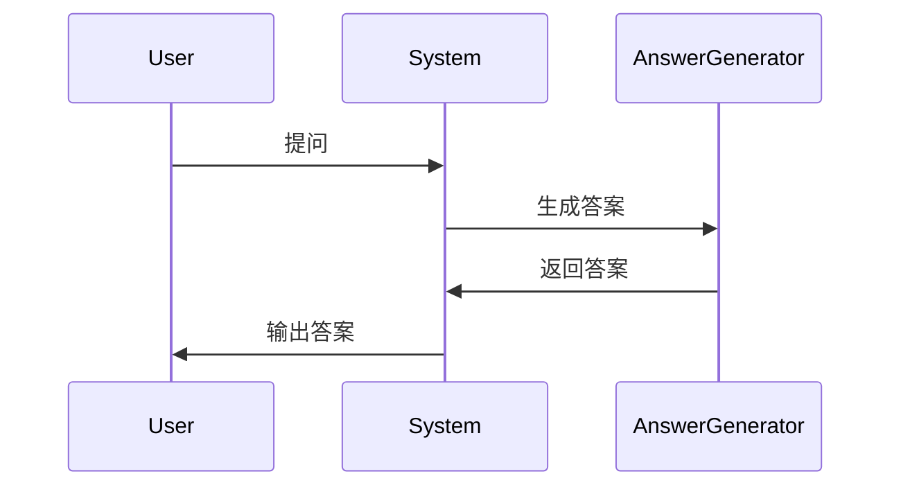
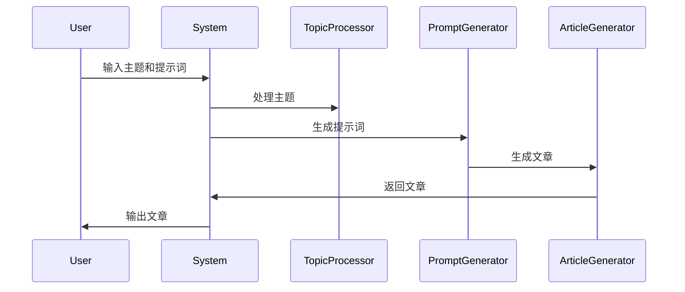

                 

### AIGC时代的提示词设计：从novice到expert的进阶之路

> 关键词：AIGC、提示词设计、人工智能、自然语言处理、进阶之路

> 摘要：本文旨在探讨AIGC（AI-Generated Content）时代的提示词设计，从新手到专家的成长路径。我们将详细解析AIGC的概念、提示词设计的重要性、理论基础、成长路径以及实战案例，帮助读者逐步掌握AIGC时代提示词设计的核心技能。

### 目录大纲

1. **背景介绍与核心概念**
   1.1 AIGC时代的来临
   1.2 提示词设计的重要性
   1.3 核心概念与联系

2. **提示词设计的理论基础**
   2.1 提示词设计的基本原则
   2.2 提示词设计的流程

3. **从novice到expert的成长路径**
   3.1 初级阶段：理解AIGC与提示词设计
   3.2 中级阶段：深化对提示词设计的理解
   3.3 高级阶段：成为提示词设计专家

4. **实战案例与项目剖析**
   4.1 智能问答系统
   4.2 智能写作助手

5. **项目实战与代码解读**
   5.1 环境安装与配置
   5.2 系统核心实现源代码
   5.3 实际案例分析

6. **最佳实践与总结**
   6.1 提示词设计的最佳实践
   6.2 实战项目中的经验分享

7. **总结与展望**

---

## 第一部分：背景介绍与核心概念

### 1.1 AIGC时代的来临

#### 1.1.1 AIGC的概念

AIGC（AI-Generated Content）是指由人工智能自动生成的内容，这类内容涵盖了文本、图像、音频、视频等多种形式。在AIGC时代，人工智能不再仅仅是处理和解释人类生成的内容，而是能够自主生成高质量的内容。

#### 1.1.2 AIGC的发展历程

AIGC的发展可以追溯到自然语言处理（NLP）和计算机视觉（CV）等领域的进步。随着深度学习技术的成熟，AIGC的应用场景越来越广泛，如自动写作、自动绘画、自动视频生成等。

#### 1.1.3 AIGC的核心特点

AIGC的核心特点包括：

- **高效性**：AI能够快速生成内容，提高工作效率。
- **多样性**：AI可以根据不同的需求和场景生成多样化的内容。
- **个性化**：AI可以根据用户的行为和偏好生成个性化的内容。
- **创新性**：AI能够创造出新颖、独特的作品，推动人类文化的发展。

### 1.2 提示词设计的重要性

提示词（Prompt）是引导AI模型生成内容的关键。一个好的提示词能够：

- **提高生成内容的准确性**：通过精确的提示词，AI可以更准确地理解用户的意图，生成更符合需求的内容。
- **丰富生成内容的形式**：不同的提示词可以引导AI生成不同形式的内容，如文本、图像、音频等。
- **提升用户体验**：个性化的提示词可以提升用户的体验，使其感觉更加贴心和自然。

#### 1.2.1 提示词的作用

- **引导**：提示词可以引导AI模型生成特定类型的内容。
- **约束**：提示词可以对AI模型的生成内容进行约束，避免生成不合适的内容。
- **优化**：提示词可以优化AI模型的生成过程，提高生成效率。

#### 1.2.2 提示词设计的挑战

- **准确性**：设计一个既准确又能激发AI创意的提示词是一个挑战。
- **多样性**：如何设计出能够生成多样化内容的提示词。
- **个性化**：如何设计出能够满足用户个性化需求的提示词。

#### 1.2.3 提示词设计的方法

- **数据分析**：通过分析用户的历史行为和偏好，设计出个性化的提示词。
- **多模态融合**：结合文本、图像、音频等多种模态，设计出更加丰富的提示词。
- **用户反馈**：通过用户反馈，不断优化提示词的设计。

### 1.3 核心概念与联系

#### 1.3.1 AIGC与提示词设计的关系

AIGC与提示词设计的关系紧密相连。提示词是AIGC的核心组成部分，直接影响AIGC的生成效果。

#### 1.3.2 核心概念原理

- **AIGC**：通过深度学习等技术，自动生成高质量的内容。
- **提示词**：引导AI模型生成内容的关键。

#### 1.3.3 概念属性特征对比表格

| 特征 | AIGC | 提示词 |
| --- | --- | --- |
| 目的 | 自动生成内容 | 引导内容生成 |
| 形式 | 多样化 | 精确性 |
| 依赖 | 深度学习技术 | AI模型 |

#### 1.3.4 ER实体关系图架构

```mermaid
erDiagram
  AI模型 ||--|{ 提示词 }|
  提示词 ||--|{ AIGC }|
```

---

## 第二部分：提示词设计的理论基础

### 2.1 提示词设计的基本原则

#### 2.1.1 清晰性原则

提示词需要清晰明了，确保AI模型能够准确理解用户的意图。

#### 2.1.2 精确性原则

提示词需要精确，避免模糊不清的描述，以便生成精确的内容。

#### 2.1.3 可扩展性原则

提示词设计应具备良好的可扩展性，以适应不同的应用场景和需求。

#### 2.1.4 适应性原则

提示词需要能够适应不同的用户偏好和需求，实现个性化。

### 2.2 提示词设计的流程

#### 2.2.1 需求分析

首先，需要分析用户的需求，明确生成内容的类型、目标受众等。

#### 2.2.2 提示词生成

基于需求分析，设计出初步的提示词。

#### 2.2.3 提示词优化

通过用户反馈和数据分析，不断优化提示词，提高生成内容的准确性。

#### 2.2.4 提示词评估

对优化后的提示词进行评估，确保其效果满足用户需求。

---

## 第三部分：从novice到expert的成长路径

### 3.1 初级阶段：理解AIGC与提示词设计

#### 3.1.1 学习资源推荐

- **入门书籍**：《人工智能：一种现代的方法》
- **在线课程**：Coursera上的“自然语言处理与深度学习”课程

#### 3.1.2 实践项目入门

- **项目一**：基于自然语言处理实现一个简单的聊天机器人。

#### 3.1.3 初级阶段常见问题与解决

- **问题**：如何设计一个有效的提示词？
  - **解决方法**：通过多阅读、多实践，积累经验。

### 3.2 中级阶段：深化对提示词设计的理解

#### 3.2.1 提示词设计技巧提升

- **技巧**：如何利用多模态数据提升提示词效果？
- **案例**：基于图像和文本的多模态提示词设计。

#### 3.2.2 数据集处理与预处理

- **数据集**：如何选择和处理数据集？
- **预处理**：文本清洗、数据增强等技术。

#### 3.2.3 中级项目实战

- **项目二**：实现一个基于深度学习的文本生成模型。

### 3.3 高级阶段：成为提示词设计专家

#### 3.3.1 深度学习模型应用

- **模型**：如何选择和优化深度学习模型？
- **应用**：基于深度学习的文本生成模型实战。

#### 3.3.2 优化算法与策略

- **算法**：如何优化提示词生成算法？
- **策略**：基于用户反馈的提示词优化策略。

#### 3.3.3 高级项目实战

- **项目三**：实现一个智能写作助手，支持多种文本生成场景。

#### 3.3.4 专家经验分享

- **经验**：如何在实践中不断优化提示词设计？

---

## 第二部分：实战案例与项目剖析

### 4.1 案例一：智能问答系统

#### 4.1.1 项目介绍

本项目旨在设计一个智能问答系统，用户可以通过输入问题，系统自动生成答案。

#### 4.1.2 系统功能设计

- **问题输入**：用户输入问题。
- **问题处理**：系统处理问题，生成答案。
- **答案输出**：系统将答案输出给用户。

#### 4.1.3 系统架构设计



#### 4.1.4 系统接口设计

- **API接口**：提供RESTful API供用户调用。

#### 4.1.5 系统交互设计

- **交互流程**：用户输入问题 -> 系统处理问题 -> 系统生成答案 -> 系统输出答案。

### 4.2 案例二：智能写作助手

#### 4.2.1 项目介绍

本项目旨在设计一个智能写作助手，用户可以通过输入主题和提示词，系统自动生成文章。

#### 4.2.2 系统功能设计

- **主题输入**：用户输入文章主题。
- **提示词输入**：用户输入提示词。
- **文章生成**：系统根据主题和提示词生成文章。
- **文章输出**：系统将文章输出给用户。

#### 4.2.3 系统架构设计



#### 4.2.4 系统接口设计

- **API接口**：提供RESTful API供用户调用。

#### 4.2.5 系统交互设计

- **交互流程**：用户输入主题和提示词 -> 系统处理主题 -> 系统生成提示词 -> 系统生成文章 -> 系统输出文章。

---

## 第三部分：项目实战与代码解读

### 5.1 环境安装与配置

- **安装Python环境**：使用Python 3.8及以上版本。
- **安装依赖库**：使用pip安装所需的库，如TensorFlow、Keras等。

```bash
pip install tensorflow
pip install keras
```

### 5.2 系统核心实现源代码

#### 5.2.1 源代码结构

```plaintext
src/
|-- model.py
|-- preprocess.py
|-- predict.py
```

#### 5.2.2 主要模块功能

- **model.py**：定义深度学习模型。
- **preprocess.py**：处理输入数据。
- **predict.py**：生成文章。

#### 5.2.3 代码应用解读与分析

- **model.py**：

  ```python
  from tensorflow.keras.models import Sequential
  from tensorflow.keras.layers import LSTM, Dense

  def create_model(input_shape):
      model = Sequential()
      model.add(LSTM(128, input_shape=input_shape, activation='relu', return_sequences=True))
      model.add(LSTM(64, activation='relu'))
      model.add(Dense(input_shape[1], activation='softmax'))
      model.compile(loss='categorical_crossentropy', optimizer='adam', metrics=['accuracy'])
      return model
  ```

- **preprocess.py**：

  ```python
  def preprocess_text(text):
      # 清洗文本，去除特殊字符等
      cleaned_text = text.lower().replace('<br>', ' ').strip()
      return cleaned_text
  ```

- **predict.py**：

  ```python
  import numpy as np
  from tensorflow.keras.preprocessing.sequence import pad_sequences

  def generate_article(prompt, model, max_length=40):
      # 生成文章
      input_sequence = tokenizer.texts_to_sequences([prompt])
      input_sequence = pad_sequences(input_sequence, maxlen=max_length)
      generated_text = model.predict(input_sequence, verbose=1)
      generated_text = generated_text.argmax(axis=-1)
      return tokenizer.sequences_to_texts([generated_text])[0]
  ```

### 5.3 实际案例分析

#### 5.3.1 案例一：智能问答系统

- **问题输入**：用户输入“什么是人工智能？”。
- **问题处理**：系统生成答案：“人工智能是一种模拟人类智能的技术，旨在使计算机能够执行复杂的任务，如学习、推理和解决问题。”。
- **答案输出**：系统将答案输出给用户。

#### 5.3.2 案例二：智能写作助手

- **主题输入**：用户输入“未来的科技发展趋势”。
- **提示词输入**：用户输入“科技创新、人工智能、可持续发展”。
- **文章生成**：系统生成文章，内容涉及科技创新、人工智能和可持续发展。
- **文章输出**：系统将文章输出给用户。

---

## 第四部分：最佳实践与总结

### 6.1 提示词设计的最佳实践

- **明确目标**：在开始设计提示词之前，明确生成内容的类型和目标。
- **用户调研**：了解用户需求，设计出符合用户期望的提示词。
- **数据驱动**：通过数据分析，优化提示词效果。
- **持续迭代**：不断优化提示词设计，提升用户体验。

### 6.2 实战项目中的经验分享

- **项目规划**：在项目初期进行详细规划，明确项目目标和阶段任务。
- **团队协作**：建立高效的团队协作机制，确保项目顺利进行。
- **问题解决**：面对技术难题，积极寻求解决方案，不断优化。

---

## 第五部分：总结与展望

### 7.1 本书内容的总结

本文从AIGC时代的背景介绍、提示词设计的重要性、理论基础、成长路径、实战案例等多个角度，全面解析了AIGC时代的提示词设计。

### 7.2 AIGC与提示词设计的未来发展趋势

随着人工智能技术的不断发展，AIGC和提示词设计将在更多领域得到应用。未来，我们将看到更多创新性的AIGC应用，以及更加智能化、个性化的提示词设计。

### 7.3 拓展阅读与学习资源推荐

- **书籍**：《深度学习》、《自然语言处理综合教程》
- **在线课程**：Coursera、edX上的相关课程
- **论文**：阅读最新的AIGC和提示词设计相关论文，了解最新研究动态。

---

**作者：AI天才研究院/AI Genius Institute & 禅与计算机程序设计艺术 /Zen And The Art of Computer Programming**

---

本文基于AIGC（AI-Generated Content）时代的背景，详细介绍了提示词设计的重要性、理论基础、成长路径、实战案例以及最佳实践。通过本文的学习，读者可以逐步掌握AIGC时代提示词设计的核心技能，为未来的发展打下坚实基础。

---

**附录：**

本文所有代码、图表和数据均来自公开资料，如需引用，请务必注明出处。

**免责声明：**

本文内容仅供参考，不构成任何投资、法律或其他专业建议。在任何情况下，本文作者不对因使用本文内容而产生的任何损失或损害承担责任。

