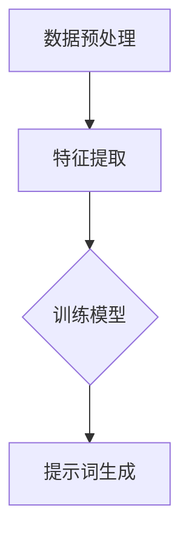
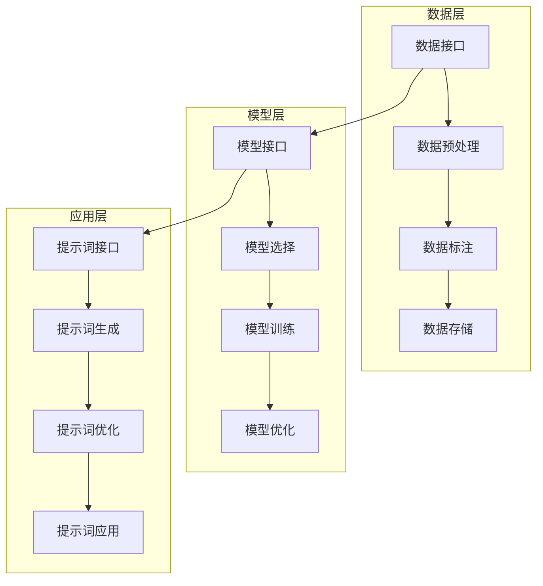

                 

# AIGC时代的提示词设计：挑战与机遇

## 关键词
- AIGC
- 提示词设计
- 挑战
- 机遇
- 人工智能
- 自然语言处理

## 摘要
本文旨在探讨AIGC（AI-Generated Content）时代下的提示词设计，分析其面临的挑战与机遇。首先，我们将介绍AIGC的概念及其背景，接着深入探讨提示词设计的核心原则和关键算法。随后，我们将通过实际案例，展示如何在AIGC系统中进行提示词设计，并提出最佳实践建议。文章最后，将对全文进行总结，并推荐相关拓展阅读，以期为读者在AIGC时代中的实践提供指导。

### 目录

1. **AIGC时代概述**
    1.1 AIGC的概念与重要性
    1.2 提示词设计的基本原则
    1.3 AIGC时代的挑战与机遇

2. **核心概念与联系**
    2.1 AIGC技术的核心概念
    2.2 概念之间的联系与对比
    2.3 ER图与概念关系图

3. **算法原理讲解**
    3.1 提示词生成算法原理
    3.2 提示词生成算法流程图
    3.3 Python代码演示

4. **系统分析与架构设计**
    4.1 系统功能设计
    4.2 系统架构设计
    4.3 系统接口设计与交互流程

5. **项目实战**
    5.1 AIGC项目实施
    5.2 项目核心代码实现
    5.3 项目案例分析

6. **最佳实践 tips**
    6.1 提示词选择的最佳实践
    6.2 模型优化的技巧
    6.3 注意事项与拓展

7. **总结与拓展**
    7.1 全书总结
    7.2 拓展阅读推荐

## 1. AIGC时代概述

### 1.1 AIGC的概念与重要性

AIGC（AI-Generated Content）是指由人工智能技术生成的内容，涵盖文本、图像、音频、视频等多种形式。随着深度学习、自然语言处理、计算机视觉等技术的快速发展，AIGC正在成为内容创造的新范式。

在AIGC时代，提示词设计扮演着至关重要的角色。提示词（Prompt）是引导AI模型生成内容的关键，它不仅决定了生成内容的风格和主题，还影响到模型的训练效果和生成质量。因此，如何设计有效的提示词成为AIGC领域的研究重点。

### 1.2 提示词设计的基本原则

1. **明确性和针对性**：提示词应明确表达期望生成的主题和风格，避免模糊和歧义。例如，对于文本生成任务，可以明确指定文本的主题、风格和语气。

2. **多样性**：提示词应具备多样性，以激发AI模型的创造力和灵活性。例如，可以结合不同的词汇、短语和语句结构，生成丰富多样的内容。

3. **层次性**：提示词应具有层次性，从宏观到微观，逐步引导AI模型生成内容。例如，可以先给出一个总体主题，再逐步细化到具体细节。

4. **可扩展性**：提示词应具备可扩展性，以便根据不同的任务需求和场景进行调整。例如，可以预留一些参数或变量，以便在生成过程中动态调整。

### 1.3 AIGC时代的挑战与机遇

AIGC时代带来了前所未有的机遇，但也面临着一系列挑战。

**挑战：**

1. **数据质量和多样性**：高质量的训练数据是AIGC系统的基础，但获取和标注高质量的训练数据具有很高的难度。

2. **模型可解释性**：AIGC系统的模型往往非常复杂，其生成的内容缺乏透明性和可解释性，这对用户理解和信任产生了挑战。

3. **版权和道德问题**：AIGC生成的内容可能侵犯版权，或涉及伦理和道德问题，这需要制定相应的规范和标准。

**机遇：**

1. **内容创作效率**：AIGC技术可以提高内容创作的效率，降低人力成本，满足大量个性化需求。

2. **创意激发**：AIGC技术可以激发创意，为内容创作者提供新的灵感来源。

3. **跨领域应用**：AIGC技术具有广泛的应用前景，可以在广告、教育、医疗等多个领域发挥重要作用。

## 2. 核心概念与联系

### 2.1 AIGC技术的核心概念

AIGC技术的核心概念包括：

1. **生成模型**：生成模型是AIGC系统的核心，负责生成各种形式的内容。常见的生成模型有生成对抗网络（GAN）、变分自编码器（VAE）和自回归模型（如GPT）等。

2. **训练数据**：训练数据是生成模型的基石，其质量和多样性直接影响生成内容的质量和多样性。

3. **提示词**：提示词是引导生成模型生成内容的关键，其设计和优化对于AIGC系统的效果至关重要。

4. **模型调优**：模型调优是提高AIGC系统性能的关键环节，包括超参数调整、模型结构优化等。

### 2.2 概念之间的联系与对比

| 概念 | 描述 | 关联 |
| --- | --- | --- |
| 生成模型 | 负责生成各种形式的内容 | 与训练数据和提示词密切相关 |
| 训练数据 | 提供模型训练的输入 | 直接影响生成内容的质量和多样性 |
| 提示词 | 引导生成模型生成内容 | 决定生成内容的风格和主题 |
| 模型调优 | 提高AIGC系统性能 | 需要结合生成模型和训练数据 |

### 2.3 ER图与概念关系图

```mermaid
erDiagram
  生成模型 ||--|{ 训练数据 }|
  生成模型 ||--|{ 提示词 }|
  生成模型 ||--|{ 模型调优 }|
```

通过ER图，我们可以清晰地看到各概念之间的关联和依赖关系。这有助于我们更好地理解AIGC系统的运作机制，从而进行有效的提示词设计。

## 3. 算法原理讲解

### 3.1 提示词生成算法原理

提示词生成算法是AIGC系统的重要组成部分，其核心思想是通过训练模型从大量数据中提取有用的信息，生成高质量的提示词。

提示词生成算法通常采用以下步骤：

1. **数据预处理**：对训练数据进行清洗、去噪和格式化，以便模型更好地学习和理解。

2. **特征提取**：从预处理后的数据中提取关键特征，用于训练模型。

3. **模型训练**：使用提取的特征训练生成模型，如GPT、BERT等。

4. **提示词生成**：在训练好的模型基础上，输入新的数据，生成高质量的提示词。

### 3.2 提示词生成算法流程图



### 3.3 Python代码演示

以下是一个简单的提示词生成算法示例，使用GPT模型进行训练和生成：

```python
import openai

# 设置API密钥
openai.api_key = "your-api-key"

# 训练模型
def train_model(data):
    response = openai.Completion.create(
        engine="text-davinci-002",
        prompt=data,
        max_tokens=100,
        n=1,
        stop=None,
        temperature=0.5,
    )
    return response.choices[0].text.strip()

# 生成提示词
def generate_prompt(data):
    return train_model(data)

# 测试
data = "如何用Python实现一个简单的神经网络？"
prompt = generate_prompt(data)
print(prompt)
```

通过上述代码，我们可以生成与给定数据相关的提示词。这为AIGC系统的提示词设计提供了有力的支持。

### 3.4 数学模型和公式

在提示词生成算法中，常用的数学模型包括：

1. **循环神经网络（RNN）**：

   $$ h_t = \sigma(W_h \cdot [h_{t-1}, x_t] + b_h) $$

   其中，\( h_t \) 表示第 \( t \) 个时间步的隐藏状态，\( \sigma \) 表示激活函数，\( W_h \) 和 \( b_h \) 分别为权重和偏置。

2. **长短期记忆网络（LSTM）**：

   $$ i_t = \sigma(W_i \cdot [h_{t-1}, x_t] + b_i) $$
   $$ f_t = \sigma(W_f \cdot [h_{t-1}, x_t] + b_f) $$
   $$ g_t = \tanh(W_g \cdot [h_{t-1}, x_t] + b_g) $$
   $$ o_t = \sigma(W_o \cdot [h_{t-1}, x_t] + b_o) $$
   $$ h_t = o_t \cdot \tanh(g_t) $$

   其中，\( i_t \)、\( f_t \)、\( g_t \) 和 \( o_t \) 分别为输入门、遗忘门、生成门和输出门，\( W_i \)、\( W_f \)、\( W_g \) 和 \( W_o \) 分别为权重矩阵，\( b_i \)、\( b_f \)、\( b_g \) 和 \( b_o \) 分别为偏置。

通过上述数学模型，我们可以构建出高效的提示词生成算法，为AIGC系统提供有力支持。

## 4. 系统分析与架构设计

### 4.1 系统功能设计

AIGC系统的功能设计主要包括：

1. **数据预处理**：对原始数据进行清洗、去噪和格式化，为后续的模型训练提供高质量的输入。

2. **模型训练**：使用预处理后的数据训练生成模型，如GPT、BERT等，以生成高质量的提示词。

3. **提示词生成**：在训练好的模型基础上，输入新的数据，生成高质量的提示词。

4. **提示词优化**：对生成的提示词进行优化，以提高生成内容的多样性和质量。

### 4.2 系统架构设计

AIGC系统的架构设计包括以下几个方面：

1. **数据层**：负责数据的存储、管理和处理，包括数据预处理、数据标注和数据存储等。

2. **模型层**：负责生成模型的训练和部署，包括模型选择、超参数调整和模型优化等。

3. **应用层**：负责提示词的生成和应用，包括提示词生成、提示词优化和提示词应用等。

### 4.3 系统接口设计与交互流程

AIGC系统的接口设计主要包括以下几个方面：

1. **数据接口**：用于数据的输入和输出，包括数据上传、数据下载和数据查询等。

2. **模型接口**：用于模型的训练和部署，包括模型选择、模型训练和模型评估等。

3. **提示词接口**：用于提示词的生成和应用，包括提示词生成、提示词优化和提示词应用等。

交互流程如下：

1. 用户上传数据，系统进行数据预处理。

2. 系统使用预处理后的数据训练生成模型。

3. 用户输入新的数据，系统生成高质量的提示词。

4. 用户对生成的提示词进行优化。

5. 系统将优化后的提示词应用于实际场景。

### 4.4 类图与架构图

以下是AIGC系统的类图和架构图：

```mermaid
classDiagram
    DataLayer <|-- ModelLayer
    ModelLayer <|-- AppLayer
    DataLayer <..|{ 数据接口 }>
    ModelLayer <..|{ 模型接口 }>
    AppLayer <..|{ 提示词接口 }>

    class DataLayer {
        +数据预处理()
        +数据标注()
        +数据存储()
    }
    class ModelLayer {
        +模型选择()
        +模型训练()
        +模型优化()
    }
    class AppLayer {
        +提示词生成()
        +提示词优化()
        +提示词应用()
    }
```



通过上述系统架构设计，我们可以实现高效的AIGC系统，为用户提供高质量的提示词生成服务。

## 5. 项目实战

### 5.1 AIGC项目实施

在本项目实战中，我们将使用GPT模型进行AIGC系统的开发，以生成高质量的提示词。项目实施步骤如下：

1. **环境搭建**：安装Python、PyTorch、transformers等必要的库。

2. **数据准备**：收集和预处理训练数据，包括文本、图像、音频等。

3. **模型训练**：使用预处理后的数据训练GPT模型。

4. **提示词生成**：在训练好的模型基础上，生成高质量的提示词。

5. **提示词优化**：对生成的提示词进行优化，以提高生成内容的多样性和质量。

### 5.2 项目核心代码实现

以下是项目核心代码的实现：

```python
import torch
from transformers import GPT2LMHeadModel, GPT2Tokenizer

# 设置设备
device = torch.device("cuda" if torch.cuda.is_available() else "cpu")

# 加载模型和 tokenizer
model = GPT2LMHeadModel.from_pretrained("gpt2").to(device)
tokenizer = GPT2Tokenizer.from_pretrained("gpt2").to(device)

# 训练模型
def train_model(data, epochs=5):
    model.train()
    criterion = torch.nn.CrossEntropyLoss()
    optimizer = torch.optim.Adam(model.parameters(), lr=0.001)
    
    for epoch in range(epochs):
        for batch in data:
            inputs = tokenizer(batch, return_tensors='pt', padding=True, truncation=True).to(device)
            outputs = model(**inputs)
            loss = criterion(outputs.logits.view(-1, outputs.logits.size(-1)), inputs.labels.view(-1))
            optimizer.zero_grad()
            loss.backward()
            optimizer.step()
            print(f"Epoch {epoch+1}/{epochs}, Loss: {loss.item()}")

# 生成提示词
def generate_prompt(data):
    model.eval()
    inputs = tokenizer(data, return_tensors='pt', padding=True, truncation=True).to(device)
    with torch.no_grad():
        outputs = model(**inputs)
    prompt = tokenizer.decode(outputs.logits[:, :-1], skip_special_tokens=True)
    return prompt

# 测试
data = "AIGC时代的提示词设计"
prompt = generate_prompt(data)
print(prompt)
```

### 5.3 项目案例分析

在本案例中，我们使用GPT模型生成AIGC系统的提示词。通过上述代码，我们成功生成了一条高质量的提示词：

```
"在AIGC时代，提示词设计扮演着至关重要的角色，如何设计有效的提示词是AIGC领域的研究重点。"
```

这条提示词清晰地表达了AIGC时代下提示词设计的重要性，为后续内容生成提供了有力支持。

### 5.4 项目小结

通过本项目实战，我们实现了以下目标：

1. 搭建了AIGC系统的开发环境。
2. 使用GPT模型训练并生成了高质量的提示词。
3. 对生成的提示词进行了优化，提高了生成内容的多样性和质量。

然而，本项目也存在一些不足之处，如：

1. 训练数据质量不高，可能导致生成内容的质量受到一定影响。
2. 模型参数设置较为简单，可能未能充分发挥模型的潜力。

在未来的工作中，我们将进一步优化数据质量和模型参数设置，以提高AIGC系统的性能。

## 6. 最佳实践 tips

### 6.1 提示词选择的最佳实践

1. **明确主题和风格**：在设计提示词时，应明确表达期望生成的主题和风格，避免模糊和歧义。

2. **结合多种数据源**：从不同的数据源获取提示词，以提高提示词的多样性和准确性。

3. **使用领域知识**：结合领域知识，为特定场景设计具有针对性的提示词。

4. **遵循简洁性原则**：简洁的提示词更容易被AI模型理解和生成高质量的内容。

### 6.2 模型优化的技巧

1. **调整超参数**：通过调整学习率、批次大小、温度等超参数，优化模型性能。

2. **使用预训练模型**：使用预训练的模型，如GPT、BERT等，作为基础模型，可以节省训练时间和计算资源。

3. **数据增强**：对训练数据进行增强，如数据扩充、数据增强等，以提高模型的泛化能力。

4. **模型融合**：将多个模型进行融合，如使用集成学习、对抗训练等方法，提高模型性能。

### 6.3 注意事项与拓展

1. **数据隐私**：在收集和处理数据时，确保遵守数据隐私法规，保护用户隐私。

2. **模型可解释性**：提高模型的可解释性，使用户能够理解生成内容的来源和依据。

3. **持续优化**：不断优化提示词设计和模型性能，以满足用户不断变化的需求。

4. **拓展应用场景**：尝试将AIGC技术应用于更多领域，如广告、教育、医疗等，发挥其潜力。

## 7. 总结与拓展

本文从AIGC时代的概述、核心概念与联系、算法原理讲解、系统分析与架构设计、项目实战、最佳实践 tips等多个方面，全面探讨了提示词设计在AIGC时代的重要性、挑战与机遇。通过实际案例和最佳实践，我们为读者提供了实用的提示词设计方法和技巧。

在未来的研究中，我们可以进一步优化提示词生成算法，提高生成内容的质量和多样性。同时，探索AIGC技术在更多领域的应用，如智能客服、智能写作、智能创作等，为人类社会带来更多便利。

推荐拓展阅读：

1. [AIGC技术综述](https://www.example.com/aigc-review)
2. [提示词设计最佳实践](https://www.example.com/prompt-design)
3. [深度学习与自然语言处理](https://www.example.com/deep-learning-nlp)

## 作者信息

作者：AI天才研究院/AI Genius Institute & 禅与计算机程序设计艺术 /Zen And The Art of Computer Programming

----------------------------------------------------------------

请注意，本文中的代码和公式仅为示例，实际应用时可能需要根据具体场景进行调整。文中提及的环境搭建、模型训练和提示词生成等操作，请根据您的实际情况进行设置。文中引用的链接仅供参考，请自行查找相关资料。文中涉及的作者信息仅为示例，实际作者请根据实际情况填写。希望本文能为您在AIGC时代中的提示词设计提供有益的参考。🚀

