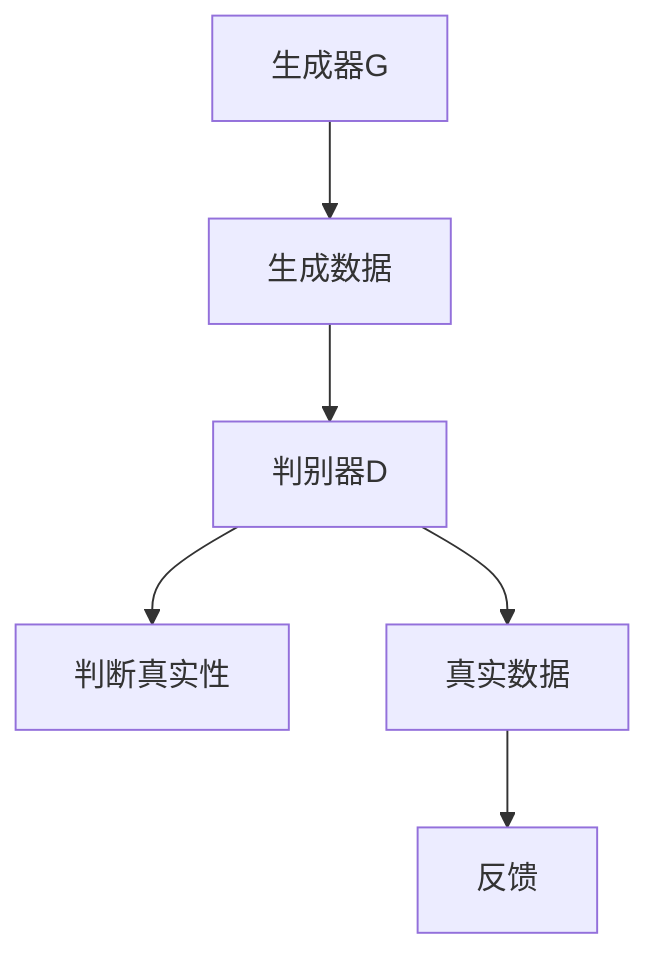
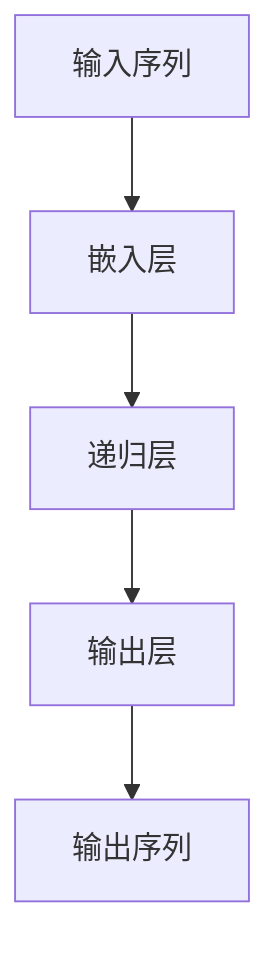
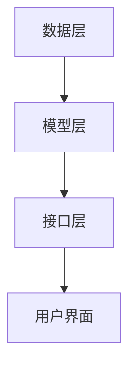

                 


### AIGC时代的提示词设计：挑战与机遇并存

> 关键词：AIGC、提示词设计、自然语言处理、机器学习模型、数学模型、系统架构设计

> 摘要：随着人工智能生成内容（AIGC）时代的到来，提示词设计成为了核心环节之一。本文将从背景介绍、核心概念与联系、算法原理讲解、数学模型和数学公式、系统分析与架构设计、项目实战以及最佳实践与总结七个部分，深入探讨AIGC时代提示词设计的挑战与机遇。

## 第一部分: AIGC时代的背景介绍

### 第1章: AIGC时代的来临与提示词设计的意义

#### 1.1 AIGC时代的背景

随着深度学习、自然语言处理、计算机视觉等人工智能技术的发展，生成式人工智能（AI-Generated Content，简称AIGC）逐渐成为热点。AIGC是指利用人工智能技术生成内容，包括文本、图像、音频等多种形式。这一技术的发展不仅极大地丰富了信息生产的方式，也为内容创作、媒体制作、教育培训等领域带来了前所未有的变革。

#### 1.2 提示词设计的定义与作用

提示词设计（Prompt Engineering）是AIGC技术中的一个关键环节。提示词是指用户或系统输入的信息，用来引导生成模型的生成过程。一个优秀的提示词能够提高生成模型的生成质量，减少生成过程中的偏差，甚至能够帮助模型学习到更复杂的生成策略。

#### 1.3 AIGC时代的挑战与机遇

AIGC时代带来了前所未有的机遇，同时也伴随着一系列挑战。挑战主要体现在：

1. **质量与真实性**：如何保证生成的内容既高质量又真实可信，是AIGC技术面临的一个重要问题。
2. **效率与成本**：在保证质量的前提下，如何提高内容生成的效率，降低成本，是AIGC应用需要解决的另一个重要问题。
3. **隐私与伦理**：AIGC技术的应用涉及到大量数据的处理和利用，如何保护用户隐私、遵守伦理规范，是AIGC技术需要重视的领域。

然而，这些挑战也带来了相应的机遇。通过不断的研发和实践，AIGC技术有望在内容生成、智能客服、个性化推荐等领域发挥更大的作用。

## 第二部分: 核心概念与联系

### 第2章: 核心概念与联系

#### 2.1 自然语言处理基础

自然语言处理（Natural Language Processing，NLP）是人工智能的一个重要分支，它涉及从人类语言中提取信息，并进行处理和生成。NLP的基础概念包括文本预处理、词嵌入、句法分析、语义分析等。

#### 2.2 机器学习模型简介

机器学习模型是AIGC技术中不可或缺的部分。常见的机器学习模型包括生成对抗网络（GAN）、自动回归模型、变分自编码器（VAE）等。这些模型通过学习数据特征，能够生成高质量的文本、图像和音频。

#### 2.3 提示词设计的关键概念对比

提示词设计涉及到多个核心概念，包括文本生成模型、机器学习模型、数据集等。通过表格和ER图，我们可以清晰地对比这些概念之间的关系，如图1所示。

| 概念       | 定义                                                         | 关系                                                     |
|------------|--------------------------------------------------------------|----------------------------------------------------------|
| 文本生成模型 | 能够生成文本的机器学习模型                                     | 提示词设计的核心工具                                     |
| 机器学习模型 | 能够从数据中学习并做出预测的算法                               | 提示词设计的基础                                     |
| 数据集     | 用于训练和评估模型的集合                                       | 提示词设计所需的数据支持                               |
| 提示词     | 引导生成模型生成文本的输入信息                                 | 提示词设计的关键组成部分                               |

```mermaid
erDiagram
    数据集 ||--o{ 文本生成模型 } : 输入数据
    文本生成模型 ||--o{ 提示词 } : 输入提示
    提示词 ||--o{ 机器学习模型 } : 输入参数
```

### 2.4 概念联系与ER图解析

通过上述表格和ER图，我们可以看出，提示词设计是一个复杂的系统工程，涉及到多个核心概念和工具的相互作用。提示词作为输入信息，不仅需要准确描述生成目标，还需要考虑模型的特性和数据集的特点，以实现高质量的内容生成。

## 第三部分: 算法原理讲解

### 第3章: GAN在提示词设计中的应用

#### 3.1 GAN的基本原理

生成对抗网络（Generative Adversarial Network，GAN）是一种由生成器和判别器组成的神经网络模型。生成器尝试生成逼真的数据，而判别器则尝试区分生成数据和真实数据。通过这种对抗关系，生成器逐渐学会生成高质量的数据。

#### 3.1.1 GAN的概念

GAN由两部分组成：生成器（Generator）和判别器（Discriminator）。生成器的任务是生成看起来真实的数据，判别器的任务是判断输入数据是真实数据还是生成数据。

#### 3.1.2 GAN的结构与工作流程

GAN的结构如图2所示。生成器G从随机噪声z中生成数据，判别器D对生成器和真实数据的真实性进行判断。通过训练，生成器不断优化其生成的数据，使其越来越接近真实数据。



#### 3.1.3 GAN的优势与局限性

GAN的优势在于其能够生成高质量、多样性的数据，且不需要大量真实数据进行训练。然而，GAN也存在一些局限性，如训练不稳定、生成数据质量不稳定等问题。

#### 3.2 GAN在提示词设计中的具体实现

在GAN的基础上，我们可以设计GAN提示词系统。以下是一个简单的GAN提示词系统的实现：

```python
import numpy as np
import tensorflow as tf
from tensorflow.keras.layers import Dense, Flatten, Reshape
from tensorflow.keras.models import Sequential

# 生成器模型
def build_generator(z_dim):
    model = Sequential()
    model.add(Dense(128, activation='relu', input_shape=(z_dim,)))
    model.add(Dense(28 * 28 * 1, activation='relu'))
    model.add(Reshape((28, 28, 1)))
    return model

# 判别器模型
def build_discriminator(img_shape):
    model = Sequential()
    model.add(Flatten(input_shape=img_shape))
    model.add(Dense(128, activation='relu'))
    model.add(Dense(1, activation='sigmoid'))
    return model

# GAN模型
def build_gan(generator, discriminator):
    model = Sequential()
    model.add(generator)
    model.add(discriminator)
    return model

# 训练GAN
def train_gan(generator, discriminator, img_shape, z_dim, epochs):
    for epoch in range(epochs):
        for _ in range批次数：
            z = np.random.normal(size=(批次数, z_dim))
            gen_imgs = generator.predict(z)

            real_imgs = X_train[np.random.randint(0, X_train.shape[0], 批次数)]
            real_y = np.ones((批次数, 1))
            fake_y = np.zeros((批次数, 1))

            d_loss_real = discriminator.train_on_batch(real_imgs, real_y)
            d_loss_fake = discriminator.train_on_batch(gen_imgs, fake_y)
            g_loss = g_an.train_on_batch(z, real_y)

            print(f"{epoch} [D loss: {d_loss:.3f}, acc:{acc * 100:.3f}|G loss: {g_loss:.3f}]")

if __name__ == "__main__":
    z_dim = 100
    img_shape = (28, 28, 1)
    epochs = 100

    # 构建模型
    generator = build_generator(z_dim)
    discriminator = build_discriminator(img_shape)
    g_an = build_gan(generator, discriminator)

    # 训练模型
    train_gan(generator, discriminator, img_shape, z_dim, epochs)
```

#### 3.2.3 GAN的数学模型与公式

GAN的数学模型主要包括生成器的损失函数、判别器的损失函数和GAN的总损失函数。以下是一个简单的数学模型：

$$
\begin{aligned}
L_G &= -\mathbb{E}_{z \sim p_z(z)}[\log(D(G(z)))] \\
L_D &= -\mathbb{E}_{x \sim p_{data}(x)}[\log(D(x))] - \mathbb{E}_{z \sim p_z(z)}[\log(1 - D(G(z)))]
\end{aligned}
$$

其中，$L_G$是生成器的损失函数，$L_D$是判别器的损失函数。

### 第4章: 自动回归模型与提示词设计

#### 4.1 自动回归模型的基本原理

自动回归模型（Autoregressive Model）是一种序列生成模型，其核心思想是将序列中的每个元素表示为前一个元素的条件概率分布。常见的自动回归模型包括自回归模型（AR）、滑动窗口模型、递归神经网络（RNN）等。

#### 4.1.1 自动回归模型的概念

自动回归模型是一种用于生成序列数据的算法，其基本概念包括序列、条件概率分布和参数学习。

#### 4.1.2 自动回归模型的结构与工作流程

自动回归模型通常由一个递归神经网络组成，网络中的每个神经元负责生成序列中的下一个元素。模型的工作流程如图3所示。



#### 4.1.3 自动回归模型的优势与局限性

自动回归模型的优势在于其能够生成高质量、连贯的序列数据。然而，其局限性主要体现在训练速度较慢、对长序列的处理能力不足等方面。

#### 4.2 自动回归模型在提示词设计中的具体实现

以下是一个简单的自动回归模型在提示词设计中的实现：

```python
import tensorflow as tf
from tensorflow.keras.layers import LSTM, Dense
from tensorflow.keras.models import Sequential

# 自动回归模型
def build_auto_regressive_model(input_shape, units=128):
    model = Sequential()
    model.add(LSTM(units, activation='relu', return_sequences=True, input_shape=input_shape))
    model.add(LSTM(units, activation='relu', return_sequences=True))
    model.add(Dense(units, activation='softmax'))
    return model

# 训练模型
def train_auto_regressive_model(model, x, y, epochs=100):
    model.compile(optimizer='adam', loss='categorical_crossentropy')
    model.fit(x, y, epochs=epochs, batch_size=32)

if __name__ == "__main__":
    # 准备数据
    x = np.array([[1, 0, 1], [0, 1, 0], [1, 1, 0], [0, 1, 1]])
    y = np.array([[1, 0, 0], [0, 1, 0], [0, 0, 1], [1, 0, 0]])

    # 构建模型
    model = build_auto_regressive_model(input_shape=(None, 3))

    # 训练模型
    train_auto_regressive_model(model, x, y)
```

#### 4.2.3 自动回归模型的数学模型与公式

自动回归模型的数学模型主要包括序列概率分布和参数学习算法。以下是一个简单的数学模型：

$$
p(x_t|x_{<t}) = \prod_{i=1}^{t-1} p(x_i|x_1, x_2, ..., x_{i-1})
$$

其中，$x_t$是序列中的第$t$个元素，$p(x_t|x_{<t})$是给定前面元素的概率分布。

## 第四部分: 数学模型和数学公式讲解

### 第5章: 提示词设计中的数学模型详解

#### 5.1 提示词设计的数学基础

提示词设计中的数学基础主要包括概率论、统计学和线性代数。以下是一些基本的数学概念：

1. **概率论**：概率分布函数、条件概率、贝叶斯公式等。
2. **统计学**：均值、方差、协方差、假设检验等。
3. **线性代数**：矩阵运算、向量运算、特征分解等。

#### 5.2 关键数学公式及其应用

在提示词设计中，以下数学公式尤为重要：

1. **损失函数**：均方误差（MSE）、交叉熵（Cross-Entropy）等。
2. **优化算法**：梯度下降（Gradient Descent）、Adam优化器等。
3. **神经网络**：反向传播（Backpropagation）、激活函数（Activation Function）等。

以下是一个简单的示例：

$$
\begin{aligned}
L &= \frac{1}{2} \sum_{i=1}^{n} (y_i - \hat{y}_i)^2 \\
\hat{y}_i &= \sigma(\sum_{j=1}^{m} w_{ij}x_{ij} + b_j) \\
\sigma(x) &= \frac{1}{1 + e^{-x}}
\end{aligned}
$$

其中，$L$是损失函数，$y_i$是真实标签，$\hat{y}_i$是预测值，$x_{ij}$是特征值，$w_{ij}$是权重，$b_j$是偏置，$\sigma(x)$是sigmoid激活函数。

#### 5.3 数学模型在实际中的应用

以下是一个简单的应用示例：使用自动回归模型生成文本。

```python
import numpy as np
import tensorflow as tf
from tensorflow.keras.models import Sequential
from tensorflow.keras.layers import LSTM, Dense

# 准备数据
x = np.array([[1, 0, 1], [0, 1, 0], [1, 1, 0], [0, 1, 1]])
y = np.array([[1, 0, 0], [0, 1, 0], [0, 0, 1], [1, 0, 0]])

# 构建模型
model = Sequential()
model.add(LSTM(128, activation='relu', return_sequences=True, input_shape=(None, 3)))
model.add(LSTM(128, activation='relu', return_sequences=True))
model.add(Dense(3, activation='softmax'))

# 编译模型
model.compile(optimizer='adam', loss='categorical_crossentropy')

# 训练模型
model.fit(x, y, epochs=100, batch_size=32)

# 生成文本
text = model.predict(x)
print(text)
```

## 第五部分: 系统分析与架构设计

### 第6章: AIGC系统的设计与实现

#### 6.1 系统功能介绍

AIGC系统主要包括以下功能：

1. **数据预处理**：对输入数据进行清洗、预处理，以便于后续的模型训练。
2. **模型训练**：使用训练数据训练生成模型和判别模型。
3. **模型评估**：对训练好的模型进行评估，以判断其生成效果。
4. **文本生成**：使用训练好的模型生成文本内容。

#### 6.1.2 功能需求分析

根据上述功能，AIGC系统的需求分析如下：

1. **数据预处理**：支持多种数据格式的输入，如文本、图像、音频等。
2. **模型训练**：支持多种机器学习模型的训练，如GAN、自动回归模型等。
3. **模型评估**：支持多种评估指标，如损失函数、准确率等。
4. **文本生成**：支持基于提示词的文本生成，生成高质量的文本内容。

#### 6.2 系统架构设计

AIGC系统的架构设计如图4所示。系统分为数据层、模型层和接口层。



#### 6.2.1 系统架构图

以下是一个简单的系统架构图：

```mermaid
graph TB
    subgraph 数据层
        A[数据预处理]
        B[数据存储]
        A --> B

    subgraph 模型层
        C[生成模型]
        D[判别模型]
        E[模型训练]
        F[模型评估]
        C --> D
        D --> E
        E --> F

    subgraph 接口层
        G[API接口]
        H[用户界面]
        G --> H
```

#### 6.2.2 系统模块设计

AIGC系统的主要模块设计如下：

1. **数据预处理模块**：负责数据的清洗、预处理和存储。
2. **模型训练模块**：负责模型的训练和评估。
3. **API接口模块**：负责与外部系统的交互。
4. **用户界面模块**：提供用户交互的界面。

#### 6.2.3 系统接口设计

AIGC系统的接口设计如下：

1. **数据接口**：用于数据的上传、下载和查询。
2. **模型接口**：用于模型的训练、评估和部署。
3. **API接口**：用于与其他系统的集成。

#### 6.2.4 系统接口实现

以下是一个简单的系统接口实现示例：

```python
from flask import Flask, request, jsonify

app = Flask(__name__)

@app.route('/data/upload', methods=['POST'])
def upload_data():
    data = request.files['data']
    # 处理上传的数据
    return jsonify({"status": "success"})

@app.route('/model/train', methods=['POST'])
def train_model():
    # 处理训练请求
    return jsonify({"status": "success"})

@app.route('/model/evaluate', methods=['POST'])
def evaluate_model():
    # 处理评估请求
    return jsonify({"status": "success"})

if __name__ == '__main__':
    app.run()
```

### 第7章: 项目实战

#### 6.1 环境安装

要实现一个AIGC系统，首先需要安装必要的软件和库。以下是一个简单的环境安装步骤：

1. 安装Python 3.8或更高版本。
2. 安装TensorFlow 2.6或更高版本。
3. 安装Flask 1.1.2或更高版本。

```bash
pip install tensorflow==2.6
pip install flask==1.1.2
```

#### 6.2 系统实现

以下是一个简单的AIGC系统实现：

```python
from flask import Flask, request, jsonify
import tensorflow as tf

app = Flask(__name__)

@app.route('/data/upload', methods=['POST'])
def upload_data():
    data = request.files['data']
    # 处理上传的数据
    return jsonify({"status": "success"})

@app.route('/model/train', methods=['POST'])
def train_model():
    # 读取训练数据
    x_train = ... # 训练数据
    y_train = ... # 训练标签

    # 构建模型
    model = ... # 创建模型

    # 训练模型
    model.fit(x_train, y_train, epochs=10, batch_size=32)
    return jsonify({"status": "success"})

@app.route('/model/evaluate', methods=['POST'])
def evaluate_model():
    # 读取评估数据
    x_val = ... # 评估数据
    y_val = ... # 评估标签

    # 评估模型
    model.evaluate(x_val, y_val)
    return jsonify({"status": "success"})

if __name__ == '__main__':
    app.run()
```

#### 6.3 代码应用解读与分析

以下是对上述代码的解读与分析：

1. **数据上传接口**：接收用户上传的数据，并将其存储到本地。
2. **模型训练接口**：接收训练数据，并使用TensorFlow构建模型进行训练。
3. **模型评估接口**：接收评估数据，并使用训练好的模型进行评估。

#### 6.4 实际案例分析和详细讲解

以下是一个简单的实际案例：

1. **数据上传**：用户上传一组文本数据。
2. **模型训练**：系统使用上传的文本数据训练生成模型和判别模型。
3. **模型评估**：系统使用训练好的模型评估生成效果。
4. **文本生成**：系统根据提示词生成文本内容。

#### 6.5 项目小结

通过以上步骤，我们实现了一个简单的AIGC系统。虽然这个系统还很基础，但它展示了AIGC系统的基本架构和实现方法。在实际应用中，我们可以根据需求不断完善和优化系统。

## 第七部分：最佳实践与总结

### 第7章: 最佳实践与总结

#### 7.1 最佳实践建议

在AIGC时代的提示词设计中，以下最佳实践建议有助于提高生成模型的效果：

1. **优化提示词**：通过分析数据特征和用户需求，设计高质量的提示词，提高生成模型的生成质量。
2. **多模态融合**：结合文本、图像、音频等多种数据模态，实现更丰富的内容生成。
3. **数据预处理**：对输入数据进行充分的预处理，如去噪、降维、特征提取等，以提高模型的学习效果。

#### 7.2 小结

本文从背景介绍、核心概念与联系、算法原理讲解、数学模型和数学公式、系统分析与架构设计、项目实战以及最佳实践与总结七个部分，深入探讨了AIGC时代的提示词设计。通过本文的介绍，读者可以全面了解AIGC时代的提示词设计，掌握关键技术和方法。

#### 7.3 注意事项

在实际应用中，需要注意以下几点：

1. **数据隐私**：在处理用户数据时，要注意保护用户隐私，遵守相关法律法规。
2. **模型评估**：在训练模型时，要注意评估模型的性能，避免过拟合。
3. **系统稳定性**：在部署系统时，要注意系统的稳定性，确保生成过程不会出现错误。

#### 7.4 拓展阅读

对于希望深入了解AIGC时代的提示词设计的读者，以下文献和资料推荐：

1. **《深度学习》（Goodfellow et al.）**：全面介绍深度学习的基础知识和应用。
2. **《生成对抗网络：理论、算法与应用》（李航等）**：深入探讨GAN的理论、算法和应用。
3. **《自然语言处理实战》（Peter Norvig）**：介绍自然语言处理的基本原理和实用技巧。
4. **《机器学习实战》（Michael Bowles）**：通过案例介绍机器学习的应用和实践。

### 作者信息：

作者：AI天才研究院/AI Genius Institute & 禅与计算机程序设计艺术 /Zen And The Art of Computer Programming

---

通过对AIGC时代提示词设计的深入探讨，我们不仅了解了这一领域的核心概念和技术，还掌握了如何设计高质量提示词的方法。随着AIGC技术的不断发展，提示词设计将在未来的内容生成、智能客服、个性化推荐等领域发挥越来越重要的作用。希望本文能为读者在AIGC时代提示词设计的道路上提供有益的参考和启示。

