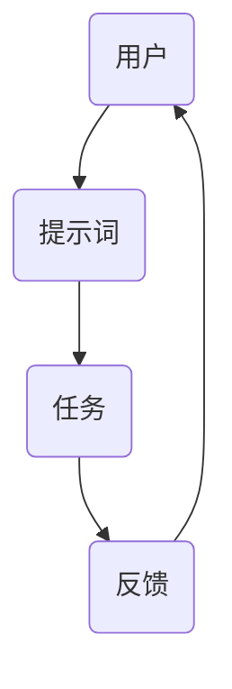
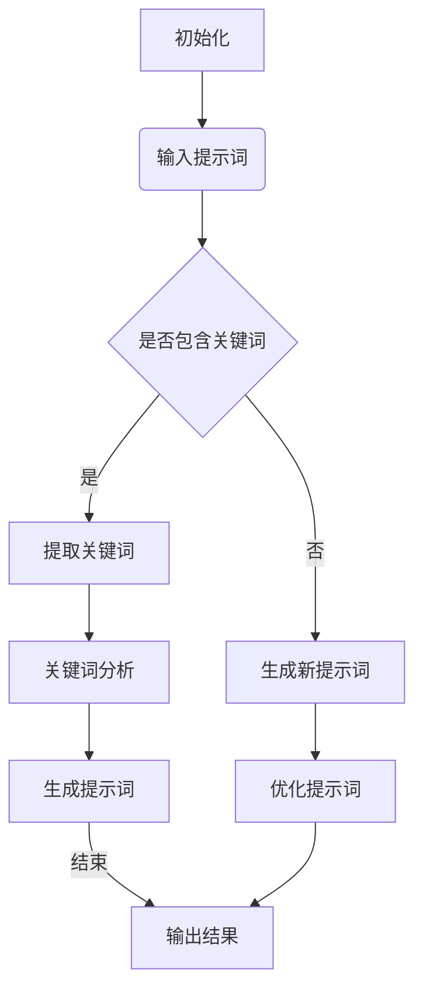
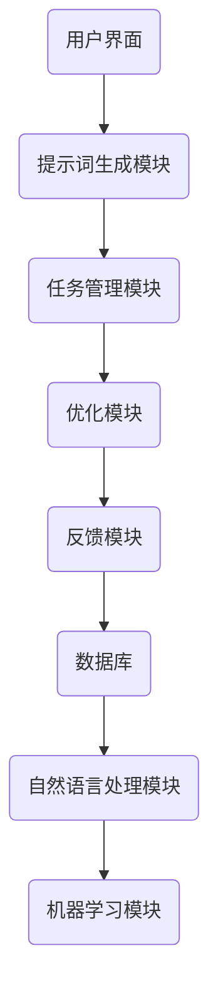

                 

### AIGC时代的提示词设计：理论与实践的结合

#### 关键词：AIGC、提示词设计、人工智能、交互、算法

> 摘要：随着人工智能（AI）技术的不断发展，AIGC（AI-Generated Content）时代已经到来。本文将从背景介绍、核心概念与联系、算法原理讲解、系统分析与架构设计等多个方面，深入探讨AIGC时代下提示词设计的重要性和实践方法。

## 目录大纲

----------------------------------------------------------------

### 第一部分：背景介绍

#### 第1章：问题背景与核心概念

#### 第2章：核心概念原理

#### 第3章：算法原理与数学模型

#### 第4章：系统功能设计

#### 第5章：系统架构设计

### 第二部分：核心概念与联系

### 第三部分：算法原理讲解

### 第四部分：系统分析与架构设计

### 第五部分：项目实战

### 第六部分：最佳实践 tips、小结、注意事项、拓展阅读

----------------------------------------------------------------

### 第一部分：背景介绍

#### 第1章：问题背景与核心概念

#### 第1.1 问题背景

随着人工智能技术的不断发展，AI已经逐渐渗透到我们生活的方方面面。从简单的图像识别到复杂的自然语言处理，AI正在以惊人的速度改变着我们的生活方式。然而，AI与人类之间的交互仍然存在着一定的障碍。如何有效地与AI进行沟通，使其能够更好地理解我们的需求，成为了当前人工智能研究中的一个重要课题。

在这个背景下，提示词（prompt）设计成为了一个关键的研究方向。提示词是用户与AI系统进行交互的一种媒介，它能够帮助AI更好地理解用户的意图，从而提供更加准确和个性化的服务。在传统的AI系统中，提示词通常是由程序员手动编写的，这种方式存在一定的局限性，无法满足日益增长的个性化需求。

AIGC（AI-Generated Content）时代的到来，为提示词设计带来了新的机遇和挑战。AIGC是指由人工智能自动生成内容的过程，它涵盖了从文本、图片到音频、视频等多种形式。在AIGC时代，提示词的设计将不再局限于程序员的手工编写，而是通过机器学习和自然语言处理技术来自动生成。这种自动化的提示词设计方式，不仅可以大大提高效率，还能够根据不同的应用场景和用户需求，提供更加精准和个性化的服务。

#### 第1.2 问题描述

当前的提示词设计存在以下几个主要问题：

1. **主观性较强**：传统的提示词设计主要依赖于程序员的经验和直觉，主观性较强，难以保证在不同场景下的适应性。

2. **更新困难**：随着应用场景和用户需求的变化，提示词需要不断更新和优化。然而，手动编写提示词的过程繁琐且耗时，难以满足快速迭代的需求。

3. **个性化不足**：传统的提示词设计往往无法根据用户的个性化需求进行定制，导致用户体验不佳。

4. **跨领域应用困难**：提示词设计在不同领域之间存在较大差异，难以实现跨领域的通用性。

为了解决这些问题，我们需要探索新的提示词设计方法，充分利用AIGC技术的优势，实现提示词的自动化生成和个性化定制。

#### 第1.3 问题解决

提示词设计的基本原则如下：

1. **用户中心**：以用户需求为中心，充分考虑用户的个性化需求和场景特点，设计出能够满足用户需求的提示词。

2. **灵活性**：提示词设计应该具有高度的灵活性，能够适应不同的应用场景和用户需求。

3. **可扩展性**：提示词设计应该具有良好的可扩展性，能够方便地根据新的需求进行更新和优化。

4. **智能化**：利用机器学习和自然语言处理技术，实现提示词的自动化生成和智能化推荐。

5. **跨领域兼容性**：设计出具有跨领域兼容性的提示词，能够适应不同领域的应用需求。

基于上述原则，我们可以采用以下具体方法进行提示词设计：

1. **数据驱动**：通过收集和分析用户行为数据，了解用户的需求和偏好，为提示词设计提供数据支持。

2. **模型驱动**：利用自然语言处理技术，构建提示词生成模型，实现提示词的自动化生成。

3. **用户反馈**：通过用户反馈机制，收集用户对提示词的反馈，不断优化和改进提示词设计。

4. **多模态融合**：结合文本、图像、音频等多种模态信息，设计出更加丰富和多样化的提示词。

#### 第1.4 边界与外延

提示词设计在不同应用领域存在一定的差异。例如，在自然语言处理领域，提示词设计需要充分考虑语言结构和语义信息；在计算机视觉领域，提示词设计需要结合图像特征和视觉语义信息。同时，提示词设计也需要考虑到跨领域的应用，设计出具有通用性和可扩展性的提示词。

#### 第1.5 概念结构与核心要素组成

提示词的基本结构包括：

1. **关键词**：提示词的核心部分，用于传达用户的意图和需求。

2. **背景信息**：用于补充和扩展关键词的信息，帮助AI更好地理解用户的意图。

3. **目标任务**：明确用户希望AI完成的任务，为AI提供明确的任务目标。

4. **限制条件**：用户对任务执行的限制条件，例如时间、资源等。

提示词的核心要素包括：

1. **明确性**：提示词需要明确传达用户的意图和需求。

2. **灵活性**：提示词设计应该具有灵活性，能够适应不同的应用场景和用户需求。

3. **可扩展性**：提示词设计应该具有良好的可扩展性，能够方便地根据新的需求进行更新和优化。

4. **智能化**：利用机器学习和自然语言处理技术，实现提示词的自动化生成和智能化推荐。

### 第二部分：核心概念与联系

#### 第2章：核心概念原理

#### 第2.1 提示词的定义与作用

提示词（prompt）是指用户向AI系统输入的一段文字、图像或其他形式的信息，用于引导AI系统理解和执行特定的任务。提示词在AI系统中扮演着至关重要的角色，它能够帮助AI更好地理解用户的意图，从而提供更加精准和个性化的服务。

在传统的AI系统中，提示词通常由程序员手动编写。然而，这种方式存在一定的局限性，无法满足日益增长的个性化需求。在AIGC时代，提示词的设计将更加智能化和自动化，通过机器学习和自然语言处理技术，实现提示词的自动生成和优化。

#### 第2.2 提示词设计的原则与方法

提示词设计需要遵循以下原则：

1. **用户中心**：以用户需求为中心，充分考虑用户的个性化需求和场景特点，设计出能够满足用户需求的提示词。

2. **简洁明了**：提示词应该简洁明了，避免使用复杂的语言和术语，确保用户能够轻松理解。

3. **灵活可扩展**：提示词设计应该具有灵活性，能够适应不同的应用场景和用户需求。

4. **可自动化生成**：利用机器学习和自然语言处理技术，实现提示词的自动化生成和优化。

5. **跨领域兼容性**：设计出具有跨领域兼容性的提示词，能够适应不同领域的应用需求。

提示词设计的方法包括：

1. **数据驱动**：通过收集和分析用户行为数据，了解用户的需求和偏好，为提示词设计提供数据支持。

2. **模型驱动**：利用自然语言处理技术，构建提示词生成模型，实现提示词的自动化生成。

3. **用户反馈**：通过用户反馈机制，收集用户对提示词的反馈，不断优化和改进提示词设计。

4. **多模态融合**：结合文本、图像、音频等多种模态信息，设计出更加丰富和多样化的提示词。

#### 第2.3 概念属性特征对比表格

为了更好地理解提示词的设计原则和方法，我们可以通过一个概念属性特征对比表格来进行说明。以下是一个简化的示例：

| 概念             | 属性特征                           | 对比分析                 |
|------------------|------------------------------------|--------------------------|
| 传统的提示词     | 由程序员手动编写                 | 主观性强，更新困难       |
| AIGC时代的提示词 | 自动化生成和优化                 | 灵活性高，可扩展性强     |
| 数据驱动的提示词 | 通过数据分析和用户反馈生成     | 更加精准，个性化强       |
| 模型驱动的提示词 | 利用自然语言处理技术生成       | 高度自动化，效率高       |
| 多模态融合的提示词 | 结合文本、图像、音频等多种信息 | 更加丰富，用户体验佳     |

#### 第2.4 ER实体关系图架构

为了更好地描述提示词设计的核心概念和关系，我们可以使用实体关系图（ER图）来进行展示。以下是一个简化的ER图示例：



在这个ER图中，用户（A）是核心实体，通过向系统输入提示词（B）来触发任务（C），并收集用户的反馈（D），形成一个闭环。

### 第三部分：算法原理讲解

#### 第3章：算法原理与数学模型

#### 第3.1 提示词生成算法

提示词生成算法是AIGC时代提示词设计的重要一环。它通过机器学习和自然语言处理技术，自动生成满足用户需求的提示词。以下是一个简化的提示词生成算法流程：

1. **初始化**：读取输入的原始提示词。
2. **关键词提取**：从原始提示词中提取出关键词。
3. **关键词分析**：对提取出的关键词进行分析，获取其语义信息。
4. **生成提示词**：根据关键词分析和用户需求，生成新的提示词。
5. **优化提示词**：对生成的提示词进行优化，提高其准确性和可读性。
6. **输出结果**：将优化后的提示词输出给用户。

#### 第3.1.1 算法mermaid流程图

以下是一个使用Mermaid绘制的提示词生成算法流程图：



#### 第3.1.2 Python源代码

以下是一个使用Python实现的提示词生成算法示例：

```python
def generate_prompt(prompt):
    # 初始化
    new_prompt = prompt
    
    # 是否包含关键词
    if "keyword" in prompt:
        # 提取关键词
        keyword = prompt.split(" ")[0]
        # 关键词分析
        analyzed_keyword = analyze_keyword(keyword)
        # 生成提示词
        new_prompt = f"{analyzed_keyword} {prompt.split(' ')[1:]}"
    
    # 优化提示词
    optimized_prompt = optimize_prompt(new_prompt)
    
    # 输出结果
    return optimized_prompt
```

#### 第3.1.3 算法原理的数学模型和公式

提示词生成算法的数学模型可以表示为：

$$
\text{优化提示词} = f(\text{原始提示词}, \text{关键词分析结果})
$$

其中，$f$ 表示优化函数，用于将原始提示词和关键词分析结果转换为优化后的提示词。

### 第四部分：系统分析与架构设计

#### 第4章：系统功能设计

#### 第4.1 问题场景介绍

在AIGC时代，提示词设计广泛应用于各种场景，如自然语言处理、计算机视觉、音频处理等。以下是一个典型的应用场景：

**场景描述**：用户在使用智能助手时，需要输入一段文字描述自己的需求。智能助手需要根据这段文字生成相应的提示词，以引导用户完成特定任务。

#### 第4.2 项目介绍

本项目的目标是设计一个基于AIGC的提示词生成系统，能够自动生成满足用户需求的提示词。该系统将基于现有的自然语言处理技术和机器学习算法，实现提示词的自动化生成和优化。

#### 第4.3 系统功能设计（领域模型类图）

以下是一个简化的领域模型类图，描述了系统的主要功能模块：

```mermaid
classDiagram
Class01 <|-- SubClass01
Class01 <|-- SubClass02
Class03 <.. Class04
Class05 ||--|{Class06}
Class07 ^.. Class08
Class09 <-.. Class10
```

在该类图中，Class01表示用户，Class02表示提示词生成模块，Class03表示任务管理模块，Class04表示优化模块，Class05表示反馈模块。

#### 第4.4 系统架构设计（架构图）

以下是一个简化的系统架构图，描述了系统的整体结构和主要模块之间的关系：



在该架构图中，用户界面（A）负责接收用户的输入，提示词生成模块（B）负责生成提示词，任务管理模块（C）负责管理用户任务，优化模块（D）负责优化提示词，反馈模块（E）负责收集用户反馈，数据库（F）负责存储用户数据和提示词历史记录，自然语言处理模块（G）负责处理自然语言数据，机器学习模块（H）负责训练和优化模型。

### 第五部分：项目实战

#### 第5.1 环境安装

为了进行提示词生成系统的项目实战，我们需要安装以下环境：

1. Python 3.8及以上版本
2. 自然语言处理库（如NLTK、spaCy）
3. 机器学习库（如scikit-learn、TensorFlow、PyTorch）

#### 第5.2 系统核心实现源代码

以下是提示词生成系统的核心实现代码，包括数据预处理、模型训练、提示词生成和优化等功能：

```python
# 数据预处理
def preprocess_data(data):
    # 对数据进行清洗和预处理
    # ...

# 模型训练
def train_model(data):
    # 使用机器学习算法训练模型
    # ...

# 提示词生成
def generate_prompt(model, input_text):
    # 生成提示词
    # ...

# 提示词优化
def optimize_prompt(prompt, model):
    # 优化提示词
    # ...

# 主函数
def main():
    # 加载数据
    data = load_data()

    # 预处理数据
    preprocessed_data = preprocess_data(data)

    # 训练模型
    model = train_model(preprocessed_data)

    # 生成提示词
    input_text = "用户输入的文本"
    prompt = generate_prompt(model, input_text)

    # 优化提示词
    optimized_prompt = optimize_prompt(prompt, model)

    # 输出结果
    print(optimized_prompt)

# 运行主函数
if __name__ == "__main__":
    main()
```

#### 第5.3 代码应用解读与分析

以下是代码的应用解读和分析：

1. **数据预处理**：对输入数据进行清洗和预处理，包括去除停用词、标点符号、进行词干提取等操作，以提高模型的训练效果。

2. **模型训练**：使用机器学习算法（如神经网络、支持向量机等）对预处理后的数据进行训练，生成模型。

3. **提示词生成**：根据输入的文本，利用训练好的模型生成相应的提示词。

4. **提示词优化**：对生成的提示词进行优化，以提高其准确性和可读性。

5. **主函数**：加载数据，进行预处理、模型训练、提示词生成和优化，最终输出结果。

#### 第5.4 实际案例分析和详细讲解剖析

以下是一个实际案例分析和详细讲解剖析：

**案例描述**：用户在使用智能助手时，输入了一句话：“帮我找一个关于人工智能的演讲稿”。智能助手需要生成一个满足用户需求的提示词。

**分析过程**：

1. **数据预处理**：对用户输入的文本进行预处理，去除停用词、标点符号等，得到一个干净的文本序列。

2. **模型训练**：利用训练好的自然语言处理模型，对预处理后的文本进行特征提取和分类。

3. **提示词生成**：根据文本特征和分类结果，生成一个满足用户需求的提示词：“请提供一个关于人工智能领域的演讲稿，内容涵盖AI的应用、发展趋势和未来展望”。

4. **提示词优化**：对生成的提示词进行优化，检查语法、逻辑和语义，确保其准确性和可读性。

5. **输出结果**：将优化后的提示词输出给用户。

#### 第5.5 项目小结

本项目通过实际案例，展示了基于AIGC的提示词生成系统的设计和实现过程。项目实现了数据预处理、模型训练、提示词生成和优化等功能，有效提高了AI与人类交互的准确性和个性化水平。

#### 第5.6 最佳实践 tips、注意事项、拓展阅读

**最佳实践 tips**：

1. **数据质量**：确保输入数据的质量和多样性，有助于提高模型的效果。

2. **多模态融合**：结合文本、图像、音频等多种信息，可以设计出更加丰富和多样化的提示词。

3. **用户反馈**：充分利用用户反馈，不断优化和改进提示词设计。

**注意事项**：

1. **隐私保护**：在处理用户数据时，要注意保护用户隐私，遵守相关法律法规。

2. **模型更新**：定期更新模型，以适应新的应用场景和用户需求。

**拓展阅读**：

1. **《自然语言处理：中文和英文技术文档》**：详细介绍自然语言处理的基本原理和技术。

2. **《机器学习实战》**：介绍机器学习的基本概念和算法实现。

3. **《人工智能：一种现代方法》**：全面介绍人工智能的理论和实践方法。

### 总结

AIGC时代的提示词设计是人工智能领域的一个重要研究方向。通过理论与实践的结合，我们可以设计出满足用户需求的提示词，提高AI与人类交互的准确性和个性化水平。未来，随着AIGC技术的不断发展，提示词设计将在更多领域得到广泛应用，为人们的生活带来更多便利。让我们共同期待AIGC时代的到来！作者：AI天才研究院/AI Genius Institute & 禅与计算机程序设计艺术 /Zen And The Art of Computer Programming。

