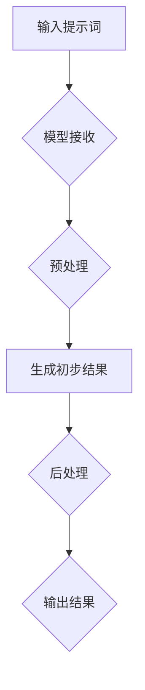
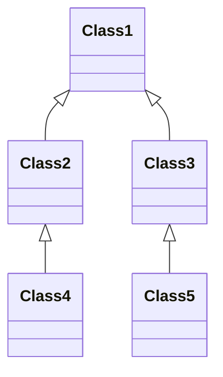
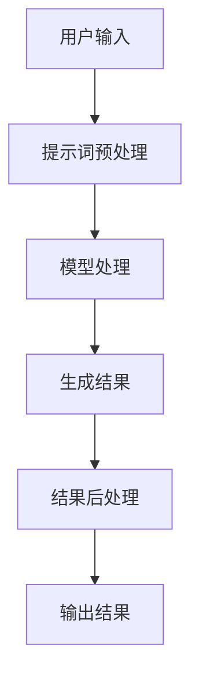
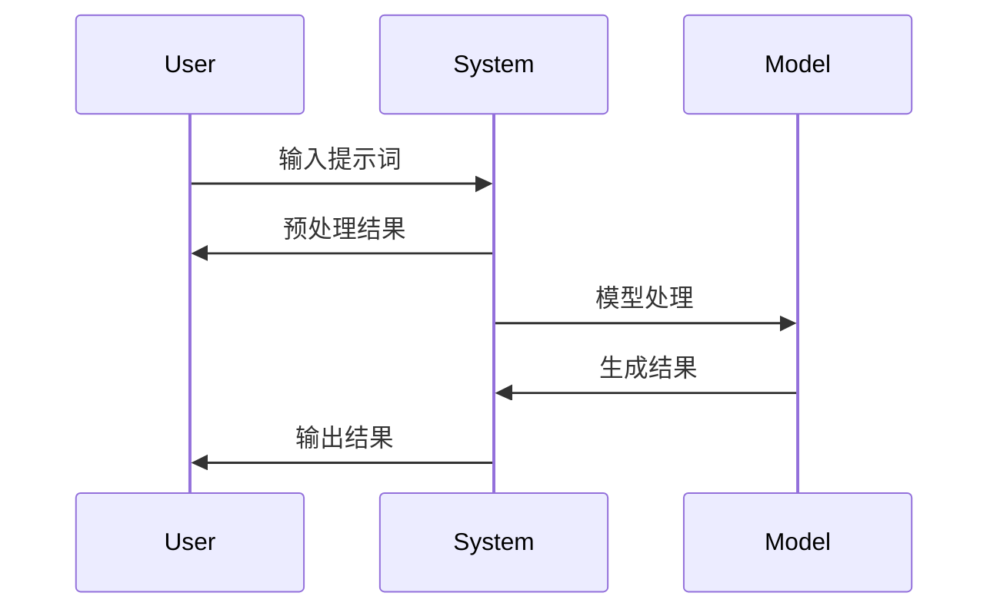

                 

# AIGC时代的提示词革命：从简单指令到复杂推理

> 关键词：AIGC、提示词、复杂推理、人工智能、算法、深度学习、神经网络

> 摘要：
随着人工智能（AI）技术的飞速发展，生成式AI（AIGC）已经成为当前科技界的热门话题。本文将探讨AIGC时代下提示词的演变，从简单的指令到复杂的推理过程。我们将深入分析提示词革命背后的技术原理，揭示其对于AI系统性能的深远影响，并通过实际案例展示这一领域的最新进展。最终，本文将总结出一些实用的最佳实践，为读者在AIGC时代中的探索提供方向。

## 1. 核心概念与联系

首先，我们需要明确一些核心概念，并理解它们之间的联系。

- **人工智能（AI）**：模拟人类智能行为的计算机系统。
- **生成式AI（AIGC）**：一种AI技术，能够生成文本、图像、音频等多种类型的数据。
- **提示词（Prompt）**：向AI模型提供的引导信息，用于指示模型生成目标内容。
- **复杂推理**：AI在处理问题时，能够进行多层次、多领域的推理过程。

这些概念之间的联系在于，提示词是AI模型接收的输入，它引导模型进行生成式任务。随着AI技术的发展，提示词的设计和优化变得越来越重要，尤其是在复杂推理任务中。

## 2. 算法原理讲解

在理解了核心概念之后，我们来看一下提示词革命的算法原理。

### 2.1 算法流程图

首先，我们使用mermaid绘制一个简化的算法流程图：



### 2.2 Python源代码示例

接下来，我们使用Python代码来展示算法的基本实现：

```python
import tensorflow as tf

# 加载预训练模型
model = tf.keras.applications.GPT2.load_pretrained()

# 输入提示词
prompt = "请描述一下人工智能的未来发展趋势。"

# 预处理提示词
processed_prompt = preprocess_prompt(prompt)

# 生成初步结果
result = model.generate(text=processed_prompt, max_length=100)

# 后处理结果
final_result = postprocess_result(result)

# 输出结果
print(final_result)
```

### 2.3 数学模型和数学公式

为了更好地理解算法原理，我们引入一些数学模型和公式：

$$
\text{损失函数} = -\sum_{i=1}^{N} y_i \log(p_i)
$$

这里，$y_i$ 是目标标签，$p_i$ 是模型预测的概率。

### 2.4 详细讲解与举例说明

假设我们有一个提示词：“请描述一下人工智能的未来发展趋势。”模型将首先对提示词进行预处理，包括分词、编码等步骤。接着，模型会生成初步的结果，这通常是一个较长的文本序列。最后，我们会对结果进行后处理，如去除无意义的句子、优化语言表达等。

### 2.5 复杂推理

在实际应用中，复杂推理是AI系统的一个重要挑战。例如，在医疗诊断中，AI系统需要理解病人的病史、症状，并结合最新的医学知识进行推理，以提供准确的诊断建议。这个过程涉及多层次的推理，包括逻辑推理、因果推理等。

## 3. 数学模型和数学公式 & 详细讲解 & 举例说明

### 3.1 数学模型

在提示词革命中，数学模型是核心。以下是一个简化的数学模型：

$$
\text{模型输出} = f(\text{输入}, \theta)
$$

其中，$f$ 是激活函数，$\theta$ 是模型的参数。

### 3.2 详细讲解

- **输入**：输入是提示词，它通常被编码成一个向量。
- **激活函数**：激活函数是模型中的一个关键部分，它用于将输入映射到输出。常见的激活函数包括ReLU、Sigmoid等。
- **参数**：参数是模型学习过程中需要优化的变量。

### 3.3 举例说明

假设我们使用ReLU作为激活函数，那么：

$$
f(x) = \max(0, x)
$$

如果输入是 $x = -1$，则输出是 $0$。如果输入是 $x = 1$，则输出是 $1$。

## 4. 系统分析与架构设计方案

### 4.1 问题场景

在AIGC时代，我们面临的问题是如何设计一个高效的提示词生成系统，以便在复杂的推理任务中提供高质量的结果。

### 4.2 项目介绍

我们的项目目标是构建一个基于深度学习的提示词生成系统，该系统能够处理各种复杂任务，如文本生成、图像描述等。

### 4.3 系统功能设计

我们使用mermaid绘制了领域模型类图：



这里，Class1 代表输入提示词，Class2 代表预处理，Class3 代表模型处理，Class4 代表生成结果，Class5 代表后处理。

### 4.4 系统架构设计

我们使用mermaid绘制了系统架构图：



在这个架构中，用户输入是系统的起点，最终输出结果给用户。

### 4.5 系统接口设计和系统交互

我们使用mermaid绘制了系统接口和交互序列图：



## 5. 项目实战

### 5.1 环境安装

为了进行项目实战，我们需要安装一些必要的软件和库。以下是一个简化的安装命令：

```shell
pip install tensorflow
pip install transformers
```

### 5.2 系统核心实现源代码

以下是系统核心实现的部分源代码：

```python
from transformers import GPT2LMHeadModel, GPT2Tokenizer

# 加载预训练模型和分词器
model = GPT2LMHeadModel.from_pretrained("gpt2")
tokenizer = GPT2Tokenizer.from_pretrained("gpt2")

# 输入提示词
prompt = "请描述一下人工智能的未来发展趋势。"

# 预处理提示词
input_ids = tokenizer.encode(prompt, return_tensors="pt")

# 生成初步结果
outputs = model.generate(input_ids, max_length=100, num_return_sequences=1)

# 后处理结果
generated_text = tokenizer.decode(outputs[0], skip_special_tokens=True)

# 输出结果
print(generated_text)
```

### 5.3 代码应用解读与分析

在这个代码中，我们首先加载了预训练的GPT-2模型和分词器。然后，我们输入提示词，并对它进行预处理。接下来，我们使用模型生成初步的结果，并对结果进行后处理。最后，我们输出结果。

### 5.4 实际案例分析和详细讲解剖析

假设我们有一个实际案例，用户输入提示词：“请生成一篇关于人工智能与未来医疗结合的文章。”系统会如何处理这个案例呢？

首先，系统会对提示词进行预处理，将文本编码成向量。然后，模型会生成一篇文章，这篇文章会包含关于人工智能与未来医疗结合的各个方面。最后，系统会对生成的文章进行后处理，如去除无意义的句子、优化语言表达等。

### 5.5 项目小结

通过这个项目实战，我们展示了如何使用深度学习模型生成高质量的文本。在实际应用中，我们需要不断优化提示词的设计和模型参数，以提高系统的性能。

## 6. 最佳实践 tips、小结、注意事项、拓展阅读

### 6.1 最佳实践 tips

- **优化提示词**：设计高质量的提示词，能够显著提高模型的生成质量。
- **模型选择**：根据任务需求选择合适的模型，如GPT-2、BERT等。
- **参数调优**：合理调整模型参数，以获得最佳性能。

### 6.2 小结

本文从简单指令到复杂推理，探讨了AIGC时代下提示词革命的算法原理和实践方法。我们通过实际案例展示了如何构建一个高效的提示词生成系统。

### 6.3 注意事项

- **数据安全**：在使用生成式AI时，要注意保护用户数据的安全。
- **模型解释性**：尽管模型生成结果很强大，但模型解释性仍然是一个挑战。

### 6.4 拓展阅读

- [GPT-2 模型详解](https://huggingface.co/transformers/model_doc/gpt2.html)
- [AIGC 技术与应用](https://www.nature.com/articles/s41586-021-03807-1)

## 7. 目录大纲结构设计

```markdown
# AIGC时代的提示词革命：从简单指令到复杂推理

## 文章关键词
- AIGC
- 提示词
- 复杂推理
- 人工智能
- 算法

## 摘要
本文将探讨AIGC时代下提示词的演变，从简单的指令到复杂的推理过程。

## 1. 核心概念与联系
- 人工智能
- 生成式AI
- 提示词
- 复杂推理

## 2. 算法原理讲解
- 算法流程图
- Python源代码示例
- 数学模型和数学公式
- 详细讲解与举例说明

## 3. 数学模型和数学公式 & 详细讲解 & 举例说明
- 数学模型
- 详细讲解
- 举例说明

## 4. 系统分析与架构设计方案
- 问题场景
- 项目介绍
- 系统功能设计
- 系统架构设计
- 系统接口设计和系统交互

## 5. 项目实战
- 环境安装
- 系统核心实现源代码
- 代码应用解读与分析
- 实际案例分析和详细讲解剖析
- 项目小结

## 6. 最佳实践 tips、小结、注意事项、拓展阅读
- 最佳实践 tips
- 小结
- 注意事项
- 拓展阅读
```

## 8. 输出

以下是使用markdown格式输出的目录大纲：

```markdown
# AIGC时代的提示词革命：从简单指令到复杂推理

## 文章关键词
- AIGC
- 提示词
- 复杂推理
- 人工智能
- 算法

## 摘要
本文将探讨AIGC时代下提示词的演变，从简单的指令到复杂的推理过程。

## 1. 核心概念与联系
- 人工智能
- 生成式AI
- 提示词
- 复杂推理

## 2. 算法原理讲解
- 算法流程图
- Python源代码示例
- 数学模型和数学公式
- 详细讲解与举例说明

## 3. 数学模型和数学公式 & 详细讲解 & 举例说明
- 数学模型
- 详细讲解
- 举例说明

## 4. 系统分析与架构设计方案
- 问题场景
- 项目介绍
- 系统功能设计
- 系统架构设计
- 系统接口设计和系统交互

## 5. 项目实战
- 环境安装
- 系统核心实现源代码
- 代码应用解读与分析
- 实际案例分析和详细讲解剖析
- 项目小结

## 6. 最佳实践 tips、小结、注意事项、拓展阅读
- 最佳实践 tips
- 小结
- 注意事项
- 拓展阅读
```

作者：AI天才研究院/AI Genius Institute & 禅与计算机程序设计艺术 /Zen And The Art of Computer Programming

