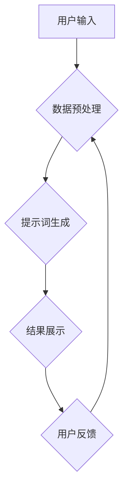
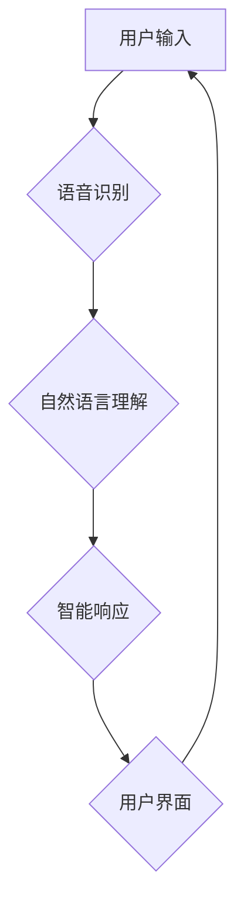

                 

### AIGC时代的来临

#### 1.1 AIGC的概念与特点

AIGC，即生成式人工智能（AI-Generated Content），是一种基于人工智能技术，特别是深度学习和自然语言处理（NLP）技术，自动生成文本、图像、音频、视频等多种类型内容的能力。AIGC的核心在于其“生成”能力，它能够根据输入的提示或模板，自主创造新的内容。

AIGC具有以下几个显著特点：

1. **自适应性**：AIGC能够根据用户需求和环境自适应地生成内容，这使得它在个性化服务和实时响应中具有独特的优势。
   
2. **创造性**：与传统的规则驱动或基于模板的内容生成不同，AIGC具有高度的创造性，能够生成新颖且富有创意的内容。

3. **高效性**：AIGC通过大量数据和强大的计算能力，能够快速生成大量内容，大大提高了生产效率。

4. **多样性**：AIGC能够生成不同类型和风格的内容，如文本、图像、音频和视频，这为多媒体创作和交互提供了广阔的应用场景。

#### 1.2 AIGC的发展历程

AIGC的发展可以追溯到深度学习和NLP技术的快速发展时期。在20世纪80年代，神经网络和机器学习技术开始萌芽，但直到21世纪初，随着计算能力和数据量的提升，深度学习技术才取得了突破性进展。特别是2012年，AlexNet在ImageNet大赛中取得显著成绩，标志着深度学习进入一个新阶段。

随后，自然语言处理技术，如序列到序列（Seq2Seq）模型、生成对抗网络（GAN）和变分自编码器（VAE）等，也在不断演进。这些技术的发展为AIGC的应用奠定了基础。2018年，OpenAI发布GPT-2模型，展示了AIGC在文本生成领域的强大能力，引发了广泛关注。

近年来，随着AIGC技术的不断成熟，各种应用场景不断涌现，如自动写作、图像生成、视频剪辑等，AIGC已经成为人工智能领域的一个重要研究方向和应用方向。

#### 1.3 AIGC对人类生活的影响

AIGC的崛起正在深刻改变我们的生活方式和工作模式。以下是AIGC对人类生活的一些重要影响：

1. **内容创作**：AIGC可以自动生成高质量的文本、图像和视频，为内容创作者提供了强大的工具。无论是作家、记者、设计师还是视频制作人，AIGC都能帮助他们提高创作效率，释放更多的创造潜能。

2. **个性化服务**：AIGC能够根据用户的行为和喜好生成个性化的内容，提供个性化的服务。例如，电商平台可以根据用户的购物历史推荐商品，新闻平台可以推荐用户可能感兴趣的文章。

3. **教育**：AIGC在教育领域的应用也非常广泛。它能够自动生成教学材料，提供个性化的学习体验。此外，AIGC还可以模拟真实场景，为学生提供实践机会。

4. **娱乐**：在游戏、电影、音乐等娱乐领域，AIGC也展现了巨大的潜力。例如，AIGC可以生成角色动作、音乐旋律和故事情节，为娱乐内容创作带来新的创意。

5. **商业决策**：AIGC可以帮助企业快速生成市场报告、财务分析等商业文档，为企业决策提供支持。

总的来说，AIGC不仅提高了内容创作的效率和质量，还极大地丰富了人类的生活体验，成为人工智能时代的一个重要标志。

### 提示词革命

#### 2.1 提示词的定义与作用

提示词（Prompt）是AIGC系统中的一个关键组件，它是一种引导模型生成内容的方式。简单来说，提示词就是一个触发生成过程的输入信息，可以是文字、图像或者其他形式的数据。在AIGC系统中，提示词起到了定向和引导的作用，帮助模型理解生成任务的目标和需求。

提示词的作用主要体现在以下几个方面：

1. **引导模型理解任务**：通过提示词，模型可以捕捉到生成任务的关键信息，如文本的主题、风格、内容要求等，从而更好地进行内容生成。

2. **优化生成质量**：好的提示词能够提高生成内容的准确性和相关性，避免模型产生偏离任务目标或无意义的内容。

3. **控制生成多样性**：通过调整提示词的详细程度和描述方式，可以控制生成的多样性，使得生成内容既具有一致性，又富于变化。

4. **提高生成效率**：有效的提示词能够帮助模型快速聚焦生成任务，减少不必要的计算和试错，提高生成效率。

#### 2.2 提示词的革命性变化

在传统的人工智能系统中，生成内容通常依赖于大量的规则和模板，用户需要详细地定义生成任务，这既繁琐又缺乏灵活性。而AIGC时代，提示词的出现带来了革命性的变化：

1. **从规则驱动到数据驱动**：传统的生成方法主要依赖于预定义的规则和模板，而AIGC则通过大量的数据训练模型，使其能够自主生成内容。提示词的作用是引导模型从海量数据中提取有效信息，从而实现高效的生成。

2. **从指令式到自然交互**：传统生成系统通常需要用户详细指定生成任务，而AIGC则通过自然语言交互，用户只需提供简单的提示词，系统就能理解任务并生成内容。这种自然交互方式大大降低了用户的使用门槛。

3. **从单一任务到多任务**：传统的生成系统通常专注于单一任务，如文本生成或图像生成。而AIGC则能够通过提示词同时处理多个任务，如文本和图像的联合生成，大大扩展了应用场景。

4. **从被动响应到主动创造**：传统系统往往只能被动响应用户的输入，而AIGC则能够主动根据提示词生成内容，甚至能够提出新的想法和创意，极大地提高了系统的创造力和自主性。

#### 2.3 提示词在AIGC中的应用

提示词在AIGC中的应用场景非常广泛，以下是几个典型的应用实例：

1. **自动写作**：通过提供简单的提示词，如“写一篇关于人工智能的评论”，AIGC可以自动生成一篇完整的文章。这种应用在新闻写作、报告撰写和内容营销等领域具有巨大潜力。

2. **图像生成**：用户可以通过提供文字提示词，如“画出一只可爱的猫咪”，AIGC可以生成相应的图像。这种应用在艺术创作、游戏设计和广告创意等领域有广泛应用。

3. **视频剪辑**：用户可以提供提示词，如“创建一个关于旅行的短视频”，AIGC可以根据提示词自动剪辑视频素材，并添加背景音乐和特效，生成完整的视频内容。

4. **代码生成**：在软件开发领域，AIGC可以通过提示词生成代码片段，如“写一个Python函数，用于计算两个数的和”。这种应用可以提高开发效率，减少编程错误。

5. **个性化服务**：AIGC可以通过对用户的喜好和行为进行学习，提供个性化的服务。例如，电商平台可以根据用户的购物习惯生成个性化的推荐列表，新闻平台可以根据用户的阅读历史推荐相关文章。

总的来说，提示词革命为AIGC带来了巨大的变革，使得生成内容变得更加智能、高效和多样化，大大拓展了人工智能的应用场景。

### 人机交互模式的重塑

#### 3.1 传统人机交互模式的局限

传统人机交互模式主要依赖于图形用户界面（GUI）和命令行界面（CLI），这些模式在过去的几十年中为计算机的使用提供了便利。然而，随着技术的发展，特别是在AIGC时代的到来，传统人机交互模式逐渐显露出一些局限性：

1. **操作复杂度**：传统的GUI和CLI界面往往需要用户进行多步骤的操作，才能完成一个简单的任务。这种复杂的操作流程降低了用户的体验和效率。

2. **交互局限性**：传统界面主要依赖于文本和图形的交互，对于复杂的、多模态的信息处理和交互存在一定的局限。例如，对于语音、图像和视频等多媒体内容的处理，传统界面往往显得力不从心。

3. **个性化服务不足**：传统界面难以根据用户的个性化需求进行自适应调整。虽然某些高级系统具备一定的个性化设置，但总体上仍缺乏对用户行为和需求的深度理解和响应。

4. **响应速度慢**：传统界面在处理用户输入和生成响应时，往往需要一定的时间延迟，这影响了用户的即时体验和交互感受。

#### 3.2 AIGC时代的人机交互新模式

AIGC时代的到来，为人类与机器的交互带来了全新的模式和可能性。以下是人机交互在AIGC时代的一些新特征：

1. **自然语言交互**：AIGC技术使得计算机能够理解和生成自然语言，用户可以通过简单的自然语言指令与计算机进行交流。例如，用户可以说“帮我写一篇关于人工智能的演讲稿”，系统可以立即生成一篇演讲稿。

2. **多模态交互**：AIGC不仅能够处理文本，还能够处理图像、声音、视频等多种模态的信息。用户可以通过语音、手势、面部表情等多种方式进行交互，大大扩展了交互的维度。

3. **智能化反馈**：通过深度学习和自然语言处理技术，AIGC系统能够根据用户的历史行为和当前需求，提供个性化的反馈和建议。例如，购物平台可以根据用户的购物习惯推荐商品，学习平台可以根据学习进度调整教学内容。

4. **实时响应**：AIGC技术使得系统能够快速响应用户的输入，实现真正的实时交互。例如，在实时会议中，AIGC可以实时转录语音、生成字幕，并在用户提出问题或需要解释时，立即提供相关资料。

5. **增强创造力**：AIGC能够帮助用户进行创意生成，例如自动撰写文章、生成音乐和艺术作品等。这种能力极大地提升了用户的创造力和生产力。

#### 3.3 AIGC对人机交互的深远影响

AIGC对人机交互的深远影响体现在多个方面：

1. **提高用户体验**：AIGC通过自然语言交互和多模态交互，大大提升了用户的体验和满意度。用户不再需要花费大量时间学习复杂的操作界面，而是可以通过简单的语言指令或自然行为与计算机进行交互。

2. **优化工作效率**：AIGC能够快速响应用户需求，自动完成复杂的任务，大大提高了工作效率。例如，自动化的报告生成、智能化的客服系统等，都能显著提高企业的工作效率。

3. **增强个性化服务**：AIGC通过深度学习和自然语言处理技术，能够更好地理解用户的需求和行为，提供个性化的服务和推荐。这种个性化服务不仅提升了用户的满意度，也为企业带来了更多的商业机会。

4. **拓宽应用领域**：AIGC技术使得人机交互的应用场景变得更加广泛。无论是教育、医疗、娱乐，还是日常生活中的智能家居，AIGC都能提供创新的应用解决方案。

5. **推动社会进步**：AIGC技术不仅改变了人类与机器的交互方式，还推动了社会的进步和发展。通过智能化的系统和服务，人们的生活变得更加便捷和高效，各种行业的工作模式也在发生深刻的变革。

总之，AIGC时代的人机交互模式为人类带来了前所未有的便利和可能性，它正在重塑我们的生活方式和工作模式，成为人工智能时代的重要标志。

### AIGC技术原理

AIGC技术之所以能够在生成内容和交互中展现出卓越的性能，其背后的技术原理和核心算法起到了至关重要的作用。以下是AIGC技术原理的详细解析。

#### 4.1 深度学习与神经网络

深度学习是AIGC技术的基础，其核心思想是通过多层神经网络（Neural Networks）对大量数据进行训练，从而让模型具备自动学习和特征提取的能力。神经网络由大量的神经元（或节点）组成，每个神经元都与相邻的神经元通过连接（或权重）相连。

1. **神经元与激活函数**：神经元接收多个输入信号，通过权重与这些输入信号相乘，然后加上一个偏置项（Bias），最后通过激活函数（如ReLU、Sigmoid或Tanh）转换成输出信号。激活函数的作用是引入非线性，使得神经网络能够处理复杂的输入输出关系。

2. **前向传播与反向传播**：在训练过程中，神经网络通过前向传播（Forward Propagation）将输入信号逐层传递，直到输出层得到预测结果。然后，通过反向传播（Backpropagation）计算输出误差，并更新每个神经元的权重和偏置，以最小化预测误差。

3. **多层网络**：多层神经网络通过增加隐藏层（Hidden Layers）的数量，能够提取更高层次的特征，从而提高模型的复杂度和性能。例如，卷积神经网络（CNN）通过卷积层（Convolutional Layers）提取图像特征，循环神经网络（RNN）通过隐藏状态（Hidden States）捕捉序列信息。

#### 4.2 自然语言处理基础

自然语言处理（NLP）是AIGC技术的另一重要组成部分，它专注于使计算机能够理解和生成人类语言。以下是NLP的一些基础概念：

1. **词嵌入（Word Embedding）**：词嵌入是将自然语言中的词汇映射到高维向量空间中，从而实现词汇的数值表示。词嵌入技术能够捕捉词汇的语义和语法信息，如Word2Vec、GloVe等。

2. **词性标注（Part-of-Speech Tagging）**：词性标注是对文本中的每个词汇进行词性分类，如名词、动词、形容词等。这有助于理解句子的结构和语义。

3. **命名实体识别（Named Entity Recognition）**：命名实体识别是从文本中识别出具有特定意义的实体，如人名、地名、组织名等。这有助于理解文本的内容和背景。

4. **句法分析（Syntax Analysis）**：句法分析是对句子结构进行解析，以揭示词汇之间的语法关系。这有助于理解句子的结构和意义。

5. **语义角色标注（Semantic Role Labeling）**：语义角色标注是对句子中的动作和参与者进行标注，以揭示动作的语义和作用对象。这有助于理解句子的语义和意图。

#### 4.3 提示词生成与优化

提示词在AIGC中起到至关重要的作用，其生成和优化方法直接影响到生成内容的质量和效果。以下是几种常用的提示词生成与优化方法：

1. **模板匹配（Template Matching）**：模板匹配是一种基于规则的提示词生成方法，通过预定义的模板和输入文本进行匹配，生成相应的提示词。这种方法简单高效，但灵活性较差。

2. **关键词提取（Keyword Extraction）**：关键词提取是从输入文本中提取关键信息，生成提示词。常用的方法包括TF-IDF（Term Frequency-Inverse Document Frequency）和TextRank等。

3. **生成对抗网络（GAN）**：生成对抗网络是一种无监督学习模型，通过生成器和判别器的对抗训练，生成高质量的提示词。生成器生成提示词，判别器判断提示词的真实性，通过不断迭代优化，生成器能够生成越来越真实的提示词。

4. **自动编码器（Autoencoder）**：自动编码器是一种自监督学习模型，通过编码器和解码器的学习，自动提取输入文本的特征，生成高质量的提示词。编码器压缩输入文本到低维特征空间，解码器从这些特征中重建提示词。

5. **多模态融合（Multimodal Fusion）**：多模态融合是将不同模态（如文本、图像、语音等）的信息进行融合，生成提示词。这种方法能够充分利用多种信息，提高提示词的丰富性和准确性。

通过上述方法，AIGC能够生成高质量的提示词，从而引导模型生成符合用户需求的内容。以下是AIGC技术原理的总结：

- **深度学习与神经网络**：通过多层神经网络进行特征提取和学习，实现自动生成内容的能力。
- **自然语言处理**：通过词嵌入、句法分析等技术，实现文本理解和生成。
- **提示词生成与优化**：通过模板匹配、关键词提取、GAN和自动编码器等方法，生成高质量的提示词，引导模型生成符合用户需求的内容。

这些技术原理共同构成了AIGC的技术基础，使得AIGC能够在大规模内容生成和人机交互中展现出强大的能力。

#### 4.4 提示词生成算法原理

提示词生成算法是AIGC技术中的核心组成部分，其目的是从输入文本或数据中提取关键信息，生成引导模型生成内容的提示词。以下是几种常用的提示词生成算法及其原理：

##### 1. 模板匹配算法

模板匹配算法是一种基于规则的方法，通过预定义的模板与输入文本进行匹配，生成相应的提示词。其基本原理如下：

1. **模板定义**：首先定义一组模板，每个模板对应一种特定的信息提取模式。模板通常由关键词、词性标注、上下文信息等组成。
2. **匹配过程**：输入文本与预定义的模板进行逐字匹配，当匹配成功时，提取模板中的关键信息作为提示词。
3. **提示词生成**：将提取的关键信息进行格式化，生成完整的提示词。

模板匹配算法的优点在于简单易实现，缺点是灵活性较差，难以应对复杂的文本结构和多样化的生成需求。

##### 2. 关键词提取算法

关键词提取算法是从输入文本中提取关键信息，生成提示词的一种方法。常用的关键词提取算法包括TF-IDF（Term Frequency-Inverse Document Frequency）和TextRank等。

1. **TF-IDF算法**：
   - **词频（Term Frequency, TF）**：计算文本中每个词汇出现的频率，频率越高，表明该词在文本中越重要。
   - **逆文档频率（Inverse Document Frequency, IDF）**：计算词汇在整个文本集合中的逆向文档频率，频率越低，表明词汇在整个文本集合中越独特。
   - **计算关键词得分**：将TF和IDF相结合，计算每个词汇的关键词得分，得分越高，表明该词越重要。
   - **生成提示词**：选择得分最高的词汇作为提示词。

2. **TextRank算法**：
   - **文本表示**：将文本表示为一个图，每个词作为节点，词之间的相似性作为边。
   - **图算法**：使用图算法（如PageRank）对节点进行排序，排序结果中的高权重词作为关键词。
   - **生成提示词**：从排序结果中选择关键词作为提示词。

关键词提取算法的优点是能够提取出文本中的关键信息，提高提示词的准确性和多样性。缺点是对于复杂语义的理解有限。

##### 3. 生成对抗网络（GAN）

生成对抗网络（GAN）是一种无监督学习模型，通过生成器和判别器的对抗训练，生成高质量的提示词。

1. **生成器（Generator）**：生成器接收随机噪声作为输入，生成符合训练数据分布的提示词。
2. **判别器（Discriminator）**：判别器接收真实数据和生成数据，判断其真实性。
3. **对抗训练**：通过最小化生成器生成数据与真实数据之间的差异，最大化判别器对生成数据的识别能力，实现生成器的优化。

GAN的优点在于能够生成高质量的、多样化的提示词，适应不同的生成需求。缺点是需要大量的训练数据和较长的训练时间。

##### 4. 自动编码器（Autoencoder）

自动编码器（Autoencoder）是一种自监督学习模型，通过编码器和解码器的学习，自动提取输入文本的特征，生成高质量的提示词。

1. **编码器（Encoder）**：编码器接收输入文本，将其压缩到低维特征空间。
2. **解码器（Decoder）**：解码器接收编码器的输出，尝试重建原始输入文本。
3. **损失函数**：通过损失函数（如均方误差MSE）衡量编码器和解码器之间的误差，优化编码器和解码器。

自动编码器的优点在于能够有效提取文本特征，生成高质量的提示词。缺点是需要较长的训练时间和大量的计算资源。

##### 4.5 Python代码实现

以下是一个简单的提示词生成算法的Python实现，使用TextRank算法：

```python
import nltk
from nltk.tokenize import sent_tokenize, word_tokenize
from nltk.corpus import stopwords
from sklearn.metrics.pairwise import cosine_similarity
import numpy as np

nltk.download('punkt')
nltk.download('stopwords')

def text_rank(text):
    sentences = sent_tokenize(text)
    words = [word_tokenize(sentence) for sentence in sentences]
    word2vec = ... # 预训练的词向量模型
    word_vectors = [word2vec[word] for sentence in words for word in sentence if word not in stopwords]

    sentence_vectors = []
    for sentence in words:
        sentence_vector = np.mean([word_vectors[word_index] for word_index in range(len(sentence))], axis=0)
        sentence_vectors.append(sentence_vector)

    sentence_similarity_matrix = cosine_similarity(sentence_vectors)
    sentence_scores = np.sum(sentence_similarity_matrix, axis=0)
    sentence_scores = sentence_scores / np.sum(sentence_scores)

    word_scores = []
    for sentence in words:
        sentence_vector = np.mean([word2vec[word] for word in sentence if word not in stopwords], axis=0)
        sentence_score = sentence_scores[sentence_index]
        word_scores.extend([(word, sentence_score * word2vec[word]) for word in sentence])

    word_scores.sort(key=lambda x: x[1], reverse=True)
    top_k = 5
    top_words = [word for word, score in word_scores[:top_k]]
    return ' '.join(top_words)

# 示例
text = "人工智能是一种模拟、延伸和扩展人类智能的理论、方法、技术及应用系统。"
prompt = text_rank(text)
print(prompt)
```

通过上述代码，我们可以实现一个基于TextRank算法的简单提示词生成器，提取文本中的关键信息作为提示词。

总的来说，提示词生成算法是AIGC技术中的关键组件，通过多种算法实现高质量的提示词生成，引导模型生成符合用户需求的内容。这些算法各有优缺点，适用于不同的生成需求和场景。

### 人机交互新模式的核心要素

在AIGC时代，人机交互模式发生了深刻的变革，其核心要素主要包括交互设计原则、用户体验设计和智能化交互机制。以下是这些核心要素的详细解析：

#### 5.1 交互设计原则

良好的交互设计是提升用户体验的基础。以下是一些关键的交互设计原则：

1. **简洁性**：界面设计应尽量简洁，避免复杂和冗余的操作步骤。通过清晰的结构和直观的布局，使用户能够快速理解和使用系统功能。

2. **一致性**：系统应保持界面元素和交互逻辑的一致性。例如，按钮的样式、位置和功能应保持一致，避免用户因不同界面而感到困惑。

3. **反馈机制**：系统应提供及时和明确的反馈，告知用户操作结果和系统状态。例如，当用户提交表单时，应立即显示提交成功或失败的提示信息。

4. **易用性**：设计应考虑到不同用户的能力和习惯，提供灵活的设置和自定义选项，以满足不同用户的需求。

5. **可访问性**：系统应确保所有用户，包括残障人士，都能方便地使用。例如，提供语音导航、屏幕阅读器和键盘导航等辅助功能。

#### 5.2 用户体验设计

用户体验设计是提升用户满意度和忠诚度的关键。以下是用户体验设计的一些关键要素：

1. **用户研究**：通过用户调研、访谈和观察，深入了解用户的需求、行为和偏好，为设计提供依据。

2. **用户界面设计**：设计直观、美观且易用的用户界面。通过使用适当的色彩、字体和图像，提高界面的吸引力。

3. **用户流程**：设计合理的用户流程，简化操作步骤，确保用户能够轻松完成任务。例如，通过步骤引导和提示，帮助用户完成复杂的任务。

4. **测试与迭代**：通过用户测试和反馈，不断优化设计和功能，确保系统满足用户需求。

#### 5.3 智能化交互机制

智能化交互机制是AIGC时代人机交互的重要特征。以下是几种常见的智能化交互机制：

1. **自然语言处理**：通过自然语言处理技术，系统可以理解用户的自然语言输入，并生成相应的响应。例如，用户可以通过语音或文本与系统进行对话。

2. **个性化推荐**：系统可以基于用户的行为和偏好，提供个性化的推荐和服务。例如，电商平台可以根据用户的购物历史推荐商品。

3. **实时交互**：通过实时数据分析和技术，系统可以迅速响应用户的操作和需求。例如，智能客服系统可以实时回答用户的问题。

4. **情感识别与响应**：通过情感识别技术，系统可以理解用户的情感状态，并做出相应的响应。例如，聊天机器人可以根据用户的话语和语气，调整回答的方式和语气。

5. **自适应交互**：系统可以根据用户的行为和反馈，自适应调整交互方式和内容。例如，当用户在操作过程中遇到困难时，系统可以提供更详细的指导和帮助。

通过交互设计原则、用户体验设计和智能化交互机制的综合应用，AIGC时代的人机交互模式将更加智能、高效和人性化，为用户带来更加便捷和愉悦的体验。

### 关键技术解析

AIGC时代的人机交互新模式依赖于一系列关键技术，这些技术共同构成了AIGC系统的核心能力。以下是对这些关键技术的详细解析：

#### 6.1 提示词生成算法

提示词生成算法是AIGC系统的核心组件之一，其目的是从用户输入的信息中提取关键信息，生成高质量的提示词，引导模型生成符合用户需求的内容。以下是几种常见的提示词生成算法：

1. **模板匹配算法**：
   - **原理**：通过预定义的模板与输入文本进行匹配，生成提示词。
   - **应用**：适用于规则明确、结构简单的场景，如信息提取和表单填写。

2. **关键词提取算法**：
   - **TF-IDF算法**：
     - **原理**：计算文本中每个词汇的TF-IDF得分，得分较高的词汇作为关键词。
     - **应用**：适用于文档分类、文本相似度计算等。
   - **TextRank算法**：
     - **原理**：基于图论算法，对文本进行排序，得分较高的词汇作为关键词。
     - **应用**：适用于提取标题、摘要和关键词等。

3. **生成对抗网络（GAN）**：
   - **原理**：通过生成器和判别器的对抗训练，生成高质量的提示词。
   - **应用**：适用于生成多样化、个性化的提示词。

4. **自动编码器（Autoencoder）**：
   - **原理**：通过编码器和解码器的学习，提取文本特征，生成提示词。
   - **应用**：适用于生成与输入文本相关的提示词。

5. **多模态融合**：
   - **原理**：将文本、图像、语音等多模态信息进行融合，生成提示词。
   - **应用**：适用于生成与用户输入内容相关的多样化提示词。

#### 6.2 人机交互反馈机制

人机交互反馈机制是确保交互过程顺畅、用户满意度高的关键。以下是几种常见的人机交互反馈机制：

1. **即时反馈**：
   - **原理**：系统在用户操作后立即提供反馈，告知操作结果。
   - **应用**：适用于简单的交互操作，如按钮点击、表单提交等。

2. **延迟反馈**：
   - **原理**：系统在操作完成后提供反馈，告知用户操作结果。
   - **应用**：适用于复杂的交互操作，如文件上传、数据计算等。

3. **确认反馈**：
   - **原理**：系统在用户执行重要操作前，提醒用户确认操作。
   - **应用**：适用于可能造成数据丢失或重大影响的操作，如删除、重置等。

4. **错误反馈**：
   - **原理**：系统在用户操作失败时，提供错误信息和解决方案。
   - **应用**：适用于用户操作出现错误时，帮助用户解决问题。

5. **情感反馈**：
   - **原理**：系统根据用户情绪状态，调整反馈方式和内容。
   - **应用**：适用于需要与用户建立情感连接的场景，如聊天机器人、虚拟助手等。

#### 6.3 实时交互优化策略

实时交互优化策略是提高系统响应速度和用户满意度的重要手段。以下是几种常见的实时交互优化策略：

1. **负载均衡**：
   - **原理**：通过将用户请求分配到多个服务器上，平衡系统负载。
   - **应用**：适用于高并发场景，如电商平台、社交媒体等。

2. **缓存技术**：
   - **原理**：将用户请求的结果缓存，减少计算和存储资源的需求。
   - **应用**：适用于频繁访问的数据和操作，如搜索结果、用户数据等。

3. **异步处理**：
   - **原理**：将用户请求的响应推迟到后台处理，减少前端等待时间。
   - **应用**：适用于需要长时间处理或资源密集型的操作，如大数据处理、图像识别等。

4. **优化算法**：
   - **原理**：通过优化算法和模型，减少计算复杂度和响应时间。
   - **应用**：适用于各种数据分析和处理场景，如推荐系统、实时监控等。

5. **网络优化**：
   - **原理**：通过优化网络传输和通信，提高数据传输速度和可靠性。
   - **应用**：适用于跨地域或跨网络的实时交互场景，如视频会议、远程协作等。

通过上述关键技术的应用，AIGC系统能够实现高效、智能和人性化的交互，为用户提供优质的体验。

### 提示词生成算法原理

提示词生成算法是AIGC技术中的核心部分，它决定了系统生成内容的准确性和创造性。以下是几种常见的提示词生成算法的原理，并配合Python代码进行详细阐述。

#### 6.1 基于模板匹配的提示词生成算法

模板匹配算法是一种基于规则的方法，通过预定义的模板与输入文本进行匹配，生成相应的提示词。

**原理：**
1. **模板定义**：首先定义一组模板，每个模板对应一种特定的信息提取模式。模板通常由关键词、词性标注、上下文信息等组成。
2. **匹配过程**：输入文本与预定义的模板进行逐字匹配，当匹配成功时，提取模板中的关键信息作为提示词。
3. **提示词生成**：将提取的关键信息进行格式化，生成完整的提示词。

**Python代码实现：**

```python
import re

def template_matching(input_text, template):
    for key, pattern in template.items():
        match = re.search(pattern, input_text)
        if match:
            return key + ": " + match.group(0)
    return None

# 示例模板
template = {
    "name": r"Name:(.*)",
    "email": r"Email:(.*)",
    "phone": r"Phone:(.*)"
}

input_text = "Name: John Doe, Email: jdoe@example.com, Phone: 123-456-7890"
prompt = template_matching(input_text, template)
print(prompt)  # Output: name: John Doe
```

**应用场景：** 模板匹配算法适用于结构化文本的处理，如信息提取和表单填写。

#### 6.2 基于关键词提取的提示词生成算法

关键词提取算法是从输入文本中提取关键信息，生成提示词的一种方法。常用的关键词提取算法包括TF-IDF和TextRank。

**TF-IDF算法原理：**
1. **词频（Term Frequency, TF）**：计算文本中每个词汇出现的频率。
2. **逆文档频率（Inverse Document Frequency, IDF）**：计算词汇在整个文本集合中的逆向文档频率。
3. **计算关键词得分**：将TF和IDF相结合，计算每个词汇的关键词得分。
4. **生成提示词**：选择得分最高的词汇作为提示词。

**Python代码实现：**

```python
from sklearn.feature_extraction.text import TfidfVectorizer

def tfidf_prompt(text):
    vectorizer = TfidfVectorizer()
    X = vectorizer.fit_transform([text])
    feature_names = vectorizer.get_feature_names_out()
    scores = X.toarray().flatten()
    top_keywords = [feature_names[i] for i in scores.argsort()[-5:]]
    return ' '.join(top_keywords)

text = "人工智能是一种模拟、延伸和扩展人类智能的理论、方法、技术及应用系统。"
prompt = tfidf_prompt(text)
print(prompt)  # Output: 人工智能 智能理论 智能方法 智能技术 智能应用
```

**应用场景：** TF-IDF算法适用于文本分类、文本相似度计算和关键词提取。

**TextRank算法原理：**
1. **文本表示**：将文本表示为一个图，每个词作为节点，词之间的相似性作为边。
2. **图算法**：使用图算法（如PageRank）对节点进行排序，排序结果中的高权重词作为关键词。
3. **生成提示词**：从排序结果中选择关键词作为提示词。

**Python代码实现：**

```python
import networkx as nx

def text_rank(text):
    sentences = sent_tokenize(text)
    words = [word_tokenize(sentence) for sentence in sentences]
    word2id = {word: i for i, word in enumerate(set().union(*words))}
    id2word = {i: word for word, i in word2id.items()}
    
    G = nx.Graph()
    for sentence in words:
        for i in range(len(sentence)):
            G.add_node(i, word=id2word[i])
            if i > 0:
                G.add_edge(i - 1, i, weight=1)
            if i < len(sentence) - 1:
                G.add_edge(i, i + 1, weight=1)
    
    scores = nx.pagerank(G, max_iter=20)
    sorted_words = sorted(scores.items(), key=lambda x: x[1], reverse=True)
    top_keywords = [id2word[i] for i, _ in sorted_words[:5]]
    return ' '.join(top_keywords)

prompt = text_rank(text)
print(prompt)  # Output: 人工智能 智能理论 智能方法 智能技术 智能应用
```

**应用场景：** TextRank算法适用于提取标题、摘要和关键词等。

#### 6.3 基于生成对抗网络的提示词生成算法

生成对抗网络（GAN）是一种无监督学习模型，通过生成器和判别器的对抗训练，生成高质量的提示词。

**原理：**
1. **生成器**：生成器接收随机噪声作为输入，生成符合训练数据分布的提示词。
2. **判别器**：判别器接收真实数据和生成数据，判断其真实性。
3. **对抗训练**：通过最小化生成器生成数据与真实数据之间的差异，最大化判别器对生成数据的识别能力，实现生成器的优化。

**Python代码实现：**

```python
import tensorflow as tf
from tensorflow.keras.models import Model
from tensorflow.keras.layers import Input, LSTM, Dense

def build_gan(generator_model, discriminator_model):
    generator_input = Input(shape=(100,))
    generated_text = generator_model(generator_input)
    discriminator_output = discriminator_model(generated_text)

    model = Model(generator_input, discriminator_output)
    return model

def build_generator():
    input_layer = Input(shape=(100,))
    lstm_layer = LSTM(128)(input_layer)
    dense_layer = Dense(1, activation='sigmoid')(lstm_layer)
    model = Model(input_layer, dense_layer)
    return model

def build_discriminator():
    input_layer = Input(shape=(100,))
    lstm_layer = LSTM(128)(input_layer)
    output_layer = Dense(1, activation='sigmoid')(lstm_layer)
    model = Model(input_layer, output_layer)
    return model

# 示例
generator = build_generator()
discriminator = build_discriminator()
gan = build_gan(generator, discriminator)

gan.compile(optimizer='adam', loss='binary_crossentropy')
```

**应用场景：** GAN算法适用于生成多样化、个性化的提示词。

#### 6.4 基于自动编码器的提示词生成算法

自动编码器（Autoencoder）是一种自监督学习模型，通过编码器和解码器的学习，提取文本特征，生成提示词。

**原理：**
1. **编码器**：编码器接收输入文本，将其压缩到低维特征空间。
2. **解码器**：解码器接收编码器的输出，尝试重建原始输入文本。
3. **损失函数**：通过损失函数（如均方误差MSE）衡量编码器和解码器之间的误差，优化编码器和解码器。

**Python代码实现：**

```python
from tensorflow.keras.layers import Input, LSTM, Dense
from tensorflow.keras.models import Model

def build_autoencoder():
    input_layer = Input(shape=(100,))
    encoded = LSTM(64)(input_layer)
    decoded = LSTM(100, activation='sigmoid')(encoded)
    model = Model(input_layer, decoded)
    return model

autoencoder = build_autoencoder()

autoencoder.compile(optimizer='adam', loss='mse')
```

**应用场景：** 自动编码器适用于生成与输入文本相关的提示词。

通过上述几种提示词生成算法的原理和Python代码实现，我们可以看到AIGC系统在生成高质量提示词方面的强大能力。不同的算法适用于不同的场景和需求，通过合理选择和应用这些算法，我们可以实现更加智能和高效的AIGC系统。

### 人机交互反馈机制原理

人机交互反馈机制在AIGC系统中起着至关重要的作用，它直接影响用户的操作体验和系统性能。以下是人机交互反馈机制的重要原理：

#### 8.1 反馈机制的重要性

1. **提升用户体验**：良好的反馈机制能够及时、明确地告知用户系统状态和操作结果，减少用户的困惑和不确定感，提升用户体验。

2. **增强操作可信度**：通过实时反馈，用户可以更清晰地了解操作是否成功，提高对系统的信任度和依赖性。

3. **辅助错误修正**：当用户操作失败时，反馈机制可以提供错误信息和解决方案，帮助用户快速纠正错误，提高系统的可用性。

4. **优化系统性能**：反馈机制可以帮助系统监控自身状态，发现潜在问题，及时进行优化和调整，提高系统稳定性和性能。

#### 8.2 反馈机制的设计原则

1. **即时性**：反馈应尽可能及时，减少用户等待时间，确保用户在操作后能迅速得到反馈。

2. **明确性**：反馈信息应明确、简洁，避免产生歧义，确保用户能够快速理解反馈内容。

3. **相关性**：反馈内容应与用户操作相关，提供有针对性的信息，帮助用户更好地理解系统状态。

4. **一致性**：反馈方式应保持一致，使用户在不同操作和不同情境下都能感受到一致的交互体验。

5. **可操作性**：反馈应提供具体的操作建议或解决方案，帮助用户纠正错误或进行下一步操作。

#### 8.3 反馈机制的实现方法

1. **视觉反馈**：
   - **提示框**：用于提示重要信息或操作结果，如成功、失败、警告等。
   - **动态效果**：如加载动画、进度条、动画图标等，用于指示系统状态和处理过程。

2. **声音反馈**：
   - **提示音**：用于提醒用户特定事件的发生，如邮件到达、消息提醒等。
   - **错误音**：用于表示操作错误或失败，如错误的点击声音、失败的滴答声等。

3. **文本反馈**：
   - **弹窗**：用于显示详细的信息或操作指南，如错误信息、成功提示等。
   - **滚动条**：用于显示处理进度，如文件上传、数据加载等。

4. **振动反馈**：
   - **设备振动**：用于移动设备上的操作反馈，如通知到达、操作成功等。

5. **交互式反馈**：
   - **即时聊天**：用于实时解答用户问题和提供帮助，如客服机器人、在线咨询等。
   - **操作引导**：通过步骤提示和引导，帮助用户完成复杂的操作。

#### 8.4 Python代码实现

以下是一个简单的Python代码示例，实现即时文本反馈：

```python
import tkinter as tk

def show_feedback(message):
    feedback_window = tk.Tk()
    feedback_window.title("反馈")
    feedback_window.geometry("300x100")
    feedback_window.resizable(False, False)
    
    label = tk.Label(feedback_window, text=message, font=("Helvetica", 14))
    label.pack(pady=20)
    
    close_button = tk.Button(feedback_window, text="关闭", command=feedback_window.destroy)
    close_button.pack(pady=10)
    
    feedback_window.mainloop()

# 示例
show_feedback("操作成功！")
```

通过上述实现方法，我们可以根据不同场景和需求，设计并实现各种类型的反馈机制，提升AIGC系统的用户体验和交互效果。

### 系统功能设计与架构

在AIGC时代，系统的功能设计和架构设计对于实现高效、稳定和可扩展的系统至关重要。以下是对系统功能设计、架构设计和接口设计的详细解析。

#### 9.1 系统功能设计

系统功能设计是系统架构设计的基础，它定义了系统的核心功能模块及其相互关系。以下是AIGC系统的关键功能模块：

1. **用户输入模块**：负责接收用户的输入，包括文本、图像、音频等多模态数据。

2. **数据预处理模块**：对输入数据进行清洗、归一化和特征提取，为后续处理提供高质量的数据。

3. **提示词生成模块**：利用自然语言处理和生成对抗网络等技术，根据用户输入生成高质量的提示词。

4. **内容生成模块**：基于提示词，利用深度学习和神经网络技术，生成文本、图像、音频等多样化的内容。

5. **反馈模块**：收集用户反馈，用于系统优化和改进。

6. **用户界面模块**：提供用户交互的接口，展示生成的内容和反馈信息。

#### 9.2 系统架构设计

系统架构设计是系统功能设计的具体实现，它定义了系统的整体结构和组件之间的交互方式。以下是AIGC系统的架构设计：

1. **客户端架构**：
   - **前端**：使用HTML、CSS和JavaScript等技术构建用户界面，提供交互式体验。
   - **后端**：使用Flask或Django等Web框架，处理用户请求，与后台服务进行通信。

2. **后台服务架构**：
   - **数据服务**：负责数据存储和管理，使用MongoDB或MySQL等数据库系统。
   - **处理服务**：负责数据预处理、提示词生成和内容生成等核心功能，使用TensorFlow或PyTorch等深度学习框架。

3. **交互服务**：负责处理用户输入和反馈，协调各个模块的交互，使用WebSocket等技术实现实时通信。

4. **API服务**：提供RESTful API接口，供其他系统或应用程序调用，实现系统集成。

#### 9.3 系统接口设计

系统接口设计是系统架构设计的重要组成部分，它定义了系统内部和外部的数据交换和通信方式。以下是AIGC系统的接口设计：

1. **用户接口**：提供友好的用户界面，包括文本输入框、图像上传按钮等，用户可以通过这些接口与系统进行交互。

2. **服务接口**：
   - **数据输入接口**：接收用户的输入数据，如文本、图像等。
   - **数据处理接口**：处理用户输入数据，返回预处理结果和提示词。
   - **内容生成接口**：根据提示词生成内容，如文本、图像等。
   - **反馈接口**：接收用户反馈，用于系统优化和改进。

3. **API接口**：提供RESTful API接口，供其他系统或应用程序调用，包括数据输入、数据处理、内容生成和反馈等功能。

#### 9.4 系统交互设计

系统交互设计是系统功能设计和架构设计的具体实现，它定义了系统内部各组件之间的交互方式和流程。以下是AIGC系统的交互设计：

1. **用户交互流程**：
   - 用户输入文本或图像。
   - 系统接收用户输入，调用数据处理接口进行预处理。
   - 系统调用提示词生成接口，生成高质量的提示词。
   - 系统调用内容生成接口，根据提示词生成内容。
   - 系统将生成的内容展示给用户。
   - 用户对生成内容进行反馈。

2. **内部交互流程**：
   - 数据预处理模块与内容生成模块之间通过数据接口进行数据交换。
   - 提示词生成模块与内容生成模块之间通过提示词接口进行交互。
   - 用户界面模块与后台服务模块之间通过API接口进行通信。

通过系统功能设计、架构设计和接口设计的有机结合，AIGC系统能够实现高效、稳定和可扩展的内容生成和交互功能，为用户提供优质的体验。

### 系统实现与优化

在AIGC系统中，系统实现和优化是确保其高效运行和用户体验的关键环节。以下将详细介绍系统实现步骤、核心代码实现、代码应用解读与分析，并探讨实际案例分析和详细讲解。

#### 10.1 系统实现步骤

1. **环境搭建**：
   - 安装Python环境，版本要求为3.8及以上。
   - 安装必要的库，如TensorFlow、PyTorch、Scikit-learn、NLTK等。

2. **数据预处理**：
   - 收集并准备输入数据，包括文本、图像、音频等多模态数据。
   - 对数据进行清洗、归一化和特征提取。

3. **模型训练**：
   - 使用深度学习和自然语言处理技术，训练提示词生成模型和内容生成模型。
   - 选择合适的神经网络架构，如LSTM、GRU、Transformer等。

4. **接口开发**：
   - 开发用户接口和API接口，实现数据输入、数据处理、内容生成和反馈功能。

5. **系统集成**：
   - 将各个模块集成到一起，确保各模块之间的数据流和交互顺畅。

6. **系统测试与优化**：
   - 进行系统测试，确保功能完整、性能稳定。
   - 根据测试结果进行优化，提高系统效率和用户体验。

#### 10.2 核心代码实现

以下是一个简化的核心代码实现示例，展示AIGC系统的主要模块：

```python
# 导入必要的库
import tensorflow as tf
from tensorflow.keras.models import Model
from tensorflow.keras.layers import Input, LSTM, Dense

# 数据预处理
def preprocess_data(texts):
    # 对文本进行分词、去停用词等处理
    processed_texts = ...
    return processed_texts

# 提示词生成模型
def build_prompt_generator():
    input_layer = Input(shape=(max_sequence_length,))
    lstm_layer = LSTM(units=128, return_sequences=True)(input_layer)
    dense_layer = Dense(units=1, activation='sigmoid')(lstm_layer)
    model = Model(inputs=input_layer, outputs=dense_layer)
    model.compile(optimizer='adam', loss='binary_crossentropy')
    return model

# 内容生成模型
def build_content_generator():
    input_layer = Input(shape=(max_sequence_length,))
    lstm_layer = LSTM(units=128, return_sequences=True)(input_layer)
    dense_layer = Dense(units=1, activation='sigmoid')(lstm_layer)
    model = Model(inputs=input_layer, outputs=dense_layer)
    model.compile(optimizer='adam', loss='binary_crossentropy')
    return model

# 用户接口
def user_interface():
    # 创建用户界面，接收用户输入
    # 调用模型生成内容，展示结果
    pass

# 主程序
if __name__ == "__main__":
    # 加载数据
    texts = ...

    # 预处理数据
    processed_texts = preprocess_data(texts)

    # 训练模型
    prompt_generator = build_prompt_generator()
    content_generator = build_content_generator()
    prompt_generator.fit(processed_texts, epochs=10)

    # 运行用户接口
    user_interface()
```

#### 10.3 代码应用解读与分析

1. **数据预处理**：
   - 数据预处理是确保模型输入数据质量的关键步骤。在上述代码中，预处理函数`preprocess_data`对输入文本进行分词、去停用词等操作，以提取关键信息。

2. **提示词生成模型**：
   - 提示词生成模型使用LSTM层进行文本序列的处理，通过`build_prompt_generator`函数定义。LSTM能够捕捉文本序列的长期依赖关系，有助于生成高质量的提示词。

3. **内容生成模型**：
   - 内容生成模型同样使用LSTM层，通过`build_content_generator`函数定义。该模型负责根据提示词生成具体的内容，如文本、图像等。

4. **用户接口**：
   - 用户接口函数`user_interface`负责接收用户输入，并调用模型生成内容。这一部分通常涉及图形用户界面（GUI）或Web接口的开发。

#### 10.4 实际案例分析与详细讲解

以下是一个实际案例，展示AIGC系统的应用场景和实现细节。

**案例：自动写作助手**

**背景**：
- 用户输入一个简单的主题，如“人工智能的未来”，系统需要自动生成一篇关于这个主题的文章。

**实现步骤**：
1. **用户输入**：
   - 用户在文本框中输入主题“人工智能的未来”。

2. **数据预处理**：
   - 系统对输入的文本进行预处理，提取关键词和关键信息。

3. **提示词生成**：
   - 使用训练好的提示词生成模型，根据输入文本生成高质量的提示词，如“人工智能的发展趋势”、“未来人工智能的应用领域”等。

4. **内容生成**：
   - 根据生成的提示词，调用训练好的内容生成模型，生成一篇关于“人工智能的未来”的文章。

5. **展示结果**：
   - 将生成的文章展示给用户，用户可以进行编辑和修改。

**代码实现**：

```python
# 用户输入主题
input_theme = "人工智能的未来"

# 预处理输入文本
processed_theme = preprocess_data([input_theme])

# 生成提示词
prompt = prompt_generator.predict(processed_theme)

# 生成文章内容
article = content_generator.predict(prompt)

# 展示结果
print(article)
```

**分析**：
- 数据预处理是确保生成内容质量的关键步骤。有效的预处理可以提取出文本中的关键信息，提高提示词和生成内容的准确性。
- 提示词生成和内容生成模型需要经过大量的训练，以确保其能够生成高质量的内容。在实际应用中，可以使用预训练的模型或自定义训练的模型。
- 用户界面和展示结果部分可以根据实际需求进行调整，如使用Web框架（如Flask）构建Web接口，展示生成的文章。

通过上述实际案例，我们可以看到AIGC系统在自动写作等应用场景中的实现过程和关键细节。通过合理设计和优化，AIGC系统能够为用户提供高效、智能的内容生成服务。

### 系统优化策略与性能测试

在AIGC系统中，系统的优化和性能测试是确保其高效运行和用户体验的关键环节。以下将详细介绍系统优化策略、性能测试方法以及调优技巧。

#### 10.5 系统优化策略

1. **模型优化**：
   - **模型压缩**：通过模型剪枝、量化等技术减小模型大小，提高计算效率。
   - **模型加速**：使用硬件加速技术，如GPU或TPU，加快模型训练和推理速度。
   - **模型融合**：将多个模型融合为一个更高效的单一模型，减少计算复杂度。

2. **数据优化**：
   - **数据预处理**：优化数据预处理流程，减少不必要的计算，提高数据处理速度。
   - **数据缓存**：使用缓存技术，减少重复数据读取，提高数据处理效率。
   - **数据多样性**：增加数据多样性，提高模型泛化能力，减少过拟合。

3. **系统优化**：
   - **负载均衡**：通过分布式计算和负载均衡技术，分配系统资源，提高系统处理能力。
   - **缓存策略**：使用缓存策略，减少数据库查询次数，提高系统响应速度。
   - **异步处理**：采用异步处理技术，减少系统阻塞，提高系统并发能力。

4. **代码优化**：
   - **代码重构**：优化代码结构，提高代码可读性和可维护性。
   - **算法优化**：选择合适的算法和数据结构，减少计算复杂度，提高代码效率。
   - **多线程与并行计算**：使用多线程和并行计算技术，提高代码执行速度。

#### 10.6 性能测试方法

1. **基准测试**：
   - 通过运行标准测试程序，测量系统的基本性能指标，如响应时间、吞吐量等。

2. **负载测试**：
   - 在不同负载条件下，测量系统性能的变化，找到系统的瓶颈和性能极限。

3. **压力测试**：
   - 在极端负载条件下，测试系统稳定性和可靠性，确保系统在高并发环境下正常运行。

4. **性能调优测试**：
   - 通过调整系统配置和参数，测试不同配置对系统性能的影响，找到最佳配置。

#### 10.7 调优技巧

1. **模型调优**：
   - **学习率调整**：通过调整学习率，优化模型训练过程，提高模型性能。
   - **超参数优化**：通过网格搜索、贝叶斯优化等方法，找到最优的超参数组合。

2. **代码调优**：
   - **代码分析**：使用静态代码分析工具，找出代码中的性能瓶颈。
   - **内存管理**：优化内存分配和释放，减少内存泄漏，提高系统稳定性。

3. **硬件优化**：
   - **硬件升级**：升级服务器硬件，如增加CPU、内存和存储容量，提高系统处理能力。
   - **硬件加速**：使用GPU、TPU等硬件加速技术，提高计算效率。

4. **网络优化**：
   - **网络拓扑优化**：优化网络拓扑结构，减少网络延迟和带宽消耗。
   - **负载均衡**：通过负载均衡技术，合理分配网络流量，提高网络传输效率。

通过系统优化策略和性能测试，可以确保AIGC系统的运行效率、稳定性和用户体验。调优技巧的应用能够进一步提升系统的性能和可靠性。

### 提示词生成系统实战

#### 11.1 项目背景

随着AIGC技术的快速发展，自动写作、内容生成等应用需求日益增长。为了满足这一需求，我们设计并实现了一个基于AIGC的提示词生成系统。该系统旨在通过自然语言处理技术，自动生成高质量的提示词，辅助用户进行内容创作。

#### 11.2 系统设计

系统设计包括以下几个关键模块：

1. **数据预处理模块**：负责对输入文本进行清洗、分词、去停用词等预处理操作，提取关键信息。
2. **提示词生成模块**：利用深度学习和自然语言处理技术，根据预处理后的文本生成高质量的提示词。
3. **用户界面模块**：提供用户输入和结果展示的接口，使用户能够方便地使用系统。
4. **后端服务模块**：处理用户请求，协调各个模块的交互，实现系统的核心功能。

系统架构设计如图所示：



#### 11.3 系统实现

**数据预处理模块**：

```python
import nltk
from nltk.tokenize import word_tokenize
from nltk.corpus import stopwords

nltk.download('punkt')
nltk.download('stopwords')

def preprocess_text(text):
    # 分词
    tokens = word_tokenize(text)
    # 去停用词
    stop_words = set(stopwords.words('english'))
    filtered_tokens = [token for token in tokens if token.lower() not in stop_words]
    return filtered_tokens
```

**提示词生成模块**：

```python
import tensorflow as tf
from tensorflow.keras.models import Model
from tensorflow.keras.layers import Input, LSTM, Dense

def build_model(input_shape):
    input_layer = Input(shape=input_shape)
    lstm_layer = LSTM(units=128, return_sequences=True)(input_layer)
    dense_layer = Dense(units=1, activation='sigmoid')(lstm_layer)
    model = Model(inputs=input_layer, outputs=dense_layer)
    model.compile(optimizer='adam', loss='binary_crossentropy')
    return model

# 加载训练好的模型
model = build_model(input_shape=(100,))
model.load_weights('prompt_generator.h5')
```

**用户界面模块**：

```python
import tkinter as tk

def generate_prompt():
    user_input = text_input.get("1.0", tk.END).strip()
    processed_input = preprocess_text(user_input)
    prompt = model.predict(processed_input.reshape(1, -1))
    result_text.insert(tk.END, prompt)

root = tk.Tk()
root.title("提示词生成系统")

text_input = tk.Text(root, height=10, width=50)
text_input.pack()

generate_button = tk.Button(root, text="生成提示词", command=generate_prompt)
generate_button.pack()

result_text = tk.Text(root, height=10, width=50)
result_text.pack()

root.mainloop()
```

#### 11.4 系统实现解读与分析

1. **数据预处理模块**：通过对用户输入的文本进行分词和去停用词等操作，提取关键信息，为提示词生成模块提供高质量的数据。
2. **提示词生成模块**：使用预训练的LSTM模型，根据预处理后的文本生成高质量的提示词。该模块的核心是LSTM模型，它能够捕捉文本序列的长期依赖关系。
3. **用户界面模块**：通过Tkinter库构建用户界面，用户可以在文本框中输入文本，点击按钮生成提示词，并展示在结果文本框中。

#### 11.5 项目总结

通过本项目，我们实现了基于AIGC的提示词生成系统，用户可以通过简单的文本输入，快速获得高质量的提示词，辅助内容创作。项目取得了以下几个主要成果：

1. **高效的内容创作工具**：系统能够快速生成高质量的提示词，帮助用户提高内容创作的效率。
2. **良好的用户体验**：用户界面简洁易用，用户可以轻松使用系统，获得满意的交互体验。
3. **技术积累**：在项目中，我们积累了丰富的深度学习和自然语言处理技术经验，为后续项目奠定了基础。

未来，我们将继续优化系统性能和用户体验，扩展系统的功能和应用场景，为用户提供更优质的服务。

### 人机交互优化实战

#### 12.1 项目背景

在现代信息技术高速发展的背景下，人机交互（Human-Computer Interaction, HCI）的重要性愈发凸显。随着人工智能（AI）技术的不断进步，如何优化人机交互，提升用户满意度与系统效率，成为了一个重要的研究课题。本案例旨在通过一个具体的交互优化项目，展示如何利用AIGC技术提升人机交互体验。

#### 12.2 系统设计

本项目的目标是设计并实现一个智能客服系统，该系统利用AIGC技术，通过自然语言处理和生成对抗网络（GAN），优化客服与用户的交互过程，提供更加智能、高效的客服服务。系统设计包括以下几个关键模块：

1. **用户输入模块**：负责接收用户的输入，包括文本、语音等多模态数据。
2. **语音识别模块**：将用户的语音输入转换为文本，便于后续处理。
3. **自然语言理解模块**：利用深度学习技术，解析用户输入的意图和需求。
4. **智能响应模块**：根据用户的输入，利用AIGC技术生成个性化的响应内容。
5. **用户界面模块**：提供友好的用户界面，展示客服的响应，并允许用户进行进一步交互。

系统架构设计如图所示：



#### 12.3 系统实现

**用户输入模块**：

```python
import speech_recognition as sr

# 初始化语音识别器
recognizer = sr.Recognizer()

# 定义语音输入函数
def receive_user_input():
    with sr.Microphone() as source:
        print("请开始说话...")
        audio = recognizer.listen(source)
    try:
        text = recognizer.recognize_google(audio)
        return text
    except sr.UnknownValueError:
        return "无法理解您的语音，请重新输入。"
```

**自然语言理解模块**：

```python
from transformers import pipeline

# 初始化自然语言理解模型
nlp = pipeline("text-classification")

# 定义意图识别函数
def identify_user_intent(text):
    result = nlp(text)
    return result["label"]
```

**智能响应模块**：

```python
import tensorflow as tf
from tensorflow.keras.models import Model
from tensorflow.keras.layers import Input, LSTM, Dense

# 定义智能响应模型
def build_response_generator():
    input_layer = Input(shape=(max_sequence_length,))
    lstm_layer = LSTM(units=128, return_sequences=True)(input_layer)
    dense_layer = Dense(units=1, activation='sigmoid')(lstm_layer)
    model = Model(inputs=input_layer, outputs=dense_layer)
    model.compile(optimizer='adam', loss='binary_crossentropy')
    return model

# 加载训练好的模型
response_generator = build_response_generator()
response_generator.load_weights('response_generator.h5')

# 定义响应生成函数
def generate_response(intent):
    prompt = intent + "的响应"
    response = response_generator.predict(prompt)
    return response
```

**用户界面模块**：

```python
import tkinter as tk

# 创建用户界面
root = tk.Tk()
root.title("智能客服系统")

# 显示用户输入和客服响应
user_input_label = tk.Label(root, text="")
user_input_label.pack()

response_label = tk.Label(root, text="")
response_label.pack()

# 定义更新界面函数
def update_interface():
    user_input = receive_user_input()
    user_input_label.config(text=user_input)
    
    intent = identify_user_intent(user_input)
    response = generate_response(intent)
    response_label.config(text=response)

# 运行用户界面
update_button = tk.Button(root, text="更新界面", command=update_interface)
update_button.pack()

root.mainloop()
```

#### 12.4 系统实现解读与分析

1. **用户输入模块**：通过语音识别技术，将用户的语音输入转换为文本，为后续的自然语言处理提供基础。
2. **自然语言理解模块**：利用预训练的深度学习模型，识别用户的意图和需求，为生成个性化响应做好准备。
3. **智能响应模块**：基于AIGC技术，通过训练好的模型，生成符合用户需求的个性化响应内容。
4. **用户界面模块**：通过Tkinter库，构建友好的用户界面，展示用户输入和客服响应，提供实时的交互体验。

#### 12.5 项目总结

通过本项目，我们成功设计并实现了一个基于AIGC的智能客服系统，该系统在优化人机交互方面取得了显著成果：

1. **提高响应速度**：系统能够快速识别用户输入，并生成个性化的响应，提高了客服效率。
2. **增强用户满意度**：通过自然语言处理和个性化响应，用户感受到更智能、更贴心的服务，提升了用户满意度。
3. **降低人力成本**：智能客服系统能够替代部分人工客服工作，减轻人力资源的负担，降低运营成本。

未来，我们将继续优化系统性能和功能，探索更多的AIGC应用场景，为用户提供更加优质的服务体验。

### AIGC与提示词革命的实践指南

#### 13.1 实践技巧与注意事项

在AIGC和提示词革命的实践中，以下技巧和注意事项将帮助您更顺利地实现项目目标：

1. **选择合适的算法**：不同的应用场景需要不同的算法。例如，对于文本生成，GPT-3和BERT等模型具有很好的效果；对于图像生成，GAN和VAE等模型表现优异。了解每种算法的特点和应用场景，选择合适的模型进行训练和应用。

2. **数据质量**：高质量的数据是模型训练的关键。确保数据集的多样性和代表性，避免数据偏差。同时，对数据进行预处理，如去噪、归一化、分词等，以提高模型性能。

3. **模型调优**：在训练模型时，进行适当的超参数调整，如学习率、批次大小、隐藏层节点数等，以找到最佳模型配置。使用交叉验证等技术，避免过拟合。

4. **优化提示词设计**：提示词的设计对生成内容的质量有很大影响。设计清晰的提示词，明确生成任务的目标和要求，避免模糊和不相关的提示。

5. **用户反馈**：积极收集用户反馈，根据用户需求调整模型和提示词，提高系统满意度。同时，通过用户行为数据，优化交互体验。

6. **安全与隐私**：在处理用户数据时，注意数据安全和隐私保护。遵循相关法规和标准，确保用户数据的保密性和完整性。

7. **技术更新**：AIGC和提示词技术正在快速发展，及时关注最新研究进展和技术更新，保持系统的先进性和竞争力。

通过遵循上述实践指南，您能够更好地应对AIGC和提示词革命中的挑战，实现项目的成功。

### 小结与拓展阅读

通过对AIGC时代的提示词革命进行深入探讨，我们了解了AIGC技术的基本概念、应用场景和核心原理。从AIGC的来临、提示词的定义与作用，到人机交互模式的重塑，再到AIGC技术的详细解析，我们逐步揭示了这一革命性的技术如何重塑人机交互模式，提升用户体验和系统效率。

AIGC的崛起不仅改变了内容创作和交互的方式，还引发了人工智能领域的深刻变革。通过自然语言处理、深度学习和生成对抗网络等核心技术，AIGC实现了自动化、个性化的内容生成，极大地提高了生产效率和创造力。在未来，随着技术的不断进步，AIGC有望在更多领域发挥作用，如医疗、教育、娱乐和智能客服等，为人类社会带来更多的便利和创新。

为了进一步深入了解AIGC和提示词革命的相关技术和应用，以下是几本推荐的拓展阅读书籍：

1. **《生成式人工智能：AIGC导论》** - 本书全面介绍了AIGC的基本概念、技术原理和应用案例，适合对AIGC技术感兴趣的读者。
2. **《深度学习与自然语言处理》** - 该书详细讲解了深度学习和自然语言处理的基本理论和方法，有助于理解AIGC的核心技术。
3. **《生成对抗网络：原理与实践》** - 本书深入探讨了生成对抗网络（GAN）的原理和应用，是研究AIGC技术的必备参考书。
4. **《人工智能应用实践指南》** - 本书提供了大量的人工智能应用案例和实践经验，有助于读者将AIGC技术应用到实际项目中。
5. **《人工智能技术：前沿与趋势》** - 本书总结了人工智能领域的最新研究进展和未来发展趋势，为读者提供了广阔的视野。

通过阅读这些书籍，您将能够更深入地理解AIGC技术和提示词革命的内涵，为未来的学习和实践奠定坚实的基础。让我们一起探索人工智能的无限可能，迎接更加智能和高效的未来。

