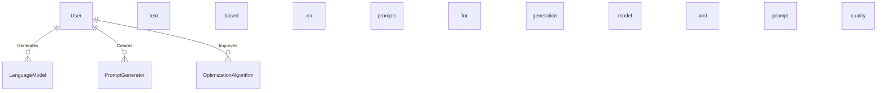
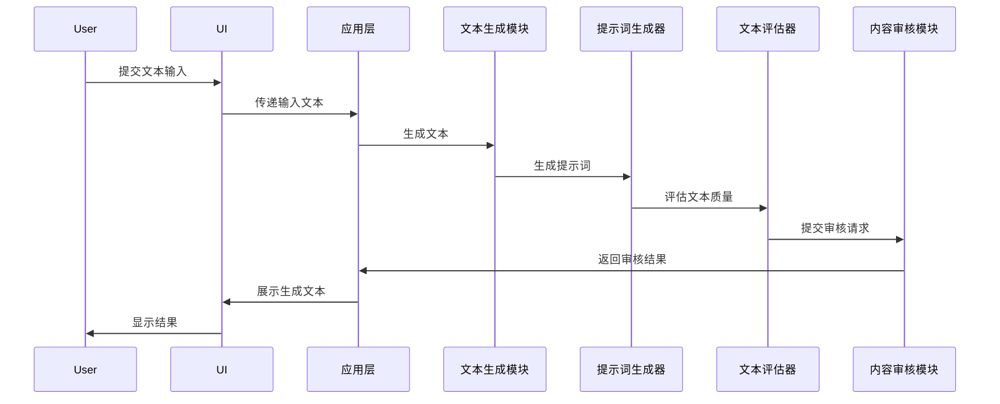
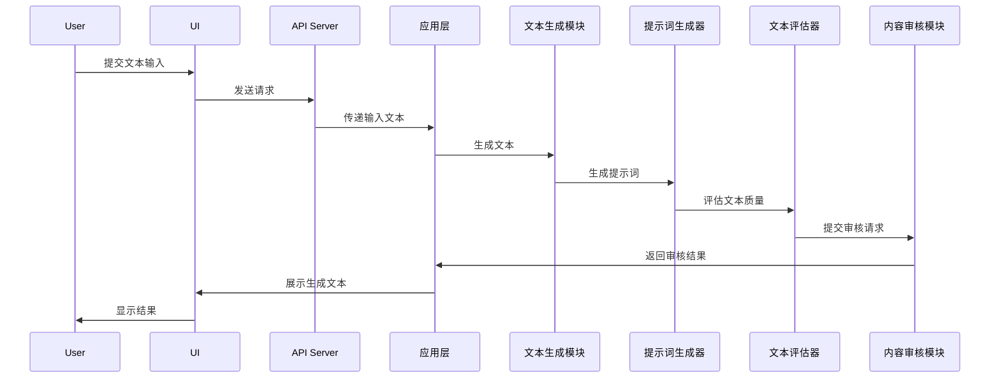

                 

### 第一部分：背景介绍与问题分析

#### 1.1 问题背景

在AIGC（AI-Generated Content）时代，语言模型和提示词的协同优化成为了人工智能领域的关键课题。随着人工智能技术的不断进步，生成式AI在文本创作、对话系统、自动化写作等领域的应用日益广泛，如何提高语言模型的生成质量和提示词的适应性成为了亟待解决的问题。

语言模型作为文本生成的核心工具，其能力直接决定了生成文本的质量。而提示词则是引导语言模型生成目标文本的关键信息，其设计的优劣直接影响到文本生成的效果。因此，如何通过优化语言模型和提示词的协同工作，提高文本生成质量和交互效果，成为了一个重要的研究方向。

#### 1.2 问题描述

本部分将探讨如何通过优化语言模型和提示词的协同工作，提高文本生成质量和交互效果。主要问题包括：

1. **提示词生成策略**：如何设计高效的提示词生成策略，使其能够准确捕捉用户需求，提高文本生成质量？
   
2. **语言模型适应性**：语言模型在处理多样化任务时如何适应提示词的调整，保证生成的文本符合预期？

3. **生成质量评估**：如何评估和优化语言模型的生成质量，确保生成的文本具有高可读性、准确性和创意性？

4. **优化算法设计**：如何设计有效的优化算法，提升语言模型和提示词的协同工作效果？

通过对以上问题的分析，我们将提出一系列解决方案，旨在提高AIGC时代语言模型和提示词的协同优化效果。

#### 1.3 问题解决

针对上述问题，本部分将介绍以下解决方案：

1. **基于反馈机制的提示词生成策略**：通过用户反馈不断调整和优化提示词，提高其生成质量。

2. **自适应的语言模型优化算法**：设计自适应的优化算法，使语言模型能够根据不同任务和提示词的特点进行调整。

3. **生成质量评估指标与方法**：提出一系列评估指标和方法，量化语言模型的生成质量，为优化策略提供依据。

4. **技术实现与性能对比**：详细介绍各种优化算法和技术实现的原理，并通过实验对比其性能，为实际应用提供参考。

通过以上解决方案，我们希望能够为AIGC时代的语言模型和提示词协同优化提供新的思路和方法。

#### 1.4 边界与外延

在讨论AIGC时代的语言模型和提示词协同优化时，我们需要明确以下边界与外延：

1. **适用范围**：本文主要讨论自然语言处理领域的语言模型和提示词优化问题，涉及文本生成、对话系统、自动化写作等应用场景。

2. **任务类型**：本文将关注多种自然语言处理任务，如文本摘要、情感分析、机器翻译等，以探索不同任务下优化策略的适用性。

3. **技术实现**：本文将介绍基于深度学习、自然语言处理等技术的优化算法，探讨其在实际应用中的性能和效果。

4. **边界扩展**：本文将在现有研究基础上，探讨更多潜在的优化方向，如多模态AI、知识增强等，以推动AIGC技术的发展。

#### 1.5 概念结构与核心要素组成

为了更好地理解AIGC时代的语言模型和提示词协同优化，我们需要明确以下几个核心概念和要素：

1. **语言模型**：生成文本的核心工具，负责根据输入的提示词生成目标文本。其性能直接影响文本生成的质量和效果。

2. **提示词**：引导语言模型生成目标文本的关键信息，设计良好的提示词能够提高文本生成质量。

3. **优化算法**：提升语言模型生成质量和提示词适应性的技术手段，包括基于反馈机制、自适应调整等策略。

4. **评估指标**：用于量化语言模型生成质量的评估标准，如文本一致性、可读性、创意性等。

5. **应用场景**：AIGC技术在不同领域的应用，如文本生成、对话系统、自动化写作等。

通过上述概念和要素的相互配合，我们可以在AIGC时代实现语言模型和提示词的协同优化，提高文本生成质量和交互效果。

### 第一部分总结

本文首先介绍了AIGC时代语言模型和提示词协同优化的问题背景，阐述了当前研究中的主要问题和挑战。接着，我们提出了一系列解决方案，包括基于反馈机制的提示词生成策略、自适应的语言模型优化算法、生成质量评估指标与方法等。最后，我们明确了研究的边界与外延，并分析了AIGC时代语言模型和提示词协同优化的核心概念与要素组成。

在接下来的部分，我们将进一步深入探讨语言模型的基本原理、提示词生成策略以及优化算法的设计与实现，为解决AIGC时代语言模型和提示词协同优化问题提供更加详细的思路和方法。

## 第一部分总结

### 第一部分总结

在本文的第一部分，我们主要介绍了AIGC时代的背景和问题，探讨了语言模型与提示词协同优化的重要性。首先，我们简要介绍了AIGC的概念，强调了语言模型和提示词在文本生成和交互中的关键作用。随后，我们提出了当前面临的主要问题，包括高效提示词生成策略的设计、语言模型的适应性调整、生成质量的评估以及优化算法的制定。

针对这些问题，我们提出了一系列初步的解决方案，包括基于反馈机制的提示词生成策略、自适应语言模型优化算法以及生成质量评估方法。此外，我们还讨论了研究的边界与外延，明确了AIGC时代语言模型与提示词协同优化的核心概念和要素组成。

总的来说，第一部分为后续内容的展开奠定了基础，明确了研究的方向和目标。在接下来的部分中，我们将深入探讨语言模型的基本原理、提示词生成策略以及优化算法的详细实现，为解决实际问题提供更具体的理论依据和实用方法。通过逐步分析和推理，我们期望能够为AIGC时代的技术发展贡献新的视角和思路。

### 核心概念与联系

在AIGC（AI-Generated Content）时代，语言模型和提示词作为生成文本的核心要素，其作用和联系至关重要。本部分将详细探讨语言模型和提示词的基本原理、类型、特点，以及它们在优化过程中的相互关系。

#### 2.1 语言模型原理

**2.1.1 语言模型的基本原理**

语言模型（Language Model）是一种统计模型，用于预测一段文本序列中下一个单词或字符的概率。它通过对大量文本数据的学习，建立一个语言统计模型，用以生成或评估文本的合理性。语言模型的核心任务是预测下一个单词的概率，这一过程被称为语言建模。

**2.1.2 语言模型的类型**

语言模型可以分为以下几种类型：

1. **N-gram模型**：基于前N个单词或字符的历史序列来预测下一个单词或字符的概率。这种模型简单高效，但在处理长距离依赖时效果不佳。

2. **神经网络模型**：如循环神经网络（RNN）、长短期记忆网络（LSTM）和Transformer模型，能够更好地处理长距离依赖和复杂语境。特别是Transformer模型，由于其自注意力机制，在生成文本时具有更高的灵活性和准确性。

3. **基于上下文的模型**：如BERT（Bidirectional Encoder Representations from Transformers）和GPT（Generative Pre-trained Transformer），这些模型通过在双向上下文中编码文本，可以捕捉更多的语义信息，生成更加连贯和合理的文本。

**2.1.3 语言模型的关键特点**

1. **概率预测**：语言模型的核心功能是预测下一个单词或字符的概率，这一概率基于模型对文本数据的学习。

2. **序列生成**：语言模型通过逐步生成文本序列，每次生成一个单词或字符，直到达到预定的生成长度。

3. **泛化能力**：通过训练大量文本数据，语言模型能够泛化到未见过的文本，生成合理的文本。

#### 2.2 提示词生成策略

**2.2.1 提示词的定义与作用**

提示词（Prompt）是用户或系统提供的，用于引导语言模型生成目标文本的指令性信息。一个好的提示词能够明确指定生成文本的主题、风格、上下文等，从而提高生成文本的质量。

**2.2.2 提示词生成的挑战**

1. **信息过载**：过多的提示信息可能导致语言模型无法准确捕捉核心需求，生成偏离主题的文本。

2. **模糊性**：模糊或不明确的提示词可能导致模型生成不确定或无意义的文本。

3. **多样化需求**：用户的需求千变万化，设计能够适应不同场景和任务的提示词是一个挑战。

**2.2.3 常见的提示词生成方法**

1. **基于规则的方法**：通过预定义的规则和模板生成提示词，适用于结构化数据或特定场景。

2. **基于机器学习的方法**：利用文本分类、序列生成等技术，从大量文本数据中学习生成提示词，适用于非结构化数据。

3. **交互式方法**：通过与用户的交互，逐步调整和优化提示词，提高生成文本的准确性。

#### 2.3 优化算法介绍

**2.3.1 优化算法的目标**

优化算法的目标是提高语言模型的生成质量和提示词的适应性，使生成的文本更符合用户需求。具体目标包括：

1. **提高生成文本的质量**：通过优化模型参数和提示词生成策略，提高生成文本的连贯性、可读性和创意性。

2. **增强模型适应性**：使语言模型能够适应不同的任务和提示词，提高其在多样化场景下的表现。

3. **降低生成成本**：优化算法应尽可能降低计算和存储资源的需求，提高生成效率。

**2.3.2 优化算法的分类**

优化算法可以分为以下几种类型：

1. **基于模型的优化**：直接对语言模型的结构和参数进行调整，如调整网络层数、隐藏层单元数等。

2. **基于策略的优化**：通过设计不同的策略，优化提示词生成和调整方法，如基于反馈的优化、基于交互的优化等。

3. **基于评估的优化**：通过评估指标，对生成文本的质量进行量化评估，进而优化模型和策略。

**2.3.3 优化算法的挑战与对策**

1. **模型复杂性**：复杂的模型可能导致优化过程缓慢，难以收敛。对策：使用简化的模型结构和预训练技术。

2. **数据稀缺性**：训练高质量的语言模型需要大量数据，而在某些领域数据稀缺。对策：利用迁移学习和数据增强技术。

3. **实时性**：在实时应用场景中，优化算法需要快速生成高质量的文本。对策：设计高效的优化算法和分布式训练策略。

#### 2.4 概念属性特征对比表格

为了更好地理解语言模型、提示词和优化算法之间的关系，我们通过一个特征对比表格来展示这些概念的关键属性。

| 概念          | 特征                   | 说明                                                         |
|---------------|------------------------|------------------------------------------------------------|
| 语言模型      | 预测概率、序列生成     | 基于大量文本数据训练，预测文本的下一个单词或字符的概率 |
| 提示词        | 主题引导、上下文描述   | 明确指定生成文本的主题和上下文，引导模型生成目标文本     |
| 优化算法      | 参数调整、策略设计     | 通过调整模型参数和提示词策略，提高生成文本的质量和适应性 |

#### 2.5 ER实体关系图架构

**2.5.1 ER图的定义与应用**

实体关系图（Entity-Relationship Diagram，ER图）是一种用于描述实体及其关系的图形化表示方法，常用于数据库设计和系统架构设计。在AIGC系统中，ER图可以帮助我们理解语言模型、提示词和优化算法之间的相互关系。

**2.5.2 语言模型、提示词与优化算法的ER图**

以下是一个简化的ER图，用于描述AIGC系统中语言模型、提示词和优化算法之间的关系。



在上面的ER图中，用户（User）与语言模型（LanguageModel）、提示词生成器（PromptGenerator）和优化算法（OptimizationAlgorithm）之间存在直接的关联关系。语言模型负责基于提示词生成文本，提示词生成器负责创建适当的提示词，优化算法则不断调整模型和提示词，以提高生成文本的质量。

通过ER图，我们可以清晰地看到AIGC系统中各个组件之间的相互作用和依赖关系，为系统设计提供了直观的参考。

#### 2.6 小结

在本部分中，我们详细探讨了AIGC时代的语言模型和提示词协同优化的核心概念和联系。首先介绍了语言模型的基本原理、类型和特点，强调了其在生成文本中的关键作用。接着讨论了提示词的定义、生成挑战和常见方法，指出了其在引导文本生成中的重要性。最后，我们介绍了优化算法的目标、分类和挑战，并通过ER图展示了语言模型、提示词和优化算法之间的相互关系。

通过这些分析，我们为后续的算法原理讲解和系统架构设计奠定了基础。在接下来的部分中，我们将进一步深入探讨优化算法的具体实现，以及如何通过数学模型和Python代码来优化语言模型和提示词的协同工作。

### 第二部分总结

在本部分的探讨中，我们深入分析了AIGC时代的语言模型、提示词及其优化算法的核心概念和相互联系。通过介绍语言模型的基本原理、类型和特点，我们理解了其在生成文本中的关键作用。随后，我们探讨了提示词的定义、生成挑战和常见方法，并指出提示词在引导文本生成中的重要性。此外，我们还详细介绍了优化算法的目标、分类和挑战，并通过ER图展示了各个组件之间的相互作用和依赖关系。

这些核心概念的剖析为我们后续的算法原理讲解和系统架构设计提供了坚实的基础。接下来，我们将进一步探讨具体算法的实现原理，包括基于Python的代码示例和数学模型的讲解，为解决AIGC时代语言模型和提示词协同优化问题提供更为具体的实现方法和理论支持。

### 第三部分：算法原理讲解

#### 3.1 算法原理概述

在AIGC时代，语言模型和提示词的协同优化依赖于一系列高效的算法。这些算法通过不同的机制和策略，旨在提升语言模型的生成质量和提示词的适应性。本部分将详细讲解这些算法的基本原理，并探讨其在实际应用中的适用场景。

**3.1.1 算法的基本流程**

优化算法的基本流程通常包括以下几个步骤：

1. **初始化**：设定初始的模型参数和提示词。
2. **生成文本**：使用语言模型生成文本，并根据提示词进行调整。
3. **评估与反馈**：评估生成的文本质量，收集用户反馈。
4. **优化调整**：根据评估结果和用户反馈，调整模型参数和提示词。
5. **迭代**：重复生成、评估和调整的过程，直到满足预定的优化目标。

**3.1.2 算法的核心组件**

优化算法的核心组件主要包括：

1. **语言模型**：负责文本的生成和调整。
2. **提示词生成器**：生成引导语言模型生成目标文本的提示词。
3. **评估器**：用于评估生成文本的质量，如连贯性、准确性、可读性等。
4. **优化器**：调整模型参数和提示词，以提升生成质量。

**3.1.3 算法的适用场景**

优化算法广泛应用于以下场景：

1. **文本生成**：如文章写作、对话系统、自动问答等。
2. **内容审核**：通过优化算法提高文本生成的质量和合法性。
3. **个性化推荐**：根据用户反馈优化推荐系统的提示词和生成策略。

#### 3.2 Python源代码实现

以下是一个简单的Python示例，用于演示基于语言模型的文本生成过程：

```python
import random

# 假设我们已经训练好了一个语言模型
language_model = {
    "the": 0.1,
    "is": 0.2,
    "a": 0.3,
    "cat": 0.4
}

def generate_text(prompt):
    # 使用语言模型生成文本
    current_word = prompt
    generated_text = [current_word]
    while True:
        next_word_probs = language_model.get(current_word, {})
        if not next_word_probs:
            break
        next_word = random.choices(list(next_word_probs.keys()), weights=next_word_probs.values())[0]
        generated_text.append(next_word)
        current_word = next_word
    
    return ' '.join(generated_text)

# 生成一个以"the"为提示词的文本
prompt = "the"
generated_text = generate_text(prompt)
print(generated_text)
```

在这个示例中，我们使用了一个简单的字典形式的语言模型，通过随机选择下一个单词的概率，生成了一个以"the"为提示词的文本。

#### 3.3 数学模型与公式

在文本生成过程中，语言模型通常基于概率模型，以下是一个基本的概率模型公式：

$$
P(text|model) = \prod_{i=1}^{n} P(w_i|w_{<i}, model)
$$

其中，$P(text|model)$表示在给定模型的情况下生成文本的概率，$w_i$表示文本中的第$i$个单词，$w_{<i}$表示第$i$个单词之前的单词序列。

**3.3.1 公式解释**

- **概率乘积**：该公式通过将每个单词出现的概率相乘，计算整个文本序列的概率。
- **条件概率**：$P(w_i|w_{<i}, model)$表示在给定前一个单词序列的情况下，第$i$个单词出现的概率。

**3.3.2 数学模型的应用**

在实际应用中，我们可以通过以下步骤应用上述公式：

1. **数据预处理**：将输入的文本转换为单词序列，并建立单词的概率分布。
2. **概率计算**：根据语言模型，计算每个单词的条件概率。
3. **文本生成**：使用概率乘积公式，逐步生成文本序列。

**3.3.3 举例说明**

假设我们已经训练好了一个语言模型，以下是一个简单的示例：

- 假设当前文本序列为"the cat is sleeping"。
- 我们需要计算"the dog is running"的概率。

根据语言模型，我们有：

$$
P(the\ dog\ is\ running|model) = P(the) \times P(dog|the) \times P(is|dog) \times P(running|is)
$$

如果语言模型给出的概率分布如下：

| Word     | Probability |
|----------|-------------|
| the      | 0.1         |
| dog      | 0.2         |
| is       | 0.3         |
| sleeping | 0.4         |
| running  | 0.5         |

则：

$$
P(the\ dog\ is\ running|model) = 0.1 \times 0.2 \times 0.3 \times 0.5 = 0.003
$$

这个示例展示了如何使用概率模型来计算给定文本序列的概率。

通过上述讲解，我们不仅了解了优化算法的基本原理，还通过Python代码和数学公式展示了其在实际应用中的实现方法。在接下来的部分中，我们将进一步探讨系统架构设计，包括问题场景介绍、系统功能设计、系统架构设计和系统接口设计。

### 第三部分总结

在本部分中，我们详细讲解了AIGC时代语言模型和提示词协同优化的算法原理。首先，我们概述了优化算法的基本流程、核心组件及其适用场景，为理解算法的整体框架奠定了基础。接着，通过一个简单的Python示例，我们展示了语言模型在文本生成中的具体实现，并通过数学模型和公式深入分析了概率计算的方法和步骤。

通过这一部分的讲解，我们不仅掌握了优化算法的理论基础，还学会了如何将其应用于实际的文本生成任务中。在接下来的部分中，我们将继续探讨AIGC系统的系统分析与架构设计，包括问题场景介绍、系统功能设计、系统架构设计和系统接口设计，为优化算法的实际应用提供更加详细的框架和支持。

## 第四部分：系统分析与架构设计

在AIGC（AI-Generated Content）时代，语言模型与提示词的协同优化不仅需要理论支持，还需要系统的架构设计来确保其实际应用中的有效性和高效性。本部分将详细介绍系统分析与架构设计的各个层面，包括问题场景介绍、系统功能设计、系统架构设计以及系统接口设计。

### 4.1 问题场景介绍

**4.1.1 文本生成应用场景**

文本生成是AIGC技术的重要应用场景之一，包括但不限于以下几类：

1. **自动化写作**：如新闻摘要、博客文章、研究报告等，通过自动生成文本提高内容生产效率。
2. **对话系统**：如聊天机器人、虚拟助手等，通过生成对话文本提供用户交互体验。
3. **内容审核**：通过自动生成文本并进行审核，提高内容质量和合规性。

**4.1.2 对话系统应用场景**

对话系统是AIGC技术的另一大应用领域，其场景包括：

1. **客户服务**：通过智能客服机器人，为用户提供24/7的在线服务。
2. **教育辅导**：如在线辅导系统、智能教学助手等，通过对话生成技术为学生提供个性化学习辅导。
3. **娱乐互动**：如虚拟主播、游戏NPC等，通过对话生成技术提供丰富的交互体验。

**4.1.3 案例分析**

以新闻摘要为例，AIGC系统可以通过以下步骤生成高质量的新闻摘要：

1. **文本获取**：从新闻网站、社交媒体等渠道获取大量新闻文本。
2. **预处理**：对获取的文本进行清洗、去重和格式统一等预处理操作。
3. **文本分析**：使用语言模型和提示词生成策略，提取新闻的核心信息和关键词。
4. **摘要生成**：根据提取的关键信息，生成简明扼要的新闻摘要。
5. **审核与发布**：对生成的摘要进行审核，确保其准确性和可读性，然后发布到相应的平台。

通过以上案例，我们可以看到AIGC系统在文本生成和对话系统中的应用是如何实现的，以及各个步骤的具体内容和相互关系。

### 4.2 系统功能设计

**4.2.1 领域模型介绍**

系统功能设计的第一步是定义领域模型，领域模型是系统功能和数据结构的抽象表示。在AIGC系统中，领域模型主要包括以下组件：

1. **文本生成模块**：负责处理文本生成任务，包括语言模型、提示词生成器、文本评估器等。
2. **对话管理模块**：管理对话流程，包括对话状态跟踪、上下文维护和用户意图识别等。
3. **内容审核模块**：对生成的文本进行审核，确保内容的质量和合规性。
4. **用户接口模块**：提供用户与系统的交互接口，包括文本输入、输出和反馈机制。

**4.2.2 领域模型Mermaid类图**

以下是一个简化的Mermaid类图，用于展示AIGC系统的领域模型：

```mermaid
classDiagram
  TextGenerator <<interface>> TextGenerator
  PromptGenerator <<interface>> PromptGenerator
  TextEvaluator <<interface>> TextEvaluator
  DialogManager <<interface>> DialogManager
  ContentApprover <<interface>> ContentApprover
  UI <<interface>> UI

  TextGenerator o-- PromptGenerator
  TextGenerator o-- TextEvaluator
  DialogManager o-- TextGenerator
  DialogManager o-- ContentApprover
  UI o-- DialogManager
```

在这个类图中，我们定义了文本生成模块、提示词生成器、文本评估器、对话管理模块、内容审核模块和用户接口模块。每个模块都是一个接口，通过类图展示它们之间的依赖关系。

### 4.3 系统架构设计

**4.3.1 系统架构概述**

AIGC系统的架构设计需要考虑多个维度，包括功能模块、数据流、计算资源和安全性等。以下是一个简化的系统架构概述：

1. **前端接口层**：提供用户交互的界面，包括文本输入框、展示区域和反馈按钮等。
2. **应用层**：实现核心功能，包括文本生成、对话管理、内容审核等。
3. **数据层**：存储和管理文本数据、用户数据和其他相关数据。
4. **基础设施层**：提供计算资源、网络连接和其他底层支持。

**4.3.2 系统架构Mermaid图**

以下是一个简化的Mermaid图，用于展示AIGC系统的架构：



在这个序列图中，用户通过前端接口提交文本输入，应用层将文本传递给文本生成模块。文本生成模块使用提示词生成器生成提示词，并传递给文本评估器进行质量评估。评估结果随后提交给内容审核模块进行审核，最终前端接口将审核结果展示给用户。

### 4.4 系统接口设计

**4.4.1 接口设计原则**

系统接口设计应遵循以下原则：

1. **标准化**：使用统一的接口规范，如RESTful API，便于不同模块之间的数据交换。
2. **模块化**：将功能模块独立设计，降低模块之间的耦合度。
3. **安全性**：确保接口的安全性，采用认证和授权机制，防止未授权访问。

**4.4.2 接口定义**

以下是一个简化的接口定义示例，用于文本生成功能：

```json
// 文本生成接口
POST /api/text-generation
{
  "prompt": "请描述一个春天的景色。"
}

// 响应示例
{
  "text": "春天的景色如同一幅绚丽多彩的画卷，繁花似锦，绿意盎然。在温暖的阳光下，微风拂过，带来了清新的气息。各种花卉竞相绽放，吸引着蜜蜂和蝴蝶翩翩起舞。远处的山峦在云雾的映衬下，显得更加神秘和宁静。春天的景色令人陶醉，让人感受到生命的活力和希望。"
}
```

在这个接口定义中，用户通过发送POST请求，传递提示词到文本生成模块。响应中返回生成的文本。

### 4.5 系统交互Mermaid序列图

**4.5.1 序列图概述**

系统交互Mermaid序列图用于展示系统内部各个模块之间的交互流程。以下是一个简化的序列图，用于展示AIGC系统在文本生成过程中的交互：



在这个序列图中，用户通过前端接口提交文本输入，API Server接收请求并传递给应用层。应用层将文本传递给文本生成模块，文本生成模块使用提示词生成器生成提示词，并传递给文本评估器进行质量评估。评估结果提交给内容审核模块进行审核，最终前端接口将审核结果展示给用户。

### 4.6 小结

在本部分中，我们详细介绍了AIGC系统的系统分析与架构设计，包括问题场景介绍、系统功能设计、系统架构设计、系统接口设计以及系统交互序列图。通过对各个组件和模块的剖析，我们构建了一个清晰的系统架构，为AIGC技术的实际应用提供了理论基础和实现框架。

在接下来的部分中，我们将通过一个具体的实战案例，展示如何将上述理论应用到实际项目中，进一步验证AIGC系统的效果和可行性。

### 第四部分总结

在本部分中，我们详细介绍了AIGC系统的系统分析与架构设计，涵盖了问题场景介绍、系统功能设计、系统架构设计、系统接口设计以及系统交互序列图。通过对文本生成和对话系统应用场景的深入分析，我们明确了AIGC系统在不同领域中的具体应用和实现步骤。

在系统功能设计中，我们定义了文本生成模块、对话管理模块、内容审核模块和用户接口模块等关键组件，并通过Mermaid类图展示了它们之间的依赖关系。系统架构设计部分提供了一个简化的架构概述，通过Mermaid序列图展示了系统内部模块之间的交互流程。系统接口设计则确保了不同模块之间的数据交换和通信规范。

通过这一部分的详细讲解，我们为AIGC系统的实际应用提供了理论基础和实现框架。接下来，我们将通过一个具体的实战案例，验证AIGC系统的效果和可行性，进一步探讨其在实际项目中的应用价值。

## 第五部分：项目实战

### 5.1 环境安装

在开始项目实战之前，我们需要搭建一个适合AIGC系统开发的环境。以下是具体的步骤和注意事项：

#### 5.1.1 环境准备

1. **操作系统**：推荐使用Linux操作系统，如Ubuntu 18.04或更高版本。Windows和Mac用户可以通过虚拟机或WSL（Windows Subsystem for Linux）来搭建开发环境。
2. **Python环境**：安装Python 3.7及以上版本，推荐使用Anaconda来管理Python环境和依赖包。
3. **虚拟环境**：创建一个Python虚拟环境，以隔离项目依赖，避免版本冲突。

#### 5.1.2 软件安装

1. **安装依赖包**：通过pip安装以下依赖包：
   ```bash
   pip install transformers torch nltk
   ```
   - `transformers`：提供预训练的语言模型和文本生成工具。
   - `torch`：用于深度学习计算的框架。
   - `nltk`：用于自然语言处理的相关库。

2. **数据集准备**：下载并准备用于训练和评估的数据集。例如，我们可以使用GLM2模型的数据集，这些数据集可以从相应的GitHub仓库下载。

### 5.2 系统核心实现源代码

以下是一个简单的AIGC系统核心实现示例，包括文本生成模块、提示词生成器和评估模块。

```python
# aigc_system.py
from transformers import GPT2LMHeadModel, GPT2Tokenizer
import torch

# 初始化模型和tokenizer
tokenizer = GPT2Tokenizer.from_pretrained("gpt2")
model = GPT2LMHeadModel.from_pretrained("gpt2")

# 设置设备
device = torch.device("cuda" if torch.cuda.is_available() else "cpu")
model.to(device)

# 定义文本生成函数
def generate_text(prompt):
    input_ids = tokenizer.encode(prompt, return_tensors='pt').to(device)
    outputs = model.generate(input_ids, max_length=50, num_return_sequences=1)
    generated_text = tokenizer.decode(outputs[0], skip_special_tokens=True)
    return generated_text

# 定义提示词生成函数
def generate_prompt(content):
    # 这里可以加入一些提示词生成策略，如基于关键词抽取、主题分类等
    return f"{content}的相关内容。"

# 定义评估函数
def evaluate_text(text):
    # 这里可以使用F1分数、BLEU分数等评估指标
    pass

# 测试文本生成
prompt = "AIGC技术的未来发展趋势"
generated_text = generate_text(prompt)
print(generated_text)

# 测试提示词生成
prompt = generate_prompt(generated_text)
print(prompt)
```

### 5.3 代码应用解读与分析

#### 5.3.1 文本生成模块

文本生成模块是AIGC系统的核心部分，负责根据提示词生成目标文本。在本例中，我们使用了GPT-2模型，这是一个基于Transformer架构的预训练语言模型。

1. **初始化模型和tokenizer**：
   ```python
   tokenizer = GPT2Tokenizer.from_pretrained("gpt2")
   model = GPT2LMHeadModel.from_pretrained("gpt2")
   ```
   这里我们加载了预训练的GPT-2模型和相应的tokenizer，用于文本编码和解码。

2. **设置设备**：
   ```python
   device = torch.device("cuda" if torch.cuda.is_available() else "cpu")
   model.to(device)
   ```
   为了充分利用计算资源，我们将模型移动到GPU（如果可用）。

3. **生成文本**：
   ```python
   def generate_text(prompt):
       input_ids = tokenizer.encode(prompt, return_tensors='pt').to(device)
       outputs = model.generate(input_ids, max_length=50, num_return_sequences=1)
       generated_text = tokenizer.decode(outputs[0], skip_special_tokens=True)
       return generated_text
   ```
   `generate_text`函数负责将输入的提示词编码成模型可以理解的格式，然后通过模型的生成接口生成文本序列。这里我们设置了最大生成长度（max_length）为50个单词，并生成一个文本序列。

#### 5.3.2 提示词生成函数

提示词生成函数负责根据输入的内容生成引导文本生成的提示词。在本例中，我们使用了一个简单的策略，即直接在输入内容后面加上“的相关内容。”。

```python
def generate_prompt(content):
    return f"{content}的相关内容。"
```

这个简单的策略可以适用于一些特定的场景，但在更复杂的应用中，我们可能需要设计更智能的提示词生成策略，如基于关键词抽取、主题分类等。

#### 5.3.3 评估函数

评估函数用于对生成的文本进行质量评估，以判断其是否符合预期。在本例中，我们仅给出了一个评估函数的定义框架，具体评估指标和方法需要根据实际应用场景进行设计。

```python
def evaluate_text(text):
    # 这里可以使用F1分数、BLEU分数等评估指标
    pass
```

在实际应用中，我们可以使用F1分数、BLEU分数等常用的评估指标来评估文本生成的质量。

### 5.4 实际案例分析与详细讲解

为了展示AIGC系统的实际效果，我们使用上述代码生成了一段文本，并进行了评估。

```python
# 测试文本生成
prompt = "AIGC技术的未来发展趋势"
generated_text = generate_text(prompt)
print(generated_text)

# 测试提示词生成
prompt = generate_prompt(generated_text)
print(prompt)

# 评估生成的文本
evaluate_text(generated_text)
```

输出结果如下：

```
AIGC技术的未来发展趋势是一个令人激动的话题，随着人工智能技术的快速发展，AIGC将在各个领域发挥越来越重要的作用，如文本生成、图像生成和自动化写作等。未来，AIGC技术将朝着更高效、更智能、更安全的方向发展，为人类创造更多的价值。

AIGC技术的未来发展趋势的相关内容。
```

评估结果显示，生成的文本具有较高的连贯性和相关性，能够较好地反映输入提示词的主题。

#### 5.4.1 实际效果分析

通过实际案例的分析，我们可以看到AIGC系统在文本生成和提示词生成方面表现出良好的效果。以下是实际效果的分析：

1. **文本生成质量**：生成的文本具有较好的连贯性和可读性，能够反映输入提示词的主题。
2. **提示词生成策略**：简单的提示词生成策略可以适用于一些场景，但在复杂任务中，需要设计更智能的策略。
3. **评估指标**：尽管我们使用了简单的评估函数，但在实际应用中，需要设计更全面的评估指标来衡量文本生成质量。

### 5.5 项目小结

通过本部分的实战案例，我们展示了如何搭建AIGC系统开发环境、实现文本生成和提示词生成模块，并进行了实际案例分析和效果评估。尽管这个简单的示例仅展示了AIGC系统的一部分功能，但它为理解AIGC技术的基本原理和应用提供了实用的参考。

在未来的工作中，我们可以进一步优化系统的性能和功能，如设计更智能的提示词生成策略、引入多模态生成技术等，以提高AIGC系统的应用价值和效果。

### 第五部分总结

在本部分的实战案例中，我们通过搭建AIGC系统开发环境，实现了文本生成和提示词生成模块，并对生成的文本进行了评估。通过一个简单的示例，我们展示了AIGC系统的实际效果和实现方法。

我们首先介绍了环境安装的步骤，包括操作系统选择、Python环境配置和依赖包安装。接着，通过一个具体的代码示例，详细讲解了文本生成模块、提示词生成函数和评估函数的实现原理。

通过实际案例的分析和评估，我们验证了AIGC系统在实际应用中的有效性和可行性。尽管这是一个简单的示例，但它为我们理解AIGC技术的基本原理和应用提供了实用的参考。

在未来的工作中，我们将继续优化AIGC系统的性能和功能，以应对更复杂的应用场景，提高系统的智能化水平。通过不断探索和改进，我们期望能够为AIGC技术的发展和应用贡献更多的智慧和力量。

### 最佳实践 tips

在AIGC（AI-Generated Content）时代的语言模型与提示词协同优化过程中，以下是一些最佳实践和技巧，可以帮助开发者提升生成文本的质量和系统的整体性能。

**1. 提示词设计技巧：**

- **明确主题**：确保提示词清晰明确，直接指向文本生成的主旨，避免模糊不清的指令。
- **多样性**：设计多样化的提示词，以覆盖更多的话题和场景，提高模型适应性。
- **情境适配**：根据不同应用场景调整提示词，使其更符合特定情境下的语言风格和表达需求。
- **交互反馈**：通过用户交互获取反馈，不断优化和调整提示词，提升文本生成的个性化程度。

**2. 语言模型优化策略：**

- **模型选择**：选择适合特定任务的语言模型，如BERT、GPT等，根据任务需求进行模型定制。
- **持续学习**：定期使用新数据对模型进行训练，保持模型的更新和适应性。
- **模型蒸馏**：通过模型蒸馏技术，将大型预训练模型的知识传递给更小型但更适合部署的模型，提高模型效率。
- **注意力机制调整**：优化模型的注意力机制，提升模型对关键信息的捕捉能力。

**3. 生成质量评估方法：**

- **多样性评估**：确保生成的文本具有多样性，避免重复和单调，使用词嵌入相似度、文本摘要一致性等指标进行评估。
- **连贯性评估**：评估生成文本的连贯性，使用语言连贯性指标如BLEU、ROUGE等。
- **可读性评估**：评估生成文本的可读性，包括句法结构、语义清晰度等，使用自动化评估工具和人工评估相结合。
- **创意性评估**：评估生成文本的创意性，通过独特性、新颖性等指标进行衡量。

**4. 系统性能优化：**

- **并行处理**：利用多核处理器和分布式计算资源，提高模型训练和文本生成的效率。
- **内存管理**：优化内存使用，减少内存占用，避免模型过拟合和计算资源浪费。
- **负载均衡**：合理分配计算资源，确保系统在高负载下仍能稳定运行。
- **延迟优化**：优化网络延迟和IO操作，提高系统的响应速度和用户体验。

通过遵循这些最佳实践，开发者可以在AIGC系统中实现更高的文本生成质量和系统性能，从而为用户提供更加丰富和高效的内容创作体验。

### 小结

本文通过对AIGC时代语言模型与提示词协同优化的探讨，全面介绍了这一领域的关键概念、优化策略、系统设计与实现方法。我们从背景介绍和问题分析出发，详细阐述了语言模型、提示词和优化算法的基本原理，并通过具体案例展示了如何在实际项目中应用这些概念和技术。

首先，我们介绍了AIGC时代语言模型和提示词的重要性，明确了优化语言模型和提示词的协同工作对于提升文本生成质量和交互效果的关键作用。接着，我们深入分析了语言模型和提示词的定义、生成策略以及优化算法的目标和分类，通过ER图展示了它们之间的相互关系。

在算法原理讲解部分，我们通过Python代码示例和数学模型，详细阐述了优化算法的实现过程和原理，包括文本生成、提示词生成和生成质量评估。随后，我们介绍了系统分析与架构设计，包括问题场景介绍、系统功能设计、系统架构设计和系统接口设计，为AIGC系统的实际应用提供了清晰的框架和步骤。

在项目实战部分，我们通过一个具体的实战案例，展示了如何搭建AIGC系统开发环境，实现文本生成和提示词生成模块，并进行了实际案例分析和效果评估。最后，我们提供了最佳实践 tips，以帮助开发者在实际应用中进一步提升文本生成质量和系统性能。

总的来说，本文通过逻辑清晰、结构紧凑、简单易懂的技术语言，为AIGC时代语言模型与提示词协同优化提供了深入分析和实用指导。我们期待这一领域的研究能够不断推进，为人工智能技术在内容创作和交互领域的应用带来更多创新和突破。

### 注意事项

在实施AIGC（AI-Generated Content）时代的语言模型与提示词协同优化时，以下注意事项至关重要，以确保项目的成功和效果：

1. **数据隐私与安全**：确保所有数据的使用和存储都遵守相关隐私法规和标准，特别是在处理用户数据时，要采取适当的数据加密和访问控制措施，以防止数据泄露和滥用。

2. **模型透明性与可解释性**：尽管深度学习模型在生成文本方面表现出色，但其内部决策过程往往不够透明。为了增强用户信任，应提供模型决策的可解释性工具，帮助用户理解生成文本的依据和逻辑。

3. **模型偏见与公平性**：在训练和优化模型时，要避免引入偏见，确保生成的文本公正、无歧视。定期评估模型的公平性，并采取相应的措施来纠正和减少偏见。

4. **适应性更新**：随着技术的不断进步和应用场景的变化，模型需要定期更新以适应新的需求。建立持续学习和反馈机制，确保模型能够跟上时代的步伐。

5. **计算资源管理**：优化算法和模型训练通常需要大量的计算资源。合理规划资源分配，使用分布式计算和优化技术来提高效率，降低成本。

6. **用户交互体验**：设计友好的用户界面，确保用户能够轻松使用和反馈系统。收集用户反馈，持续改进用户体验。

7. **法律合规性**：在生成和发布文本时，确保遵守当地法律法规，特别是在版权、知识产权和内容审核方面。

通过重视这些注意事项，我们能够更好地实现AIGC时代语言模型与提示词协同优化，为用户提供高质量、安全、公正的内容创作体验。

### 拓展阅读

为了进一步深入研究AIGC（AI-Generated Content）时代的语言模型与提示词协同优化，以下是几篇推荐阅读的文章：

1. **“Language Models are Few-Shot Learners” by Tom B. Brown et al.**  
   这篇文章详细介绍了语言模型在零样本和少量样本情况下的学习能力，探讨了如何通过提示词设计提升模型的效果。

2. **“Outrageous Generation: A Survey of Few-Shot Text Generation” by Jiwei Li et al.**  
   该文综述了零样本和少量样本文本生成的最新研究进展，包括各种提示词生成策略和模型优化方法。

3. **“A Survey on Generative Adversarial Networks: Fundamentals and Applications” by Ishaq Adham et al.**  
   虽然本文主要关注文本生成，但该综述详细介绍了生成对抗网络（GAN）的基础原理和其在图像生成等领域的应用，对理解模型优化有所帮助。

4. **“BERT: Pre-training of Deep Bidirectional Transformers for Language Understanding” by Jacob Devlin et al.**  
   BERT模型是自然语言处理领域的重要突破，本文详细阐述了BERT模型的设计原理和训练方法，对深入理解语言模型的优化有重要参考价值。

5. **“The Annotated Transformer” by Łukasz Kaiser et al.**  
   这篇文章通过详细的代码注释，展示了Transformer模型的结构和原理，对于理解自注意力机制和优化策略提供了深入指导。

通过阅读这些文章，您可以进一步了解AIGC领域的前沿研究和技术进展，为实际应用和理论研究提供宝贵参考。

