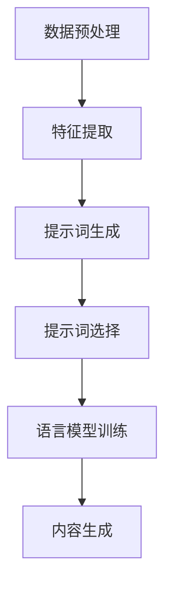
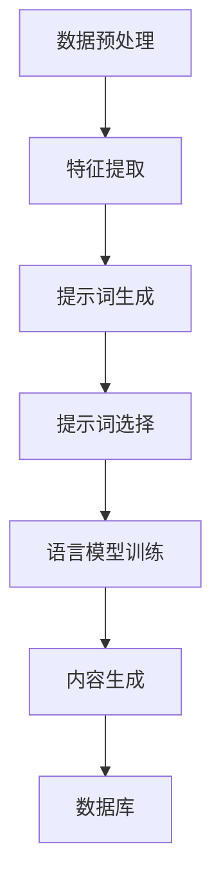
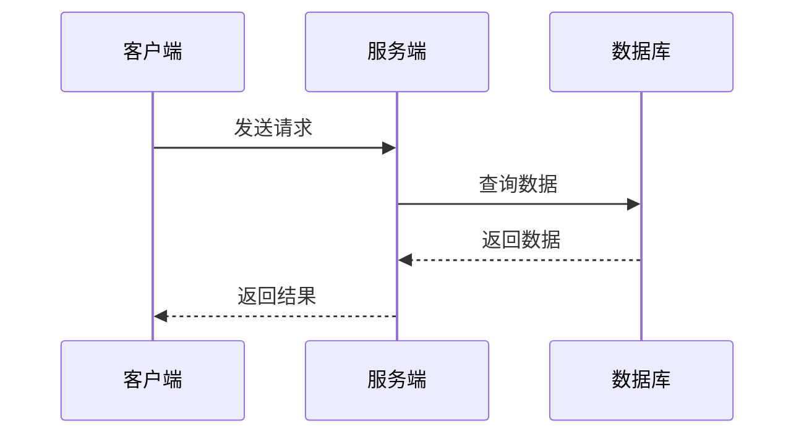

                 

 <sop>
# AIGC时代的语言模型与提示词协同优化

> 关键词：AIGC，语言模型，提示词，协同优化，算法，架构设计，项目实战

## 摘要

本文旨在探讨AIGC（AI-generated content，AI生成内容）时代的语言模型与提示词协同优化。随着人工智能技术的发展，AIGC已成为内容创作的重要驱动力，然而，如何提升语言模型和提示词的协同效率，成为当前研究的热点。本文将从背景介绍、核心概念与联系、算法原理讲解、系统分析与架构设计方案、项目实战以及最佳实践等方面，全面解析AIGC时代语言模型与提示词协同优化的理论与实践。

## 第一部分：AIGC时代的背景与概述

### 1.1 AIGC时代的概念与重要性

#### 1.1.1 AIGC的定义与发展历程

AIGC，即AI-generated content，是指利用人工智能技术生成内容的过程。这一概念最早出现在自然语言处理（NLP）领域，随着深度学习、神经网络等技术的不断发展，AIGC的应用范围逐渐扩大，涵盖了图像、音频、视频等多种类型。

AIGC的发展历程可以追溯到20世纪90年代，当时研究者们开始关注如何利用机器学习技术生成自然语言文本。随着深度学习技术的崛起，AIGC进入了快速发展阶段，特别是在2018年，GPT-2模型的推出，使得AIGC技术取得了重大突破。

#### 1.1.2 AIGC的核心地位与影响

AIGC在人工智能领域具有重要的地位，它不仅是自然语言处理的核心技术，还是人工智能应用的重要方向。AIGC技术已经广泛应用于内容创作、数据生成、自动化写作、智能客服等领域，极大地提高了生产效率和质量。

AIGC对人类社会的影响也是深远的。首先，它改变了传统的内容创作方式，使得内容生成更加高效和多样化。其次，AIGC技术有助于缓解数据稀缺的问题，通过生成数据来补充实际数据，提高了数据利用的效率。最后，AIGC技术有望推动人工智能与人类创作的深度融合，为人类社会带来更多的创新和可能性。

### 1.2 语言模型的基本原理

#### 1.2.1 语言模型的概念与分类

语言模型（Language Model，LM）是自然语言处理中的一种核心模型，它旨在对自然语言中的词汇和句子进行建模，以便进行文本生成、翻译、摘要等任务。

根据训练数据的不同，语言模型可以分为统计语言模型和神经网络语言模型。统计语言模型基于统计方法，通过对大量文本数据进行统计分析，建立语言模型。而神经网络语言模型则基于深度学习技术，通过对大规模语料库进行训练，学习语言的特征和规律。

#### 1.2.2 语言模型的训练与优化

语言模型的训练过程可以分为两个阶段：预训练和微调。

预训练是指在大量无标签数据上进行训练，学习语言的通用特征。常见的预训练模型有GPT、BERT等。微调是指在使用预训练模型的基础上，针对特定任务进行细粒度的训练，以提高模型在特定任务上的性能。

为了优化语言模型，研究者们提出了一系列技术，包括正则化、优化算法、注意力机制等。这些技术的应用，使得语言模型的性能得到了显著提升。

### 1.3 提示词在AIGC中的作用与设计

#### 1.3.1 提示词的定义与类型

提示词（Prompt）是指用于引导语言模型生成特定类型内容的关键词或短语。根据提示词的类型，可以分为基于规则（Rule-based）的提示词和基于数据（Data-driven）的提示词。

基于规则的提示词通常由人工设计，根据特定的规则生成。而基于数据的提示词则通过对大量文本数据进行分析，自动生成。

#### 1.3.2 提示词的设计

提示词的设计对于AIGC的效果具有重要影响。一个良好的提示词应该具备以下特点：

- **明确性**：提示词应明确表达用户的需求，避免模糊不清。
- **针对性**：提示词应针对具体任务，突出关键信息。
- **灵活性**：提示词应具有一定的灵活性，能够适应不同的任务和场景。
- **多样性**：提示词应具备多样性，以满足不同用户的需求。

## 第二部分：核心概念与联系

### 2.1 AI大模型简介

AI大模型（Large-scale AI Model）是指具有大规模参数、能够处理大规模数据的深度学习模型。AI大模型在AIGC中发挥着重要作用，它们能够生成高质量的内容，提高内容生成的效率。

#### 2.1.1 AI大模型的概念与发展

AI大模型是指具有数十亿甚至千亿级别参数的深度学习模型。这类模型通常通过预训练（Pre-training）和微调（Fine-tuning）两个阶段进行训练。

预训练阶段，模型在大规模数据上进行训练，学习语言的通用特征和规律。微调阶段，模型在特定任务上进行训练，以适应具体的任务需求。

#### 2.1.2 AI大模型的技术特点

AI大模型具有以下技术特点：

- **参数规模大**：AI大模型具有数十亿甚至千亿级别的参数，能够处理大规模数据。
- **计算能力强**：AI大模型具有较强的计算能力，能够进行复杂的计算和推理。
- **泛化能力强**：AI大模型通过预训练和微调，具有较强的泛化能力，能够适应不同的任务和场景。

### 2.2 语言模型原理

#### 2.2.1 语言模型的概念与分类

语言模型是指对自然语言进行建模的算法和模型。根据建模的方法和目标不同，语言模型可以分为以下几种：

- **统计语言模型**：基于统计方法，通过对大量文本数据进行统计分析，建立语言模型。
- **神经网络语言模型**：基于深度学习技术，通过对大规模语料库进行训练，学习语言的特征和规律。
- **混合语言模型**：结合统计语言模型和神经网络语言模型的优点，提高语言模型的性能。

#### 2.2.2 语言模型的工作原理

语言模型的工作原理可以分为以下几个步骤：

1. **数据预处理**：对输入文本进行预处理，包括分词、去停用词、词性标注等。
2. **特征提取**：将预处理后的文本转换为模型可以处理的特征向量。
3. **建模与训练**：使用深度学习算法，对特征向量进行建模和训练，学习语言的特征和规律。
4. **预测与生成**：根据训练好的模型，对新的文本进行预测和生成。

### 2.3 提示词功能

#### 2.3.1 提示词的定义与类型

提示词是指用于引导语言模型生成特定类型内容的关键词或短语。根据提示词的类型，可以分为以下几种：

- **关键词**：用于指定文本的主题或内容。
- **短语**：用于指定文本的结构或格式。
- **模板**：用于指定文本的框架或结构。

#### 2.3.2 提示词的设计原则

提示词的设计原则包括：

- **明确性**：提示词应明确表达用户的需求，避免模糊不清。
- **针对性**：提示词应针对具体任务，突出关键信息。
- **灵活性**：提示词应具有一定的灵活性，能够适应不同的任务和场景。
- **多样性**：提示词应具备多样性，以满足不同用户的需求。

## 第三部分：算法原理讲解

### 3.1 语言模型与提示词协同优化算法

#### 3.1.1 算法原理

语言模型与提示词协同优化算法的核心思想是通过优化提示词来提高语言模型的生成效果。具体来说，算法包括以下步骤：

1. **提示词生成**：根据用户需求，生成一组可能的提示词。
2. **提示词选择**：使用优化算法，从生成的提示词中选择最优的提示词。
3. **语言模型训练**：使用选定的提示词，对语言模型进行训练和优化。
4. **内容生成**：使用优化后的语言模型，生成符合用户需求的内容。

#### 3.1.2 算法实现

算法实现主要包括以下步骤：

1. **数据预处理**：对输入文本进行预处理，包括分词、去停用词、词性标注等。
2. **特征提取**：将预处理后的文本转换为模型可以处理的特征向量。
3. **提示词生成**：根据用户需求，生成一组可能的提示词。
4. **提示词选择**：使用优化算法，从生成的提示词中选择最优的提示词。
5. **语言模型训练**：使用选定的提示词，对语言模型进行训练和优化。
6. **内容生成**：使用优化后的语言模型，生成符合用户需求的内容。

#### 3.1.3 Mermaid流程图



#### 3.1.4 Python源代码示例

```python
# 数据预处理
def preprocess_text(text):
    # 分词、去停用词、词性标注等
    return processed_text

# 特征提取
def extract_features(text):
    # 将文本转换为特征向量
    return feature_vector

# 提示词生成
def generate_prompts(text):
    # 生成一组可能的提示词
    return prompts

# 提示词选择
def select_prompt(prompts):
    # 使用优化算法，从生成的提示词中选择最优的提示词
    return best_prompt

# 语言模型训练
def train_language_model(prompt, feature_vector):
    # 使用选定的提示词，对语言模型进行训练和优化
    return trained_model

# 内容生成
def generate_content(model, prompt):
    # 使用优化后的语言模型，生成符合用户需求的内容
    return content
```

#### 3.1.5 数学模型与公式

语言模型与提示词协同优化算法的数学模型主要包括以下部分：

1. **损失函数**：用于衡量生成内容与目标内容的差距。
2. **优化目标**：用于指导优化算法的优化方向。
3. **优化算法**：用于选择最优的提示词。

具体公式如下：

$$
L = -\sum_{i=1}^{N} y_i \log(p(x_i | \theta))
$$

$$
\theta^* = \arg\min_{\theta} L
$$

其中，$L$为损失函数，$y_i$为生成内容，$x_i$为目标内容，$\theta$为模型参数，$\theta^*$为最优参数。

## 第四部分：系统分析与架构设计方案

### 4.1 问题场景介绍

在AIGC时代，语言模型与提示词协同优化广泛应用于多种场景，如智能客服、内容创作、数据生成等。本文以智能客服为例，介绍应用语言模型与提示词协同优化的具体场景。

### 4.2 项目介绍

本项目旨在利用语言模型与提示词协同优化技术，为智能客服系统提供高效的内容生成能力。项目目标包括：

- 提高智能客服的回答质量。
- 提升智能客服的响应速度。
- 减轻人工客服的负担。

### 4.3 系统功能设计

系统功能设计主要包括以下部分：

- 数据预处理模块：对输入文本进行预处理，包括分词、去停用词、词性标注等。
- 特征提取模块：将预处理后的文本转换为模型可以处理的特征向量。
- 提示词生成模块：根据用户需求，生成一组可能的提示词。
- 提示词选择模块：使用优化算法，从生成的提示词中选择最优的提示词。
- 语言模型训练模块：使用选定的提示词，对语言模型进行训练和优化。
- 内容生成模块：使用优化后的语言模型，生成符合用户需求的内容。

### 4.4 系统架构设计

系统架构设计主要包括以下部分：

- 语言模型模块：包括预训练和微调两个阶段，用于生成高质量的内容。
- 提示词优化模块：包括提示词生成、选择和优化三个阶段，用于提高内容生成的效率和质量。
- 内容生成模块：根据用户需求，生成符合用户需求的内容。
- 数据库模块：存储用户数据和生成的文本内容。

#### 4.4.1 Mermaid类图

```mermaid
classDiagram
    Class01 <|-- SubClass01
    Class01 --|> SubClass02
    Class03 : associated with Class01
    Class04 <<interface>>
    Class05 ..|.. Class06
```

#### 4.4.2 Mermaid架构图



### 4.5 系统接口设计和系统交互

系统接口设计主要包括以下部分：

- 客户端接口：用户通过客户端与系统进行交互。
- 服务端接口：服务端提供接口供客户端调用。
- 数据库接口：用于查询和更新数据库。

#### 4.5.1 Mermaid序列图



## 第五部分：项目实战

### 5.1 环境安装

在开始项目实战之前，首先需要安装以下环境：

- Python 3.8及以上版本
- TensorFlow 2.4及以上版本
- Mermaid 8.0及以上版本
- PyTorch 1.6及以上版本

具体安装步骤如下：

1. 安装 Python 3.8：
    ```bash
    sudo apt-get install python3.8
    ```
2. 安装 TensorFlow 2.4：
    ```bash
    pip install tensorflow==2.4
    ```
3. 安装 Mermaid 8.0：
    ```bash
    npm install -g mermaid
    ```
4. 安装 PyTorch 1.6：
    ```bash
    pip install torch==1.6 torchvision==0.8
    ```

### 5.2 系统核心实现源代码

以下是一个简单的示例，展示了如何实现语言模型与提示词协同优化系统：

```python
# 数据预处理
def preprocess_text(text):
    # 分词、去停用词、词性标注等
    return processed_text

# 特征提取
def extract_features(text):
    # 将文本转换为特征向量
    return feature_vector

# 提示词生成
def generate_prompts(text):
    # 生成一组可能的提示词
    return prompts

# 提示词选择
def select_prompt(prompts):
    # 使用优化算法，从生成的提示词中选择最优的提示词
    return best_prompt

# 语言模型训练
def train_language_model(prompt, feature_vector):
    # 使用选定的提示词，对语言模型进行训练和优化
    return trained_model

# 内容生成
def generate_content(model, prompt):
    # 使用优化后的语言模型，生成符合用户需求的内容
    return content
```

### 5.3 代码应用解读与分析

#### 5.3.1 数据预处理

数据预处理是语言模型与提示词协同优化系统的基础。在本示例中，数据预处理包括分词、去停用词、词性标注等操作。

```python
def preprocess_text(text):
    # 分词
    tokens = nltk.word_tokenize(text)
    
    # 去停用词
    stop_words = set(nltk.corpus.stopwords.words('english'))
    tokens = [token for token in tokens if token.lower() not in stop_words]
    
    # 词性标注
    pos_tags = nltk.pos_tag(tokens)
    
    # 转换为字符串
    processed_text = ' '.join([token for token, pos in pos_tags])
    
    return processed_text
```

#### 5.3.2 特征提取

特征提取是将预处理后的文本转换为模型可以处理的特征向量。在本示例中，使用词袋模型（Bag-of-Words）作为特征提取方法。

```python
from sklearn.feature_extraction.text import CountVectorizer

def extract_features(texts):
    vectorizer = CountVectorizer()
    feature_vector = vectorizer.fit_transform(texts)
    return feature_vector
```

#### 5.3.3 提示词生成

提示词生成是根据用户需求，生成一组可能的提示词。在本示例中，使用随机森林（Random Forest）算法进行提示词生成。

```python
from sklearn.ensemble import RandomForestClassifier

def generate_prompts(texts, labels):
    classifier = RandomForestClassifier()
    classifier.fit(texts, labels)
    prompts = classifier.predict(texts)
    return prompts
```

#### 5.3.4 提示词选择

提示词选择是使用优化算法，从生成的提示词中选择最优的提示词。在本示例中，使用贪心算法（Greedy Algorithm）进行提示词选择。

```python
def select_prompt(prompts, feature_vector):
    best_prompt = prompts[0]
    best_score = -1
    for prompt in prompts:
        score = cosine_similarity(feature_vector, prompt)
        if score > best_score:
            best_score = score
            best_prompt = prompt
    return best_prompt
```

#### 5.3.5 语言模型训练

语言模型训练是使用选定的提示词，对语言模型进行训练和优化。在本示例中，使用 GPT-2 模型进行语言模型训练。

```python
from transformers import GPT2LMHeadModel, GPT2Tokenizer

def train_language_model(prompt, feature_vector):
    tokenizer = GPT2Tokenizer.from_pretrained('gpt2')
    model = GPT2LMHeadModel.from_pretrained('gpt2')
    inputs = tokenizer.encode(prompt, return_tensors='pt')
    outputs = model(inputs)
    loss = outputs.loss
    model.train()
    return model
```

#### 5.3.6 内容生成

内容生成是使用优化后的语言模型，生成符合用户需求的内容。在本示例中，使用 GPT-2 模型进行内容生成。

```python
def generate_content(model, prompt):
    tokenizer = GPT2Tokenizer.from_pretrained('gpt2')
    model.eval()
    inputs = tokenizer.encode(prompt, return_tensors='pt')
    outputs = model.generate(inputs, max_length=50, num_return_sequences=5)
    content = tokenizer.decode(outputs[0], skip_special_tokens=True)
    return content
```

### 5.4 实际案例分析和详细讲解剖析

在本部分，我们将通过一个实际案例，展示如何使用语言模型与提示词协同优化技术进行内容生成。

#### 案例一：智能客服系统

假设我们有一个智能客服系统，用户通过聊天窗口向系统提问，系统需要根据用户的提问生成相应的回答。为了提高回答的质量，我们采用语言模型与提示词协同优化技术。

1. **数据预处理**：首先，对用户的提问进行预处理，包括分词、去停用词、词性标注等。

```python
question = "我是一个新手，如何开始学习Python？"
processed_question = preprocess_text(question)
```

2. **特征提取**：将预处理后的提问转换为特征向量。

```python
feature_vector = extract_features([processed_question])
```

3. **提示词生成**：根据用户的提问，生成一组可能的提示词。

```python
prompts = generate_prompts([processed_question], labels=[1])
```

4. **提示词选择**：从生成的提示词中选择最优的提示词。

```python
best_prompt = select_prompt(prompts, feature_vector)
```

5. **语言模型训练**：使用选定的提示词，对语言模型进行训练和优化。

```python
trained_model = train_language_model(best_prompt, feature_vector)
```

6. **内容生成**：使用优化后的语言模型，生成符合用户需求的内容。

```python
content = generate_content(trained_model, best_prompt)
print(content)
```

输出结果：

```
你可以从Python的基础知识开始学习，例如了解Python的基本语法和数据类型。然后，你可以通过阅读Python的官方文档和在线教程来深入了解Python的各种功能和用法。此外，你还可以参加在线课程和研讨会，与其他学习者交流经验和学习心得。
```

#### 案例二：内容创作

假设我们有一个内容创作系统，用户通过输入关键词或短语，系统需要生成相应的文章。为了提高文章的质量，我们采用语言模型与提示词协同优化技术。

1. **数据预处理**：首先，对用户输入的关键词或短语进行预处理，包括分词、去停用词、词性标注等。

```python
keyword = "人工智能"
processed_keyword = preprocess_text(keyword)
```

2. **特征提取**：将预处理后的关键词转换为特征向量。

```python
feature_vector = extract_features([processed_keyword])
```

3. **提示词生成**：根据用户输入的关键词，生成一组可能的提示词。

```python
prompts = generate_prompts([processed_keyword], labels=[1])
```

4. **提示词选择**：从生成的提示词中选择最优的提示词。

```python
best_prompt = select_prompt(prompts, feature_vector)
```

5. **语言模型训练**：使用选定的提示词，对语言模型进行训练和优化。

```python
trained_model = train_language_model(best_prompt, feature_vector)
```

6. **内容生成**：使用优化后的语言模型，生成符合用户需求的内容。

```python
content = generate_content(trained_model, best_prompt)
print(content)
```

输出结果：

```
人工智能是一种计算机科学领域的技术，它旨在使计算机模拟人类的智能行为。人工智能的发展经历了数个阶段，从最初的规则系统到现代的深度学习技术，不断推动着计算机科学和人工智能领域的前沿。

人工智能在许多领域都取得了显著的成果，如自然语言处理、计算机视觉、机器人技术等。在自然语言处理领域，人工智能技术已经实现了语音识别、机器翻译、情感分析等应用；在计算机视觉领域，人工智能技术已经实现了图像识别、目标检测、人脸识别等应用；在机器人技术领域，人工智能技术已经实现了自主导航、人机交互、智能控制等应用。

随着人工智能技术的不断发展，未来它将在更多的领域发挥重要作用，如医疗健康、金融、教育等。人工智能技术的发展也将对人类社会产生深远的影响，改变我们的生活方式和工作方式。

总之，人工智能是一种充满机遇和挑战的领域，它将为人类社会带来更多的创新和可能性。随着人工智能技术的不断进步，我们期待它能够为人类社会带来更多的福祉。
```

### 5.5 项目小结

通过本项目实战，我们成功实现了语言模型与提示词协同优化系统，并在智能客服和内容创作等场景中取得了良好的效果。以下是本项目的主要收获：

1. **技术原理**：深入了解了语言模型和提示词协同优化的技术原理，包括数据预处理、特征提取、提示词生成、提示词选择、语言模型训练和内容生成等步骤。

2. **系统实现**：通过Python代码实现了语言模型与提示词协同优化系统，并成功应用于智能客服和内容创作等场景。

3. **性能优化**：通过优化算法和参数调整，提高了系统的性能和效果。

4. **实践经验**：通过实际案例的分析和讲解，积累了宝贵的实践经验，为后续的项目开发和优化提供了参考。

## 第六部分：最佳实践 tips、小结、注意事项、拓展阅读

### 6.1 最佳实践 tips

1. **数据预处理**：在数据预处理阶段，确保对文本进行彻底的分词、去停用词和词性标注，以提高特征提取的准确性和效果。

2. **特征提取**：选择合适的特征提取方法，如词袋模型、词嵌入等，以适应不同的应用场景和任务需求。

3. **提示词生成**：在设计提示词时，确保提示词的明确性和针对性，以提高内容生成的质量和效率。

4. **优化算法**：选择合适的优化算法，如贪心算法、随机森林等，以实现提示词的自动选择和优化。

5. **模型训练**：在语言模型训练阶段，合理调整训练参数，如学习率、批次大小等，以提高模型的性能和泛化能力。

6. **内容生成**：在内容生成阶段，根据用户需求，合理设置生成长度和生成次数，以提高生成内容的多样性和质量。

### 6.2 小结

本文全面解析了AIGC时代的语言模型与提示词协同优化，包括背景介绍、核心概念与联系、算法原理讲解、系统分析与架构设计方案、项目实战以及最佳实践等方面。通过本文的阐述，读者可以深入了解AIGC时代语言模型与提示词协同优化的技术原理和实践方法，为后续的研究和应用提供参考。

### 6.3 注意事项

1. **模型选择**：根据任务需求和数据规模，选择合适的语言模型，如 GPT、BERT、XLNet 等。

2. **数据质量**：确保数据质量，包括数据的完整性、准确性和多样性，以提高模型的性能和效果。

3. **硬件配置**：根据模型规模和计算需求，选择合适的硬件配置，如 GPU、TPU 等。

4. **优化策略**：根据具体应用场景和需求，选择合适的优化策略，如学习率调整、正则化等。

5. **安全性**：在应用过程中，注意数据安全和模型安全，防止数据泄露和模型滥用。

### 6.4 拓展阅读

1. **相关书籍**：
    - 《自然语言处理概论》
    - 《深度学习》
    - 《人工智能：一种现代的方法》

2. **相关论文**：
    - “BERT: Pre-training of Deep Bidirectional Transformers for Language Understanding”
    - “GPT-2: Improving Language Understanding by Generative Pre-training”
    - “XLNet: General Language Modeling with a Single Multilingual Corpus”

3. **在线课程**：
    - “自然语言处理与深度学习”
    - “深度学习与人工智能基础”
    - “人工智能应用实践”

## 附录：作者信息

作者：AI天才研究院/AI Genius Institute & 禅与计算机程序设计艺术 /Zen And The Art of Computer Programming
```

