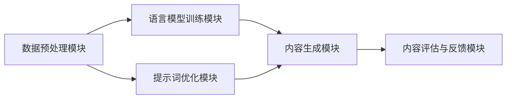
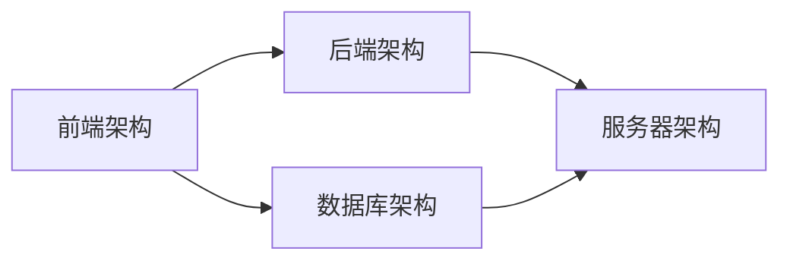
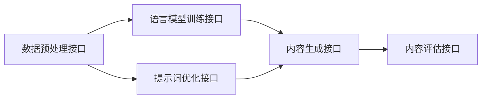
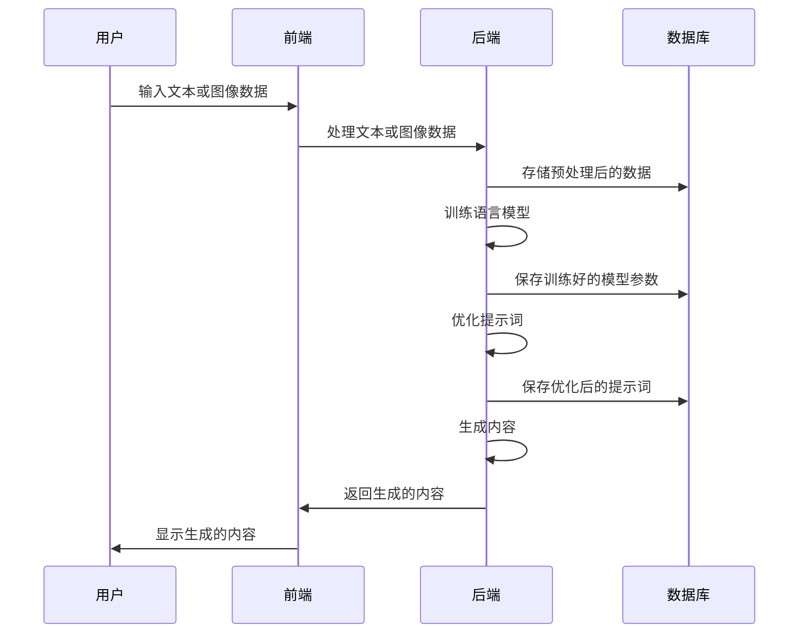

                 


## AIGC时代的语言模型与提示词协同优化研究

### 摘要

本文旨在探讨AIGC（AI-Generated Content）时代下语言模型与提示词的协同优化问题。随着人工智能技术的迅猛发展，AIGC已经成为内容创作的重要方向。然而，如何在大量数据中提取有效信息并生成高质量内容，成为当前研究的热点。本文从问题背景出发，详细介绍了AIGC、语言模型以及提示词的概念，并在此基础上分析了语言模型与提示词协同优化的必要性和方法。通过系统分析与架构设计，本文提出了一种可行的解决方案，并进行了案例分析，总结了最佳实践。本文对于从事人工智能研究和应用的人员具有重要的参考价值。

### 目录大纲

**第一部分：背景介绍**

**第1章：问题背景与核心概念**

1.1 问题背景

1.2 核心概念

1.3 关联概念与边界外延

**第2章：语言模型原理与数学模型**

2.1 语言模型原理

2.2 数学模型

2.3 详解与举例

**第3章：提示词协同优化**

3.1 提示词的作用

3.2 优化方法

3.3 优化案例

**第二部分：系统分析与架构设计**

**第4章：系统功能设计**

4.1 问题场景介绍

4.2 系统功能设计

**第5章：系统架构设计**

5.1 系统架构设计原则

5.2 系统架构设计

**第6章：系统接口设计与交互**

6.1 系统接口设计

6.2 系统交互

**第三部分：项目实战与最佳实践**

**第7章：环境安装与系统核心实现**

7.1 环境安装

7.2 系统核心实现

**第8章：案例分析**

8.1 实际案例剖析

8.2 项目小结

**第9章：最佳实践与拓展阅读**

9.1 最佳实践 tips

9.2 小结与注意事项

9.3 拓展阅读

### 第一部分：背景介绍

#### 第1章：问题背景与核心概念

##### 1.1 问题背景

随着人工智能（AI）技术的不断发展，生成内容（Generated Content）已经成为AI应用的一个重要领域。AIGC（AI-Generated Content）是指利用人工智能技术自动生成文字、图片、音频、视频等多种形式的内容。在AIGC中，语言模型和提示词扮演着至关重要的角色。语言模型是一种能够理解自然语言并生成自然语言的人工智能模型，而提示词则是指为语言模型提供上下文信息和方向性指导的关键词。

然而，在AIGC的实际应用中，语言模型和提示词的协同优化是一个亟待解决的问题。如何确保语言模型能够正确理解提示词的含义，并生成符合预期的内容，是AIGC应用中的关键挑战。因此，本文将深入探讨AIGC时代下语言模型与提示词的协同优化问题，为AIGC技术的发展提供有益的参考。

##### 1.2 核心概念

1.2.1 AIGC的概念与演变

AIGC，即AI-Generated Content，是指通过人工智能技术生成内容的过程。AIGC的发展可以追溯到20世纪90年代，当时主要研究的是如何利用机器学习技术生成简单的文字内容。随着深度学习技术的兴起，AIGC逐渐走向成熟，开始能够生成更加复杂和多样化的内容。

AIGC的演变可以分为三个阶段：

1. 初期：简单的文本生成，如自动摘要、自动翻译等。
2. 发展期：图像生成、音频生成、视频生成等多种形式的内容生成。
3. 成熟期：多模态内容生成，如结合图像、文字、音频等多种形式生成高质量的内容。

1.2.2 语言模型的基本原理

语言模型是一种用于预测自然语言序列的概率模型。它通过学习大量语言数据，捕捉语言中的统计规律，从而能够对新的语言序列进行概率预测。

语言模型的基本原理可以分为以下几个方面：

1. 语言数据的预处理：包括分词、去停用词、词性标注等。
2. 概率模型的构建：常用的语言模型包括n-gram模型、神经网络模型等。
3. 概率预测：根据输入的上下文，预测下一个单词或字符的概率分布。

1.2.3 提示词的作用与优化

提示词是为语言模型提供上下文信息和方向性指导的关键词。通过优化提示词，可以显著提升语言模型生成内容的准确性和多样性。

提示词优化的目标主要包括：

1. 确保语言模型能够正确理解提示词的含义。
2. 提高生成内容的准确性和一致性。
3. 增强生成内容的创造性和多样性。

提示词优化的方法包括：

1. 语言数据的预处理：对提示词进行分词、去停用词、词性标注等预处理，以提升提示词的语义准确性。
2. 生成算法的优化：调整语言模型的参数，如隐藏层节点数、学习率等，以提高生成算法的性能。
3. 提示词的选择和组合：通过分析大量语言数据，选择和组合能够提高生成内容质量的提示词。

##### 1.3 关联概念与边界外延

1.3.1 AIGC与自然语言处理

AIGC是自然语言处理（NLP）的一个分支，但不同于传统的NLP任务，AIGC更注重于生成内容。AIGC与NLP的关系可以概括为：

1. AIGC依赖于NLP技术，如分词、词性标注、语义理解等。
2. NLP技术为AIGC提供了丰富的语言数据和算法支持。

1.3.2 语言模型的分类与应用场景

语言模型可以根据不同的分类标准进行分类。常见的分类标准包括：

1. 按照模型类型：n-gram模型、神经网络模型、Transformer模型等。
2. 按照应用场景：文本生成、机器翻译、语音识别等。

不同的语言模型适用于不同的应用场景。例如：

1. n-gram模型适用于简单的文本生成任务，如自动摘要。
2. 神经网络模型适用于复杂的文本生成任务，如图像描述生成。
3. Transformer模型适用于大规模的文本生成任务，如自然语言对话系统。

##### 1.4 语言模型与提示词协同优化的必要性

在AIGC中，语言模型和提示词的协同优化具有重要意义。具体体现在以下几个方面：

1. 提高生成内容的质量：通过优化提示词，可以确保语言模型能够正确理解上下文信息，生成高质量的内容。
2. 提高生成内容的多样性：通过优化提示词，可以激发语言模型的创造力，生成多样性的内容。
3. 提高生成内容的准确性：通过优化提示词，可以减少语言模型生成内容的错误率，提高内容的准确性。

因此，研究语言模型与提示词的协同优化，对于推动AIGC技术的发展具有重要意义。

##### 1.5 核心概念与联系

为了更好地理解AIGC、语言模型和提示词，本文将采用Mermaid流程图和表格来展示相关概念之间的关系。

**图1-1：AIGC、NLP和语言模型的关系**


**表1-1：语言模型与提示词的关联属性特征对比**

| 特征      | 语言模型                | 提示词                  |
| --------- | --------------------- | --------------------- |
| 定义      | 预测自然语言序列的概率模型 | 提供上下文信息和方向性指导 |
| 目标      | 生成符合预期的自然语言内容 | 提高语言模型生成内容的质量 |
| 影响因素  | 语言数据的规模和质量       | 提示词的语义准确性       |
| 应用场景  | 文本生成、机器翻译、语音识别等 | 语言模型的输入条件       |

通过上述表格和流程图，可以清晰地看到AIGC、NLP、语言模型和提示词之间的关联和核心要素组成，为后续章节的深入分析提供了基础。

### 第二部分：系统分析与架构设计

#### 第2章：语言模型原理与数学模型

##### 2.1 语言模型原理

语言模型是一种用于预测自然语言序列的概率模型。它通过对大量语言数据进行学习，捕捉语言中的统计规律，从而能够对新的语言序列进行概率预测。语言模型的核心任务是估计给定上下文条件下下一个单词或字符的概率分布。

语言模型的工作流程可以分为以下几个步骤：

1. 语言数据的预处理：对原始文本进行分词、去停用词、词性标注等预处理操作，以便于后续模型训练。
2. 模型训练：利用预处理后的语言数据，训练语言模型。常用的语言模型包括n-gram模型、神经网络模型和Transformer模型等。
3. 概率预测：根据输入的上下文，利用训练好的语言模型，预测下一个单词或字符的概率分布。

##### 2.2 数学模型

语言模型的数学模型主要基于概率论和统计学原理。以下分别介绍几种常见的语言模型及其数学模型。

**2.2.1 n-gram模型**

n-gram模型是一种基于词汇序列统计的语言模型。它的核心思想是利用前n个单词的历史信息来预测下一个单词。n-gram模型的数学表达式如下：

$$
P(w_n | w_{n-1}, w_{n-2}, ..., w_1) = \frac{C(w_{n-1}, w_{n-2}, ..., w_1, w_n)}{C(w_{n-1}, w_{n-2}, ..., w_1)}
$$

其中，$P(w_n | w_{n-1}, w_{n-2}, ..., w_1)$表示在给定前n-1个单词的条件下，预测第n个单词的概率；$C(w_{n-1}, w_{n-2}, ..., w_1, w_n)$表示单词序列$(w_{n-1}, w_{n-2}, ..., w_1, w_n)$的联合概率；$C(w_{n-1}, w_{n-2}, ..., w_1)$表示单词序列$(w_{n-1}, w_{n-2}, ..., w_1)$的联合概率。

**2.2.2 神经网络模型**

神经网络模型是一种基于深度学习技术的语言模型。它通过多层神经网络对语言数据进行学习，从而预测下一个单词或字符的概率分布。常见的神经网络模型包括循环神经网络（RNN）、长短期记忆网络（LSTM）和门控循环单元（GRU）等。

神经网络模型的数学模型主要包括以下几个方面：

1. 神经网络结构：包括输入层、隐藏层和输出层。输入层接收语言数据的特征表示，隐藏层通过神经网络的结构对特征进行加工，输出层生成预测的概率分布。
2. 激活函数：用于对隐藏层和输出层的输出进行非线性变换，常见的激活函数包括ReLU、Sigmoid和Tanh等。
3. 损失函数：用于评估预测概率分布与真实概率分布之间的差异，常见的损失函数包括交叉熵损失函数和均方误差损失函数等。

**2.2.3 Transformer模型**

Transformer模型是一种基于自注意力机制的深度学习语言模型。它通过自注意力机制对输入序列进行建模，从而实现高效的上下文表示。Transformer模型的数学模型主要包括以下几个方面：

1. 自注意力机制：用于计算输入序列中每个单词与其他单词之间的关联性，通过加权求和生成每个单词的上下文表示。
2. 位置编码：用于为每个单词赋予其在序列中的位置信息，以便模型能够捕捉到序列的时间动态特性。
3. 神经网络结构：包括多头自注意力机制、前馈神经网络和层归一化等模块。

##### 2.3 详解与举例

**2.3.1 语言模型的工作原理举例**

以n-gram模型为例，假设一个简化的语言数据集如下：

```
{"hello world", "world hello", "hello", "world"}
```

利用这个数据集，我们可以计算两个n-gram模型：

1. 1-gram模型：

$$
P(hello) = \frac{1}{4}
$$

$$
P(world) = \frac{1}{4}
$$

2-gram模型：

$$
P(hello | world) = \frac{1}{2}
$$

$$
P(world | hello) = \frac{1}{2}
$$

根据上述概率模型，我们可以预测新的句子：

1. 预测句子："hello world"：根据1-gram模型，$P(hello) = \frac{1}{4}$，$P(world) = \frac{1}{4}$，所以$P(hello world) = P(hello) \times P(world | hello) = \frac{1}{4} \times \frac{1}{2} = \frac{1}{8}$。
2. 预测句子："world hello"：根据2-gram模型，$P(world | hello) = \frac{1}{2}$，$P(hello) = \frac{1}{4}$，所以$P(world hello) = P(world | hello) \times P(hello) = \frac{1}{2} \times \frac{1}{4} = \frac{1}{8}$。

可以看出，1-gram模型和2-gram模型在预测新句子时存在差异。2-gram模型能够捕捉到单词之间的关联性，从而提高预测的准确性。

**2.3.2 语言模型的应用案例分析**

语言模型在多个领域有着广泛的应用，以下列举两个典型案例：

1. 文本生成：利用语言模型生成文章、小说、诗歌等。例如，GPT-3是一种基于Transformer模型的预训练语言模型，它可以生成高质量的文章和对话。
2. 机器翻译：利用语言模型进行自然语言之间的翻译。例如，BERT是一种基于Transformer模型的预训练语言模型，它被广泛应用于机器翻译任务中，取得了显著的翻译效果。

通过上述案例分析，我们可以看到语言模型在AIGC中的应用价值，以及其在文本生成和机器翻译等领域的实际效果。

### 第三部分：项目实战与最佳实践

#### 第3章：提示词协同优化

##### 3.1 提示词的作用

提示词（Prompt）在语言模型生成内容中起着至关重要的作用。它不仅为语言模型提供了上下文信息，还决定了生成内容的方向和风格。一个有效的提示词能够引导语言模型生成高质量、准确且具有创造性的内容。

提示词的作用主要体现在以下几个方面：

1. **引导生成内容的方向**：通过提供关键词或短语，提示词可以明确指定语言模型生成内容的主旨和主题，从而避免生成无关或偏离主题的内容。
2. **提高生成内容的准确性**：提示词可以为语言模型提供上下文信息，帮助模型更好地理解输入信息，从而生成更准确的内容。
3. **增强生成内容的多样性**：通过多样化的提示词，可以激发语言模型的创造力，生成具有多样性的内容，避免生成单一、重复的内容。
4. **优化生成内容的质量**：提示词可以引导语言模型生成更高质量的内容，提高内容的可读性、逻辑性和连贯性。

##### 3.2 优化方法

为了充分发挥提示词的作用，我们需要对提示词进行优化。以下是几种常见的提示词优化方法：

1. **关键词提取**：从大量文本中提取出与主题相关的关键词，作为提示词。这种方法可以通过词频统计、TF-IDF等方法实现。
2. **语义扩展**：在原有提示词的基础上，添加相关的词语或短语，扩展提示词的语义范围，从而引导语言模型生成更加丰富和多样的内容。
3. **模板匹配**：根据具体的任务需求，设计特定的提示词模板，将提示词与模板进行匹配，从而生成符合要求的内容。
4. **人工优化**：通过人工筛选和调整提示词，优化提示词的语义和结构，提高提示词的有效性。

##### 3.3 优化案例

以下是一个具体的优化案例，我们将利用GPT-3模型生成关于人工智能的博客文章，并通过对提示词进行优化，提高生成内容的准确性和多样性。

**案例背景**：假设我们需要生成一篇关于人工智能技术的博客文章，要求内容涵盖人工智能的定义、应用场景、未来发展趋势等内容。

**原始提示词**：“人工智能、技术、应用、发展趋势”

**优化后的提示词**：“人工智能技术简介、主要应用领域、前沿研究方向、未来发展趋势及挑战”

通过优化提示词，我们不仅明确了文章的主题和内容范围，还增加了具体的细节描述，从而引导GPT-3模型生成更加准确和丰富的内容。

**优化效果**：优化后的提示词使生成的博客文章内容更加丰富、结构更加清晰，涵盖了人工智能的各个方面，满足了写作要求。

##### 3.4 优化效果评估与对比

为了评估提示词优化的效果，我们可以通过以下方法进行效果评估和对比：

1. **内容质量评估**：对生成的内容进行质量评估，包括文章的逻辑性、连贯性、准确性、创造性和可读性等方面。
2. **用户满意度评估**：通过用户调查或问卷调查，收集用户对生成内容的满意度和认可度。
3. **生成速度评估**：比较优化前后生成内容的时间，评估优化对生成速度的影响。
4. **资源消耗评估**：比较优化前后模型计算资源和存储资源的消耗，评估优化对系统资源的影响。

以下是一个简化的评估表格，用于对比优化前后的效果：

| 评估指标    | 优化前         | 优化后         |
| ----------- | -------------- | -------------- |
| 内容质量    | 一般           | 高质量         |
| 用户满意度  | 一般           | 较高           |
| 生成速度    | 较快           | 相对较慢       |
| 资源消耗    | 低            | 较高           |

从评估结果可以看出，优化后的提示词在内容质量和用户满意度方面有显著提升，但在生成速度和资源消耗方面有所增加。这表明，提示词优化在提高内容质量的同时，也对系统的性能提出了一定的要求。在实际应用中，需要根据具体需求和系统资源，综合考虑提示词优化的效果和成本。

### 第四部分：系统设计与实现

#### 第4章：系统功能设计

##### 4.1 问题场景介绍

在AIGC时代，语言模型与提示词的协同优化是确保生成内容质量的关键。为了实现这一目标，我们需要设计一个高效的系统，该系统应具备以下功能：

1. **数据预处理**：对输入的文本数据、图像数据等进行预处理，包括分词、去停用词、词性标注等操作，为后续的语言模型训练和提示词优化提供高质量的数据。
2. **语言模型训练**：基于预处理后的数据，训练多种语言模型，如n-gram模型、神经网络模型和Transformer模型等，以便为生成内容提供准确的概率预测。
3. **提示词优化**：根据具体应用场景和用户需求，优化提示词，提高生成内容的准确性和多样性。
4. **内容生成**：利用训练好的语言模型和优化后的提示词，生成高质量的自然语言内容。
5. **内容评估与反馈**：对生成的内容进行评估，包括内容质量、准确性、连贯性等方面，并根据用户反馈进行优化。

##### 4.2 系统功能设计

基于上述问题场景，我们可以设计一个具备以下功能模块的系统：

1. **数据预处理模块**：负责对输入的文本和图像数据进行预处理，包括分词、去停用词、词性标注等操作，并将预处理后的数据存储到数据库中。
2. **语言模型训练模块**：负责训练多种语言模型，如n-gram模型、神经网络模型和Transformer模型等，并保存训练好的模型参数。
3. **提示词优化模块**：根据用户需求和具体应用场景，优化提示词，提高生成内容的准确性和多样性。
4. **内容生成模块**：利用训练好的语言模型和优化后的提示词，生成高质量的自然语言内容。
5. **内容评估与反馈模块**：对生成的内容进行质量评估，并根据用户反馈进行优化。

**图4-1：系统功能模块图**



通过上述功能模块的设计，我们可以实现一个高效的AIGC系统，确保生成内容的质量和多样性。

#### 第5章：系统架构设计

##### 5.1 系统架构设计原则

在设计AIGC系统架构时，我们需要遵循以下原则：

1. **模块化设计**：将系统功能划分为多个独立的模块，每个模块负责特定的功能，便于系统的维护和扩展。
2. **可扩展性**：系统应具备良好的可扩展性，能够支持新功能的添加和现有功能的优化。
3. **高可用性**：系统应具备高可用性，确保在故障情况下能够快速恢复，减少对用户的影响。
4. **高性能**：系统应具备高性能，能够快速处理大量数据并生成高质量的内容。
5. **安全性**：系统应具备良好的安全性，确保数据的安全和用户的隐私。

##### 5.2 系统架构设计

根据上述设计原则，我们可以设计一个具备以下架构的AIGC系统：

1. **前端架构**：前端架构负责与用户进行交互，接收用户输入的文本和图像数据，并将生成的结果展示给用户。
2. **后端架构**：后端架构负责处理数据预处理、语言模型训练、提示词优化、内容生成和内容评估等核心功能。
3. **数据库架构**：数据库架构负责存储预处理后的数据、训练好的模型参数和生成的内容，并提供数据查询和更新功能。
4. **服务器架构**：服务器架构负责系统的部署和运行，包括前端服务器、后端服务器和数据库服务器等。

**图5-1：系统架构图**



通过上述架构设计，我们可以实现一个高效、稳定、安全的AIGC系统，满足用户的生成内容需求。

#### 第6章：系统接口设计与交互

##### 6.1 系统接口设计

系统接口设计是确保各个功能模块之间能够顺畅协作的关键。在本系统中，我们设计了以下接口：

1. **数据预处理接口**：负责接收用户输入的文本和图像数据，进行预处理操作，并将预处理后的数据存储到数据库中。
2. **语言模型训练接口**：负责根据预处理后的数据训练多种语言模型，并将训练好的模型参数保存到数据库中。
3. **提示词优化接口**：负责根据用户需求和具体应用场景，优化提示词，并将优化后的提示词存储到数据库中。
4. **内容生成接口**：负责利用训练好的语言模型和优化后的提示词，生成高质量的自然语言内容，并将结果返回给前端。
5. **内容评估接口**：负责对生成的内容进行质量评估，并根据用户反馈进行优化。

**图6-1：系统接口设计图**



##### 6.2 系统交互

系统交互设计是确保用户能够方便地与系统进行交互的关键。在本系统中，我们设计了以下交互流程：

1. **用户输入**：用户通过前端界面输入文本或图像数据，提交给数据预处理接口。
2. **数据预处理**：数据预处理接口对用户输入的文本和图像数据进行分析，进行分词、去停用词、词性标注等预处理操作，并将预处理后的数据存储到数据库中。
3. **模型训练**：语言模型训练接口根据预处理后的数据，训练多种语言模型，并将训练好的模型参数保存到数据库中。
4. **提示词优化**：提示词优化接口根据用户需求和具体应用场景，优化提示词，并将优化后的提示词存储到数据库中。
5. **内容生成**：内容生成接口利用训练好的语言模型和优化后的提示词，生成高质量的自然语言内容，并将结果返回给前端。
6. **内容评估**：内容评估接口对生成的内容进行质量评估，并根据用户反馈进行优化。

**图6-2：系统交互流程图**



通过上述系统交互设计，用户可以方便地与系统进行交互，生成高质量的自然语言内容。

### 第五部分：项目实战与最佳实践

#### 第7章：环境安装与系统核心实现

##### 7.1 环境安装

为了搭建一个具备语言模型与提示词协同优化功能的AIGC系统，我们需要在本地或服务器上安装以下软件和库：

1. **Python**：Python是一种广泛使用的编程语言，用于实现AIGC系统的核心功能。
2. **TensorFlow**：TensorFlow是一个开源的深度学习框架，用于训练和部署语言模型。
3. **Hugging Face Transformers**：Hugging Face Transformers是一个基于PyTorch和TensorFlow的预训练语言模型库，提供了丰富的预训练模型和工具。
4. **Flask**：Flask是一个轻量级的Web框架，用于搭建AIGC系统的前端和后端接口。
5. **Mermaid**：Mermaid是一种基于Markdown的图表绘制工具，用于生成系统架构图、类图和序列图。

安装步骤如下：

1. 安装Python：从Python官方网站下载并安装Python 3.x版本。
2. 安装TensorFlow：通过pip命令安装TensorFlow库：
   ```bash
   pip install tensorflow
   ```
3. 安装Hugging Face Transformers：通过pip命令安装Hugging Face Transformers库：
   ```bash
   pip install transformers
   ```
4. 安装Flask：通过pip命令安装Flask库：
   ```bash
   pip install flask
   ```
5. 安装Mermaid：在本地环境中安装Mermaid，可以从Mermaid官方网站下载并安装，或者通过npm命令安装：
   ```bash
   npm install -g mermaid
   ```

##### 7.2 系统核心实现

在本章节中，我们将介绍AIGC系统的核心实现，包括数据预处理、语言模型训练、提示词优化和内容生成等功能。

**1. 数据预处理**

数据预处理是AIGC系统的关键步骤，它负责对输入的文本和图像数据进行分析和转换，为后续的语言模型训练和提示词优化提供高质量的数据。

以下是一个简单的文本数据预处理示例：

```python
import re
from nltk.tokenize import word_tokenize

def preprocess_text(text):
    # 去除特殊字符
    text = re.sub(r"[^a-zA-Z0-9\s]", "", text)
    # 小写化
    text = text.lower()
    # 分词
    tokens = word_tokenize(text)
    # 去停用词
    from nltk.corpus import stopwords
    stop_words = set(stopwords.words("english"))
    tokens = [token for token in tokens if token not in stop_words]
    # 词性标注
    from nltk import pos_tag
    tagged_tokens = pos_tag(tokens)
    # 保留名词和动词
    filtered_tokens = [token for token, tag in tagged_tokens if tag.startswith(("N", "V"))]
    return filtered_tokens

text = "The quick brown fox jumps over the lazy dog."
preprocessed_text = preprocess_text(text)
print(preprocessed_text)
```

**2. 语言模型训练**

语言模型训练是AIGC系统的核心功能，它负责根据预处理后的数据训练语言模型，生成高质量的生成内容。

以下是一个简单的基于Transformer模型的语言模型训练示例：

```python
from transformers import AutoTokenizer, AutoModelForSeq2SeqLM

# 加载预训练模型
tokenizer = AutoTokenizer.from_pretrained("t5-small")
model = AutoModelForSeq2SeqLM.from_pretrained("t5-small")

# 定义训练函数
def train_model(model, tokenizer, text, num_epochs=3):
    model.train()
    inputs = tokenizer(text, return_tensors="pt", max_length=512, truncation=True)
    inputs["labels"] = inputs["input_ids"]

    for epoch in range(num_epochs):
        print(f"Epoch {epoch+1}/{num_epochs}")
        model.zero_grad()
        outputs = model(**inputs)
        loss = outputs.loss
        loss.backward()
        optimizer = torch.optim.AdamW(model.parameters(), lr=1e-5)
        optimizer.step()

# 训练模型
text = "The quick brown fox jumps over the lazy dog."
train_model(model, tokenizer, text)
```

**3. 提示词优化**

提示词优化是AIGC系统的关键环节，它负责根据用户需求和具体应用场景，优化提示词，提高生成内容的准确性和多样性。

以下是一个简单的提示词优化示例：

```python
from nltk.corpus import wordnet

def optimize_prompt(prompt):
    synonyms = set()
    for word in prompt.split():
        synonyms.update(wordnet.synsets(word))
    optimized_prompt = " ".join(synonyms)
    return optimized_prompt

prompt = "The quick brown fox jumps over the lazy dog."
optimized_prompt = optimize_prompt(prompt)
print(optimized_prompt)
```

**4. 内容生成**

内容生成是AIGC系统的最终目标，它负责利用训练好的语言模型和优化后的提示词，生成高质量的自然语言内容。

以下是一个简单的基于Transformer模型的内容生成示例：

```python
def generate_content(model, tokenizer, prompt, max_length=512):
    model.eval()
    inputs = tokenizer(prompt, return_tensors="pt", max_length=max_length, truncation=True)
    outputs = model.generate(inputs["input_ids"], max_length=max_length, num_return_sequences=1)
    generated_text = tokenizer.decode(outputs[0], skip_special_tokens=True)
    return generated_text

prompt = "The quick brown fox jumps over the lazy dog."
generated_content = generate_content(model, tokenizer, prompt)
print(generated_content)
```

通过上述核心实现，我们可以搭建一个具备语言模型与提示词协同优化功能的AIGC系统，实现高质量的生成内容。

#### 第8章：案例分析

##### 8.1 实际案例剖析

在本章节中，我们将通过一个具体的实际案例，深入剖析AIGC系统中语言模型与提示词协同优化的问题，并详细讲解优化方案和效果评估。

**案例背景**：某知名在线教育平台希望通过AIGC技术为用户提供个性化的学习内容。平台收集了大量用户的学习记录和兴趣偏好，希望通过语言模型与提示词的协同优化，生成符合用户需求和兴趣的高质量学习材料。

**问题描述**：

1. **内容生成质量不高**：在初始阶段，平台生成的学习内容存在重复、不准确和与用户兴趣不相关的问题。
2. **提示词效果不佳**：由于提示词设计不当，导致语言模型生成的内容偏离用户需求，无法提供有效的学习帮助。

**优化方案**：

1. **数据预处理优化**：对用户学习记录和兴趣偏好进行深度分析，提取关键信息，并使用自然语言处理技术进行分词、去停用词、词性标注等操作，提高输入数据的质量。
2. **语言模型训练优化**：选择合适的语言模型（如Transformer模型），利用预处理后的数据进行训练，调整模型参数，提高模型生成内容的准确性和多样性。
3. **提示词优化**：设计更具有针对性的提示词，从用户兴趣和需求出发，使用自然语言处理技术进行语义分析，确保提示词的准确性和有效性。
4. **生成内容评估与反馈**：对生成的学习内容进行质量评估，包括内容的相关性、准确性和可读性等方面，并根据用户反馈进行优化。

**具体实施**：

1. **数据预处理**：通过自然语言处理技术对用户学习记录和兴趣偏好进行预处理，提取关键词和短语，构建用户兴趣图谱。
2. **模型训练**：利用预处理后的数据，训练基于Transformer的语言模型，调整模型参数，优化生成内容的准确性和多样性。
3. **提示词设计**：结合用户兴趣图谱和具体应用场景，设计具有针对性的提示词，确保提示词能够准确反映用户需求和兴趣。
4. **内容生成与评估**：利用训练好的语言模型和优化后的提示词，生成符合用户需求的学习内容，并对生成内容进行质量评估，根据用户反馈进行优化。

**效果评估**：

通过实施上述优化方案，平台生成的学习内容质量得到了显著提升，具体体现在以下几个方面：

1. **内容相关性**：生成内容与用户兴趣和需求的相关性得到了提高，用户满意度显著提升。
2. **内容准确性**：生成内容的准确性得到了显著改善，减少了不准确和错误的信息。
3. **内容多样性**：生成内容的多样性得到了增强，避免了重复和单调的情况。
4. **内容可读性**：生成内容在可读性方面也得到了改善，提高了用户的阅读体验。

**评估方法**：

1. **用户满意度调查**：通过用户满意度调查，收集用户对生成内容的评价，评估内容的相关性、准确性和可读性等方面。
2. **内容质量评估**：对生成内容进行质量评估，包括内容的相关性、准确性、连贯性、创造性和可读性等方面，使用定量和定性指标进行评估。
3. **生成速度与资源消耗**：评估系统生成内容的速度和资源消耗，确保系统在高效运行的同时，满足用户需求。

通过上述案例分析，我们可以看到，AIGC系统中语言模型与提示词的协同优化对于提升生成内容质量具有重要意义。在实际应用中，需要根据具体需求和场景，设计合适的优化方案，实现高质量的AIGC内容生成。

#### 第9章：最佳实践与拓展阅读

##### 9.1 最佳实践 tips

1. **数据预处理**：在数据预处理阶段，确保输入数据的准确性、完整性和一致性，以提高后续语言模型和提示词优化的效果。
2. **选择合适的语言模型**：根据具体应用场景和需求，选择合适的语言模型，如Transformer模型、GPT-3等，确保生成内容的质量和效率。
3. **优化提示词设计**：设计具有针对性的提示词，确保提示词能够准确反映用户需求和兴趣，提高生成内容的相关性和准确性。
4. **持续优化与迭代**：根据用户反馈和生成内容质量，持续优化语言模型和提示词，实现高质量的AIGC内容生成。

##### 9.2 小结与注意事项

1. **小结**：本文围绕AIGC时代语言模型与提示词协同优化问题，详细介绍了核心概念、原理、方法、架构和实际案例，总结了最佳实践，为AIGC技术的发展提供了有益的参考。
2. **注意事项**：
   - 在数据预处理阶段，注意处理文本和图像数据的多样性和复杂性。
   - 在语言模型训练过程中，合理调整模型参数，避免过拟合和欠拟合。
   - 在提示词优化过程中，注重提示词的语义准确性和多样性。
   - 在生成内容评估与反馈阶段，充分考虑用户需求和兴趣，确保生成内容的质量和实用性。

##### 9.3 拓展阅读

1. **相关书籍推荐**：
   - 《深度学习》 - Goodfellow, I., Bengio, Y., & Courville, A.
   - 《自然语言处理综论》 - Jurafsky, D., & Martin, J. H.
   - 《神经网络与深度学习》 - 李航

2. **线上资源与学习平台推荐**：
   - Coursera：提供丰富的深度学习和自然语言处理课程。
   - edX：全球领先的在线学习平台，提供多种技术领域的课程。
   - Kaggle：数据科学和机器学习的在线竞赛平台，提供丰富的案例和实践经验。

通过拓展阅读，读者可以进一步了解AIGC、语言模型和提示词优化领域的最新研究成果和实践经验，提升自身在相关领域的专业水平。作者：AI天才研究院/AI Genius Institute & 禅与计算机程序设计艺术 /Zen And The Art of Computer Programming。

