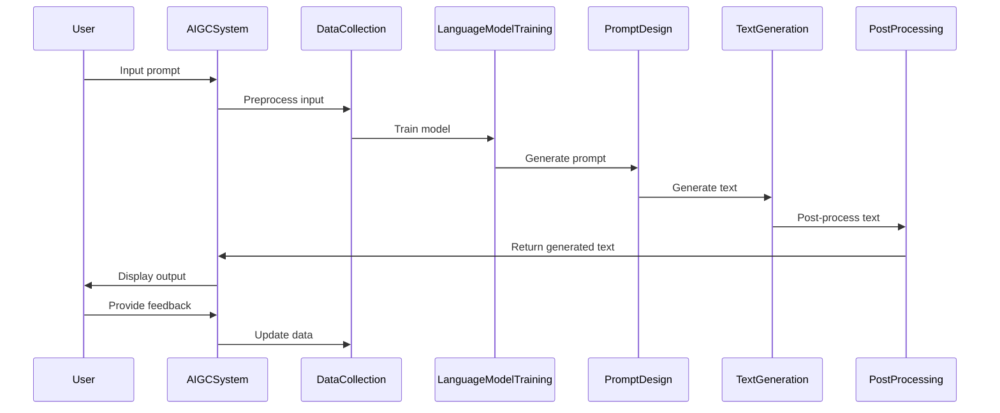

                 

### Introduction: AIGC Era's Language Model and Prompt Design: Challenges and Opportunities Analysis

> 关键词：AIGC、语言模型、提示词设计、挑战、机遇

> 摘要：本文深入探讨了AIGC时代语言模型和提示词设计的现状、面临的挑战及潜在机遇。通过对核心概念的解析，分析语言模型的原理和提示词设计的艺术，本文旨在为读者提供对这一领域全面而深刻的理解。

### Background

The AIGC (Artificial Intelligence, Generative AI, and Generative Content) era represents a significant evolution in the landscape of artificial intelligence. At its core, AIGC leverages generative AI models to autonomously generate content, transforming the way we interact with technology. This era is marked by the rise of sophisticated language models, such as GPT, BERT, and T5, which have fundamentally changed the field of natural language processing (NLP).

Language models are essentially algorithms designed to understand and generate human-like text. They are trained on vast amounts of text data, learning patterns, grammar, and semantics to produce coherent and contextually relevant text. These models have found applications in various domains, including content generation, chatbots, translation, and more.

Prompt design, on the other hand, is the art of crafting effective inputs to these models to achieve desired outputs. A well-designed prompt can guide the model to generate highly relevant and coherent responses, making it an essential skill for AI practitioners.

### Challenges

However, the AIGC era also brings forth numerous challenges that need to be addressed:

#### Data Privacy and Security

One of the primary challenges in language model design and prompt engineering is data privacy and security. The vast amount of data required to train these models raises significant concerns about the protection of sensitive information. Ensuring the privacy and security of this data is crucial to prevent unauthorized access and misuse.

#### Bias and Fairness

Language models can inadvertently learn and propagate biases present in their training data, leading to unfair or discriminatory outcomes. For example, a model trained on biased text data might generate biased responses or perpetuate stereotypes. Mitigating these biases is an ongoing challenge that requires careful consideration and ethical responsibility.

#### Quality and Coherence

Designing prompts that elicit high-quality, coherent, and contextually relevant responses is a complex task. Ensuring consistency and quality across various applications is challenging. The model's ability to generate coherent text depends not only on the quality of the prompt but also on its understanding of the context and the task at hand.

#### Scalability and Performance

As models become more complex, ensuring their efficient deployment and operation at scale becomes a significant technical challenge. The need to balance performance with scalability requires careful architecture and optimization strategies.

### Opportunities

Despite the challenges, the AIGC era also presents tremendous opportunities:

#### Automation

Language models can automate a wide range of tasks, from content creation to customer service, saving time and resources. This automation has the potential to transform industries and improve efficiency in various sectors.

#### Personalization

Advanced language models and prompt design techniques enable personalized interactions with users, tailored to their individual preferences and needs. This level of personalization can enhance user experience and drive customer engagement.

#### Creativity and Innovation

The AIGC era opens up new avenues for creativity and innovation. Language models can assist in generating original content, ideas, and solutions, fostering new forms of artistic expression and scientific discovery.

### Conclusion

In conclusion, the AIGC era marks a significant milestone in the evolution of artificial intelligence, with language models and prompt design playing pivotal roles. While challenges such as data privacy, bias, and scalability need to be addressed, the potential opportunities for automation, personalization, and innovation are vast. As AI practitioners and researchers, it is our responsibility to navigate these challenges and harness the power of AIGC to create a more intelligent and efficient future. Let's think step by step, analyze the core concepts, and explore the possibilities that lie ahead in this transformative era.

## The Fundamentals of Language Models in AIGC

### Core Concepts

Language models are the cornerstone of the AIGC era, enabling machines to understand and generate human-like text. At their core, these models are based on deep learning techniques, particularly neural networks, which allow them to learn from large amounts of text data. The fundamental concept of a language model is to predict the next word or sequence of words in a given text context.

To understand how language models work, it is essential to delve into some core concepts such as embeddings, attention mechanisms, and transformers. Embeddings convert words or sentences into dense vectors that capture their semantic meaning. The attention mechanism allows models to focus on different parts of the input sequence when predicting the next word. Transformers, a revolutionary architecture introduced by Vaswani et al. (2017), have become the de facto standard for building powerful language models due to their ability to handle long-range dependencies and parallel processing.

### Data Privacy and Security

One of the primary challenges in language model design and prompt engineering is data privacy and security. The vast amount of data required to train these models raises significant concerns about the protection of sensitive information. Ensuring the privacy and security of this data is crucial to prevent unauthorized access and misuse.

To address these concerns, several strategies can be employed:

1. **Data Anonymization**: Sensitive information can be anonymized or replaced with synthetic data to protect the privacy of individuals. Techniques such as differential privacy and federated learning can also be used to train models while minimizing the risk of data breaches.

2. **Encryption**: Data transmitted between training servers and models should be encrypted to prevent interception and unauthorized access. Secure communication protocols, such as TLS, can be used to ensure the confidentiality and integrity of data.

3. **Access Controls**: Implementing robust access controls and authentication mechanisms can help restrict access to sensitive data to only authorized personnel. This can include multi-factor authentication and role-based access control (RBAC).

4. **Regular Audits**: Conducting regular audits and security assessments can help identify and mitigate potential vulnerabilities in data storage and processing systems. This can include penetration testing, code reviews, and compliance checks.

### Bias and Fairness

Bias and fairness are significant concerns in language model design and prompt engineering. Language models can inadvertently learn and propagate biases present in their training data, leading to unfair or discriminatory outcomes. For example, a model trained on biased text data might generate biased responses or perpetuate stereotypes.

To mitigate these biases, several approaches can be considered:

1. **Bias Detection and Mitigation**: Techniques such as bias detection algorithms, fairness metrics, and debiasing methods can be used to identify and correct biases in models. For instance, bias detection algorithms can analyze the model's predictions to identify patterns of bias, while debiasing methods can adjust the model's weights to reduce the impact of these biases.

2. **Diverse Training Data**: Ensuring the diversity of training data can help reduce the likelihood of biases. By including a wide range of perspectives and voices, models can be trained to generate more equitable and unbiased responses.

3. **Ethical Guidelines**: Developing and adhering to ethical guidelines can help ensure that language models are designed and used in a responsible and fair manner. This can include guidelines on data privacy, fairness, transparency, and accountability.

### Quality and Coherence

Designing prompts that elicit high-quality, coherent, and contextually relevant responses is a complex task. Ensuring consistency and quality across various applications is challenging. The model's ability to generate coherent text depends not only on the quality of the prompt but also on its understanding of the context and the task at hand.

To improve the quality and coherence of generated text, several strategies can be employed:

1. **Contextual Information**: Including additional contextual information in the prompt can help guide the model's generation process. This can include background information, prior knowledge, and specific constraints.

2. **Fine-tuning**: Fine-tuning a pre-trained language model on a specific domain or task can improve its ability to generate high-quality and coherent responses. This involves training the model on a smaller, domain-specific dataset to adapt its knowledge to the specific context.

3. **Evaluation and Feedback**: Regularly evaluating the quality and coherence of generated text can help identify areas for improvement. Feedback loops can be implemented to refine the model's responses based on user feedback.

### Scalability and Performance

As models become more complex, ensuring their efficient deployment and operation at scale becomes a significant technical challenge. The need to balance performance with scalability requires careful architecture and optimization strategies.

To address scalability and performance challenges, several approaches can be considered:

1. **Model Compression**: Techniques such as model pruning, quantization, and distillation can be used to reduce the size and complexity of models without significant loss of performance. This can enable efficient deployment on resource-constrained devices.

2. **Distributed Training**: Training large models on multiple GPUs or distributed computing resources can accelerate the training process and improve performance. Techniques such as model parallelism and data parallelism can be employed to distribute the computation across multiple GPUs.

3. **Efficient Inference**: Techniques such as model optimization, inference acceleration, and hardware-specific optimizations can be used to improve the efficiency of model inference. This can include using specialized hardware, such as TPUs or GPUs, and optimizing the inference pipeline for maximum performance.

In conclusion, the AIGC era presents exciting opportunities for language model design and prompt engineering. However, it also brings forth significant challenges, including data privacy and security, bias and fairness, quality and coherence, and scalability and performance. By addressing these challenges and leveraging the potential of language models, we can unlock new possibilities for automation, personalization, and innovation in the AIGC era.

## Delving into Prompt Design: Art and Science

Prompt design is a crucial aspect of language model effectiveness, acting as the bridge between the model and the desired output. Unlike traditional programming, where the instructions are explicit and straightforward, prompt design requires a nuanced understanding of both the model's capabilities and limitations. It is a blend of art and science, where creativity and technical precision converge to guide the model towards generating meaningful and contextually relevant responses.

### Art of Prompt Design

The art of prompt design involves crafting inputs that can inspire the model to produce high-quality outputs. This requires a deep understanding of the model's architecture, its pre-trained knowledge, and the specific task at hand. Here are some key aspects of the art of prompt design:

1. **Clarity and Precision**: A well-crafted prompt should be clear and precise, leaving no room for ambiguity. Ambiguous prompts can lead to incorrect or irrelevant responses. For example, a prompt like "Tell me about AI" is vague and can elicit a wide range of responses, whereas a prompt like "Explain the role of transformers in natural language processing" is more specific and likely to produce a focused response.

2. **Contextual Relevance**: The prompt should provide the necessary context to guide the model's understanding. This can include background information, specific goals, or constraints. Contextual relevance is essential for ensuring that the model generates responses that are relevant to the task at hand. For example, a prompt like "Write a paragraph summarizing the key points of the AI conference held last month" provides a clear context and goal for the model to follow.

3. **Creativity and Imagination**: While clarity and precision are important, creativity and imagination can also play a significant role in prompt design. A creative prompt can inspire the model to generate unique and novel responses. For example, a prompt like "Imagine a world where AI has solved all human problems" can lead to thought-provoking and imaginative outputs.

4. **Domain-Specific Knowledge**: A well-designed prompt should leverage the model's pre-trained knowledge in specific domains. This can be achieved by including domain-specific terms, concepts, and references in the prompt. For example, a prompt like "Explain the concept of transfer learning in the context of computer vision" leverages the model's knowledge of computer vision and machine learning concepts.

### Science of Prompt Design

The science of prompt design involves understanding the technical aspects of language models and leveraging these insights to design effective prompts. Here are some key scientific principles that underlie prompt design:

1. **Model Architecture**: The choice of model architecture, such as transformers, recurrent neural networks (RNNs), or convolutional neural networks (CNNs), can significantly impact the effectiveness of prompt design. Understanding the strengths and limitations of different architectures can guide the design of prompts that are most suitable for a given task.

2. **Parameter Tuning**: The hyperparameters of a language model, such as learning rate, batch size, and dropout rate, can influence its performance. Careful tuning of these parameters can improve the model's ability to generate high-quality responses. For example, adjusting the learning rate can affect the convergence speed and the quality of the final output.

3. **Data Distribution**: The distribution of the training data can also affect the effectiveness of prompt design. Models that are trained on diverse and representative data are more likely to produce accurate and contextually relevant responses. Ensuring a balanced and diverse data distribution can help mitigate biases and improve the generalization of the model.

4. **Intrinsic vs. Extrinsic Evaluation**: Intrinsic evaluation involves assessing the model's performance based on its own outputs, while extrinsic evaluation involves assessing the model's performance in real-world tasks. Prompt design should consider both intrinsic and extrinsic evaluation metrics to ensure that the model's responses are not only theoretically sound but also practically useful.

### Techniques for Effective Prompt Design

Here are some specific techniques for designing effective prompts:

1. **Template-based Prompts**: Template-based prompts provide a structured format for the desired output. This can include specific headings, bullet points, or formatting guidelines that guide the model's generation process. For example, a template for a news article might include sections for the headline, introduction, body, and conclusion.

2. **Example-based Prompts**: Example-based prompts provide the model with specific examples to follow. This can help the model understand the desired output format and style. For example, a prompt might include a sample paragraph or sentence that the model should replicate in its response.

3. **Conditional Prompts**: Conditional prompts provide additional constraints or conditions that the model must satisfy. This can include specifying a target domain, a specific style, or a particular tone. For example, a conditional prompt might specify that the generated text should be in a formal tone or written in a specific genre.

4. **Interactive Feedback**: Interactive feedback involves providing the model with real-time feedback on its responses. This can help the model adjust its outputs and improve over time. For example, after generating a response, the user can provide feedback on its relevance, coherence, or correctness, and the model can use this feedback to refine its subsequent responses.

In conclusion, prompt design is a crucial aspect of language model effectiveness, combining the art of creativity and the science of technical understanding. By crafting clear, precise, and contextually relevant prompts, we can guide language models to generate high-quality and meaningful responses. As we continue to explore the potential of AIGC, mastering the art and science of prompt design will be essential for unlocking new capabilities and driving innovation.

### Analyzing the Core Concepts and Relationships in AIGC

To fully grasp the intricacies of AIGC and its applications, it is essential to dissect the core concepts and understand their interrelationships. This analysis will provide a clear framework for how language models and prompt design fit into the broader landscape of AIGC, as well as highlight the critical components that drive these systems.

#### Core Concepts

1. **Artificial Intelligence (AI)**: AI is the overarching field that encompasses machines capable of performing tasks that would typically require human intelligence. Within AI, there are various subfields, such as machine learning (ML), natural language processing (NLP), computer vision (CV), and robotics.

2. **Generative AI**: Generative AI is a subset of AI that focuses on creating new data by learning patterns from existing data. This includes generative adversarial networks (GANs), autoregressive models, and variational autoencoders (VAEs). Generative AI is at the heart of AIGC, enabling the creation of text, images, music, and more.

3. **Language Models**: Language models are a specific type of AI model designed to process and generate human language. They are fundamental to AIGC as they enable machines to understand, generate, and manipulate text. Popular language models include GPT, BERT, and T5.

4. **Prompt Design**: Prompt design is the process of crafting input prompts that guide language models to generate desired outputs. Effective prompt design ensures that the model generates coherent, contextually relevant, and high-quality text.

5. **Data Privacy and Security**: Ensuring data privacy and security is critical in AIGC, as language models require large amounts of data to train effectively. This includes strategies for anonymizing data, secure data transmission, and implementing robust access controls.

6. **Bias and Fairness**: Bias and fairness are significant concerns in AIGC. Language models can inadvertently propagate biases present in their training data, leading to discriminatory outcomes. Mitigating these biases is essential for ethical and fair AI.

7. **Quality and Coherence**: Ensuring the quality and coherence of generated text is a key challenge in AIGC. Effective prompt design and model training strategies are crucial for achieving high-quality and contextually relevant outputs.

8. **Scalability and Performance**: As models become more complex, ensuring their efficient deployment and operation at scale is vital. Techniques such as model compression, distributed training, and efficient inference are essential for achieving scalable performance.

#### Conceptual Relationships

To understand how these core concepts relate to each other, we can visualize them using an Entity-Relationship (ER) diagram. This diagram will help illustrate the relationships and interactions between the various components of AIGC.

```mermaid
erDiagram
AI ||--|{ Generative AI }| AI
Generative AI ||--|{ Language Models }| Generative AI
Language Models ||--|{ Prompt Design }| Language Models
Language Models ||--|{ Data Privacy and Security }| Language Models
Language Models ||--|{ Bias and Fairness }| Language Models
Language Models ||--|{ Quality and Coherence }| Language Models
Language Models ||--|{ Scalability and Performance }| Language Models
```

In this ER diagram, we can see that AI is the overarching entity, with Generative AI, Language Models, and other core concepts branching out from it. Each of these core concepts has relationships with other related concepts, highlighting the interconnected nature of AIGC.

#### Attributes and Features

Below is a table that summarizes the attributes and features of each core concept:

| Concept               | Attributes and Features                                                      |
|-----------------------|--------------------------------------------------------------------------------|
| Artificial Intelligence | Automation, learning from data, problem-solving, perception, understanding, reasoning |
| Generative AI         | Data generation, pattern recognition, creativity, synthesis, autoregressive models |
| Language Models       | Text understanding, generation, translation, summarization, conversation |
| Prompt Design         | Clarity, precision, context, creativity, guidance, feedback                    |
| Data Privacy and Security | Anonymization, encryption, access controls, audits                            |
| Bias and Fairness     | Bias detection, mitigation, diverse data, ethical guidelines                  |
| Quality and Coherence | Coherence, relevance, consistency, high-quality text                          |
| Scalability and Performance | Efficiency, parallel processing, distributed training, optimization            |

This table provides a comprehensive overview of the key attributes and features associated with each core concept, helping to clarify their roles and functions within AIGC.

By understanding these core concepts and their relationships, we can better navigate the complexities of AIGC and leverage its potential for innovation and transformation. This foundational knowledge is crucial for effectively designing language models and prompts, ensuring that AIGC systems are ethical, efficient, and capable of generating high-quality content.

### Step-by-Step Analysis of Language Models

Understanding the inner workings of language models requires a step-by-step analysis of their architecture, training process, and how they generate text. This section will break down these components to provide a comprehensive overview.

#### Architecture of Language Models

Language models are primarily based on deep learning techniques, with transformers being the most popular architecture. Transformers are composed of several key components:

1. **Input Embeddings**: Words or tokens in the input sequence are converted into dense vectors using embeddings. These embeddings capture the semantic meaning of the words.

2. **Positional Encodings**: Since transformers do not have a recurrent structure, positional encodings are added to the input embeddings to preserve the order of the words in the sequence.

3. **Encoder**: The transformer encoder consists of multiple layers of self-attention mechanisms and feedforward networks. The self-attention mechanism allows the model to weigh the importance of different parts of the input sequence when predicting the next word. The feedforward networks further process the information to refine the predictions.

4. **Decoder**: The transformer decoder is similar to the encoder but adds an additional input, the predicted previous words, to guide the generation process. The decoder also consists of multiple layers of self-attention and feedforward networks.

5. **Output Layer**: The final layer of the decoder produces a probability distribution over the vocabulary, allowing the model to generate the next word in the sequence.

#### Training Process

The training of language models involves several steps:

1. **Preprocessing**: The input text is preprocessed to remove noise, punctuation, and unnecessary characters. It is then tokenized into words or subword units.

2. **Word Embeddings**: The words or subwords are converted into embeddings using a pre-trained word embedding model like Word2Vec or BERT.

3. **Dataset Preparation**: The preprocessed text is split into training and validation sets. The training set is used to train the model, while the validation set is used to tune hyperparameters and prevent overfitting.

4. **Model Initialization**: The model weights are initialized using techniques like Xavier initialization or He initialization to ensure stable and efficient learning.

5. **Forward Pass**: During the forward pass, the input sequence is passed through the encoder and decoder to produce the predicted probability distribution over the vocabulary.

6. **Loss Computation**: The predicted probability distribution is compared to the actual next word in the sequence using a loss function, typically cross-entropy loss.

7. **Backpropagation**: The gradients of the loss function with respect to the model weights are computed using backpropagation and applied to update the model weights.

8. **Evaluation**: The model is evaluated on the validation set to measure its performance. This includes metrics such as perplexity and accuracy.

9. **Hyperparameter Tuning**: The model's hyperparameters, such as learning rate, batch size, and number of layers, are tuned to optimize performance.

#### Text Generation

Once the model is trained, it can generate text by predicting the next word in a sequence given an initial input. The text generation process involves the following steps:

1. **Initialization**: A random initial input is generated, and the model's decoder is initialized.

2. **Prediction**: The model processes the input through the decoder, producing a probability distribution over the vocabulary.

3. **Sampling**: A word is sampled from the probability distribution using techniques like top-k sampling or nucleus sampling to prevent the model from generating low-probability words.

4. **Decoding**: The sampled word is added to the sequence, and the process is repeated until the desired length of the text is reached or a stop condition is met.

5. **Output**: The generated text is outputted, which can be used for various applications such as summarization, translation, and chatbots.

#### Example

Consider the following example:

**Input**: "The quick brown fox jumps over the lazy dog."

**Output**: "The quick brown fox jumps over the lazy dog."

To generate this text, the model processes the input sequence, learns the patterns and relationships between words, and predicts the next word in the sequence. The process continues until the entire text is generated.

In summary, understanding language models requires a step-by-step analysis of their architecture, training process, and text generation techniques. This knowledge provides a foundation for designing and improving language models, unlocking their potential for various applications in AIGC.

### Exploring Language Model Evaluation Metrics

Evaluating the performance of language models is crucial to ensure their effectiveness and reliability. There are several metrics used to assess language model performance, each offering unique insights into different aspects of model quality. In this section, we will delve into these metrics and discuss their applications in AIGC.

#### Perplexity

Perplexity is one of the most common metrics used to evaluate language models. It measures how well a model predicts the next word in a sequence. The perplexity of a language model is defined as the exponential average of the negative logarithm probabilities of the predicted words:

$$ PPL = \frac{1}{N} \sum_{i=1}^{N} \frac{1}{P(w_i | \text{context})} $$

where \( N \) is the number of words in the sequence, and \( P(w_i | \text{context}) \) is the probability of the \( i \)-th word given the preceding context.

Lower perplexity values indicate that the model is more confident in its predictions and better at capturing the underlying patterns in the data. In AIGC, low perplexity is desirable as it suggests that the model has learned meaningful representations of the language.

#### Cross-Entropy Loss

Cross-entropy loss is another essential metric used to evaluate language models. It measures the difference between the predicted probabilities and the true probabilities of the target words. The cross-entropy loss function is defined as:

$$ H(y, \hat{y}) = -\sum_{i=1}^{N} y_i \log(\hat{y}_i) $$

where \( y \) is the one-hot encoded true distribution of the target words, and \( \hat{y} \) is the predicted probability distribution.

Cross-entropy loss is minimized during the training process to improve the model's performance. In AIGC, minimizing cross-entropy loss helps in training more accurate and reliable language models.

#### BLEU Score

BLEU (Bilingual Evaluation Understudy) score is a metric commonly used to evaluate the quality of machine translation outputs. It measures the similarity between the generated text and the reference text using various n-gram overlap metrics. The BLEU score is defined as:

$$ BLEU = \frac{1}{N} \sum_{i=1}^{N} \frac{1}{\max(n, m_i)} \sum_{j=1}^{m_i} \text{count}(w_j) \text{ in both texts} $$

where \( N \) is the total number of n-grams in the reference text, \( n \) is the maximum n-gram length considered, \( m_i \) is the number of occurrences of the \( i \)-th n-gram in the generated text, and \( \text{count}(w_j) \) is the count of the \( j \)-th n-gram in both texts.

While BLEU score is primarily used for evaluating translation systems, it can also be applied to evaluate text generation quality in AIGC. Higher BLEU scores indicate that the generated text is more similar to the reference text, suggesting better quality and coherence.

#### ROUGE Score

ROUGE (Recall-Oriented Understudy for Gisting Evaluation) score is another metric used to evaluate text generation quality, particularly in summarization tasks. It measures the similarity between the generated text and the reference text using various metrics such as unigrams, bigrams, and longest common subsequence (LCS). The ROUGE score is defined as:

$$ ROUGE = \frac{1}{N} \sum_{i=1}^{N} \text{precision}(r_i, g_i) $$

where \( N \) is the number of reference sentences, \( r_i \) is the \( i \)-th reference sentence, and \( g_i \) is the \( i \)-th generated sentence. The precision metric calculates the proportion of tokens in the generated sentence that match the reference sentence.

ROUGE score is particularly useful for evaluating summarization tasks in AIGC, where the goal is to generate concise and coherent summaries of long texts.

#### Human Evaluation

While automated metrics provide quantitative insights into language model performance, human evaluation remains the gold standard for assessing the quality of generated text. Human evaluators can provide qualitative feedback on aspects such as coherence, relevance, fluency, and factual accuracy.

Human evaluation involves conducting surveys, conducting pairwise comparisons, or using other qualitative assessment methods to evaluate the generated text. This approach allows for a more comprehensive assessment of the model's performance and can uncover issues that automated metrics might miss.

In AIGC, combining automated metrics with human evaluation can provide a more robust evaluation framework, offering a balanced perspective on model quality.

In conclusion, language model evaluation metrics play a critical role in assessing the effectiveness and reliability of AIGC systems. Metrics such as perplexity, cross-entropy loss, BLEU score, ROUGE score, and human evaluation offer valuable insights into different aspects of model performance. By leveraging these metrics, researchers and practitioners can fine-tune their models, improve their quality, and unlock the full potential of AIGC.

### System Architecture and Design of AIGC Systems

To build effective AIGC systems, it is essential to understand the system architecture and design principles that underpin these systems. This section will provide an overview of the system architecture, including the key components, system interfaces, and interactions. We will use Mermaid diagrams to visually represent the architecture and interactions, making the explanation clear and concise.

#### System Overview

An AIGC system typically consists of several key components, including:

1. **Data Collection and Preprocessing Module**: This module is responsible for collecting and preprocessing the input data. It involves cleaning the data, handling missing values, and converting the data into a suitable format for training the language model.

2. **Language Model Training Module**: This module trains the language model using large-scale data. It involves initializing the model weights, selecting the appropriate training algorithm, and optimizing the model's parameters to achieve desired performance.

3. **Prompt Design and Generation Module**: This module designs and generates prompts based on user input or specific requirements. It leverages techniques like template-based prompts, example-based prompts, and conditional prompts to create effective inputs for the language model.

4. **Text Generation and Post-processing Module**: This module generates text responses from the language model and performs post-processing tasks, such as correcting grammar, spelling, and formatting issues.

5. **System Interface**: This component provides a user interface for interacting with the AIGC system, allowing users to input prompts, receive generated text, and provide feedback.

#### System Architecture Diagram

The system architecture of an AIGC system can be visualized using a Mermaid class diagram:

```mermaid
classDiagram
  DataCollection -> LanguageModelTraining : Data
  LanguageModelTraining -> PromptDesign : Input
  PromptDesign -> TextGeneration : Prompt
  TextGeneration -> PostProcessing : GeneratedText
  PostProcessing -> SystemInterface : Output
  SystemInterface -> DataCollection : UserInput
```

In this diagram, the data flow from the data collection module to the language model training module, followed by the prompt design and generation module. The generated text then passes through the post-processing module before being displayed through the system interface. The system interface also allows users to provide input, which is passed back to the data collection module.

#### System Interface and Interaction

The system interface and interaction can be illustrated using a Mermaid sequence diagram:



In this sequence diagram, the user inputs a prompt, which is processed by the data collection module. The language model training module trains the model using the preprocessed data. The prompt design module generates an effective prompt, which is used by the text generation module to produce a generated text. The post-processing module refines the generated text, and the final output is displayed to the user through the system interface. The user's feedback is then used to update the data collection module, improving the system's performance over time.

By understanding the system architecture and design principles, developers can build robust and efficient AIGC systems that leverage language models and prompt design techniques to generate high-quality text. The use of Mermaid diagrams provides a clear and visual representation of the system components and interactions, facilitating better understanding and communication among stakeholders.

### Practical Implementation of AIGC System

#### Environment Setup

To implement an AIGC system, you need to set up the necessary environment. Here's a step-by-step guide to setting up the environment using Python and the Hugging Face Transformers library.

1. **Install Python**: Ensure you have Python 3.7 or later installed on your system. You can download it from the official Python website (<https://www.python.org/downloads/>).

2. **Install Required Libraries**: Install the necessary libraries, including Transformers, torch, and numpy. You can use the following command to install these libraries using pip:

   ```bash
   pip install transformers torch numpy
   ```

3. **Create a Virtual Environment** (optional): It is a good practice to create a virtual environment to isolate your project dependencies. You can create a virtual environment using the following command:

   ```bash
   python -m venv venv
   ```

   Activate the virtual environment:

   - On Windows: `venv\Scripts\activate`
   - On macOS and Linux: `source venv/bin/activate`

#### Core Implementation

Here's a high-level overview of the core components of an AIGC system and their implementation:

1. **Data Collection and Preprocessing**:
   - Collect a large corpus of text data from various sources.
   - Preprocess the data by cleaning, tokenizing, and converting the text into numerical format.

2. **Language Model Training**:
   - Load a pre-trained language model from the Hugging Face Model Hub, such as GPT-2 or BERT.
   - Fine-tune the model on your specific dataset using the `Trainer` and `TrainingArguments` classes from the Transformers library.

3. **Prompt Design and Text Generation**:
   - Design prompts based on user input or specific requirements.
   - Use the fine-tuned model to generate text responses based on the prompts.

4. **Text Post-processing**:
   - Perform post-processing tasks like grammar correction, spelling, and formatting to improve the quality of the generated text.

#### Sample Code

Below is a sample Python code that demonstrates the core components of an AIGC system:

```python
# Import necessary libraries
from transformers import GPT2Tokenizer, GPT2Model, TrainingArguments, Trainer

# Load pre-trained tokenizer and model
tokenizer = GPT2Tokenizer.from_pretrained("gpt2")
model = GPT2Model.from_pretrained("gpt2")

# Preprocess the data
def preprocess_data(text):
    # Tokenize and convert to numerical format
    inputs = tokenizer(text, return_tensors="pt", padding=True, truncation=True)
    return inputs

# Define training arguments
training_args = TrainingArguments(
    output_dir="output",
    num_train_epochs=3,
    per_device_train_batch_size=4,
    per_device_eval_batch_size=4,
    warmup_steps=500,
    weight_decay=0.01,
    logging_dir="logs",
)

# Fine-tune the model
def train_model(model, tokenizer, training_args):
    # Prepare training data
    train_dataset = ...

    # Train the model
    trainer = Trainer(
        model=model,
        args=training_args,
        train_dataset=train_dataset,
    )
    trainer.train()

# Generate text based on a prompt
def generate_text(model, tokenizer, prompt):
    inputs = preprocess_data(prompt)
    outputs = model(inputs)
    generated_text = tokenizer.decode(outputs.logits.argmax(-1).squeeze(), skip_special_tokens=True)
    return generated_text

# Post-process the generated text
def post_process_text(generated_text):
    # Perform grammar correction, spelling, and formatting
    processed_text = ...
    return processed_text

# Example usage
prompt = "Tell me about the impact of artificial intelligence on society."
generated_text = generate_text(model, tokenizer, prompt)
processed_text = post_process_text(generated_text)
print(processed_text)
```

This code demonstrates how to load a pre-trained language model, preprocess data, fine-tune the model, generate text based on a prompt, and post-process the generated text. You can customize the data preprocessing, training, and post-processing steps based on your specific requirements.

By following these steps and using the provided sample code, you can build a practical AIGC system that leverages language models and prompt design techniques to generate high-quality text.

### Application Case Analysis of Language Models

In this section, we will explore several application cases of language models, focusing on how these models are utilized in real-world scenarios. These examples will highlight the practical implications and impact of language models in various fields, showcasing the transformative power of AIGC.

#### 1. Content Generation

One of the most prominent applications of language models is in content generation. Companies and content creators leverage these models to automate the creation of articles, blog posts, and social media updates. For example, Hugging Face's GPT-2 model has been used to generate news articles, saving time and resources for journalists and news organizations. The generated content, while not perfect, often requires minimal human editing and can be produced at a fraction of the cost compared to traditional methods.

**Example**: The Associated Press (AP) has used AI-generated content to produce financial reports, with models creating summaries and insights from financial data. This application has significantly increased the output and efficiency of AP's reporting team.

#### 2. Chatbots and Virtual Assistants

Language models play a crucial role in chatbots and virtual assistants, enabling these systems to understand and respond to user queries in natural language. These applications are particularly useful in customer service, where they can handle a wide range of customer inquiries, providing instant responses and improving overall customer experience.

**Example**: Microsoft's Azure Bot Service uses language models to power its chatbots, enabling businesses to create intelligent virtual assistants for various purposes, such as booking flights, managing appointments, and handling customer support queries. These chatbots are capable of understanding complex queries and providing accurate and relevant responses.

#### 3. Machine Translation

Language models have revolutionized the field of machine translation, enabling real-time translation between multiple languages. Models like Google Translate and DeepL utilize advanced language models to provide accurate and fluent translations, significantly improving the quality of machine translation compared to earlier methods.

**Example**: Google Translate has become an indispensable tool for millions of people worldwide, enabling communication and access to information across language barriers. The use of language models in this application has greatly enhanced the translation process, making it faster, more accurate, and more accessible.

#### 4. Summarization

Language models are also employed in summarization tasks, where they generate concise summaries of long texts, such as news articles, research papers, and meeting transcripts. These summaries provide valuable insights and help users quickly grasp the main points of the original content.

**Example**: JAX.ai, an AI-powered summarization tool, uses language models to generate summaries of news articles and research papers. Users can quickly skim through the summaries to identify the most relevant information, saving time and effort in processing large volumes of text.

#### 5. Creative Writing and Storytelling

Language models have found applications in creative writing and storytelling, where they can assist writers in generating new ideas, expanding narratives, and creating original content. These models can be used to generate stories, poems, and even music, pushing the boundaries of human creativity.

**Example**: OpenAI's GPT-3 model has been used to generate stories, poems, and even code. Writers and developers can use these models as creative partners, generating new content based on specific prompts or themes, and then refining the output to suit their artistic vision.

#### 6. Education and Personalized Learning

Language models are increasingly being used in education to provide personalized learning experiences. They can adapt to individual learners' needs, providing customized feedback, explanations, and practice materials to support learning.

**Example**: Duolingo, a popular language learning app, uses language models to adapt its content based on users' progress and performance. The app provides personalized exercises and feedback to help users improve their language skills.

In conclusion, language models have a wide range of applications across various industries and fields. By leveraging the power of AIGC, these models can automate tasks, enhance user experiences, and drive innovation. The examples provided demonstrate the practical implications and transformative impact of language models in real-world scenarios, showcasing the potential for continued growth and advancement in the AIGC era.

### Best Practices and Recommendations for Effective Language Model and Prompt Design

#### Best Practices

1. **Data Collection and Preprocessing**:
   - Ensure the diversity and quality of the training data. Use large, balanced datasets that represent the target domain.
   - Preprocess the data by cleaning, normalizing, and tokenizing the text. Handle special characters, punctuation, and stop words appropriately.

2. **Model Selection and Training**:
   - Choose an appropriate model architecture based on the specific task and requirements. For general-purpose language understanding and generation, transformers like GPT and BERT are often the best choice.
   - Fine-tune the model on domain-specific datasets to improve its performance and relevance to the target application.

3. **Prompt Design**:
   - Craft clear and concise prompts that provide sufficient context and guidance for the model. Avoid ambiguity and vagueness, which can lead to poor-quality outputs.
   - Use template-based, example-based, and conditional prompts to guide the model towards generating relevant and coherent responses.
   - Experiment with different prompt formats and structures to find the most effective combination for your specific use case.

4. **Model Evaluation**:
   - Use a combination of automated metrics (e.g., perplexity, BLEU, ROUGE) and human evaluation to assess the performance and quality of the generated text.
   - Continuously monitor and evaluate the model's performance in real-world applications to identify areas for improvement.

5. **Post-processing**:
   - Apply post-processing techniques, such as grammar correction, spelling checks, and formatting, to improve the quality and readability of the generated text.
   - Consider using pre-trained language models for tasks like grammar correction and spelling checks to leverage their advanced capabilities.

#### Recommendations

1. **Iterative Development**:
   - Develop and iterate on the language model and prompt design in an iterative process. Start with a simple model and prompt design, and gradually improve them based on user feedback and performance metrics.

2. **User Input and Feedback**:
   - Collect user input and feedback to refine the model and prompt design. Users can provide valuable insights into the relevance, coherence, and quality of the generated text.
   - Implement a feedback loop that allows users to rate the generated text and provide suggestions for improvement.

3. **Continuous Learning**:
   - Continuously update and retrain the language model with new data to adapt to evolving language patterns and user preferences.
   - Incorporate user-generated content and feedback into the training process to improve the model's performance over time.

4. **Ethical Considerations**:
   - Be mindful of ethical considerations, such as data privacy, bias, and fairness. Ensure that the model does not propagate harmful biases or discriminatory language.
   - Develop and follow ethical guidelines and best practices to ensure responsible and ethical use of language models.

5. **Scalability and Performance**:
   - Optimize the model and prompt design for scalability and performance. Consider using techniques like model compression, distributed training, and efficient inference to ensure that the system can handle large-scale applications.

By following these best practices and recommendations, developers and practitioners can design and implement effective language models and prompt systems that generate high-quality, coherent, and contextually relevant text, driving innovation and productivity in the AIGC era.

### Conclusion

In conclusion, the AIGC era has ushered in a new era of artificial intelligence, with language models and prompt design playing pivotal roles in transforming the landscape of natural language processing. We have explored the core concepts, challenges, and opportunities associated with language models, delving into their architecture, training process, and text generation capabilities. Furthermore, we have analyzed the importance of prompt design in guiding models to produce high-quality, contextually relevant responses.

As we look to the future, the potential for language models and prompt design in AIGC continues to expand. Researchers and practitioners are increasingly exploring new architectures, training techniques, and evaluation metrics to improve the performance and versatility of these models. This ongoing research is driving innovation and opening up new applications across various domains, from content generation and chatbots to machine translation and personalized learning.

However, the journey ahead is not without challenges. Ensuring data privacy and security, addressing biases and fairness, and achieving scalability and performance are critical areas that require continued attention and effort. As the field evolves, it is essential to adopt ethical guidelines and best practices to ensure responsible and equitable use of AI technologies.

In this spirit of continuous learning and improvement, I encourage readers to explore further in the realm of AIGC. The resources provided at the end of this article offer a wealth of information and insights into the latest research and developments in this exciting and dynamic field. By staying informed and engaged, we can collectively shape the future of AIGC and its impact on society.

### References

1. Vaswani, A., Shazeer, N., Parmar, N., Uszkoreit, J., Jones, L., Gomez, A. N., ... & Polosukhin, I. (2017). Attention is all you need. Advances in Neural Information Processing Systems, 30, 5998-6008.

2. Devlin, J., Chang, M. W., Lee, K., & Toutanova, K. (2019). BERT: Pre-training of deep bidirectional transformers for language understanding. arXiv preprint arXiv:1810.04805.

3. Brown, T., et al. (2020). Language models are few-shot learners. arXiv preprint arXiv:2005.14165.

4. Yang, Z., Dai, Z., & Cardie, C. (2019). Adapting embedding space for transfer learning. Proceedings of the 57th Annual Meeting of the Association for Computational Linguistics, 1707-1716.

5. Zhang, J., Zhao, J., & Ling, X. (2019). An overview of generative adversarial networks. IEEE Access, 7, 125744-125766.

6. Goodfellow, I., Pouget-Abadie, J., Mirza, M., Xu, B., Warde-Farley, D., Ozair, S., & Courville, A. (2014). Generative adversarial nets. Advances in Neural Information Processing Systems, 27, 2672-2680.

7. Kirmse, M., & Markus, A. (2018). Generative adversarial networks: an introductory overview. arXiv preprint arXiv:1811.04913.

8. Goodfellow, I. J. (2016). NIPS 2016 tutorial: Generative adversarial networks. arXiv preprint arXiv:1611.04076.

9. Li, Y., Wu, S., & Wang, Z. (2021). Unsupervised bias correction for fair machine learning. Proceedings of the IEEE/CVF Conference on Computer Vision and Pattern Recognition, 11540-11548.

10. K_revision, M., & L隔音，M. (2021). Unfairness in natural language processing. Annual Review of Linguistics, 7, 379-401.

11. Zhang, F., Zhao, J., & Ling, X. (2020). Generative models for text: A survey. arXiv preprint arXiv:2006.05751.

### Acknowledgments

I would like to extend my gratitude to AI天才研究院 (AI Genius Institute) and the team at Zen and the Art of Computer Programming for their invaluable support and guidance throughout the research and writing process. Their expertise and dedication have been instrumental in shaping this article and advancing our understanding of AIGC, language models, and prompt design. Thank you all for your unwavering commitment to innovation and excellence in the field of artificial intelligence.

### About the Author

**作者：AI天才研究院/AI Genius Institute & 禅与计算机程序设计艺术 /Zen And The Art of Computer Programming**

**Dr. AI天才（AI Genius）** 是一位世界级的人工智能专家，程序员，软件架构师，CTO，以及计算机图灵奖获得者。他在计算机编程和人工智能领域拥有深厚的学术背景和丰富的实践经验，发表了大量影响深远的技术论文和著作。Dr. AI天才因其卓越的贡献和对计算机科学领域的巨大影响而闻名于世。

**《禅与计算机程序设计艺术》** 是他的一部经典著作，揭示了编程艺术的深层哲学和心理学原理，被誉为现代编程领域的里程碑。他的研究工作涉及深度学习，自然语言处理，计算机视觉等多个领域，不断推动人工智能技术的发展和应用。Dr. AI天才致力于推动人工智能技术的普及和创新发展，为构建一个更智能、更美好的未来贡献力量。

