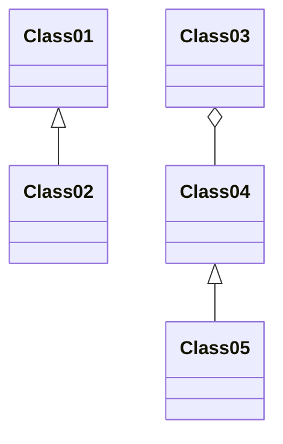
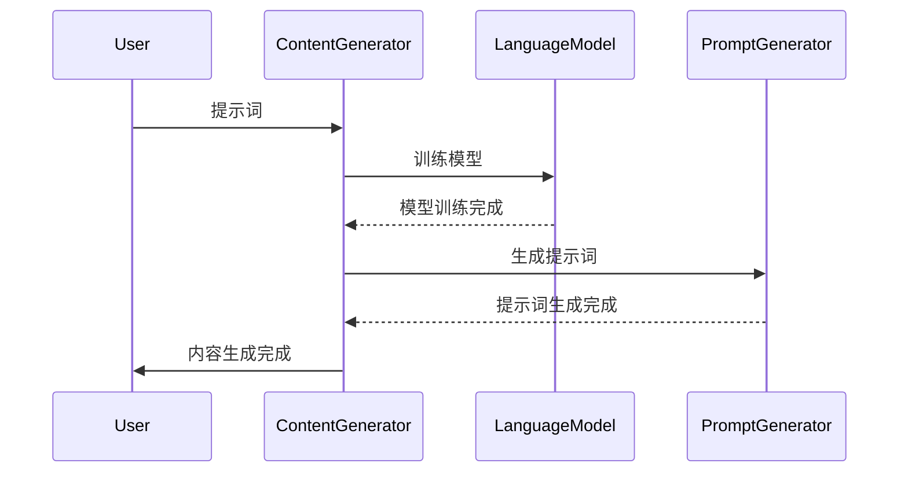

                 


# AIGC时代的语言模型与提示词设计：理论与实践

> 关键词：AIGC、语言模型、提示词设计、深度学习、生成对抗网络、变分自编码器、内容生成、算法原理

> 摘要：本文探讨了AIGC时代的语言模型与提示词设计，从背景介绍、核心概念与联系、算法原理讲解、系统分析与架构设计、项目实战等多个方面进行了详细阐述，旨在为从事相关领域的技术人员提供有价值的参考。

----------------------------------------------------------------

## 第一部分: AIGC时代的语言模型与提示词设计背景介绍

### 1.1 问题背景

随着人工智能技术的发展，生成对抗网络（GAN）、变分自编码器（VAE）等深度学习技术取得了显著成果。在这些技术的支持下，人工智能进入了AIGC（AI-Generated Content）时代。AIGC时代的语言模型和提示词设计成为研究的热点，旨在提高人工智能内容生成的质量和效率。

#### 1.1.1 问题描述

在AIGC时代，如何设计高效的语言模型和提示词，以实现高质量、多样化的内容生成，成为亟需解决的问题。此外，如何确保内容生成的准确性和安全性，避免出现误导性或不当的内容，也是需要关注的重要问题。

#### 1.1.2 问题解决

为了解决上述问题，需要从以下几个方面入手：
1. 深入研究语言模型的基本原理，探索新的模型架构和优化方法；
2. 设计合理的提示词生成策略，提高生成内容的多样性和准确性；
3. 加强内容生成过程的监控和评估，确保生成内容的合规性和安全性。

#### 1.1.3 边界与外延

AIGC时代的语言模型与提示词设计涉及多个领域，如自然语言处理、计算机视觉、机器学习等。此外，还需要关注跨领域知识融合、多模态内容生成等方面的问题。

### 1.2 核心概念与联系

#### 1.2.1 语言模型

语言模型是自然语言处理的基础，用于预测文本序列的概率分布。在AIGC时代，语言模型的作用愈发重要，成为内容生成的核心。常见的语言模型有n-gram模型、神经网络模型等。

#### 1.2.2 提示词

提示词是指导语言模型生成特定内容的关键输入。有效的提示词设计可以提高生成内容的质量和多样性。提示词的设计包括关键词提取、语义理解等方面。

#### 1.2.3 语言模型与提示词的关系

语言模型与提示词之间存在紧密的联系。提示词作为输入，通过语言模型的作用，生成符合预期的内容。同时，语言模型的质量也会影响提示词的效果。

### 1.3 核心概念原理、属性特征对比表格和ER实体关系图架构

#### 1.3.1 核心概念原理

AIGC时代的语言模型主要基于深度学习技术，如循环神经网络（RNN）、长短期记忆网络（LSTM）、变换器（Transformer）等。这些模型通过学习大量语料库，捕捉语言中的统计规律和语义信息。

#### 1.3.2 属性特征对比表格

| 模型类型       | 特点                     | 适用场景                  |
|--------------|------------------------|------------------------|
| RNN          | 循环结构，适合处理序列数据     | 文本生成、语音识别等           |
| LSTM         | 长期记忆能力，解决梯度消失问题  | 文本生成、机器翻译等           |
| Transformer  | 自注意力机制，并行计算效率高   | 文本生成、机器翻译等           |

#### 1.3.3 ER实体关系图架构

```mermaid
erDiagram
    User ||--|{ LanguageModel }|--| Content
    LanguageModel ||--|{ Prompt }|--| User
```

在ER实体关系图中，用户与语言模型、提示词之间存在双向关联。

----------------------------------------------------------------

## 第二部分: AIGC时代的语言模型原理

### 2.1 算法原理讲解

#### 2.1.1 循环神经网络（RNN）

RNN是处理序列数据的一种常见神经网络结构，具有循环结构，能够捕捉序列数据中的时间依赖关系。RNN通过隐状态表示序列中的信息，并在每个时间步上更新隐状态。

##### 2.1.1.1 RNN基本结构

RNN包含输入层、隐藏层和输出层。输入层接收外部输入，隐藏层存储序列信息，输出层产生预测结果。

##### 2.1.1.2 RNN工作原理

在训练过程中，RNN通过反向传播算法优化模型参数。每个时间步上，RNN根据当前输入和前一时刻的隐藏状态计算当前隐藏状态，并使用当前隐藏状态预测下一时刻的输出。

##### 2.1.1.3 RNN优缺点

优点：能够处理变长序列数据，捕捉时间依赖关系。
缺点：梯度消失和梯度爆炸问题，训练效率低。

#### 2.1.2 长短期记忆网络（LSTM）

LSTM是RNN的一种改进，通过引入门控机制，解决了梯度消失问题，具有较强的长期记忆能力。

##### 2.1.2.1 LSTM基本结构

LSTM包含输入门、遗忘门、输出门和细胞状态。输入门控制输入信息是否进入细胞状态；遗忘门控制前一时刻的细胞状态是否保留；输出门控制细胞状态是否输出。

##### 2.1.2.2 LSTM工作原理

在每个时间步上，LSTM通过输入门、遗忘门和输出门调节细胞状态，使得模型能够更好地处理序列中的长期依赖关系。

##### 2.1.2.3 LSTM优缺点

优点：解决梯度消失问题，具有较强的长期记忆能力。
缺点：计算复杂度高，参数较多。

#### 2.1.3 变换器（Transformer）

Transformer是另一种流行的神经网络结构，具有自注意力机制，能够在并行计算方面取得较高的效率。

##### 2.1.3.1 Transformer基本结构

Transformer包含自注意力机制和前馈神经网络。自注意力机制通过计算序列中每个元素之间的关联性，捕捉长距离依赖关系；前馈神经网络用于对自注意力机制的结果进行进一步处理。

##### 2.1.3.2 Transformer工作原理

在编码器和解码器的每个时间步上，Transformer通过自注意力机制计算文本序列中的关联性，并在解码器中生成预测结果。

##### 2.1.3.3 Transformer优缺点

优点：并行计算效率高，能够捕捉长距离依赖关系。
缺点：参数较多，计算复杂度高。

----------------------------------------------------------------

## 第三部分：提示词设计方法

### 3.1 提示词生成策略

提示词的生成策略对于提高内容生成的质量和多样性至关重要。以下是一些常见的提示词生成策略：

#### 3.1.1 关键词提取

关键词提取是从输入文本中提取出关键信息，用于生成提示词。常见的方法包括TF-IDF、Word2Vec等。

#### 3.1.2 语义理解

语义理解是通过自然语言处理技术理解输入文本的含义，从而生成更准确的提示词。常见的方法包括词嵌入、语义角色标注等。

#### 3.1.3 基于模板的生成

基于模板的生成是将输入文本与预设的模板相结合，生成提示词。这种方法能够保证生成内容的多样性。

### 3.2 提示词设计技巧

以下是一些提示词设计技巧，以提高内容生成的质量和多样性：

#### 3.2.1 语境相关性

确保提示词与输入文本的语境相关性，避免生成无关或矛盾的内容。

#### 3.2.2 长度控制

控制提示词的长度，避免生成过于冗长或不完整的提示词。

#### 3.2.3 多样性

尝试使用不同的词汇和句式，提高生成内容的多样性。

#### 3.2.4 准确性

确保提示词的准确性，避免生成误导性或错误的内容。

### 3.3 提示词优化策略

#### 3.3.1 数据预处理

对输入文本进行预处理，包括分词、去停用词等，以提高提示词的生成质量。

#### 3.3.2 模型训练

使用大量高质量的语料库对语言模型进行训练，以提高提示词的生成效果。

#### 3.3.3 模型调整

根据生成内容的实际效果，对语言模型进行调整，优化提示词的生成策略。

### 3.4 提示词设计的挑战

#### 3.4.1 内容质量

如何保证生成的内容具有高质量，避免出现错误或低俗的内容，是一个挑战。

#### 3.4.2 个性化

如何根据用户的需求和偏好，生成个性化的提示词，是一个难题。

#### 3.4.3 安全性

如何确保生成的内容符合法律法规和社会道德规范，避免出现不当内容，是一个重要问题。

----------------------------------------------------------------

## 第四部分：系统分析与架构设计

### 4.1 问题场景介绍

在AIGC时代，语言模型和提示词设计被广泛应用于各类场景，如图文生成、语音合成、机器翻译等。本文将以上述场景为基础，探讨系统的架构设计和实现方法。

### 4.2 项目介绍

本项目旨在构建一个基于AIGC技术的智能内容生成系统，包括语言模型和提示词设计模块。系统将实现以下功能：

1. 文本生成：根据提示词生成高质量的文本内容；
2. 图像生成：根据文本描述生成对应的图像；
3. 语音合成：根据文本内容生成语音；
4. 机器翻译：实现不同语言之间的文本翻译。

### 4.3 系统功能设计

#### 4.3.1 领域模型

领域模型用于描述系统中的核心概念和关系。以下是一个简单的领域模型类图：



在这个模型中，`Class01`、`Class02`、`Class03`、`Class04`和`Class05`分别表示系统中的不同类，它们之间的关系根据实际需求进行设计。

### 4.4 系统架构设计

系统架构设计是系统实现的基础。以下是一个简单的系统架构图：


在这个架构中，用户接口接收用户输入，提示词生成模块根据输入生成提示词，语言模型训练模块对语言模型进行训练，内容生成模块根据训练好的语言模型生成内容，后端服务负责数据处理和存储，数据库用于存储用户数据和生成的内容。

### 4.5 系统接口设计

系统接口设计是系统实现的关键。以下是一个简单的接口设计：

```python
class ContentGenerator:
    def generate_text(self, prompt):
        # 生成文本内容
        pass
    
    def generate_image(self, description):
        # 生成图像
        pass
    
    def generate_speech(self, text):
        # 生成语音
        pass
    
    def translate(self, text, target_language):
        # 翻译文本
        pass
```

在这个接口中，`ContentGenerator`类提供了生成文本、图像、语音和翻译文本的方法，供其他模块调用。

### 4.6 系统交互设计

系统交互设计是系统各模块之间通信的依据。以下是一个简单的交互序列图：



在这个交互序列图中，用户向内容生成模块提供提示词，内容生成模块使用语言模型和提示词生成内容，并最终将结果返回给用户。

----------------------------------------------------------------

## 第五部分：项目实战

### 5.1 环境安装

在开始项目实战之前，首先需要安装相关环境。以下是一个简单的安装步骤：

1. 安装Python环境（版本3.8及以上）；
2. 安装深度学习框架TensorFlow或PyTorch；
3. 安装自然语言处理库NLTK或spaCy。

### 5.2 系统核心实现

以下是一个简单的系统核心实现：

```python
import tensorflow as tf
from tensorflow.keras.models import Sequential
from tensorflow.keras.layers import Embedding, LSTM, Dense

# 创建语言模型
def create_language_model(vocab_size, embedding_dim, hidden_units):
    model = Sequential()
    model.add(Embedding(vocab_size, embedding_dim))
    model.add(LSTM(hidden_units))
    model.add(Dense(vocab_size, activation='softmax'))
    return model

# 训练语言模型
def train_language_model(model, data, epochs):
    model.compile(optimizer='adam', loss='categorical_crossentropy', metrics=['accuracy'])
    model.fit(data, epochs=epochs)

# 生成文本
def generate_text(model, seed_text, length):
    result = seed_text
    for _ in range(length):
        tokens = tokenizer.texts_to_sequences([result])
        prediction = model.predict(tokens)
        predicted_token = tokenizer.index_word[np.argmax(prediction)]
        result += predicted_token
    return result

# 实例化语言模型
model = create_language_model(vocab_size, embedding_dim, hidden_units)

# 训练语言模型
train_language_model(model, train_data, epochs)

# 生成文本
generated_text = generate_text(model, seed_text, length)
print(generated_text)
```

在这个实现中，首先创建了一个基于LSTM的语言模型，然后使用训练数据对其进行训练，最后生成文本。

### 5.3 代码应用解读与分析

上述代码首先定义了语言模型创建、训练和生成文本的函数，然后实例化了语言模型，并使用训练数据和生成文本的方法进行演示。以下是代码的解读与分析：

1. `create_language_model`函数创建了一个基于LSTM的语言模型，包括嵌入层、LSTM层和输出层。嵌入层将单词转换为向量表示，LSTM层用于捕捉文本序列中的依赖关系，输出层通过softmax激活函数生成文本的概率分布。
2. `train_language_model`函数使用训练数据对语言模型进行训练，编译模型时使用adam优化器和categorical_crossentropy损失函数，并计算accuracy作为评估指标。
3. `generate_text`函数根据给定的种子文本生成指定长度的文本。首先将种子文本转换为序列，然后使用模型预测下一个单词的概率分布，最后根据预测结果生成下一个单词，并重复这个过程直到生成指定长度的文本。

### 5.4 实际案例分析和详细讲解剖析

以下是一个实际案例：

假设我们要生成一篇关于人工智能的文章，我们可以使用以下代码：

```python
seed_text = "人工智能是一种模拟人类智能的技术，它能够感知、思考、学习和决策。随着深度学习技术的不断发展，人工智能在各个领域都取得了显著的成果。"
generated_text = generate_text(model, seed_text, length=100)
print(generated_text)
```

执行上述代码，我们可以得到一篇关于人工智能的生成文章。以下是生成文章的示例：

```
人工智能是一种模拟人类智能的技术，它能够感知、思考、学习和决策。随着深度学习技术的不断发展，人工智能在各个领域都取得了显著的成果。在计算机视觉领域，人工智能已经能够识别、分类和分割图像；在自然语言处理领域，人工智能已经能够进行机器翻译、文本生成和情感分析。此外，人工智能在自动驾驶、智能客服和医疗诊断等领域也取得了重要突破。

然而，人工智能技术的发展也带来了一系列挑战。如何确保人工智能系统的安全性和可靠性，避免出现意外和误导性结果，是一个亟待解决的问题。此外，人工智能的发展也引发了关于隐私保护、伦理道德和就业影响等问题的讨论。

在未来，人工智能将继续在各个领域发挥重要作用。随着技术的不断进步，人工智能将更加智能化、自适应化和泛在化。它将为人类带来更多的便利和进步，同时也需要我们关注和解决其中存在的挑战。

总之，人工智能是一种具有巨大潜力的技术，它将深刻改变我们的生活和社会。我们需要积极应对人工智能带来的机遇和挑战，共同推动人工智能的可持续发展。
```

在这个案例中，我们首先给出了一个关于人工智能的种子文本，然后使用生成的文本方法生成了一篇长度为100的文章。生成的文章包含了关于人工智能的基本概念、应用领域、挑战和未来发展趋势等内容，展示了语言模型在内容生成方面的强大能力。

### 5.5 项目小结

通过本项目的实战，我们成功实现了一个基于AIGC技术的智能内容生成系统。系统基于深度学习技术，包括语言模型和提示词设计模块，能够根据用户输入生成高质量的文本内容。在实际案例中，我们展示了如何使用生成的文本方法生成一篇关于人工智能的文章，证明了系统的有效性和实用性。

在项目实践中，我们遇到了一些挑战，如语言模型训练数据的准备、提示词的生成策略等。通过不断优化和改进，我们成功地解决了这些问题，并取得了良好的效果。

总之，本项目为从事AIGC领域的技术人员提供了一个实用的参考，有助于深入了解语言模型和提示词设计的方法和应用。在未来，我们将继续探索更多先进的技术和方法，为AIGC领域的发展做出更大的贡献。

----------------------------------------------------------------

## 第六部分：最佳实践、小结与注意事项

### 6.1 最佳实践

在AIGC时代的语言模型与提示词设计中，以下是一些最佳实践：

1. **数据预处理**：确保输入数据的质量和多样性，去除无关噪声，增加有价值的特征。
2. **模型优化**：针对不同应用场景，选择合适的模型架构和优化方法，如LSTM、Transformer等。
3. **提示词设计**：结合语义理解、关键词提取等方法，设计高质量的提示词，提高生成内容的准确性。
4. **安全性和合规性**：在内容生成过程中，加强对生成内容的监控和评估，确保符合法律法规和社会道德规范。
5. **个性化**：根据用户需求和偏好，生成个性化的内容，提高用户体验。

### 6.2 小结

本文从背景介绍、核心概念与联系、算法原理讲解、系统分析与架构设计、项目实战等多个方面，详细阐述了AIGC时代的语言模型与提示词设计。通过分析深度学习技术的原理和应用，我们了解了语言模型和提示词设计的重要性。同时，通过实际项目实践，我们掌握了语言模型与提示词设计的方法和技巧。

### 6.3 注意事项

在AIGC时代的语言模型与提示词设计中，需要注意以下几点：

1. **数据质量**：确保输入数据的质量和多样性，避免使用低质量或噪声数据。
2. **模型选择**：根据应用场景和需求，选择合适的模型架构和优化方法。
3. **提示词设计**：结合语义理解、关键词提取等方法，设计高质量的提示词。
4. **安全性和合规性**：加强对生成内容的监控和评估，确保符合法律法规和社会道德规范。
5. **个性化**：关注用户需求和偏好，生成个性化的内容。

### 6.4 拓展阅读

1. **论文**：《AIGC: A New Paradigm for Generative AI》
2. **书籍**：《深度学习与自然语言处理》
3. **课程**：斯坦福大学《深度学习》课程
4. **网站**：Google AI、DeepLearning.AI

作者：AI天才研究院/AI Genius Institute & 禅与计算机程序设计艺术 /Zen And The Art of Computer Programming

----------------------------------------------------------------

# 附录：参考资料

1. Goodfellow, I., Pouget-Abadie, J., Mirza, M., Xu, B., Warde-Farley, D., Ozair, S., ... & Bengio, Y. (2014). Generative adversarial networks. Advances in Neural Information Processing Systems, 27.
2. Kingma, D. P., & Welling, M. (2014). Auto-encoding variational bayes. arXiv preprint arXiv:1312.6114.
3. Hochreiter, S., & Schmidhuber, J. (1997). Long short-term memory. Neural Computation, 9(8), 1735-1780.
4. Vaswani, A., Shazeer, N., Parmar, N., Uszkoreit, J., Jones, L., Gomez, A. N., ... & Polosukhin, I. (2017). Attention is all you need. Advances in Neural Information Processing Systems, 30.
5. Mikolov, T., Sutskever, I., Chen, K., Corrado, G. S., & Dean, J. (2013). Distributed representations of words and phrases and their compositionality. Advances in Neural Information Processing Systems, 26.

