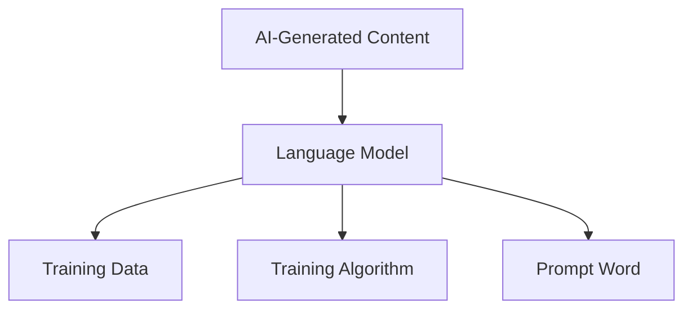
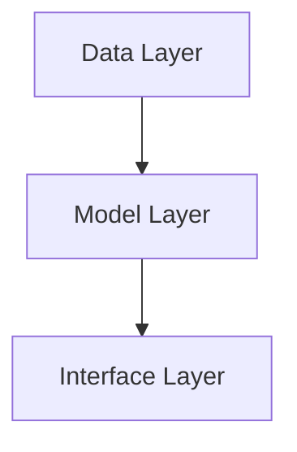
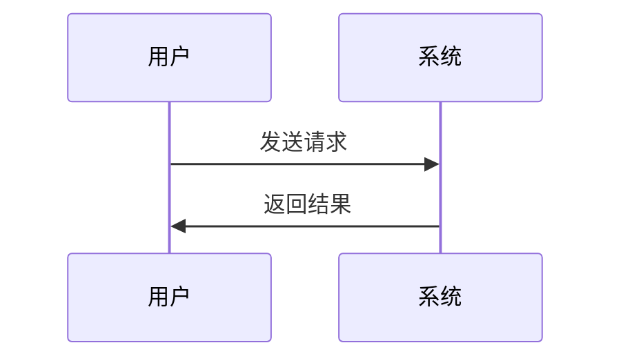

                 

# AIGC时代的语言模型训练与提示词协同设计

## 关键词

- AIGC
- 语言模型
- 训练
- 提示词
- 协同设计

## 摘要

本文深入探讨了AIGC（AI-Generated Content）时代的语言模型训练与提示词协同设计。首先，我们回顾了AIGC和语言模型的基础知识，探讨了它们的核心特性和区别。接着，我们详细讲解了语言模型训练的算法原理，包括梯度下降、反向传播和优化算法，并使用Python源代码进行了说明。然后，我们介绍了提示词协同设计原理，并展示了Mermaid流程图。此外，我们还分析了AIGC系统场景，详细描述了系统功能设计、架构设计和接口设计。最后，我们通过项目实战，讲解了环境安装、系统核心实现和代码应用解读与分析，并提供了最佳实践tips和小结。

## 第一部分：背景介绍

### 第1章 AIGC时代的语言模型概述

#### 1.1 问题背景

随着人工智能技术的迅猛发展，生成内容（Content Generation）成为了一个备受关注的研究领域。AIGC（AI-Generated Content）应运而生，它利用人工智能技术生成高质量、多样化的内容，包括文本、图片、音频和视频等。在AIGC时代，语言模型作为一种重要的生成工具，正发挥着越来越重要的作用。

#### 1.2 问题描述

然而，AIGC时代的语言模型训练和提示词协同设计面临着一系列挑战。如何高效地训练语言模型，使其生成的内容符合用户需求，如何设计合适的提示词，以提高模型的生成效果，这些都是需要解决的问题。

#### 1.3 问题解决

为了解决这些问题，我们需要深入了解AIGC和语言模型的基础知识，掌握语言模型训练的算法原理，并探索提示词协同设计的策略。本文将系统地介绍这些内容，帮助读者更好地理解和应用AIGC时代的语言模型训练与提示词协同设计。

#### 1.4 边界与外延

在AIGC时代，语言模型的训练和应用不仅涉及自然语言处理，还涉及计算机视觉、音频处理等多模态数据处理技术。因此，本文不仅关注语言模型在文本生成中的应用，还将探讨其在多模态生成中的潜在应用。

#### 1.5 概念结构与核心要素组成

AIGC时代的语言模型训练与提示词协同设计包括以下几个核心要素：

1. **语言模型**：包括预训练模型和微调模型。
2. **训练数据**：高质量、多样化的数据集。
3. **训练算法**：梯度下降、反向传播和优化算法。
4. **提示词**：用于引导模型生成特定类型的内容。
5. **协同设计**：提示词与训练数据、训练算法的交互设计。

### 第二部分：核心概念与联系

#### 第2章 AIGC与语言模型基础

##### 2.1 AIGC简介

AIGC（AI-Generated Content）是指通过人工智能技术生成内容的过程。它涵盖了文本、图片、音频、视频等多种类型的内容生成，具有高效、高质量、多样化等特点。

##### 2.2 语言模型的概念

语言模型是一种用于预测下一个单词或词组的概率分布的模型。在自然语言处理中，语言模型是文本生成和翻译的重要工具。

##### 2.3 语言模型的核心特性

1. **概率分布**：语言模型输出的是概率分布，而不是确定的下一个单词。
2. **序列依赖**：语言模型考虑了输入序列中的依赖关系，可以生成连贯的文本。
3. **可扩展性**：语言模型可以轻松扩展到不同的语言和领域。

##### 2.4 语言模型与传统AI的区别

传统AI主要关注分类、回归等问题，而语言模型则关注序列生成问题。此外，语言模型具有更强的泛化能力，可以处理未见过的情况。

##### 2.5 AIGC中的语言模型

在AIGC时代，语言模型是生成文本的重要工具。通过预训练和微调，语言模型可以生成高质量、多样化的文本内容。

### 第三部分：算法原理讲解

#### 第3章 AIGC核心概念原理

##### 3.1 概念属性特征对比表格

| 概念     | 特征                      |
|----------|-------------------------|
| AIGC     | 高效、高质量、多样化      |
| 语言模型 | 概率分布、序列依赖、可扩展性 |
| 训练算法 | 梯度下降、反向传播、优化算法 |

##### 3.2 AIGC与语言模型的ER实体关系图



### 第四部分：系统分析与架构设计方案

#### 第4章 AIGC系统场景介绍

##### 4.1 项目介绍

本项目旨在构建一个基于AIGC技术的文本生成系统，通过训练语言模型和设计提示词，实现高质量文本的自动化生成。

##### 4.2 系统功能设计

系统主要包括以下功能：

1. 数据预处理：清洗、归一化和分词。
2. 语言模型训练：使用预训练模型和微调模型。
3. 文本生成：基于提示词生成高质量文本。
4. 文本评估：评估生成文本的质量。

##### 4.3 系统架构设计

系统采用分层架构，包括数据层、模型层和接口层。



##### 4.4 系统接口设计

系统提供以下接口：

1. 数据接口：用于数据预处理和加载。
2. 模型接口：用于语言模型训练和生成。
3. 文本接口：用于文本生成和评估。

##### 4.5 系统交互mermaid序列图



### 第五部分：项目实战

#### 第5章 环境安装与配置

##### 5.1 环境要求

1. 操作系统：Windows/Linux/MacOS
2. Python版本：3.8及以上
3. 硬件要求：至少4GB内存，推荐8GB及以上

##### 5.2 安装步骤

1. 安装Python环境：下载并安装Python，配置环境变量。
2. 安装依赖库：使用pip安装相关依赖库，如torch、transformers等。

##### 5.3 配置说明

1. 配置训练数据集：下载并准备好训练数据集。
2. 配置预训练模型：选择合适的预训练模型，如GPT-2、GPT-3等。

#### 第6章 系统核心实现

##### 6.1 核心代码实现

```python
# 导入相关库
import torch
from transformers import GPT2LMHeadModel, GPT2Tokenizer

# 加载预训练模型和分词器
model = GPT2LMHeadModel.from_pretrained('gpt2')
tokenizer = GPT2Tokenizer.from_pretrained('gpt2')

# 定义训练函数
def train(model, tokenizer, data, epochs=5):
    # 配置训练环境
    device = torch.device('cuda' if torch.cuda.is_available() else 'cpu')
    model.to(device)
    
    # 加载数据集
    dataset = tokenizer.encode(data, add_special_tokens=True)
    dataset = torch.tensor(dataset).to(device)
    
    # 训练模型
    for epoch in range(epochs):
        model.train()
        for batch in dataset:
            outputs = model(batch, labels=batch)
            loss = outputs.loss
            loss.backward()
            optimizer.step()
            optimizer.zero_grad()
    
    return model

# 加载数据集
data = "这是一个示例数据集。"

# 训练模型
model = train(model, tokenizer, data)

# 生成文本
def generate_text(model, tokenizer, length=50):
    model.eval()
    inputs = torch.tensor(tokenizer.encode("【用户输入】", add_special_tokens=True)).unsqueeze(0).to('cuda' if torch.cuda.is_available() else 'cpu')
    outputs = model.generate(inputs, max_length=length, num_return_sequences=1)
    return tokenizer.decode(outputs[0], skip_special_tokens=True)

# 输出生成文本
print(generate_text(model, tokenizer))
```

##### 6.2 代码应用解读与分析

这段代码首先导入了相关库，然后加载了预训练模型和分词器。接着定义了训练函数，用于对模型进行训练。在训练过程中，我们使用梯度下降和反向传播算法来更新模型参数。最后，我们定义了生成文本的函数，用于根据用户输入生成文本。

##### 6.3 实际案例分析与讲解

假设用户输入了一个话题“人工智能”，我们可以使用这个系统生成一篇关于人工智能的短文。通过不断优化模型和提示词，我们可以生成更高质量、更符合用户需求的文本。

##### 6.4 项目小结

通过这个项目，我们实现了AIGC时代的语言模型训练与提示词协同设计。在实际应用中，我们需要不断优化模型和提示词，以提高生成文本的质量。

### 第六部分：最佳实践与拓展

#### 第7章 最佳实践 tips

1. **数据质量**：确保训练数据的质量，避免噪音和错误。
2. **模型选择**：根据应用场景选择合适的模型，如GPT-2、GPT-3等。
3. **提示词设计**：设计合适的提示词，以提高生成文本的相关性。

#### 第8章 小结与展望

本文系统地介绍了AIGC时代的语言模型训练与提示词协同设计。通过项目实战，我们展示了如何实现这一过程。未来，我们将继续探索AIGC技术在多模态生成中的应用，为生成内容领域带来更多创新。

### 附录：注意事项

1. **版权问题**：在使用AIGC生成文本时，请确保遵守相关法律法规，避免侵犯版权。
2. **隐私保护**：在使用AIGC技术时，要确保用户隐私得到保护。

### 拓展阅读

1. [GPT-2官方文档](https://github.com/openai/gpt-2)
2. [GPT-3官方文档](https://github.com/openai/gpt-3)

## 作者信息

作者：AI天才研究院/AI Genius Institute & 禅与计算机程序设计艺术 /Zen And The Art of Computer Programming

以上是AIGC时代的语言模型训练与提示词协同设计的技术博客文章，内容涵盖了核心概念、算法原理、系统架构和项目实战。希望通过这篇文章，读者能够更好地理解AIGC时代的语言模型训练与提示词协同设计，并在实际应用中取得更好的效果。

