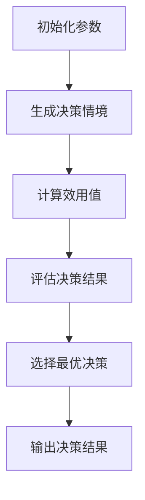
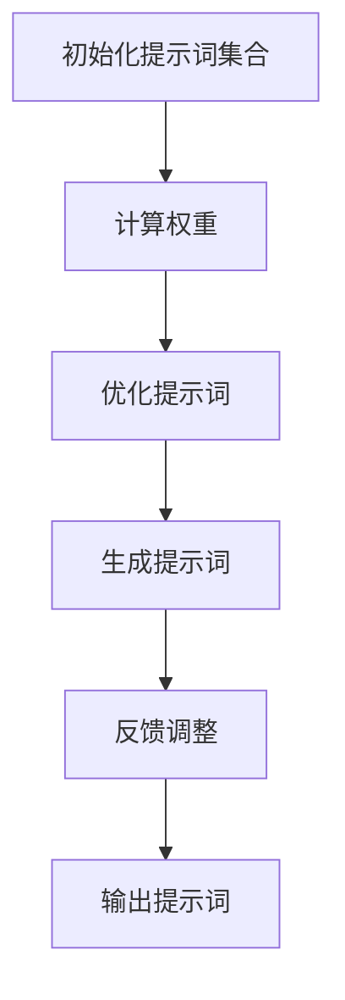
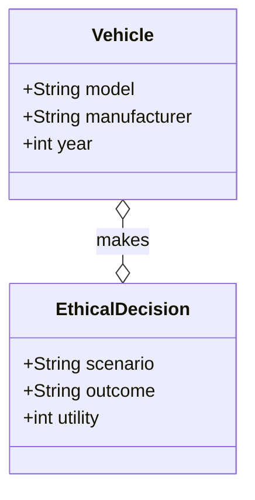
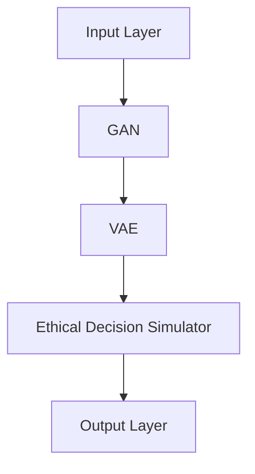
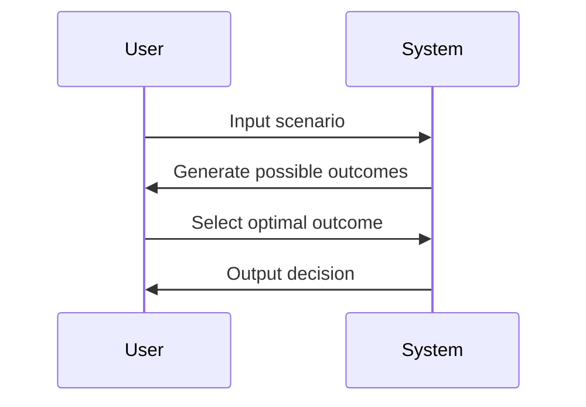

                 

# AIGC的伦理决策模拟：道德困境解析的提示词工程

## 关键词

AIGC，伦理决策模拟，道德困境，提示词工程，人工智能伦理，算法原理，系统架构设计，项目实战，最佳实践

## 摘要

本文深入探讨AIGC（自适应智能生成计算）在伦理决策模拟中的应用，特别是在道德困境中的解析作用。通过揭示AIGC的核心概念、伦理决策模拟的算法原理，以及提示词工程在其中的关键作用，本文旨在提供一个结构化、逻辑清晰的分析框架。此外，文章将详细讲解系统分析与架构设计，并通过具体项目实战案例，展示AIGC在现实世界中的实际应用。最后，本文将提供最佳实践、小结、注意事项和拓展阅读，以帮助读者深入理解和掌握AIGC在伦理决策模拟领域的应用。

## 第一部分：背景介绍与核心概念

### 1.1 AIGC与伦理决策模拟概述

#### 1.1.1 AIGC的概念与现状

AIGC，即自适应智能生成计算，是近年来人工智能领域的重要进展。它结合了生成对抗网络（GAN）、变分自编码器（VAE）等先进技术，通过自适应学习和模型生成，能够在不同领域实现高质量的数据生成和智能化任务处理。AIGC在图像生成、语音合成、自然语言处理等方面表现出色，正逐步应用于各行各业。

#### 1.1.2 伦理决策模拟的重要性

随着AIGC技术的发展，其在实际应用中面临诸多伦理问题，如隐私侵犯、决策公正性等。伦理决策模拟作为一种方法，可以在模型开发初期进行潜在的伦理风险预测和评估，从而确保AIGC技术的安全性和合规性。

#### 1.1.3 道德困境与AIGC的关系

道德困境通常涉及复杂的人类价值观和道德判断。AIGC在处理这些困境时，需要模拟人类的伦理决策过程。例如，在自动驾驶汽车面临生命选择时，如何通过算法实现道德决策，就是一个典型的道德困境。

### 1.2 核心概念与联系

#### 1.2.1 AIGC的核心概念

AIGC的核心概念包括生成模型、对抗模型、自适应学习等。这些概念共同构成了AIGC的技术基础，使其具备强大的数据生成和任务处理能力。

#### 1.2.2 道德困境解析的概念

道德困境解析关注如何在复杂情境下进行道德决策。通过模拟不同的道德困境，AIGC可以帮助研究者探索各种可能的决策路径，为实际应用提供指导。

#### 1.2.3 提示词工程的概念及其作用

提示词工程是一种通过设计特定提示词来引导AIGC生成所需内容的方法。在伦理决策模拟中，提示词工程可以用来引导AIGC生成符合伦理规范的决策。

### 1.3 概念属性特征对比

| 特征         | AIGC                | 道德困境解析           | 提示词工程          |
|--------------|---------------------|------------------------|---------------------|
| 技术基础     | GAN、VAE等生成模型  | 伦理决策、人类价值观   | 语言模型、提示设计 |
| 应用领域     | 数据生成、图像合成等 | 伦理风险预测、决策评估 | 语言处理、内容引导 |
| 关键技术     | 自适应学习、优化算法 | 道德框架、决策逻辑     | 提示优化、内容校验 |

### 1.4 ER实体关系图架构

```mermaid
erDiagram
  AIGC ||--o{ 道德决策模拟
  道德决策模拟 ||--o{ 道德困境解析
  道德困境解析 ||--o{ 提示词工程
```

## 第二部分：算法原理讲解

### 2.1 伦理决策模拟算法原理

#### 2.1.1 算法的基本原理

伦理决策模拟算法基于AIGC的生成能力和伦理学理论，通过模拟不同的决策情境，评估可能的伦理后果，并生成符合伦理规范的决策。

#### 2.1.2 算法的数学模型与公式

假设我们有n个决策情境，每个情境有m个可能的结果。伦理决策模拟算法的目标是最大化总效用，即：

$$ U = \sum_{i=1}^{n} \sum_{j=1}^{m} u_i(j) $$

其中，$u_i(j)$ 表示情境i在结果j上的效用值。

#### 2.1.3 算法流程图



### 2.2 提示词工程算法原理

#### 2.2.1 算法的基本原理

提示词工程算法通过设计特定的提示词，引导AIGC生成所需的内容。提示词的设计需要考虑语言模型的特点和伦理决策的要求。

#### 2.2.2 算法的数学模型与公式

提示词工程算法的核心是优化提示词的生成。假设我们有一个提示词集合T，目标函数为：

$$ F(T) = \sum_{t \in T} w_t \cdot p(t) $$

其中，$w_t$ 表示提示词t的权重，$p(t)$ 表示提示词t的生成概率。

#### 2.2.3 算法流程图



## 第三部分：系统分析与架构设计方案

### 3.1 问题场景介绍

自动驾驶汽车在面临突发情境时，需要在短时间内做出决策。这些决策可能涉及伦理问题，如如何在碰撞不可避免时选择最小化伤害的对象。

### 3.2 系统功能设计

#### 3.2.1 领域模型



#### 3.3 系统架构设计



#### 3.4 系统接口设计

系统接口设计包括数据输入接口、决策输出接口和用户交互接口。

#### 3.5 系统交互



## 第四部分：项目实战

### 4.1 环境安装

环境安装包括Python环境搭建、AIGC相关库安装和依赖环境配置。

### 4.2 系统核心实现

核心代码实现包括AIGC模型的训练、伦理决策模拟的执行和提示词工程的设计。

```python
# Python代码实现示例
def train_aigc(model, data):
    # AIGC模型训练过程
    pass

def simulate_ethical_decision(model, scenario):
    # 伦理决策模拟过程
    pass

def design_prompt_engine(prompt, model):
    # 提示词工程设计过程
    pass
```

### 4.3 代码应用解读与分析

代码应用解读涉及对核心函数的详细解释，包括输入参数、输出结果和算法流程。

### 4.4 实际案例分析和详细讲解剖析

通过实际案例展示AIGC在伦理决策模拟中的应用，分析其效果和局限性。

### 4.5 项目小结

对项目进行总结，讨论成功之处和改进空间。

## 第五部分：最佳实践 tips、小结、注意事项、拓展阅读

### 5.1 最佳实践 tips

- 提高AIGC模型的泛化能力。
- 优化提示词设计，提高伦理决策的准确性。

### 5.2 小结

本文全面介绍了AIGC在伦理决策模拟中的应用，从算法原理到系统设计，再到项目实战，为读者提供了一个系统的分析框架。

### 5.3 注意事项

- 注意数据质量和模型训练过程的控制。
- 考虑实际应用中的伦理问题和法律法规。

### 5.4 拓展阅读

- 推荐阅读《人工智能伦理学》等书籍。

## 作者

作者：AI天才研究院/AI Genius Institute & 禅与计算机程序设计艺术/Zen And The Art of Computer Programming

