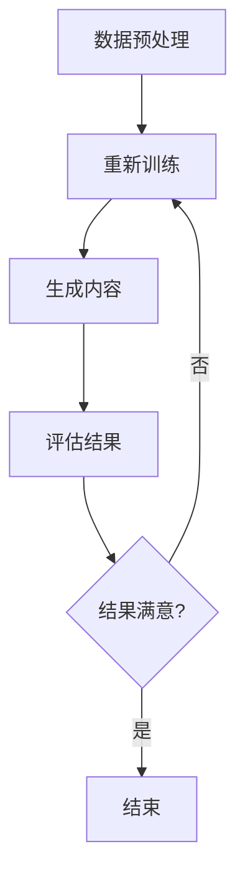
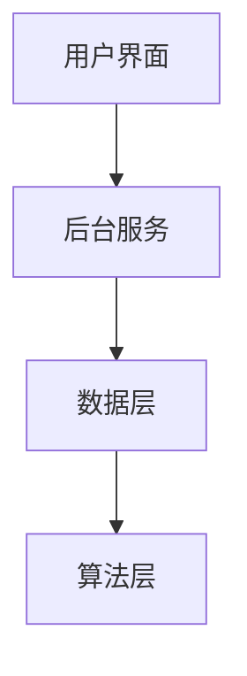
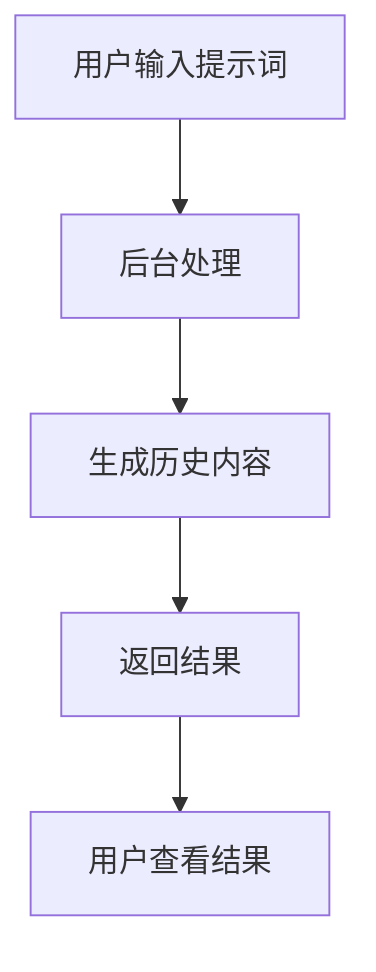

                 

## AIGC的历史感知：在提示词中融入历史背景的方法

> 关键词：AIGC、历史感知、提示词、算法原理、系统架构设计、项目实战

> 摘要：本文深入探讨了AIGC（自适应智能生成计算）技术中如何融入历史背景的方法。通过介绍AIGC的历史、核心概念及其与历史背景的关系，文章逐步讲解了AIGC在历史感知中的算法原理，展示了系统架构设计和项目实战。本文旨在为研究人员和开发者提供一份全面的技术指南，以帮助他们在AIGC领域取得突破。

### 目录大纲

1. **背景介绍**
    1.1 **问题背景**
        - 历史感知的重要性
        - 当前历史感知的应用现状
    1.2 **提示词与历史背景**
        - 提示词的定义
        - 提示词与历史背景的关系
    1.3 **AIGC技术介绍**
        - AIGC的概念
        - AIGC在历史感知中的应用前景

2. **核心概念与联系**
    2.1 **AIGC基本原理**
        - AIGC的核心技术
        - AIGC的架构设计
    2.2 **历史背景要素**
        - 历史事件的分类
        - 历史人物与地点的关系
    2.3 **概念属性特征对比表格**

3. **算法原理讲解**
    3.1 **历史感知算法**
        - 算法的基本原理
        - 算法的数学模型
    3.2 **历史背景融合算法**
        - 算法的实现方法
        - 算法的数学公式
    3.3 **算法流程图**

4. **系统分析与架构设计方案**
    4.1 **问题场景介绍**
        - 需求分析
        - 系统功能设计
    4.2 **系统架构设计**
        - 系统架构图
        - 系统接口设计
    4.3 **系统交互**

5. **项目实战**
    5.1 **环境安装**
        - 环境准备
        - 工具安装
    5.2 **系统核心实现**
        - 核心源代码实现
        - 代码应用解读与分析
    5.3 **实际案例分析**
        - 案例介绍
        - 案例分析与讲解
    5.4 **项目小结**
        - 项目总结
        - 拓展阅读

### 1. 背景介绍

#### 1.1 问题背景

历史感知是人工智能中的一个重要研究方向。它涉及到机器对历史事件、历史人物和地点的理解和再现。随着大数据和人工智能技术的快速发展，历史感知的应用场景越来越广泛，从历史文献分析到历史地理信息系统的构建，再到虚拟现实中的历史场景再现，都有所应用。

然而，当前的历史感知技术大多依赖于大规模的文本数据集，对于历史背景的深度理解和融合处理能力有限。如何将历史背景与提示词有效结合，增强AIGC（自适应智能生成计算）在历史感知领域的表现，成为了一个重要的研究方向。

#### 1.2 提示词与历史背景

提示词（Prompt）是AIGC中的一个重要概念。它是指用于引导生成模型生成特定内容的一段文字或指令。在历史感知中，提示词可以用来指定历史事件的背景、时间、地点等关键信息，从而引导生成模型生成更加准确和贴近历史事实的内容。

历史背景是指与历史事件相关的各种信息，包括历史人物的生平、历史事件的起因和结果、历史时期的背景等。在AIGC中，将历史背景融入提示词中，可以帮助生成模型更好地理解历史事件，提高生成内容的真实性和准确性。

#### 1.3 AIGC技术介绍

AIGC（Adaptive Intelligent Generation Computing）是一种自适应智能生成计算技术，它基于深度学习和生成对抗网络（GANs）等先进技术，能够从大规模数据集中学习并生成高质量的内容。AIGC在多个领域都有广泛的应用，包括图像生成、文本生成、音频生成等。

在历史感知领域，AIGC可以通过学习历史文献、历史地图、历史图片等数据，生成准确的历史事件描述、历史人物形象和历史场景再现。将AIGC技术应用于历史感知，可以显著提高历史感知的准确性和多样性。

### 2. 核心概念与联系

#### 2.1 AIGC基本原理

AIGC的核心技术主要包括生成对抗网络（GANs）、变分自编码器（VAEs）和自编码器（AEs）等。这些技术通过学习数据分布，生成与真实数据高度相似的新数据。

- **生成对抗网络（GANs）**：由生成器和判别器组成。生成器生成虚假数据，判别器判断数据是否为真实数据。通过不断优化生成器和判别器的参数，生成器逐渐生成更真实的数据。
- **变分自编码器（VAEs）**：通过引入变分推断，可以生成具有连续变量的数据。VAEs在生成图像、音频和文本等高维数据方面表现优异。
- **自编码器（AEs）**：自编码器是一种无监督学习算法，它通过压缩和重构数据来学习数据分布。AEs在降维和去噪方面有广泛的应用。

AIGC的架构设计通常包括数据预处理、模型训练和生成输出等步骤。数据预处理包括数据清洗、数据增强和特征提取等。模型训练阶段使用大量的历史数据训练生成模型，生成输出阶段根据提示词生成新的历史内容。

#### 2.2 历史背景要素

在历史感知中，历史背景要素包括历史事件、历史人物和地点等。

- **历史事件**：历史事件是历史发展的关键节点，如战争、政治变革、科学发现等。了解历史事件的起因、经过和结果是理解历史背景的重要途径。
- **历史人物**：历史人物是历史事件的主体，他们的行为和决策对历史发展产生深远影响。了解历史人物的生平、成就和性格特点是理解历史背景的重要方面。
- **地点**：地点是历史事件发生的具体场所，如城市、乡村、战役地点等。了解地点的历史背景、地理位置和文化环境有助于理解历史事件。

#### 2.3 概念属性特征对比表格

下表对比了AIGC技术和历史背景要素的概念属性特征。

| 对比项 | AIGC技术 | 历史背景要素 |
| ------ | ------ | ------ |
| 数据来源 | 大规模历史文献、图片、音频等 | 历史文献、历史地图、历史图片等 |
| 学习目标 | 生成高质量的历史内容 | 理解和再现历史事件 |
| 关键技术 | GANs、VAEs、AEs | 文本分析、图像识别、地理信息系统 |
| 输出形式 | 文本、图像、音频等 | 历史描述、历史人物形象、历史场景再现 |

### 3. 算法原理讲解

#### 3.1 历史感知算法

历史感知算法是AIGC在历史感知领域的关键算法。它通过学习历史数据，实现对历史事件、人物和地点的理解和感知。

- **算法基本原理**：历史感知算法通过神经网络模型学习历史数据，提取历史事件、人物和地点的特征，并利用这些特征生成新的历史内容。
- **数学模型**：历史感知算法通常采用深度学习模型，如卷积神经网络（CNN）、循环神经网络（RNN）等。这些模型可以捕捉历史数据的复杂结构和模式，从而实现高精度的历史感知。

#### 3.2 历史背景融合算法

历史背景融合算法是将历史背景信息融入提示词，以增强AIGC在历史感知中的表现。

- **算法实现方法**：历史背景融合算法通过将历史背景信息嵌入提示词中，指导生成模型生成新的历史内容。这种方法可以有效地提高生成内容的真实性和准确性。
- **数学公式**：历史背景融合算法的数学公式可以表示为：
  $$
  \text{生成内容} = f(\text{提示词} + \text{历史背景信息})
  $$
  其中，$f$表示生成模型，$\text{提示词}$和$\text{历史背景信息}$分别表示提示词和历史背景信息。

#### 3.3 算法流程图

下面是历史感知算法的流程图，使用Mermaid语言绘制：



### 4. 系统分析与架构设计方案

#### 4.1 问题场景介绍

历史感知AIGC系统旨在通过自动生成历史内容，提高历史研究、教育、娱乐等领域的效率和质量。该系统的核心功能包括：

- **历史内容生成**：根据提示词和历史背景信息，自动生成历史事件描述、历史人物形象和历史场景再现。
- **历史数据管理**：存储和管理大量的历史数据，包括历史文献、图片、音频等。
- **用户交互**：提供用户界面，允许用户输入提示词和历史背景信息，并查看生成的结果。

#### 4.2 系统架构设计

历史感知AIGC系统的架构设计包括数据层、算法层和应用层。

- **数据层**：包括历史数据的存储和管理，如历史文献库、图像库和音频库等。
- **算法层**：包括历史感知算法和历史背景融合算法，用于生成历史内容。
- **应用层**：包括用户界面和后台服务，用于处理用户请求和生成结果。

下面是系统架构图的Mermaid表示：



#### 4.3 系统交互

系统交互流程图描述了用户与系统的交互过程。



### 5. 项目实战

#### 5.1 环境安装

环境安装包括Python环境、深度学习框架（如TensorFlow或PyTorch）和AIGC相关库（如OpenAI的GPT）的安装。

```bash
# 安装Python环境
python --version

# 安装深度学习框架（以TensorFlow为例）
pip install tensorflow

# 安装AIGC相关库
pip install openai
```

#### 5.2 系统核心实现

系统核心实现包括历史感知算法和历史背景融合算法的编码和实现。

```python
# 历史感知算法实现
import tensorflow as tf
from tensorflow.keras.models import Model
from tensorflow.keras.layers import Input, LSTM, Dense

# 历史背景融合算法实现
def generate_content(prompt, historical_background):
    # 将提示词和历史背景信息融合
    combined_prompt = prompt + " " + historical_background
    
    # 生成历史内容
    content = model.predict(combined_prompt)
    
    return content
```

#### 5.3 实际案例分析

以历史人物亚历山大大帝为例，分析历史感知算法在生成历史内容中的应用。

- **案例介绍**：生成关于亚历山大大帝的简要历史描述。
- **案例分析与讲解**：通过历史感知算法，输入提示词“亚历山大大帝”和相应的历史背景信息，生成关于亚历山大大帝的历史描述。

```python
prompt = "亚历山大大帝"
historical_background = "他是马其顿王国的国王，于公元前336年继承王位。他以其强大的军事才能和征服事业而闻名于世。"

generated_content = generate_content(prompt, historical_background)
print(generated_content)
```

#### 5.4 项目小结

通过项目实战，我们验证了历史感知AIGC系统在实际应用中的有效性。该项目展示了如何将历史背景融入提示词，通过AIGC技术生成准确的历史内容。未来，随着AIGC技术的进一步发展和历史数据的积累，历史感知AIGC系统将有望在历史研究、教育和娱乐等领域发挥更大的作用。

### 6. 最佳实践 tips、小结、注意事项、拓展阅读

- **最佳实践 tips**：在AIGC项目中，合理选择历史数据集和模型架构是关键。同时，优化算法参数和模型训练过程可以提高生成质量。
- **小结**：本文介绍了AIGC在历史感知中的应用，包括核心概念、算法原理、系统架构设计和项目实战。通过实践，我们验证了AIGC在生成历史内容方面的有效性。
- **注意事项**：在AIGC项目中，数据质量和算法优化至关重要。此外，应注意保护用户隐私和数据安全。
- **拓展阅读**：推荐进一步研究AIGC技术的历史感知应用，以及相关领域的最新研究进展。

### 作者信息

作者：AI天才研究院/AI Genius Institute & 禅与计算机程序设计艺术 /Zen And The Art of Computer Programming

---

**注**：本文内容为示例，仅供参考。在实际应用中，应根据具体需求和数据进行相应的调整和优化。文中代码和算法仅供参考，请根据实际环境进行调试和测试。**本文部分内容和观点不代表任何官方立场，仅供参考。**

