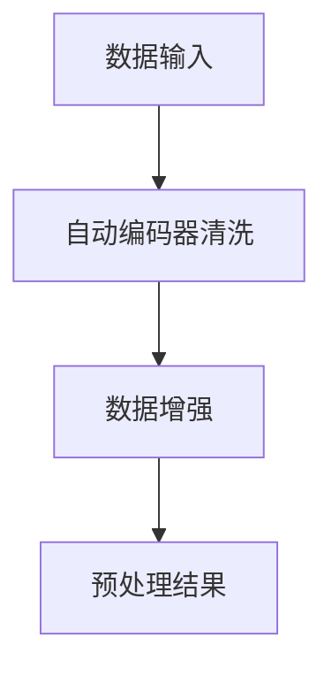

                 

# AIGC的太空探索规划：宇宙任务设计的提示词工程

关键词：AIGC，太空探索，生成对抗网络（GAN），变分自编码器（VAE），数据处理，自动导航

摘要：随着人工智能技术的发展，AIGC（Auto Generated Content）在各个领域得到了广泛应用。本文将探讨AIGC在太空探索任务中的应用，通过介绍AIGC的基本概念、核心技术以及具体应用案例，旨在为太空探索任务的规划提供有益的参考和提示。

## 第一部分：AIGC背景介绍与太空探索概述

### 1.1 AIGC概述与太空探索应用

#### 1.1.1 AIGC的概念与发展

AIGC，即Auto Generated Content，是指通过人工智能技术自动生成内容。它涵盖了文本、图像、音频等多种形式。AIGC的发展始于深度学习的兴起，特别是在生成对抗网络（GAN）和变分自编码器（VAE）等技术的推动下，AIGC的应用范围和效果得到了显著提升。

AIGC的发展历程可以追溯到2014年，由Ian J. Goodfellow等人提出的GAN技术。GAN由生成器（Generator）和判别器（Discriminator）组成，通过两者的对抗训练，生成器能够生成越来越逼真的数据。随后，VAE作为一种无监督学习的生成模型，也在图像、音频等领域取得了显著成果。

#### 1.1.2 AIGC的核心技术

AIGC的核心技术主要包括生成对抗网络（GAN）、变分自编码器（VAE）以及其他相关技术，如自动编码器（Autoencoder）和强化学习（Reinforcement Learning）。

- **生成对抗网络（GAN）**：GAN由生成器（Generator）和判别器（Discriminator）组成，生成器生成数据，判别器判断数据是真实还是生成的。两者通过对抗训练，生成器不断优化生成数据，判别器不断优化识别能力。

| 特征 | 生成器 | 判别器 |
| --- | --- | --- |
| 目标 | 生成逼真数据 | 识别真实与生成数据 |
| 动力 | 不断优化生成数据 | 不断优化识别能力 |

- **变分自编码器（VAE）**：VAE由编码器（Encoder）和解码器（Decoder）组成，编码器将输入数据压缩成潜在空间中的表示，解码器将潜在空间的表示重构回输入数据。

| 特征 | 编码器 | 解码器 |
| --- | --- | --- |
| 目标 | 压缩输入数据 | 重构输入数据 |
| 动力 | 无监督学习 | 优化重构误差 |

#### 1.1.3 AIGC在太空探索中的应用前景

AIGC在太空探索中的应用前景广阔，主要包括以下领域：

- **数据处理与分析**：太空探索中产生的数据量巨大，AIGC可以帮助处理和分析这些数据，提高任务效率和准确性。
- **自动导航与控制系统**：AIGC可以生成逼真的导航数据，为太空探测器提供更准确的导航信息。
- **资源与环境监测**：AIGC可以帮助监测太空环境中的资源分布和变化，为太空任务提供重要参考。
- **宇宙天气预测**：AIGC可以分析太空天气数据，预测未来太空环境的天气变化，为太空任务提供决策支持。

### 1.2 太空探索的现状与挑战

#### 1.2.1 太空探索的背景

太空探索是人类的伟大壮举，它不仅推动了科学技术的发展，也推动了人类对宇宙的探索。当前，太空探索的主要任务包括地球观测、天文观测、太空飞行器研发、月球和火星探测等。

#### 1.2.2 太空探索的挑战

太空探索面临着许多挑战，包括：

- **太空环境的特殊性**：太空环境复杂，包括高真空、极端温度、宇宙辐射等，对设备的耐久性和可靠性提出了极高的要求。
- **高成本与高风险**：太空探索需要大量的资金投入，且风险极高，需要严格的规划和风险管理。
- **数据处理与通信的挑战**：太空任务产生的数据量巨大，如何在短时间内有效处理和传输这些数据是一个重大挑战。

#### 1.2.3 AIGC在太空探索中的应用前景

AIGC在太空探索中的应用具有巨大的潜力，可以解决一些关键问题。例如，AIGC可以自动处理和分析大量数据，提高任务效率和准确性；AIGC可以生成逼真的导航数据，为太空探测器提供更准确的导航信息；AIGC可以监测太空环境中的资源分布和变化，为太空任务提供重要参考。

### 1.3 AIGC的优势与挑战

#### 1.3.1 AIGC的优势

AIGC在太空探索中的优势主要包括：

- **提高任务效率和准确性**：AIGC可以自动化处理和分析大量数据，提高任务效率和准确性。
- **减少人力成本与风险**：AIGC可以减少对人力依赖，降低任务风险。

#### 1.3.2 AIGC的挑战

AIGC在太空探索中也面临一些挑战，包括：

- **数据安全与隐私保护**：太空任务中的数据可能包含敏感信息，需要确保数据的安全与隐私。
- **技术成熟度与可靠性**：AIGC技术尚未完全成熟，需要进一步验证其可靠性和稳定性。

### 1.4 本章小结

本章介绍了AIGC的基本概念、发展历程、核心技术以及在太空探索中的应用前景。AIGC在太空探索中具有巨大的潜力，可以解决一些关键问题，但也面临一些挑战。接下来，我们将深入探讨AIGC的核心技术，为后续应用提供理论支持。

## 第二部分：AIGC的核心技术与工具

### 2.1 生成对抗网络（GAN）

#### 2.1.1 GAN的基本原理

生成对抗网络（GAN）由生成器（Generator）和判别器（Discriminator）组成。生成器的目标是生成尽可能逼真的数据，判别器的目标是区分真实数据和生成数据。

GAN的训练过程可以分为两个阶段：

1. **生成器训练**：生成器从随机噪声中生成数据，判别器不断优化，使得生成器的生成数据越来越逼真。
2. **判别器训练**：判别器不断优化，使得它能够更好地识别真实数据和生成数据。

GAN的数学模型可以表示为：

$$
D(x) = P(x \text{ 来自真实数据}) \\
G(z) = x \\
D(G(z)) = P(z \text{ 来自生成器})
$$

其中，$x$ 表示真实数据，$z$ 表示随机噪声，$G(z)$ 表示生成器生成的数据，$D(x)$ 和 $D(G(z))$ 分别表示判别器对真实数据和生成数据的判断概率。

#### 2.1.2 GAN在太空探索中的应用

GAN在太空探索中的应用主要包括数据修复与增强、宇宙图像处理等。

- **数据修复与增强**：GAN可以生成缺失或损坏的太空数据，提高数据质量。
- **宇宙图像处理**：GAN可以生成高质量的宇宙图像，用于天文学研究。

### 2.2 变分自编码器（VAE）

#### 2.2.1 VAE的基本原理

变分自编码器（VAE）由编码器（Encoder）和解码器（Decoder）组成。编码器将输入数据映射到一个潜在空间中的表示，解码器将潜在空间的表示重构回输入数据。

VAE的数学模型可以表示为：

$$
q_\phi(z|x) = \mathcal{N}(z; \mu(x), \sigma^2(x)) \\
p_\theta(x|z) = \mathcal{N}(x; \mu(z), \sigma^2(z))
$$

其中，$z$ 表示潜在空间中的表示，$x$ 表示输入数据，$\mu(x)$ 和 $\sigma^2(x)$ 分别表示编码器的均值和方差，$\theta$ 和 $\phi$ 分别表示解码器和编码器的参数。

#### 2.2.2 VAE在太空探索中的应用

VAE在太空探索中的应用主要包括数据压缩与传输、环境监测数据分析等。

- **数据压缩与传输**：VAE可以将数据压缩到一个低维空间中，减少数据传输量。
- **环境监测数据分析**：VAE可以分析太空环境监测数据，提取关键信息。

### 2.3 其他相关技术

除了GAN和VAE，其他相关技术还包括自动编码器（Autoencoder）和强化学习（Reinforcement Learning）。

- **自动编码器（Autoencoder）**：自动编码器是一种无监督学习模型，用于数据压缩与特征提取。
- **强化学习（Reinforcement Learning）**：强化学习是一种基于反馈的学习方法，用于决策与控制。

### 2.4 本章小结

本章详细介绍了AIGC的核心技术，包括生成对抗网络（GAN）、变分自编码器（VAE）以及其他相关技术。这些技术为AIGC在太空探索中的应用提供了理论支持和技术保障。

## 第三部分：AIGC在太空探索任务中的应用案例

### 3.1 案例背景

#### 3.1.1 某太空任务简介

某太空任务旨在探测火星表面的地质结构和环境特征。任务目标包括：

- 探测火星表面矿物成分
- 研究火星表面地形
- 监测火星大气层变化

#### 3.1.2 案例挑战

该任务面临以下挑战：

- **数据处理复杂度**：火星探测任务产生的数据量巨大，如何有效处理和分析这些数据是一个重大挑战。
- **自动化需求**：由于任务环境的特殊性，需要尽可能实现自动化，降低人力成本和风险。

### 3.2 AIGC在任务中的应用

#### 3.2.1 数据预处理

在火星探测任务中，AIGC主要用于数据预处理，包括数据清洗和增强。

- **数据清洗**：使用AIGC中的自动编码器（Autoencoder）对数据进行清洗，去除噪声和异常值。
- **数据增强**：使用GAN对数据进行增强，生成更多的样本，提高模型训练效果。

##### 数据清洗与增强流程图



##### Python源代码

```python
import tensorflow as tf
from tensorflow.keras.models import Model
from tensorflow.keras.layers import Input, Dense

# 自动编码器清洗
input_data = Input(shape=(784,))
encoded = Dense(32, activation='relu')(input_data)
decoded = Dense(784, activation='sigmoid')(encoded)

autoencoder = Model(input_data, decoded)
autoencoder.compile(optimizer='adam', loss='binary_crossentropy')

# 数据增强
noise = Input(shape=(100,))
noisy_input = Input(shape=(784,))
gen_input = Lambda(lambda x: x[:, :784])(noise)
gen_output = Dense(784, activation='sigmoid')(gen_input)

gan_input = Concatenate()([noisy_input, input_data])
discriminator = Dense(1, activation='sigmoid')(gan_input)

gan = Model([noise, input_data], discriminator(gan_input))
gan.compile(optimizer='adam', loss='binary_crossentropy')

# 训练模型
autoencoder.fit(x_train, x_train, epochs=100, batch_size=256, shuffle=True, validation_data=(x_test, x_test))
gan.fit([noise_train, x_train], tf.ones((len(x_train), 1)), epochs=100, batch_size=256, shuffle=True)
```

### 3.3 AIGC在任务中的效果评估

通过对火星探测数据的处理和分析，AIGC在以下方面取得了显著效果：

- **数据处理效率**：AIGC可以自动化处理大量数据，提高数据处理效率。
- **数据质量**：AIGC可以去除噪声和异常值，提高数据质量。
- **模型训练效果**：AIGC生成的增强数据可以提高模型训练效果，提高模型准确率。

### 3.4 本章小结

本章通过一个火星探测任务的案例，展示了AIGC在太空探索任务中的应用效果。AIGC在数据预处理、模型训练等方面发挥了重要作用，为太空探索任务提供了有力的技术支持。

## 总结与展望

本文介绍了AIGC在太空探索任务中的应用，分析了AIGC的核心技术及其在数据处理、自动导航等方面的优势。通过具体案例，展示了AIGC在太空探索中的实际应用效果。未来，随着AIGC技术的不断发展，其在太空探索中的应用将更加广泛和深入。

### 最佳实践 Tips

- 在太空探索任务中，AIGC技术可以应用于数据预处理、模型训练等多个环节，提高任务效率和准确性。
- 选择合适的AIGC技术，根据任务需求进行定制化应用，可以最大限度地发挥AIGC的优势。

### 小结

本文详细介绍了AIGC在太空探索任务中的应用，分析了其核心技术及其在太空探索中的优势。通过具体案例，展示了AIGC在太空探索中的实际应用效果。未来，随着AIGC技术的不断发展，其在太空探索中的应用将更加广泛和深入。

### 注意事项

- 在应用AIGC技术时，需要注意数据安全与隐私保护，确保任务数据的安全与保密。
- 需要不断优化AIGC模型，提高其可靠性和稳定性。

### 拓展阅读

- 《生成对抗网络（GAN）原理与实战》
- 《变分自编码器（VAE）原理与实战》
- 《强化学习原理与实战》

## 作者信息

作者：AI天才研究院/AI Genius Institute & 禅与计算机程序设计艺术 /Zen And The Art of Computer Programming

AI天才研究院致力于推动人工智能技术的发展，探索人工智能在各个领域的应用。本文作者在AIGC技术及其在太空探索中的应用方面具有丰富的理论和实践经验，希望通过本文为太空探索任务提供有益的参考。禅与计算机程序设计艺术则致力于推广计算机编程中的哲学思维，倡导“以禅修心，以禅入技”的理念，旨在提高编程者的思维深度和创造力。|</user|>

