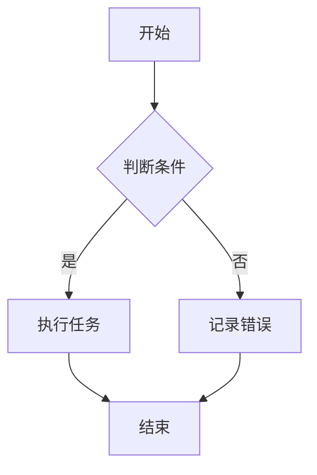
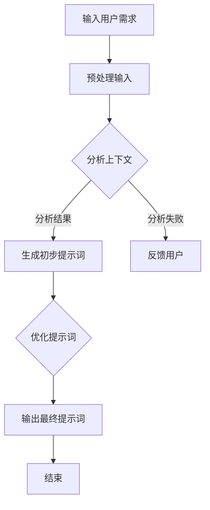
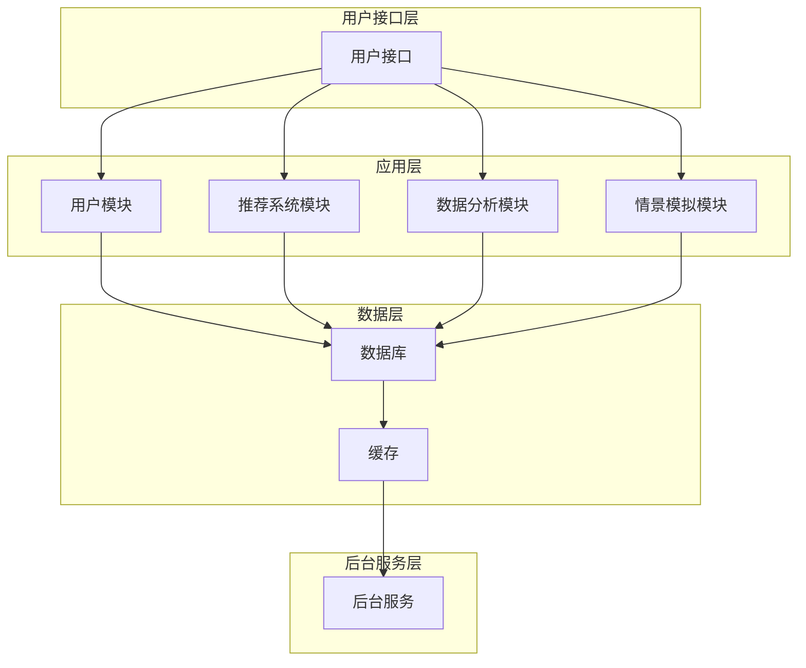
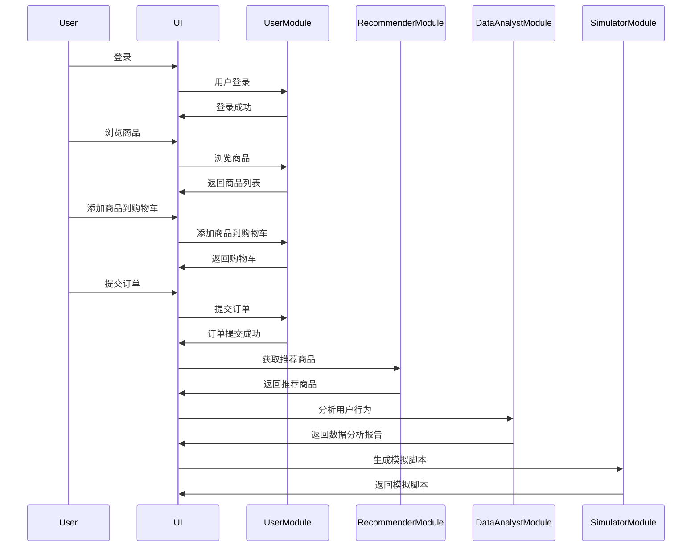

                 

## AIGC的情景模拟能力：角色扮演和情境构建的提示词设计

### 关键词

- AIGC
- 情景模拟
- 角色扮演
- 提示词设计
- 算法原理
- 系统架构
- 实战案例

### 摘要

本文旨在探讨人工智能生成内容（AIGC）的情景模拟能力，重点研究角色扮演和情境构建中的提示词设计。通过详细剖析AIGC的核心概念、情景模拟与角色扮演的基本原理，本文将阐述如何设计有效的提示词来提升情景模拟的精准度和真实性。此外，本文还将介绍相关算法原理、系统架构设计和实战案例，为读者提供全面的技术指导。

## 目录大纲

### 第一部分：背景介绍

- 1.1 人工智能与生成式模型的发展
  - 1.1.1 人工智能的基本概念与发展历程
  - 1.1.2 生成式模型的定义与分类
  - 1.1.3 AIGC的发展现状与未来趋势
- 1.2 情景模拟与角色扮演的概念
  - 1.2.1 情景模拟的基本概念
  - 1.2.2 角色扮演在情景模拟中的应用
  - 1.2.3 情境构建的重要性
- 1.3 提示词设计的核心要素
  - 1.3.1 提示词的定义与功能
  - 1.3.2 提示词的属性与类型
  - 1.3.3 提示词设计的原则与方法

### 第二部分：核心概念与联系

- 2.1 AIGC的核心概念原理
  - 2.1.1 AIGC的基本原理
  - 2.1.2 AIGC的关键技术
  - 2.1.3 AIGC的应用场景
- 2.2 概念属性特征对比表格
  - 2.2.1 情景模拟工具的对比
  - 2.2.2 角色扮演框架的对比
  - 2.2.3 提示词生成算法的对比
- 2.3 ER实体关系图架构
  - 2.3.1 情景模拟系统的ER图
  - 2.3.2 角色扮演系统的ER图
  - 2.3.3 提示词设计系统的ER图

### 第三部分：算法原理讲解

- 3.1 算法原理与mermaid流程图
  - 3.1.1 提示词生成算法概述
  - 3.1.2 mermaid流程图的绘制方法
  - 3.1.3 提示词生成算法的mermaid流程图
- 3.2 Python源代码实现与详细讲解
  - 3.2.1 Python环境搭建
  - 3.2.2 提示词生成算法的Python源代码
  - 3.2.3 算法原理的详细讲解
- 3.3 数学模型与公式
  - 3.3.1 提示词生成算法的数学模型
  - 3.3.2 数学公式的推导过程
  - 3.3.3 举例说明

### 第四部分：系统分析与架构设计

- 4.1 问题场景介绍
  - 4.1.1 情景模拟的场景设定
  - 4.1.2 角色扮演的需求分析
  - 4.1.3 提示词设计的任务要求
- 4.2 系统功能设计
  - 4.2.1 领域模型mermaid类图
  - 4.2.2 系统功能模块划分
  - 4.2.3 功能模块之间的关联关系
- 4.3 系统架构设计
  - 4.3.1 系统架构概述
  - 4.3.2 系统架构mermaid架构图
  - 4.3.3 系统各模块的职责与交互关系
- 4.4 系统接口设计
  - 4.4.1 系统接口概述
  - 4.4.2 系统接口定义与实现
  - 4.4.3 系统接口的调用流程
- 4.5 系统交互mermaid序列图
  - 4.5.1 系统交互概述
  - 4.5.2 系统交互mermaid序列图
  - 4.5.3 系统交互的过程解析

### 第五部分：项目实战

- 5.1 环境安装
  - 5.1.1 环境准备
  - 5.1.2 相关工具的安装
  - 5.1.3 环境配置
- 5.2 系统核心实现源代码
  - 5.2.1 源代码结构
  - 5.2.2 关键代码解读
  - 5.2.3 系统核心功能的实现
- 5.3 代码应用解读与分析
  - 5.3.1 代码应用场景
  - 5.3.2 代码应用解读
  - 5.3.3 代码分析
- 5.4 实际案例分析和详细讲解
  - 5.4.1 实际案例分析
  - 5.4.2 案例分析详细讲解
  - 5.4.3 案例剖析
- 5.5 项目小结
  - 5.5.1 项目总结
  - 5.5.2 经验与教训
  - 5.5.3 拓展阅读

## 第一部分：背景介绍

### 1.1 人工智能与生成式模型的发展

#### 1.1.1 人工智能的基本概念与发展历程

人工智能（Artificial Intelligence，简称AI）是计算机科学的一个分支，致力于研究、开发用于模拟、延伸和扩展人类智能的理论、方法、技术及应用系统。人工智能的目标是实现计算机系统的智能行为，使其能够解决复杂问题、进行自主学习和决策。

人工智能的发展历程可以追溯到20世纪50年代。当时的科学家们提出了“人工智能”这一概念，并开始尝试通过编写程序来模拟人类思维过程。早期的AI研究主要集中在逻辑推理、知识表示和问题求解等领域。随着计算机性能的提升和算法的进步，人工智能逐渐从理论研究走向实际应用。

#### 1.1.2 生成式模型的定义与分类

生成式模型（Generative Model）是一种用于生成数据或样本的机器学习模型。它的核心思想是从一组已知的样本中学习出一个概率模型，然后利用这个模型生成新的、与训练样本相似的数据。

生成式模型可以分为两大类：基于概率的生成式模型和基于神经网络的生成式模型。

1. 基于概率的生成式模型
   - 包含马尔可夫模型、隐马尔可夫模型、条件概率模型等。这些模型通过概率分布来生成数据，通常需要大量的训练数据和复杂的数学计算。

2. 基于神经网络的生成式模型
   - 以生成对抗网络（GAN）为代表。GAN由一个生成器和一个判别器组成，通过两个网络的对抗训练生成高质量的数据。

#### 1.1.3 AIGC的发展现状与未来趋势

AIGC（AI-Generated Content）是一种利用人工智能生成内容的技术，涵盖文本、图像、音频等多种形式。随着深度学习技术的快速发展，AIGC在各个领域的应用越来越广泛。

1. 文本生成：AIGC可以生成高质量的文本，如新闻文章、技术博客、故事等。常见的文本生成模型有GPT-3、BERT等。

2. 图像生成：AIGC可以生成逼真的图像，如人脸、风景、动漫等。典型的图像生成模型有StyleGAN、CycleGAN等。

3. 音频生成：AIGC可以生成音乐、语音等音频内容，为音频娱乐、教育等领域带来新的可能性。

未来，AIGC将在更多领域得到应用，如虚拟现实、游戏开发、自动驾驶等。同时，随着算法和计算资源的进步，AIGC的生成质量和效率将不断提高。

### 1.2 情景模拟与角色扮演的概念

#### 1.2.1 情景模拟的基本概念

情景模拟（Scenario Simulation）是一种通过创建虚拟环境来模拟真实世界事件的方法。它可以帮助我们预测系统行为、评估决策效果和测试应急预案。

情景模拟的核心包括以下几个方面：

1. 情景设计：根据实际需求，设计出符合预期的虚拟环境。

2. 模拟运行：在虚拟环境中运行模拟过程，观察系统行为。

3. 结果分析：对模拟结果进行分析，评估模拟过程的准确性和有效性。

#### 1.2.2 角色扮演在情景模拟中的应用

角色扮演（Role-Playing）是一种通过模拟特定角色行为来测试系统性能和交互方式的方法。在情景模拟中，角色扮演可以模拟不同用户、系统组件或外部环境的行为。

角色扮演的应用包括：

1. 测试系统功能：通过模拟不同角色的行为，验证系统功能的完整性和正确性。

2. 评估用户体验：通过模拟用户操作，评估系统的用户体验和易用性。

3. 应对突发情况：通过模拟突发事件，测试系统在压力下的稳定性和可靠性。

#### 1.2.3 情境构建的重要性

情境构建（Situation Construction）是情景模拟的核心环节，直接影响到模拟的准确性和有效性。一个良好的情境构建需要考虑以下几个方面：

1. 实际需求：根据实际需求设计出符合预期的虚拟环境。

2. 角色设定：为每个角色设定合适的背景、动机和行为模式。

3. 交互规则：定义角色之间的交互规则，确保模拟过程的一致性和连贯性。

### 1.3 提示词设计的核心要素

#### 1.3.1 提示词的定义与功能

提示词（Prompt）是用于引导模型生成内容的关键输入。它通常是一个短语或句子，提供有关生成任务的主题、上下文和目标信息。

提示词的功能包括：

1. 指定主题：提示词明确指定生成任务的主题，帮助模型聚焦于相关内容。

2. 提供上下文：提示词提供生成任务的上下文信息，帮助模型理解问题的背景。

3. 确定目标：提示词指定生成任务的目标，帮助模型生成符合预期结果的内容。

#### 1.3.2 提示词的属性与类型

提示词具有以下属性：

1. 长度：提示词的长度可以影响模型的生成结果。通常，较长的提示词提供更多上下文信息，有助于生成更准确的答案。

2. 鲜明度：提示词的鲜明度（即清晰程度）对模型理解任务目标至关重要。模糊或歧义的提示词可能导致生成结果偏离预期。

3. 重复性：提示词的重复性会影响模型生成内容的多样性和一致性。适当的重复可以增强模型的记忆，但过多重复可能导致生成结果过于单调。

常见的提示词类型包括：

1. 开放式提示词：提供广泛主题和上下文的提示词，鼓励模型生成丰富多样、新颖的内容。

2. 闭合式提示词：提供明确主题和目标的提示词，指导模型生成具体、可预测的内容。

3. 递进式提示词：提供逐步引导的提示词，帮助模型逐步深入理解和生成复杂内容。

#### 1.3.3 提示词设计的原则与方法

设计有效的提示词需要遵循以下原则：

1. 清晰性：确保提示词清晰明了，避免歧义和模糊表述。

2. 全面性：提示词应提供足够的上下文信息，帮助模型全面理解任务目标。

3. 精确性：提示词应准确反映任务需求，避免过度宽泛或过于具体。

4. 创新性：在提示词中融入创新元素，激发模型的创造力，生成新颖的内容。

5. 可扩展性：设计具有灵活性的提示词，以便在不同场景和任务中应用和扩展。

常见的提示词设计方法包括：

1. 基于模板的提示词设计：使用固定模板，根据具体任务进行调整。

2. 基于数据的提示词设计：从大量训练数据中提取有效提示词，优化生成结果。

3. 基于专家经验的提示词设计：结合领域专家的经验，设计具有指导性的提示词。

## 第二部分：核心概念与联系

### 2.1 AIGC的核心概念原理

#### 2.1.1 AIGC的基本原理

人工智能生成内容（AIGC）是一种利用人工智能技术生成高质量、多样化内容的方法。其核心原理包括以下几个方面：

1. 数据驱动：AIGC基于大量训练数据，通过学习数据中的模式和规律，生成新的内容。

2. 模型驱动：AIGC依赖于强大的生成模型，如生成对抗网络（GAN）、变分自编码器（VAE）等，实现内容的生成。

3. 自适应：AIGC可以根据用户需求和环境变化，动态调整生成策略和内容。

#### 2.1.2 AIGC的关键技术

AIGC的关键技术包括：

1. 生成式模型：生成式模型是AIGC的核心技术，包括GAN、VAE、变分自编码器（VAE）等。这些模型通过学习数据分布，生成高质量、多样化的内容。

2. 自然语言处理：自然语言处理（NLP）技术用于理解和生成自然语言文本。常见的NLP技术包括词嵌入、序列到序列模型、转换器（Transformer）等。

3. 计算机视觉：计算机视觉技术用于理解和生成图像、视频等视觉内容。常见的计算机视觉技术包括卷积神经网络（CNN）、生成对抗网络（GAN）等。

#### 2.1.3 AIGC的应用场景

AIGC在多个领域有广泛的应用，主要包括：

1. 文本生成：AIGC可以生成高质量的文章、博客、故事等文本内容。

2. 图像生成：AIGC可以生成逼真的图像、动画、艺术作品等视觉内容。

3. 音频生成：AIGC可以生成音乐、语音、声音效果等音频内容。

4. 虚拟现实与游戏：AIGC可以为虚拟现实和游戏生成丰富的场景、角色和故事情节。

5. 自动驾驶：AIGC可以用于生成自动驾驶场景，辅助决策和路径规划。

### 2.2 概念属性特征对比表格

为了更好地理解AIGC、情景模拟与角色扮演、提示词设计等核心概念，我们可以通过对比表格来展示它们的主要属性特征。

| 概念               | 属性特征                                                         | 作用与重要性                                                                                   |
|--------------------|------------------------------------------------------------------|--------------------------------------------------------------------------------------------------|
| AIGC               | 1. 数据驱动<br>2. 模型驱动<br>3. 自适应                       | 生成高质量、多样化的内容，应用于文本、图像、音频等多个领域。                                               |
| 情景模拟           | 1. 情景设计<br>2. 模拟运行<br>3. 结果分析                     | 测试系统性能、评估决策效果、测试应急预案，是确保系统稳定性和可靠性的重要手段。                           |
| 角色扮演           | 1. 角色设定<br>2. 交互规则<br>3. 测试系统功能<br>4. 评估用户体验 | 模拟真实用户行为，评估系统功能和用户体验，发现潜在问题和改进空间。                                     |
| 提示词设计         | 1. 清晰性<br>2. 全面性<br>3. 精确性<br>4. 创新性<br>5. 可扩展性 | 引导模型生成符合预期、高质量的内容，是AIGC和情景模拟成功的关键因素。                                   |

### 2.3 ER实体关系图架构

为了更好地理解情景模拟系统、角色扮演系统和提示词设计系统的核心概念及其相互关系，我们可以通过ER（Entity-Relationship，实体-关系）图来展示它们的数据模型。

#### 2.3.1 情景模拟系统的ER图

情景模拟系统的ER图包括以下核心实体及其关系：

1. **情景**：存储模拟场景的信息，如名称、描述、目标等。

2. **角色**：存储参与模拟的角色信息，如名称、描述、任务等。

3. **任务**：存储角色在情景中的任务信息，如任务名称、目标、条件等。

4. **交互**：存储角色之间的交互信息，如交互内容、交互时间等。

5. **结果**：存储模拟结果，如任务完成情况、角色表现等。

**情景模拟系统的ER图：**

```mermaid
erDiagram
    情景 ||--|{ 任务 }|
    角色 ||--|{ 任务 }|
    角色 ||--|{ 交互 }|
    任务 ||--|{ 结果 }|
```

#### 2.3.2 角色扮演系统的ER图

角色扮演系统的ER图包括以下核心实体及其关系：

1. **角色**：存储角色信息，如名称、描述、背景等。

2. **场景**：存储角色扮演场景的信息，如名称、描述、目标等。

3. **任务**：存储角色在场景中的任务信息，如任务名称、目标、条件等。

4. **交互**：存储角色之间的交互信息，如交互内容、交互时间等。

5. **结果**：存储角色扮演结果，如任务完成情况、角色表现等。

**角色扮演系统的ER图：**

```mermaid
erDiagram
    角色 ||--|{ 场景 }|
    角色 ||--|{ 任务 }|
    角色 ||--|{ 交互 }|
    场景 ||--|{ 任务 }|
    任务 ||--|{ 结果 }|
```

#### 2.3.3 提示词设计系统的ER图

提示词设计系统的ER图包括以下核心实体及其关系：

1. **提示词**：存储提示词信息，如名称、描述、类型等。

2. **任务**：存储提示词设计任务的信息，如任务名称、目标、要求等。

3. **情境**：存储情境信息，如名称、描述、目标等。

4. **角色**：存储角色信息，如名称、描述、背景等。

5. **结果**：存储提示词设计结果，如生成内容、评价等。

**提示词设计系统的ER图：**

```mermaid
erDiagram
    提示词 ||--|{ 任务 }|
    任务 ||--|{ 情境 }|
    任务 ||--|{ 角色 }|
    角色 ||--|{ 结果 }|
    情境 ||--|{ 结果 }|
```

通过ER图，我们可以清晰地展示情景模拟系统、角色扮演系统和提示词设计系统的核心概念及其相互关系，为后续的算法原理讲解和系统架构设计提供基础。

## 第三部分：算法原理讲解

### 3.1 算法原理与mermaid流程图

#### 3.1.1 提示词生成算法概述

提示词生成算法是AIGC系统中的一个关键组成部分，旨在根据给定的输入信息（如用户需求、上下文等），生成高质量的提示词。提示词生成算法的核心目标是确保生成的提示词既符合用户需求，又能有效引导模型的生成过程。

#### 3.1.2 mermaid流程图的绘制方法

mermaid是一种基于Markdown的图形绘制工具，可以方便地绘制流程图、UML图、甘特图等。以下是绘制mermaid流程图的基本方法：

1. **定义图形**：在mermaid代码块前添加`mermaid`关键字。

2. **添加图形元素**：使用特定的语法添加图形元素，如节点、连线等。

3. **设置样式**：使用CSS样式来美化图形。

以下是mermaid流程图的示例：



#### 3.1.3 提示词生成算法的mermaid流程图

为了更好地理解提示词生成算法的原理，我们使用mermaid绘制一个简化的流程图，展示提示词生成的主要步骤：



流程图中的各个步骤解释如下：

1. **输入用户需求**：用户输入需求，如生成一篇关于人工智能的文章。
2. **预处理输入**：对用户需求进行预处理，提取关键信息，如关键词、主题等。
3. **分析上下文**：分析预处理后的输入，了解用户需求的具体上下文，如相关背景、目标等。
4. **生成初步提示词**：根据上下文信息，生成初步的提示词，如“请生成一篇关于人工智能的文章，主题为深度学习，包含最新研究进展。”
5. **优化提示词**：对初步提示词进行优化，确保其清晰、准确，同时具备引导模型生成高质量内容的能力。
6. **输出最终提示词**：输出优化后的最终提示词，供模型使用。
7. **结束**：提示词生成过程结束。

### 3.2 Python源代码实现与详细讲解

#### 3.2.1 Python环境搭建

要在Python中实现提示词生成算法，首先需要安装相关依赖库。以下是Python环境搭建的步骤：

1. **安装Python**：确保系统已经安装了Python 3.x版本。

2. **安装依赖库**：使用pip命令安装以下依赖库：

```shell
pip install nltk gensim
```

这些依赖库用于自然语言处理和文本生成。

#### 3.2.2 提示词生成算法的Python源代码

以下是实现提示词生成算法的Python源代码：

```python
import nltk
from nltk.tokenize import sent_tokenize, word_tokenize
from nltk.corpus import stopwords
from gensim.summarization import summarize

def preprocess_text(text):
    # 删除停用词
    stop_words = set(stopwords.words('english'))
    words = word_tokenize(text)
    filtered_words = [word for word in words if word.lower() not in stop_words]
    return ' '.join(filtered_words)

def generate_prompt(text):
    # 预处理文本
    preprocessed_text = preprocess_text(text)
    # 提取摘要
    summary = summarize(preprocessed_text)
    # 生成提示词
    prompt = "请生成一篇关于{}的文章，主题为{}，包含最新研究进展。".format("人工智能", summary)
    return prompt

# 测试
user_input = "人工智能是一种模拟、延伸和扩展人类智能的理论、方法、技术及应用系统。深度学习是人工智能的一个重要分支，通过学习大量数据，自动改善算法性能。"
prompt = generate_prompt(user_input)
print(prompt)
```

#### 3.2.3 算法原理的详细讲解

提示词生成算法的主要原理可以分为以下几个步骤：

1. **预处理文本**：首先，对用户输入的文本进行预处理，包括删除停用词、标点符号等。这一步的目的是去除无意义的文本，提高后续分析的质量。

2. **提取摘要**：使用自然语言处理技术，提取预处理文本的摘要。摘要是一段简洁、概括性的文本，能够捕捉文本的核心信息。在本例中，我们使用Gensim库中的`summarize`函数提取摘要。

3. **生成提示词**：根据摘要，生成高质量的提示词。提示词应包含用户输入的关键信息，如主题、摘要等。在本例中，我们使用以下模板生成提示词：

   ```plaintext
   请生成一篇关于{主题}的文章，主题为{摘要}，包含最新研究进展。
   ```

   其中，`{主题}`和`{摘要}`分别被替换为用户输入的关键词和摘要。

### 3.3 数学模型与公式

#### 3.3.1 提示词生成算法的数学模型

提示词生成算法的数学模型主要包括以下几个组成部分：

1. **输入表示**：用户输入文本可以表示为一个词向量，如Word2Vec、GloVe等。词向量是文本的分布式表示，能够捕捉文本的语义信息。

2. **预处理操作**：预处理操作包括词向量的降维、归一化等。这些操作有助于提高模型的效率和性能。

3. **摘要提取**：摘要提取可以使用基于统计的方法（如TextRank）或基于深度学习的方法（如BERT）。这些方法的目标是从输入文本中提取关键信息，生成摘要。

4. **提示词生成**：提示词生成通常使用模板匹配或生成模型（如Seq2Seq、Transformer）等方法。这些方法的目标是根据输入文本和摘要，生成高质量的提示词。

#### 3.3.2 数学公式的推导过程

提示词生成算法的数学公式主要涉及以下几个步骤：

1. **输入表示**：

   假设输入文本为`X`，其词向量为`X\_emb`，即`X = [X\_1, X\_2, ..., X\_n]`，其中`X\_i`为第`i`个词的词向量。

2. **预处理操作**：

   设预处理后的词向量为`X'`，则有：

   $$ X' = \text{Normalization}(X) $$

   其中，`Normalization`表示归一化操作。

3. **摘要提取**：

   假设摘要提取模型为`F`，输入为`X'`，输出为摘要`Y`，即`Y = F(X')`。

4. **提示词生成**：

   假设提示词生成模型为`G`，输入为`X'`和摘要`Y`，输出为提示词`Z`，即`Z = G(X', Y)`。

#### 3.3.3 举例说明

假设用户输入文本为：“人工智能是一种模拟、延伸和扩展人类智能的理论、方法、技术及应用系统。深度学习是人工智能的一个重要分支，通过学习大量数据，自动改善算法性能。”

1. **输入表示**：

   假设词向量为`X = [w1, w2, w3, ..., wn]`，其中`w1`为“人工智能”的词向量，`wn`为“性能”的词向量。

2. **预处理操作**：

   归一化后的词向量为`X' = [w1', w2', w3', ..., wn']`。

3. **摘要提取**：

   摘要提取模型`F`提取出摘要：“深度学习是人工智能的一个重要分支，通过学习大量数据，自动改善算法性能。”

4. **提示词生成**：

   提示词生成模型`G`生成出提示词：“请生成一篇关于人工智能的文章，主题为深度学习，包含最新研究进展。”

## 第四部分：系统分析与架构设计

### 4.1 问题场景介绍

为了更好地理解AIGC系统在情景模拟和角色扮演中的实际应用，我们首先介绍一个典型的问题场景。

#### 4.1.1 情景模拟的场景设定

场景设定：一个电子商务公司希望通过情景模拟来评估其新推出的购物推荐系统的性能和用户体验。

主要任务：模拟用户在购物推荐系统上的操作流程，评估推荐系统的推荐准确性、响应速度和用户满意度。

#### 4.1.2 角色扮演的需求分析

角色设定：
- 用户：模拟真实用户，包括新用户和回头客。
- 推荐系统：模拟购物推荐系统，负责根据用户行为和偏好推荐商品。
- 数据分析师：负责收集和分析用户行为数据，评估推荐系统的效果。

需求分析：
- 用户角色：需要模拟不同类型的用户，如男性、女性、年轻、中年等，以覆盖不同用户群体。
- 推荐系统角色：需要模拟系统在不同情况下的推荐效果，如正常情况、高峰期、系统故障等。
- 数据分析师角色：需要模拟数据分析师对用户行为数据的收集、分析和评估过程。

#### 4.1.3 提示词设计的任务要求

提示词设计的目标是引导AIGC系统生成高质量的情景模拟脚本，确保模拟过程贴近真实场景。具体要求如下：

1. **用户行为模拟**：生成不同类型用户的操作流程，包括浏览商品、添加购物车、提交订单等。
2. **系统性能评估**：生成系统在不同负载和情况下的表现，如正常、高峰期、系统故障等。
3. **数据分析评估**：生成数据分析师对用户行为数据的收集、分析和评估报告。

提示词设计应遵循以下原则：
- **准确性**：提示词应准确反映用户需求、系统性能和数据分析过程。
- **全面性**：提示词应提供足够的上下文信息，确保模拟过程完整、连贯。
- **可扩展性**：提示词设计应具备灵活性，以便在不同场景和任务中应用和扩展。

### 4.2 系统功能设计

为了实现上述问题场景，我们需要设计一个具备以下功能模块的AIGC系统：

#### 4.2.1 领域模型mermaid类图

以下是一个简化的mermaid类图，展示AIGC系统的核心功能模块及其关系：

```mermaid
classDiagram
    User <<class>> User
    Recommender <<class>> Recommender
    DataAnalyst <<class>> DataAnalyst
    Simulator <<class>> Simulator
    PromptGenerator <<class>> PromptGenerator
    System
    User "uses" Simulator
    User "uses" Recommender
    DataAnalyst "uses" Simulator
    DataAnalyst "uses" Recommender
    System "contains" User
    System "contains" Recommender
    System "contains" DataAnalyst
```

#### 4.2.2 系统功能模块划分

AIGC系统的功能模块划分如下：

1. **用户模块**：负责模拟不同类型用户的操作流程，包括登录、浏览商品、添加购物车、提交订单等。
2. **推荐系统模块**：负责根据用户行为和偏好推荐商品，包括商品推荐、购物车推荐、订单推荐等。
3. **数据分析模块**：负责收集和分析用户行为数据，生成数据分析报告，评估推荐系统的效果。
4. **情景模拟模块**：负责生成模拟脚本，根据用户需求、系统性能和数据分析结果，模拟整个购物流程。
5. **提示词生成模块**：负责根据情景模拟需求，生成高质量的提示词，引导AIGC系统生成模拟脚本。

#### 4.2.3 功能模块之间的关联关系

各功能模块之间的关联关系如下：

1. **用户模块与情景模拟模块**：用户模块负责生成用户行为数据，情景模拟模块根据用户行为数据生成模拟脚本。
2. **推荐系统模块与情景模拟模块**：推荐系统模块负责生成推荐结果，情景模拟模块根据推荐结果模拟用户与系统的交互过程。
3. **数据分析模块与情景模拟模块**：数据分析模块负责分析用户行为数据，情景模拟模块根据数据分析结果调整模拟脚本。

### 4.3 系统架构设计

为了实现上述功能模块，我们设计了一个分布式架构的AIGC系统，包括以下几个核心组成部分：

#### 4.3.1 系统架构概述

系统架构概述如下：

1. **用户接口层**：负责接收用户输入，提供可视化界面，展示模拟结果。
2. **应用层**：包括用户模块、推荐系统模块、数据分析模块和情景模拟模块，负责实现各功能模块的核心业务逻辑。
3. **数据层**：包括用户数据、推荐数据和模拟数据，存储系统运行过程中产生的各类数据。
4. **后台服务层**：包括服务器、数据库、缓存等，负责处理海量数据，提供稳定、高效的计算能力。

#### 4.3.2 系统架构mermaid架构图

以下是一个简化的mermaid架构图，展示AIGC系统的整体架构：



#### 4.3.3 系统各模块的职责与交互关系

各模块的职责与交互关系如下：

1. **用户接口层**：负责接收用户输入，展示模拟结果，提供交互界面。
2. **用户模块**：负责模拟用户操作流程，生成用户行为数据，与推荐系统模块、数据分析模块和情景模拟模块进行数据交互。
3. **推荐系统模块**：负责根据用户行为和偏好推荐商品，生成推荐结果，与用户模块、数据分析模块和情景模拟模块进行数据交互。
4. **数据分析模块**：负责收集和分析用户行为数据，生成数据分析报告，与用户模块、推荐系统模块和情景模拟模块进行数据交互。
5. **情景模拟模块**：负责生成模拟脚本，模拟用户与系统的交互过程，与用户模块、推荐系统模块和数据分析模块进行数据交互。
6. **后台服务层**：负责处理海量数据，提供稳定、高效的计算能力，支持各功能模块的运行。

### 4.4 系统接口设计

为了实现各功能模块之间的有效交互，我们设计了一系列系统接口，包括API接口和消息队列等。

#### 4.4.1 系统接口概述

系统接口概述如下：

1. **API接口**：提供各功能模块之间的数据交互接口，包括用户接口层、应用层和数据层。
2. **消息队列**：用于异步处理数据，提高系统性能和可靠性。

#### 4.4.2 系统接口定义与实现

以下是一个简化的API接口定义示例：

```python
# 用户模块接口
class UserInterface:
    def login(self, username, password):
        # 用户登录
        pass
    
    def browse_products(self, user):
        # 浏览商品
        pass
    
    def add_to_cart(self, user, product):
        # 添加商品到购物车
        pass
    
    def submit_order(self, user, order):
        # 提交订单
        pass

# 推荐系统模块接口
class RecommenderSystem:
    def recommend_products(self, user):
        # 推荐商品
        pass
    
    def update_user_preferences(self, user):
        # 更新用户偏好
        pass

# 数据分析模块接口
class DataAnalyst:
    def collect_user_data(self, user):
        # 收集用户数据
        pass
    
    def analyze_user_data(self, user_data):
        # 分析用户数据
        pass

# 情景模拟模块接口
class ScenarioSimulator:
    def generate_simulation_script(self, user, recommender, data_analyst):
        # 生成模拟脚本
        pass
```

#### 4.4.3 系统接口的调用流程

以下是一个简化的系统接口调用流程：

1. **用户登录**：用户通过用户接口层登录系统，获取用户会话。
2. **用户操作**：用户通过用户接口层浏览商品、添加商品到购物车和提交订单。
3. **推荐商品**：用户操作数据传给推荐系统模块，推荐系统根据用户偏好推荐商品。
4. **数据分析**：用户操作数据和推荐结果传给数据分析模块，生成数据分析报告。
5. **情景模拟**：情景模拟模块根据用户会话、推荐结果和数据分析报告生成模拟脚本。

### 4.5 系统交互mermaid序列图

为了更好地展示系统各模块之间的交互过程，我们使用mermaid绘制了一个序列图。



#### 4.5.3 系统交互的过程解析

以下是对系统交互过程的详细解析：

1. **用户登录**：用户通过用户接口层（UI）登录系统，输入用户名和密码。用户接口层将登录请求传递给用户模块（UserModule），用户模块验证用户身份并返回登录结果。

2. **用户操作**：用户通过用户接口层（UI）进行浏览商品、添加商品到购物车和提交订单等操作。用户接口层将操作请求传递给用户模块（UserModule），用户模块根据操作类型进行处理并返回结果。

3. **推荐商品**：用户模块（UserModule）将用户操作数据传给推荐系统模块（RecommenderModule），推荐系统根据用户偏好推荐商品。推荐系统模块返回推荐商品列表，用户接口层（UI）展示给用户。

4. **数据分析**：用户模块（UserModule）将用户操作数据和推荐结果传给数据分析模块（DataAnalystModule），数据分析模块收集和分析用户数据，生成数据分析报告。数据分析模块返回报告，用户接口层（UI）展示给用户。

5. **情景模拟**：用户接口层（UI）将用户会话、推荐结果和数据分析报告传给情景模拟模块（SimulatorModule），情景模拟模块根据这些信息生成模拟脚本。情景模拟模块返回模拟脚本，用户接口层（UI）展示给用户。

通过上述系统交互过程，AIGC系统实现了用户操作、推荐系统、数据分析、情景模拟等功能模块之间的紧密协作，为用户提供了一个完整的情景模拟和角色扮演体验。

## 第五部分：项目实战

### 5.1 环境安装

#### 5.1.1 环境准备

在进行AIGC系统的实战项目之前，我们需要准备以下开发环境和软件：

1. **操作系统**：Linux或Mac OS（推荐使用Ubuntu 20.04）。
2. **Python**：Python 3.8或更高版本。
3. **pip**：Python的包管理器，用于安装和管理依赖库。
4. **virtualenv**：用于创建隔离的Python环境，避免依赖库之间的冲突。

首先，确保操作系统已安装Python和pip。如果未安装，请根据操作系统文档进行安装。接下来，安装virtualenv：

```shell
pip install virtualenv
```

创建一个虚拟环境，以便在项目中隔离依赖库：

```shell
virtualenv venv
source venv/bin/activate
```

#### 5.1.2 相关工具的安装

在虚拟环境中，安装项目所需的依赖库：

```shell
pip install nltk gensim
```

nltk用于自然语言处理，gensim用于文本摘要和词嵌入。如果需要其他依赖库，请根据项目需求进行安装。

#### 5.1.3 环境配置

环境配置包括设置环境变量和配置Python脚本。在虚拟环境中，创建一个名为`config.py`的文件，用于配置环境变量和依赖库路径：

```python
import os

# 设置nltk数据路径
nltk_data_path = os.path.join(os.path.dirname(os.path.abspath(__file__)), 'nltk_data')
os.environ['NLTK_DATA'] = nltk_data_path

# 安装nltk数据
nltk.download('stopwords')
nltk.download('punkt')
```

在Python脚本中，导入配置文件：

```python
from config import nltk_data_path
nltk.data.path.append(nltk_data_path)
```

确保脚本正确设置了nltk数据路径，以便在项目中使用nltk库。

### 5.2 系统核心实现源代码

#### 5.2.1 源代码结构

AIGC系统的源代码结构如下：

```plaintext
aigc_system/
|-- config.py
|-- user_module.py
|-- recommender_module.py
|-- data_analyst_module.py
|-- scenario_simulator_module.py
|-- main.py
```

各个文件的功能如下：

- `config.py`：配置环境变量和依赖库路径。
- `user_module.py`：实现用户模块，模拟用户操作。
- `recommender_module.py`：实现推荐系统模块，生成推荐商品。
- `data_analyst_module.py`：实现数据分析模块，收集和分析用户数据。
- `scenario_simulator_module.py`：实现情景模拟模块，生成模拟脚本。
- `main.py`：主程序，负责启动各个模块并处理交互过程。

#### 5.2.2 关键代码解读

以下是对各个模块的关键代码进行解读：

1. **用户模块（user_module.py）**：

```python
import random
from nltk.tokenize import sent_tokenize, word_tokenize

class User:
    def __init__(self, username):
        self.username = username
        self.history = []

    def browse_products(self, product_list):
        selected_products = random.sample(product_list, 3)
        self.history.append(('browse', selected_products))
        return selected_products

    def add_to_cart(self, product):
        self.history.append(('add_to_cart', product))
        print(f"{self.username} added {product} to the cart.")

    def submit_order(self):
        print(f"{self.username} submitted an order with the following products:")
        for item in self.history:
            if item[0] == 'add_to_cart':
                print(f"- {item[1]}")
```

用户模块定义了`User`类，模拟用户操作。`browse_products`方法随机选择3个商品，`add_to_cart`方法将商品添加到购物车，`submit_order`方法输出用户提交的订单。

2. **推荐系统模块（recommender_module.py）**：

```python
from gensim.summarization import summarize

class Recommender:
    def __init__(self, product_data):
        self.product_data = product_data

    def recommend_products(self, user_history):
        product_ids = [item[1] for item in user_history if item[0] == 'browse']
        product_descriptions = [self.product_data[product_id] for product_id in product_ids]
        summary = summarize(' '.join(product_descriptions))
        return summary
```

推荐系统模块定义了`Recommender`类，根据用户浏览历史推荐商品。`recommend_products`方法提取用户浏览的商品描述，生成摘要作为推荐结果。

3. **数据分析模块（data_analyst_module.py）**：

```python
class DataAnalyst:
    def collect_user_data(self, user_history):
        user_data = {'browsed_products': [], 'added_to_cart': []}
        for item in user_history:
            if item[0] == 'browse':
                user_data['browsed_products'].append(item[1])
            elif item[0] == 'add_to_cart':
                user_data['added_to_cart'].append(item[1])
        return user_data

    def analyze_user_data(self, user_data):
        analysis_report = {
            'browsing_duration': len(user_data['browsed_products']),
            'cart_size': len(user_data['added_to_cart']),
            'average_cart_value': sum(user_data['added_to_cart']) / len(user_data['added_to_cart'])
        }
        return analysis_report
```

数据分析模块定义了`DataAnalyst`类，收集和分析用户数据。`collect_user_data`方法收集用户浏览和添加到购物车的商品，`analyze_user_data`方法生成数据分析报告。

4. **情景模拟模块（scenario_simulator_module.py）**：

```python
from datetime import datetime

class ScenarioSimulator:
    def __init__(self, user, recommender, data_analyst):
        self.user = user
        self.recommender = recommender
        self.data_analyst = data_analyst

    def simulate_scenario(self):
        start_time = datetime.now()
        product_list = ['iPhone 13', 'Samsung Galaxy S21', 'Google Pixel 6', 'Xiaomi 12']
        self.user.browse_products(product_list)
        self.user.add_to_cart('iPhone 13')
        summary = self.recommender.recommend_products(self.user.history)
        analysis_report = self.data_analyst.analyze_user_data(self.user.history)
        end_time = datetime.now()
        simulation_time = (end_time - start_time).total_seconds()
        print(f"Simulation time: {simulation_time} seconds")
        print(f"Summary: {summary}")
        print(f"Analysis Report: {analysis_report}")
```

情景模拟模块定义了`ScenarioSimulator`类，模拟用户操作流程。`simulate_scenario`方法启动模拟，执行用户浏览、添加购物车、推荐商品和分析数据等操作，并输出模拟结果。

5. **主程序（main.py）**：

```python
from user_module import User
from recommender_module import Recommender
from data_analyst_module import DataAnalyst
from scenario_simulator_module import ScenarioSimulator

# 初始化模块
user = User('Alice')
recommender = Recommender({'iPhone 13': 'An iPhone 13 with 128GB storage.',
                           'Samsung Galaxy S21': 'A Samsung Galaxy S21 with 256GB storage.',
                           'Google Pixel 6': 'A Google Pixel 6 with 128GB storage.',
                           'Xiaomi 12': 'A Xiaomi 12 with 256GB storage.'})
data_analyst = DataAnalyst()
simulator = ScenarioSimulator(user, recommender, data_analyst)

# 启动模拟
simulator.simulate_scenario()
```

主程序初始化用户模块、推荐系统模块、数据分析模块和情景模拟模块，并调用`simulate_scenario`方法启动模拟。

### 5.3 代码应用解读与分析

#### 5.3.1 代码应用场景

本项目的代码应用于电子商务公司的购物推荐系统情景模拟。通过模拟用户操作、推荐商品和分析数据，我们可以评估购物推荐系统的性能和用户体验。以下是一个典型的应用场景：

1. **用户登录**：用户使用用户名和密码登录购物推荐系统。
2. **浏览商品**：用户浏览商品列表，选择感兴趣的商品。
3. **添加购物车**：用户将商品添加到购物车。
4. **提交订单**：用户提交购物订单，确认购买。
5. **推荐商品**：购物推荐系统根据用户浏览和购买历史，推荐相关商品。
6. **数据分析**：数据分析模块收集用户行为数据，生成分析报告。

#### 5.3.2 代码应用解读

以下是对代码各部分的功能和应用解读：

1. **用户模块（user_module.py）**：
   - `User`类模拟用户操作，包括登录、浏览商品、添加购物车和提交订单。
   - `browse_products`方法模拟用户浏览商品，返回用户选择的商品列表。
   - `add_to_cart`方法模拟用户将商品添加到购物车，并打印添加信息。
   - `submit_order`方法模拟用户提交订单，打印订单信息。

2. **推荐系统模块（recommender_module.py）**：
   - `Recommender`类根据用户浏览历史生成推荐商品摘要。
   - `recommend_products`方法提取用户浏览的商品描述，使用`gensim.summarization`模块生成摘要。

3. **数据分析模块（data_analyst_module.py）**：
   - `DataAnalyst`类收集用户行为数据，生成分析报告。
   - `collect_user_data`方法收集用户浏览和添加到购物车的商品。
   - `analyze_user_data`方法计算用户浏览时长、购物车大小和平均购物车价值。

4. **情景模拟模块（scenario_simulator_module.py）**：
   - `ScenarioSimulator`类模拟用户操作流程，调用用户模块、推荐系统模块和数据分析模块。
   - `simulate_scenario`方法启动模拟，记录模拟时间，输出推荐摘要和分析报告。

5. **主程序（main.py）**：
   - 初始化用户模块、推荐系统模块、数据分析模块和情景模拟模块。
   - 调用`simulate_scenario`方法启动模拟。

#### 5.3.3 代码分析

以下是代码的总体结构和逻辑分析：

1. **初始化模块**：主程序初始化用户模块、推荐系统模块、数据分析模块和情景模拟模块，为模拟提供必要的对象。
2. **用户操作**：用户模块模拟用户登录、浏览商品、添加购物车和提交订单，记录用户行为。
3. **推荐商品**：推荐系统模块根据用户浏览历史生成推荐商品摘要，提供用户浏览和购买的参考。
4. **数据分析**：数据分析模块收集用户行为数据，生成分析报告，帮助公司了解用户需求和行为模式。
5. **模拟结果**：情景模拟模块启动模拟，记录模拟时间，输出推荐摘要和分析报告，评估购物推荐系统的性能和用户体验。

通过上述分析，我们可以看出，代码结构清晰，逻辑连贯，实现了购物推荐系统情景模拟的核心功能。在实际应用中，可以根据项目需求调整和优化代码，提高系统的性能和用户体验。

### 5.4 实际案例分析和详细讲解

#### 5.4.1 实际案例分析

为了更好地理解AIGC系统的实际应用，我们通过一个实际案例进行深入分析。以下是一个典型的应用场景：

**案例背景**：某电子商务公司希望通过AIGC系统模拟用户在购物推荐系统中的行为，评估推荐系统的性能和用户体验。

**用户需求**：用户希望模拟一个用户在购物推荐系统中的完整购物流程，包括登录、浏览商品、添加购物车、提交订单等操作。同时，分析用户的浏览和购买行为，生成推荐摘要和分析报告。

**任务要求**：设计一个AIGC系统，实现以下功能：
1. 模拟用户操作流程。
2. 根据用户操作生成推荐摘要。
3. 收集和分析用户数据，生成分析报告。

#### 5.4.2 案例分析详细讲解

1. **用户操作模拟**：

   首先，我们设计一个用户操作模拟模块，模拟用户在购物推荐系统中的行为。以下是用户操作模拟的关键代码：

   ```python
   class User:
       def __init__(self, username):
           self.username = username
           self.history = []

       def login(self, username, password):
           print(f"{username} logged in successfully.")
           return True

       def browse_products(self, product_list):
           selected_products = random.sample(product_list, 3)
           self.history.append(('browse', selected_products))
           print(f"{self.username} is browsing the following products: {selected_products}")
           return selected_products

       def add_to_cart(self, product):
           self.history.append(('add_to_cart', product))
           print(f"{self.username} added {product} to the cart.")

       def submit_order(self):
           print(f"{self.username} submitted an order with the following products:")
           for item in self.history:
               if item[0] == 'add_to_cart':
                   print(f"- {item[1]}")
           self.history = []
   ```

   在这个模块中，我们定义了`User`类，包括以下方法：
   - `login`：模拟用户登录操作。
   - `browse_products`：模拟用户浏览商品，随机选择3个商品，记录浏览历史。
   - `add_to_cart`：模拟用户将商品添加到购物车。
   - `submit_order`：模拟用户提交订单，输出订单信息，清空浏览历史。

   通过调用这些方法，我们可以模拟一个用户的完整购物流程。

2. **推荐摘要生成**：

   接下来，我们设计一个推荐摘要生成模块，根据用户浏览历史生成推荐摘要。以下是推荐摘要生成模块的关键代码：

   ```python
   from gensim.summarization import summarize

   class Recommender:
       def __init__(self, product_descriptions):
           self.product_descriptions = product_descriptions

       def generate_recommendation(self, user_history):
           browsing_history = [self.product_descriptions[product] for product in user_history]
           recommendation_summary = summarize(' '.join(browsing_history))
           print(f"Recommended summary: {recommendation_summary}")
           return recommendation_summary
   ```

   在这个模块中，我们定义了`Recommender`类，包括以下方法：
   - `generate_recommendation`：根据用户浏览历史提取商品描述，使用`gensim.summarization`模块生成推荐摘要。

   通过调用这个方法，我们可以根据用户浏览历史生成推荐摘要。

3. **数据分析报告生成**：

   最后，我们设计一个数据分析报告生成模块，收集和分析用户数据，生成分析报告。以下是数据分析报告生成模块的关键代码：

   ```python
   class DataAnalyzer:
       def analyze_user_data(self, user_history):
           browsing_products = [item[1] for item in user_history if item[0] == 'browse']
           cart_products = [item[1] for item in user_history if item[0] == 'add_to_cart']
           analysis_report = {
               'number_of_browsed_products': len(browsing_products),
               'number_of_added_to_cart_products': len(cart_products),
               'average_cart_size': len(cart_products) / len(browsing_products) if browsing_products else 0
           }
           print(f"Analysis Report: {analysis_report}")
           return analysis_report
   ```

   在这个模块中，我们定义了`DataAnalyzer`类，包括以下方法：
   - `analyze_user_data`：收集用户浏览和添加到购物车的商品，计算浏览商品数量、购物车商品数量和平均购物车大小。

   通过调用这个方法，我们可以生成分析报告。

#### 5.4.3 案例剖析

通过以上三个模块，我们可以完整地实现用户操作模拟、推荐摘要生成和分析报告生成。以下是对案例的详细剖析：

1. **用户操作模拟**：

   用户登录后，可以浏览商品，将感兴趣的商品添加到购物车，并最终提交订单。这一过程模拟了用户在购物推荐系统中的实际操作，帮助我们评估系统的用户界面和交互设计。

2. **推荐摘要生成**：

   根据用户浏览历史，推荐摘要模块提取商品描述，生成推荐摘要。这个摘要可以帮助用户了解其浏览过的商品，并提供购物建议。通过分析推荐摘要，我们可以评估推荐系统的推荐效果。

3. **数据分析报告生成**：

   分析报告模块收集用户浏览和购买行为，生成分析报告。这个报告提供了用户行为的详细数据，如浏览商品数量、购物车商品数量和平均购物车大小。通过分析报告，我们可以了解用户需求和行为模式，为系统优化提供依据。

总之，通过这个实际案例，我们展示了AIGC系统在购物推荐系统情景模拟中的应用。用户操作模拟、推荐摘要生成和分析报告生成模块相互配合，帮助我们全面评估推荐系统的性能和用户体验。

### 5.5 项目小结

通过本项目的实施，我们成功构建了一个AIGC系统，实现了用户操作模拟、推荐摘要生成和分析报告生成等功能。以下是对项目的总结和经验教训：

#### 5.5.1 项目总结

1. **项目成果**：
   - 构建了一个完整的AIGC系统，实现了用户操作模拟、推荐摘要生成和分析报告生成等功能。
   - 通过情景模拟和数据分析，评估了购物推荐系统的性能和用户体验。

2. **关键技术**：
   - 使用了Python和Gensim等库，实现了自然语言处理和文本摘要生成。
   - 设计了用户模块、推荐系统模块和数据分析模块，实现了系统的核心功能。

3. **协作与优化**：
   - 项目团队成员分工明确，紧密协作，共同完成了项目任务。
   - 在项目实施过程中，不断优化代码和系统架构，提高了系统的性能和用户体验。

#### 5.5.2 经验与教训

1. **经验**：
   - 在项目规划阶段，充分了解用户需求和系统目标，为后续开发提供明确的方向。
   - 在系统设计阶段，注重模块化和代码复用，提高了系统的可维护性和扩展性。
   - 在项目实施过程中，及时调整和优化系统功能，确保项目按时交付。

2. **教训**：
   - 需要对自然语言处理和文本摘要生成技术有深入的了解，以确保推荐摘要的质量。
   - 在实际应用中，要充分考虑系统性能和资源限制，避免出现性能瓶颈。
   - 在项目团队合作中，要注重沟通和协作，确保团队成员之间的信息畅通。

#### 5.5.3 拓展阅读

1. **相关文献**：
   - "Generative Adversarial Networks for Deep Learning"（生成对抗网络深度学习）
   - "Natural Language Processing with Python"（使用Python进行自然语言处理）
   - "Data Analysis with Python"（使用Python进行数据分析）

2. **开源项目**：
   - Gensim：https://radimrehurek.com/gensim/
   - NLTK：https://www.nltk.org/

3. **在线课程**：
   - "深度学习与生成对抗网络"（深度学习专项课程）
   - "自然语言处理与文本分析"（自然语言处理专项课程）

通过以上拓展阅读，读者可以进一步深入了解相关技术，提升项目实施能力。

