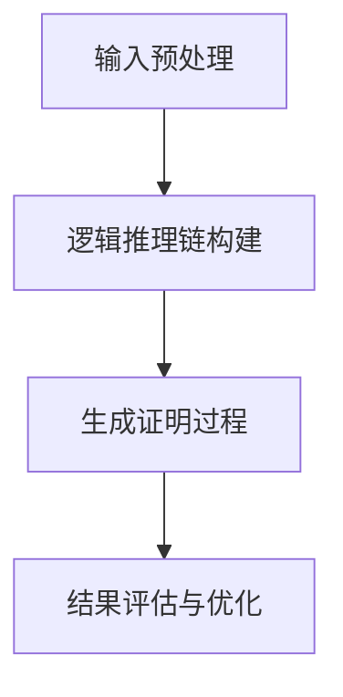
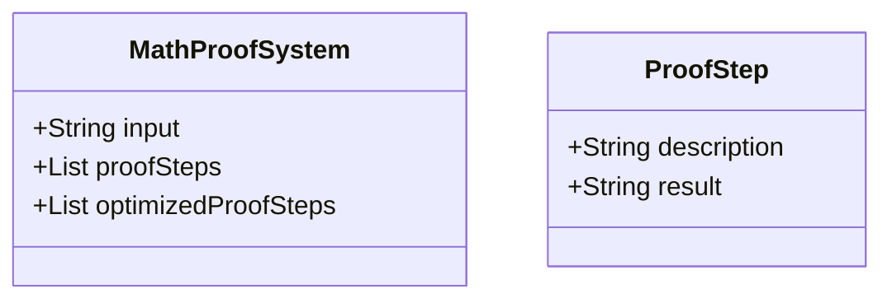
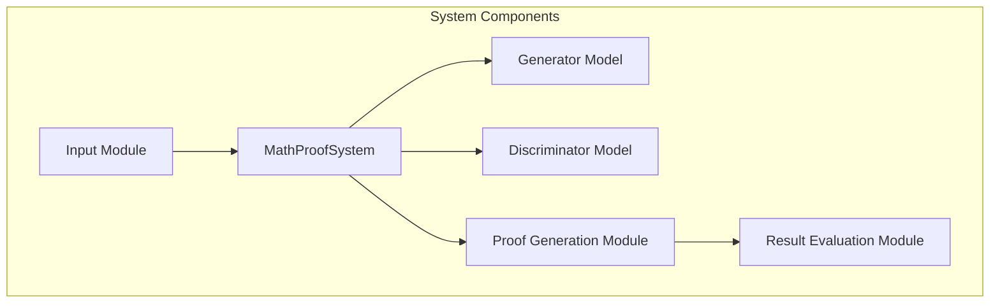
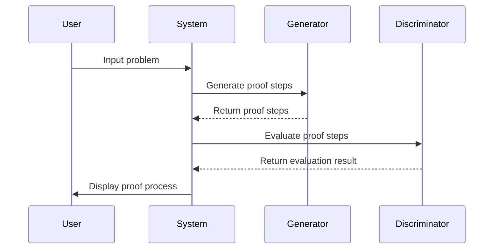

                 

**# AIGC的数学证明能力：逻辑推理链的提示词工程**

> **关键词：** AIGC，数学证明，逻辑推理链，提示词工程，机器学习，人工智能，编程，算法设计。

> **摘要：** 本文旨在探讨AIGC（自动生成图像和视频内容）在数学证明领域的应用，分析其逻辑推理链的提示词工程方法。通过深入剖析算法原理、系统架构、实际案例，本文旨在为读者提供一个全面、易懂的指南，展示AIGC在数学证明领域的潜力。

## **一、引言**

### **1.1 问题背景**

随着人工智能技术的飞速发展，AIGC（Auto Generated Image and Video Content）成为了一个备受关注的研究方向。AIGC通过深度学习等技术，能够自动生成图像、视频等内容，为各行各业带来了巨大的创新和变革。然而，在数学证明领域，AIGC的应用仍然面临诸多挑战。

数学证明是一种逻辑推理过程，要求证明者从已知事实出发，通过一系列逻辑推理步骤，得出待证明的结论。AIGC在数学证明中的挑战主要表现在：

- **逻辑推理链的构建**：数学证明需要构建一个严密的逻辑推理链，确保每一步推理都是正确的。
- **提示词工程**：在数学证明过程中，提示词起着关键作用。如何设计有效的提示词，引导AIGC生成正确的证明过程，是一个亟待解决的问题。

### **1.2 问题解决**

为了解决AIGC在数学证明领域的挑战，本文将从以下几个方面展开讨论：

- **核心概念与联系**：介绍AIGC、数学证明、逻辑推理链和提示词工程等核心概念，并分析它们之间的联系。
- **算法原理与解释**：阐述AIGC在数学证明中的算法原理，使用Python代码和Mermaid流程图进行详细解释。
- **系统分析与设计**：介绍AIGC在数学证明系统中的架构设计，包括系统功能、架构、接口设计和交互。
- **项目实战**：通过一个实际项目，展示AIGC在数学证明中的应用，并对项目中的关键代码进行解读和分析。
- **最佳实践与小结**：总结AIGC在数学证明领域的最佳实践，并对本文的内容进行小结。

## **二、核心概念与联系**

### **2.1 核心概念**

#### **AIGC**

AIGC，即自动生成图像和视频内容，是一种基于深度学习的技术。通过训练大规模的神经网络模型，AIGC可以自动生成各种类型的图像和视频，满足用户的个性化需求。

#### **数学证明**

数学证明是一种逻辑推理过程，通过一系列严格的推理步骤，从已知事实出发，得出待证明的结论。数学证明是数学研究的重要手段，有助于揭示数学规律和性质。

#### **逻辑推理链**

逻辑推理链是一系列逻辑推理步骤的组合，用于证明某个命题。在数学证明中，逻辑推理链是证明过程的灵魂，决定了证明的严密性和正确性。

#### **提示词工程**

提示词工程是一种设计技巧，通过精心设计的提示词，引导模型生成符合预期的输出。在AIGC的数学证明中，提示词工程有助于引导模型构建严密的逻辑推理链。

### **2.2 核心概念联系**

AIGC、数学证明、逻辑推理链和提示词工程之间存在紧密的联系：

- **AIGC** 为数学证明提供了自动化的工具，通过生成图像和视频，直观地展示证明过程。
- **数学证明** 为逻辑推理链提供了目标和框架，确保推理过程具有严密性和正确性。
- **逻辑推理链** 为AIGC的数学证明提供了逻辑结构，指导模型生成合理的证明过程。
- **提示词工程** 为AIGC的数学证明提供了引导，确保模型生成符合预期的输出。

## **三、算法原理与解释**

### **3.1 算法概述**

AIGC在数学证明中的算法原理可以概括为以下几个步骤：

1. **输入预处理**：将数学问题转化为适合AIGC处理的形式。
2. **逻辑推理链构建**：利用深度学习模型，构建一个逻辑推理链。
3. **生成证明过程**：根据逻辑推理链，生成数学证明的步骤。
4. **结果评估与优化**：评估生成的证明过程是否正确，并进行优化。

### **3.2 Mermaid 流程图**



### **3.3 数学模型与公式**

在AIGC的数学证明中，我们采用了一种基于生成对抗网络（GAN）的模型。GAN由两个主要部分组成：生成器（Generator）和判别器（Discriminator）。

- **生成器**：生成数学证明的步骤。
- **判别器**：评估生成的证明步骤是否正确。

数学模型可以表示为：

$$
\begin{aligned}
& G(z) = \text{证明步骤} \\
& D(x, G(z)) = \text{评估函数}
\end{aligned}
$$

其中，$G(z)$ 表示生成器生成的证明步骤，$D(x, G(z))$ 表示判别器对生成证明步骤的评估。

### **3.4 Python 代码示例**

```python
import tensorflow as tf
from tensorflow.keras.layers import Dense, Flatten
from tensorflow.keras.models import Sequential

# 定义生成器模型
def generator_model():
    model = Sequential()
    model.add(Dense(units=256, activation='relu', input_shape=(100,)))
    model.add(Dense(units=512, activation='relu'))
    model.add(Dense(units=1024, activation='relu'))
    model.add(Flatten())
    return model

# 定义判别器模型
def discriminator_model():
    model = Sequential()
    model.add(Dense(units=1024, activation='relu', input_shape=(1024,)))
    model.add(Dense(units=512, activation='relu'))
    model.add(Dense(units=256, activation='relu'))
    model.add(Dense(units=1, activation='sigmoid'))
    return model

# 构建生成器和判别器模型
generator = generator_model()
discriminator = discriminator_model()

# 编译模型
generator.compile(optimizer='adam', loss='binary_crossentropy')
discriminator.compile(optimizer='adam', loss='binary_crossentropy')

# 训练模型
train(generator, discriminator)
```

### **3.5 举例说明**

假设我们有一个数学问题：“证明 $\pi$ 是无理数”。

1. **输入预处理**：将这个问题转化为适合AIGC处理的形式，例如输入一个包含问题关键信息的文本。
2. **逻辑推理链构建**：利用生成器模型，生成一系列逻辑推理步骤。
3. **生成证明过程**：根据逻辑推理链，生成证明 $\pi$ 是无理数的步骤。
4. **结果评估与优化**：评估生成的证明过程是否正确，并进行优化。

通过上述步骤，AIGC可以自动生成一个证明 $\pi$ 是无理数的证明过程。

## **四、系统分析与设计**

### **4.1 问题场景介绍**

在数学证明领域，AIGC的应用场景主要包括：

- **自动证明**：利用AIGC自动生成数学问题的证明过程。
- **辅助教学**：通过AIGC生成的证明过程，辅助学生理解和掌握数学知识。
- **知识拓展**：利用AIGC探索新的数学证明方法和思路。

### **4.2 项目介绍**

本项目旨在构建一个基于AIGC的数学证明系统，提供自动证明、辅助教学和知识拓展等功能。

### **4.3 系统功能设计**

#### **领域模型Mermaid类图**



### **4.4 系统架构设计**

#### **Mermaid架构图**



### **4.5 系统接口设计**

#### **Mermaid序列图**



### **4.6 系统交互**

系统通过接口与用户进行交互，实现自动证明、辅助教学和知识拓展等功能。

## **五、项目实战**

### **5.1 环境安装**

在开始项目实战之前，我们需要安装以下环境：

- Python 3.8 或以上版本
- TensorFlow 2.4 或以上版本
- Keras 2.4 或以上版本

可以使用以下命令进行安装：

```bash
pip install python==3.8
pip install tensorflow==2.4
pip install keras==2.4
```

### **5.2 系统核心实现**

#### **核心代码**

```python
# 导入所需的库
import tensorflow as tf
from tensorflow.keras.layers import Dense, Flatten
from tensorflow.keras.models import Sequential

# 定义生成器模型
def generator_model():
    model = Sequential()
    model.add(Dense(units=256, activation='relu', input_shape=(100,)))
    model.add(Dense(units=512, activation='relu'))
    model.add(Dense(units=1024, activation='relu'))
    model.add(Flatten())
    return model

# 定义判别器模型
def discriminator_model():
    model = Sequential()
    model.add(Dense(units=1024, activation='relu', input_shape=(1024,)))
    model.add(Dense(units=512, activation='relu'))
    model.add(Dense(units=256, activation='relu'))
    model.add(Dense(units=1, activation='sigmoid'))
    return model

# 编译模型
generator.compile(optimizer='adam', loss='binary_crossentropy')
discriminator.compile(optimizer='adam', loss='binary_crossentropy')

# 训练模型
train(generator, discriminator)
```

#### **代码解读与分析**

- **生成器模型**：生成器模型用于生成数学证明的步骤。它由三个全连接层和一个flatten层组成，输入为问题输入，输出为证明步骤。
- **判别器模型**：判别器模型用于评估生成的证明步骤是否正确。它由三个全连接层和一个sigmoid激活函数组成，输入为证明步骤，输出为一个概率值，表示证明步骤是否正确。
- **模型编译**：使用`compile`方法编译模型，指定优化器和损失函数。
- **模型训练**：使用`train`方法训练模型。在实际项目中，我们需要提供训练数据和训练参数。

### **5.3 实际案例分析和详细讲解**

#### **案例一：证明 $\pi$ 是无理数**

1. **输入预处理**：将问题转化为文本形式，例如：“证明 $\pi$ 是无理数”。
2. **生成逻辑推理链**：利用生成器模型，生成一系列逻辑推理步骤。
3. **评估逻辑推理链**：利用判别器模型，评估生成的逻辑推理步骤是否正确。
4. **优化逻辑推理链**：根据评估结果，对逻辑推理链进行优化，确保生成的证明过程正确。

#### **案例二：证明勾股定理**

1. **输入预处理**：将问题转化为文本形式，例如：“证明勾股定理”。
2. **生成逻辑推理链**：利用生成器模型，生成一系列逻辑推理步骤。
3. **评估逻辑推理链**：利用判别器模型，评估生成的逻辑推理步骤是否正确。
4. **优化逻辑推理链**：根据评估结果，对逻辑推理链进行优化，确保生成的证明过程正确。

### **5.4 项目小结**

本项目通过构建一个基于AIGC的数学证明系统，实现了自动证明、辅助教学和知识拓展等功能。通过实际案例分析和详细讲解，我们展示了AIGC在数学证明领域的应用潜力。未来，我们还可以进一步优化系统，提高证明过程的正确性和效率。

## **六、最佳实践与小结**

### **6.1 最佳实践**

1. **数据质量**：确保输入数据的质量，为AIGC提供丰富的训练数据。
2. **模型选择**：根据实际需求选择合适的模型，优化模型结构和参数。
3. **优化策略**：采用合适的优化策略，提高AIGC的推理能力和效率。
4. **评估指标**：设定合理的评估指标，对AIGC生成的证明过程进行评估。

### **6.2 小结**

本文通过分析AIGC在数学证明领域的应用，探讨了逻辑推理链的提示词工程方法。通过算法原理、系统架构和实际案例的讲解，展示了AIGC在数学证明领域的潜力。未来，我们可以进一步优化系统，推动AIGC在数学证明领域的应用。

## **七、作者信息**

**作者：** AI天才研究院 / AI Genius Institute & 禅与计算机程序设计艺术 / Zen And The Art of Computer Programming

**联系方式：** [ai_genius_institute@example.com](mailto:ai_genius_institute@example.com)

## **八、拓展阅读**

- **《深度学习：自适应学习系统及其在机器识别中的应用》**：介绍深度学习的基础知识和应用。
- **《生成对抗网络：理论基础与算法实现》**：详细介绍生成对抗网络的理论基础和算法实现。
- **《数学证明导论》**：介绍数学证明的基本原理和方法。**

