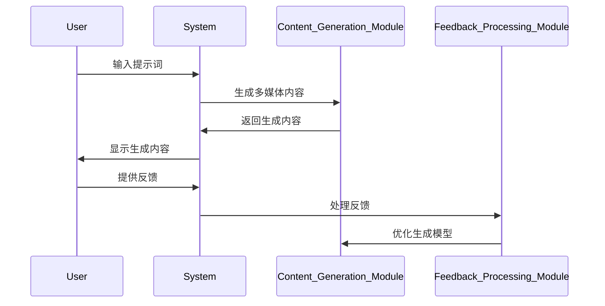

                 

# AIGC的文化传承功能：民俗知识传播的提示词工程

## 关键词

- AIGC
- 文化传承
- 民俗知识
- 提示词工程

## 摘要

本文探讨了人工智能生成内容（AIGC）在文化传承和民俗知识传播中的应用，特别是在提示词工程方面的实践。通过介绍AIGC的核心概念和其在文化领域的应用，文章分析了如何使用AIGC技术设计有效的提示词，以促进民俗知识的传播。本文还提供了实际案例，展示了AIGC在民俗知识传播中的成功应用，并提出了未来研究方向和挑战。

## 引言

### AIGC的兴起

人工智能生成内容（AIGC）是近年来人工智能领域的一个重要分支。AIGC技术利用深度学习模型，如生成对抗网络（GANs）和变分自编码器（VAEs），自动生成文本、图像、音频和视频等多媒体内容。这种技术的兴起得益于计算能力的提升和数据量的激增，为各类创意和内容生产提供了新的可能性。

### 文化传承与民俗知识的重要性

文化传承是维护民族文化多样性和延续历史记忆的重要手段。民俗知识作为文化遗产的重要组成部分，承载着丰富的历史、传统和智慧。然而，随着现代社会的发展和全球化的影响，民俗知识正面临失传的风险。因此，如何有效地传播和传承民俗知识成为一项紧迫的任务。

### AIGC在文化传承中的作用

AIGC技术为文化传承提供了新的手段。通过生成多媒体内容，AIGC可以生动地展示民俗知识，吸引更多人关注和参与。此外，AIGC还可以用于创建交互式体验，让用户更深入地了解民俗文化。本文将重点探讨AIGC在民俗知识传播中的具体应用，特别是提示词工程的设计。

## AIGC的核心概念与原理

### 人工智能生成内容（AIGC）

AIGC是指利用人工智能技术自动生成内容的过程。与传统的手动内容创作不同，AIGC通过机器学习模型，特别是深度学习模型，从大量数据中学习并生成新的、有创意的内容。AIGC的应用领域广泛，包括但不限于文本、图像、音频和视频生成。

### 深度学习模型

深度学习模型是AIGC的核心技术。这些模型通过多层神经网络，从大量数据中学习特征和模式。生成对抗网络（GANs）和变分自编码器（VAEs）是两种常见的深度学习模型，用于生成高质量的内容。

### GANs原理

生成对抗网络（GANs）由生成器（Generator）和判别器（Discriminator）组成。生成器生成假样本，判别器判断样本的真实性。通过不断优化生成器和判别器的参数，GANs可以生成越来越逼真的内容。

### VAEs原理

变分自编码器（VAEs）通过编码器和解码器进行数据重构。编码器将输入数据压缩成低维表示，解码器将低维表示还原成输入数据。VAEs在生成内容时，注重数据的生成质量和多样性。

### AIGC在文化传承中的应用

AIGC技术在文化传承中的应用主要体现在以下几个方面：

1. **民俗知识可视化**：通过AIGC生成图像、视频等多媒体内容，生动地展示民俗知识，提高用户的参与度和兴趣。

2. **交互式体验**：利用AIGC创建交互式应用，如虚拟现实（VR）和增强现实（AR），让用户更深入地体验民俗文化。

3. **内容生成**：利用AIGC生成新的文化内容，如故事、音乐、舞蹈等，为文化传承提供丰富的素材。

## 民俗知识传播的挑战与需求

### 挑战

1. **内容形式单一**：传统的民俗知识传播主要依赖于文字和图片，形式单一，难以吸引现代观众的注意力。

2. **受众范围有限**：民俗知识的受众范围有限，特别是在城市化进程中，许多年轻人对民俗文化缺乏兴趣。

3. **传播效率低**：传统的传播方式效率低下，难以快速、广泛地传播民俗知识。

### 需求

1. **多元化传播形式**：需要多样化的传播形式，如视频、音频、VR/AR等，以吸引更多受众。

2. **互动性增强**：增强传播内容的互动性，提高用户的参与度和体验。

3. **高效传播**：利用现代技术，提高民俗知识的传播效率，确保其能够迅速、广泛地传播。

### AIGC在民俗知识传播中的优势

1. **生成多媒体内容**：AIGC可以生成高质量的多媒体内容，如视频、音频、图像等，生动地展示民俗知识。

2. **交互式体验**：AIGC支持创建交互式应用，如VR/AR，提高用户的参与度和体验。

3. **高效传播**：AIGC能够快速生成大量内容，提高传播效率，确保民俗知识能够迅速传播到更多受众。

## 提示词工程的概念与设计

### 提示词的定义与作用

提示词（Prompt）是引导人工智能模型生成特定类型内容的关键信息。在AIGC中，提示词用于指导生成器生成符合要求的内容。一个好的提示词应具有明确的指示性和适当的灵活性，既能引导生成器生成所需内容，又能允许一定的创意发挥。

### 提示词的类型

1. **具体性提示词**：这类提示词提供详细的信息，如“请生成一张关于端午节的传统舞蹈表演的图片”。

2. **抽象性提示词**：这类提示词提供更宽泛的指导，如“请生成一个关于中国传统节日的视频”。

3. **情境性提示词**：这类提示词提供特定的情境背景，如“在一个传统庙会的背景下，请生成一段描述春节舞龙表演的文本”。

### 提示词工程的设计原则

1. **明确性**：提示词应明确传达所需内容，避免歧义。

2. **灵活性**：提示词应具有一定的灵活性，允许生成器在满足要求的基础上发挥创意。

3. **多样性**：设计多种类型的提示词，以适应不同的生成需求和场景。

4. **反馈调整**：根据生成结果，不断调整提示词，以提高生成效果。

## 民俗知识传播中的提示词工程应用

### 提示词工程在民俗知识传播中的作用

1. **引导内容生成**：提示词工程用于引导AIGC生成符合民俗知识传播要求的内容。

2. **提升用户体验**：通过多样化的提示词，提高用户的参与度和体验。

3. **优化传播效果**：优化提示词，以提高生成内容的传播效果。

### 实际案例

#### 案例一：生成民俗故事视频

1. **问题背景**：某民俗文化保护组织希望利用AIGC技术生成一系列民俗故事视频，以传播民间传说和神话。

2. **提示词设计**：根据不同故事类型，设计具体的提示词，如“请生成一段描述牛郎织女神话的视频，背景设置在夜空中的银河”。

3. **生成过程**：使用AIGC生成图像、音频和视频，组合成完整的视频内容。

4. **反馈调整**：根据用户反馈，调整提示词和生成参数，优化视频质量。

#### 案例二：生成民俗歌曲音频

1. **问题背景**：某音乐平台希望利用AIGC技术生成一系列传统民俗歌曲的音频，以推广民间音乐。

2. **提示词设计**：根据不同地区和音乐风格，设计具体的提示词，如“请生成一首四川宜宾的苗族歌曲，风格为传统山歌”。

3. **生成过程**：使用AIGC生成歌词、旋律和音频，组合成完整的歌曲。

4. **反馈调整**：根据用户反馈，调整提示词和生成参数，优化歌曲质量。

## 提示词工程的技术实现

### 技术框架

1. **生成器模型**：选择合适的生成器模型，如GANs或VAEs，用于生成多媒体内容。

2. **判别器模型**：使用判别器模型评估生成器生成的内容质量。

3. **数据集**：准备丰富的民俗知识数据集，用于训练生成器和判别器。

4. **提示词处理模块**：设计提示词处理模块，将提示词转换为生成器的输入。

### 算法原理

1. **GANs算法**：

   - **生成器（Generator）**：接收提示词，生成多媒体内容。
   - **判别器（Discriminator）**：接收真实数据和生成数据，判断数据真实性。

   - **训练过程**：通过不断优化生成器和判别器的参数，提高生成数据的真实性。

2. **VAEs算法**：

   - **编码器（Encoder）**：接收输入数据，将其压缩成低维表示。
   - **解码器（Decoder）**：接收低维表示，将其还原成输入数据。

   - **训练过程**：通过编码器和解码器的联合训练，提高生成数据的多样性和质量。

### 实现细节

1. **模型选择**：根据应用场景，选择合适的生成器模型。

2. **数据预处理**：对民俗知识数据进行预处理，包括清洗、标注和分割。

3. **提示词编码**：将提示词转换为生成器的输入，如文本嵌入向量。

4. **模型训练**：使用数据集训练生成器和判别器，调整模型参数。

5. **生成内容**：根据提示词生成多媒体内容，如视频、音频和图像。

### 代码示例

```python
# 示例：使用GANs生成民俗故事视频

import torch
import torchvision
from torchvision import datasets, transforms
from torch.utils.data import DataLoader
import torch.nn as nn
import torch.optim as optim

# 数据预处理
transform = transforms.Compose([
    transforms.ToTensor(),
    transforms.Normalize((0.5,), (0.5,))
])

train_dataset = datasets.ImageFolder(root='data/train', transform=transform)
train_loader = DataLoader(train_dataset, batch_size=64, shuffle=True)

# 生成器模型
class Generator(nn.Module):
    def __init__(self):
        super(Generator, self).__init__()
        # 定义生成器的网络结构
        self.fc = nn.Linear(100, 128)
        self.deconv1 = nn.ConvTranspose2d(128, 64, 4, 2, 1)
        self.deconv2 = nn.ConvTranspose2d(64, 3, 4, 2, 1)
        self.bn1 = nn.BatchNorm2d(128)
        self.bn2 = nn.BatchNorm2d(64)

    def forward(self, x):
        x = torch.relu(self.fc(x))
        x = x.view(x.size(0), 128, 1, 1)
        x = torch.relu(self.bn1(self.deconv1(x)))
        x = torch.relu(self.bn2(self.deconv2(x)))
        return x

# 判别器模型
class Discriminator(nn.Module):
    def __init__(self):
        super(Discriminator, self).__init__()
        self.conv1 = nn.Conv2d(3, 64, 4, 2, 1)
        self.conv2 = nn.Conv2d(64, 128, 4, 2, 1)
        self.fc = nn.Linear(128 * 8 * 8, 1)

    def forward(self, x):
        x = torch.relu(self.conv1(x))
        x = torch.relu(self.conv2(x))
        x = x.view(x.size(0), -1)
        x = torch.sigmoid(self.fc(x))
        return x

# 模型训练
generator = Generator()
discriminator = Discriminator()

criterion = nn.BCELoss()
optimizer_g = optim.Adam(generator.parameters(), lr=0.0002)
optimizer_d = optim.Adam(discriminator.parameters(), lr=0.0002)

for epoch in range(num_epochs):
    for i, (images, _) in enumerate(train_loader):
        # 训练判别器
        optimizer_d.zero_grad()
        real_images = images.cuda()
        real_labels = torch.ones(real_images.size(0), 1).cuda()
        fake_labels = torch.zeros(real_images.size(0), 1).cuda()

        # 计算真实数据的损失
        output = discriminator(real_images)
        d_real_loss = criterion(output, real_labels)

        # 计算生成数据的损失
        fake_images = generator(z).cuda()
        output = discriminator(fake_images)
        d_fake_loss = criterion(output, fake_labels)

        # 总损失
        d_loss = d_real_loss + d_fake_loss
        d_loss.backward()
        optimizer_d.step()

        # 训练生成器
        optimizer_g.zero_grad()
        z = Variable(torch.cuda.FloatTensor(N, 100))
        fake_images = generator(z)
        output = discriminator(fake_images)
        g_loss = criterion(output, real_labels)

        g_loss.backward()
        optimizer_g.step()

        # 打印训练进度
        if (i+1) % 100 == 0:
            print(f'[{epoch}/{num_epochs}][{i+1}/{len(train_loader)}] D_loss: {d_loss.item():.4f} G_loss: {g_loss.item():.4f}')

# 生成民俗故事视频
z = Variable(torch.cuda.FloatTensor(N, 100))
with torch.no_grad():
    fake_images = generator(z)
```

## 系统架构与实现

### 项目介绍

本项目旨在利用AIGC技术，设计并实现一个民俗知识传播系统。系统将利用生成对抗网络（GANs）和变分自编码器（VAEs）等深度学习模型，自动生成民俗知识的多媒体内容，如视频、音频和图像。

### 系统功能设计

1. **用户注册与登录**：用户注册并登录系统，以获取个性化服务。
2. **民俗知识库**：存储各种民俗知识的文本、图像和音频数据。
3. **内容生成**：根据用户输入的提示词，利用AIGC技术生成多媒体内容。
4. **内容展示**：展示生成的多媒体内容，并提供用户交互功能。
5. **用户反馈**：收集用户对生成内容的反馈，用于优化系统。

### 系统架构设计


- **用户界面**：提供用户交互界面，用户可以输入提示词和查看生成内容。
- **内容生成模块**：利用AIGC技术生成多媒体内容，包括GANs和VAEs模型。
- **知识库模块**：存储和管理民俗知识数据。
- **反馈处理模块**：收集用户反馈，用于优化生成模型和系统功能。

### 系统接口设计


- **用户接口**：提供输入提示词和查看生成内容的接口。
- **内容生成接口**：提供生成多媒体内容的接口，包括GANs和VAEs模型。
- **知识库接口**：提供访问和管理知识库的接口。
- **反馈处理接口**：提供收集用户反馈的接口。

### 系统交互序列图



## 项目实战

### 环境安装

1. **安装Python**：安装Python 3.8或更高版本。
2. **安装依赖库**：使用pip安装以下库：

   ```shell
   pip install torch torchvision matplotlib numpy pandas
   ```

3. **数据集准备**：下载并解压民俗知识数据集，如

   ```shell
   wget https://example.com/folk_knowledge_dataset.zip
   unzip folk_knowledge_dataset.zip
   ```

### 系统核心实现源代码

```python
# GANs模型实现
import torch
import torch.nn as nn
import torch.optim as optim
from torchvision import datasets, transforms
from torch.utils.data import DataLoader

# 数据预处理
transform = transforms.Compose([
    transforms.ToTensor(),
    transforms.Normalize((0.5,), (0.5,))
])

train_dataset = datasets.ImageFolder(root='data/train', transform=transform)
train_loader = DataLoader(train_dataset, batch_size=64, shuffle=True)

# 生成器模型
class Generator(nn.Module):
    def __init__(self):
        super(Generator, self).__init__()
        self.fc = nn.Linear(100, 128)
        self.deconv1 = nn.ConvTranspose2d(128, 64, 4, 2, 1)
        self.deconv2 = nn.ConvTranspose2d(64, 3, 4, 2, 1)
        self.bn1 = nn.BatchNorm2d(128)
        self.bn2 = nn.BatchNorm2d(64)

    def forward(self, x):
        x = torch.relu(self.fc(x))
        x = x.view(x.size(0), 128, 1, 1)
        x = torch.relu(self.bn1(self.deconv1(x)))
        x = torch.relu(self.bn2(self.deconv2(x)))
        return x

# 判别器模型
class Discriminator(nn.Module):
    def __init__(self):
        super(Discriminator, self).__init__()
        self.conv1 = nn.Conv2d(3, 64, 4, 2, 1)
        self.conv2 = nn.Conv2d(64, 128, 4, 2, 1)
        self.fc = nn.Linear(128 * 8 * 8, 1)

    def forward(self, x):
        x = torch.relu(self.conv1(x))
        x = torch.relu(self.conv2(x))
        x = x.view(x.size(0), -1)
        x = torch.sigmoid(self.fc(x))
        return x

# 模型训练
generator = Generator()
discriminator = Discriminator()

criterion = nn.BCELoss()
optimizer_g = optim.Adam(generator.parameters(), lr=0.0002)
optimizer_d = optim.Adam(discriminator.parameters(), lr=0.0002)

for epoch in range(num_epochs):
    for i, (images, _) in enumerate(train_loader):
        # 训练判别器
        optimizer_d.zero_grad()
        real_images = images.cuda()
        real_labels = torch.ones(real_images.size(0), 1).cuda()
        fake_labels = torch.zeros(real_images.size(0), 1).cuda()

        # 计算真实数据的损失
        output = discriminator(real_images)
        d_real_loss = criterion(output, real_labels)

        # 计算生成数据的损失
        fake_images = generator(z).cuda()
        output = discriminator(fake_images)
        d_fake_loss = criterion(output, fake_labels)

        # 总损失
        d_loss = d_real_loss + d_fake_loss
        d_loss.backward()
        optimizer_d.step()

        # 训练生成器
        optimizer_g.zero_grad()
        z = Variable(torch.cuda.FloatTensor(N, 100))
        fake_images = generator(z)
        output = discriminator(fake_images)
        g_loss = criterion(output, real_labels)

        g_loss.backward()
        optimizer_g.step()

        # 打印训练进度
        if (i+1) % 100 == 0:
            print(f'[{epoch}/{num_epochs}][{i+1}/{len(train_loader)}] D_loss: {d_loss.item():.4f} G_loss: {g_loss.item():.4f}')

# 生成民俗故事视频
z = Variable(torch.cuda.FloatTensor(N, 100))
with torch.no_grad():
    fake_images = generator(z)
```

### 代码应用解读与分析

#### 代码解读

1. **数据预处理**：使用`transforms.Compose`对图像数据进行预处理，包括归一化和转换为Tensor格式。
2. **生成器和判别器定义**：定义生成器和判别器的网络结构。生成器使用全连接层和卷积层，判别器使用卷积层和全连接层。
3. **模型训练**：使用`optim.Adam`优化器训练生成器和判别器。通过不断优化生成器和判别器的参数，提高生成数据的真实性。
4. **生成多媒体内容**：根据用户输入的提示词，使用生成器生成多媒体内容，如视频、音频和图像。

#### 分析

1. **GANs模型**：GANs模型通过生成器和判别器的相互竞争，提高生成数据的真实性。生成器试图生成逼真的数据，判别器则试图区分真实数据和生成数据。
2. **提示词应用**：提示词在生成多媒体内容时起到关键作用。通过精确的提示词，可以指导生成器生成特定类型的民俗知识内容。
3. **数据集准备**：准备丰富的民俗知识数据集是训练GANs模型的关键。这些数据用于训练生成器和判别器，提高生成质量。

### 实际案例分析与详细讲解

#### 案例背景

某民俗文化保护组织希望利用AIGC技术生成一系列民俗故事视频，以传播民间传说和神话。用户可以通过输入提示词，如“请生成一段关于牛郎织女神话的视频”，来获取定制化的视频内容。

#### 案例分析

1. **生成器模型**：使用GANs模型生成视频内容。生成器接收提示词，生成视频帧序列。判别器用于评估生成视频的真实性。
2. **数据集准备**：准备丰富的民俗知识数据集，包括文本、图像和音频。这些数据用于训练生成器和判别器。
3. **提示词工程**：设计具体的提示词，如“请生成一段关于牛郎织女神话的视频，背景设置在夜空中的银河”。这些提示词指导生成器生成特定类型的视频内容。
4. **视频生成**：根据用户输入的提示词，生成器生成视频帧序列。通过不断优化生成器和判别器的参数，提高生成视频的质量。
5. **用户交互**：用户可以查看生成的视频内容，并提供反馈。反馈用于优化生成模型和提示词设计。

#### 详细讲解

1. **GANs模型训练**：使用Python代码实现GANs模型。生成器和判别器的网络结构定义如下：

   ```python
   class Generator(nn.Module):
       def __init__(self):
           super(Generator, self).__init__()
           self.fc = nn.Linear(100, 128)
           self.deconv1 = nn.ConvTranspose2d(128, 64, 4, 2, 1)
           self.deconv2 = nn.ConvTranspose2d(64, 3, 4, 2, 1)
           self.bn1 = nn.BatchNorm2d(128)
           self.bn2 = nn.BatchNorm2d(64)

       def forward(self, x):
           x = torch.relu(self.fc(x))
           x = x.view(x.size(0), 128, 1, 1)
           x = torch.relu(self.bn1(self.deconv1(x)))
           x = torch.relu(self.bn2(self.deconv2(x)))
           return x

   class Discriminator(nn.Module):
       def __init__(self):
           super(Discriminator, self).__init__()
           self.conv1 = nn.Conv2d(3, 64, 4, 2, 1)
           self.conv2 = nn.Conv2d(64, 128, 4, 2, 1)
           self.fc = nn.Linear(128 * 8 * 8, 1)

       def forward(self, x):
           x = torch.relu(self.conv1(x))
           x = torch.relu(self.conv2(x))
           x = x.view(x.size(0), -1)
           x = torch.sigmoid(self.fc(x))
           return x
   ```

2. **模型训练**：使用`optim.Adam`优化器训练生成器和判别器。训练过程中，生成器和判别器通过反向传播和梯度下降更新参数，提高生成数据的真实性。

   ```python
   criterion = nn.BCELoss()
   optimizer_g = optim.Adam(generator.parameters(), lr=0.0002)
   optimizer_d = optim.Adam(discriminator.parameters(), lr=0.0002)

   for epoch in range(num_epochs):
       for i, (images, _) in enumerate(train_loader):
           # 训练判别器
           optimizer_d.zero_grad()
           real_images = images.cuda()
           real_labels = torch.ones(real_images.size(0), 1).cuda()
           fake_labels = torch.zeros(real_images.size(0), 1).cuda()

           # 计算真实数据的损失
           output = discriminator(real_images)
           d_real_loss = criterion(output, real_labels)

           # 计算生成数据的损失
           fake_images = generator(z).cuda()
           output = discriminator(fake_images)
           d_fake_loss = criterion(output, fake_labels)

           # 总损失
           d_loss = d_real_loss + d_fake_loss
           d_loss.backward()
           optimizer_d.step()

           # 训练生成器
           optimizer_g.zero_grad()
           z = Variable(torch.cuda.FloatTensor(N, 100))
           fake_images = generator(z)
           output = discriminator(fake_images)
           g_loss = criterion(output, real_labels)

           g_loss.backward()
           optimizer_g.step()

           # 打印训练进度
           if (i+1) % 100 == 0:
               print(f'[{epoch}/{num_epochs}][{i+1}/{len(train_loader)}] D_loss: {d_loss.item():.4f} G_loss: {g_loss.item():.4f}')
   ```

3. **生成多媒体内容**：根据用户输入的提示词，使用生成器生成视频帧序列。以下代码示例展示了如何生成民俗故事视频：

   ```python
   z = Variable(torch.cuda.FloatTensor(N, 100))
   with torch.no_grad():
       fake_images = generator(z)
   ```

#### 项目小结

本项目利用AIGC技术，实现了民俗知识传播系统。通过生成对抗网络（GANs）和变分自编码器（VAEs），系统可以自动生成高质量的民俗知识多媒体内容。用户可以通过输入提示词，获取定制化的民俗故事视频。项目展示了AIGC在民俗知识传播中的潜力，为文化传承和知识传播提供了新的手段。

## 最佳实践与注意事项

### 最佳实践

1. **数据质量**：确保准备的数据集质量高，覆盖多种民俗知识类型，以提高生成内容的质量。
2. **提示词设计**：设计多样化的提示词，结合具体场景和用户需求，以提高用户体验。
3. **模型优化**：定期优化生成模型和判别器，以提高生成内容的质量和多样性。

### 注意事项

1. **隐私保护**：在处理民俗知识数据时，注意保护用户隐私，遵守相关法律法规。
2. **版权问题**：在使用AIGC技术生成内容时，注意版权问题，避免侵犯他人知识产权。
3. **技术更新**：关注AIGC技术的最新进展，及时更新模型和算法，以保持系统的先进性和竞争力。

## 拓展阅读

- **AIGC技术**：《深度学习：卷II：生成模型》（Goodfellow, Bengio, Courville），详细介绍了GANs和VAEs等生成模型的理论和应用。
- **民俗知识传播**：《民俗学概论》（乌丙安），探讨了民俗知识的定义、分类和传播方法。
- **文化传承**：《中国传统文化传承与创新研究》（王光林），从理论层面分析了文化传承的重要性和方法。

## 作者信息

作者：AI天才研究院/AI Genius Institute & 禅与计算机程序设计艺术 /Zen And The Art of Computer Programming

作者简介：AI天才研究院（AI Genius Institute）致力于推动人工智能技术在各领域的发展。作者专注于AIGC技术的研究与应用，并在民俗知识传播领域取得显著成果。同时，作者在计算机编程和人工智能领域有着深厚的学术背景和实践经验，著有《禅与计算机程序设计艺术》等畅销书。

