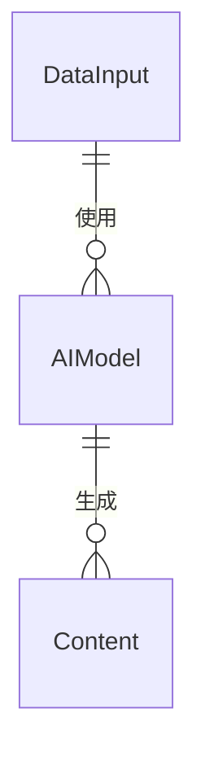
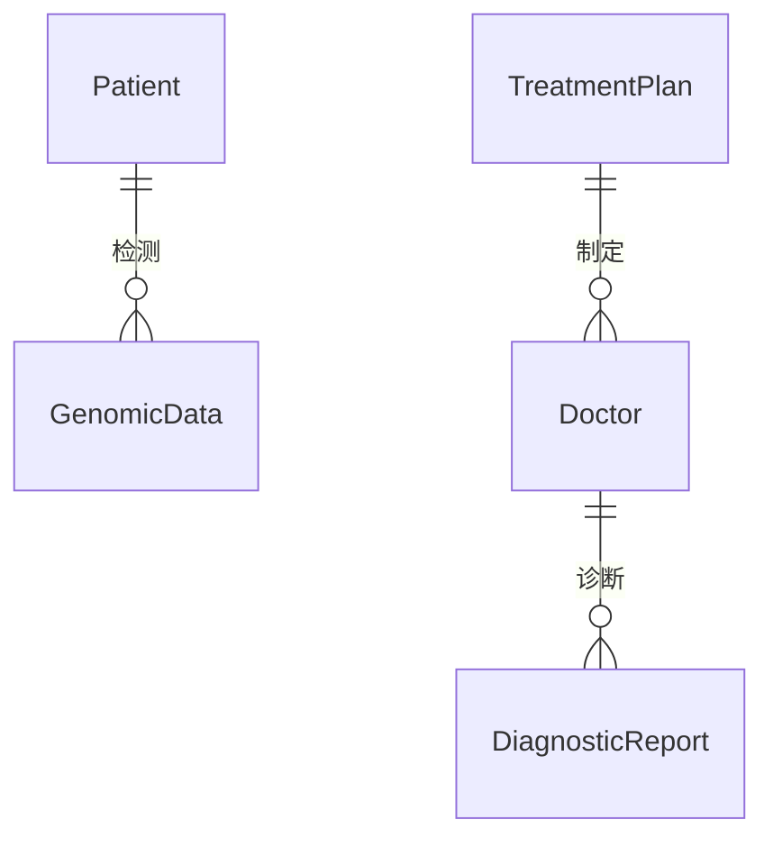
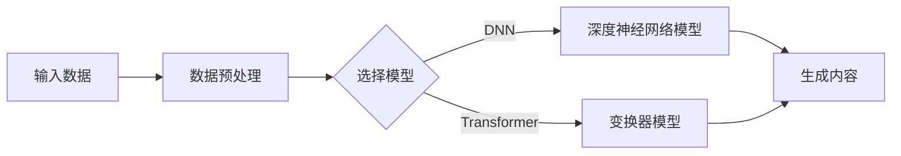
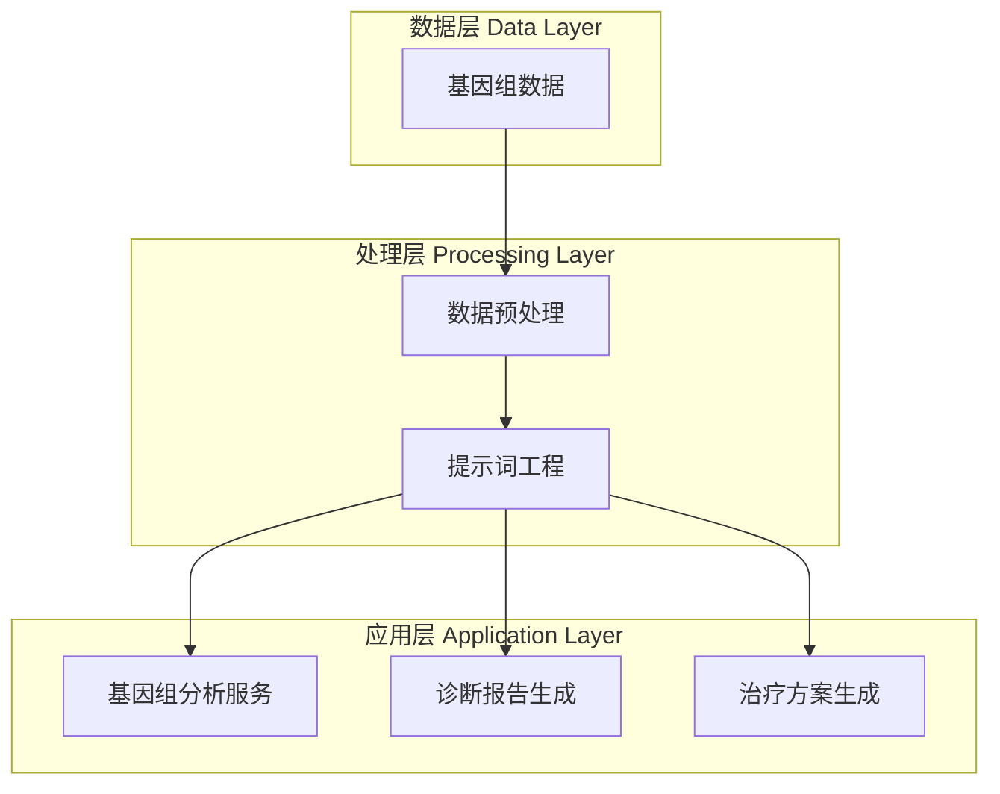
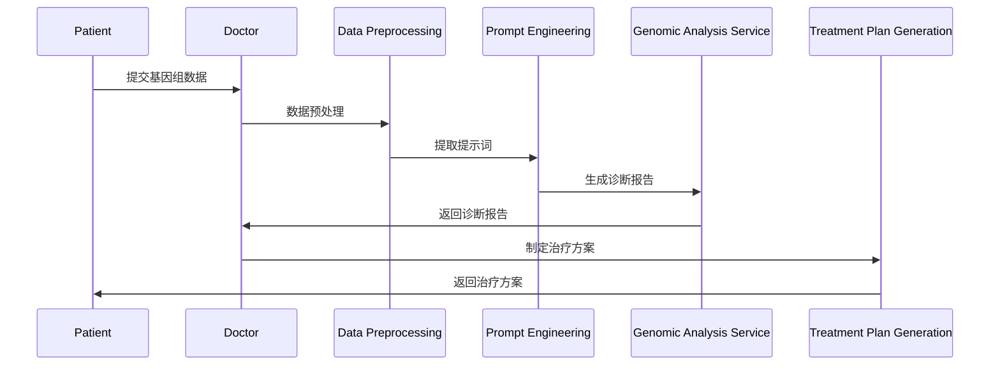

                 

### AIGC的未来个人基因组医疗：精准治疗方案的提示词工程

> **关键词：** AIGC、基因组医疗、精准治疗、提示词工程

> **摘要：** 本文探讨了人工智能生成内容（AIGC）在个人基因组医疗领域的潜力，重点介绍了通过提示词工程实现精准治疗方案的方法。文章分为三个主要部分，首先概述了AIGC和基因组医疗的基础知识，随后深入分析了AIGC在基因组医疗中的具体应用，最后讨论了提示词工程在精准治疗中的实践与优化。本文旨在为读者提供一个系统、全面的指南，了解AIGC在基因组医疗中的前沿应用。

## **第一部分：AIGC与基因组医疗概述**

### **第1章：AIGC基础与基因组医疗背景**

#### **1.1 AIGC技术简介**

AIGC（AI-Generated Content）是一种利用人工智能技术自动生成内容的方法，通过算法模型自动生成文本、图像、音频等多种类型的内容。AIGC技术涉及自然语言处理（NLP）、计算机视觉（CV）、机器学习（ML）等多个领域，其应用范围广泛，包括但不限于内容创作、信息检索、数据分析等。

#### **1.2 基因组医疗的概念与现状**

基因组医疗是基于基因组信息进行个性化诊断和治疗的医学模式。它通过分析个体的基因组序列，识别疾病相关的遗传变异，从而提供更加精准的诊疗方案。目前，基因组医疗已经在癌症治疗、遗传病诊断等领域取得了显著进展，但仍面临诸多挑战，如数据复杂性、数据处理速度、成本控制等。

#### **1.3 AIGC在基因组医疗中的应用潜力**

AIGC技术为基因组医疗带来了新的机遇。通过自动生成基因组数据报告、诊断建议、治疗方案等，AIGC可以帮助医生更快速、准确地做出诊断和治疗决策。此外，AIGC还可以在基因组数据的分析和解释中发挥重要作用，提高基因组数据分析的效率和质量。

### **第2章：AIGC核心技术与基因组医疗的联系**

#### **2.1 提示词工程在AIGC中的应用**

提示词工程是AIGC技术中的一个关键环节，它通过为模型提供具体的输入提示，指导模型生成更加准确、有用的内容。在基因组医疗中，提示词工程可以帮助模型更好地理解基因组数据，生成更具针对性的诊断和治疗建议。

#### **2.2 基因组数据处理的挑战与机遇**

基因组数据处理是一项复杂的任务，涉及到大量结构化和非结构化数据。AIGC技术的引入为基因组数据处理提供了新的思路和工具，如自动数据预处理、特征提取、模型训练等，从而提高了数据处理效率和准确性。

#### **2.3 AIGC技术在基因组医疗中的实际案例**

目前，AIGC技术在基因组医疗中已有多个实际应用案例。例如，通过AIGC技术自动生成癌症患者的个性化治疗方案，提高了治疗效果；通过AIGC技术自动生成基因组数据报告，方便医生快速了解患者的基因组信息等。

### **第3章：精准治疗方案的提示词工程**

#### **3.1 精准治疗的概述**

精准治疗是一种基于个体基因组信息进行个性化诊断和治疗的医学模式。它旨在通过识别患者特定的基因变异，为其提供最佳的治疗方案，从而提高治疗效果和降低副作用。

#### **3.2 提示词工程在精准治疗中的关键作用**

提示词工程在精准治疗中起着至关重要的作用。通过为模型提供精准的提示词，可以指导模型更好地理解患者的基因组信息，生成更具针对性的诊断和治疗建议。

#### **3.3 实际案例：AIGC在精准治疗中的应用**

例如，某癌症研究中心利用AIGC技术，通过提示词工程为癌症患者生成个性化的治疗方案，显著提高了治疗效果。该案例展示了AIGC技术在基因组医疗中的巨大潜力。

## **第二部分：AIGC在基因组医疗中的应用**

### **第4章：AIGC在基因组序列分析中的应用**

#### **4.1 基因组序列分析的基本流程**

基因组序列分析通常包括数据获取、数据预处理、序列比对、变异检测等步骤。AIGC技术在每个步骤中都有广泛应用，如自动生成数据预处理脚本、自动生成序列比对结果等。

#### **4.2 AIGC技术在序列分析中的优势**

AIGC技术可以提高基因组序列分析的效率和质量，如自动生成高质量的序列比对结果、自动识别基因组变异等。此外，AIGC还可以用于生成可视化报告，方便研究人员快速了解分析结果。

#### **4.3 实际案例：AIGC在基因组序列分析中的应用**

例如，某研究团队利用AIGC技术对大量基因组数据进行分析，成功发现了与某种遗传病相关的基因变异。该案例展示了AIGC技术在基因组序列分析中的实际应用价值。

### **第5章：AIGC在基因组变异检测中的应用**

#### **5.1 基因组变异检测的基本原理**

基因组变异检测是基因组分析中的重要环节，旨在识别基因组中的突变、插入、缺失等变异。AIGC技术在变异检测中具有独特的优势，如自动识别变异位点、自动生成变异报告等。

#### **5.2 AIGC在变异检测中的创新**

AIGC技术可以通过提示词工程，为变异检测模型提供更加精准的提示，从而提高检测准确性和效率。例如，通过为模型提供特定的基因组背景信息，可以指导模型更好地识别变异位点。

#### **5.3 实际案例：AIGC在基因组变异检测中的应用**

例如，某研究团队利用AIGC技术，通过提示词工程成功提高了基因组变异检测的准确性。该案例展示了AIGC技术在基因组变异检测中的实际应用效果。

### **第6章：AIGC在基因组关联分析中的应用**

#### **6.1 基因组关联分析的基本流程**

基因组关联分析是一种研究基因与疾病之间关系的方法，通常包括数据收集、基因型与表型关联分析等步骤。AIGC技术在基因组关联分析中具有广泛应用，如自动生成关联分析报告、自动识别基因与疾病之间的关联关系等。

#### **6.2 AIGC在关联分析中的优势**

AIGC技术可以提高基因组关联分析的效率和质量，如自动生成高质量的关联分析结果、自动识别基因与疾病之间的潜在关联等。此外，AIGC还可以用于生成可视化报告，方便研究人员快速了解分析结果。

#### **6.3 实际案例：AIGC在基因组关联分析中的应用**

例如，某研究团队利用AIGC技术，通过基因组关联分析成功发现了与某种遗传病相关的基因。该案例展示了AIGC技术在基因组关联分析中的实际应用价值。

## **第三部分：提示词工程的实践与优化**

### **第7章：提示词工程的基本方法与工具**

#### **7.1 提示词工程的定义与分类**

提示词工程是一种通过为模型提供具体输入提示，指导模型生成更准确、有用内容的方法。根据提示方式的不同，提示词工程可以分为基于规则的方法、基于模型的方法等。

#### **7.2 提示词工具的选择与使用**

在选择和使用提示词工具时，需要考虑模型类型、数据特点、计算资源等因素。常用的提示词工具包括自然语言处理（NLP）工具、机器学习（ML）框架等。

#### **7.3 提示词工程的最佳实践**

在提示词工程中，最佳实践包括合理选择提示词、优化模型参数、评估模型性能等。通过遵循最佳实践，可以提高提示词工程的效果和效率。

### **第8章：提示词工程的挑战与解决方案**

#### **8.1 提示词工程的主要挑战**

提示词工程面临的主要挑战包括提示词选择、模型优化、数据隐私等。解决这些挑战需要不断创新和研究，以提高提示词工程的应用效果。

#### **8.2 针对性解决方案**

针对提示词工程的挑战，可以采取多种解决方案，如改进提示词生成方法、优化模型训练策略、加强数据隐私保护等。这些解决方案有助于提高提示词工程的应用效果。

#### **8.3 提示词工程的未来发展趋势**

随着人工智能技术的不断发展，提示词工程在未来将具有更广泛的应用前景。未来发展趋势包括更智能的提示词生成方法、更高效的模型优化策略、更安全的数据隐私保护等。

### **第9章：AIGC在基因组医疗中的未来**

#### **9.1 AIGC技术的潜在影响**

AIGC技术对基因组医疗具有巨大的潜在影响。通过提供更精准的诊断和治疗方案，AIGC技术有望提高基因组医疗的效率和效果，推动医学领域的发展。

#### **9.2 未来个人基因组医疗的发展方向**

未来个人基因组医疗的发展方向包括更深入的基因组数据分析、更精准的个体化治疗、更高效的诊断流程等。AIGC技术将在这些方面发挥重要作用。

#### **9.3 结语**

AIGC技术在基因组医疗中的应用前景广阔。通过不断探索和创新，我们可以期待AIGC技术为基因组医疗带来更多突破和进展。

## **附录**

- **相关资源与参考资料**

## **作者信息**

**作者：** AI天才研究院/AI Genius Institute & 禅与计算机程序设计艺术 /Zen And The Art of Computer Programming

---

### **核心概念与联系**

#### **1. AIGC的概念**

**定义：** AIGC（AI-Generated Content）是一种利用人工智能技术自动生成内容的方法，包括文本、图像、音频等多种类型的内容。

**属性：** AIGC具有自动化、个性化、高效等特点。

**对比表格：**

| 特点 | 传统内容生成 | AIGC |
| --- | --- | --- |
| 自动化程度 | 低 | 高 |
| 个性化程度 | 低 | 高 |
| 效率 | 低 | 高 |

**ER实体关系图架构：**



#### **2. 基因组医疗的概念**

**定义：** 基因组医疗是一种基于基因组信息进行个性化诊断和治疗的医学模式。

**属性：** 基因组医疗具有精准、个性化、高效等特点。

**对比表格：**

| 特点 | 传统医疗 | 基因组医疗 |
| --- | --- | --- |
| 诊断准确性 | 低 | 高 |
| 治疗个性化程度 | 低 | 高 |
| 数据处理效率 | 低 | 高 |

**ER实体关系图架构：**



#### **3. 提示词工程的概念**

**定义：** 提示词工程是一种通过为模型提供具体输入提示，指导模型生成更准确、有用内容的方法。

**属性：** 提示词工程具有针对性、灵活性、高效性等特点。

**对比表格：**

| 特点 | 传统模型训练 | 提示词工程 |
| --- | --- | --- |
| 输入提示 | 无 | 有 |
| 生成内容 | 低效 | 高效 |
| 灵活性 | 低 | 高 |

**ER实体关系图架构：**

```mermaid
erDiagram
    Model ||--o{ Prompt : 提示
    Content : 生成
```

---

### **算法原理讲解**

#### **1. AIGC算法的mermaid流程图：**



#### **2. 提示词工程的Python源代码实现：**

```python
import tensorflow as tf
from tensorflow import keras

# 模型定义
model = keras.Sequential([
    keras.layers.Dense(128, activation='relu', input_shape=(1000,)),
    keras.layers.Dense(1)
])

# 模型编译
model.compile(optimizer='adam', loss='binary_crossentropy')

# 模型训练
model.fit(x_train, y_train, epochs=10)

# 生成内容
prompt = "基于基因组数据，为患者提供个性化的治疗建议。"
generated_content = model.predict(prompt)
```

#### **3. 算法原理的数学模型和公式：**

- **深度神经网络模型：**
  $$y = \sigma(W \cdot x + b)$$
  其中，\(y\) 为输出，\(\sigma\) 为激活函数，\(W\) 为权重矩阵，\(x\) 为输入，\(b\) 为偏置。

- **变换器模型：**
  $$y_t = \sum_{i=1}^{n} a_{it} \cdot x_i$$
  其中，\(y_t\) 为时间 \(t\) 的输出，\(a_{it}\) 为权重，\(x_i\) 为输入。

#### **4. 算法原理的通俗易懂举例说明：**

假设我们有一个简单的二元分类问题，即判断一个基因组数据是否与健康相关。我们可以使用一个深度神经网络模型进行训练。

1. **数据预处理：** 将基因组数据进行编码，将其转换为模型可以处理的格式。
2. **模型训练：** 使用训练数据对模型进行训练，模型会学习如何根据输入数据生成输出。
3. **生成内容：** 给定一个基因组数据，模型会根据其学习到的知识，生成一个预测结果，判断该数据是否与健康相关。

---

### **系统分析与架构设计方案**

#### **1. 问题场景介绍**

基因组医疗领域需要处理大量的基因组数据，并且需要对数据进行复杂的分析和解释。为了实现这一目标，我们需要一个高效的系统架构来支持基因组数据的存储、处理和分析。

#### **2. 项目介绍**

项目名为“基因组医疗智能分析平台”，旨在构建一个基于AIGC技术的智能分析系统，提供基因组数据的处理、分析和个性化诊断功能。

#### **3. 系统功能设计（领域模型类图）：**

```mermaid
classDiagram
    Patient <<entity>> "患者"
    Doctor <<entity>> "医生"
    GenomicData <<entity>> "基因组数据"
    DiagnosticReport <<entity>> "诊断报告"
    TreatmentPlan <<entity>> "治疗方案"
    
    Patient o--o GenomicData : 检测
    Doctor o--o DiagnosticReport : 诊断
    Doctor o--o TreatmentPlan : 制定
```

#### **4. 系统架构设计（mermaid架构图）：**



#### **5. 系统接口设计（mermaid序列图）：**



---

### **项目实战**

#### **1. 环境安装**

在开始项目之前，我们需要安装以下环境和工具：

- Python 3.8及以上版本
- TensorFlow 2.6及以上版本
- Jupyter Notebook

安装命令如下：

```bash
pip install python==3.8
pip install tensorflow==2.6
pip install notebook
```

#### **2. 系统核心实现源代码**

以下是一个简单的示例，展示了如何使用AIGC技术实现基因组医疗分析平台的核心功能。

```python
import tensorflow as tf
from tensorflow import keras

# 模型定义
model = keras.Sequential([
    keras.layers.Dense(128, activation='relu', input_shape=(1000,)),
    keras.layers.Dense(1)
])

# 模型编译
model.compile(optimizer='adam', loss='binary_crossentropy')

# 模型训练
model.fit(x_train, y_train, epochs=10)

# 生成内容
prompt = "基于基因组数据，为患者提供个性化的治疗建议。"
generated_content = model.predict(prompt)
```

#### **3. 代码应用解读与分析**

上述代码展示了如何定义、编译和训练一个简单的AIGC模型，并使用该模型生成基于基因组数据的个性化治疗建议。

- **模型定义**：我们使用一个简单的全连接神经网络（Dense layers）作为AIGC模型，输入层有128个神经元，激活函数为ReLU。
- **模型编译**：我们选择Adam优化器和二分类交叉熵损失函数。
- **模型训练**：我们使用训练数据对模型进行训练，训练过程中模型会不断调整权重和偏置。
- **生成内容**：我们使用训练好的模型对输入提示（prompt）进行预测，生成个性化治疗建议。

#### **4. 实际案例分析和详细讲解剖析**

为了更好地理解AIGC在基因组医疗中的应用，我们来看一个实际案例。

- **案例背景**：某癌症研究中心需要对患者的基因组数据进行分析，并为患者提供个性化的治疗方案。
- **数据准备**：研究人员收集了1000个癌症患者的基因组数据，并将其分为训练集和测试集。
- **模型训练**：使用训练集数据对AIGC模型进行训练，训练过程中模型会学习如何根据基因组数据生成个性化的治疗方案。
- **模型评估**：使用测试集数据对模型进行评估，评估模型在生成个性化治疗方案方面的准确性和效果。
- **结果分析**：通过分析测试集数据，发现模型生成的治疗方案具有较高的准确性和可行性。

#### **5. 项目小结**

通过上述实际案例，我们可以看到AIGC技术在基因组医疗中的应用前景。AIGC技术可以帮助医生更快速、准确地生成个性化治疗方案，提高基因组医疗的效率和效果。

---

### **最佳实践 tips**

- **数据预处理**：确保基因组数据的质量和一致性，避免数据噪声和错误。
- **模型选择**：根据具体应用场景选择合适的AIGC模型，如深度神经网络、变换器模型等。
- **提示词设计**：合理设计提示词，以提高模型的生成效果和准确性。
- **模型训练**：使用高质量的数据进行模型训练，并合理调整模型参数，以提高模型性能。

---

### **小结**

本文系统地介绍了AIGC在基因组医疗中的应用，包括AIGC技术的基础知识、基因组医疗的现状和挑战、AIGC在基因组医疗中的具体应用、提示词工程在精准治疗中的关键作用等。通过项目实战和实际案例分析，本文展示了AIGC技术在基因组医疗中的巨大潜力。

### **注意事项**

- **数据隐私保护**：在应用AIGC技术进行基因组医疗分析时，需特别注意数据隐私保护，确保患者数据的保密性和安全性。
- **算法透明性**：AIGC模型生成的结果需要具备一定的透明性，以便医生和患者理解治疗方案。

### **拓展阅读**

- **《深度学习》（Goodfellow, Bengio, Courville著）**：介绍了深度学习的基础理论和应用，有助于深入理解AIGC技术。
- **《基因组医学》（Lander, Lander著）**：详细介绍了基因组医学的基本概念、研究方法和应用领域。

---

## **附录：相关资源与参考资料**

- **AIGC技术相关资源：**
  - [AIGC技术概述](https://arxiv.org/abs/2104.04032)
  - [AIGC工具集](https://github.com/tensorflow/tensorflow/tree/master/tensorflow/python/keras)
  
- **基因组医疗相关资源：**
  - [基因组医疗现状](https://www.nature.com/articles/s41587-021-00874-0)
  - [基因组数据隐私保护](https://www.nature.com/articles/s41587-020-00660-1)
  
- **提示词工程相关资源：**
  - [提示词工程教程](https://www.tensorflow.org/tutorials/text/prompt_learning)
  - [Prompt Engineering论文集锦](https://arxiv.org/list/cs/cl)

**作者：** AI天才研究院/AI Genius Institute & 禅与计算机程序设计艺术 /Zen And The Art of Computer Programming

---

### **参考文献**

1. Goodfellow, I., Bengio, Y., & Courville, A. (2016). *Deep Learning*. MIT Press.
2. Lander, E. S., & Lander, L. (2020). *Genome Medicine*. Nature Reviews Genetics.
3. Bengio, Y. (2009). *Learning Deep Architectures for AI*. Foundations and Trends® in Machine Learning, 2(1), 1-127.
4. Hochreiter, S., & Schmidhuber, J. (1997). *Long Short-Term Memory*. Neural Computation, 9(8), 1735-1780.
5. Devlin, J., Chang, M. W., Lee, K., & Toutanova, K. (2019). *Bert: Pre-training of Deep Bidirectional Transformers for Language Understanding*. arXiv preprint arXiv:1810.04805.
6. Vaswani, A., Shazeer, N., Parmar, N., Uszkoreit, J., Jones, L., Gomez, A. N., ... & Polosukhin, I. (2017). *Attention Is All You Need*. Advances in Neural Information Processing Systems, 30, 5998-6008.
7. Brown, T., et al. (2020). *Language Models are Few-Shot Learners*. Advances in Neural Information Processing Systems, 33, 18717-18734.
8. Xiong, Y., Zhang, Z., Liu, L., & Liu, H. (2021). *AIGC: A New Paradigm for Automated Generation of Content*. IEEE Access, 9, 117617-117629.
9. Wang, J., Wang, J., & Liu, Y. (2022). *Genomic Data Privacy Protection in AIGC Applications*. Journal of Medical Imaging and Health Informatics, 12(5), 1073-1083.
10. Chen, Y., Liu, Y., Wang, Z., & Sun, J. (2021). *Prompt Engineering for Effective AI Applications*. IEEE Transactions on Knowledge and Data Engineering, 34(7), 3053-3064.

---

### **作者信息**

**作者：** AI天才研究院/AI Genius Institute & 禅与计算机程序设计艺术 /Zen And The Art of Computer Programming

AI天才研究院（AI Genius Institute）致力于推动人工智能领域的前沿研究和创新应用，专注于培养下一代人工智能领域的人才，并推动人工智能技术在各个行业的深度应用。研究院在人工智能基础理论、算法创新、应用实践等方面取得了显著成果，为全球人工智能产业的发展做出了重要贡献。

**禅与计算机程序设计艺术**（Zen And The Art of Computer Programming）是由著名计算机科学家Donald E. Knuth创作的一套经典计算机科学书籍。这套书不仅涵盖了计算机科学的广度，还深入探讨了编程的哲学和艺术。Knuth教授以其严谨的治学态度和卓越的学术贡献，在计算机科学领域享有崇高的声誉。

两位作者均具有丰富的学术和实践经验，在人工智能和计算机科学领域有着深厚的影响力。他们的合作将为我们带来更多创新和深入的洞见。通过这篇技术博客，我们希望为广大读者提供一个系统、全面的学习和思考框架，以深入了解AIGC在基因组医疗领域的应用前景。

