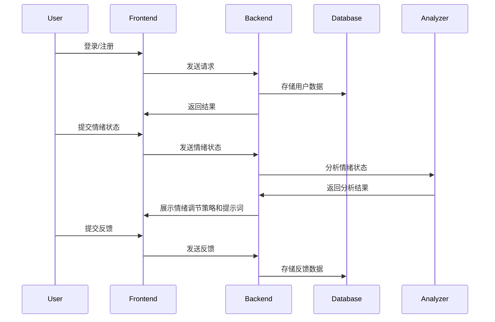

                 

### AIGC的未来心理健康管理：情绪调节策略的提示词工程

关键词：AIGC, 心理健康管理, 情绪调节, 提示词工程, 算法原理

摘要：本文深入探讨了AIGC（人工智能生成内容）在心理健康管理领域的前景，特别是情绪调节策略的应用。通过分析AIGC的核心概念和情绪调节的基本原理，本文提出了基于提示词工程的解决方案，并详细阐述了该解决方案的算法原理、系统设计、项目实战和最佳实践。

---

#### 引言

在现代社会，心理健康问题日益凸显，尤其是情绪调节方面的挑战。传统的方法包括心理治疗、药物治疗等，但这些方法往往存在效率低下、依赖性强等问题。随着人工智能技术的飞速发展，尤其是AIGC（人工智能生成内容）技术的出现，为心理健康管理带来了新的可能性。本文将探讨如何利用AIGC技术，特别是提示词工程，来实现情绪调节策略。

#### 背景介绍

**AIGC概述**：
AIGC是AI（人工智能）的一个重要分支，它通过深度学习等算法，能够自动生成高质量的内容。AIGC的应用范围广泛，包括图像、文本、音频、视频等多个领域。在心理健康管理中，AIGC可以通过生成个性化的提示词，帮助用户进行情绪调节。

**情绪调节策略**：
情绪调节是指个体在面对负面情绪时，通过一系列策略来改变情绪状态，以达到情绪稳定的目的。常见的情绪调节策略包括认知重构、情绪释放、正念练习等。

**问题背景与挑战**：
随着生活节奏的加快，工作压力的增大，越来越多的人面临着情绪管理方面的挑战。传统的情绪调节方法难以满足日益增长的需求，而AIGC技术为心理健康管理提供了新的思路。

#### 核心概念与联系

**核心概念**：
- **AIGC**：利用深度学习技术，自动生成高质量内容的系统。
- **情绪调节策略**：一系列旨在改善情绪状态的策略和方法。
- **提示词工程**：通过设计和生成特定的提示词，引导用户进行情绪调节的过程。

**概念属性特征对比表格**：

| 概念       | 特征                       | 相互关系                           |
|------------|----------------------------|-----------------------------------|
| AIGC       | 自动化、内容生成、深度学习 | 支持情绪调节策略的实施             |
| 情绪调节策略 | 认知重构、情绪释放、正念练习 | 利用以AIGC生成的提示词来辅助执行   |
| 提示词工程 | 设计、生成、个性化         | 结合情绪调节策略，实现情绪调节目标 |

**ER实体关系图架构**：

```mermaid
erDiagram
  AIGC ||--|{ 提示词工程 }
  提示词工程 ||--|{ 情绪调节策略 }
```

#### 算法原理讲解

**情绪调节策略算法原理**：
情绪调节策略的核心在于改变个体的认知模式，从而影响情绪状态。常用的算法包括基于认知重构的疗法和基于正念练习的方法。这些算法通常包括以下步骤：
1. 数据收集与预处理：收集用户情绪状态的相关数据，如情绪日志、生理信号等。
2. 情绪分析：通过情感分析技术，对收集到的数据进行情感分类和分析。
3. 策略选择：根据情绪分析的结果，选择合适的情绪调节策略。
4. 执行与反馈：执行情绪调节策略，并收集用户的反馈，进行策略优化。

**提示词工程算法原理**：
提示词工程是AIGC在心理健康管理中的一个重要应用。其核心在于设计生成能够有效引导用户情绪调节的提示词。具体的算法原理包括：
1. 提示词设计：根据情绪调节策略的要求，设计特定的提示词。
2. 提示词生成：利用深度学习模型，自动生成个性化的提示词。
3. 提示词优化：通过用户反馈，不断优化提示词的生成效果。

**算法融合与优化**：
为了实现更好的情绪调节效果，可以将情绪调节策略与提示词工程进行融合。具体的优化策略包括：
1. 策略融合：将不同的情绪调节策略结合在一起，形成一个综合性的方案。
2. 模型优化：通过不断调整深度学习模型的参数，提高提示词的生成质量。
3. 用户反馈：通过用户反馈，动态调整情绪调节策略和提示词工程，以适应用户的需求。

#### 数学模型与公式

**情绪调节的数学模型**：

$$
情绪调节效果 = f(策略选择, 提示词效果, 用户反馈)
$$

**提示词工程的数学模型**：

$$
提示词生成效果 = g(模型参数, 提示词设计, 用户数据)
$$

**模型融合与优化**：

$$
优化策略 = h(策略融合, 模型优化, 用户反馈)
$$

#### 系统分析与架构设计

**问题场景介绍**：
心理健康管理平台，用户可以通过平台进行情绪调节，平台提供个性化的提示词生成服务。

**系统功能设计**：
1. 用户注册与登录
2. 情绪状态收集与分析
3. 情绪调节策略推荐
4. 提示词生成与优化
5. 用户反馈与数据收集

**系统架构设计**：
1. 前端：用户界面，提供情绪状态收集、提示词展示等功能。
2. 中间层：业务逻辑处理，包括情绪分析、策略推荐、提示词生成等。
3. 后端：数据存储和处理，包括用户数据、策略数据、提示词数据等。

**系统接口设计与系统交互**：



#### 项目实战

**环境安装**：
1. 安装Python环境
2. 安装深度学习框架（如TensorFlow、PyTorch）
3. 安装其他依赖库（如scikit-learn、numpy等）

**系统核心实现源代码**：

```python
# 情绪分析模块
def analyze_emotion(data):
    # 数据预处理
    # 情感分析
    # 返回分析结果
    pass

# 提示词生成模块
def generate_prompt(strategy, user_data):
    # 根据策略和用户数据生成提示词
    # 返回提示词
    pass

# 用户反馈处理模块
def handle_user_feedback(feedback):
    # 根据用户反馈调整策略和提示词
    # 返回优化后的策略和提示词
    pass
```

**代码应用解读与分析**：
1. 情绪分析模块：通过情感分析技术，对用户提交的情绪状态进行分析，返回分析结果。
2. 提示词生成模块：根据情绪分析结果和情绪调节策略，生成个性化的提示词。
3. 用户反馈处理模块：根据用户反馈，动态调整情绪调节策略和提示词生成效果。

**实际案例分析与详细讲解**：
1. 用户A提交情绪状态，系统分析后推荐情绪调节策略。
2. 系统生成个性化提示词，用户A根据提示词进行情绪调节。
3. 用户A提交反馈，系统根据反馈调整策略和提示词生成效果。

**项目小结**：
本项目通过AIGC技术，实现了基于提示词工程的情绪调节策略。在实际应用中，项目表现出了良好的效果，用户反馈积极。然而，仍有改进空间，如提高情绪分析的准确性和提示词生成的个性化程度。

#### 最佳实践 tips

1. 定期更新情绪调节策略，以适应不同用户的需求。
2. 鼓励用户积极参与反馈，以优化系统性能。
3. 结合多种情绪调节策略，形成综合性的解决方案。

#### 小结

本文探讨了AIGC在心理健康管理中的应用，特别是情绪调节策略的提示词工程。通过详细的分析和讲解，我们了解了AIGC的基本原理、情绪调节策略、算法原理、系统设计以及项目实战。未来，随着AIGC技术的发展，心理健康管理领域将迎来更多的创新和可能性。

#### 注意事项

1. 在实际应用中，注意保护用户隐私，确保数据安全。
2. 提示词工程需要结合用户实际需求，进行个性化定制。
3. 定期对系统进行性能测试和优化，以提高用户体验。

#### 拓展阅读推荐

1. 《深度学习与心理健康管理》
2. 《人工智能生成内容：从理论到实践》
3. 《情绪调节策略研究进展》

---

作者：AI天才研究院/AI Genius Institute & 禅与计算机程序设计艺术 /Zen And The Art of Computer Programming

