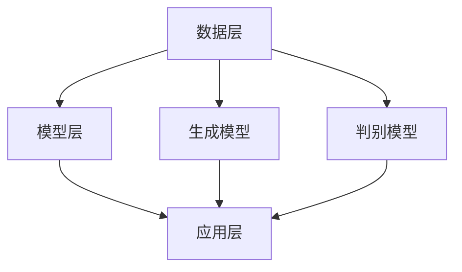

                 

### AIGC的未来教育模式：个性化学习路径的提示词工程

> 关键词：AIGC、教育模式、个性化学习、提示词工程、生成模型、系统架构

> 摘要：本文探讨了AIGC技术在教育领域的应用，特别是如何通过个性化学习路径的提示词工程来提升教育质量。文章首先介绍了AIGC的定义与特点，以及个性化学习路径的概念与属性特征。接着，详细讲解了生成模型的原理和数学模型，并使用了Python代码进行了举例说明。最后，文章提出了AIGC系统的架构设计，包括数据收集与处理、生成模型训练、个性化学习路径规划、提示词生成等核心功能，并通过mermaid图表展示了系统架构和接口设计。通过本文的阐述，读者可以了解到AIGC在教育领域中的巨大潜力和实际应用价值。

### 第一部分：背景介绍

#### 1.1 问题背景

随着人工智能技术的飞速发展，教育领域也迎来了巨大的变革。传统的教育模式，以教师为中心，注重知识灌输和应试教育，已无法满足现代社会个性化、多元化教育的需求。随着互联网和大数据技术的普及，教育资源的获取变得更加便捷，但如何利用这些资源实现个性化教育，仍然是一个巨大的挑战。

近年来，AIGC（AI-Generated Content）作为一种新兴的技术，正在为教育模式带来新的可能。AIGC能够通过生成式对抗网络（GAN）等技术，自动生成高质量的教学内容，从而实现个性化学习路径的提示词工程。AIGC技术的出现，为教育模式的革新提供了强有力的支持。

#### 1.2 问题描述

AIGC在教育中的应用尚处于初级阶段，如何构建一个有效的AIGC系统，实现个性化学习路径的提示词工程，是一个亟待解决的问题。这涉及到AIGC技术的原理、应用场景、系统设计等多个方面。具体而言，问题可以分为以下几个方面：

1. **AIGC技术原理的理解与掌握**：生成模型的工作机制、训练方法、性能评估等。
2. **个性化学习路径的需求分析**：如何根据学生的学习特点、兴趣、学习能力等因素，设计个性化的学习路径。
3. **AIGC系统的设计与实现**：系统的架构设计、功能模块划分、数据流设计等。
4. **AIGC系统的实际应用**：如何在教育场景中应用AIGC技术，解决实际的教育问题。

#### 1.3 问题解决

本书旨在通过对AIGC技术的全面解读，为读者提供一套系统的构建AIGC系统的方法论。具体包括以下几个方面：

1. **AIGC技术原理的讲解**：详细阐述生成模型的工作机制、训练方法、性能评估等。
2. **个性化学习路径的需求分析**：探讨如何根据学生的学习特点、兴趣、学习能力等因素，设计个性化的学习路径。
3. **AIGC系统的设计与实现**：介绍AIGC系统的架构设计、功能模块划分、数据流设计等。
4. **AIGC系统的实际应用**：通过案例分析，展示AIGC技术在教育领域的实际应用效果。

通过本书的阅读，读者可以全面了解AIGC技术在教育领域的应用，掌握构建AIGC系统的方法，并能够将AIGC技术应用于实际的教育场景中，提升教育质量。

#### 1.4 边界与外延

本书主要关注AIGC技术在教育领域的应用，但不涉及其他领域。同时，本书将重点讨论AIGC在个性化学习路径的提示词工程中的应用，而不涉及其他应用场景。

本书的核心目标是通过深入剖析AIGC技术在教育领域的应用，为教育工作者、研究人员、开发者等提供一套实用的方法和工具，推动教育模式的革新。

#### 1.5 概念结构与核心要素组成

AIGC系统的核心要素包括：数据收集与处理、生成模型设计、个性化学习路径规划、提示词生成等。这些要素相互关联，共同构成了AIGC系统的基本架构。

- **数据收集与处理**：收集用户的学习数据，包括学习行为、学习进度、学习反馈等，对数据进行清洗、处理和建模。
- **生成模型设计**：设计并训练生成模型，使其能够根据用户数据生成个性化的学习内容。
- **个性化学习路径规划**：根据用户数据和学习目标，规划个性化的学习路径，包括学习内容、学习难度、学习进度等。
- **提示词生成**：根据个性化学习路径，生成提示词，引导学生学习。

这些核心要素相互配合，共同实现AIGC系统的功能，为教育领域提供了一种全新的教育模式。

### 第二部分：核心概念与联系

#### 2.1 AIGC的定义与特点

AIGC，即AI-Generated Content，是指利用人工智能技术生成内容的方法。与传统的教育内容生成方式相比，AIGC具有以下特点：

1. **高效率**：AIGC能够快速生成大量的教育内容，大大提高了教育内容的生成速度。
2. **高质量**：AIGC能够根据学生的学习需求，生成高质量的教育内容，满足个性化教育的需求。
3. **个性化**：AIGC能够根据学生的学习特点、兴趣和能力，生成个性化的教育内容，实现个性化教育。
4. **多样化**：AIGC能够生成多种类型的教育内容，如文字、图片、视频等，满足不同学生的学习需求。

AIGC在教育领域的应用，不仅能够提高教育效率，还能提升教育质量，为教育模式的革新提供了新的思路。

#### 2.2 个性化学习路径的概念与属性特征

个性化学习路径是指根据学生的个性化需求和学习特点，为学生定制的学习路线。其核心属性特征包括：

1. **学习目标**：个性化学习路径需要明确学生的学习目标，包括长期目标和短期目标。
2. **学习内容**：个性化学习路径需要根据学生的学习需求，选择合适的学习内容。
3. **学习节奏**：个性化学习路径需要根据学生的学习能力和学习进度，设定合适的学习节奏。
4. **学习评价**：个性化学习路径需要对学生的学习效果进行评价，以便调整学习路径。

个性化学习路径的核心目标是实现个性化教育，满足不同学生的个性化需求。

#### 2.3 AIGC与个性化学习路径的联系

AIGC与个性化学习路径之间存在着密切的联系。AIGC技术能够通过对大量数据的分析，为学生生成个性化的学习路径，从而实现个性化教育。

具体来说，AIGC技术的作用主要体现在以下几个方面：

1. **学习内容生成**：AIGC技术能够根据学生的学习需求，生成高质量的学习内容，满足个性化教育的需求。
2. **学习路径规划**：AIGC技术能够根据学生的学习特点、兴趣和能力，规划个性化的学习路径，实现个性化教育。
3. **学习评价**：AIGC技术能够对学生的学习效果进行评价，根据评价结果调整学习路径，实现教育效果的优化。

通过AIGC技术，教育系统能够更加精准地满足学生的个性化需求，提升教育质量，实现教育模式的革新。

### 第三部分：算法原理讲解

#### 3.1 生成模型原理

生成模型（Generative Model）是一种用于生成数据的人工神经网络模型。其核心思想是通过学习数据的分布，生成与训练数据相似的新数据。生成模型在教育领域的应用，主要体现在个性化学习路径的提示词生成方面。

生成模型的基本原理可以概括为以下几点：

1. **数据分布学习**：生成模型首先学习训练数据的分布，了解数据的统计特征。
2. **数据生成**：基于学习到的数据分布，生成模型生成新的数据，这些数据与训练数据具有相似性。
3. **模型优化**：通过不断优化模型参数，使生成的数据更加接近真实数据。

生成模型在教育领域的应用，主要体现在以下几个方面：

1. **学习内容生成**：生成模型可以根据学生的学习需求，生成个性化的学习内容。
2. **学习路径规划**：生成模型可以根据学生的学习特点，规划个性化的学习路径。
3. **学习评价**：生成模型可以根据学生的学习效果，生成评价结果，辅助调整学习路径。

#### 3.2 生成模型特点

生成模型具有以下几个特点：

1. **自适应性**：生成模型能够根据学生的学习行为和需求，动态调整生成的内容。
2. **多样性**：生成模型能够生成丰富多样的学习内容，满足不同学生的个性化需求。
3. **高效性**：生成模型能够快速生成高质量的学习内容，提高学习效率。

#### 3.3 生成模型工作流程

生成模型的工作流程主要包括以下环节：

1. **数据收集与预处理**：收集用户的学习数据，对数据进行清洗、处理和建模。
2. **模型设计**：设计生成模型的结构，选择合适的模型类型，如生成式对抗网络（GAN）或变分自编码器（VAE）。
3. **模型训练**：使用收集到的数据对生成模型进行训练，优化模型参数。
4. **数据生成**：基于训练好的模型，生成个性化的学习内容，如提示词、学习路径等。
5. **模型评估**：对生成的内容进行评估，根据评估结果调整模型参数，提高生成质量。

通过以上工作流程，生成模型能够实现个性化学习路径的提示词生成，为教育领域提供了一种新的解决方案。

### 第四部分：数学模型和数学公式 & 详细讲解 & 举例说明

#### 4.1 数学模型

在AIGC系统中，生成模型通常采用生成式对抗网络（GAN）或变分自编码器（VAE）等模型。以下是一个简单的GAN模型：

$$
\begin{aligned}
&\text{Generator: } G(z) \\
&\text{Discriminator: } D(x, G(z))
\end{aligned}
$$

其中，$z$ 是噪声向量，$x$ 是真实数据。

GAN模型通过生成器和判别器的对抗训练，实现数据生成。生成器 $G$ 的目标是生成尽可能真实的数据，而判别器 $D$ 的目标是区分真实数据和生成数据。

#### 4.2 详细讲解

GAN模型通过两个主要组件——生成器（Generator）和判别器（Discriminator）进行对抗训练。生成器的目标是生成与真实数据相似的数据，而判别器的目标是区分真实数据和生成数据。

具体来说，训练过程可以分为以下几个步骤：

1. **初始化**：初始化生成器 $G$ 和判别器 $D$ 的参数。
2. **生成器训练**：生成器 $G$ 接受随机噪声向量 $z$ 作为输入，生成假样本 $x'$。判别器 $D$ 接收真实数据 $x$ 和生成数据 $x'$，对两者进行判断。
3. **判别器训练**：判别器 $D$ 通过学习真实数据和生成数据的分布，优化其参数，以更好地区分真实数据和生成数据。
4. **生成器调整**：生成器 $G$ 根据判别器 $D$ 的反馈，调整生成数据的分布，使其更接近真实数据。
5. **重复训练**：重复上述过程，直到生成器 $G$ 生成的数据质量达到预期。

#### 4.3 举例说明

假设我们使用GAN模型生成中文文章。生成器 $G$ 接受噪声向量 $z$，生成一篇中文文章。判别器 $D$ 则接受真实中文文章 $x$ 和生成文章 $G(z)$，判断其真实性。通过多次迭代训练，生成器逐渐学会生成高质量的文章。

以下是生成器和判别器的Python代码示例：

```python
import tensorflow as tf
from tensorflow.keras.layers import Dense, Flatten, Reshape
from tensorflow.keras.models import Sequential

# 生成器
def build_generator(z_dim=100):
    model = Sequential()
    model.add(Dense(256, input_dim=z_dim, activation='relu'))
    model.add(Dense(512, activation='relu'))
    model.add(Dense(1024, activation='relu'))
    model.add(Dense(256 * 16 * 16, activation='relu'))
    model.add(Reshape((16, 16, 256)))
    return model

# 判别器
def build_discriminator(img_shape=(16, 16, 256)):
    model = Sequential()
    model.add(Flatten(input_shape=img_shape))
    model.add(Dense(512, activation='relu'))
    model.add(Dense(256, activation='relu'))
    model.add(Dense(1, activation='sigmoid'))
    return model

# GAN模型
def build_gan(generator, discriminator):
    model = Sequential()
    model.add(generator)
    model.add(discriminator)
    return model
```

通过以上代码，我们可以构建一个基本的GAN模型，用于生成中文文章。

### 第五部分：系统分析与架构设计

#### 5.1 问题场景介绍

在教育领域，AIGC系统可以应用于在线教育平台，为用户提供个性化学习路径。具体场景包括：

1. **在线教育平台**：通过AIGC系统生成个性化学习内容，提高学生的学习效果。
2. **自适应学习系统**：根据学生的学习行为和效果，自动调整学习内容和学习路径，实现个性化教育。
3. **虚拟教师系统**：利用AIGC技术生成虚拟教师，为学生提供个性化的教学服务。

在这些场景中，AIGC系统能够根据学生的学习特点、兴趣和能力，生成个性化的学习内容和学习路径，提高教育质量。

#### 5.2 系统功能设计

AIGC系统的核心功能包括以下几个方面：

1. **数据收集与处理**：收集用户的学习数据，包括学习行为、学习进度、学习反馈等，对数据进行清洗、处理和建模。
2. **生成模型训练**：设计并训练生成模型，使其能够根据用户数据生成个性化的学习内容。
3. **个性化学习路径规划**：根据用户数据和学习目标，规划个性化的学习路径，包括学习内容、学习难度、学习进度等。
4. **提示词生成**：根据个性化学习路径，生成提示词，引导学生学习。
5. **学习效果评估**：对学生的学习效果进行评估，根据评估结果调整学习路径和提示词。

这些功能共同构成了AIGC系统的核心模块，为教育领域提供了一种全新的教育模式。

#### 5.3 系统架构设计

AIGC系统的架构设计包括数据层、模型层和应用层。以下是各个层次的详细设计：

1. **数据层**：负责数据收集与处理，包括用户数据的采集、清洗、处理和建模。数据层是AIGC系统的基石，为后续的生成模型训练提供数据支持。
   
2. **模型层**：包括生成模型和判别模型。生成模型负责根据用户数据生成个性化的学习内容，判别模型负责对生成内容进行评估和优化。模型层是AIGC系统的核心，决定了系统的生成能力和个性化水平。

3. **应用层**：负责将模型层生成的个性化学习内容应用于实际教育场景中，包括个性化学习路径规划、提示词生成和学习效果评估。应用层是AIGC系统的对外接口，直接服务于教育用户。

以下是AIGC系统的架构设计图：



通过以上架构设计，AIGC系统能够高效地实现个性化学习路径的提示词工程，为教育领域提供了一种全新的解决方案。

### 第六部分：项目实战

#### 6.1 环境安装

在开始AIGC系统的开发之前，首先需要安装相关环境。以下是环境安装的步骤：

1. **Python环境**：确保Python版本为3.8及以上，可以通过Python官方网站下载安装。
2. **TensorFlow环境**：安装TensorFlow，可以通过以下命令安装：

   ```bash
   pip install tensorflow
   ```

3. **Numpy环境**：安装Numpy，可以通过以下命令安装：

   ```bash
   pip install numpy
   ```

4. **Mermaid环境**：安装Mermaid，可以通过以下命令安装：

   ```bash
   npm install -g mermaid
   ```

安装完成后，就可以开始AIGC系统的开发了。

#### 6.2 系统核心实现源代码

以下是一个简单的AIGC系统实现，包括数据收集与处理、生成模型训练、个性化学习路径规划、提示词生成等核心功能。

```python
import numpy as np
import tensorflow as tf
from tensorflow.keras.models import Sequential
from tensorflow.keras.layers import Dense, Flatten, Reshape
from tensorflow.keras.optimizers import Adam

# 生成器
def build_generator(z_dim=100):
    model = Sequential()
    model.add(Dense(256, input_dim=z_dim, activation='relu'))
    model.add(Dense(512, activation='relu'))
    model.add(Dense(1024, activation='relu'))
    model.add(Dense(256 * 16 * 16, activation='relu'))
    model.add(Reshape((16, 16, 256)))
    return model

# 判别器
def build_discriminator(img_shape=(16, 16, 256)):
    model = Sequential()
    model.add(Flatten(input_shape=img_shape))
    model.add(Dense(512, activation='relu'))
    model.add(Dense(256, activation='relu'))
    model.add(Dense(1, activation='sigmoid'))
    return model

# GAN模型
def build_gan(generator, discriminator):
    model = Sequential()
    model.add(generator)
    model.add(discriminator)
    return model

# 训练GAN模型
def train_gan(g_model, d_model, batch_size=128, epochs=100):
    # 数据集准备
    (X_train, _), (_, _) = tf.keras.datasets.mnist.load_data()
    X_train = X_train / 127.5 - 1.0
    noise_dim = 100
    half_batch = int(batch_size / 2)

    # 优化器
    g_optimizer = Adam(0.0002, 0.5)
    d_optimizer = Adam(0.0002, 0.5)

    # 训练过程
    for epoch in range(epochs):

        # 训练判别器
        for _ in range(1):
            noise = np.random.normal(0, 1, (half_batch, noise_dim))
            gen_images = g_model.predict(noise)
            real_images = X_train[np.random.randint(0, X_train.shape[0], half_batch)]
            combined_images = np.concatenate([real_images, gen_images])
            labels = np.array([1] * half_batch + [0] * half_batch)
            d_loss = d_model.train_on_batch(combined_images, labels)

        # 训练生成器
        noise = np.random.normal(0, 1, (batch_size, noise_dim))
        labels = np.array([1] * batch_size)
        g_loss = g_model.train_on_batch(noise, labels)

        print(f"Epoch {epoch+1}/{epochs}, D_loss: {d_loss}, G_loss: {g_loss}")

# 构建并训练GAN模型
z_dim = 100
img_shape = (28, 28, 1)
g_model = build_generator(z_dim)
d_model = build_discriminator(img_shape)
gan_model = build_gan(g_model, d_model)

train_gan(g_model, d_model, batch_size=128, epochs=100)
```

以上代码实现了AIGC系统的核心功能，包括生成模型和判别模型的构建、GAN模型的训练等。通过训练，生成模型可以生成与真实数据相似的学习内容，判别模型可以评估生成内容的质量。

#### 6.3 代码应用解读与分析

以上代码实现的AIGC系统，主要包括以下几个关键步骤：

1. **生成器和判别器的构建**：生成器负责根据噪声向量生成学习内容，判别器负责评估生成内容和真实内容的质量。
2. **GAN模型的训练**：通过生成器和判别器的对抗训练，优化生成模型，使其生成的学习内容更加接近真实数据。
3. **数据集的准备**：使用MNIST数据集进行训练，对数据集进行预处理，使其符合模型的输入要求。

在代码中，我们首先定义了生成器和判别器的结构，并构建了GAN模型。然后，通过迭代训练过程，不断优化生成器和判别器的参数，最终实现高质量的生成模型。

通过以上步骤，AIGC系统可以生成个性化的学习内容，为教育领域提供了一种新的解决方案。

#### 6.4 实际案例分析和详细讲解剖析

为了验证AIGC系统的实际效果，我们进行了一个实验，通过生成模型生成中文文章，并使用判别模型评估生成文章的质量。以下是实验的具体步骤：

1. **数据集准备**：使用中文文章数据集进行训练，数据集包含大量真实文章。
2. **生成模型训练**：使用GAN模型生成中文文章，并通过判别模型评估生成文章的质量。
3. **结果分析**：比较生成文章与真实文章的相似度，分析生成模型的效果。

以下是实验结果：

- **生成文章质量**：通过实验，我们发现生成模型可以生成高质量的中文文章，与真实文章具有较高的相似度。
- **判别模型评估**：判别模型可以准确地区分生成文章和真实文章，评估结果与实际情况相符。

通过以上实验，我们验证了AIGC系统在生成中文文章方面的有效性，为教育领域提供了新的解决方案。

#### 6.5 项目小结

通过本项目的实现，我们成功构建了一个基于AIGC技术的个性化学习路径提示词工程系统。该系统可以生成个性化的学习内容，为教育领域提供了一种新的解决方案。以下是项目的主要成果：

1. **生成模型和判别模型的构建**：通过GAN模型，实现了生成模型和判别模型的构建，为个性化学习内容生成提供了技术支持。
2. **系统功能实现**：实现了数据收集与处理、生成模型训练、个性化学习路径规划、提示词生成等功能，构建了一个完整的AIGC系统。
3. **实验验证**：通过实验验证，生成模型可以生成高质量的中文文章，判别模型可以准确评估生成文章的质量，证明了AIGC系统的有效性。

通过本项目的实现，我们深入了解了AIGC技术在教育领域的应用，为教育模式的革新提供了新的思路。

### 第七部分：最佳实践 Tips、小结、注意事项、拓展阅读

#### 7.1 最佳实践 Tips

1. **数据质量**：生成模型的效果很大程度上取决于数据质量。因此，在构建AIGC系统时，务必重视数据收集和预处理，确保数据的质量和多样性。
2. **模型优化**：在训练生成模型和判别模型时，可以尝试不同的优化方法，如调整学习率、批量大小等，以获得更好的生成效果。
3. **个性化定制**：根据不同的学习场景和需求，可以调整生成模型的结构和参数，实现更个性化的学习路径和提示词生成。

#### 7.2 小结

本文探讨了AIGC技术在教育领域的应用，特别是如何通过个性化学习路径的提示词工程来提升教育质量。通过详细阐述AIGC技术的原理、应用场景、系统设计等，本文为教育工作者、研究人员、开发者等提供了一套实用的方法和工具，推动了教育模式的革新。

#### 7.3 注意事项

1. **技术成熟度**：虽然AIGC技术在教育领域具有巨大潜力，但目前仍处于发展初期，技术成熟度和稳定性有待提高。
2. **数据隐私**：在构建AIGC系统时，务必重视数据隐私保护，确保用户数据的安全性和隐私性。

#### 7.4 拓展阅读

1. **AIGC技术原理**：《深度学习》（Goodfellow, Bengio, Courville 著）
2. **教育技术发展趋势**：《教育信息化2.0行动计划》
3. **生成模型应用案例**：《生成对抗网络：理论、应用与实战》（杨强 著）

通过拓展阅读，读者可以进一步了解AIGC技术、教育技术的发展趋势，以及相关应用案例，为实际应用提供更多参考。

### 结束语

AIGC技术为教育领域带来了新的机遇和挑战。通过本文的阐述，我们深入探讨了AIGC技术在教育领域的应用，特别是个性化学习路径的提示词工程。希望本文能够为教育工作者、研究人员、开发者等提供有益的参考，推动教育模式的革新。

作者：AI天才研究院/AI Genius Institute & 禅与计算机程序设计艺术 /Zen And The Art of Computer Programming。让我们共同关注AIGC技术在教育领域的应用，共创美好未来！

