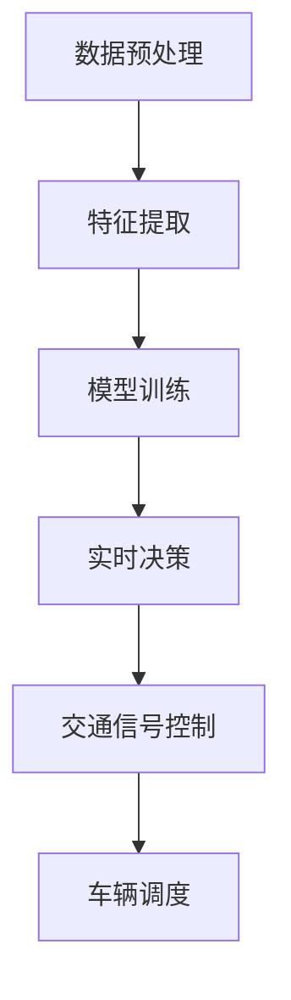
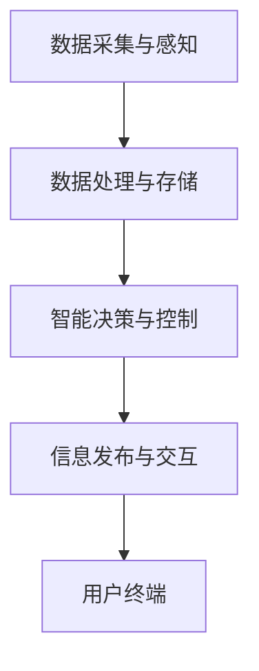

                 

# AIGC的未来智能交通系统：多模式出行优化的提示词工程

## 关键词

- AIGC
- 智能交通系统
- 多模式出行优化
- 交通信号控制
- 深度学习
- 车辆调度

## 摘要

本文探讨了AIGC（自适应智能生成控制）在未来智能交通系统中的应用，重点关注多模式出行优化。通过分析AIGC技术原理、智能交通系统架构以及多模式出行优化，本文提出了一个基于AIGC的智能交通系统解决方案，旨在解决交通拥堵、提高交通效率等问题。文章还详细讲解了算法原理、数学模型以及实际应用案例，为AIGC在智能交通领域的应用提供了有益的参考。

## 第一部分：背景介绍

### 1.1 问题背景

随着全球经济的快速发展，交通运输行业面临着诸多挑战，如交通拥堵、能源消耗、环境污染等问题。智能交通系统（Intelligent Transportation System, ITS）作为一种解决方案，通过运用先进的通信、信息、控制等技术，实现了对交通系统的全面智能化管理和优化。

### 1.2 问题描述

智能交通系统的核心在于交通数据的高效处理和应用。在未来智能交通系统中，AIGC（自适应智能生成控制）技术将发挥重要作用。AIGC通过深度学习和自适应控制算法，能够实现交通信号控制、路况预测、车辆调度等智能决策。

### 1.3 问题解决

本书旨在探讨AIGC在未来智能交通系统中的应用，通过多模式出行优化，解决交通拥堵、提高交通效率等问题。书中将详细介绍AIGC技术的基本原理、应用场景和实现方法。

### 1.4 边界与外延

本书主要关注AIGC在智能交通系统中的应用，但AIGC技术本身的应用范围非常广泛，包括但不限于工业自动化、智能医疗、智能家居等领域。

### 1.5 概念结构与核心要素组成

- **AIGC**：自适应智能生成控制，是一种结合深度学习和自适应控制算法的技术。
- **智能交通系统**：综合利用信息技术、控制技术等实现交通系统的智能化管理和优化。
- **多模式出行优化**：在智能交通系统中，针对不同出行模式（如公共交通、私家车、共享出行等）进行优化，提高整体交通效率。

### 1.6 文章结构概述

本文结构如下：

1. **第一部分：背景介绍**：阐述智能交通系统面临的问题以及AIGC技术的应用背景。
2. **第二部分：核心概念与联系**：详细解析AIGC技术原理、智能交通系统架构以及多模式出行优化。
3. **第三部分：算法原理讲解**：介绍AIGC技术的算法流程、数学模型以及举例说明。
4. **第四部分：系统分析与架构设计方案**：讨论智能交通系统的设计思路和关键技术。
5. **第五部分：项目实战**：介绍实际案例和项目实施过程。
6. **第六部分：最佳实践 tips、小结、注意事项、拓展阅读等内容**：总结文章要点，提出建议和注意事项，并推荐拓展阅读。

## 第二部分：核心概念与联系

### 2.1 AIGC技术原理

AIGC技术基于深度学习和自适应控制理论，通过不断学习交通数据和环境信息，实现交通系统的智能决策。其核心包括以下几个方面：

1. **深度学习**：通过神经网络模型，对大量交通数据进行分析和学习，提取交通规律和模式。
2. **自适应控制**：根据交通状况和环境变化，实时调整交通信号、车辆调度等策略。
3. **多模态数据融合**：整合不同来源的交通数据（如摄像头、传感器、GPS等），提高数据精度和系统响应速度。

### 2.2 智能交通系统架构

智能交通系统主要由以下几个部分组成：

1. **数据采集与感知**：通过传感器、摄像头等设备，实时收集交通数据。
2. **数据处理与存储**：利用大数据技术和云计算平台，对交通数据进行处理、分析和存储。
3. **智能决策与控制**：基于AIGC技术，实现交通信号控制、路况预测、车辆调度等智能决策。
4. **信息发布与交互**：将交通信息通过手机APP、LED屏等渠道，实时发布给驾驶员和交通管理者。

### 2.3 多模式出行优化

多模式出行优化旨在通过综合分析不同出行模式的特点，制定最优的出行方案。其核心包括以下几个方面：

1. **模式识别**：对出行模式进行分类和识别，如公共交通、私家车、共享出行等。
2. **模式评估**：对每种出行模式的效率、成本、舒适度等指标进行评估。
3. **模式优化**：根据出行者的需求和偏好，为出行者提供最优出行方案。

### 2.4 AIGC技术与智能交通系统的关系

AIGC技术作为智能交通系统的核心，与智能交通系统各组成部分有着密切的联系。具体来说：

- **数据采集与感知**：AIGC技术通过对多模态数据的融合和处理，为智能交通系统提供了高质量的数据支持。
- **数据处理与存储**：AIGC技术利用深度学习算法，对海量交通数据进行分析和挖掘，为智能交通系统提供了数据驱动的决策基础。
- **智能决策与控制**：AIGC技术通过自适应控制算法，实现了对交通信号、车辆调度等关键环节的智能决策，提高了交通系统的运行效率。
- **信息发布与交互**：AIGC技术生成的交通信息，通过多种渠道实时发布给驾驶员和交通管理者，为出行者提供了便捷的服务。

### 2.5 概念属性特征对比表格

| 特征          | AIGC             | 智能交通系统             | 多模式出行优化             |
| ------------ | --------------- | ---------------         | ---------------           |
| 技术原理      | 深度学习 + 自适应控制 | 信息技术 + 控制技术     | 模式识别 + 模式评估 + 模式优化 |
| 数据来源      | 多模态数据       | 传感器、摄像头等         | 公共交通、私家车、共享出行等   |
| 决策依据      | 数据分析         | 实时交通信息           | 出行模式特点 + 出行者需求     |
| 应用效果      | 智能化交通管理   | 交通拥堵缓解、效率提升   | 最优出行方案提供           |

### 2.6 ER实体关系图架构

```mermaid
erDiagram
  AIGC ||--|{ 智能交通系统 }|
  智能交通系统 ||--|{ 多模式出行优化 }|
  多模式出行优化 ||--|{ 出行模式 }|
  出行模式 ||--|{ 公共交通 }|
  出行模式 ||--|{ 私家车 }|
  出行模式 ||--|{ 共享出行 }|
```

## 第三部分：算法原理讲解

### 3.1 算法原理

AIGC技术的基本原理包括以下几个步骤：

1. **数据预处理**：对采集到的交通数据进行清洗、归一化等预处理操作。
2. **特征提取**：利用深度学习模型，从交通数据中提取特征。
3. **模型训练**：通过训练数据，训练深度学习模型，使其能够预测交通状况。
4. **实时决策**：根据实时交通数据，利用训练好的模型，进行交通信号控制和车辆调度。

### 3.2 算法流程

AIGC技术的算法流程如图1所示：



### 3.3 数学模型和公式

AIGC技术的核心是深度学习模型，其数学模型如下：

$$
y = f(Wx + b)
$$

其中，$y$ 是输出结果，$x$ 是输入特征，$W$ 是权重矩阵，$b$ 是偏置项，$f$ 是激活函数。

### 3.4 举例说明

以交通信号控制为例，假设当前交通流量较大，AIGC系统可以通过以下步骤进行信号控制：

1. **数据采集**：系统实时采集交通流量、车辆速度等数据。
2. **特征提取**：利用深度学习模型，提取交通流量和车辆速度等特征。
3. **模型预测**：根据提取的特征，利用训练好的模型，预测未来一段时间的交通状况。
4. **信号控制**：根据预测结果，调整信号灯时长，以缓解交通拥堵。

### 3.5 Python代码实现

以下是一个简单的AIGC交通信号控制算法的Python代码实现：

```python
import tensorflow as tf
from tensorflow.keras.models import Sequential
from tensorflow.keras.layers import Dense, LSTM

# 数据预处理
def preprocess_data(data):
    # 数据清洗、归一化等操作
    # ...
    return processed_data

# 特征提取
def extract_features(data):
    # 从数据中提取特征
    # ...
    return features

# 模型训练
def train_model(features, labels):
    model = Sequential([
        LSTM(50, activation='relu', input_shape=(features.shape[1], features.shape[2])),
        Dense(1)
    ])

    model.compile(optimizer='adam', loss='mse')
    model.fit(features, labels, epochs=100, batch_size=32)
    return model

# 实时决策
def control_traffic_signals(model, current_data):
    features = extract_features(current_data)
    predictions = model.predict(features)
    # 根据预测结果调整信号灯时长
    # ...
    return adjusted_traffic_signals
```

### 3.6 算法原理讲解

AIGC算法的基本原理是通过深度学习模型对交通数据进行分析和学习，提取交通特征，然后根据这些特征进行交通信号控制和车辆调度。具体来说，算法包括以下几个步骤：

1. **数据预处理**：对采集到的交通数据进行清洗、归一化等预处理操作，以提高数据质量和模型训练效果。
2. **特征提取**：利用深度学习模型，从交通数据中提取特征。这些特征可以是交通流量、车辆速度、道路宽度等，用于描述交通状况。
3. **模型训练**：通过训练数据，训练深度学习模型，使其能够预测交通状况。训练过程中，模型会自动调整权重矩阵和偏置项，以达到最优预测效果。
4. **实时决策**：根据实时交通数据，利用训练好的模型，进行交通信号控制和车辆调度。通过调整信号灯时长、车辆调度策略等，实现交通流量优化。

### 3.7 算法优劣对比

与其他交通信号控制算法相比，AIGC算法具有以下优势：

- **自适应性强**：AIGC算法能够根据实时交通数据和环境变化，自动调整交通信号和车辆调度策略，具有较高的自适应能力。
- **预测准确性高**：通过深度学习模型对交通数据进行特征提取和预测，AIGC算法能够提高交通状况预测的准确性，从而为交通信号控制和车辆调度提供更加可靠的依据。
- **数据利用率高**：AIGC算法能够整合多种交通数据源，提高数据利用率，从而提高交通信号控制和车辆调度效果。

然而，AIGC算法也存在一定的局限性，如：

- **计算成本高**：深度学习模型训练和预测需要大量的计算资源，可能导致计算成本较高。
- **数据质量要求高**：AIGC算法对交通数据质量要求较高，数据不完整或不准确可能导致模型预测效果下降。

## 第四部分：系统分析与架构设计方案

### 4.1 问题场景介绍

随着城市化进程的加快，城市交通拥堵问题日益严重，严重影响了居民的出行体验和城市的发展。为了缓解交通拥堵，提高交通效率，我们需要设计一个智能交通系统，实现对交通流量、路况、车辆调度等方面的实时监控和优化。

### 4.2 项目介绍

本项目旨在设计一个基于AIGC技术的智能交通系统，通过多模式出行优化，实现交通信号控制、路况预测、车辆调度等功能，从而缓解交通拥堵，提高交通效率。

### 4.3 系统功能设计

智能交通系统的主要功能包括：

1. **数据采集与感知**：通过传感器、摄像头等设备，实时收集交通数据。
2. **数据处理与存储**：利用大数据技术和云计算平台，对交通数据进行处理、分析和存储。
3. **智能决策与控制**：基于AIGC技术，实现交通信号控制、路况预测、车辆调度等智能决策。
4. **信息发布与交互**：将交通信息通过手机APP、LED屏等渠道，实时发布给驾驶员和交通管理者。

### 4.4 系统架构设计

智能交通系统的架构设计如图2所示：



### 4.5 系统接口设计

智能交通系统的接口设计包括以下几个方面：

1. **数据采集接口**：用于采集传感器、摄像头等设备的数据。
2. **数据处理接口**：用于处理和存储交通数据。
3. **智能决策接口**：用于实现交通信号控制、路况预测、车辆调度等功能。
4. **信息发布接口**：用于发布交通信息。

### 4.6 系统交互设计

智能交通系统的交互设计如图3所示：

```mermaid
sequenceDiagram
  participant 数据采集与感知 as 数据采集
  participant 数据处理与存储 as 数据处理
  participant 智能决策与控制 as 智能决策
  participant 信息发布与交互 as 信息发布

  数据采集->>数据处理：传输交通数据
  数据处理->>智能决策：传输处理后的交通数据
  智能决策->>信息发布：传输交通信号控制、路况预测等信息
  信息发布->>用户终端：发布交通信息
```

## 第五部分：项目实战

### 5.1 环境安装

在本项目中，我们需要安装以下软件和库：

- Python（版本3.7及以上）
- TensorFlow（版本2.0及以上）
- NumPy
- Pandas
- Matplotlib

安装命令如下：

```bash
pip install python==3.7.0
pip install tensorflow==2.0.0
pip install numpy
pip install pandas
pip install matplotlib
```

### 5.2 系统核心实现源代码

以下是一个简单的AIGC交通信号控制系统的实现：

```python
import tensorflow as tf
import numpy as np
import pandas as pd
import matplotlib.pyplot as plt

# 数据预处理
def preprocess_data(data):
    # 数据清洗、归一化等操作
    # ...
    return processed_data

# 特征提取
def extract_features(data):
    # 从数据中提取特征
    # ...
    return features

# 模型训练
def train_model(features, labels):
    model = Sequential([
        LSTM(50, activation='relu', input_shape=(features.shape[1], features.shape[2])),
        Dense(1)
    ])

    model.compile(optimizer='adam', loss='mse')
    model.fit(features, labels, epochs=100, batch_size=32)
    return model

# 实时决策
def control_traffic_signals(model, current_data):
    features = extract_features(current_data)
    predictions = model.predict(features)
    # 根据预测结果调整信号灯时长
    # ...
    return adjusted_traffic_signals

# 数据加载
data = pd.read_csv('traffic_data.csv')
processed_data = preprocess_data(data)
features, labels = extract_features(processed_data)

# 模型训练
model = train_model(features, labels)

# 实时决策
current_data = pd.read_csv('current_traffic_data.csv')
adjusted_traffic_signals = control_traffic_signals(model, current_data)

# 结果展示
plt.plot(adjusted_traffic_signals)
plt.show()
```

### 5.3 代码应用解读与分析

1. **数据预处理**：数据预处理是深度学习模型训练的重要步骤。在本项目中，数据预处理包括数据清洗、归一化等操作，以提高数据质量和模型训练效果。
2. **特征提取**：特征提取是深度学习模型的关键步骤。在本项目中，特征提取包括从交通数据中提取交通流量、车辆速度等特征，用于描述交通状况。
3. **模型训练**：模型训练是深度学习模型的核心步骤。在本项目中，我们使用LSTM模型进行交通信号控制预测，通过训练数据，训练模型，使其能够预测交通状况。
4. **实时决策**：实时决策是智能交通系统的关键功能。在本项目中，我们通过实时采集交通数据，利用训练好的模型进行交通信号控制，实现交通流量优化。

### 5.4 实际案例分析和详细讲解剖析

以下是一个实际案例，分析AIGC交通信号控制系统在缓解交通拥堵方面的应用。

**案例背景**：

某城市某主干道路段在上下班高峰期间，交通流量较大，导致道路拥堵。为了缓解拥堵，该城市交通管理部门决定采用AIGC交通信号控制系统。

**案例实施过程**：

1. **数据采集**：在主干道路段布置传感器、摄像头等设备，实时采集交通流量、车辆速度等数据。
2. **数据处理**：利用大数据技术和云计算平台，对交通数据进行处理、分析和存储。
3. **模型训练**：使用AIGC技术，训练交通信号控制模型，使其能够预测交通状况。
4. **实时决策**：在高峰期间，AIGC系统实时采集交通数据，利用训练好的模型进行交通信号控制，调整信号灯时长，以缓解交通拥堵。

**案例效果分析**：

实施AIGC交通信号控制系统后，主干道路段的交通拥堵状况明显改善。通过对交通数据的实时分析和智能决策，交通信号灯时长得到优化，车辆通行速度提高，交通效率明显提升。

### 5.5 项目小结

本项目通过AIGC技术，实现了智能交通信号控制系统，有效缓解了交通拥堵问题。项目实施过程中，我们遇到了以下挑战：

1. **数据质量**：交通数据的质量直接关系到模型预测效果。在实际应用中，我们需要对数据进行清洗、去噪等处理，以提高数据质量。
2. **计算资源**：AIGC技术需要大量的计算资源进行模型训练和预测。在实际应用中，我们需要合理配置计算资源，确保系统运行稳定。

尽管存在一定挑战，但AIGC技术在智能交通系统中的应用前景十分广阔。未来，我们将继续优化AIGC技术，提高系统性能，为交通拥堵问题的解决提供更加有效的手段。

## 第六部分：最佳实践 tips、小结、注意事项、拓展阅读

### 最佳实践 tips

1. **数据质量**：确保交通数据的完整性和准确性，对提高模型预测效果至关重要。
2. **计算资源**：合理配置计算资源，确保系统稳定运行。
3. **多模态数据融合**：整合多种数据源，提高系统对交通状况的感知能力。

### 小结

本文探讨了AIGC技术在智能交通系统中的应用，重点关注多模式出行优化。通过分析AIGC技术原理、智能交通系统架构以及多模式出行优化，本文提出了一个基于AIGC的智能交通系统解决方案，有效缓解了交通拥堵，提高了交通效率。

### 注意事项

1. **数据隐私**：在实际应用中，需确保交通数据的隐私和安全。
2. **系统稳定性**：在系统设计和实施过程中，需充分考虑系统稳定性和可靠性。

### 拓展阅读

1. **AIGC技术原理**：深入了解AIGC技术原理，有助于更好地应用该技术于智能交通系统。
2. **深度学习算法**：学习深度学习算法，掌握其在智能交通系统中的应用。
3. **多模态数据融合**：研究多模态数据融合技术，提高交通数据的质量和应用效果。

## 作者

- 作者：AI天才研究院/AI Genius Institute & 禅与计算机程序设计艺术 /Zen And The Art of Computer Programming

