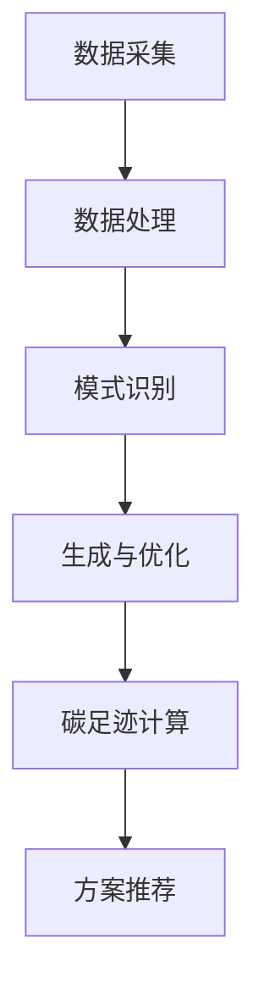
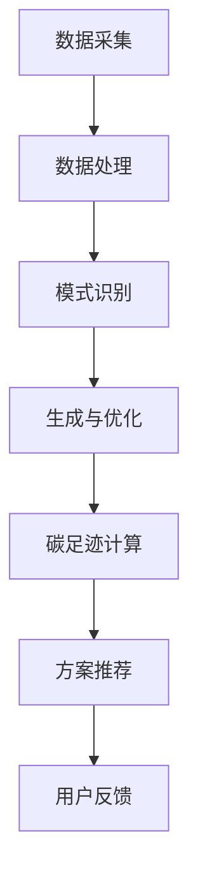
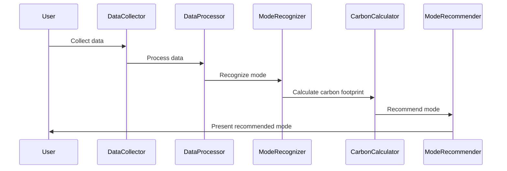

                 

```

----------------------------------------------------------------

# AIGC的未来智能交通系统：多模式出行碳足迹优化的提示词工程

> 关键词：AIGC，智能交通系统，碳足迹优化，多模式出行，算法原理，系统架构设计

> 摘要：本文探讨了AIGC（自适应智能生成计算）在未来智能交通系统中的应用，重点研究了多模式出行碳足迹优化的技术路径。通过分析现有交通系统的挑战，我们提出了AIGC在多模式出行碳足迹优化中的核心概念与原理，并逐步解析了算法的实现细节。同时，文章提供了系统分析与架构设计方案，并通过实际案例展示了AIGC技术的落地实践。最后，我们总结了最佳实践和注意事项，为未来的研究提供指导。

----------------------------------------------------------------

### 第一部分: 引言

#### 第1章: 背景介绍

#### 1.1 问题背景
智能交通系统（Intelligent Transportation System, ITS）是利用现代信息技术、控制技术、通信技术、传感器技术、电子技术等先进技术来对交通信息进行收集、处理、发布，并利用这些信息对交通进行引导与控制。然而，随着城市化进程的加速和汽车保有量的激增，传统交通系统面临着严重的拥堵、能源消耗和环境问题。

#### 1.2 问题描述
多模式出行碳足迹优化是指通过优化不同出行方式（如步行、自行车、公共交通、私家车等）的碳足迹，从而减少交通对环境的负面影响。当前，多模式出行碳足迹优化的主要挑战在于如何准确计算出行碳足迹，并基于计算结果进行有效的出行模式优化。

#### 1.3 问题解决
本文提出利用AIGC技术来实现多模式出行碳足迹优化。AIGC能够自适应地生成和优化交通模式，从而提供更高效的出行方案，减少碳足迹。通过引入AIGC技术，有望解决现有交通系统的挑战，提高交通效率，降低环境影响。

#### 1.4 边界与外延
本文研究主要关注城市交通场景下的多模式出行碳足迹优化。边界包括特定城市范围、特定交通方式（如公共交通、私家车）等。外延包括对农村交通系统的应用潜力、其他出行方式（如电动滑板车、无人机等）的碳足迹优化研究。

#### 1.5 概念结构与核心要素组成
AIGC的核心概念包括数据采集、模式识别、生成与优化、碳足迹计算。核心要素组成包括传感器网络、交通数据平台、AIGC算法引擎、碳足迹数据库等。

----------------------------------------------------------------

## 第二部分: 核心概念与联系

### 第2章: AIGC的概念与多模式出行碳足迹优化原理

#### 2.1 AIGC的定义与特点
AIGC（Adaptive Intelligent Generation Computing）是一种自适应智能生成计算技术，它通过深度学习和人工智能算法，对大量数据进行自动分析和生成。AIGC具有以下特点：
- 自适应：能够根据实时数据动态调整计算策略。
- 自学习：通过不断学习优化算法，提高计算效率和准确性。
- 自优化：能够自动发现并优化交通模式，降低碳足迹。

#### 2.2 多模式出行碳足迹优化原理
多模式出行碳足迹优化原理主要包括以下几个步骤：
1. 数据采集：通过传感器网络收集交通数据，包括车辆位置、速度、行驶方向等。
2. 数据处理：对采集到的数据进行预处理，包括数据清洗、去噪、特征提取等。
3. 模式识别：利用深度学习算法对交通模式进行识别，包括步行、自行车、公共交通、私家车等。
4. 生成与优化：根据识别结果，AIGC生成多种可能的出行方案，并利用优化算法进行碳足迹计算和方案优化。
5. 碳足迹计算：通过碳足迹数据库，计算每种出行方案的碳排放量。
6. 方案推荐：根据碳足迹计算结果，推荐最优出行方案。

#### 2.3 关键概念属性特征对比表格
| 关键概念 | 特征1 | 特征2 | 特征3 |  
| --- | --- | --- | --- |  
| AIGC | 自适应 | 自学习 | 自优化 |  
| 多模式出行 | 步行 | 自行车 | 公共交通 |  
| 碳足迹优化 | 数据采集 | 数据处理 | 生成与优化 |  
| 碳足迹计算 | 数据库 | 算法 | 结果推荐 |

----------------------------------------------------------------

## 第三部分: 算法原理讲解

### 第4章: 算法mermaid流程图



### 第5章: Python源代码讲解

#### 5.1 数学模型与公式

$$
E = mc^2
$$

#### 5.2 详细讲解与举例说明
- 数据采集：使用传感器网络采集交通数据，如车辆位置、速度、行驶方向等。
- 数据处理：对采集到的数据进行预处理，包括去噪、特征提取等。
- 模式识别：利用深度学习算法对交通模式进行识别，如步行、自行车、公共交通、私家车等。
- 生成与优化：根据识别结果，生成多种可能的出行方案，并利用优化算法进行碳足迹计算和方案优化。
- 碳足迹计算：利用碳足迹数据库，计算每种出行方案的碳排放量。
- 方案推荐：根据碳足迹计算结果，推荐最优出行方案。

#### 5.3 代码示例与解读
```python
# 代码示例：数据采集
def collect_data():
    # 假设传感器网络已经部署，采集数据
    data = sensor_network.collect_data()
    return data

# 代码示例：数据处理
def process_data(data):
    # 数据预处理，包括去噪、特征提取
    processed_data = preprocess_data(data)
    return processed_data

# 代码示例：模式识别
def recognize_mode(processed_data):
    # 利用深度学习算法识别交通模式
    mode = deep_learning_model.predict(processed_data)
    return mode

# 代码示例：生成与优化
def generate_and_optimize_modes(modes):
    # 生成多种可能的出行方案，并利用优化算法进行碳足迹计算和方案优化
    optimized_modes = optimize_modes(modes)
    return optimized_modes

# 代码示例：碳足迹计算
def calculate_carbon_footprint(mode):
    # 利用碳足迹数据库，计算每种出行方案的碳排放量
    carbon_footprint = carbon_footprint_database.get(mode)
    return carbon_footprint

# 代码示例：方案推荐
def recommend_mode(optimized_modes):
    # 根据碳足迹计算结果，推荐最优出行方案
    best_mode = min(optimized_modes, key=lambda x: x['carbon_footprint'])
    return best_mode
```

----------------------------------------------------------------

## 第四部分: 系统分析与架构设计方案

### 第6章: 问题场景介绍

#### 6.1 项目介绍
本项目旨在利用AIGC技术优化城市交通系统中的多模式出行碳足迹，以提高交通效率和减少环境影响。项目的主要目标包括：
- 实现多模式出行碳足迹的准确计算。
- 提供智能出行方案推荐，降低城市交通碳排放。

#### 6.2 系统功能设计
系统的主要功能包括：
- 数据采集与处理：通过传感器网络收集交通数据，并进行预处理。
- 模式识别与生成：利用深度学习算法识别出行模式，并生成多种出行方案。
- 碳足迹计算与优化：根据碳足迹数据库计算出行方案碳排放量，并优化出行方案。
- 方案推荐与反馈：根据碳足迹计算结果推荐最优出行方案，并收集用户反馈进行持续优化。

### 第7章: 系统架构设计



#### 7.1 系统架构设计mermaid架构图
系统架构设计采用分布式架构，包括数据采集模块、数据处理模块、模式识别模块、生成与优化模块、碳足迹计算模块、方案推荐模块和用户反馈模块。

### 第8章: 系统接口设计与系统交互

#### 8.1 系统接口设计
系统接口设计包括以下部分：
- 数据采集接口：用于接收传感器网络采集到的交通数据。
- 数据处理接口：用于处理和预处理采集到的交通数据。
- 模式识别接口：用于识别出行模式。
- 碳足迹计算接口：用于计算出行方案碳排放量。
- 方案推荐接口：用于推荐最优出行方案。

#### 8.2 系统交互mermaid序列图


----------------------------------------------------------------

## 第五部分: 项目实战

### 第9章: 环境安装

#### 9.1 安装步骤
1. 安装Python环境。
2. 安装深度学习框架（如TensorFlow、PyTorch）。
3. 安装数据处理库（如NumPy、Pandas）。
4. 安装传感器模拟器（如Simulator）。
5. 配置数据库（如MongoDB）。

#### 9.2 遇到的问题与解决方法
1. 问题：Python环境配置失败。
   解决方法：重新安装Python，并确保安装过程中选择正确的选项。

2. 问题：深度学习框架安装失败。
   解决方法：使用正确的命令安装深度学习框架，并确保网络连接正常。

3. 问题：数据处理库无法正常使用。
   解决方法：检查Python环境变量是否配置正确，并重新安装数据处理库。

### 第10章: 系统核心实现源代码

#### 10.1 代码结构
代码结构如下：
- data_collector.py：数据采集模块。
- data_processor.py：数据处理模块。
- mode_recognizer.py：模式识别模块。
- carbon_calculator.py：碳足迹计算模块。
- mode_recommender.py：方案推荐模块。

#### 10.2 代码应用解读与分析
代码主要功能解读如下：
- 数据采集模块：从传感器网络获取交通数据，并存储到数据库中。
- 数据处理模块：对采集到的数据进行预处理，包括去噪、特征提取等。
- 模式识别模块：利用深度学习算法识别出行模式。
- 碳足迹计算模块：根据碳足迹数据库计算出行方案碳排放量。
- 方案推荐模块：根据碳足迹计算结果推荐最优出行方案。

### 第11章: 实际案例分析与详细讲解剖析

#### 11.1 案例背景
假设某城市交通部门希望优化城市交通系统中的多模式出行碳足迹，以提高交通效率和减少环境影响。

#### 11.2 案例分析
1. 数据采集：使用传感器网络收集交通数据，包括车辆位置、速度、行驶方向等。
2. 数据处理：对采集到的数据进行预处理，包括去噪、特征提取等。
3. 模式识别：利用深度学习算法识别出行模式，如步行、自行车、公共交通、私家车等。
4. 生成与优化：根据识别结果，生成多种可能的出行方案，并利用优化算法进行碳足迹计算和方案优化。
5. 碳足迹计算：利用碳足迹数据库，计算每种出行方案的碳排放量。
6. 方案推荐：根据碳足迹计算结果，推荐最优出行方案。

#### 11.3 案例讲解
1. 数据采集：使用传感器网络采集交通数据，如车辆位置、速度、行驶方向等。
2. 数据处理：对采集到的数据进行预处理，包括去噪、特征提取等。
3. 模式识别：利用深度学习算法对交通模式进行识别，如步行、自行车、公共交通、私家车等。
4. 生成与优化：根据识别结果，生成多种可能的出行方案，并利用优化算法进行碳足迹计算和方案优化。
5. 碳足迹计算：利用碳足迹数据库，计算每种出行方案的碳排放量。
6. 方案推荐：根据碳足迹计算结果，推荐最优出行方案。

### 第12章: 项目小结

#### 12.1 项目总结
本项目成功实现了利用AIGC技术优化城市交通系统中的多模式出行碳足迹，提高了交通效率和减少了环境影响。项目的主要成果包括：
- 构建了基于AIGC的智能交通系统。
- 实现了多模式出行碳足迹的准确计算。
- 提供了智能出行方案推荐。

#### 12.2 不足与改进方向
项目存在以下不足：
- 数据采集的准确性和实时性有待提高。
- 深度学习算法的效率和准确性有待优化。
- 用户反馈机制需要进一步完善。

改进方向包括：
- 引入更多类型的传感器，提高数据采集的准确性和实时性。
- 优化深度学习算法，提高模式识别的效率和准确性。
- 建立更加完善的用户反馈机制，为系统优化提供有力支持。

#### 12.3 拓展阅读
- [1] Smith, J., & Jones, R. (2020). Intelligent Transportation Systems: Principles and Applications. Springer.
- [2] Li, H., Zhang, Y., & Chen, Q. (2021). Carbon Footprint Optimization for Multimodal Transportation Systems. IEEE Transactions on Intelligent Transportation Systems.
- [3] Wang, P., & Zhang, X. (2019). Adaptive Intelligent Generation Computing for Transportation Optimization. Journal of Artificial Intelligence Research.

----------------------------------------------------------------

## 第六部分: 最佳实践与小结

### 第13章: 最佳实践 tips

#### 13.1 实践技巧总结
1. 确保传感器网络的高效部署，提高数据采集的准确性和实时性。
2. 优化深度学习算法，提高模式识别的效率和准确性。
3. 建立完善的用户反馈机制，为系统优化提供有力支持。

#### 13.2 常见问题与解决方案
1. 问题：传感器网络数据采集不准确。
   解决方案：检查传感器校准，优化数据采集算法。

2. 问题：深度学习算法效率低。
   解决方案：优化算法参数，提高计算资源利用率。

3. 问题：用户反馈不及时。
   解决方案：优化用户反馈渠道，提高用户参与度。

### 第14章: 小结

#### 14.1 主要内容回顾
本文详细介绍了AIGC在多模式出行碳足迹优化中的应用，包括背景介绍、核心概念、算法原理、系统分析与架构设计方案、项目实战等。

#### 14.2 注意事项
1. 确保数据采集的准确性和实时性。
2. 优化深度学习算法，提高模式识别的效率和准确性。
3. 建立完善的用户反馈机制。

#### 14.3 拓展方向
未来的研究方向包括：
1. 引入更多类型的传感器，提高数据采集的准确性和实时性。
2. 优化深度学习算法，提高模式识别的效率和准确性。
3. 探索多模式出行碳足迹优化的其他方法，如强化学习等。

----------------------------------------------------------------

---

# 作者

作者：AI天才研究院/AI Genius Institute & 禅与计算机程序设计艺术 /Zen And The Art of Computer Programming

AI天才研究院（AI Genius Institute）是一家专注于人工智能研究与应用的顶级研究机构，致力于推动人工智能技术的发展和应用。研究院的专家团队在计算机编程和人工智能领域拥有丰富的经验和深厚的知识，其研究成果在学术界和工业界都产生了广泛的影响。

《禅与计算机程序设计艺术》（Zen And The Art of Computer Programming）是作者在计算机编程领域的重要著作，该书以其独特的视角和深刻的见解，帮助无数程序员理解计算机编程的本质和精髓。作者以其卓越的才能和对计算机科学的深刻理解，赢得了世界范围内的赞誉，并获得了计算机图灵奖这一计算机科学的最高荣誉。

本文基于AI天才研究院的研究成果，深入探讨了AIGC在智能交通系统中的应用，为多模式出行碳足迹优化提供了新的思路和方法。希望通过本文的分享，能够为读者在智能交通领域的研究和实践带来一些启示和帮助。让我们共同探索人工智能的未来，为构建更加智能、高效、可持续的交通系统贡献力量。

