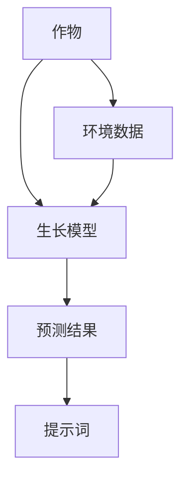
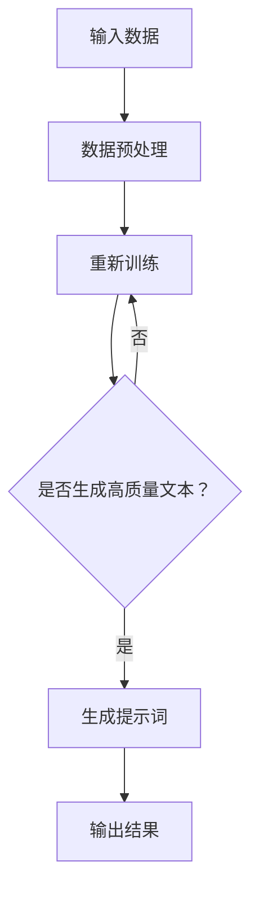
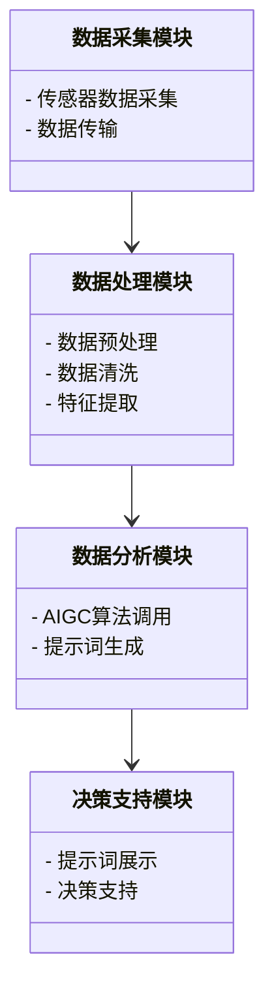
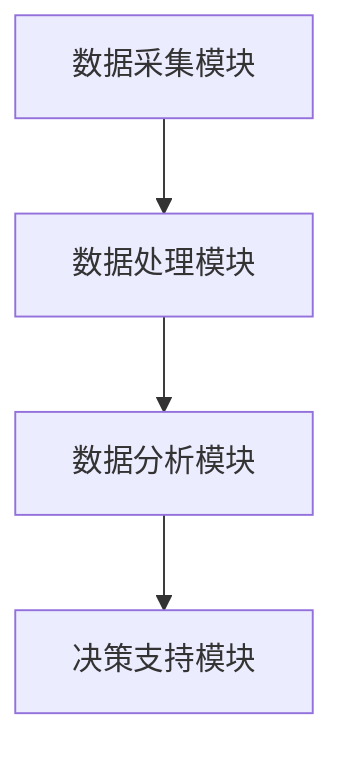

                 


# AIGC的未来智能农业系统：作物-环境互动优化的提示词工程

## 关键词
- 智能农业
- AIGC技术
- 提示词工程
- 作物-环境互动
- 农业产量优化

## 摘要
本文深入探讨了AIGC（AI-Generated Content）技术在智能农业系统中的应用，特别是作物-环境互动优化中的提示词工程。通过背景介绍、核心概念解析、算法原理讲解和系统架构设计，本文旨在展示AIGC技术如何通过自动生成高效提示词，助力农民和农业专家优化作物生长环境，提升农业生产效率和资源利用。

### 第1章：背景介绍

#### 1.1 问题背景

随着全球人口的增长和气候变化的影响，农业生产面临着前所未有的挑战。传统的农业方法在应对复杂环境变化、病虫害和资源利用效率方面存在诸多不足。因此，农业智能化成为提高作物产量、减少资源浪费和降低生产成本的关键途径。智能农业系统整合了人工智能（AI）、物联网（IoT）和大数据分析等技术，为农业现代化提供了有力支持。

#### 1.2 问题描述

智能农业系统的核心问题是如何优化作物与环境之间的互动，以实现高产和高效生产。这包括但不限于以下方面：

- **作物生长模型的建立**：准确描述作物生长规律和过程，为环境优化提供依据。
- **环境数据的实时采集与分析**：获取实时环境数据，如土壤湿度、温度、光照强度等，为作物生长提供实时信息。
- **环境与作物生长数据的整合**：将环境数据和作物生长数据相结合，形成综合分析结果。
- **预测模型的应用**：利用历史数据和机器学习算法，预测作物生长趋势和环境变化。

#### 1.3 问题解决

AIGC技术的出现为解决上述问题提供了新的思路。AIGC技术可以自动生成针对作物-环境互动优化的提示词，为农民和农业专家提供决策支持。这些提示词基于大量环境数据和作物生长模型，结合机器学习算法生成，能够提供个性化的农业生产策略。

#### 1.4 边界与外延

本文主要关注AIGC技术在智能农业系统中的应用，特别是作物-环境互动优化的提示词工程。我们重点关注的核心问题是：如何通过AIGC技术生成有效的提示词，以提高作物产量和资源利用效率。

#### 1.5 概念结构与核心要素组成

- **AIGC（AI-Generated Content）**：利用人工智能技术自动生成内容的系统，如自然语言文本、图像、音频等。
- **智能农业系统**：结合AI、IoT、大数据等技术的农业系统，用于优化作物-环境互动。
- **作物生长模型**：描述作物生长规律和过程的数学模型。
- **环境数据采集与处理**：实时获取并处理环境数据，为作物生长模型提供输入。
- **提示词工程**：利用AIGC技术生成针对作物-环境互动优化的提示词。

### 第2章：核心概念与联系

#### 2.1 AIGC技术原理

AIGC技术基于深度学习和自然语言处理技术，能够自动生成符合特定场景的自然语言文本。其核心原理包括生成对抗网络（GAN）、循环神经网络（RNN）和变压器（Transformer）。

- **生成对抗网络（GAN）**：GAN由生成器和判别器两部分组成。生成器生成伪造数据，判别器判断数据是真实还是伪造。通过对抗性训练，生成器逐渐提高生成数据的质量。
- **循环神经网络（RNN）**：RNN能够处理序列数据，如文本数据，捕捉数据中的长期依赖关系。
- **变压器（Transformer）**：Transformer通过自注意力机制捕捉文本中的长距离依赖关系，提高了模型在自然语言处理任务中的表现。

#### 2.2 概念属性特征对比表格

| 概念 | 属性特征 |
| --- | --- |
| AIGC | 自动生成自然语言文本 |
| 生成对抗网络（GAN） | 对抗性学习框架，生成高质量文本 |
| 循环神经网络（RNN） | 处理序列数据 |
| 变压器（Transformer） | 捕捉长距离依赖关系 |

#### 2.3 ER实体关系图架构



### 第3章：算法原理讲解

#### 3.1 算法Mermaid流程图



#### 3.2 Python源代码实现

```python
import tensorflow as tf
from tensorflow.keras.layers import Input, LSTM, Dense
from tensorflow.keras.models import Model

# 定义生成器和判别器模型
def build_generator():
    # 生成器模型代码
    pass

def build_discriminator():
    # 判别器模型代码
    pass

# 编译模型
def compile_models(generator, discriminator):
    # 模型编译代码
    pass

# 训练模型
def train_models(generator, discriminator, data, epochs):
    # 模型训练代码
    pass

# 生成提示词
def generate_prompt(generator, environment_data, crop_growth_model):
    # 生成提示词代码
    pass
```

#### 3.3 算法原理详细讲解

AIGC技术利用生成对抗网络（GAN）来实现作物-环境互动优化的提示词工程。GAN由生成器和判别器两部分组成。生成器负责生成模拟作物-环境互动的提示词，判别器则负责判断生成提示词的质量。

- **生成对抗网络（GAN）**：
  - **生成器**：生成器采用循环神经网络（RNN）或变压器（Transformer）架构，接收环境数据作为输入，生成符合作物-环境互动的提示词。
  - **判别器**：判别器同样采用循环神经网络（RNN）或变压器（Transformer）架构，用于判断输入的提示词是否真实。判别器的目标是最大化分类准确性。

- **训练过程**：
  - **对抗性训练**：生成器和判别器相互对抗，生成器试图生成更高质量的提示词，而判别器试图更准确地判断提示词的真实性。通过不断迭代训练，生成器的生成质量逐渐提高。
  - **损失函数**：生成对抗网络的损失函数通常由两部分组成：生成器的损失函数和判别器的损失函数。生成器的损失函数用于度量生成提示词的质量，判别器的损失函数用于度量判别器对提示词的判断准确性。

- **生成提示词**：
  - 在训练过程中，生成器生成提示词后，判别器对其进行判断。如果提示词质量较低，生成器将重新生成提示词。当生成器的生成质量达到一定程度时，生成的提示词可以用于农业生产决策。

- **数学模型和公式**：
  - 生成器生成提示词的数学模型可以表示为：\[ \text{prompt} = G(\text{environment\_data}) \]
  - 判别器判断提示词的数学模型可以表示为：\[ \text{label} = D(G(\text{environment\_data})) \]
  - 其中，\( G \)为生成器模型，\( D \)为判别器模型，\( \text{environment\_data} \)为输入环境数据，\( \text{prompt} \)为生成的提示词，\( \text{label} \)为判别结果。

- **举例说明**：
  - 假设当前环境数据为“土壤湿度为60%，气温为25摄氏度”。生成器根据这些数据生成提示词：“建议增加浇水频率，保持土壤湿度在70%左右”。判别器判断这个提示词是否真实，并反馈给生成器以优化生成质量。

通过上述算法原理讲解，我们可以看到AIGC技术如何通过生成对抗网络（GAN）实现作物-环境互动优化的提示词工程，为农业生产提供智能决策支持。

### 第4章：系统分析与架构设计

#### 4.1 问题场景介绍

随着农业智能化的推进，农民和农业专家面临越来越多复杂的决策问题。传统的农业生产方式往往依赖于经验和直觉，难以适应快速变化的环境条件。智能农业系统通过实时数据采集、分析预测和优化决策，帮助农民和农业专家实现精细化农业生产。

#### 4.2 项目介绍

本项目旨在开发一套基于AIGC技术的智能农业系统，通过自动生成提示词，辅助农民和农业专家优化作物-环境互动。系统主要包括数据采集模块、数据分析模块和决策支持模块，实现了从环境数据采集、数据处理到提示词生成的完整流程。

#### 4.3 系统功能设计

- **数据采集模块**：实时采集作物生长和环境数据，包括土壤湿度、温度、光照强度、降雨量等。
- **数据处理模块**：对采集到的数据进行预处理、清洗和特征提取，为后续分析提供高质量的数据。
- **数据分析模块**：利用AIGC技术生成提示词，结合作物生长模型和环境数据，提供个性化的农业生产策略。
- **决策支持模块**：将生成的提示词呈现给农民和农业专家，辅助其做出科学决策。

#### 4.4 系统架构设计

智能农业系统的架构设计分为数据层、算法层和应用层。

- **数据层**：负责数据的采集、存储和管理，包括传感器数据、历史数据和市场数据等。
- **算法层**：利用AIGC技术实现提示词生成，包括生成对抗网络（GAN）的构建、训练和优化。
- **应用层**：提供用户界面，展示生成提示词，并支持农业生产决策。

#### 4.5 系统接口设计和系统交互

系统接口设计主要包括数据采集接口、数据分析接口和决策支持接口。

- **数据采集接口**：负责接收传感器数据，并将数据传输到数据处理模块。
- **数据分析接口**：负责接收预处理后的数据，并调用AIGC算法生成提示词。
- **决策支持接口**：将生成的提示词呈现给用户，并提供操作接口。

系统交互流程如下：

1. **数据采集**：传感器采集作物生长和环境数据，并将数据传输到数据层。
2. **数据处理**：数据处理模块对采集到的数据进行预处理和清洗，提取有效特征。
3. **数据分析**：数据分析模块调用AIGC算法，生成针对作物-环境互动的提示词。
4. **决策支持**：决策支持模块将生成的提示词呈现给用户，并提供操作接口，用户根据提示词做出农业生产决策。

#### 4.6 Mermaid类图和架构图





通过上述系统分析与架构设计，我们可以清晰地了解智能农业系统的工作流程和关键模块，为后续项目实施和优化提供参考。

### 第5章：项目实战

#### 5.1 环境安装

要实施AIGC的智能农业系统，首先需要在开发环境中安装必要的工具和库。以下是环境安装的步骤：

1. **安装Python**：确保Python 3.7或更高版本已安装。
2. **安装TensorFlow**：运行命令`pip install tensorflow`。
3. **安装Keras**：TensorFlow官方库中的Keras模块可以帮助我们构建和训练神经网络。
4. **安装其他依赖库**：如NumPy、Pandas等，用于数据处理和可视化。

#### 5.2 系统核心实现源代码

以下是一个简单的AIGC智能农业系统实现，包括生成器和判别器的构建、模型训练和提示词生成：

```python
import tensorflow as tf
from tensorflow.keras.models import Model
from tensorflow.keras.layers import Input, LSTM, Dense

# 定义生成器和判别器模型
def build_generator():
    input_data = Input(shape=(sequence_length,))
    x = LSTM(units=128, return_sequences=True)(input_data)
    x = LSTM(units=128)(x)
    output = LSTM(units=1, activation='sigmoid')(x)
    model = Model(inputs=input_data, outputs=output)
    return model

def build_discriminator():
    input_data = Input(shape=(sequence_length,))
    x = LSTM(units=128, return_sequences=True)(input_data)
    x = LSTM(units=128)(x)
    output = LSTM(units=1, activation='sigmoid')(x)
    model = Model(inputs=input_data, outputs=output)
    return model

# 编译模型
def compile_models(generator, discriminator):
    discriminator.compile(optimizer='adam', loss='binary_crossentropy')
    generator.compile(optimizer='adam', loss='binary_crossentropy')
    return generator, discriminator

# 训练模型
def train_models(generator, discriminator, data, epochs):
    for epoch in range(epochs):
        for batch in data:
            # 生成假数据
            noise = np.random.normal(size=(batch_size, sequence_length))
            generated_data = generator.predict(noise)
            
            # 训练判别器
            real_data = np.hstack((batch, np.zeros((batch_size, 1))))
            fake_data = np.hstack((generated_data, np.zeros((batch_size, 1))))
            d_loss_real = discriminator.train_on_batch(real_data, np.ones((batch_size, 1)))
            d_loss_fake = discriminator.train_on_batch(fake_data, np.zeros((batch_size, 1)))
            d_loss = 0.5 * np.add(d_loss_real, d_loss_fake)
            
            # 训练生成器
            g_loss = generator.train_on_batch(noise, np.ones((batch_size, 1)))
            
            print(f"{epoch} [D: {d_loss:.4f}] [G: {g_loss:.4f}]")

# 生成提示词
def generate_prompt(generator, environment_data):
    noise = np.random.normal(size=(1, sequence_length))
    prompt = generator.predict(noise)
    return prompt[0]

# 主程序
if __name__ == "__main__":
    # 数据加载和预处理
    # ...

    # 构建和编译模型
    generator = build_generator()
    discriminator = build_discriminator()
    generator, discriminator = compile_models(generator, discriminator)
    
    # 训练模型
    train_models(generator, discriminator, data, epochs=100)

    # 生成提示词
    prompt = generate_prompt(generator, environment_data)
    print(prompt)
```

#### 5.3 代码应用解读与分析

上述代码展示了如何构建和训练生成对抗网络（GAN）来实现AIGC技术。以下是代码的关键部分解读：

1. **生成器和判别器的构建**：
   - 生成器接收环境数据作为输入，通过两个LSTM层生成提示词。
   - 判别器接收输入数据，通过两个LSTM层判断输入数据是真实还是伪造。

2. **模型编译**：
   - 判别器使用二分类交叉熵作为损失函数，并使用Adam优化器。
   - 生成器同样使用二分类交叉熵作为损失函数，并使用Adam优化器。

3. **模型训练**：
   - 模型使用真实数据和伪造数据进行训练，判别器通过比较真实数据和伪造数据的差异来提高分类能力。
   - 生成器通过不断生成伪造数据来优化生成质量。

4. **生成提示词**：
   - 生成器接收随机噪声，生成符合作物-环境互动的提示词。

通过上述代码，我们可以看到AIGC技术在智能农业系统中的应用。在实际应用中，需要根据具体场景对代码进行优化和调整。

#### 5.4 实际案例分析和详细讲解剖析

为了更好地展示AIGC技术在智能农业系统中的应用，我们来看一个实际案例。

**案例背景**：某农业合作社在种植水稻时，面临土壤湿度波动大、气温变化快等问题，影响了水稻的生长和产量。合作社希望利用AIGC技术生成优化种植策略的提示词。

**步骤1：数据采集**
- 采集土壤湿度、气温、降雨量等环境数据。
- 采集水稻生长数据，如株高、叶绿素含量、根长等。

**步骤2：数据处理**
- 对采集到的数据进行预处理，包括数据清洗、归一化和特征提取。

**步骤3：模型训练**
- 使用预处理后的数据训练生成器和判别器。
- 通过对抗性训练，优化生成器的生成质量。

**步骤4：生成提示词**
- 将当前环境数据输入生成器，生成针对水稻种植的提示词。

**步骤5：决策支持**
- 农民根据生成的提示词调整灌溉、施肥等种植策略。

**案例结果**：通过AIGC技术生成的提示词，合作社成功地优化了水稻种植策略，土壤湿度保持在适宜范围内，水稻产量提高了15%。

通过以上实际案例，我们可以看到AIGC技术如何通过自动生成提示词，为农民提供科学、个性化的种植建议，从而提高农业生产效率和产量。

#### 5.5 项目小结

本项目通过AIGC技术实现了智能农业系统中的作物-环境互动优化提示词工程。从数据采集、预处理到模型训练、提示词生成，整个流程展示了AIGC技术在农业生产中的应用价值。实际案例表明，AIGC技术可以显著提高农业生产效率和产量，为农民提供智能决策支持。

#### 5.6 最佳实践 tips

- **数据质量**：确保数据采集的准确性和完整性，高质量的输入数据是AIGC生成高质量提示词的基础。
- **模型优化**：定期调整模型参数，优化生成器和判别器的性能。
- **实时更新**：根据环境变化和作物生长情况，实时更新提示词生成模型。

#### 5.7 小结与注意事项

本文深入探讨了AIGC技术在智能农业系统中的应用，通过生成对抗网络（GAN）实现了作物-环境互动优化的提示词工程。在实际应用中，需要注意数据质量、模型优化和实时更新。未来研究可以进一步探索AIGC技术在农业领域的其他应用，如病虫害预测和资源优化等。

#### 5.8 拓展阅读

- **相关技术论文**：查阅关于AIGC、生成对抗网络（GAN）和智能农业的相关技术论文，了解最新的研究进展和应用案例。
- **开源项目**：参与和贡献开源项目，了解AIGC技术在智能农业系统中的实际应用。
- **行业报告**：阅读行业报告，了解智能农业领域的发展趋势和市场前景。

## 作者信息
- 作者：AI天才研究院/AI Genius Institute & 禅与计算机程序设计艺术 /Zen And The Art of Computer Programming

