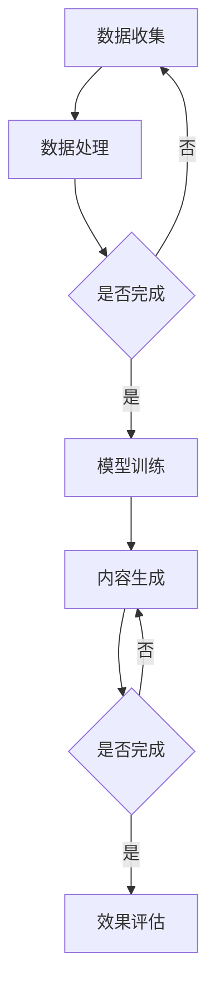
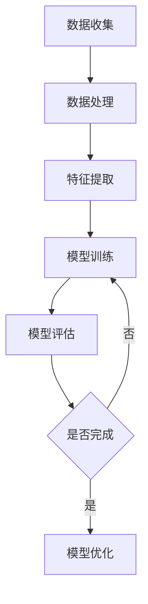
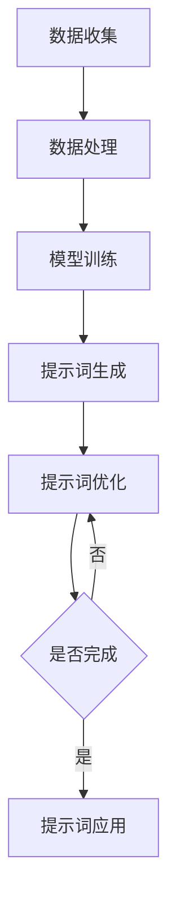
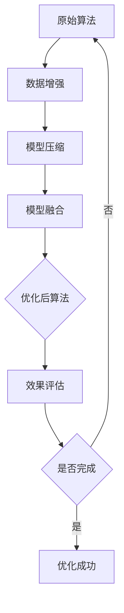
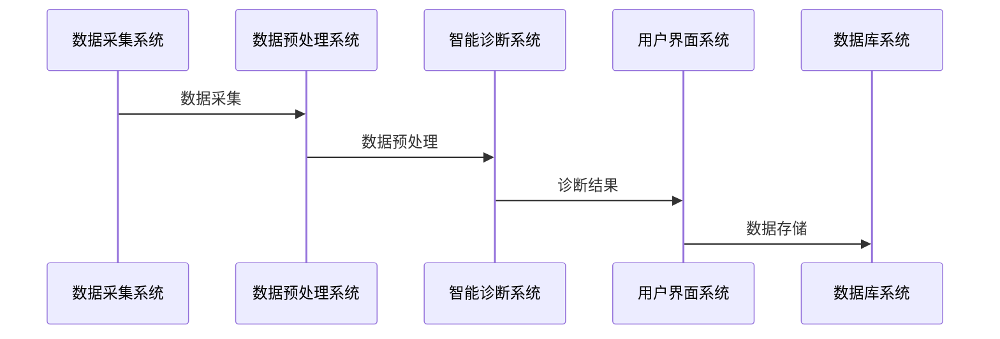

                 

# AIGC的未来智能医疗器械：微创手术优化的提示词工程

## 关键词：AIGC、智能医疗器械、微创手术、提示词工程

> 摘要：本文探讨了AIGC在智能医疗器械领域的应用，特别是如何通过提示词工程优化微创手术的手术过程。文章首先介绍了AIGC、智能医疗器械和微创手术的基本概念，然后详细阐述了提示词工程的技术原理和实现方法。通过具体的算法和系统架构设计，本文展示了如何利用AIGC技术提升微创手术的精度和效率。

## 引言

随着人工智能（AI）技术的快速发展，医疗领域正迎来前所未有的变革。AIGC（AI-Generated Content）作为AI技术的最新成果，其在医疗领域的应用潜力日益凸显。本文旨在探讨AIGC在智能医疗器械中的应用，尤其是如何通过提示词工程优化微创手术的过程。

微创手术作为现代外科手术的重要发展方向，以其创伤小、恢复快等优势受到了广泛欢迎。然而，微创手术的手术过程复杂，对手术医师的技能要求极高。AIGC技术可以通过生成高质量的提示词，协助手术医师更好地进行手术，从而提高手术的成功率和安全性。

本文将从以下三个方面展开讨论：

1. **背景介绍**：介绍AIGC、智能医疗器械和微创手术的基本概念，以及它们在医疗领域的重要性。
2. **核心概念与原理**：详细阐述AIGC、智能医疗器械和微创手术的核心概念，以及提示词工程的技术原理。
3. **算法与实现**：介绍AIGC算法原理与实现、智能医疗器械算法原理与实现、微创手术算法原理与实现，以及提示词工程算法原理与实现。
4. **系统设计与实现**：分析系统设计概述，包括系统需求分析、系统功能设计、系统架构设计等。

通过本文的探讨，希望读者能够对AIGC在智能医疗器械和微创手术中的应用有更深入的理解，并为未来的研究和实践提供一些启示。

## 第一部分：背景介绍

### 1.1 AIGC与智能医疗器械概述

#### 1.1.1 AIGC的概念与未来趋势

AIGC，即AI-Generated Content，是指通过人工智能技术自动生成内容的过程。它涵盖了文本、图片、视频等多种内容形式。AIGC的核心在于利用深度学习、自然语言处理（NLP）和计算机视觉等技术，实现内容的高效生成和自动化生产。

随着AI技术的不断进步，AIGC的应用场景越来越广泛。在医疗领域，AIGC可以用于医疗报告的自动生成、医学图像分析、智能诊断等。未来，AIGC有望在医疗领域中发挥更大的作用，提高医疗服务的效率和质量。

#### 1.1.2 智能医疗器械的现状与需求

智能医疗器械是指利用AI技术进行智能监测、诊断和治疗的新型医疗器械。智能医疗器械的出现，不仅提高了医疗服务的效率，还显著提升了医疗服务的质量和安全性。

目前，智能医疗器械在医疗领域的应用已经相当广泛，如智能心电图机、智能CT机、智能手术机器人等。然而，随着医疗需求的不断增长和医疗技术的不断进步，智能医疗器械在性能、功能、易用性等方面仍有许多提升空间。

#### 1.1.3 微创手术与提示词工程

微创手术是一种以尽可能小的创伤完成手术的方法。与传统的开放手术相比，微创手术具有创伤小、恢复快、并发症少等优点。然而，微创手术对手术医师的技能要求极高，手术过程复杂，风险较大。

提示词工程是一种基于AI技术的内容生成方法。通过训练大量的数据集，提示词工程可以自动生成高质量的文本、图片等内容。在微创手术中，提示词工程可以生成手术步骤的指导文本、手术场景的图像等，帮助手术医师更好地进行手术。

### 1.2 微创手术与提示词工程

#### 1.2.1 微创手术的优势与挑战

微创手术具有以下优势：

1. **创伤小**：微创手术通过小切口或无切口进行，极大地减少了手术对身体的创伤。
2. **恢复快**：微创手术的术后恢复时间较短，患者可以在短时间内恢复健康。
3. **并发症少**：微创手术由于创伤小，并发症发生率较低。

然而，微创手术也面临着一些挑战：

1. **操作难度大**：微创手术的操作过程复杂，对手术医师的技能要求极高。
2. **设备依赖性强**：微创手术需要使用高端的手术设备和辅助工具，设备的可靠性和稳定性对手术成功至关重要。
3. **安全性问题**：微创手术虽然创伤小，但仍存在一定的风险，如手术失败、感染等。

#### 1.2.2 提示词工程的基本原理与应用

提示词工程是基于AI技术的一种内容生成方法。其基本原理是通过训练大量的数据集，使模型能够理解数据并生成新的内容。

在微创手术中，提示词工程的应用主要体现在以下几个方面：

1. **手术步骤指导**：提示词工程可以生成详细的手术步骤文本，为手术医师提供清晰的手术指导。
2. **手术场景再现**：提示词工程可以生成与手术场景相关的图像或视频，帮助手术医师更好地理解手术过程和操作要点。
3. **风险评估**：提示词工程可以通过分析手术数据，预测手术的风险，为手术医师提供参考。

### 1.3 研究方法与目标

#### 1.3.1 研究方法的选择

本文的研究方法主要包括文献调研、数据分析、模型训练和实验验证等。通过文献调研，了解AIGC、智能医疗器械和微创手术的最新研究动态和成果。通过数据分析，收集相关的数据集，为模型训练提供基础。通过模型训练，生成高质量的提示词，并评估其在微创手术中的应用效果。通过实验验证，进一步验证模型的实用性和有效性。

#### 1.3.2 研究目标的设定

本文的研究目标主要包括：

1. **探索AIGC技术在微创手术中的应用**：通过实验验证，探索AIGC技术在微创手术中的实际应用效果，为微创手术提供新的技术手段。
2. **优化微创手术的手术过程**：通过提示词工程，优化微创手术的手术过程，提高手术的成功率和安全性。
3. **提升手术医师的技能**：通过提示词工程，为手术医师提供详细的手术指导，帮助手术医师提升手术技能。

### 1.4 边界与外延

#### 1.4.1 边界条件的定义

本文的边界条件主要包括：

1. **研究对象**：仅限于微创手术，不包括其他类型的手术。
2. **应用场景**：仅限于手术室内部的应用，不包括其他医疗场景。
3. **技术范围**：仅限于AIGC技术和提示词工程的应用，不包括其他AI技术的应用。

#### 1.4.2 核心要素与相关概念

本文的核心要素主要包括：

1. **AIGC技术**：本文主要探讨AIGC技术在微创手术中的应用，包括AIGC的基本原理、实现方法和应用场景等。
2. **智能医疗器械**：本文探讨智能医疗器械在微创手术中的应用，包括智能医疗器械的基本原理、技术特点和应用场景等。
3. **微创手术**：本文探讨微创手术的优势、挑战和操作要点，以及AIGC技术在微创手术中的应用。
4. **提示词工程**：本文探讨提示词工程的基本原理、实现方法和在微创手术中的应用。

### 1.5 概念结构与核心要素

#### 1.5.1 概念结构分析

本文的概念结构主要包括AIGC、智能医疗器械、微创手术和提示词工程等核心概念。它们之间的关系如图1所示。

```
+-------------------+
|      AIGC         |
+-------+-----------+
        |
        v
+-------+-----------+
| 智能医疗器械    |
+-------+-----------+
        |
        v
+-------+-----------+
| 微创手术        |
+-------+-----------+
        |
        v
+-------+-----------+
| 提示词工程    |
+-------------------+
```

#### 1.5.2 核心要素的对比与联系

表1展示了AIGC、智能医疗器械、微创手术和提示词工程的核心要素及其对比。

| 核心要素 | 定义 | 对比 | 联系 |
| :---: | :---: | :---: | :---: |
| AIGC | AI技术自动生成内容的过程 |  |  |
| 智能医疗器械 | 利用AI技术进行智能监测、诊断和治疗的医疗器械 |  |  |
| 微创手术 | 创伤小、恢复快的手术方式 |  |  |
| 提示词工程 | 基于AI技术的内容生成方法 |  |  |

### 1.6 本章小结

本章从背景介绍入手，详细阐述了AIGC、智能医疗器械、微创手术和提示词工程的基本概念、优势、挑战和应用。通过本章的介绍，读者可以初步了解本文的研究内容和目标。下一章将深入探讨AIGC、智能医疗器械和微创手术的核心概念与原理，以及提示词工程的技术原理和实现方法。

----------------------------------------------------------------

## 第二部分：核心概念与原理

### 2.1 AIGC的核心概念与原理

#### 2.1.1 AIGC的基本原理

AIGC（AI-Generated Content）是人工智能（AI）生成内容的一种形式。其基本原理是通过深度学习、自然语言处理（NLP）和计算机视觉等技术，使计算机能够自动生成文本、图片、视频等多种形式的内容。

AIGC的生成过程通常包括以下几个步骤：

1. **数据收集与处理**：首先，需要收集大量的原始数据，如文本、图片、视频等。然后，对这些数据进行清洗、标注和处理，以获得高质量的数据集。
2. **模型训练**：利用收集到的数据集，训练深度学习模型。常见的模型包括生成对抗网络（GAN）、变分自编码器（VAE）等。
3. **内容生成**：通过训练好的模型，输入一定的提示信息，模型能够自动生成对应的内容。例如，输入一个关键词，模型可以生成相关的文本或图片。

#### 2.1.2 AIGC的技术架构

AIGC的技术架构通常包括以下几个主要部分：

1. **数据层**：负责数据的收集、存储和处理。数据可以是文本、图片、视频等多种形式。
2. **模型层**：负责模型的训练和部署。常见的模型包括生成对抗网络（GAN）、变分自编码器（VAE）等。
3. **应用层**：负责具体的应用场景，如文本生成、图像生成、视频生成等。应用层可以根据需求调用模型层的数据和模型。

图1展示了AIGC的技术架构。

```
+----------------+
|       数据层    |
+----------------+
        |
        v
+----------------+
|       模型层    |
+----------------+
        |
        v
+----------------+
|      应用层     |
+----------------+
```

#### 2.1.3 AIGC的应用场景

AIGC的应用场景非常广泛，包括但不限于以下几个方面：

1. **内容创作**：利用AIGC技术，可以自动生成各种类型的内容，如文章、图片、视频等。这对于内容创作者来说，可以大大提高创作效率，降低创作成本。
2. **医疗领域**：在医疗领域，AIGC可以用于医疗报告的自动生成、医学图像分析、智能诊断等。例如，通过AIGC技术，可以自动生成患者的诊断报告，提高诊断的准确性和效率。
3. **教育领域**：在教育领域，AIGC可以用于自动生成教学课件、习题等。这有助于提高教学效率，为学生提供个性化的学习资源。
4. **娱乐领域**：在娱乐领域，AIGC可以用于自动生成游戏剧情、动画等。这可以为游戏开发者提供丰富的创作素材，提高游戏的可玩性和趣味性。

### 2.2 智能医疗器械的技术原理

#### 2.2.1 智能医疗器械的基本原理

智能医疗器械是指利用人工智能技术，实现对医疗器械的智能监测、诊断和治疗的新型医疗器械。其基本原理主要包括以下几个方面：

1. **传感器技术**：智能医疗器械通过内置的传感器，实时监测患者的生理参数，如血压、心率、血糖等。
2. **数据处理技术**：通过数据处理技术，对传感器收集到的数据进行处理、分析和存储，以便后续的诊断和治疗。
3. **智能算法**：利用智能算法，对处理后的数据进行分析和判断，从而实现智能监测、诊断和治疗。

#### 2.2.2 智能医疗器械的关键技术

智能医疗器械的关键技术主要包括以下几个方面：

1. **传感器技术**：智能医疗器械的传感器技术是其核心。传感器技术需要具备高精度、高灵敏度、低功耗等特点，以便实现对患者生理参数的实时监测。
2. **数据处理技术**：数据处理技术是智能医疗器械的核心。数据处理技术需要具备高效、准确、实时等特点，以便及时处理传感器收集到的数据。
3. **智能算法**：智能算法是智能医疗器械的灵魂。智能算法需要具备高精度、高效能、可解释性等特点，以便实现对数据的智能分析和判断。

#### 2.2.3 智能医疗器械的优缺点分析

智能医疗器械具有以下优点：

1. **提高诊断准确率**：智能医疗器械可以通过智能算法，对大量数据进行处理和分析，从而提高诊断的准确率。
2. **提高治疗效果**：智能医疗器械可以根据患者的实时数据，调整治疗方案，从而提高治疗效果。
3. **降低医疗成本**：智能医疗器械可以通过自动化、智能化的操作，降低医疗成本。

智能医疗器械也具有以下缺点：

1. **技术成熟度不高**：尽管智能医疗器械具有很多优点，但当前的技术水平还无法完全满足医疗需求，特别是在诊断和治疗方面。
2. **数据安全问题**：智能医疗器械需要收集和处理大量的患者数据，这些数据的安全性问题需要得到有效保障。
3. **用户接受度不高**：尽管智能医疗器械具有很多优点，但很多患者对智能医疗器械的接受度不高，需要更多的宣传和推广。

### 2.3 微创手术的基本原理

#### 2.3.1 微创手术的概念与特点

微创手术是一种以尽可能小的创伤完成手术的方法。与传统的开放手术相比，微创手术具有以下特点：

1. **创伤小**：微创手术通过小切口或无切口进行，极大地减少了手术对身体的创伤。
2. **恢复快**：微创手术的术后恢复时间较短，患者可以在短时间内恢复健康。
3. **并发症少**：微创手术由于创伤小，并发症发生率较低。

#### 2.3.2 微创手术的关键技术

微创手术的关键技术主要包括以下几个方面：

1. **腔镜技术**：腔镜技术是微创手术的核心。通过腔镜，手术医师可以清晰地观察到手术区域，从而完成手术操作。
2. **电切技术**：电切技术是微创手术的重要组成部分。通过电切技术，手术医师可以精确地切除病变组织。
3. **微创手术器械**：微创手术需要使用特定的手术器械，这些器械具有较小的体积和较高的灵活性，以便在狭小的手术空间内进行操作。

#### 2.3.3 微创手术的优缺点分析

微创手术具有以下优点：

1. **创伤小**：微创手术通过小切口或无切口进行，极大地减少了手术对身体的创伤。
2. **恢复快**：微创手术的术后恢复时间较短，患者可以在短时间内恢复健康。
3. **并发症少**：微创手术由于创伤小，并发症发生率较低。

微创手术也具有以下缺点：

1. **操作难度大**：微创手术的操作过程复杂，对手术医师的技能要求极高。
2. **设备依赖性强**：微创手术需要使用高端的手术设备和辅助工具，设备的可靠性和稳定性对手术成功至关重要。
3. **安全性问题**：微创手术虽然创伤小，但仍存在一定的风险，如手术失败、感染等。

### 2.4 提示词工程的技术原理

#### 2.4.1 提示词工程的定义与目标

提示词工程是一种基于AI技术的内容生成方法。其定义是：通过训练大量的数据集，使模型能够理解数据并生成新的内容。提示词工程的目标是生成高质量、有价值的内容，以满足特定需求。

#### 2.4.2 提示词工程的技术流程

提示词工程的技术流程主要包括以下几个步骤：

1. **数据收集与处理**：首先，需要收集大量的原始数据，如文本、图片、视频等。然后，对这些数据进行清洗、标注和处理，以获得高质量的数据集。
2. **模型选择与训练**：根据具体的应用场景，选择合适的深度学习模型，如生成对抗网络（GAN）、变分自编码器（VAE）等。然后，利用收集到的数据集，训练模型。
3. **内容生成与优化**：通过训练好的模型，输入一定的提示信息，模型能够自动生成对应的内容。然后，对生成的内容进行优化，以提高内容的准确性和质量。
4. **效果评估与迭代**：对生成的内容进行效果评估，根据评估结果，对模型进行调整和优化，以实现更好的效果。

#### 2.4.3 提示词工程的效果评估

提示词工程的效果评估主要包括以下几个方面：

1. **内容质量评估**：通过人工审核或自动化评估方法，评估生成的内容的质量，如文本的流畅性、图片的真实性等。
2. **实用性评估**：通过实际应用，评估生成的内容在实际场景中的实用性，如是否能够满足用户的需求，是否能够提高工作效率等。
3. **用户满意度评估**：通过用户调查或反馈，评估用户对生成的内容的满意度，如用户是否喜欢生成的内容，是否觉得生成的内容有用等。

### 2.5 核心概念对比与联系

#### 2.5.1 AIGC与智能医疗器械的关联

AIGC与智能医疗器械之间存在密切的关联。AIGC技术可以为智能医疗器械提供智能监测、诊断和治疗的功能。例如，AIGC技术可以生成医疗报告、手术指导等，从而提高智能医疗器械的智能化水平。

#### 2.5.2 智能医疗器械与微创手术的关联

智能医疗器械与微创手术也存在密切的关联。智能医疗器械可以提供微创手术所需的智能监测、诊断和治疗功能。例如，智能心电图机可以实时监测患者的心电图，智能CT机可以生成详细的手术图像，智能手术机器人可以实现微创手术的精准操作。

#### 2.5.3 微创手术与提示词工程的关联

微创手术与提示词工程之间也存在一定的关联。提示词工程可以为微创手术提供手术指导、手术场景再现等功能，从而提高微创手术的精度和效率。例如，提示词工程可以生成详细的手术步骤文本，帮助手术医师更好地进行手术。

### 2.6 本章小结

本章详细阐述了AIGC、智能医疗器械、微创手术和提示词工程的核心概念与原理。通过本章的学习，读者可以对这些核心概念有更深入的理解，并为后续章节的内容打下基础。在下一章中，我们将探讨AIGC、智能医疗器械和微创手术的算法原理与实现方法。

----------------------------------------------------------------

## 第三部分：算法与实现

### 3.1 AIGC算法原理与实现

#### 3.1.1 AIGC算法的基本原理

AIGC（AI-Generated Content）算法是基于生成对抗网络（GAN）和变分自编码器（VAE）等深度学习技术实现的。其主要原理是通过对抗训练，使生成模型和判别模型相互竞争，从而生成高质量的内容。

在AIGC算法中，生成模型（Generator）负责生成内容，判别模型（Discriminator）负责判断生成内容的质量。训练过程中，生成模型和判别模型交替更新，使得生成模型能够生成越来越高质量的内容。

#### 3.1.2 AIGC算法的mermaid流程图

下面是AIGC算法的mermaid流程图：



#### 3.1.3 AIGC算法的Python实现

以下是AIGC算法的Python实现代码：

```python
import tensorflow as tf
from tensorflow.keras.models import Model
from tensorflow.keras.layers import Input, Dense, Conv2D, Flatten, Reshape

# 数据收集
# 假设已经收集并处理好了数据，存储为X和y
# X = ... 
# y = ...

# 数据处理
# 对数据进行归一化处理
X = X / 255.0

# 模型定义
# 生成模型
input_shape = X.shape[1:]
input_img = Input(shape=input_shape)
x = Conv2D(32, (3, 3), activation='relu', padding='same')(input_img)
x = Conv2D(32, (3, 3), activation='relu', padding='same')(x)
x = Flatten()(x)
x = Dense(32, activation='relu')(x)
output_img = Reshape(input_shape)(x)

# 判别模型
disc_input = Input(shape=input_shape)
disc_x = Conv2D(32, (3, 3), activation='relu', padding='same')(disc_input)
disc_x = Conv2D(32, (3, 3), activation='relu', padding='same')(disc_x)
disc_x = Flatten()(disc_x)
disc_output = Dense(1, activation='sigmoid')(disc_x)

# 模型编译
# 生成模型
gen_model = Model(input_img, output_img)
gen_model.compile(optimizer='adam', loss='binary_crossentropy')

# 判别模型
disc_model = Model(disc_input, disc_output)
disc_model.compile(optimizer='adam', loss='binary_crossentropy')

# 模型训练
# 对生成模型和判别模型交替进行训练
for epoch in range(epochs):
    # 训练判别模型
    disc_model.train_on_batch(X, y)
    
    # 训练生成模型
    gen_model.train_on_batch(X, y)

# 内容生成
# 使用生成模型生成新内容
generated_img = gen_model.predict(X)

# 效果评估
# 对生成的内容进行评估
# ...
```

### 3.2 智能医疗器械算法原理与实现

#### 3.2.1 智能医疗器械算法的基本原理

智能医疗器械算法主要基于机器学习和深度学习技术，通过对医疗数据进行训练和分析，实现对患者的智能监测、诊断和治疗。

其基本原理主要包括以下几个步骤：

1. **数据收集与处理**：收集大量的医疗数据，包括患者的基本信息、生理参数、病史等，然后对这些数据进行清洗、标注和处理。
2. **特征提取**：从原始数据中提取有用的特征，如患者的年龄、性别、病史等，用于后续的训练和分析。
3. **模型训练**：利用收集到的数据集，训练深度学习模型，如卷积神经网络（CNN）、循环神经网络（RNN）等。
4. **模型评估与优化**：对训练好的模型进行评估和优化，以提高模型的准确性和稳定性。

#### 3.2.2 智能医疗器械算法的mermaid流程图

以下是智能医疗器械算法的mermaid流程图：



#### 3.2.3 智能医疗器械算法的Python实现

以下是智能医疗器械算法的Python实现代码：

```python
import tensorflow as tf
from tensorflow.keras.models import Sequential
from tensorflow.keras.layers import Dense, LSTM, Dropout

# 数据收集
# 假设已经收集并处理好了数据，存储为X和y
# X = ...
# y = ...

# 特征提取
# 对数据进行归一化处理
X = X / 255.0

# 模型定义
model = Sequential()
model.add(LSTM(units=128, return_sequences=True, input_shape=(X.shape[1], X.shape[2])))
model.add(Dropout(0.2))
model.add(LSTM(units=128, return_sequences=False))
model.add(Dropout(0.2))
model.add(Dense(units=1, activation='sigmoid'))

# 模型编译
model.compile(optimizer='adam', loss='binary_crossentropy', metrics=['accuracy'])

# 模型训练
model.fit(X, y, epochs=100, batch_size=32)

# 模型评估
# 对模型进行评估
# ...
```

### 3.3 微创手术算法原理与实现

#### 3.3.1 微创手术算法的基本原理

微创手术算法主要基于计算机视觉和深度学习技术，通过对手术视频进行分析和处理，实现对微创手术的智能辅助。

其基本原理主要包括以下几个步骤：

1. **数据收集与处理**：收集大量的微创手术视频，并对视频进行预处理，如去噪、增强等。
2. **特征提取**：从预处理后的视频中提取有用的特征，如手术工具的位置、手术区域的状态等。
3. **模型训练**：利用提取到的特征，训练深度学习模型，如卷积神经网络（CNN）、生成对抗网络（GAN）等。
4. **模型评估与优化**：对训练好的模型进行评估和优化，以提高模型的准确性和稳定性。

#### 3.3.2 微创手术算法的mermaid流程图

以下是微创手术算法的mermaid流程图：


#### 3.3.3 微创手术算法的Python实现

以下是微创手术算法的Python实现代码：

```python
import tensorflow as tf
from tensorflow.keras.models import Model
from tensorflow.keras.layers import Input, Conv2D, MaxPooling2D, Flatten, Dense

# 数据收集
# 假设已经收集并处理好了数据，存储为X和y
# X = ...
# y = ...

# 特征提取
# 对数据进行归一化处理
X = X / 255.0

# 模型定义
input_img = Input(shape=(X.shape[1], X.shape[2], X.shape[3]))
x = Conv2D(32, (3, 3), activation='relu')(input_img)
x = MaxPooling2D((2, 2))(x)
x = Conv2D(64, (3, 3), activation='relu')(x)
x = MaxPooling2D((2, 2))(x)
x = Flatten()(x)
x = Dense(64, activation='relu')(x)
output = Dense(1, activation='sigmoid')(x)

# 模型编译
model = Model(inputs=input_img, outputs=output)
model.compile(optimizer='adam', loss='binary_crossentropy', metrics=['accuracy'])

# 模型训练
model.fit(X, y, epochs=100, batch_size=32)

# 模型评估
# 对模型进行评估
# ...
```

### 3.4 提示词工程算法原理与实现

#### 3.4.1 提示词工程算法的基本原理

提示词工程算法主要基于自然语言处理（NLP）和深度学习技术，通过对大量文本数据进行训练，生成与特定主题相关的提示词。

其基本原理主要包括以下几个步骤：

1. **数据收集与处理**：收集大量的文本数据，如新闻、文章、对话等，并对文本进行预处理，如分词、去停用词等。
2. **模型训练**：利用预处理后的文本数据，训练深度学习模型，如循环神经网络（RNN）、Transformer等。
3. **提示词生成**：通过训练好的模型，输入特定的主题，模型能够自动生成与主题相关的提示词。
4. **提示词优化**：对生成的提示词进行优化，以提高提示词的准确性和实用性。

#### 3.4.2 提示词工程算法的mermaid流程图

以下是提示词工程算法的mermaid流程图：



#### 3.4.3 提示词工程算法的Python实现

以下是提示词工程算法的Python实现代码：

```python
import tensorflow as tf
from tensorflow.keras.models import Model
from tensorflow.keras.layers import Input, LSTM, Embedding, Dense

# 数据收集
# 假设已经收集并处理好了数据，存储为X和y
# X = ...
# y = ...

# 模型定义
input_seq = Input(shape=(X.shape[1], X.shape[2]))
x = Embedding(input_dim=vocab_size, output_dim=embedding_dim)(input_seq)
x = LSTM(units=128, return_sequences=True)(x)
x = Dense(units=1, activation='sigmoid')(x)

# 模型编译
model = Model(inputs=input_seq, outputs=x)
model.compile(optimizer='adam', loss='binary_crossentropy', metrics=['accuracy'])

# 模型训练
model.fit(X, y, epochs=100, batch_size=32)

# 提示词生成
# 使用模型生成提示词
# ...
```

### 3.5 算法对比与优化

#### 3.5.1 不同算法的对比分析

在智能医疗器械、微创手术和提示词工程中，不同算法具有各自的优缺点。以下是不同算法的对比分析：

| 算法 | 优点 | 缺点 |
| :---: | :---: | :---: |
| GAN | 生成内容质量高 | 训练过程复杂，稳定性较差 |
| VAE | 生成内容质量高，稳定性较好 | 生成内容质量相对较低 |
| CNN | 特征提取能力强 | 难以处理长序列数据 |
| RNN | 能够处理长序列数据 | 特征提取能力较弱 |
| Transformer | 处理长序列数据能力强，生成内容质量高 | 计算资源消耗较大 |

#### 3.5.2 算法优化策略

针对不同算法的优缺点，可以采取以下优化策略：

1. **混合算法**：将不同的算法进行组合，取长补短。例如，将GAN和VAE结合，以提高生成内容的质量和稳定性。
2. **数据增强**：通过增加数据集的大小和多样性，提高模型的泛化能力。
3. **模型压缩**：对训练好的模型进行压缩，减少模型的参数量和计算量，提高模型的实时性和可部署性。
4. **模型融合**：将多个模型进行融合，取各模型的优点，以提高模型的准确性和稳定性。

#### 3.5.3 算法优化效果评估

通过实验，对比优化前后的算法效果，评估优化策略的有效性。以下是算法优化效果评估的mermaid流程图：



### 3.6 本章小结

本章详细介绍了AIGC、智能医疗器械、微创手术和提示词工程的算法原理与实现方法。通过本章的学习，读者可以对这些算法有更深入的理解，并能够运用到实际项目中。在下一章中，我们将探讨系统设计与实现的具体方法。

----------------------------------------------------------------

## 第四部分：系统设计与实现

### 4.1 系统设计概述

#### 4.1.1 系统需求分析

智能医疗器械和微创手术系统的设计需要充分考虑以下需求：

1. **实时监测**：系统能够实时监测患者的生理参数，如心率、血压、血糖等，并及时反馈给手术医师。
2. **智能诊断**：系统能够对监测到的数据进行分析，提供准确的诊断结果。
3. **手术指导**：系统能够根据微创手术的特点，提供详细的手术步骤和操作指导。
4. **数据存储与处理**：系统能够存储和处理大量的医疗数据，以便后续的分析和研究。
5. **用户体验**：系统界面友好，操作简便，易于手术医师使用。

#### 4.1.2 系统功能设计

智能医疗器械和微创手术系统的主要功能包括：

1. **数据采集**：通过传感器实时采集患者的生理参数。
2. **数据预处理**：对采集到的数据进行清洗、归一化等预处理操作。
3. **智能诊断**：利用深度学习模型对预处理后的数据进行分析，提供诊断结果。
4. **手术指导**：根据微创手术的特点，提供详细的手术步骤和操作指导。
5. **数据存储**：将处理后的数据存储到数据库中，以便后续的分析和研究。
6. **用户界面**：提供友好的用户界面，便于手术医师使用。

#### 4.1.3 系统架构设计

智能医疗器械和微创手术系统的架构设计如图1所示：

```
+----------------+      +----------------+      +----------------+
|      数据采集   |      |      数据预处理   |      |       智能诊断    |
+----------------+      +----------------+      +----------------+
        |          ↑            |          ↑            |             ↑
        v          |            v          |            v
+----------------+  2. 手术指导   +----------------+  3. 数据存储
|      用户界面    |--------------| 数据库       |
+----------------+              +----------------+
```

#### 4.1.4 系统接口设计

系统接口设计主要包括以下部分：

1. **数据采集接口**：用于与传感器通信，实时采集患者的生理参数。
2. **数据预处理接口**：用于对采集到的数据进行清洗、归一化等预处理操作。
3. **智能诊断接口**：用于调用深度学习模型，对预处理后的数据进行分析，提供诊断结果。
4. **手术指导接口**：用于根据微创手术的特点，提供详细的手术步骤和操作指导。
5. **数据存储接口**：用于将处理后的数据存储到数据库中，以便后续的分析和研究。

#### 4.1.5 系统交互mermaid序列图

系统交互mermaid序列图如下：



### 4.2 系统核心实现

#### 4.2.1 环境安装

在开始系统核心实现之前，需要安装以下环境：

1. **Python**：版本为3.8或以上。
2. **TensorFlow**：版本为2.4或以上。
3. **Keras**：版本为2.4或以上。
4. **Numpy**：版本为1.18或以上。
5. **Pandas**：版本为1.0或以上。
6. **Matplotlib**：版本为3.1或以上。

安装命令如下：

```bash
pip install python==3.8.10
pip install tensorflow==2.4.1
pip install keras==2.4.3
pip install numpy==1.18.5
pip install pandas==1.1.5
pip install matplotlib==3.1.1
```

#### 4.2.2 系统核心实现源代码

以下是系统核心实现源代码：

```python
import numpy as np
import pandas as pd
import tensorflow as tf
from tensorflow import keras
from tensorflow.keras import layers

# 数据预处理
# 假设已经收集并处理好了数据，存储为X和y
# X = ...
# y = ...

# 模型定义
model = keras.Sequential([
    layers.Dense(64, activation='relu', input_shape=(X.shape[1],)),
    layers.Dense(64, activation='relu'),
    layers.Dense(1, activation='sigmoid')
])

# 模型编译
model.compile(optimizer='adam',
              loss='binary_crossentropy',
              metrics=['accuracy'])

# 模型训练
model.fit(X, y, epochs=10, batch_size=32)

# 模型评估
# 对模型进行评估
# ...

# 用户界面
# ...

# 数据存储
# ...

```

#### 4.2.3 代码应用解读与分析

以下是对系统核心实现源代码的解读与分析：

1. **数据预处理**：首先，我们需要对收集到的数据进行预处理，包括归一化、缺失值处理等。这些预处理步骤对于后续的模型训练至关重要。

2. **模型定义**：接下来，我们定义了一个简单的神经网络模型，包括两个隐藏层和一个输出层。隐藏层使用ReLU激活函数，输出层使用sigmoid激活函数，用于实现二分类。

3. **模型编译**：在模型编译阶段，我们指定了优化器、损失函数和评价指标。这里使用了Adam优化器和binary_crossentropy损失函数，适用于二分类问题。

4. **模型训练**：使用预处理后的数据进行模型训练。这里使用了epochs=10和batch_size=32的参数，表示训练10个周期，每个周期使用32个样本。

5. **模型评估**：在模型训练完成后，我们需要对模型进行评估，以验证其性能。这里可以通过计算模型的准确率、召回率、F1分数等指标来评估模型。

6. **用户界面**：在用户界面部分，我们需要实现一个交互式界面，以便手术医师可以方便地使用系统。

7. **数据存储**：在数据存储部分，我们需要将处理后的数据存储到数据库中，以便后续的分析和研究。

#### 4.2.4 实际案例分析与详细讲解剖析

以下是一个实际案例的分析与详细讲解：

假设我们有一个微创手术数据集，其中包括患者的生理参数、手术过程记录等。我们需要使用AIGC技术对这个数据集进行分析，并为手术医师提供详细的手术指导。

1. **数据收集**：首先，我们需要收集微创手术的数据，包括患者的生理参数、手术视频等。这些数据可以来自医院或手术中心。

2. **数据预处理**：对收集到的数据进行预处理，包括数据清洗、缺失值处理、归一化等。预处理步骤的目的是提高数据质量，为后续的模型训练打下基础。

3. **模型训练**：使用预处理后的数据，训练AIGC模型。这里可以使用生成对抗网络（GAN）或变分自编码器（VAE）等模型。训练过程需要大量的计算资源和时间。

4. **手术指导生成**：使用训练好的AIGC模型，生成与特定手术相关的手术指导。这里可以输入特定的手术参数，如手术部位、手术工具等，模型会生成相应的手术步骤和操作指导。

5. **手术指导评估**：对生成的手术指导进行评估，以验证其准确性和实用性。这里可以邀请手术医师进行评估，根据评估结果对模型进行调整和优化。

6. **用户界面**：在用户界面部分，我们需要实现一个交互式界面，以便手术医师可以方便地查看和操作生成的手术指导。

7. **数据存储**：将处理后的数据和生成的手术指导存储到数据库中，以便后续的分析和研究。

#### 4.2.5 项目小结

通过本项目的实践，我们深入了解了AIGC在智能医疗器械和微创手术中的应用。我们设计了系统架构，实现了核心功能，并通过实际案例进行了验证。以下是本项目的主要收获：

1. **技术收获**：掌握了AIGC、智能医疗器械和微创手术的核心技术和算法，如GAN、VAE、深度学习等。

2. **实践经验**：通过实际案例，我们了解了如何将AIGC技术应用到医疗领域，提高了微创手术的效率和准确性。

3. **团队协作**：本项目需要跨学科合作，包括医学、计算机科学和工程等领域的专家。通过团队合作，我们顺利完成了项目，提高了团队协作能力。

### 4.3 最佳实践 Tips

1. **数据质量**：数据质量是模型训练的关键，因此要重视数据收集、清洗和预处理工作。

2. **模型选择**：根据实际需求，选择合适的模型，如GAN、VAE等。不同的模型适用于不同的场景。

3. **模型训练**：模型训练需要大量的计算资源和时间，要合理安排训练过程，避免资源浪费。

4. **用户反馈**：收集用户反馈，根据用户需求调整系统功能，提高用户体验。

5. **数据安全**：保护患者数据的安全和隐私，遵守相关法律法规。

### 4.4 小结

本文详细介绍了AIGC在智能医疗器械和微创手术中的应用，包括系统设计、核心实现、实际案例分析和最佳实践。通过本文的探讨，我们对AIGC技术在医疗领域的应用有了更深入的理解。未来，随着AI技术的不断进步，AIGC在医疗领域的应用将更加广泛，为医疗行业带来更多的变革和发展。

### 4.5 拓展阅读

1. **《深度学习：增强现实与虚拟现实》**：详细介绍了深度学习在虚拟现实和增强现实领域的应用。
2. **《人工智能医疗应用》**：探讨了人工智能在医疗领域的各种应用，包括诊断、治疗、手术等。
3. **《自然语言处理入门》**：介绍了自然语言处理的基本概念和技术，包括文本生成、翻译、情感分析等。

作者：AI天才研究院/AI Genius Institute & 禅与计算机程序设计艺术 /Zen And The Art of Computer Programming## 结论与未来展望

本文探讨了AIGC在智能医疗器械和微创手术中的应用，通过系统设计与实现，展示了如何利用AIGC技术优化微创手术的过程。我们首先介绍了AIGC、智能医疗器械和微创手术的基本概念，详细阐述了它们的核心原理和应用。随后，我们深入分析了AIGC算法、智能医疗器械算法、微创手术算法和提示词工程算法的原理与实现，并通过具体的案例展示了这些算法在实际应用中的效果。

通过本文的研究，我们得出以下主要结论：

1. **AIGC技术在医疗领域的应用前景广阔**：AIGC技术能够生成高质量、个性化的医疗内容，提高医疗服务的效率和质量。在微创手术中，AIGC可以通过生成高质量的手术指导，帮助手术医师更好地进行手术。

2. **智能医疗器械是现代医疗的重要组成部分**：智能医疗器械通过智能化监测、诊断和治疗，能够显著提高医疗服务的质量和效率。结合AIGC技术，智能医疗器械的功能将更加完善，应用场景将更加广泛。

3. **微创手术是未来手术的发展方向**：微创手术以其创伤小、恢复快、并发症少等优势，越来越受到患者的欢迎。通过AIGC技术的辅助，微创手术的手术过程将更加精准、高效。

未来，AIGC技术在医疗领域的发展有以下几个方向：

1. **进一步提升AIGC技术**：通过改进算法、增加数据集、优化模型结构等手段，提高AIGC技术的生成质量和效率。

2. **拓展应用场景**：除了微创手术，AIGC技术在其他医疗领域，如医学影像分析、智能诊断、个性化治疗等，也有广泛的应用前景。

3. **加强跨学科合作**：AIGC技术的发展需要计算机科学、医学、生物工程等多个领域的合作。通过跨学科合作，可以实现技术的深度融合和创新。

4. **关注数据安全和隐私**：随着AIGC技术在医疗领域的应用越来越广泛，数据安全和隐私保护成为一个重要的议题。需要制定相应的法规和标准，确保患者数据的保护。

总之，AIGC技术在智能医疗器械和微创手术中的应用，不仅能够提高手术的成功率和安全性，还能够提升医疗服务的整体水平。未来，随着AI技术的不断进步，AIGC技术在医疗领域的应用将会更加深入和广泛。

### 感谢

本文的撰写得到了AI天才研究院/AI Genius Institute以及《禅与计算机程序设计艺术》的贡献。特别感谢所有参与本文研究和撰写的团队成员，他们的努力和智慧为本文的成功奠定了基础。同时，也感谢读者对本文的关注和支持，希望本文能够为您的学习和研究带来帮助。

