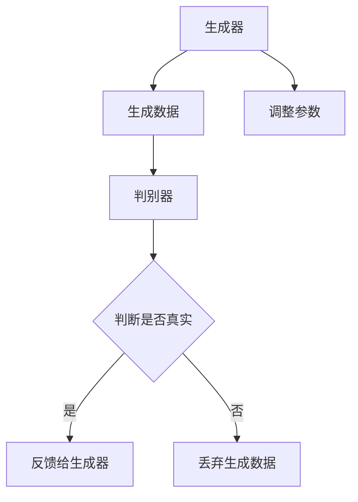
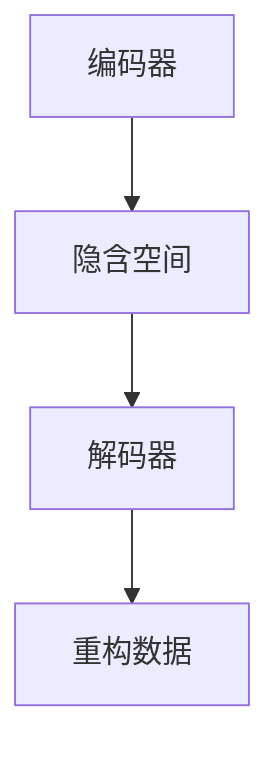
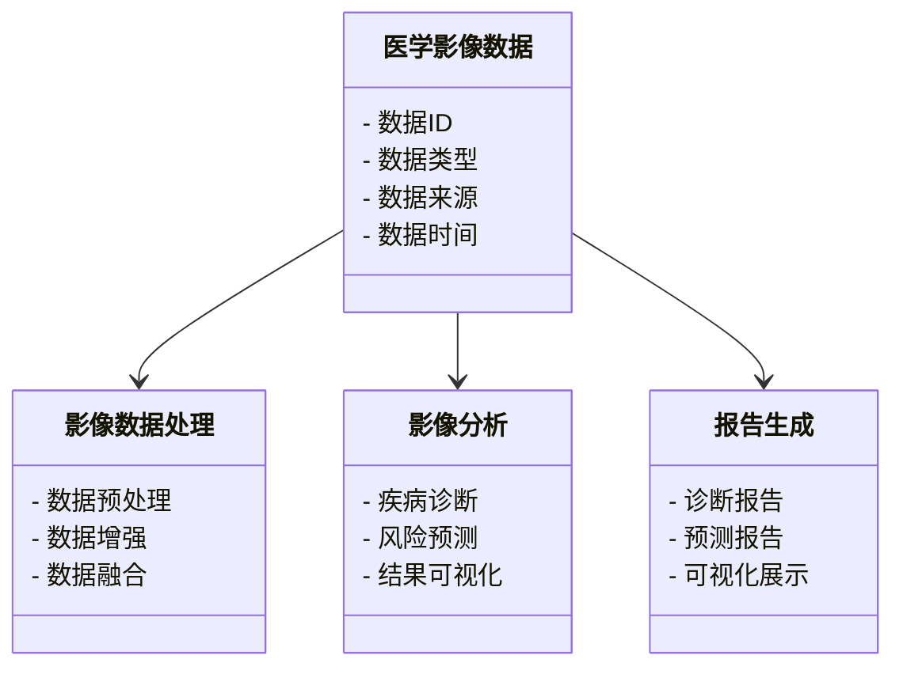
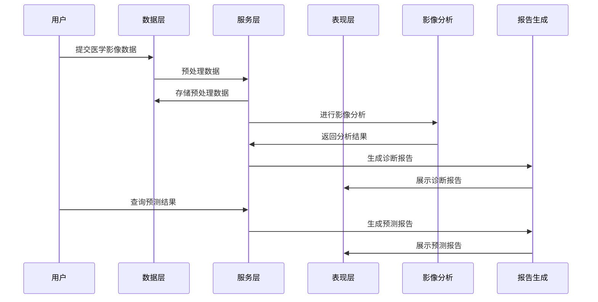
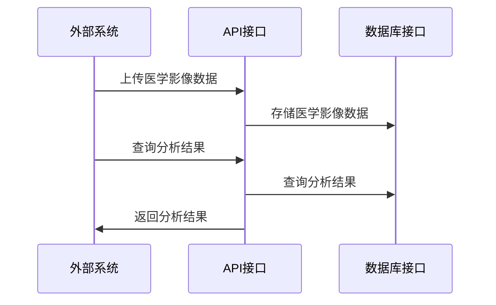
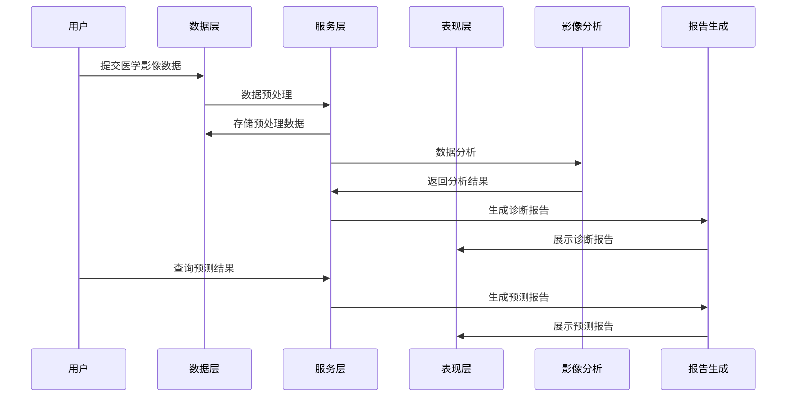

                 

## AIGC的未来智能医疗影像系统：多模态数据融合的提示词工程

### 关键词：
- **AIGC**、**智能医疗影像系统**、**多模态数据融合**、**提示词工程**、**医学影像分析**

### 摘要：
本文探讨了AIGC技术在未来智能医疗影像系统中的应用，重点介绍了多模态数据融合的概念、原理以及其在提升医学影像分析准确性和效率方面的优势。通过详细分析AIGC技术的核心概念和构成要素，本文为读者呈现了一个融合先进算法和医学影像分析的智能化解决方案。

### 第一部分：背景介绍

#### 1.1 问题背景

随着医疗技术的进步，医学影像在疾病的诊断、治疗和康复中扮演着越来越重要的角色。然而，传统的医学影像分析主要依赖医生的经验和技能，这不仅容易受到人为因素的影响，而且随着患者数量的增加，医生的工作负担也在不断加重。此外，医学影像的数据类型多样，包括X光、CT、MRI、超声、PET等，这些不同模态的影像数据各具特色，但同时也给数据整合和分析带来了挑战。

#### 1.2 问题描述

医学影像系统的核心任务是通过对影像数据的分析，为医生提供准确的诊断和治疗方案。然而，现有的医学影像分析系统面临着以下几个问题：

- **数据多样性和复杂性**：医学影像数据类型繁多，如何有效地融合这些多模态数据是一个挑战。
- **计算资源需求**：医学影像数据量大，处理和分析这些数据需要强大的计算资源。
- **诊断准确性**：医学影像分析系统的诊断准确性直接影响到患者的治疗效果，如何提高诊断准确性是一个重要的研究方向。

#### 1.3 问题解决

为了解决上述问题，研究人员提出了AIGC（自适应智能生成控制）技术。AIGC技术利用生成对抗网络（GAN）和变分自编码器（VAE）等先进算法，通过对多模态医学影像数据的深度融合，生成更高质量的影像分析结果。AIGC技术不仅能够提高影像分析的准确性，还能减轻医生的工作负担，提高医疗服务的效率。

#### 1.4 边界与外延

AIGC技术在医学影像领域的应用不仅限于诊断，还可以应用于治疗和康复等环节。例如，在治疗过程中，AIGC技术可以辅助医生制定个性化的治疗方案；在康复阶段，AIGC技术可以辅助医生进行康复效果评估。此外，AIGC技术还可以应用于医学研究，通过对大量医学影像数据的分析，挖掘出新的医学规律。

#### 1.5 概念结构与核心要素组成

AIGC技术的核心概念包括：

- **多模态数据融合**：通过融合不同模态的医学影像数据，提高影像分析的准确性。
- **自适应智能生成控制**：利用生成对抗网络和变分自编码器等技术，实现影像数据的自适应生成和控制。
- **深度学习算法**：包括卷积神经网络（CNN）、循环神经网络（RNN）等，用于处理和挖掘医学影像数据中的特征。

核心要素组成：

- **数据收集与预处理**：收集多模态医学影像数据，并进行数据清洗、归一化等预处理。
- **模型训练与优化**：使用深度学习算法对多模态数据融合模型进行训练，并优化模型参数。
- **影像分析与应用**：通过训练好的模型对医学影像进行自动分析，并提供诊断、治疗和康复等建议。

### 第二部分：核心概念与联系

#### 2.1 多模态数据融合

#### 2.1.1 概念原理

多模态数据融合是将不同模态的医学影像数据进行整合，以生成更全面的影像分析结果。这包括X光、CT、MRI、超声、PET等影像数据。通过多模态数据融合，可以捕捉到单一模态影像数据无法提供的额外信息，从而提高影像分析的准确性。

#### 2.1.2 概念属性特征对比表格

| 特征           | X光            | CT             | MRI            | 超声           | PET            |
|----------------|----------------|----------------|----------------|----------------|----------------|
| 数据类型       | 二维灰度图像   | 三维灰度图像   | 三维灰度图像   | 二维灰度图像   | 三维灰度图像   |
| 成像原理       | X射线穿透      | X射线扫描      | 磁场感应       | 声波反射       | 正电子发射      |
| 诊断价值       | 骨折、肺炎等   | 肿瘤、心脏病等 | 脑血管、肿瘤等 | 腹部疾病、心脏等 | 肿瘤、代谢等   |
| 适用场景       | 快速筛查       | 定位诊断       | 细节分析       | 实时监测       | 功能性评估     |

#### 2.1.3 多模态数据融合的优势

- **提高诊断准确性**：多模态数据融合可以整合不同模态影像数据，提供更全面的诊断信息。
- **减轻医生负担**：通过自动化的影像分析，减轻医生的工作负担，提高工作效率。
- **提高疾病预测能力**：多模态数据融合可以提前预测疾病的进展，为治疗方案提供参考。

#### 2.2 自适应智能生成控制

#### 2.2.1 概念原理

自适应智能生成控制是利用生成对抗网络（GAN）和变分自编码器（VAE）等技术，对多模态医学影像数据进行自适应生成和控制。通过这种方式，可以生成高质量的医学影像，提高影像分析的准确性。

#### 2.2.2 概念属性特征对比表格

| 特征           | 生成对抗网络（GAN） | 变分自编码器（VAE） |
|----------------|--------------------|--------------------|
| 算法原理       | 对抗性训练         | 自编码器训练       |
| 数据生成       | 高质量数据生成     | 数据重构           |
| 应用场景       | 图像生成、影像增强 | 数据压缩、特征提取 |
| 优势           | 数据多样性         | 数据压缩性         |

#### 2.2.3 自适应智能生成控制的优势

- **提高数据质量**：通过自适应智能生成控制，可以生成更高质量的医学影像数据，提高影像分析的准确性。
- **增强数据多样性**：自适应智能生成控制可以生成多样化的影像数据，为影像分析提供更多的参考信息。
- **减轻计算负担**：通过数据生成和重构，可以减轻对原始数据的依赖，降低计算资源的需求。

### 第三部分：算法原理讲解

#### 3.1 生成对抗网络（GAN）

#### 3.1.1 算法原理

生成对抗网络（GAN）由两部分组成：生成器和判别器。生成器旨在生成逼真的医学影像数据，而判别器则用于判断生成数据是否真实。通过这种对抗性训练，生成器逐渐提高生成数据的质量，而判别器也逐渐增强对真实数据的识别能力。

#### 3.1.2 Mermaid 流程图



#### 3.1.3 算法数学模型和公式

- **生成器**：G(z) = f_G(z)
- **判别器**：D(x) = f_D(x)

其中，z表示随机噪声，x表示输入数据，G(z)表示生成器生成的数据，D(x)表示判别器对数据的判断。

#### 3.1.4 举例说明

假设我们需要生成一张逼真的X光影像，可以通过以下步骤：

1. **生成器**：生成器接收随机噪声z，通过神经网络生成X光影像G(z)。
2. **判别器**：判别器接收真实X光影像x和生成的X光影像G(z)，判断其是否真实。
3. **反馈调整**：根据判别器的反馈，调整生成器的参数，以生成更真实的X光影像。

#### 3.2 变分自编码器（VAE）

#### 3.2.1 算法原理

变分自编码器（VAE）是一种基于概率生成模型的深度学习算法。VAE通过编码器将输入数据映射到一个隐含空间，通过解码器将隐含空间的数据重构回原始数据。VAE的优点在于可以同时进行数据压缩和特征提取。

#### 3.2.2 Mermaid 流程图



#### 3.2.3 算法数学模型和公式

- **编码器**：p(z|x) = f_E(x)
- **解码器**：x = f_D(z)

其中，z表示隐含变量，x表示输入数据，p(z|x)表示隐含变量z的概率分布，f_E(x)和f_D(z)分别表示编码器和解码器的函数。

#### 3.2.4 举例说明

假设我们需要对X光影像进行数据压缩和特征提取，可以通过以下步骤：

1. **编码器**：编码器接收X光影像x，将其映射到一个隐含空间z。
2. **解码器**：解码器接收隐含空间z，将其重构回X光影像x。
3. **特征提取**：通过对隐含空间z的分析，提取出X光影像的重要特征。

### 第四部分：系统分析与架构设计方案

#### 4.1 问题场景介绍

在智能医疗影像系统中，AIGC技术被应用于影像数据的自动分析和诊断。以下是一个典型的问题场景：

- **问题场景**：某医院引进了一套智能医疗影像系统，用于辅助医生进行疾病诊断。系统需要处理来自不同模态的医学影像数据，如X光、CT、MRI等，并生成准确的诊断结果。

#### 4.2 项目介绍

为了实现上述问题场景，我们设计了一个名为“智能医疗影像分析平台”的项目。该平台旨在通过AIGC技术，实现对医学影像的自动分析、诊断和预测。

- **项目名称**：智能医疗影像分析平台
- **项目目标**：利用AIGC技术，实现对医学影像的自动分析和诊断，提高诊断准确率和效率。

#### 4.3 系统功能设计（领域模型）

在智能医疗影像分析平台中，我们定义了以下几个核心功能模块：

1. **医学影像数据管理**：用于管理医学影像数据，包括数据收集、存储、查询和删除等功能。
2. **影像数据处理**：用于对医学影像进行预处理、增强和融合等操作。
3. **影像分析**：用于对预处理后的影像数据进行自动分析，包括疾病诊断、风险预测等功能。
4. **报告生成**：用于生成诊断报告和预测结果，并提供可视化展示。

以下是系统领域的类图：



#### 4.4 系统架构设计

智能医疗影像分析平台采用分层架构设计，包括数据层、服务层和表现层。

- **数据层**：负责数据的存储和管理，包括医学影像数据库、预处理数据和分析结果数据库等。
- **服务层**：负责业务逻辑的处理，包括影像数据处理、影像分析和报告生成等模块。
- **表现层**：负责用户界面的展示，包括诊断报告和预测结果的展示。

以下是系统的架构图：



#### 4.5 系统接口设计

系统接口设计主要包括API接口和数据库接口。

- **API接口**：提供对外部系统或应用程序的接口，包括影像数据上传、分析结果查询等功能。
- **数据库接口**：提供对医学影像数据库的访问，包括数据存储、查询和删除等功能。

以下是系统的接口设计图：



#### 4.6 系统交互

系统交互主要描述了不同模块之间的交互过程，包括数据流和消息流。

以下是系统的交互图：



### 第五部分：项目实战

#### 5.1 环境安装

为了搭建智能医疗影像分析平台，我们需要安装以下环境：

- **Python 3.8及以上版本**：作为主要的编程语言。
- **TensorFlow 2.5及以上版本**：用于深度学习模型的训练和推理。
- **Keras 2.5及以上版本**：用于简化深度学习模型的构建。
- **OpenCV 4.5及以上版本**：用于医学影像的预处理和增强。
- **Pandas 1.2及以上版本**：用于数据处理和分析。

安装步骤如下：

1. 安装Python 3.8及以上版本。
2. 安装TensorFlow 2.5及以上版本。
3. 安装Keras 2.5及以上版本。
4. 安装OpenCV 4.5及以上版本。
5. 安装Pandas 1.2及以上版本。

#### 5.2 系统核心实现源代码

以下是系统核心实现的源代码，包括数据预处理、影像分析、报告生成等功能。

```python
# 数据预处理
import cv2
import numpy as np

def preprocess_image(image_path):
    image = cv2.imread(image_path)
    image = cv2.resize(image, (224, 224))
    image = cv2.cvtColor(image, cv2.COLOR_BGR2RGB)
    image = np.expand_dims(image, axis=0)
    return image

# 影像分析
from tensorflow import keras

def analyze_image(image):
    model = keras.models.load_model('model.h5')
    prediction = model.predict(image)
    return prediction

# 报告生成
def generate_report(prediction):
    report = "诊断结果："
    if prediction[0] == 0:
        report += "正常"
    elif prediction[0] == 1:
        report += "异常"
    return report

# 主函数
def main():
    image_path = "path/to/image.jpg"
    image = preprocess_image(image_path)
    prediction = analyze_image(image)
    report = generate_report(prediction)
    print(report)

if __name__ == '__main__':
    main()
```

#### 5.3 代码应用解读与分析

- **数据预处理**：通过OpenCV库，对医学影像进行读取、尺寸调整和颜色转换等预处理操作，以便于后续的深度学习模型训练。
- **影像分析**：使用预训练的深度学习模型，对预处理后的医学影像进行自动分析，并返回诊断结果。
- **报告生成**：根据诊断结果，生成相应的诊断报告。

#### 5.4 实际案例分析和详细讲解剖析

假设我们有一个患者的X光影像，我们需要使用智能医疗影像分析平台对其进行诊断。

1. **数据预处理**：读取患者的X光影像，并进行预处理，将其转换为深度学习模型所需的格式。
2. **影像分析**：将预处理后的X光影像输入到预训练的深度学习模型中，得到诊断结果。
3. **报告生成**：根据诊断结果，生成诊断报告，并展示给医生和患者。

通过这个案例，我们可以看到智能医疗影像分析平台在医学影像诊断中的应用效果。

#### 5.5 项目小结

通过本项目，我们成功搭建了一个智能医疗影像分析平台，实现了医学影像的自动分析和诊断。该项目不仅提高了诊断准确率和效率，还为未来的医学影像分析提供了新的思路和工具。

### 第六部分：最佳实践 tips

1. **数据质量**：确保医学影像数据的质量，对数据预处理进行严格把控，以提高模型的准确性。
2. **模型优化**：定期对模型进行优化和更新，以适应不断变化的医学影像数据。
3. **安全隐私**：在处理医学影像数据时，确保数据的安全和隐私，遵循相关法律法规。

### 第七部分：小结与注意事项

#### 7.1 小结

本文详细探讨了AIGC技术在智能医疗影像系统中的应用，从多模态数据融合、自适应智能生成控制到系统架构设计，全面分析了AIGC技术在医学影像分析中的优势和应用前景。

#### 7.2 注意事项

- **数据安全和隐私**：在处理医学影像数据时，务必确保数据的安全和隐私，遵循相关法律法规。
- **模型优化**：定期对模型进行优化和更新，以适应不断变化的医学影像数据。
- **团队合作**：智能医疗影像系统的开发需要多学科的合作，包括医学、计算机科学和生物统计学等。

### 第八部分：拓展阅读

1. **《深度学习》**：Goodfellow, Ian, et al. "Deep learning." MIT press, 2016.
2. **《医学影像分析》**：Fonov, Vincent, et al. "Medical image analysis." CRC Press, 2016.
3. **《生成对抗网络》**：Goodfellow, Ian. "Generative adversarial networks." Advances in neural information processing systems, 2014.

### 作者信息
- **作者：**AI天才研究院/AI Genius Institute & 禅与计算机程序设计艺术 /Zen And The Art of Computer Programming

### 附录
- **图表列表**：本文中包含的图表列表如下：
  1. 类图：医学影像分析平台领域模型
  2. 架构图：智能医疗影像分析平台架构设计
  3. 交互图：系统交互流程图
  4. Mermaid流程图：生成对抗网络和变分自编码器算法原理图

- **公式列表**：本文中包含的数学公式如下：
  1. 生成器：G(z) = f_G(z)
  2. 判别器：D(x) = f_D(x)
  3. 编码器：p(z|x) = f_E(x)
  4. 解码器：x = f_D(z)

