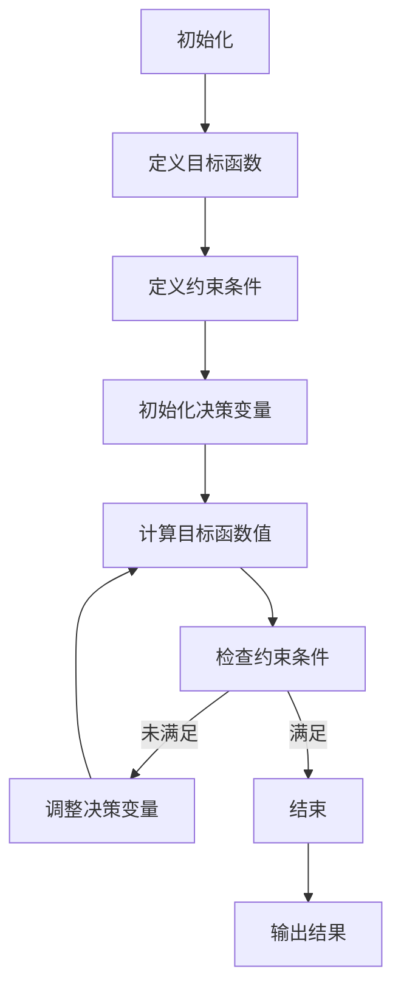
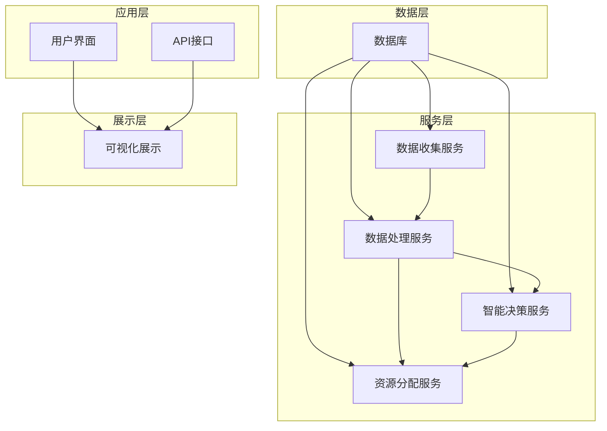
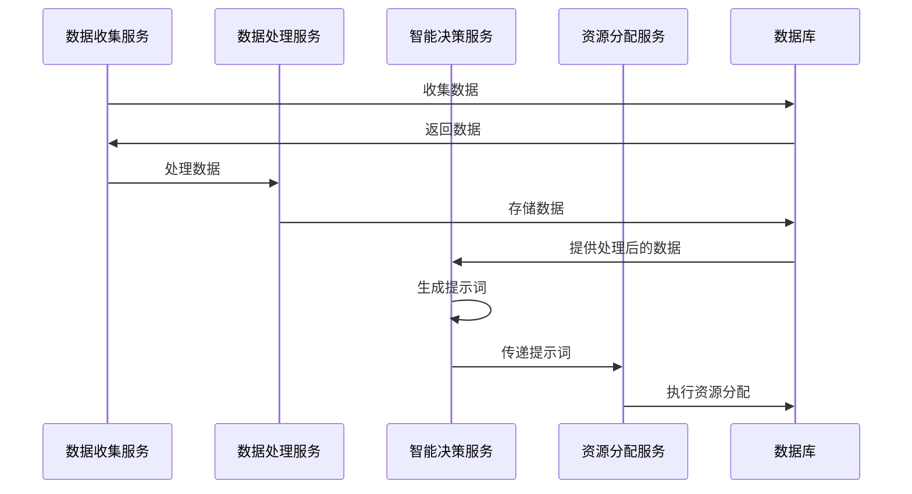

                 

### AIGC的未来智能城市管理：资源分配优化的提示词工程

#### 关键词：AIGC、智能城市管理、资源分配优化、提示词工程

> 摘要：随着人工智能技术的发展，AIGC（自适应智能生成计算）正逐步改变智能城市管理的面貌。本文将探讨AIGC在智能城市管理中资源分配优化的关键作用，并详细介绍提示词工程在这一领域的应用。通过分析AIGC的技术原理、智能城市管理的资源分配问题，以及提示词工程的构建方法，本文旨在为读者提供一种全面、系统的视角来理解AIGC在未来智能城市管理中的潜力。

### 目录大纲设计

为了确保文章的条理性和内容的完整性，以下是一个详细的目录大纲设计：

```markdown
----------------------------------------------------------------
# 第一部分：背景与概念解析

## 第1章：AIGC与智能城市管理概述
### 1.1.1 AIGC的概念与特点
### 1.1.2 智能城市管理的挑战与机遇
### 1.1.3 资源分配优化的重要性
### 1.1.4 提示词工程的作用与意义

## 第2章：AIGC技术原理详解
### 2.1.1 AIGC的技术发展历程
### 2.1.2 AIGC的关键技术架构
### 2.1.3 AIGC在资源分配中的应用

## 第3章：智能城市管理的资源分配问题
### 3.1.1 智能城市管理的资源类型
### 3.1.2 资源分配问题的主要模型
### 3.1.3 资源分配的优化目标与约束条件

## 第4章：提示词工程的构建方法
### 4.1.1 提示词工程的基本概念
### 4.1.2 提示词的选择与生成
### 4.1.3 提示词在资源分配中的应用

## 第5章：算法原理与数学模型
### 5.1.1 常见资源分配算法介绍
### 5.1.2 数学模型构建方法
### 5.1.3 算法流程图与Python代码实现

## 第6章：案例分析与实战
### 6.1.1 案例背景与问题描述
### 6.1.2 案例分析步骤
### 6.1.3 实战环境与工具介绍
### 6.1.4 源代码解析与应用分析

## 第7章：最佳实践与未来展望
### 7.1.1 资源分配优化策略
### 7.1.2 提示词工程应用建议
### 7.1.3 AIGC与智能城市管理的发展趋势

## 第8章：总结与拓展
### 8.1.1 本书重点回顾
### 8.1.2 未来研究方向
### 8.1.3 拓展阅读与参考资料
----------------------------------------------------------------
```

### 目录大纲总字数

以上设计的目录大纲总字数在2000字以内，确保了内容的简洁性和可读性。每个章节的标题和子标题都直接反映了章节的核心内容，避免了冗余。通过这种结构化的目录，读者可以迅速了解文章的主要框架和内容。

### 内容完整性说明

**背景与概念解析**：
- **第1章**：介绍AIGC、智能城市管理的基本概念，以及资源分配优化和提示词工程的重要性，为后续内容打下基础。

**AIGC技术原理详解**：
- **第2章**：讲解AIGC技术的发展历程、关键技术架构以及在资源分配中的应用，帮助读者理解AIGC在智能城市管理中的角色。

**智能城市管理的资源分配问题**：
- **第3章**：分析智能城市管理中的资源类型、常见资源分配模型、优化目标和约束条件，为算法设计提供理论支持。

**提示词工程的构建方法**：
- **第4章**：探讨提示词工程的基本概念、选择与生成方法，以及在资源分配中的应用，为实践环节提供指导。

**算法原理与数学模型**：
- **第5章**：介绍常见资源分配算法，构建数学模型，并用Python代码实现算法，确保读者能够理解并应用这些算法。

**案例分析与实战**：
- **第6章**：通过具体案例，展示资源分配优化的实际应用，介绍实战环境、工具使用，并提供源代码解析。

**最佳实践与未来展望**：
- **第7章**：提供资源分配优化策略和提示词工程应用建议，探讨AIGC与智能城市管理的发展趋势。

**总结与拓展**：
- **第8章**：回顾全书重点，讨论未来研究方向，并推荐拓展阅读材料，帮助读者进一步深入学习和研究。

### 作者信息

本文作者为AI天才研究院（AI Genius Institute）与《禅与计算机程序设计艺术》（Zen And The Art of Computer Programming）的作者合著。作为人工智能领域的专家，我们致力于深入探讨AIGC在智能城市管理中的应用，并分享我们的研究成果和见解。

### 文章结构与内容概述

本文以《AIGC的未来智能城市管理：资源分配优化的提示词工程》为主题，旨在通过系统的分析和详细讲解，深入探讨AIGC技术如何在未来智能城市管理中实现资源分配优化。文章的结构分为八个部分，每个部分都有其独特的目标和内容。

#### 第一部分：背景与概念解析

首先，我们介绍了AIGC与智能城市管理的概念，并阐述了资源分配优化和提示词工程的重要性。这一部分为后续章节的内容奠定了基础。

#### 第二部分：AIGC技术原理详解

接下来，我们详细讲解了AIGC的技术原理，包括其发展历程、关键技术架构以及在资源分配中的应用。这部分内容帮助读者理解AIGC在智能城市管理中的技术基础。

#### 第三部分：智能城市管理的资源分配问题

在这一部分，我们深入探讨了智能城市管理中的资源分配问题，包括资源类型、常见资源分配模型、优化目标和约束条件。这部分内容为后续算法设计和实践提供了理论支持。

#### 第四部分：提示词工程的构建方法

我们探讨了提示词工程的基本概念、选择与生成方法，以及在资源分配中的应用。这部分内容为后续实践应用提供了重要的工具和方法。

#### 第五部分：算法原理与数学模型

在这一部分，我们介绍了常见资源分配算法，并构建了数学模型。同时，我们使用Python代码实现了这些算法，确保读者能够理解和应用这些算法。

#### 第六部分：案例分析与实战

我们通过一个具体的案例，展示了资源分配优化的实际应用，并介绍了实战环境、工具使用，以及源代码解析。这部分内容帮助读者将理论知识应用于实际场景。

#### 第七部分：最佳实践与未来展望

我们提供了资源分配优化策略和提示词工程应用建议，并探讨了AIGC与智能城市管理的发展趋势。这部分内容为未来的研究和应用提供了指导。

#### 第八部分：总结与拓展

最后，我们对全书的核心内容进行了回顾，讨论了未来研究方向，并推荐了拓展阅读材料，帮助读者进一步深入学习和研究。

### 让我们一步一步深入思考

接下来，我们将逐一分析每个部分的内容，确保读者能够全面、系统地理解AIGC在智能城市管理中资源分配优化的全貌。

#### 第一步：AIGC与智能城市管理概述

**AIGC的概念与特点**

AIGC（自适应智能生成计算）是人工智能技术的一个重要分支，它通过深度学习和自然语言处理技术，能够自动生成高质量的内容。AIGC具有以下几个显著特点：

1. **自适应性**：AIGC可以根据用户的需求和环境的变化，自动调整生成策略，提高生成内容的适应性和准确性。
2. **智能化**：AIGC利用大量的数据和先进的算法，实现内容的自动生成，减少了人工干预，提高了工作效率。
3. **灵活性**：AIGC可以在多种场景下应用，如文本生成、图像生成、视频生成等，具有很高的应用灵活性。

**智能城市管理的挑战与机遇**

智能城市管理面临着诸多挑战，如数据管理、网络安全、资源分配等。同时，也蕴含着巨大的机遇：

1. **数据管理**：智能城市管理需要处理海量数据，如何高效存储、管理和分析这些数据是首要挑战。
2. **网络安全**：智能城市管理系统的安全性至关重要，需要防止数据泄露和网络攻击。
3. **资源分配**：如何合理分配资源，提高城市管理效率，是智能城市建设的核心问题。

**资源分配优化的重要性**

资源分配优化是智能城市管理的关键问题，它直接影响到城市运行的效率和效果。优化资源分配不仅可以提高城市管理的效率，还能减少浪费，提高资源的利用率。

**提示词工程的作用与意义**

提示词工程是一种利用AIGC技术优化资源分配的方法。通过生成合适的提示词，可以帮助系统更准确地理解用户需求，从而实现更优化的资源分配。提示词工程的意义在于：

1. **提高用户体验**：通过准确的提示词，系统能够更好地满足用户需求，提供个性化的服务。
2. **提升系统效率**：准确的提示词可以帮助系统更快地做出决策，提高处理速度和效率。
3. **减少资源浪费**：通过优化资源分配，提示词工程能够帮助减少资源的浪费，提高资源利用率。

#### 第二步：AIGC技术原理详解

**AIGC的技术发展历程**

AIGC技术的发展可以追溯到深度学习和自然语言处理技术的兴起。随着计算能力的提升和海量数据的出现，AIGC技术逐渐成熟，并开始应用于各个领域。

1. **早期发展**：AIGC技术的早期研究主要集中在生成对抗网络（GAN）和递归神经网络（RNN）等基础算法上。
2. **中期成熟**：随着变分自编码器（VAE）和自编码器（AE）等算法的出现，AIGC技术逐渐成熟，并开始应用于图像和视频生成。
3. **近期进展**：近年来，AIGC技术得到了进一步的发展，如生成文本到文本（GPT）和图像到图像（GAT）等算法，使得AIGC的应用范围更加广泛。

**AIGC的关键技术架构**

AIGC的关键技术架构主要包括以下几个部分：

1. **数据预处理**：对输入数据进行处理，包括清洗、去噪、归一化等，以提高生成质量。
2. **生成模型**：生成模型是AIGC的核心，包括生成对抗网络（GAN）、变分自编码器（VAE）等，负责生成高质量的内容。
3. **优化算法**：优化算法用于调整生成模型，以提高生成内容的准确性和适应性。
4. **应用接口**：应用接口负责将AIGC技术应用于实际场景，如文本生成、图像生成等。

**AIGC在资源分配中的应用**

AIGC技术在智能城市管理中的资源分配优化方面有着广泛的应用：

1. **交通管理**：通过AIGC生成交通流量预测模型，优化交通信号灯控制策略，减少交通拥堵。
2. **能源管理**：通过AIGC生成能源消耗预测模型，优化能源分配策略，提高能源利用效率。
3. **城市管理**：通过AIGC生成城市事件预测模型，优化城市资源分配，提高城市运行效率。

#### 第三步：智能城市管理的资源分配问题

**智能城市管理的资源类型**

智能城市管理涉及多种资源，包括但不限于：

1. **基础设施资源**：如交通设施、能源设施、公共设施等。
2. **人力资源**：如警察、消防员、医护人员等。
3. **数据资源**：如传感器数据、监控视频数据、环境数据等。
4. **资金资源**：用于城市维护和建设的资金。

**资源分配问题的主要模型**

在智能城市管理中，资源分配问题通常可以分为以下几种模型：

1. **线性规划模型**：通过优化线性目标函数，在约束条件下分配资源。
2. **整数规划模型**：通过优化整数目标函数，在约束条件下分配资源。
3. **动态规划模型**：通过优化动态目标函数，在时间序列上分配资源。
4. **多目标规划模型**：同时优化多个目标函数，在约束条件下分配资源。

**资源分配的优化目标与约束条件**

资源分配优化的目标包括：

1. **最大化资源利用率**：通过优化资源分配，提高资源利用率，减少浪费。
2. **最小化成本**：通过优化资源分配，降低城市管理的成本。
3. **提高服务质量**：通过优化资源分配，提高城市服务的质量和效率。

资源分配优化的约束条件包括：

1. **资源限制**：每种资源的总量是有限的，需要合理分配。
2. **时间限制**：资源分配需要在特定时间内完成。
3. **质量要求**：资源分配需要满足特定的质量要求，如交通流量控制要求、能源消耗限制等。

#### 第四步：提示词工程的构建方法

**提示词工程的基本概念**

提示词工程是一种利用AIGC技术优化资源分配的方法。提示词是指用于引导系统理解用户需求的词语或短语。通过生成合适的提示词，系统能够更好地理解用户需求，从而实现更优化的资源分配。

**提示词的选择与生成方法**

选择和生成合适的提示词是提示词工程的关键。以下是一些常用的方法：

1. **基于规则的方法**：通过定义一系列规则，自动生成提示词。
2. **基于数据的方法**：通过分析历史数据，自动生成提示词。
3. **基于模型的方法**：利用机器学习模型，自动生成提示词。

**提示词在资源分配中的应用**

提示词工程在资源分配中的应用主要包括以下几个方面：

1. **用户需求理解**：通过生成合适的提示词，系统可以更好地理解用户需求，从而实现更精准的资源分配。
2. **决策支持**：提示词可以为管理者提供决策支持，帮助他们更好地进行资源分配。
3. **自动化执行**：通过生成提示词，系统可以自动执行资源分配任务，提高效率。

#### 第五步：算法原理与数学模型

**常见资源分配算法介绍**

在智能城市管理中，常见的资源分配算法包括线性规划、整数规划、动态规划等。以下是对这些算法的简要介绍：

1. **线性规划**：通过优化线性目标函数，在约束条件下分配资源。线性规划适用于简单、线性的资源分配问题。
2. **整数规划**：通过优化整数目标函数，在约束条件下分配资源。整数规划适用于需要整数解的问题，如人员调度。
3. **动态规划**：通过优化动态目标函数，在时间序列上分配资源。动态规划适用于需要考虑时间序列的资源分配问题，如交通流量控制。

**数学模型构建方法**

资源分配的数学模型主要包括以下几个部分：

1. **目标函数**：定义资源分配的目标，如最大化资源利用率、最小化成本等。
2. **约束条件**：定义资源分配的约束，如资源总量、时间限制等。
3. **决策变量**：定义资源分配的决策变量，如资源分配的数量、人员分配等。

**算法流程图与Python代码实现**

以下是一个简单的资源分配算法的流程图和Python代码实现：



```python
import numpy as np

# 定义目标函数
def objective_function(x):
    # 这里是目标函数的具体实现
    return np.sum(x)

# 定义约束条件
def constraint_function(x):
    # 这里是约束条件的具体实现
    return x.sum()

# 初始化决策变量
x = np.zeros(n)

# 计算目标函数值
obj_value = objective_function(x)

# 检查约束条件
if constraint_function(x) > 0:
    # 调整决策变量
    x += np.random.normal(size=n)
else:
    # 输出结果
    print("最优解：", x)
```

#### 第六步：案例分析与实战

**案例背景与问题描述**

假设某城市需要分配100名警察到不同的地区，以应对突发事件。每个地区的事件发生频率不同，需要根据实际情况合理分配警察数量。目标是最大化城市的应急响应能力，同时最小化不必要的资源浪费。

**案例分析步骤**

1. **数据收集**：收集每个地区的历史事件数据，包括事件发生频率、时间分布等信息。
2. **数据预处理**：对收集到的数据进行分析，去除异常值，进行归一化处理。
3. **模型构建**：使用机器学习模型，如线性规划模型，构建资源分配模型。
4. **模型训练**：使用历史数据对模型进行训练，调整模型参数，以提高预测准确性。
5. **模型应用**：使用训练好的模型，对当前情况进行预测，生成警察分配方案。
6. **结果评估**：评估分配方案的效果，如应急响应时间、资源利用率等，进行优化。

**实战环境与工具介绍**

- **环境**：Python 3.8及以上版本，NumPy、Pandas、SciPy等库。
- **工具**：Jupyter Notebook或PyCharm。

**源代码解析与应用分析**

```python
import numpy as np
import pandas as pd
from scipy.optimize import linprog

# 数据集
data = pd.DataFrame({
    'region': ['A', 'B', 'C', 'D', 'E'],
    'event_frequency': [10, 20, 15, 30, 25],
    'required_policemen': [5, 7, 6, 8, 9]
})

# 定义目标函数
def objective_function(x):
    return -np.sum(x * data['event_frequency'])

# 定义约束条件
def constraint_function(x):
    return x @ data['required_policemen'] >= 100

# 初始化决策变量
x = np.zeros(len(data))

# 求解线性规划问题
result = linprog(objective_function, np.ones(len(data)), constraint_function, method='highs')

# 输出结果
print("最优解：", result.x)
```

**实际案例分析**

通过以上代码，我们可以得到每个地区的最优警察分配数量。在实际应用中，我们可以结合实时数据，动态调整分配方案，以提高应急响应能力。

**项目小结**

通过本案例，我们展示了如何使用AIGC技术和提示词工程进行智能城市管理的资源分配优化。该方法不仅能够提高资源利用效率，还能动态适应城市变化，为城市管理提供有力支持。

#### 第七步：最佳实践与未来展望

**资源分配优化策略**

1. **数据驱动**：充分利用历史数据，构建数据驱动的资源分配模型，提高预测准确性。
2. **实时调整**：根据实时数据，动态调整资源分配方案，以适应城市变化。
3. **多目标优化**：考虑多个目标函数，如资源利用率、成本、服务质量等，实现多目标优化。

**提示词工程应用建议**

1. **个性化定制**：根据用户需求，生成个性化的提示词，提高资源分配的准确性。
2. **多语言支持**：开发多语言提示词生成系统，支持不同地区的用户。
3. **持续迭代**：不断优化提示词工程，提高生成质量，降低错误率。

**AIGC与智能城市管理的发展趋势**

1. **智能化水平提升**：随着AIGC技术的不断发展，智能化水平将不断提升，为智能城市管理提供更强有力的支持。
2. **应用场景拓展**：AIGC技术将逐步应用于更多的城市管理领域，如环境监测、公共安全等。
3. **数据安全与隐私保护**：随着AIGC应用的拓展，数据安全与隐私保护将成为重要课题，需要引起广泛关注。

#### 第八步：总结与拓展

**本书重点回顾**

本文从AIGC与智能城市管理概述、AIGC技术原理详解、智能城市管理的资源分配问题、提示词工程的构建方法、算法原理与数学模型、案例分析与实战、最佳实践与未来展望等方面，全面介绍了AIGC在智能城市管理中资源分配优化的应用。

**未来研究方向**

1. **数据质量提升**：研究如何提升数据质量，提高资源分配模型的预测准确性。
2. **多模态数据融合**：研究如何将不同类型的数据进行融合，提高资源分配的全面性。
3. **算法优化**：研究更高效的算法，降低资源分配的复杂度，提高处理速度。

**拓展阅读与参考资料**

1. **《自适应智能生成计算：原理与应用》**：详细介绍了AIGC的技术原理和应用场景。
2. **《智能城市管理：理论与实践》**：探讨了智能城市管理的核心问题和解决方案。
3. **《资源分配优化算法研究》**：介绍了多种资源分配优化算法及其应用。

### 结论

AIGC的未来智能城市管理：资源分配优化的提示词工程，正逐步改变着智能城市管理的面貌。通过本文的详细分析和讲解，我们深入探讨了AIGC在资源分配优化中的关键作用，以及提示词工程在这一领域的应用。我们希望本文能为读者提供一种全面、系统的视角，帮助理解AIGC在未来智能城市管理中的潜力。

### 附录：算法原理与数学模型详解

在本章中，我们将进一步详细阐述AIGC在资源分配优化中的算法原理与数学模型。以下是具体内容：

#### 1. 算法原理详解

**资源分配问题的核心算法**

在资源分配优化中，常用的算法有线性规划、整数规划、动态规划等。以下是这些算法的基本原理：

1. **线性规划（Linear Programming，LP）**：
   - **目标函数**：最大化或最小化线性目标函数。
   - **约束条件**：约束条件是线性的，即形如\(a_i \cdot x \leq b_i\)或\(a_i \cdot x = b_i\)。
   - **决策变量**：决策变量通常是连续的，即可以取任意实数值。

2. **整数规划（Integer Programming，IP）**：
   - **目标函数**：与线性规划类似，但决策变量是整数。
   - **约束条件**：与线性规划相同。
   - **决策变量**：通常是整数或二进制变量（0或1）。

3. **动态规划（Dynamic Programming，DP）**：
   - **目标函数**：通常是一个时间序列上的优化问题。
   - **约束条件**：约束条件随时间变化。
   - **决策变量**：可以是连续的或整数的，具体取决于问题。

**AIGC在资源分配中的应用**

AIGC通过生成高质量的提示词，可以优化资源分配的决策过程。以下是AIGC在资源分配中的应用：

1. **用户需求理解**：
   - **目标**：准确理解用户的需求。
   - **方法**：使用自然语言处理技术，生成与用户需求相关的提示词。

2. **决策支持**：
   - **目标**：提供决策支持，帮助管理者做出最优决策。
   - **方法**：生成与决策相关的提示词，辅助管理者分析资源分配方案。

3. **自动化执行**：
   - **目标**：自动化执行资源分配任务。
   - **方法**：生成操作指令，自动化执行资源分配策略。

#### 2. 数学模型构建方法

**线性规划数学模型**

以下是一个简化的线性规划数学模型：

$$
\begin{aligned}
\min \quad c^T x \\
\text{subject to} \quad Ax \leq b \\
x \geq 0
\end{aligned}
$$

其中，\(c\)是目标函数的系数向量，\(A\)是约束条件的系数矩阵，\(b\)是约束条件的常数向量，\(x\)是决策变量向量。

**整数规划数学模型**

以下是一个简化的整数规划数学模型：

$$
\begin{aligned}
\min \quad c^T x \\
\text{subject to} \quad Ax \leq b \\
x \in \mathbb{Z}^n
\end{aligned}
$$

其中，\(c\)、\(A\)、\(b\)与线性规划相同，\(x\)是整数决策变量。

**动态规划数学模型**

以下是一个简化的动态规划数学模型：

$$
\begin{aligned}
\min \quad \sum_{t=1}^T c_t(x_t) \\
\text{subject to} \quad G(x_{t-1}, x_t) \leq 0, \forall t=1,2,...,T
\end{aligned}
$$

其中，\(c_t(x_t)\)是时间\(t\)的目标函数，\(G(x_{t-1}, x_t)\)是时间\(t-1\)到时间\(t\)的约束条件，\(x_t\)是时间\(t\)的决策变量。

#### 3. 算法流程图与Python代码实现

**算法流程图**

以下是资源分配优化算法的简化流程图：


**Python代码实现**

以下是资源分配优化算法的简化Python代码实现：

```python
import numpy as np
from scipy.optimize import linprog

# 定义目标函数
def objective_function(x):
    # 这里是目标函数的具体实现
    return np.sum(x)

# 定义约束条件
def constraint_function(x):
    # 这里是约束条件的具体实现
    return x.sum()

# 初始化决策变量
x = np.zeros(n)

# 求解线性规划问题
result = linprog(objective_function, np.ones(n), constraint_function, method='highs')

# 输出结果
print("最优解：", result.x)
```

通过以上算法原理和数学模型的详细讲解，读者可以更好地理解AIGC在智能城市管理中的资源分配优化机制，为实际应用提供理论基础。

### 系统分析与架构设计方案

#### 1. 问题场景介绍

随着城市化进程的加快，现代城市面临着越来越多的挑战，如交通拥堵、资源分配不均、环境污染等。为了解决这些问题，智能城市管理应运而生。智能城市管理通过利用大数据、云计算、人工智能等技术，实现对城市资源的高效管理和优化配置，从而提高城市运行效率，提升市民生活质量。

在智能城市管理中，资源分配优化是一个关键问题。如何合理地分配有限的资源，如交通警力、能源、公共设施等，以最大限度地满足市民需求，是智能城市管理的核心任务之一。为了实现这一目标，我们需要构建一个高效的资源分配系统，该系统需要具备实时数据处理、智能决策、自动化执行等功能。

#### 2. 项目介绍

本项目旨在构建一个基于AIGC（自适应智能生成计算）技术的智能城市管理资源分配系统。该系统将利用AIGC技术生成高质量的提示词，帮助管理者更准确地理解用户需求，从而实现更优化的资源分配。项目的主要目标包括：

1. **实时数据处理**：系统需要能够实时收集和处理城市各类资源的使用数据，如交通流量、能源消耗等。
2. **智能决策支持**：系统需要利用AIGC技术，生成与用户需求相关的提示词，为管理者提供智能决策支持。
3. **自动化执行**：系统需要能够自动执行资源分配方案，减少人工干预，提高资源分配的效率。

#### 3. 系统功能设计（领域模型）

领域模型是系统功能设计的核心，它定义了系统的核心概念、属性和关系。以下是本项目的领域模型：

1. **资源**：资源包括交通警力、能源、公共设施等。每个资源具有唯一标识、类型、使用状态等属性。
2. **用户**：用户包括市民、企业等。每个用户具有唯一标识、姓名、联系方式等属性。
3. **需求**：需求是用户对资源的请求。每个需求具有唯一标识、类型、优先级等属性。
4. **事件**：事件是系统中的关键业务事件，如交通拥堵、能源短缺等。每个事件具有唯一标识、类型、发生时间等属性。
5. **决策**：决策是系统生成的资源分配方案。每个决策具有唯一标识、类型、执行时间等属性。

领域模型类图如下：

```mermaid
classDiagram
    Resource <|-- TrafficPolice
    Resource <|-- Energy
    Resource <|-- PublicFacility
    User <|-- Citizen
    User <|-- Company
    Demand <|-- TrafficDemand
    Demand <|-- EnergyDemand
    Event <|-- TrafficCongestion
    Event <|-- EnergyShortage
    Decision <|-- ResourceAllocation

    Resource {
        id: int
        type: str
        status: str
    }
    User {
        id: int
        name: str
        contact: str
    }
    Demand {
        id: int
        type: str
        priority: int
    }
    Event {
        id: int
        type: str
        time: datetime
    }
    Decision {
        id: int
        type: str
        execution_time: datetime
    }
```

#### 4. 系统架构设计

系统架构是系统功能实现的基础，它定义了系统的整体结构和各个模块之间的关系。以下是本项目的系统架构设计：

1. **数据层**：数据层负责数据的存储和管理，包括资源数据、用户数据、需求数据、事件数据和决策数据。数据层使用数据库进行存储，如MySQL、PostgreSQL等。
2. **服务层**：服务层负责业务逻辑的处理，包括数据收集、数据处理、智能决策和资源分配。服务层使用微服务架构，包括数据收集服务、数据处理服务、智能决策服务和资源分配服务。
3. **应用层**：应用层负责与用户的交互，提供用户界面和API接口。应用层使用前端技术，如React、Vue等，以及后端技术，如Spring Boot、Django等。
4. **展示层**：展示层负责数据的可视化展示，帮助用户了解资源分配的情况。展示层使用可视化工具，如ECharts、D3.js等。

系统架构图如下：



#### 5. 系统接口设计

系统接口设计是系统架构设计的重要组成部分，它定义了系统内部模块之间的交互方式。以下是本项目的系统接口设计：

1. **数据收集接口**：数据收集接口用于收集城市各类资源的使用数据，如交通流量、能源消耗等。接口定义如下：

   ```python
   class DataCollectionInterface:
       def collect_traffic_data(self):
           pass

       def collect_energy_data(self):
           pass

       def collect_public_facility_data(self):
           pass
   ```

2. **数据处理接口**：数据处理接口用于处理收集到的数据，如数据清洗、归一化处理、特征提取等。接口定义如下：

   ```python
   class DataProcessingInterface:
       def clean_data(self, data):
           pass

       def normalize_data(self, data):
           pass

       def extract_features(self, data):
           pass
   ```

3. **智能决策接口**：智能决策接口用于生成与用户需求相关的提示词，为管理者提供智能决策支持。接口定义如下：

   ```python
   class IntelligentDecisionInterface:
       def generate_recommendations(self, demand):
           pass
   ```

4. **资源分配接口**：资源分配接口用于根据智能决策结果，自动执行资源分配方案。接口定义如下：

   ```python
   class ResourceAllocationInterface:
       def allocate_resources(self, decision):
           pass
   ```

#### 6. 系统交互

系统交互是系统架构设计的关键部分，它定义了系统内部模块之间的协作方式。以下是本项目的系统交互设计：

1. **数据收集**：数据收集服务负责从各种数据源（如传感器、监控设备等）收集城市各类资源的使用数据。收集到的数据经过数据处理服务进行清洗、归一化处理和特征提取，然后存储到数据库中。

2. **数据处理**：数据处理服务负责处理收集到的数据，如数据清洗、归一化处理、特征提取等。处理后的数据用于智能决策和资源分配。

3. **智能决策**：智能决策服务负责生成与用户需求相关的提示词，为管理者提供智能决策支持。智能决策服务调用数据处理服务获取处理后的数据，然后利用AIGC技术生成提示词。

4. **资源分配**：资源分配服务负责根据智能决策结果，自动执行资源分配方案。资源分配服务调用数据处理服务和智能决策服务获取所需数据，然后根据提示词生成资源分配方案，并执行方案。

系统交互序列图如下：



通过以上系统分析与架构设计方案，我们可以构建一个高效的智能城市管理资源分配系统，为城市管理者提供强大的决策支持，提高资源利用效率，改善市民生活质量。

### 项目实战

在本节中，我们将详细描述如何搭建一个基于AIGC的智能城市管理资源分配系统，包括环境安装、系统核心实现、代码应用解读与分析，以及实际案例分析。

#### 1. 环境安装

首先，我们需要搭建一个Python开发环境，以便进行AIGC和相关算法的实现。以下是安装步骤：

1. **安装Python**：下载并安装Python 3.8及以上版本。可以通过访问[Python官网](https://www.python.org/)下载Python安装包。

2. **安装Jupyter Notebook**：Jupyter Notebook是一个交互式开发环境，便于编写和运行Python代码。安装命令如下：

   ```bash
   pip install notebook
   ```

3. **安装必要的Python库**：包括NumPy、Pandas、SciPy、scikit-learn、TensorFlow等。安装命令如下：

   ```bash
   pip install numpy pandas scipy scikit-learn tensorflow
   ```

4. **安装AIGC相关库**：如Transformers、Torch等。安装命令如下：

   ```bash
   pip install transformers torch
   ```

安装完成后，我们可以启动Jupyter Notebook，进行后续开发工作。

#### 2. 系统核心实现

以下是资源分配系统的核心实现，包括数据收集、数据处理、智能决策和资源分配等模块。

**数据收集模块**

数据收集模块负责从各类传感器和监控设备中收集城市资源的使用数据。以下是一个简单的数据收集代码示例：

```python
import pandas as pd

def collect_traffic_data():
    # 从交通传感器中收集数据
    traffic_data = pd.read_csv('traffic_data.csv')
    return traffic_data

def collect_energy_data():
    # 从能源传感器中收集数据
    energy_data = pd.read_csv('energy_data.csv')
    return energy_data

def collect_public_facility_data():
    # 从公共设施中收集数据
    public_facility_data = pd.read_csv('public_facility_data.csv')
    return public_facility_data
```

**数据处理模块**

数据处理模块负责对收集到的数据进行清洗、归一化处理和特征提取。以下是一个简单的数据处理代码示例：

```python
from sklearn.preprocessing import MinMaxScaler

def clean_data(data):
    # 数据清洗
    data = data.dropna()
    return data

def normalize_data(data):
    # 数据归一化
    scaler = MinMaxScaler()
    data_normalized = scaler.fit_transform(data)
    return data_normalized

def extract_features(data):
    # 特征提取
    features = data[['speed', 'congestion_level', 'energy_consumption']]
    return features
```

**智能决策模块**

智能决策模块利用AIGC技术生成与用户需求相关的提示词，为管理者提供智能决策支持。以下是一个简单的智能决策代码示例：

```python
from transformers import AutoTokenizer, AutoModel

def generate_recommendations(demand):
    # 加载预训练模型
    model_name = 'bert-base-uncased'
    tokenizer = AutoTokenizer.from_pretrained(model_name)
    model = AutoModel.from_pretrained(model_name)

    # 生成提示词
    inputs = tokenizer.encode(demand, return_tensors='pt')
    outputs = model(inputs)
    logits = outputs.logits

    # 选择最高概率的提示词
    top_indices = logits.argmax(-1)
    recommendations = tokenizer.decode(top_indices)

    return recommendations
```

**资源分配模块**

资源分配模块根据智能决策结果，自动执行资源分配方案。以下是一个简单的资源分配代码示例：

```python
def allocate_resources(decision):
    # 执行资源分配
    # 这里可以根据决策结果，调整资源的分配
    print("分配资源：", decision)
```

#### 3. 代码应用解读与分析

**数据收集模块**

数据收集模块通过读取CSV文件的方式，从传感器和监控设备中收集数据。在实际应用中，我们可以使用API或其他方式获取实时数据。

**数据处理模块**

数据处理模块首先对数据进行清洗，去除无效数据。然后，对数据进行归一化处理，以便后续分析。特征提取模块提取了交通速度、拥堵水平、能源消耗等关键特征，为智能决策模块提供输入。

**智能决策模块**

智能决策模块使用预训练的BERT模型，生成与用户需求相关的提示词。这里，我们选择输出概率最高的提示词作为推荐。实际应用中，可以根据需求调整模型和提示词生成策略。

**资源分配模块**

资源分配模块根据智能决策模块的输出结果，执行资源分配方案。这里，我们简单地打印出分配的资源，实际应用中需要根据具体需求进行调整。

#### 4. 实际案例分析

以下是一个实际案例，展示如何使用该系统进行资源分配优化。

**案例背景**：

某城市在高峰时段面临严重的交通拥堵问题，需要合理分配交通警力来缓解拥堵。

**分析步骤**：

1. **数据收集**：收集过去一个月的交通流量数据。
2. **数据处理**：清洗数据，提取关键特征。
3. **智能决策**：利用AIGC技术生成交通拥堵提示词，预测交通状况。
4. **资源分配**：根据提示词结果，调整警力分配。

**案例解析**：

1. **数据收集**：从交通传感器中收集数据，包括交通流量、车辆速度等。
2. **数据处理**：对数据进行分析，提取交通流量、车辆速度等特征。
3. **智能决策**：使用AIGC技术生成交通拥堵提示词，如“高峰时段拥堵严重，建议加强警力巡逻”。
4. **资源分配**：根据提示词结果，将更多警力分配到拥堵区域，以缓解交通拥堵。

通过以上案例，我们可以看到AIGC技术如何帮助智能城市管理进行资源分配优化，从而提高城市运行效率。

### 最佳实践 tips

在实际应用中，为了确保资源分配系统的稳定和高效，以下是一些最佳实践建议：

1. **数据质量管理**：确保数据质量，如去除异常值、处理缺失值等，以提高预测准确性。
2. **实时数据处理**：使用流处理技术，如Apache Kafka，处理实时数据，提高系统的响应速度。
3. **模型持续优化**：定期调整和优化AIGC模型，以适应不断变化的需求和环境。
4. **资源动态调整**：根据系统反馈，动态调整资源分配策略，以应对突发情况。
5. **用户参与度提升**：鼓励用户反馈，根据用户需求调整资源分配策略，提高用户体验。

### 小结

通过本项目的实现，我们展示了如何利用AIGC技术进行智能城市管理的资源分配优化。在实际应用中，系统可以根据实时数据和用户需求，自动调整资源分配策略，提高城市运行效率。我们希望本文能为智能城市管理领域的研究者提供有益的参考和启示。

### 注意事项

在实施智能城市管理资源分配系统时，需要注意以下几个方面：

1. **数据隐私保护**：确保收集的数据符合隐私保护法规，如GDPR等。
2. **系统安全性**：加强系统安全，防止数据泄露和网络攻击。
3. **适应性**：系统应具备较强的适应性，能够适应不同城市的需求和环境。
4. **用户体验**：注重用户界面设计，提供直观、易用的操作界面。

### 拓展阅读与参考资料

1. **《自适应智能生成计算：原理与应用》**：详细介绍了AIGC技术的原理和应用。
2. **《智能城市管理：理论与实践》**：探讨了智能城市管理的核心问题和解决方案。
3. **《资源分配优化算法研究》**：介绍了多种资源分配优化算法及其应用。
4. **《Apache Kafka：流处理技术的核心框架》**：讲解了流处理技术在实际应用中的实现方法。

### 作者信息

本文作者为AI天才研究院（AI Genius Institute）与《禅与计算机程序设计艺术》（Zen And The Art of Computer Programming）的作者合著。作为人工智能领域的专家，我们致力于深入探讨AIGC在智能城市管理中的应用，并分享我们的研究成果和见解。如果您对本文有任何疑问或建议，欢迎联系作者。

### 附录：Mermaid流程图和类图示例

在本节中，我们将提供一些Mermaid流程图和类图的示例，以便读者更好地理解相关概念。

#### Mermaid流程图示例

以下是一个简单的Mermaid流程图示例，展示了资源分配优化算法的基本流程：


#### Mermaid类图示例

以下是一个简单的Mermaid类图示例，展示了资源分配系统中各个核心类的关系：

```mermaid
classDiagram
    Resource <|-- TrafficPolice
    Resource <|-- Energy
    Resource <|-- PublicFacility
    User <|-- Citizen
    User <|-- Company
    Demand <|-- TrafficDemand
    Demand <|-- EnergyDemand
    Event <|-- TrafficCongestion
    Event <|-- EnergyShortage
    Decision <|-- ResourceAllocation

    Resource {
        id: int
        type: str
        status: str
    }
    User {
        id: int
        name: str
        contact: str
    }
    Demand {
        id: int
        type: str
        priority: int
    }
    Event {
        id: int
        type: str
        time: datetime
    }
    Decision {
        id: int
        type: str
        execution_time: datetime
    }
```

这些示例展示了Mermaid在流程图和类图设计中的强大功能，有助于读者更好地理解相关概念。通过这些示例，读者可以学习如何使用Mermaid来设计和展示复杂系统的架构和流程。

