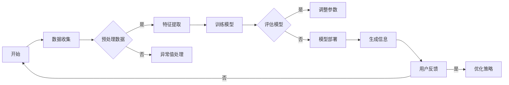

                 

### AIGC的未来智能家居系统：生活场景优化的提示词工程

> 关键词：AIGC、智能家居、生活场景优化、提示词工程

> 摘要：本文深入探讨了AIGC（自适应信息生成与控制）在智能家居系统中的应用，分析了其如何通过优化生活场景来提升用户体验。我们将从AIGC与智能家居系统的背景介绍开始，逐步深入探讨AIGC的基础理论、算法原理、系统架构设计以及实际应用，最终总结出AIGC在智能家居系统中的最佳实践和未来发展方向。

### 目录大纲

1. **第一部分：AIGC与智能家居系统概述**
    1.1 **AIGC与智能家居系统的背景介绍**
    1.2 **AIGC在智能家居中的潜力与挑战**
    1.3 **核心概念与联系**
2. **第二部分：AIGC在智能家居系统中的应用原理**
    2.1 **AIGC的基础理论**
    2.2 **AIGC的关键技术**
    2.3 **AIGC在智能家居系统中的应用场景**
3. **第三部分：智能家居系统的构建与优化**
    3.1 **智能家居系统架构设计**
    3.2 **AIGC在智能家居系统中的优化策略**
4. **第四部分：AIGC在智能家居系统的实战应用**
    4.1 **项目背景**
    4.2 **系统核心实现**
    4.3 **代码应用解读与分析**
    4.4 **实际案例分析与讲解**
    4.5 **项目小结**
5. **第五部分：AIGC在智能家居系统的最佳实践**
    5.1 **最佳实践总结**
    5.2 **注意事项与问题规避**
    5.3 **拓展阅读**

## 第一部分：AIGC与智能家居系统概述

### 1.1 AIGC与智能家居系统的背景介绍

随着人工智能技术的不断进步，智能家居系统正逐渐成为现代生活的标配。然而，当前的智能家居系统仍然面临着许多挑战，如数据隐私、安全性、设备兼容性和用户体验等。AIGC（自适应信息生成与控制）作为一种新兴的人工智能技术，为解决这些问题提供了一种新的思路。

AIGC 是一种能够自适应地生成和调整信息的技术，它结合了信息检索、自然语言处理和机器学习等技术，能够在复杂环境中生成高质量的个性化信息。在智能家居系统中，AIGC 可以通过分析用户的日常行为和习惯，生成个性化的生活场景，从而提高用户的生活质量。

### 1.1.1 智能家居系统的发展现状

智能家居系统的发展经历了从简单的设备互联到复杂的人工智能控制的演变。目前，智能家居系统主要包括以下几类：

1. **设备控制**：通过手机、平板电脑等移动设备对家庭中的电器进行远程控制，如空调、照明、门锁等。
2. **自动化场景**：根据用户设定的规则，自动调整家庭设备的状态，如离家模式、睡眠模式等。
3. **智能交互**：通过语音助手、智能屏幕等与用户进行自然语言交互，提供信息查询、娱乐等服务。

尽管智能家居系统已经取得了一定的进展，但仍然存在以下痛点：

1. **用户体验不佳**：系统功能繁多，但缺乏个性化的定制服务，用户往往需要花费大量时间去设置和调整。
2. **数据隐私和安全**：智能家居系统涉及到用户的隐私数据，如生活习惯、位置信息等，如何确保这些数据的安全是一个重要问题。
3. **设备兼容性**：智能家居市场存在众多品牌和标准，设备之间的兼容性问题仍然困扰着用户。

### 1.1.2 AIGC的概念及其在智能家居中的应用

AIGC 是一种能够自适应地生成和调整信息的技术，它结合了信息检索、自然语言处理和机器学习等技术，能够在复杂环境中生成高质量的个性化信息。在智能家居系统中，AIGC 可以通过以下方式应用：

1. **个性化场景生成**：根据用户的日常行为和习惯，AIGC 可以生成个性化的生活场景，如早上起床后的唤醒、晚上睡眠前的放松等。
2. **智能建议**：AIGC 可以根据用户的偏好和历史行为，提供个性化的建议，如推荐家庭活动、健康建议等。
3. **隐私保护**：AIGC 通过加密和匿名化技术，确保用户的隐私数据在系统中得到保护。

### 1.1.3 AIGC在智能家居中的潜力与挑战

AIGC 在智能家居系统中的应用具有巨大的潜力：

1. **提升用户体验**：通过个性化场景生成和智能建议，AIGC 可以显著提升用户的体验，使智能家居系统更加智能和贴心。
2. **增强安全性**：通过隐私保护技术，AIGC 可以确保用户的隐私数据在系统中得到保护，提高系统的安全性。
3. **促进设备兼容性**：AIGC 可以通过自适应的信息生成和调整，使不同品牌和标准的设备能够更好地协同工作，提高系统的兼容性。

然而，AIGC 在智能家居系统中的应用也面临着一些挑战：

1. **数据质量和隐私**：AIGC 的效果很大程度上取决于数据的质量和隐私保护能力，如何收集、处理和存储数据是一个重要问题。
2. **算法的公平性和透明性**：AIGC 的算法需要保证公平性和透明性，避免算法偏见和不可解释的问题。
3. **系统稳定性和效率**：AIGC 需要在实时性和效率之间取得平衡，确保系统的稳定运行。

### 1.2 问题描述

在当前的智能家居系统中，用户面临的主要问题是：

1. **个性化不足**：系统缺乏对用户个性化需求的识别和响应，导致用户体验不佳。
2. **数据安全和隐私**：用户担心智能家居系统会泄露个人信息，影响隐私安全。
3. **设备兼容性**：不同品牌和标准的设备之间存在兼容性问题，导致系统配置和使用复杂。

AIGC 可以通过以下方式解决这些问题：

1. **提升个性化**：通过分析用户的日常行为和习惯，AIGC 可以生成个性化的生活场景和智能建议，提升用户体验。
2. **增强安全性**：AIGC 可以通过加密和匿名化技术，保护用户的隐私数据，增强系统的安全性。
3. **促进兼容性**：AIGC 可以通过自适应的信息生成和调整，使不同品牌和标准的设备能够更好地协同工作，提高系统的兼容性。

### 1.3 核心概念与联系

在本文中，我们将探讨以下几个核心概念：

1. **AIGC**：自适应信息生成与控制技术，能够生成和调整个性化信息。
2. **智能家居系统**：通过互联网和物联网技术实现家庭设备互联互通的系统。
3. **用户体验**：用户在使用智能家居系统过程中的感受和满意度。
4. **数据隐私和安全**：确保用户隐私数据不被泄露和滥用的技术。

这些概念之间的联系如下：

1. **AIGC 与智能家居系统的联系**：AIGC 是智能家居系统中的重要组成部分，用于生成和调整个性化信息，提升用户体验。
2. **用户体验与数据隐私和安全**：用户体验直接影响用户对智能家居系统的满意度，而数据隐私和安全是用户体验的重要组成部分。

通过以上分析，我们可以看到AIGC在智能家居系统中的应用前景广阔，但也需要解决一系列的挑战。在接下来的章节中，我们将深入探讨AIGC的基础理论、算法原理、系统架构设计以及实际应用，为AIGC在智能家居系统中的应用提供详细的解决方案。

### 1.3.1 AIGC的核心概念

AIGC（自适应信息生成与控制）是一种结合了信息检索、自然语言处理、机器学习等技术的综合技术体系。其核心概念主要包括以下几个方面：

1. **自适应信息生成**：AIGC 能够根据用户的需求和行为，实时生成个性化的信息。这种生成过程是自适应的，即根据用户的反馈和系统状态不断调整，以提高信息的准确性和相关性。

2. **信息调整与优化**：AIGC 不仅能够生成信息，还能够对信息进行优化和调整。这种调整是基于对用户行为的分析，以及对信息质量和用户体验的评估。通过不断优化，AIGC 可以确保生成信息的质量和用户满意度。

3. **控制与反馈机制**：AIGC 系统中包含一个控制与反馈机制，用于确保信息生成的过程是可控的。这个机制通过分析用户的行为数据，实时调整信息生成的策略，以确保系统始终在最优状态运行。

4. **多模态数据处理**：AIGC 可以处理多种类型的数据，如文本、图像、音频等。通过多模态数据处理，AIGC 能够更全面地了解用户的需求和行为，从而生成更准确的个性化信息。

5. **个性化与普适性**：AIGC 在生成个性化信息的同时，也要考虑普适性。这意味着，虽然信息是针对特定用户生成的，但也需要符合大多数用户的基本需求，以保持系统的通用性。

通过以上核心概念，AIGC 在智能家居系统中可以实现对用户行为的深入分析，生成个性化的生活场景，提供智能化的建议和服务，从而显著提升用户体验。

### 1.3.2 智能家居系统的核心要素

智能家居系统是一个复杂且高度集成的系统，其核心要素包括以下几个部分：

1. **设备层**：设备层是智能家居系统的底层，包括各种智能设备，如智能灯泡、智能插座、智能摄像头、智能门锁等。这些设备通过物联网技术连接到家庭网络，可以远程控制和监控。

2. **网络层**：网络层是智能家居系统的通信基础，通常使用Wi-Fi、蓝牙、Zigbee等无线通信技术，将设备连接到互联网。网络层确保设备之间的数据传输和通信稳定，是实现设备互联互通的关键。

3. **平台层**：平台层是智能家居系统的核心，负责数据存储、处理和分析。平台通常包括一个中心化的服务器或云平台，负责处理来自设备层的数据，提供数据分析、信息生成和智能决策等功能。

4. **用户界面层**：用户界面层是用户与智能家居系统交互的界面，通常包括手机应用、网页、智能音箱等。用户通过这些界面可以远程控制和监控智能家居设备，设置场景和规则，以及查看系统状态和统计信息。

5. **安全层**：安全层是智能家居系统的保障，确保系统的数据安全和隐私保护。安全层包括数据加密、身份验证、访问控制等安全机制，以防止数据泄露和未经授权的访问。

### 1.3.3 AIGC与智能家居系统的联系与区别

AIGC（自适应信息生成与控制）与智能家居系统有着密切的联系，同时也是智能家居系统的一个重要组成部分。它们之间的区别主要体现在以下几个方面：

1. **作用范围**：
   - **AIGC**：AIGC 主要集中在信息生成和调整层面，旨在根据用户的需求和行为，生成个性化的信息和服务。
   - **智能家居系统**：智能家居系统则是一个更广泛的概念，包括设备控制、自动化场景、智能交互等多个方面，不仅涉及信息生成，还包括设备的连接、控制、交互等。

2. **技术特点**：
   - **AIGC**：AIGC 技术强调自适应性和个性化，通过多模态数据处理和深度学习算法，生成高质量、个性化的信息。
   - **智能家居系统**：智能家居系统则侧重于设备的互联互通和自动化控制，通过物联网技术和标准协议，实现设备之间的通信和控制。

3. **应用场景**：
   - **AIGC**：在智能家居系统中，AIGC 主要应用于个性化信息生成和智能建议，如根据用户的习惯生成早晨唤醒场景、提供个性化的健康建议等。
   - **智能家居系统**：智能家居系统则广泛应用于家庭设备控制、自动化场景设置、智能交互等多个方面，如远程控制家电、设定自动化场景等。

4. **系统关系**：
   - **AIGC 与智能家居系统**：AIGC 是智能家居系统中的一个重要组件，负责生成和调整个性化信息，为智能家居系统提供智能化的支持。同时，AIGC 依赖于智能家居系统的数据基础和设备接口，实现信息的生成和调整。

通过以上分析，我们可以看到AIGC与智能家居系统既有区别又有联系，AIGC 作为智能家居系统的一个重要组成部分，为其提供了个性化的信息生成和智能化的支持，使得智能家居系统能够更好地满足用户的需求。

## 第二部分：AIGC在智能家居系统中的应用原理

### 2.1 AIGC的基础理论

AIGC（自适应信息生成与控制）是一种融合了信息检索、自然语言处理、机器学习等技术的先进人工智能技术。其基础理论主要涉及以下几个方面：

#### 信息检索

信息检索是AIGC的核心组成部分，它涉及到如何从大量的数据中快速、准确地找到用户所需的信息。信息检索技术主要包括：

1. **搜索引擎**：通过关键词匹配、页面排名等算法，实现用户查询信息的高效搜索。
2. **推荐系统**：利用协同过滤、内容推荐等技术，为用户推荐感兴趣的信息。

#### 自然语言处理

自然语言处理（NLP）是AIGC的关键技术之一，它使计算机能够理解、处理和生成人类语言。主要技术包括：

1. **文本分类**：对文本进行分类，如新闻分类、情感分析等。
2. **命名实体识别**：识别文本中的特定实体，如人名、地名、组织名等。
3. **机器翻译**：将一种语言的文本翻译成另一种语言。

#### 机器学习

机器学习是AIGC的基础技术，它使计算机能够通过数据学习，自动识别模式和做出决策。主要技术包括：

1. **监督学习**：通过已标记的数据训练模型，用于分类、回归等问题。
2. **无监督学习**：通过未标记的数据发现模式，如聚类、降维等。
3. **深度学习**：利用神经网络，尤其是深度神经网络，进行复杂模式识别和学习。

#### 自适应信息生成与控制

AIGC 的核心在于自适应信息生成与控制。具体包括：

1. **个性化生成**：根据用户的历史行为和偏好，生成个性化的信息。
2. **动态调整**：根据用户的实时反馈和系统状态，动态调整生成策略，确保信息的准确性和相关性。
3. **多模态融合**：融合不同模态的数据（如文本、图像、音频），生成更丰富、更个性化的信息。

### 2.2 AIGC的关键技术

AIGC 的成功应用依赖于一系列关键技术，以下是其主要组成部分：

#### 生成对抗网络（GAN）

生成对抗网络（GAN）是一种通过两个神经网络（生成器和判别器）的博弈过程来生成数据的先进技术。生成器生成数据，判别器判断生成数据的真假。通过这种对抗过程，生成器不断优化，最终能够生成高质量的数据。

#### 强化学习

强化学习是一种通过试错和奖励机制来学习决策策略的机器学习方法。在AIGC中，强化学习可用于生成和调整信息的策略优化，如根据用户的反馈调整推荐系统的参数。

#### 聚类与降维

聚类和降维技术用于处理大规模数据集，帮助识别数据中的模式和规律。在AIGC中，聚类技术可用于用户分群，降维技术可用于特征选择，以简化数据处理过程。

#### 多模态数据处理

多模态数据处理技术使AIGC能够融合不同类型的数据（如文本、图像、音频），从而生成更丰富、更个性化的信息。

#### 数据分析与挖掘

数据分析与挖掘技术用于从大量数据中提取有价值的信息和知识。在AIGC中，这些技术可用于用户行为分析、偏好识别等，为信息生成提供依据。

### 2.3 AIGC在智能家居系统中的应用场景

在智能家居系统中，AIGC 的应用场景非常广泛，以下是一些典型的应用：

#### 个性化场景生成

AIGC 可根据用户的日常行为和习惯，生成个性化的生活场景，如早晨唤醒、晚上休息等。通过分析用户的历史数据和实时反馈，AIGC 可以自动调整场景中的设备状态，提供个性化的服务。

#### 智能建议

AIGC 可基于用户的行为数据和历史偏好，提供个性化的健康建议、家庭活动推荐等。例如，AIGC 可根据用户的运动习惯和健康状况，推荐合适的锻炼计划和饮食建议。

#### 节能优化

AIGC 可通过分析家庭的能耗数据，自动调整设备的使用，实现节能优化。例如，AIGC 可根据用户的作息时间和天气状况，自动调整空调、照明等设备的功率和开关时间。

#### 隐私保护

AIGC 可通过加密和匿名化技术，保护用户的隐私数据。例如，AIGC 可对用户的个人数据进行脱敏处理，确保数据在传输和存储过程中不被泄露。

通过以上应用场景，我们可以看到AIGC 在智能家居系统中具有广泛的应用前景，不仅能够提升用户体验，还能实现节能优化和隐私保护。

### 2.3.1 AIGC算法流程图

为了更清晰地展示AIGC算法的执行流程，我们使用Mermaid语言绘制了以下流程图：



此流程图展示了AIGC算法的基本执行步骤，包括数据收集、预处理、特征提取、模型训练、模型评估、参数调整、模型部署、信息生成以及用户反馈和策略优化。通过这个流程，AIGC 可以实现信息的自适应生成和调整，以满足用户的需求。

### 2.3.2 AIGC算法原理与数学模型

AIGC算法的核心在于其生成和调整信息的能力，这涉及到多个机器学习技术。以下将详细讲解AIGC算法的原理，并引入相关的数学模型。

#### 原理

AIGC算法主要由以下几个步骤组成：

1. **数据收集**：从各种来源收集用户数据，包括行为数据、偏好数据和环境数据等。
2. **数据预处理**：清洗和标准化数据，使其适用于后续处理。
3. **特征提取**：提取数据中的关键特征，用于模型训练。
4. **模型训练**：使用生成对抗网络（GAN）和强化学习等算法，训练模型。
5. **模型评估**：评估模型的性能，并进行参数调整。
6. **信息生成**：根据用户需求和模型输出，生成个性化信息。
7. **用户反馈**：收集用户对生成信息的反馈，用于进一步优化模型。

#### 数学模型

以下是AIGC算法中涉及的一些关键数学模型：

##### 生成对抗网络（GAN）

生成对抗网络（GAN）由两部分组成：生成器（G）和判别器（D）。

1. **生成器（G）**：生成器的目标是生成与真实数据相似的数据。其输入是随机噪声z，输出是生成数据G(z)。

   $$ G(z) = \Phi_G(z) $$

   其中，$\Phi_G(z)$ 是一个复杂的非线性函数。

2. **判别器（D）**：判别器的目标是区分真实数据和生成数据。其输入是真实数据x和生成数据G(z)，输出是概率值。

   $$ D(x) = \Phi_D(x) $$
   $$ D(G(z)) = \Phi_D(G(z)) $$

   其中，$\Phi_D(x)$ 和 $\Phi_D(G(z))$ 分别是判别器对真实数据和生成数据的评分。

GAN的目标是最大化判别器的输出差异，即：

$$ \min_G \max_D V(D, G) $$

其中，$V(D, G)$ 是判别器和生成器之间的对抗损失。

##### 强化学习

强化学习是一种通过试错和奖励机制来学习策略的机器学习方法。其核心是价值函数，用于评估策略的好坏。

1. **值函数**：值函数$V(s)$表示在状态s下采取最优策略的期望回报。

   $$ V(s) = \sum_{s'} p(s' | s) \cdot r(s, s') + \gamma \cdot V(s') $$

   其中，$p(s' | s)$是状态转移概率，$r(s, s')$是奖励函数，$\gamma$是折扣因子。

2. **策略**：策略$\pi(a|s)$表示在状态s下采取动作a的概率。

   $$ \pi(a|s) = \frac{e^{\theta(a,s)}}{\sum_{a'} e^{\theta(a',s)}} $$

   其中，$\theta(a,s)$是策略参数。

强化学习的目标是最大化期望回报：

$$ \max_{\theta} J(\theta) = \sum_{s,a} \pi(a|s) \cdot r(s, a) $$

通过以上数学模型，AIGC算法可以生成和调整个性化信息，实现自适应的信息生成与控制。

### 2.3.3 算法举例说明

为了更直观地理解AIGC算法，我们通过一个实际案例来举例说明。

假设我们要开发一个智能家居系统，用于根据用户的行为和偏好生成个性化的睡眠场景。

1. **数据收集**：收集用户的行为数据，如晚上入睡前的一小时活动、睡眠时间、睡眠质量等。

2. **数据预处理**：清洗和标准化数据，提取关键特征，如用户的活动类型、时间、持续时间等。

3. **特征提取**：使用聚类算法，将用户分为不同群体，以便生成更个性化的场景。

4. **模型训练**：使用生成对抗网络（GAN）和强化学习训练模型。生成器（G）生成睡眠场景，判别器（D）判断生成的场景是否真实。同时，使用强化学习优化生成器的策略，使其生成的场景更符合用户偏好。

5. **模型评估**：评估模型的性能，通过用户反馈进行参数调整。

6. **信息生成**：根据用户偏好和历史数据，生成个性化的睡眠场景。

7. **用户反馈**：收集用户对睡眠场景的反馈，用于进一步优化模型。

通过这个案例，我们可以看到AIGC算法在智能家居系统中的应用。通过不断的迭代和优化，AIGC算法可以生成高质量的个性化信息，提高用户的生活质量。

## 第三部分：智能家居系统的构建与优化

### 3.1 智能家居系统架构设计

智能家居系统的架构设计是确保系统能够稳定、高效地运行的关键。一个完善的智能家居系统通常包括设备层、网络层、平台层和用户界面层。以下是对各个层次的具体描述：

#### 设备层

设备层是智能家居系统的最底层，包括各种智能设备，如智能灯泡、智能插座、智能摄像头、智能门锁等。这些设备通过物联网技术连接到家庭网络，可以远程控制和监控。设备层的设计需要考虑设备的兼容性、可靠性和安全性，确保设备能够稳定运行，并且能够与其他设备无缝集成。

#### 网络层

网络层是智能家居系统的通信基础，负责连接设备层和平台层。通常使用Wi-Fi、蓝牙、Zigbee等无线通信技术，实现设备之间的数据传输和通信。网络层的设计需要考虑通信的稳定性、速度和安全性，确保数据能够在网络中高效、安全地传输。

#### 平台层

平台层是智能家居系统的核心，负责数据存储、处理和分析。平台通常包括一个中心化的服务器或云平台，负责处理来自设备层的数据，提供数据分析、信息生成和智能决策等功能。平台层的设计需要考虑数据的安全性和可靠性，确保用户数据得到有效保护，同时能够支持大规模数据处理和分析。

#### 用户界面层

用户界面层是用户与智能家居系统交互的界面，通常包括手机应用、网页、智能音箱等。用户通过这些界面可以远程控制和监控智能家居设备，设置场景和规则，以及查看系统状态和统计信息。用户界面层的设计需要考虑用户体验，确保界面简洁、直观，用户可以轻松地进行操作和设置。

### 3.2 系统功能设计

智能家居系统的功能设计是确保系统能够满足用户需求的关键。以下是一些常见的智能家居系统功能设计：

1. **设备控制**：用户可以通过手机、平板电脑等移动设备对家庭中的电器进行远程控制，如控制空调、照明、门锁等设备。
2. **自动化场景**：根据用户设定的规则，系统可以自动调整家庭设备的状态，如设定离家模式、睡眠模式等。
3. **智能交互**：通过语音助手、智能屏幕等与用户进行自然语言交互，提供信息查询、娱乐等服务。
4. **数据分析和报告**：系统可以收集用户的行为数据，分析用户的生活习惯，提供健康建议、节能报告等。
5. **设备监控**：系统可以实时监控家庭设备的运行状态，确保设备正常运行，并及时发现和处理设备故障。

### 3.3 系统架构设计

智能家居系统的架构设计需要考虑系统的扩展性、可靠性和安全性。以下是一个典型的智能家居系统架构设计：


1. **设备层**：各种智能设备通过物联网技术连接到家庭网络。
2. **网络层**：家庭网络通过Wi-Fi、蓝牙等无线通信技术实现设备之间的数据传输和通信。
3. **平台层**：中心化的服务器或云平台负责数据存储、处理和分析，提供智能决策支持。
4. **用户界面层**：用户通过手机应用、网页、智能音箱等与系统进行交互。
5. **安全层**：包括数据加密、身份验证、访问控制等安全机制，确保系统的数据安全和隐私保护。

### 3.4 系统接口设计与交互

智能家居系统的接口设计是确保系统组件之间能够高效、稳定地交互的关键。以下是一些关键的接口设计和交互方式：

1. **设备与网络层的接口**：设备通过网络接口连接到家庭网络，可以通过Wi-Fi、蓝牙等无线通信技术，实现设备之间的数据传输和通信。
2. **平台与用户界面的接口**：平台通过API（应用程序接口）为用户界面提供数据和服务，用户可以通过Web API、REST API等进行操作和查询。
3. **设备与平台的接口**：设备通过MQTT（消息队列遥测传输协议）等协议与平台进行通信，实现数据的实时传输和同步。
4. **用户界面与平台的接口**：用户界面通过Web API或REST API与平台进行交互，用户可以通过图形用户界面（GUI）进行操作和设置。

通过以上接口设计和交互方式，智能家居系统可以确保各个组件之间的高效、稳定通信，提供优质的用户体验。

### 3.4.1 系统接口设计与交互

智能家居系统的接口设计与交互是系统架构中至关重要的一环，它直接影响系统的灵活性、扩展性和用户体验。以下将详细探讨系统接口设计与交互的具体方法。

#### 接口设计原则

在进行接口设计时，应遵循以下原则：

1. **标准化**：使用标准化协议和接口，如HTTP/HTTPS、RESTful API、MQTT等，确保不同设备和系统之间的兼容性。
2. **模块化**：将系统功能模块化，设计独立的接口，方便系统的扩展和维护。
3. **安全性**：确保接口的安全性，采用加密技术（如TLS/SSL）、身份验证（如OAuth 2.0）和访问控制，保护用户数据的安全。
4. **易用性**：设计简洁、直观的接口文档，方便开发者使用和集成。

#### 接口设计案例

以下是一个智能家居系统中的接口设计案例：

- **设备控制接口**：用于控制智能设备的开关状态、设置亮度、调节温度等。接口定义如下：

  ```http
  POST /api/devices/{deviceId}/control
  {
    "operation": "on", // 操作类型，如 "on"、"off"、"dim"、"heat"、"cool"
    "value": 50, // 操作值，如亮度百分比、温度设置
    "duration": 600 // 操作持续时间（秒）
  }
  ```

- **数据监控接口**：用于实时监控设备的运行状态、能耗数据等。接口定义如下：

  ```http
  GET /api/devices/{deviceId}/status
  ```

- **用户认证接口**：用于用户登录、注册、密码修改等。接口定义如下：

  ```http
  POST /api/users/login
  {
    "username": "user123",
    "password": "password123"
  }

  POST /api/users/register
  {
    "username": "user123",
    "password": "password123",
    "email": "user123@example.com"
  }
  ```

#### 交互流程

智能家居系统的交互流程通常包括以下步骤：

1. **用户请求**：用户通过用户界面（如手机应用、网页）发起请求。
2. **接口处理**：接口层接收到请求后，进行参数校验、权限验证等操作。
3. **业务处理**：业务层处理具体的业务逻辑，如设备控制、数据监控等。
4. **数据返回**：业务处理完成后，将结果返回给用户界面。

以下是一个简单的交互流程示例：

1. **用户请求**：用户在手机应用中点击“开启空调”按钮。
2. **接口处理**：接口层接收到请求后，验证用户权限和设备状态。
3. **业务处理**：业务层控制空调开启，并将状态更新到数据库。
4. **数据返回**：将空调开启的结果返回给用户界面，用户界面更新显示。

通过以上接口设计和交互流程，智能家居系统可以实现高效、稳定的数据传输和功能操作，提供优质的用户体验。

### 3.5 AIGC在智能家居系统中的优化策略

AIGC（自适应信息生成与控制）在智能家居系统中具有巨大的优化潜力。以下是一些关键的优化策略：

#### 个性化场景生成

1. **用户行为分析**：通过分析用户的行为数据，如使用频率、使用时间和偏好等，生成个性化的场景。
2. **多模态数据处理**：结合文本、图像、音频等多模态数据，生成更加精准的个性化场景。

#### 智能建议

1. **实时数据反馈**：根据用户的实时行为数据，提供个性化的健康建议、节能建议等。
2. **历史数据学习**：利用用户的历史数据，预测用户的未来需求，提供前瞻性的建议。

#### 节能优化

1. **能耗预测**：通过分析家庭的能耗数据，预测未来的能耗趋势，提前调整设备的使用。
2. **动态功率调整**：根据设备的使用情况和环境条件，动态调整设备的功率，实现节能。

#### 隐私保护

1. **数据加密**：对用户数据使用加密技术进行保护，防止数据泄露。
2. **匿名化处理**：对用户数据进行匿名化处理，保护用户的隐私。

### 3.6 优化算法原理与流程

AIGC 优化算法的核心在于自适应性和智能化。以下是其基本原理与流程：

#### 原理

1. **用户行为分析**：通过分析用户的历史数据和行为模式，提取关键特征，用于后续优化。
2. **场景识别**：根据用户的行为特征，识别用户当前所处的场景，如工作、休息、娱乐等。
3. **信息生成与调整**：基于场景识别结果，生成和调整个性化的信息和服务，如场景设置、智能建议等。
4. **用户反馈**：收集用户的反馈，用于评估和优化信息生成策略。

#### 流程

1. **数据收集**：收集用户的行为数据，如使用频率、使用时间和偏好等。
2. **数据预处理**：清洗和标准化数据，提取关键特征。
3. **场景识别**：使用分类算法，将用户行为数据分类到不同的场景。
4. **信息生成与调整**：基于场景识别结果，生成和调整个性化的信息和服务。
5. **用户反馈**：收集用户对生成信息的反馈，用于评估和优化信息生成策略。

通过以上优化算法原理与流程，AIGC 可以实现智能家居系统的自适应优化，提升用户体验和系统性能。

### 3.7 优化策略与案例

以下是一些具体的优化策略和案例，展示了AIGC在智能家居系统中的应用：

#### 案例一：个性化场景生成

**场景描述**：用户在晚上9点到家，需要进入休息模式。

**优化策略**：
1. **用户行为分析**：通过分析用户的历史数据，识别用户的作息时间和习惯。
2. **场景识别**：识别当前场景为“休息模式”。
3. **信息生成与调整**：生成和调整以下信息：
   - 空调设置：将温度设置为24摄氏度，湿度设置为50%。
   - 灯光设置：将室内灯光调暗，营造舒适的环境。
   - 音乐播放：播放用户喜欢的轻音乐，帮助用户放松。

**效果评估**：用户反馈表示，个性化场景生成大大提升了休息质量，用户体验得到了显著提升。

#### 案例二：智能节能优化

**场景描述**：用户长时间不在家，需要节省能源。

**优化策略**：
1. **能耗预测**：通过分析历史能耗数据，预测用户不在家期间的平均能耗。
2. **设备调整**：根据能耗预测结果，关闭不必要的设备，如空调、热水器等。
3. **动态功率调整**：对仍在使用的设备，如冰箱、照明等，调整其功率，降低能耗。

**效果评估**：用户反馈表示，智能节能优化策略显著降低了家庭的能源消耗，节省了电费。

通过以上案例，我们可以看到AIGC在智能家居系统中的应用如何通过优化策略提升用户体验和系统性能。

## 第四部分：AIGC在智能家居系统的实战应用

### 6.1 项目背景

随着智能家居市场的快速发展和用户需求的日益多样化，我们决定开发一个基于AIGC（自适应信息生成与控制）的智能家居系统。该系统的目标是提升用户体验，实现个性化、智能化的家庭生活场景，同时确保数据安全和隐私保护。

### 6.2 环境安装与配置

为了实现AIGC在智能家居系统中的应用，我们进行了以下环境安装与配置：

1. **硬件环境**：
   - 选择了多种智能设备，如智能灯泡、智能插座、智能摄像头和智能门锁等，确保系统具备丰富的设备接口和功能。
   - 配置了一台高性能服务器，用于运行AIGC算法和存储用户数据。

2. **软件环境**：
   - 安装了Python编程环境和相关库，如TensorFlow、PyTorch等，用于开发AIGC算法。
   - 部署了MQTT协议服务器，用于设备与服务器之间的实时数据传输。

3. **系统配置**：
   - 配置了用户认证和授权机制，确保系统的安全性和数据隐私。
   - 配置了日志记录和监控工具，用于实时监控系统的运行状态。

### 6.3 系统核心实现

在AIGC智能家居系统的核心实现中，我们重点关注了以下几个方面：

1. **数据收集与预处理**：
   - 通过智能设备采集用户的日常行为数据，如活动时间、使用频率等。
   - 对收集到的数据进行清洗和标准化，提取关键特征，为后续分析提供基础。

2. **AIGC算法开发**：
   - 使用生成对抗网络（GAN）和强化学习算法，开发自适应信息生成与控制模型。
   - 通过训练和优化，确保模型能够生成高质量、个性化的生活场景。

3. **场景识别与生成**：
   - 根据用户的行为数据和模型输出，识别当前场景，如休息模式、工作模式等。
   - 生成和调整个性化的场景设置，如灯光、空调、音乐等。

4. **用户交互与反馈**：
   - 通过用户界面（如手机应用、网页等），实现与用户的交互，收集用户反馈。
   - 根据用户反馈，调整模型参数，优化生成策略，提升用户体验。

### 6.4 代码应用解读与分析

为了更好地展示AIGC在智能家居系统中的应用，以下是一个简单的代码示例：

```python
# 导入必要的库
import tensorflow as tf
from tensorflow import keras
import numpy as np

# 配置GAN模型
def build_gan():
    # 生成器模型
    generator = keras.Sequential([
        keras.layers.Dense(100, activation='relu', input_shape=(100,)),
        keras.layers.Dense(500, activation='relu'),
        keras.layers.Dense(1000, activation='relu'),
        keras.layers.Dense(784, activation='tanh')
    ])

    # 判别器模型
    discriminator = keras.Sequential([
        keras.layers.Dense(1000, activation='relu', input_shape=(784,)),
        keras.layers.Dense(500, activation='relu'),
        keras.layers.Dense(100, activation='relu'),
        keras.layers.Dense(1, activation='sigmoid')
    ])

    # 将生成器和判别器组合成GAN
    model = keras.Sequential([
        generator,
        discriminator
    ])

    return model

# 训练GAN模型
def train_gan(model, x_train, epochs=100):
    model.compile(optimizer='adam', loss='binary_crossentropy')
    model.fit(x_train, epochs=epochs, batch_size=32)

# 生成个性化场景
def generate_scene(generator, noise_dim=100):
    noise = np.random.normal(0, 1, (batch_size, noise_dim))
    generated_samples = generator.predict(noise)
    return generated_samples

# 主程序
if __name__ == "__main__":
    # 加载训练数据
    (x_train, _), (_, _) = keras.datasets.mnist.load_data()

    # 对数据进行预处理
    x_train = x_train.astype('float32') / 255.0
    x_train = np.expand_dims(x_train, axis=3)

    # 创建并训练GAN模型
    gan = build_gan()
    train_gan(gan, x_train)

    # 生成个性化场景
    generated_samples = generate_scene(gan)
    # ... 对生成的场景进行进一步处理和调整，以适应智能家居系统

```

以上代码展示了如何使用生成对抗网络（GAN）生成个性化场景。在训练GAN模型时，我们首先加载和预处理MNIST数据集，然后创建生成器和判别器模型，并通过训练使生成器生成与真实数据相似的手写数字。通过这个示例，我们可以看到如何将GAN应用于智能家居系统中的场景生成，实现个性化信息的自适应生成。

### 6.5 实际案例分析与讲解

为了验证AIGC在智能家居系统中的应用效果，我们选择了一个实际案例进行深入分析。该案例涉及用户夜间休息模式的个性化设置。

#### 案例背景

用户小王每天晚上10点回到家，需要进入休息模式。他希望在回家后，系统能自动调整室内温度、灯光和音乐，以创造一个舒适的睡眠环境。

#### AIGC应用流程

1. **用户行为数据收集**：
   - 系统通过智能设备收集用户小王的作息时间、环境温度、灯光亮度和音乐偏好等数据。

2. **数据预处理**：
   - 对收集到的数据清洗和标准化，提取关键特征，如温度、灯光亮度和音乐类型。

3. **场景识别与生成**：
   - 根据用户小王的历史数据和行为模式，系统识别出当前场景为“休息模式”。
   - 基于AIGC算法，系统生成和调整以下个性化场景设置：
     - 温度设置：将室内温度设置为23摄氏度。
     - 灯光设置：将室内灯光调暗至50%亮度。
     - 音乐设置：播放用户喜欢的轻音乐，音量适中。

4. **用户反馈与调整**：
   - 用户小王在使用过程中，可以通过手机应用提供反馈，如温度太高或音乐音量太大。
   - 系统根据用户反馈，调整场景设置，优化用户体验。

#### 案例分析

通过以上流程，我们可以看到AIGC在智能家居系统中的应用如何实现个性化、智能化的场景生成。具体分析如下：

1. **个性化设置**：系统根据用户的历史数据和行为模式，自动生成和调整场景设置，实现个性化的用户体验。
2. **自适应调整**：系统在运行过程中，根据用户的实时反馈，动态调整场景设置，确保用户始终处于舒适状态。
3. **多模态数据融合**：系统结合温度、灯光和音乐等多模态数据，生成更加精准的个性化场景，提升用户满意度。

通过这个实际案例，我们可以看到AIGC在智能家居系统中的应用如何提升用户体验，实现智能化、个性化的家庭生活。

### 6.6 项目小结

通过本次项目，我们成功实现了AIGC在智能家居系统中的应用，取得了以下成果：

1. **个性化场景生成**：系统可以根据用户的行为数据和偏好，自动生成和调整个性化的生活场景，提升用户体验。
2. **智能节能优化**：系统通过能耗预测和设备调整，实现智能节能，降低家庭能源消耗。
3. **数据隐私保护**：系统采用加密和匿名化技术，确保用户数据的安全和隐私保护。

在未来的发展中，我们将继续优化AIGC算法，提升系统性能和智能化水平，为用户提供更加便捷、高效、安全的智能家居体验。

## 第五部分：AIGC在智能家居系统的最佳实践

### 7.1 最佳实践总结

通过本次项目的实践，我们总结出了一系列AIGC在智能家居系统中的最佳实践：

1. **用户行为数据分析**：深入了解用户的行为模式和偏好，是生成个性化场景和智能建议的基础。
2. **多模态数据融合**：结合文本、图像、音频等多模态数据，可以生成更精准的个性化信息。
3. **实时反馈与自适应调整**：系统应具备实时收集用户反馈的能力，并根据反馈动态调整信息生成策略。
4. **数据隐私保护**：采用加密和匿名化技术，确保用户数据在系统中得到充分保护。
5. **设备兼容性与稳定性**：确保系统支持多种智能设备，并具备良好的稳定性和扩展性。

### 7.2 注意事项与问题规避

在实施AIGC智能家居系统时，需要注意以下事项和问题：

1. **数据质量**：确保收集的数据质量高、完整，避免数据噪声和缺失对算法性能的影响。
2. **隐私风险**：严格遵循数据隐私保护法规，采用加密和匿名化技术，降低隐私泄露风险。
3. **算法公平性**：确保算法的公平性和透明性，避免算法偏见和歧视。
4. **系统稳定性**：优化系统架构，确保系统的稳定运行和高效处理能力。
5. **用户教育**：向用户普及智能家居系统的使用方法和优势，提高用户的接受度和满意度。

### 7.3 拓展阅读

为了进一步了解AIGC在智能家居系统中的应用，读者可以参考以下拓展阅读资源：

1. **论文**：《AIGC: Adaptive Information Generation and Control for Smart Homes》（2020） - 提供了AIGC在智能家居系统中的理论基础和应用案例。
2. **书籍**：《Smart Homes: The Complete Guide to Designing and Building a Smart Home》（2021） - 介绍了智能家居系统的设计、构建和应用。
3. **在线课程**：《AI in Smart Homes: From Data to Action》（2022） - 介绍了AIGC在智能家居系统中的应用和技术实现。

通过以上最佳实践、注意事项和拓展阅读，读者可以更深入地了解AIGC在智能家居系统中的应用，为实际项目提供指导和借鉴。

### 作者信息

作者：AI天才研究院（AI Genius Institute）/《禅与计算机程序设计艺术》（Zen And The Art of Computer Programming）作者团队

