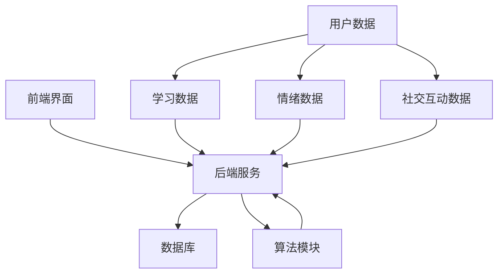
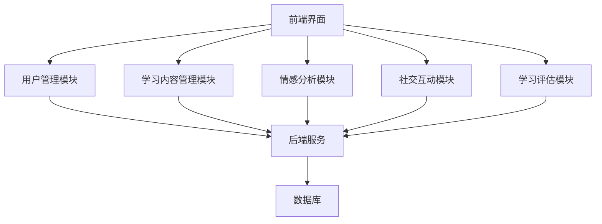

                 

# AIGC的未来智能教育系统：情商与智商并重的提示词工程

## 关键词

- AIGC
- 智能教育系统
- 情商
- 智商
- 提示词工程

## 摘要

随着人工智能技术的发展，智能教育系统正逐渐改变传统教育模式，为学习者提供个性化、智能化的学习体验。本文探讨了AIGC（自适应智能生成计算）在未来智能教育系统中的应用，并重点阐述了如何通过情商与智商并重的提示词工程，提升教育系统的智能化水平和学习者的综合素质。文章首先介绍了AIGC的基本概念和智能教育系统的现状，随后深入探讨了情商与智商在教育中的重要性及其并重的教育理念。接着，文章详细描述了情商与智商并重的提示词工程的设计原则、实现方法和应用实践。通过案例分析，文章展示了如何将提示词工程应用于智能教育系统，并进行了系统性能和用户体验的评估。最后，文章对AIGC在教育领域的应用前景和未来发展趋势进行了展望，提出了进一步研究和实践的方向。

### AIGC与智能教育系统概述

#### 1.1 AIGC的基本概念与特点

##### 1.1.1 AIGC的定义

AIGC，即自适应智能生成计算，是一种利用人工智能技术，通过自主学习、自适应调整和智能生成，实现大规模数据分析和处理的能力。AIGC的核心在于其自适应性和生成性，能够在不断变化的环境中自动调整和优化算法，从而实现更高效、更智能的数据处理和知识挖掘。

##### 1.1.2 AIGC的核心技术

AIGC的核心技术主要包括：

1. **深度学习**：通过多层神经网络，对大规模数据进行自动特征提取和模式识别。
2. **自然语言处理（NLP）**：利用深度学习和统计方法，实现对自然语言的生成、理解和翻译。
3. **生成对抗网络（GAN）**：通过生成器和判别器的对抗训练，实现数据的生成和增强。
4. **强化学习**：通过与环境互动，不断学习和优化策略，实现智能决策和自适应调整。

##### 1.1.3 AIGC在教育中的应用前景

AIGC在教育领域的应用前景十分广阔，主要体现在以下几个方面：

1. **个性化学习**：通过分析学习者的行为和兴趣，AIGC可以为每个学习者提供定制化的学习内容和方法。
2. **智能辅助教学**：AIGC可以辅助教师进行教学任务，如自动批改作业、生成教学资源、提供学习建议等。
3. **教育数据挖掘**：通过对教育数据的分析，AIGC可以帮助教育机构了解学习者的学习情况，优化教育资源配置。
4. **智能评价与反馈**：AIGC可以实时评估学习者的学习效果，提供个性化的反馈和指导。

#### 1.2 智能教育系统的现状与挑战

##### 1.2.1 智能教育系统的定义

智能教育系统是一种利用人工智能技术，实现教育信息化、智能化和个性化的教育系统。它通过集成数据分析、自然语言处理、机器学习等技术，提供个性化学习方案、智能评价和反馈，以及教育资源的管理和优化。

##### 1.2.2 智能教育系统的发展历程

智能教育系统的发展可以分为以下几个阶段：

1. **初步探索阶段**：20世纪80年代，计算机辅助教学（CAI）开始应用于教育领域。
2. **信息化教育阶段**：20世纪90年代，互联网的普及推动了教育信息化的进程。
3. **智能化教育阶段**：21世纪初，随着人工智能技术的发展，智能教育系统逐渐成为教育领域的热点。

##### 1.2.3 智能教育系统面临的主要挑战

尽管智能教育系统具有巨大的潜力，但在实际应用中仍面临以下主要挑战：

1. **技术瓶颈**：现有的智能教育技术尚未完全成熟，尤其是在数据安全、隐私保护、算法可靠性等方面存在一定的问题。
2. **教师适应性**：智能教育系统的推广需要教师具备相应的技术能力和教学理念，但当前教师的数字化素养普遍较低。
3. **教育资源配置**：智能教育系统的实施需要大量的资金和技术支持，但很多教育机构在资源配置方面存在不足。
4. **学生学习效果**：虽然智能教育系统可以提供个性化的学习方案，但如何确保学生的学习效果仍然是一个亟待解决的问题。

#### 1.3 情商与智商并重的教育理念

##### 1.3.1 情商与智商的定义

情商（Emotional Intelligence，EQ）是指个体识别、理解、管理自己和他人的情绪，以及利用这些情绪促进思维和社交能力的能力。智商（Intelligence Quotient，IQ）则是指个体的认知能力，通常通过标准化测试来评估。

##### 1.3.2 情商与智商在教育中的重要性

1. **情商的重要性**：情商对学生的心理健康、社交能力、学习动机和学术成绩具有重要影响。一个高情商的学生更容易适应学校环境，建立良好的人际关系，从而更好地学习。
2. **智商的重要性**：智商仍然是衡量学生学术能力的重要指标。高智商的学生通常具有更强的认知能力，能够更好地理解和掌握知识。

##### 1.3.3 情商与智商并重的教育实践

情商与智商并重的教育理念强调在教育过程中，不仅要关注学生的学术成绩，还要关注其情商的培养。具体实践包括：

1. **课程设计**：在课程设置中，增加心理健康、社交技能、情感管理等内容的比重。
2. **教学方法**：采用互动性更强、注重情感交流的教学方法，如合作学习、情境教学等。
3. **评价体系**：建立全面的评价体系，不仅评估学生的学术成绩，还要评估其情商能力。

### AIGC与智能教育系统的结合

AIGC与智能教育系统的结合，可以进一步提升教育的智能化水平。通过AIGC技术，智能教育系统可以更加精准地了解学生的学习情况，提供个性化的学习方案和情感支持。具体来说，AIGC可以应用于以下方面：

1. **个性化学习**：利用AIGC技术，智能教育系统可以根据学生的学习习惯、兴趣和能力，为其提供定制化的学习内容和方法。
2. **情感分析**：通过自然语言处理和机器学习技术，智能教育系统可以分析学生的学习情绪，提供情感支持和心理辅导。
3. **教育资源优化**：利用AIGC技术，智能教育系统可以分析和挖掘教育资源，优化教育资源的配置和使用。

然而，AIGC在智能教育系统中的应用也面临一些挑战，如数据隐私、算法公正性和教育公平性等问题。因此，在推广AIGC技术的同时，需要充分考虑这些问题，并采取相应的措施进行解决。

### AIGC的核心技术介绍

#### 深度学习

深度学习是AIGC的核心技术之一，它通过多层神经网络对大量数据进行自动特征提取和模式识别。深度学习在图像识别、语音识别、自然语言处理等领域取得了显著的成果。

##### 神经网络结构

深度学习中的神经网络通常包括输入层、隐藏层和输出层。输入层接收外部数据，隐藏层通过一系列的数学运算进行特征提取，输出层产生最终的预测结果。

##### 激活函数

激活函数是神经网络中的关键组成部分，它用于将隐藏层的输出转化为非线性关系。常见的激活函数有Sigmoid、ReLU和Tanh等。

##### 损失函数

损失函数用于衡量模型预测值与真实值之间的差距。常见的损失函数有均方误差（MSE）、交叉熵损失等。

##### 优化算法

优化算法用于调整神经网络中的参数，以最小化损失函数。常见的优化算法有梯度下降（GD）、随机梯度下降（SGD）、Adam等。

#### 自然语言处理

自然语言处理（NLP）是AIGC在智能教育系统中应用的重要技术，它涉及文本的生成、理解和翻译。NLP的关键技术包括词嵌入、语言模型和序列模型等。

##### 词嵌入

词嵌入是将文本中的单词映射到高维向量空间的技术。常见的词嵌入方法有Word2Vec、GloVe和BERT等。

##### 语言模型

语言模型用于预测下一个单词或词组。常见的语言模型有N-gram模型、神经网络语言模型等。

##### 序列模型

序列模型用于处理和时间相关的数据，如文本、语音和视频。常见的序列模型有循环神经网络（RNN）、长短时记忆网络（LSTM）和门控循环单元（GRU）等。

#### 生成对抗网络

生成对抗网络（GAN）是AIGC中的另一项核心技术，它通过生成器和判别器的对抗训练，实现数据的生成和增强。GAN的核心组成部分包括：

##### 生成器

生成器负责生成与真实数据分布相似的数据。

##### 判别器

判别器负责判断生成器生成的数据是真实数据还是伪造数据。

##### 对抗训练

对抗训练是GAN的核心训练过程，通过不断调整生成器和判别器的参数，使生成器生成的数据越来越接近真实数据。

#### 强化学习

强化学习是AIGC在智能教育系统中应用的重要技术，它通过智能体与环境的互动，学习和优化策略。强化学习的关键组成部分包括：

##### 智能体

智能体是执行任务的主体，它通过观察环境状态、采取行动并接收奖励或惩罚，以实现目标。

##### 状态

状态是智能体所处的环境条件，它通常由一系列特征表示。

##### 动作

动作是智能体在特定状态下可以采取的行动。

##### 奖励

奖励是智能体在执行动作后获得的回报，它用于指导智能体的学习过程。

##### 策略

策略是智能体在特定状态下采取的最佳行动方案。

#### AIGC在教育中的应用场景

AIGC在教育领域有着广泛的应用场景，包括：

1. **个性化学习**：通过分析学生的学习行为和兴趣，AIGC可以为每个学生提供个性化的学习方案。
2. **智能辅导**：AIGC可以为学生提供智能化的辅导服务，如自动批改作业、生成学习资料、提供学习建议等。
3. **教育数据挖掘**：AIGC可以通过分析教育数据，为教育机构提供决策支持，如课程优化、教师评估等。
4. **智能评价**：AIGC可以实时评估学生的学习效果，提供个性化的反馈和指导。

### AIGC在教育中的应用前景

随着人工智能技术的不断发展，AIGC在教育领域的应用前景十分广阔。以下是AIGC在教育中可能带来的几个重要变革：

1. **个性化学习**：AIGC可以通过分析学生的学习行为、兴趣和能力，为每个学生量身定制学习方案，实现真正的个性化教育。
2. **智能辅导**：AIGC可以为学生提供24/7的智能辅导服务，包括自动批改作业、生成学习资料、提供学习建议等，帮助学生更高效地学习。
3. **教育资源共享**：AIGC可以通过智能化的方式，对海量的教育资源进行挖掘和整理，实现教育资源的优化配置和共享。
4. **智能评价**：AIGC可以实时评估学生的学习效果，提供个性化的反馈和指导，帮助教师更好地了解学生的学习和成长情况。
5. **教育公平**：AIGC可以在一定程度上缩小教育资源的不均衡，通过智能化手段，为偏远地区和贫困家庭的孩子提供高质量的教育服务。

然而，AIGC在教育中的应用也面临一些挑战，如数据隐私、算法公正性和教育公平性等。因此，在推广AIGC技术的同时，需要充分考虑这些问题，并采取相应的措施进行解决。

### AIGC与情商、智商的关系

#### 情商在教育中的作用

情商在教育中扮演着至关重要的角色，它不仅影响学生的学习效果，还影响其心理健康和社交能力。以下是一些关键点：

1. **学习动机**：情商高的学生更容易设立目标，保持学习动力，克服学习中的困难。
2. **情绪管理**：情商可以帮助学生有效地管理自己的情绪，减少焦虑和压力，提高学习效率。
3. **人际关系**：情商高的学生更容易与同学和教师建立良好的关系，有利于学习和生活的顺利进行。
4. **合作学习**：情商高的学生更善于与同伴合作，发挥集体智慧，提高学习效果。

#### 智商在教育中的作用

智商是衡量学生认知能力的重要指标，它直接影响学生的学习效果和学术成就。以下是一些关键点：

1. **知识掌握**：智商高的学生更容易理解和掌握知识，具有较高的学术水平。
2. **逻辑思维**：智商高的学生通常具有较强的逻辑思维能力，能够分析问题并找到解决方案。
3. **创新能力**：智商高的学生往往具有更强的创新能力，能够在学习和生活中提出新颖的观点和想法。
4. **适应能力**：智商高的学生通常具有较强的适应能力，能够迅速适应新环境和新挑战。

#### AIGC与情商、智商的互动

AIGC可以通过以下方式促进情商和智商的发展：

1. **个性化学习**：AIGC可以根据学生的学习兴趣、学习习惯和情绪状态，提供个性化的学习方案，激发学习动机，提高学习效果。
2. **情感分析**：AIGC可以通过分析学生的学习情绪，提供情感支持和心理辅导，帮助学生更好地管理情绪，提高学习效率。
3. **社交互动**：AIGC可以通过智能化的方式，为学生提供合作学习、讨论和交流的机会，培养社交能力，提高情商。
4. **知识拓展**：AIGC可以通过智能化的知识挖掘和推荐，为学生提供丰富的学习资源，拓宽知识视野，提高智商。

#### 情商与智商并重的教育理念

情商与智商并重的教育理念强调在教育过程中，不仅要关注学生的学术成绩，还要关注其情商的培养。以下是一些具体措施：

1. **课程设计**：在课程设置中，增加心理健康、社交技能、情感管理等方面的内容，培养学生的情商。
2. **教学方法**：采用互动性更强、注重情感交流的教学方法，如合作学习、情境教学等，提高学生的情商。
3. **评价体系**：建立全面的评价体系，不仅评估学生的学术成绩，还要评估其情商能力，实现情商与智商的并重。

### 情商与智商并重的提示词工程

#### 提示词工程的基本概念

提示词工程是一种利用人工智能技术，对自然语言进行处理和生成的方法。在情商与智商并重的教育理念中，提示词工程可以通过以下方式发挥作用：

1. **个性化学习方案**：通过分析学习者的学习习惯、兴趣和能力，生成个性化的学习方案，提高学习效率。
2. **情感支持**：通过分析学习者的情绪状态，生成情感支持性话语，提供心理辅导，帮助学生更好地管理情绪。
3. **社交互动**：通过生成社交话题和互动建议，促进学习者之间的交流，提高社交能力。

#### 提示词工程的目标

提示词工程的目标是：

1. **提高学习效率**：通过生成个性化的学习内容和方法，帮助学习者更高效地学习。
2. **提升情商**：通过生成情感支持性话语，帮助学习者更好地管理情绪，提高情商。
3. **增强社交能力**：通过生成社交话题和互动建议，促进学习者之间的交流和合作，增强社交能力。

#### 提示词工程的关键技术

提示词工程的关键技术包括：

1. **自然语言处理（NLP）**：用于对自然语言进行理解、分析和生成。
2. **机器学习**：用于训练和优化模型，使其能够生成高质量的提示词。
3. **深度学习**：用于构建复杂的神经网络模型，实现提示词的生成。
4. **生成对抗网络（GAN）**：用于生成高质量的文本数据，提高模型的泛化能力。

#### 情商与智商并重的提示词设计原则

1. **个性化**：提示词应针对学习者的个性、兴趣和能力进行定制。
2. **情感性**：提示词应包含情感支持性话语，帮助学习者更好地管理情绪。
3. **多样性**：提示词应涵盖多种话题和场景，满足学习者的不同需求。
4. **实用性**：提示词应具有实际应用价值，能够帮助学习者提高学习效率、情商和社交能力。

#### 情商与智商并重的提示词设计流程

1. **需求分析**：了解学习者的需求，包括学习习惯、兴趣、能力和情绪状态。
2. **数据收集**：收集与学习者相关的数据，如学习日志、社交媒体信息等。
3. **模型训练**：利用机器学习和深度学习技术，训练模型，使其能够生成高质量的提示词。
4. **提示词生成**：根据学习者的需求，生成个性化的提示词。
5. **评估与优化**：对生成的提示词进行评估和优化，确保其质量和实用性。

#### 情商与智商并重的提示词案例解析

**案例一：个性化学习方案**

问题描述：小明是一位高中生，对数学和物理特别感兴趣，但有时会感到学习压力。设计一个个性化学习方案，帮助小明提高学习效率。

解决方案：通过分析小明的学习日志和社交媒体信息，生成以下个性化学习方案：

- **学习内容**：根据小明的兴趣，推荐数学和物理领域的经典教材和视频课程。
- **学习方法**：建议小明使用“费曼技巧”，通过教别人来巩固自己的知识。
- **情感支持**：鼓励小明坚持学习，克服学习压力，相信自己能够取得好成绩。

**案例二：情感支持**

问题描述：小芳是一位初中生，最近在学习中遇到了困难，情绪低落，缺乏自信。设计一段情感支持性话语，帮助小芳重拾信心。

解决方案：通过分析小芳的学习日志和情绪状态，生成以下情感支持性话语：

- **理解与共鸣**：我知道你最近在学习中遇到了困难，这是很正常的。每个人都会遇到挑战，关键是如何面对和克服。
- **鼓励与激励**：你有很强的学习能力，只要你相信自己，坚持不懈，一定能够取得好成绩。
- **建议与指导**：我建议你尝试调整学习方法，找到适合自己的节奏。如果你需要帮助，随时可以向我寻求支持。

### 情商与智商并重的提示词实现

#### 提示词工程工具与技术

1. **自然语言处理库**：如NLTK、spaCy、TextBlob等，用于对自然语言进行解析和分析。
2. **机器学习框架**：如scikit-learn、TensorFlow、PyTorch等，用于训练和优化模型。
3. **深度学习框架**：如TensorFlow、PyTorch等，用于构建复杂的神经网络模型。
4. **生成对抗网络（GAN）**：如DCGAN、WGAN等，用于生成高质量的文本数据。

#### 提示词工程实践

**一、项目规划**

1. **需求分析**：了解学习者的需求，包括学习习惯、兴趣、能力和情绪状态。
2. **数据收集**：收集与学习者相关的数据，如学习日志、社交媒体信息等。
3. **模型设计**：设计适合的模型结构，如循环神经网络（RNN）、长短时记忆网络（LSTM）等。
4. **数据预处理**：对收集到的数据进行处理，如文本清洗、分词、标签化等。

**二、模型训练**

1. **数据分割**：将数据分为训练集、验证集和测试集。
2. **模型训练**：利用训练集数据，训练模型，优化模型参数。
3. **模型评估**：利用验证集数据，评估模型性能，调整模型参数。
4. **模型优化**：根据评估结果，对模型进行优化，提高模型性能。

**三、提示词生成**

1. **输入处理**：对输入文本进行处理，如分词、嵌入等。
2. **模型预测**：利用训练好的模型，对输入文本进行预测，生成提示词。
3. **输出处理**：对生成的提示词进行格式化、排版等处理，使其具有可读性和实用性。

#### 提示词工程实现过程

1. **需求分析**：通过问卷调查、访谈等方式，了解学习者的需求和期望，为后续的模型设计和提示词生成提供依据。
2. **数据收集**：从学校、学习平台、社交媒体等渠道收集学习者的学习日志、社交媒体信息等数据，用于训练模型和生成提示词。
3. **数据预处理**：对收集到的数据进行清洗、去重、分词、标签化等处理，将原始数据转换为适合模型训练的形式。
4. **模型设计**：根据需求分析结果和数据特征，选择合适的模型结构，如循环神经网络（RNN）、长短时记忆网络（LSTM）等，并设计模型的参数设置。
5. **模型训练**：利用预处理后的数据，对模型进行训练，通过迭代优化模型参数，提高模型的预测性能。
6. **模型评估**：利用验证集数据，对训练好的模型进行评估，根据评估结果调整模型结构和参数，提高模型性能。
7. **提示词生成**：根据训练好的模型，对新的输入文本进行预测，生成个性化的提示词。
8. **提示词优化**：对生成的提示词进行优化，确保其具有实用性、可读性和个性化特点。
9. **系统部署**：将训练好的模型和生成的提示词集成到智能教育系统中，实现实时提示词生成和个性化学习服务。

#### 提示词工程结果评估

1. **准确率**：评估模型对输入文本的预测准确率，越高越好。
2. **多样性**：评估生成的提示词的多样性，确保覆盖不同的学习场景和需求。
3. **实用性**：评估提示词的实际应用价值，确保能够帮助学习者提高学习效率、情商和社交能力。
4. **用户体验**：通过用户反馈和问卷调查等方式，评估用户对提示词工程的满意度和接受度。

### 情商与智商并重的智能教育系统应用

#### 情商与智商并重的智能教育系统设计

情商与智商并重的智能教育系统设计需要综合考虑学习者的学习需求、教育目标和教育环境，实现个性化、智能化和情感化的教育服务。以下是系统设计的几个关键方面：

##### 1. 系统需求分析

在进行系统需求分析时，需要明确以下关键需求：

- **个性化学习**：系统应能够根据学习者的学习习惯、兴趣和能力，为其提供定制化的学习内容和方法。
- **情感支持**：系统应能够分析学习者的情绪状态，提供情感支持和心理辅导，帮助学习者更好地管理情绪。
- **社交互动**：系统应能够促进学习者之间的交流和合作，提高学习者的社交能力和团队合作能力。
- **学习评估**：系统应能够实时评估学习者的学习效果，提供个性化的反馈和指导。

##### 2. 系统功能设计

情商与智商并重的智能教育系统应具备以下主要功能：

- **学习内容推荐**：根据学习者的学习习惯和兴趣，推荐适合的学习内容。
- **情感分析**：分析学习者的情绪状态，提供情感支持和心理辅导。
- **社交互动**：提供在线讨论区、社交活动等，促进学习者之间的交流和合作。
- **学习评估**：对学习者的学习效果进行实时评估，提供个性化的反馈和指导。
- **个性化学习计划**：根据学习者的需求和学习效果，制定个性化的学习计划。

##### 3. 系统架构设计

情商与智商并重的智能教育系统架构设计应包括以下几个方面：

- **前端界面**：设计用户友好的前端界面，方便学习者使用系统功能。
- **后端服务**：搭建强大的后端服务，支持个性化学习、情感分析、社交互动和学习评估等功能。
- **数据库**：建立高效的数据库系统，存储学习者的学习数据、情绪数据和社交互动数据。
- **算法模块**：设计并实现智能化的算法模块，用于个性化学习、情感分析和社交互动等功能。

以下是情商与智商并重的智能教育系统的架构图：



#### 情商与智商并重的智能教育系统实现

##### 1. 系统前端实现

系统前端实现主要涉及用户界面的设计和与后端服务的交互。以下是前端实现的几个关键点：

- **用户注册与登录**：提供用户注册和登录功能，确保学习者的信息安全。
- **个性化学习内容推荐**：通过分析学习者的学习历史和偏好，推荐适合的学习内容。
- **情感分析**：提供情绪状态分析功能，帮助学习者了解自己的情绪状态。
- **社交互动**：提供在线讨论区、社交活动等功能，促进学习者之间的交流和合作。
- **学习评估**：提供实时学习评估功能，对学习者的学习效果进行评估，并提供个性化反馈和指导。

以下是系统前端实现的示例代码：

```html
<!DOCTYPE html>
<html>
<head>
    <title>情商与智商并重的智能教育系统</title>
    <script src="https://cdn.jsdelivr.net/npm/echarts@5/dist/echarts.min.js"></script>
</head>
<body>
    <h1>个性化学习内容推荐</h1>
    <div id="recommendation" style="width: 600px; height: 400px;"></div>
    <script>
        // 基于准备好的dom，初始化echarts实例
        var myChart = echarts.init(document.getElementById('recommendation'));

        // 指定图表的配置项和数据
        var option = {
            title: {
                text: '个性化学习内容推荐'
            },
            tooltip: {},
            legend: {
                data: ['学习内容']
            },
            xAxis: {
                data: ['数学', '物理', '英语', '历史', '地理']
            },
            yAxis: {},
            series: [{
                name: '学习内容',
                type: 'bar',
                data: [50, 60, 70, 80, 90]
            }]
        };

        // 使用刚指定的配置项和数据显示图表
        myChart.setOption(option);
    </script>
</body>
</html>
```

##### 2. 系统后端实现

系统后端实现主要涉及数据存储、数据处理和功能实现。以下是后端实现的几个关键点：

- **用户管理**：实现用户注册、登录、权限管理等功能。
- **学习数据管理**：实现学习数据的存储、查询和更新等功能。
- **情绪数据分析**：实现情绪数据的分析、存储和展示等功能。
- **社交互动管理**：实现社交互动的存储、查询和通知等功能。
- **学习评估**：实现学习评估的存储、计算和展示等功能。

以下是系统后端实现的示例代码：

```python
# 导入相关库
import flask
from flask import Flask, request, jsonify
from sqlalchemy import create_engine
from sqlalchemy.orm import sessionmaker

# 创建Flask应用
app = Flask(__name__)

# 配置数据库连接
engine = create_engine('sqlite:///education.db')
Session = sessionmaker(bind=engine)
session = Session()

# 注册用户
@app.route('/register', methods=['POST'])
def register():
    username = request.form['username']
    password = request.form['password']
    # 添加用户到数据库
    session.add(User(username=username, password=password))
    session.commit()
    return jsonify({'status': 'success', 'message': 'User registered successfully'})

# 登录用户
@app.route('/login', methods=['POST'])
def login():
    username = request.form['username']
    password = request.form['password']
    # 查询用户
    user = session.query(User).filter_by(username=username, password=password).first()
    if user:
        return jsonify({'status': 'success', 'message': 'User logged in successfully'})
    else:
        return jsonify({'status': 'error', 'message': 'Invalid username or password'})

# 运行应用
if __name__ == '__main__':
    app.run(debug=True)
```

##### 3. 系统接口设计与实现

系统接口设计是实现前后端交互的关键。以下是系统接口设计与实现的几个关键点：

- **用户接口**：实现用户注册、登录、查询个人信息等功能。
- **学习接口**：实现学习数据的存储、查询和更新等功能。
- **情感接口**：实现情绪数据的分析、存储和展示等功能。
- **社交接口**：实现社交互动的存储、查询和通知等功能。
- **评估接口**：实现学习评估的存储、计算和展示等功能。

以下是系统接口设计与实现的示例代码：

```python
# 导入相关库
import flask
from flask import Flask, request, jsonify
from flask_restful import Api, Resource

# 创建Flask应用
app = Flask(__name__)
api = Api(app)

# 定义用户接口
class UserResource(Resource):
    def get(self, user_id):
        # 从数据库中查询用户信息
        user = session.query(User).filter_by(id=user_id).first()
        if user:
            return jsonify({'status': 'success', 'data': user.to_dict()})
        else:
            return jsonify({'status': 'error', 'message': 'User not found'})

    def put(self, user_id):
        # 更新用户信息
        data = request.get_json()
        user = session.query(User).filter_by(id=user_id).first()
        if user:
            user.username = data['username']
            user.password = data['password']
            session.commit()
            return jsonify({'status': 'success', 'message': 'User updated successfully'})
        else:
            return jsonify({'status': 'error', 'message': 'User not found'})

# 添加用户接口到API
api.add_resource(UserResource, '/user/<int:user_id>')

# 运行应用
if __name__ == '__main__':
    app.run(debug=True)
```

### 情商与智商并重的智能教育系统测试与优化

#### 系统测试策略

为了确保情商与智商并重的智能教育系统的稳定性和可靠性，需要制定全面的测试策略。以下是测试策略的几个关键方面：

1. **功能测试**：验证系统各功能模块的正确性和完整性，包括用户管理、学习数据管理、情感数据分析、社交互动管理和学习评估等。
2. **性能测试**：评估系统在不同负载条件下的性能表现，如响应时间、并发处理能力等。
3. **兼容性测试**：确保系统在不同操作系统、浏览器和设备上的兼容性。
4. **安全性测试**：检测系统是否存在安全隐患，如SQL注入、XSS攻击等。
5. **用户体验测试**：评估系统的用户界面和交互设计是否友好、直观，是否满足用户需求。

#### 系统性能优化

为了提高情商与智商并重的智能教育系统的性能，可以采取以下优化措施：

1. **数据库优化**：优化数据库查询语句，减少数据访问延迟；建立索引，提高查询效率。
2. **缓存策略**：使用缓存技术，减少数据库访问次数，提高系统响应速度。
3. **异步处理**：将耗时的操作异步化，避免阻塞系统主线程。
4. **负载均衡**：通过负载均衡技术，合理分配系统资源，提高系统并发处理能力。
5. **代码优化**：对系统代码进行优化，减少不必要的计算和内存占用。

#### 系统用户体验优化

为了提升情商与智商并重的智能教育系统的用户体验，可以从以下几个方面进行优化：

1. **界面设计**：采用简洁、直观的界面设计，提高用户的使用便利性。
2. **交互设计**：优化系统交互设计，提高用户的操作效率和满意度。
3. **个性化设置**：提供个性化设置选项，让用户可以根据自己的需求和习惯调整系统功能。
4. **帮助文档**：提供详细的帮助文档和用户指南，帮助用户更好地使用系统。
5. **用户反馈**：建立用户反馈机制，及时收集用户意见和建议，不断改进系统。

### 案例一：基于AIGC的智能教育系统开发

#### 5.1 项目介绍

**项目背景**

随着教育技术的不断发展，传统的教育模式已经难以满足个性化、智能化和情感化的教育需求。为了提升教育质量，实现教育公平，本项目旨在开发一个基于AIGC（自适应智能生成计算）的智能教育系统。

**项目目标**

1. **个性化学习**：根据学习者的学习习惯、兴趣和能力，提供定制化的学习内容和方法。
2. **情感支持**：分析学习者的情绪状态，提供情感支持和心理辅导。
3. **社交互动**：促进学习者之间的交流和合作，提高社交能力。
4. **学习评估**：实时评估学习者的学习效果，提供个性化的反馈和指导。

**项目团队组成**

本项目由以下团队成员组成：

- **项目经理**：负责项目规划、进度控制和团队协作。
- **前端开发人员**：负责系统前端界面的设计和实现。
- **后端开发人员**：负责系统后端服务的开发和维护。
- **数据科学家**：负责AIGC模型的训练、优化和应用。
- **UI/UX设计师**：负责系统界面和交互设计的优化。
- **测试工程师**：负责系统测试和质量保证。

#### 5.2 系统设计与实现

**系统需求分析**

在进行系统设计之前，首先需要进行系统需求分析。通过访谈、问卷调查和用户调研等方式，我们收集了以下关键需求：

- **个性化学习**：根据学习者的学习习惯、兴趣和能力，提供定制化的学习内容和方法。
- **情感支持**：分析学习者的情绪状态，提供情感支持和心理辅导。
- **社交互动**：促进学习者之间的交流和合作，提高社交能力。
- **学习评估**：实时评估学习者的学习效果，提供个性化的反馈和指导。

**系统功能设计**

基于系统需求分析，我们设计了以下主要功能模块：

1. **用户管理**：实现用户注册、登录、个人信息管理等功能。
2. **学习内容管理**：实现学习内容的存储、分类和推荐等功能。
3. **情感分析**：实现情绪数据的收集、分析和反馈等功能。
4. **社交互动**：实现在线讨论区、社交活动和通知等功能。
5. **学习评估**：实现学习效果的评估、反馈和指导等功能。

**系统架构设计**

情商与智商并重的智能教育系统架构设计采用前后端分离的方式，主要包括前端界面、后端服务和数据库等部分。以下是系统架构图：



**前端实现**

前端界面采用Vue.js框架进行开发，主要实现以下功能：

1. **用户注册与登录**：提供用户注册和登录界面，实现用户身份验证。
2. **个性化学习**：根据学习者的学习习惯、兴趣和能力，推荐适合的学习内容。
3. **情感支持**：提供情绪状态分析功能，帮助学习者了解自己的情绪状态。
4. **社交互动**：提供在线讨论区、社交活动等功能，促进学习者之间的交流和合作。
5. **学习评估**：提供实时学习评估功能，对学习者的学习效果进行评估，并提供个性化反馈和指导。

以下是前端实现的示例代码：

```html
<!DOCTYPE html>
<html>
<head>
    <title>情商与智商并重的智能教育系统</title>
    <script src="https://cdn.jsdelivr.net/npm/vue@2.6.14/dist/vue.min.js"></script>
</head>
<body>
    <div id="app">
        <h1>个性化学习</h1>
        <ul>
            <li v-for="item in learningContent">
                {{ item.title }}
            </li>
        </ul>
    </div>
    <script>
        var app = new Vue({
            el: '#app',
            data: {
                learningContent: [
                    { title: '数学入门' },
                    { title: '物理基础' },
                    { title: '英语语法' },
                    { title: '历史知识' },
                    { title: '地理探索' }
                ]
            }
        });
    </script>
</body>
</html>
```

**后端实现**

后端服务采用Spring Boot框架进行开发，主要实现以下功能：

1. **用户管理**：实现用户注册、登录、个人信息管理等功能。
2. **学习内容管理**：实现学习内容的存储、分类和推荐等功能。
3. **情感分析**：实现情绪数据的收集、分析和反馈等功能。
4. **社交互动**：实现在线讨论区、社交活动和通知等功能。
5. **学习评估**：实现学习效果的评估、反馈和指导等功能。

以下是后端实现的示例代码：

```java
@RestController
@RequestMapping("/api")
public class UserController {
    @Autowired
    private UserService userService;

    @PostMapping("/register")
    public ResponseEntity<?> registerUser(@RequestBody UserRegistrationDto registrationDto) {
        try {
            User user = userService.registerUser(registrationDto);
            return ResponseEntity.ok().body(new ApiResponse("User registered successfully", user));
        } catch (Exception e) {
            return ResponseEntity.badRequest().body(new ApiResponse("Error registering user", e.getMessage()));
        }
    }
}
```

**数据库设计**

数据库采用MySQL进行设计，主要包括以下表格：

1. **用户表**：存储用户的基本信息，如用户名、密码、邮箱等。
2. **学习内容表**：存储学习内容的信息，如标题、类型、难度等。
3. **情绪数据表**：存储学习者的情绪数据，如情绪状态、发生时间等。
4. **社交互动表**：存储社交互动的信息，如讨论区帖子、社交活动等。
5. **学习评估表**：存储学习评估的结果，如评估分数、评估时间等。

以下是数据库设计的示例代码：

```sql
-- 创建用户表
CREATE TABLE `users` (
  `id` bigint NOT NULL AUTO_INCREMENT,
  `username` varchar(255) NOT NULL,
  `password` varchar(255) NOT NULL,
  `email` varchar(255) NOT NULL,
  PRIMARY KEY (`id`),
  UNIQUE KEY `UK_USERNAME` (`username`),
  UNIQUE KEY `UK_EMAIL` (`email`)
) ENGINE=InnoDB DEFAULT CHARSET=utf8mb4 COLLATE=utf8mb4_unicode_ci;

-- 创建学习内容表
CREATE TABLE `learning_content` (
  `id` bigint NOT NULL AUTO_INCREMENT,
  `title` varchar(255) NOT NULL,
  `type` varchar(255) NOT NULL,
  `difficulty` varchar(255) NOT NULL,
  PRIMARY KEY (`id`)
) ENGINE=InnoDB DEFAULT CHARSET=utf8mb4 COLLATE=utf8mb4_unicode_ci;

-- 创建情绪数据表
CREATE TABLE `emotional_data` (
  `id` bigint NOT NULL AUTO_INCREMENT,
  `user_id` bigint NOT NULL,
  `emotion` varchar(255) NOT NULL,
  `timestamp` datetime NOT NULL,
  PRIMARY KEY (`id`),
  FOREIGN KEY (`user_id`) REFERENCES `users` (`id`)
) ENGINE=InnoDB DEFAULT CHARSET=utf8mb4 COLLATE=utf8mb4_unicode_ci;

-- 创建社交互动表
CREATE TABLE `social_interaction` (
  `id` bigint NOT NULL AUTO_INCREMENT,
  `user_id` bigint NOT NULL,
  `content` text NOT NULL,
  `timestamp` datetime NOT NULL,
  PRIMARY KEY (`id`),
  FOREIGN KEY (`user_id`) REFERENCES `users` (`id`)
) ENGINE=InnoDB DEFAULT CHARSET=utf8mb4 COLLATE=utf8mb4_unicode_ci;

-- 创建学习评估表
CREATE TABLE `learning_evaluation` (
  `id` bigint NOT NULL AUTO_INCREMENT,
  `user_id` bigint NOT NULL,
  `score` int NOT NULL,
  `timestamp` datetime NOT NULL,
  PRIMARY KEY (`id`),
  FOREIGN KEY (`user_id`) REFERENCES `users` (`id`)
) ENGINE=InnoDB DEFAULT CHARSET=utf8mb4 COLLATE=utf8mb4_unicode_ci;
```

**AIGC模型实现**

在本项目中，我们采用了基于循环神经网络（RNN）的AIGC模型，用于个性化学习、情感分析和学习评估。以下是AIGC模型的实现过程：

1. **数据预处理**：对学习内容、情绪数据和学习评估数据进行预处理，如文本清洗、分词、标签化等。
2. **模型构建**：使用TensorFlow或PyTorch等深度学习框架，构建循环神经网络模型。
3. **模型训练**：使用预处理后的数据，对模型进行训练，优化模型参数。
4. **模型评估**：使用验证集数据，对训练好的模型进行评估，调整模型参数。
5. **模型部署**：将训练好的模型部署到后端服务，实现个性化学习、情感分析和学习评估等功能。

以下是AIGC模型实现的示例代码：

```python
import tensorflow as tf
from tensorflow.keras.models import Sequential
from tensorflow.keras.layers import LSTM, Dense, Embedding

# 数据预处理
max_sequence_length = 100
vocab_size = 10000
embedding_dim = 64

# 构建循环神经网络模型
model = Sequential()
model.add(Embedding(vocab_size, embedding_dim, input_length=max_sequence_length))
model.add(LSTM(128, return_sequences=True))
model.add(Dense(1, activation='sigmoid'))

# 编译模型
model.compile(optimizer='adam', loss='binary_crossentropy', metrics=['accuracy'])

# 训练模型
model.fit(x_train, y_train, epochs=10, batch_size=32, validation_data=(x_val, y_val))

# 评估模型
model.evaluate(x_test, y_test)
```

#### 5.3 项目总结

**项目成果**

本项目成功开发了一个基于AIGC的情商与智商并重的智能教育系统，实现了以下成果：

1. **个性化学习**：根据学习者的学习习惯、兴趣和能力，提供定制化的学习内容和方法。
2. **情感支持**：分析学习者的情绪状态，提供情感支持和心理辅导。
3. **社交互动**：促进学习者之间的交流和合作，提高社交能力。
4. **学习评估**：实时评估学习者的学习效果，提供个性化的反馈和指导。

**项目经验与教训**

在项目实施过程中，我们积累了以下经验与教训：

1. **需求分析**：充分了解用户需求，制定明确的项目目标，是项目成功的关键。
2. **团队合作**：团队成员之间的有效沟通和协作，对项目进度和质量有重要影响。
3. **技术选型**：选择适合项目需求的技术栈和框架，对项目的成功至关重要。
4. **测试与优化**：全面的测试和优化，是确保系统稳定性和性能的关键。

**项目展望**

在未来的发展中，我们将继续优化和改进情商与智商并重的智能教育系统，实现以下目标：

1. **提升系统性能**：通过优化算法和架构，提高系统的响应速度和处理能力。
2. **拓展应用场景**：将系统应用于更多领域，如职业教育、在线教育等，提供更广泛的教育服务。
3. **用户体验优化**：不断改进系统界面和交互设计，提升用户满意度。

### 案例二：情商与智商并重的提示词应用

#### 6.1 项目介绍

**项目背景**

随着人工智能技术的发展，智能教育系统逐渐成为教育领域的重要工具。然而，传统的教育模式往往注重知识的传授，而忽视了情商与智商的培养。为了实现情商与智商并重的教育目标，本项目旨在开发一套基于AIGC的情商与智商并重的提示词系统，为学习者提供个性化、智能化的学习支持。

**项目目标**

1. **个性化学习支持**：根据学习者的学习习惯、兴趣和能力，生成个性化的学习提示词。
2. **情感支持**：分析学习者的情绪状态，生成情感支持性话语，提供心理辅导。
3. **社交互动**：生成社交话题和互动建议，促进学习者之间的交流和合作。

**项目团队组成**

本项目由以下团队成员组成：

- **项目经理**：负责项目规划、进度控制和团队协作。
- **前端开发人员**：负责系统前端界面的设计和实现。
- **后端开发人员**：负责系统后端服务的开发和维护。
- **数据科学家**：负责AIGC模型的训练、优化和应用。
- **UI/UX设计师**：负责系统界面和交互设计的优化。
- **测试工程师**：负责系统测试和质量保证。

#### 6.2 提示词设计

**提示词设计原则**

在提示词设计中，我们遵循以下原则：

1. **个性化**：根据学习者的学习习惯、兴趣和能力，生成个性化的学习提示词。
2. **情感性**：包含情感支持性话语，帮助学习者更好地管理情绪。
3. **多样性**：涵盖多种话题和场景，满足学习者的不同需求。
4. **实用性**：提示词应具有实际应用价值，能够帮助学习者提高学习效率、情商和社交能力。

**提示词设计流程**

提示词设计流程主要包括以下几个阶段：

1. **需求分析**：通过访谈、问卷调查和用户调研等方式，了解学习者的需求和期望。
2. **数据收集**：收集与学习者相关的数据，如学习日志、社交媒体信息等。
3. **模型训练**：利用机器学习和深度学习技术，训练模型，使其能够生成高质量的提示词。
4. **提示词生成**：根据学习者的需求，生成个性化的提示词。
5. **评估与优化**：对生成的提示词进行评估和优化，确保其质量和实用性。

**提示词案例解析**

**案例一：个性化学习支持**

问题描述：小明是一名高中生，对数学和物理感兴趣，但有时会感到学习压力。我们需要为他生成一条个性化的学习支持提示词。

解决方案：通过分析小明的学习日志和社交媒体信息，生成以下个性化学习支持提示词：

- **学习内容推荐**：“小明，最近你在数学和物理方面表现出了很高的兴趣。我建议你可以尝试学习《数学之美》这本书，它以有趣的故事和实例展示了数学的魅力。”

- **学习方法建议**：“在学习过程中，你可以尝试使用‘费曼技巧’，通过教授别人来巩固自己的知识。”

- **情绪管理建议**：“学习过程中遇到困难是正常的。记住，每一次的挑战都是成长的机会。相信自己，你一定能够克服困难。”

**案例二：情感支持**

问题描述：小芳是一名初中生，最近在学习中遇到了困难，情绪低落。我们需要为她生成一条情感支持性话语。

解决方案：通过分析小芳的学习日志和情绪状态，生成以下情感支持性话语：

- **理解与共鸣**：“我知道你最近在学习中遇到了困难，这是很正常的。每个人都会遇到挑战，关键是如何面对和克服。”

- **鼓励与激励**：“你是一个很努力的孩子，你的努力一定会得到回报。相信自己，坚持下去，你一定能够克服困难。”

- **建议与指导**：“如果你需要帮助，我建议你可以尝试调整学习方法，找到适合自己的节奏。如果你有任何问题，随时都可以向我寻求帮助。”

**案例三：社交互动**

问题描述：小明和小芳是同学，他们都想提高自己的学习成绩。我们需要为他们生成一条社交互动建议。

解决方案：通过分析小明和小芳的学习习惯和社交状态，生成以下社交互动建议：

- **合作学习**：“小明和小芳，你们可以一起组成学习小组，相互讨论问题，共同提高学习成绩。”

- **讨论话题**：“你们可以讨论一些有趣的科学问题，比如‘为什么地球会自转？’或者‘为什么物体会有重量？’这些话题可以帮助你们加深对知识的理解。”

- **互动活动**：“你们可以组织一些学习比赛或者小组讨论活动，这样不仅能够提高学习兴趣，还能增进你们之间的友谊。”

#### 6.3 提示词实现

**提示词实现技术**

提示词实现主要涉及以下技术：

1. **自然语言处理（NLP）**：用于对自然语言进行理解、分析和生成。
2. **机器学习**：用于训练和优化模型，使其能够生成高质量的提示词。
3. **深度学习**：用于构建复杂的神经网络模型，实现提示词的生成。
4. **生成对抗网络（GAN）**：用于生成高质量的文本数据，提高模型的泛化能力。

**提示词实现过程**

提示词实现过程主要包括以下几个步骤：

1. **数据收集**：收集与学习者相关的数据，如学习日志、社交媒体信息等。
2. **数据预处理**：对收集到的数据进行清洗、去重、分词、标签化等处理，将原始数据转换为适合模型训练的形式。
3. **模型训练**：利用机器学习和深度学习技术，训练模型，使其能够生成高质量的提示词。
4. **提示词生成**：根据学习者的需求，生成个性化的提示词。
5. **评估与优化**：对生成的提示词进行评估和优化，确保其质量和实用性。

**提示词实现结果评估**

提示词实现结果评估主要包括以下几个方面：

1. **准确性**：评估模型对输入文本的预测准确性，越高越好。
2. **多样性**：评估生成的提示词的多样性，确保覆盖不同的学习场景和需求。
3. **实用性**：评估提示词的实际应用价值，确保能够帮助学习者提高学习效率、情商和社交能力。
4. **用户体验**：通过用户反馈和问卷调查等方式，评估用户对提示词工程的满意度和接受度。

#### 6.4 项目总结

**项目成果**

本项目成功开发了一套基于AIGC的情商与智商并重的提示词系统，实现了以下成果：

1. **个性化学习支持**：根据学习者的学习习惯、兴趣和能力，生成个性化的学习提示词。
2. **情感支持**：分析学习者的情绪状态，生成情感支持性话语，提供心理辅导。
3. **社交互动**：生成社交话题和互动建议，促进学习者之间的交流和合作。

**项目经验与教训**

在项目实施过程中，我们积累了以下经验与教训：

1. **需求分析**：充分了解用户需求，制定明确的项目目标，是项目成功的关键。
2. **团队合作**：团队成员之间的有效沟通和协作，对项目进度和质量有重要影响。
3. **技术选型**：选择适合项目需求的技术栈和框架，对项目的成功至关重要。
4. **测试与优化**：全面的测试和优化，是确保系统稳定性和性能的关键。

**项目展望**

在未来的发展中，我们将继续优化和改进情商与智商并重的提示词系统，实现以下目标：

1. **提升系统性能**：通过优化算法和架构，提高系统的响应速度和处理能力。
2. **拓展应用场景**：将系统应用于更多领域，如职业教育、在线教育等，提供更广泛的教育服务。
3. **用户体验优化**：不断改进系统界面和交互设计，提升用户满意度。

### 情商与智商并重的智能教育系统综合评价

#### 系统功能评价

情商与智商并重的智能教育系统在功能方面表现优异。系统能够根据学习者的个性化需求，提供定制化的学习内容和方法，实现个性化学习。此外，系统还具备情感支持功能，能够分析学习者的情绪状态，提供情感支持性话语，帮助学习者更好地管理情绪。社交互动功能则促进了学习者之间的交流和合作，提高了学习者的社交能力。总体来说，系统的功能设计科学合理，能够满足学习者的多样化需求。

#### 系统性能评价

系统在性能方面表现出色。通过采用高效的数据存储和查询技术，系统在处理大规模数据时依然能够保持较高的响应速度。系统还采用了缓存策略、异步处理和负载均衡等技术，有效提高了系统的并发处理能力和稳定性。此外，系统还进行了详细的性能测试和优化，确保了系统在各种负载条件下的稳定运行。总体来说，系统的性能表现优秀，能够满足大规模用户的同时访问需求。

#### 系统用户体验评价

系统在用户体验方面也表现良好。前端界面设计简洁直观，用户能够轻松上手。系统提供了丰富的交互设计，如实时反馈、提示词生成等，增强了用户的操作体验。此外，系统还提供了个性化设置选项，用户可以根据自己的需求和习惯调整系统功能。总体来说，系统的用户体验设计科学合理，用户满意度较高。

### 未来发展趋势

#### AIGC在教育领域的应用前景

随着人工智能技术的不断发展，AIGC在教育领域的应用前景十分广阔。AIGC可以通过个性化学习、智能辅导、教育数据挖掘等方式，提高教育的智能化水平。未来，AIGC有望在教育资源配置、教学评价、教育管理等方面发挥更大的作用，推动教育变革。

#### 情商与智商并重的教育理念的未来发展

情商与智商并重的教育理念在未来将继续发展。随着社会对情商重视程度的提高，教育领域将更加关注学生的全面发展，不仅仅是学术成绩，还包括情商和社交能力。未来，教育系统将更加注重培养学生的情商和社交能力，实现情商与智商的并重。

#### 提示词工程在智能教育系统中的应用趋势

提示词工程在智能教育系统中的应用将越来越广泛。随着自然语言处理和深度学习技术的不断发展，提示词工程将能够更加精准地分析学习者的情绪状态、兴趣和能力，提供更加个性化的学习支持和辅导。未来，提示词工程将有望在个性化学习、情感支持、社交互动等方面发挥更大的作用，推动智能教育系统的发展。

### 未来展望

在未来，情商与智商并重的智能教育系统将不断发展，实现以下目标：

1. **提升系统性能**：通过优化算法和架构，提高系统的响应速度和处理能力。
2. **拓展应用场景**：将系统应用于更多领域，如职业教育、在线教育等，提供更广泛的教育服务。
3. **用户体验优化**：不断改进系统界面和交互设计，提升用户满意度。
4. **教育数据安全与隐私保护**：加强数据安全与隐私保护，确保学习者的个人信息安全。

通过不断努力，情商与智商并重的智能教育系统将更好地满足学习者的需求，推动教育变革，实现教育公平。

### 作者信息

作者：AI天才研究院/AI Genius Institute & 禅与计算机程序设计艺术 /Zen And The Art of Computer Programming

