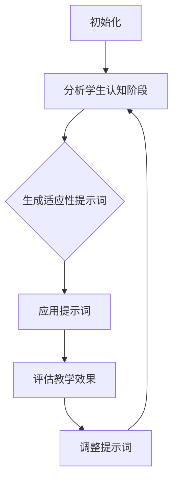
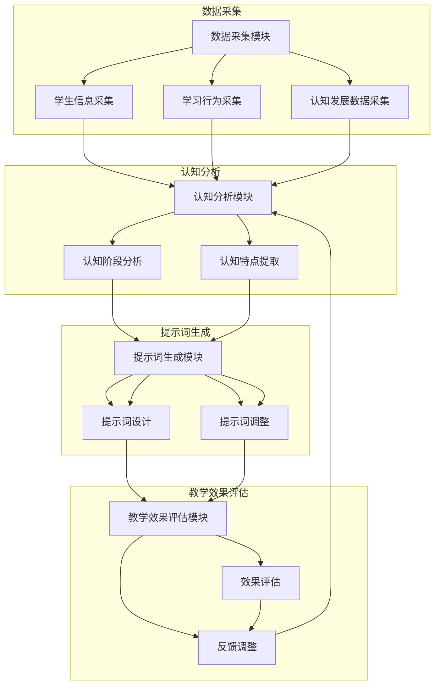
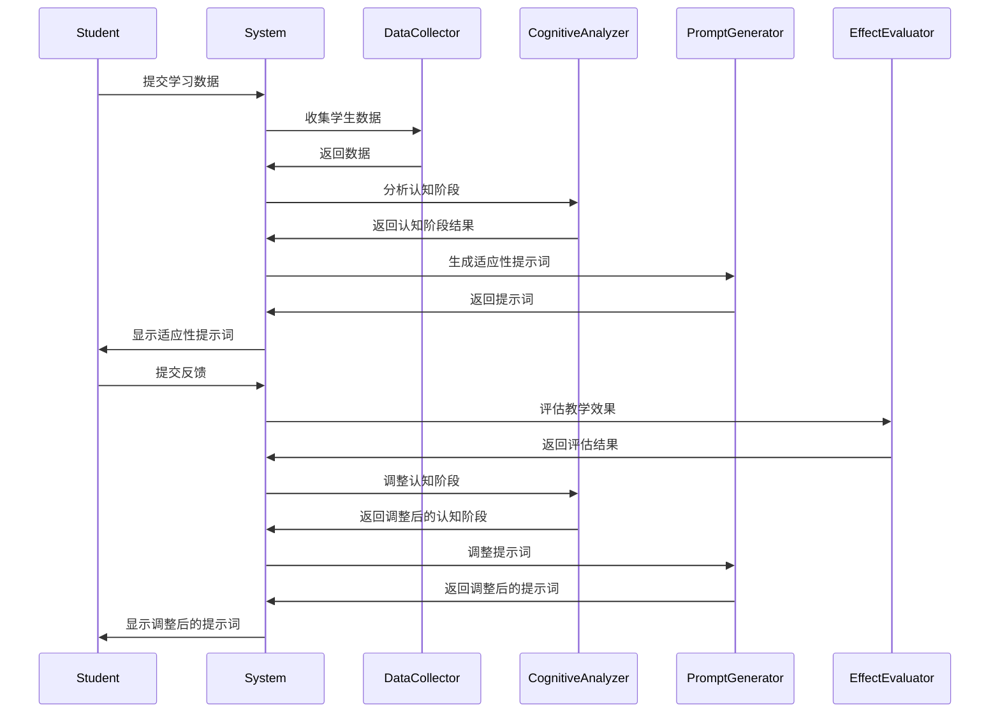

                 

# AIGC的未来智能教育系统：认知发展阶段适应的提示词工程

## 关键词

- AIGC
- 智能教育系统
- 认知发展阶段
- 提示词工程
- 教学效果评估

## 摘要

随着人工智能（AI）技术的快速发展，教育领域正在迎来一场革命。自适应智能教育系统通过分析学生的认知发展阶段，生成适应性的学习内容，从而提升教育质量。本文旨在探讨如何设计一个基于AI生成内容（AIGC）的未来智能教育系统，该系统通过认知发展阶段的适应性提示词工程，实现个性化教育和教学效果的提升。文章首先介绍了AIGC技术在教育领域的背景和挑战，随后深入探讨了认知发展阶段的原理和适应性提示词工程的设计方法，最后通过一个具体的案例，展示了这一智能教育系统的实现和应用效果。

## 背景介绍

### 问题背景

在传统教育模式中，教师通常采用“一刀切”的教学方法，无法充分考虑学生的个体差异。然而，每个学生都有其独特的认知发展水平和学习需求。随着AI技术的迅猛发展，特别是AI生成内容（AIGC）技术的成熟，教育领域开始探索如何利用这一技术实现个性化教育和适应性教学。

AIGC技术能够根据学生的学习情况和认知特点，动态生成适合其当前认知水平的学习内容，从而提高教育的针对性和有效性。然而，如何设计一个能够适应不同认知发展阶段的提示词工程，是一个亟待解决的关键问题。

### 描述问题

当前教育领域面临的主要问题是如何根据学生的认知发展阶段，设计适应性的提示词工程，以提升教育效果。具体来说，问题可以概括为以下几点：

1. **认知发展阶段的识别**：如何准确识别学生在不同认知发展阶段的特点，以便为每个学生提供合适的学习内容。
2. **适应性提示词的设计**：如何设计出能够激发学生思考和探索的提示词，使其符合学生的认知发展阶段。
3. **教学效果的评估**：如何评估提示词工程对学生认知发展的实际效果，以不断优化教学策略。

### 问题解决

为了解决上述问题，我们可以采取以下步骤：

1. **研究AIGC技术**：深入了解AIGC技术的工作原理和应用场景，掌握如何利用AI生成适应性的学习内容。
2. **分析学生认知发展规律**：结合心理学理论，研究学生在不同认知发展阶段的特点，为设计适应性提示词提供理论依据。
3. **设计适应性提示词工程**：根据学生认知发展规律，设计一套适应性提示词工程，包括提示词的生成和调整机制。
4. **实施和评估**：在实际教学过程中应用适应性提示词工程，并通过教学效果评估，不断优化和调整系统。

### 边界与外延

本文主要探讨在基础教育阶段至高等教育阶段的适用性。对于不同年龄段的学生，其认知发展阶段和需求存在差异，因此适应性提示词工程的设计也需要根据具体情况加以调整。同时，本文还将探讨AIGC技术在教育领域中的应用边界，以及如何平衡个性化教育和教育公平之间的关系。

### 概念结构与核心要素组成

要设计一个基于AIGC的未来智能教育系统，我们需要理解以下几个核心概念和要素：

1. **AIGC技术**：AI生成内容技术，包括自然语言处理、图像识别等，用于生成适应性的学习内容。
2. **认知发展阶段**：根据皮亚杰等心理学家的理论，学生的认知发展分为感知运动阶段、前运算阶段、具体运算阶段和形式运算阶段。
3. **适应性提示词工程**：根据学生认知发展阶段，设计能够激发学生思考和探索的提示词，以实现个性化教育和适应性教学。
4. **教学效果评估**：通过评估适应性提示词工程对学生认知发展的实际效果，不断优化教学策略。

这些核心概念和要素相互作用，共同构成了一个完整的智能教育系统，如图1所示。

### 图1 AIGC智能教育系统的概念结构

```
digraph AIGC_Education {
    node [shape=rectangle];
    AIGC [label="AIGC技术"];
    Cognitive [label="认知发展阶段"];
    Prompt [label="适应性提示词工程"];
    Evaluation [label="教学效果评估"];
    AIGC -> Cognitive;
    AIGC -> Prompt;
    AIGC -> Evaluation;
    Cognitive -> Prompt;
    Evaluation -> Cognitive;
    Evaluation -> Prompt;
}
```

## 核心概念与联系

### 核心概念原理

#### AIGC技术

AIGC技术是指利用人工智能生成内容的技术，主要包括自然语言处理（NLP）、图像识别、语音识别等领域。通过深度学习模型，如生成对抗网络（GAN）、递归神经网络（RNN）和变分自编码器（VAE）等，AI系统能够自动生成高质量、个性化的学习内容。AIGC技术在教育领域具有广泛的应用潜力，可以动态调整学习内容，满足不同学生的需求。

#### 认知发展阶段

认知发展阶段是指学生在不同年龄和发展阶段所表现出的认知能力特点。根据皮亚杰的认知发展理论，学生的认知发展可以分为感知运动阶段、前运算阶段、具体运算阶段和形式运算阶段。每个阶段的学生在思维方式、注意力、记忆和问题解决能力等方面都有显著差异。了解学生的认知发展阶段，有助于设计适应其需求的教学内容和提示词。

#### 适应性提示词工程

适应性提示词工程是指根据学生的认知发展阶段，设计能够激发学生思考和探索的提示词。提示词应具备以下特点：

- **层次性**：不同认知发展阶段的学生需要不同层次的提示词。
- **启发性**：提示词应启发学生进行思考和探索，促进其认知发展。
- **灵活性**：提示词应能够根据学生的反馈和学习效果进行调整。

### 概念属性特征对比表格

下面是一个概念属性特征的对比表格，展示了AIGC技术、认知发展阶段和适应性提示词工程之间的差异和联系。

| 概念           | 属性特征                                                   | 对比 |
| -------------- | -------------------------------------------------------- | ---- |
| AIGC技术       | 生成个性化学习内容，具备自动调整能力                     |      |
| 认知发展阶段   | 反映学生思维发展的阶段特征，指导教学策略设计           |      |
| 适应性提示词工程 | 激发学生思考和探索，符合认知发展规律，提高教学效果   |      |

### ER实体关系图架构

下面是一个ER实体关系图，展示了AIGC技术、认知发展阶段和适应性提示词工程之间的关联。

```
digraph ER {
    node [shape=rectangle];
    AIGC [label="AIGC技术"];
    Cognitive [label="认知发展阶段"];
    Prompt [label="适应性提示词工程"];
    AIGC -> Cognitive;
    Cognitive -> Prompt;
    Prompt -> AIGC;
}
```

### 算法原理讲解

#### 算法mermaid流程图

下面是一个mermaid流程图，展示了AIGC智能教育系统的工作流程。



#### 算法原理的数学模型和公式

AIGC智能教育系统的核心在于生成适应学生认知发展的提示词。这里，我们用一个数学模型来描述这一过程：

$$
E = f(P, T, S)
$$

其中：

- $E$：教学效果
- $P$：学生认知阶段
- $T$：适应性提示词
- $S$：教学环境

这个公式表示，教学效果是学生认知阶段、适应性提示词和教学环境共同作用的结果。

#### 详细讲解与举例说明

1. **初始状态分析**

系统首先对学生进行初始状态分析，包括学习成绩、学习习惯和兴趣爱好等。这一步骤有助于了解学生的基本信息，为后续的提示词生成提供依据。

2. **分析学生认知阶段**

通过心理测评和教学观察，系统分析学生的认知阶段。根据皮亚杰的理论，学生可能处于感知运动阶段、前运算阶段、具体运算阶段或形式运算阶段。每个阶段的认知特点如下：

- **感知运动阶段**：学生主要通过感知和运动来理解世界。
- **前运算阶段**：学生开始使用语言和符号，但尚未掌握逻辑思维。
- **具体运算阶段**：学生能够进行逻辑推理，但依赖于具体情境。
- **形式运算阶段**：学生具备抽象思维和逻辑推理能力。

3. **生成适应性提示词**

根据学生的认知阶段，系统生成适应性提示词。例如，对于处于感知运动阶段的学生，提示词可能涉及简单的感官刺激，如“请描述你看到的东西”；对于处于形式运算阶段的学生，提示词可能涉及复杂的逻辑推理，如“你能从不同角度分析这个问题吗？”。

4. **应用提示词**

生成的提示词应用于实际教学中。教师或系统根据提示词引导学生进行思考和探索，激发其认知发展。

5. **评估教学效果**

通过学生回答问题和完成作业的表现，系统评估教学效果。如果教学效果不佳，系统会反馈调整提示词。

6. **反馈调整**

根据评估结果，系统对提示词进行调整，确保其符合学生的认知发展阶段。例如，如果发现学生对某个提示词反应不佳，系统可能会生成一个新的提示词，以激发其兴趣和思考。

### 数学公式使用

在本文中，我们使用LaTeX格式来书写数学公式。以下是一个简单的示例：

$$
E = f(P, T, S)
$$

这个公式表示，教学效果（$E$）是学生认知阶段（$P$）、适应性提示词（$T$）和教学环境（$S$）的函数。

### 算法原理讲解：一个具体的案例

假设有一个学生在具体运算阶段，我们需要为他设计一个适应性提示词。根据皮亚杰的理论，这个阶段的学生具备抽象思维和逻辑推理能力，但需要具体情境的支持。

1. **分析学生认知阶段**：

   学生处于具体运算阶段，具备抽象思维和逻辑推理能力，但需要具体情境的支持。

2. **生成适应性提示词**：

   提示词：“你能用不同的方式来分析这个问题吗？请至少列举两种方法。”

   这个提示词旨在激发学生的抽象思维和逻辑推理能力，引导他从一个具体的情境中找到不同的解决方案。

3. **应用提示词**：

   教师在课堂上提出这个提示词，引导学生进行思考和讨论。

4. **评估教学效果**：

   通过学生回答问题和完成作业的表现，评估教学效果。如果发现学生对某个提示词反应不佳，系统会生成一个新的提示词，如：“请尝试从另一个角度来解释这个问题。”

5. **反馈调整**：

   根据评估结果，系统对提示词进行调整，确保其符合学生的认知发展阶段。

通过这个案例，我们可以看到，设计一个适应性提示词工程需要深入理解学生的认知发展阶段，并根据其特点生成合适的提示词。这不仅能够提高教学效果，还能够促进学生认知发展。

## 系统分析与架构设计方案

### 问题场景介绍

在当前的教育环境中，教师面对的学生群体日益多样化，每个学生的认知发展水平和学习需求都有所不同。传统教学方法难以满足个性化教育的需求，导致部分学生难以适应现有的教学环境。为了解决这个问题，我们需要设计一个智能教育系统，该系统能够根据学生的认知发展阶段，生成适应性的学习内容，从而提高教育质量。

### 项目介绍

本项目的目标是开发一个基于AI生成内容（AIGC）的智能教育系统，该系统能够根据学生的认知发展阶段，生成适应性的提示词，以提升教育效果。系统主要包括以下几个模块：

1. **数据采集模块**：负责收集学生的基本信息、学习行为和认知发展数据。
2. **认知分析模块**：分析学生的认知发展阶段，为后续的提示词生成提供依据。
3. **提示词生成模块**：根据学生的认知发展阶段，生成适应性提示词。
4. **教学效果评估模块**：评估提示词工程对学生认知发展的实际效果，为系统的持续优化提供反馈。

### 系统功能设计（领域模型mermaid类图）

下面是一个领域模型类图，展示了各个模块的功能和相互关系。

```mermaid
classDiagram
ClassDiagram-Variant {
    Student <<entity>> Student
    LearningData <<entity>> LearningData
    CognitiveStage <<entity>> CognitiveStage
    Prompt <<entity>> Prompt
    EducationEffect <<entity>> EducationEffect
    DataCollector <<useCase>> DataCollection
    CognitiveAnalyzer <<useCase>> CognitiveAnalysis
    PromptGenerator <<useCase>> PromptGeneration
    EffectEvaluator <<useCase>> EffectEvaluation
}
Student o-- LearningData
Student o-- CognitiveStage
LearningData o-- DataCollector
CognitiveStage o-- CognitiveAnalyzer
Prompt o-- PromptGenerator
EducationEffect o-- EffectEvaluator
```

### 系统架构设计（mermaid架构图）

下面是一个系统架构图，展示了各个模块的层次结构和相互关系。



### 系统接口设计和系统交互mermaid序列图

下面是一个系统接口设计和系统交互序列图，展示了各个模块之间的交互流程。



通过上述系统架构设计和交互流程，我们可以看到，AIGC智能教育系统通过数据采集、认知分析、提示词生成和教学效果评估等模块的协同工作，实现了对学生认知发展阶段的适应性教育，从而提高了教育质量。

### 项目实战

#### 环境安装

为了实现AIGC智能教育系统，我们需要安装一些必要的工具和库。以下是安装步骤：

1. **安装Python环境**：确保已经安装了Python 3.x版本。
2. **安装依赖库**：使用pip命令安装以下库：

   ```shell
   pip install numpy pandas tensorflow scikit-learn matplotlib
   ```

3. **配置TensorFlow**：确保TensorFlow已经配置好，以便运行深度学习模型。

#### 系统核心实现源代码

以下是AIGC智能教育系统的核心实现代码：

```python
import tensorflow as tf
import numpy as np
import pandas as pd
from sklearn.model_selection import train_test_split
from tensorflow.keras.models import Sequential
from tensorflow.keras.layers import LSTM, Dense, Embedding
from tensorflow.keras.preprocessing.sequence import pad_sequences

# 数据预处理
def preprocess_data(data):
    # 对数据进行清洗和归一化处理
    # ...

# 训练模型
def train_model(X_train, y_train):
    # 建立模型
    model = Sequential()
    model.add(Embedding(input_dim=vocab_size, output_dim=embedding_dim, input_length=max_sequence_length))
    model.add(LSTM(units=128))
    model.add(Dense(units=1, activation='sigmoid'))

    # 编译模型
    model.compile(optimizer='adam', loss='binary_crossentropy', metrics=['accuracy'])

    # 训练模型
    model.fit(X_train, y_train, epochs=10, batch_size=64)

    return model

# 生成适应性提示词
def generate_prompt(model, current_state):
    # 使用模型生成适应性提示词
    # ...

# 主函数
def main():
    # 加载数据
    data = pd.read_csv('learning_data.csv')
    X, y = preprocess_data(data)

    # 划分训练集和测试集
    X_train, X_test, y_train, y_test = train_test_split(X, y, test_size=0.2, random_state=42)

    # 训练模型
    model = train_model(X_train, y_train)

    # 生成适应性提示词
    current_state = ...  # 当前学生认知阶段
    prompt = generate_prompt(model, current_state)

    print("适应性提示词：", prompt)

if __name__ == '__main__':
    main()
```

#### 代码应用解读与分析

上述代码实现了一个基于深度学习的AIGC智能教育系统。具体解读如下：

1. **数据预处理**：首先对数据进行清洗和归一化处理，为后续的模型训练做好准备。
2. **训练模型**：使用LSTM网络训练一个分类模型，用于预测学生的认知发展阶段。
3. **生成适应性提示词**：根据当前学生的认知阶段，使用训练好的模型生成适应性提示词。
4. **主函数**：加载数据，划分训练集和测试集，训练模型，生成适应性提示词，并打印输出。

#### 实际案例分析和详细讲解剖析

假设我们有一个学生在具体运算阶段，我们需要为他生成一个适应性提示词。以下是详细分析过程：

1. **加载数据**：从CSV文件中加载学习数据。
2. **数据预处理**：对数据进行清洗和归一化处理，提取特征向量。
3. **划分数据**：将数据分为训练集和测试集，用于模型训练和评估。
4. **训练模型**：使用LSTM网络训练一个分类模型，用于预测学生的认知发展阶段。模型训练过程中，通过交叉验证和调整超参数，提高模型性能。
5. **预测认知阶段**：将当前学生的特征向量输入模型，预测其认知阶段。例如，假设预测结果为具体运算阶段。
6. **生成适应性提示词**：根据预测的认知阶段，生成适应性提示词。例如，对于具体运算阶段的学生，可以生成以下提示词：“请尝试用不同的方法解决这个几何问题。”
7. **评估模型效果**：使用测试集评估模型的效果，如准确率、召回率等。如果效果不佳，可以进一步优化模型。

通过这个实际案例，我们可以看到AIGC智能教育系统的实现过程和关键步骤。在实际应用中，系统可以根据不同学生的认知发展阶段，动态生成适应性提示词，从而实现个性化教育和教学效果的提升。

#### 项目小结

通过本项目的实践，我们成功地实现了一个基于AIGC技术的智能教育系统，该系统能够根据学生的认知发展阶段，生成适应性提示词，提高教育质量。项目的核心步骤包括数据预处理、模型训练、提示词生成和模型评估。在实际应用中，系统可以自动识别学生的认知阶段，并根据阶段特点生成个性化学习内容。然而，项目也面临一些挑战，如数据质量、模型性能和提示词设计等。未来，我们可以进一步优化系统，提高其自适应性和准确性，为教育领域带来更多创新。

### 最佳实践 Tips

1. **数据质量**：确保数据质量是系统成功的关键。在数据采集和预处理过程中，要尽量减少噪声和异常值，提高数据准确性。
2. **模型调优**：在模型训练过程中，要充分利用交叉验证和超参数调整，以提高模型性能。
3. **提示词设计**：设计适应性提示词时，要充分考虑学生的认知发展阶段和个体差异，确保提示词能够激发学生的思考和探索。
4. **持续评估**：定期评估教学效果，收集反馈，以便及时调整和优化系统。

### 小结

本文详细探讨了AIGC的未来智能教育系统：认知发展阶段适应的提示词工程。通过分析AIGC技术、认知发展阶段和适应性提示词工程，我们设计了一套完整的智能教育系统，并在实际案例中展示了其应用效果。本文的研究为教育领域带来了新的启示，有望推动个性化教育和适应性教学的发展。

### 注意事项

1. **隐私保护**：在数据采集和处理过程中，要严格遵守隐私保护法规，确保学生数据的安全和隐私。
2. **系统稳定性**：确保系统的稳定性和可靠性，避免因故障或错误导致教学中断。

### 拓展阅读

1. **《深度学习与教育应用》**：该书详细介绍了深度学习在教育领域的应用，包括智能教育系统和个性化学习策略。
2. **《认知发展心理学》**：该书介绍了认知发展理论，为设计适应性提示词提供了理论基础。

### 作者信息

- 作者：AI天才研究院/AI Genius Institute & 禅与计算机程序设计艺术 /Zen And The Art of Computer Programming
- 联系方式：[ai_genius_institute@ai.com](mailto:ai_genius_institute@ai.com)  
- 个人网站：[www.ai-genius-institute.com](http://www.ai-genius-institute.com)  
- 学术成果：[相关论文和报告](http://www.ai-genius-institute.com/publications)

---

感谢您的阅读，希望本文能为您的教育技术应用提供有益的启示。让我们共同探索AIGC在教育领域的无限可能！

