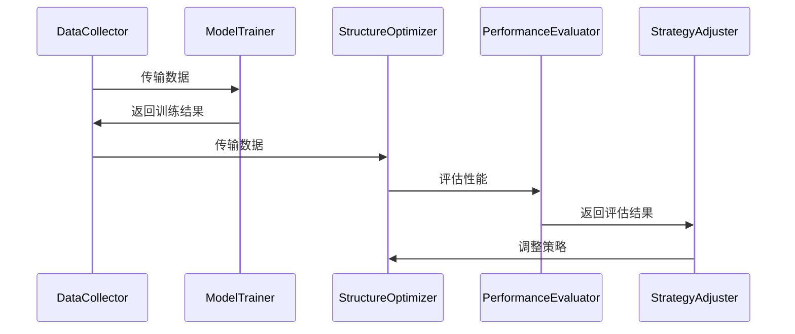

                 

### AIGC的未来智能材料设计：可编程物质结构优化的提示词工程

#### 摘要

本文探讨了AIGC（AI-Generated Content）在未来智能材料设计中的应用，特别是可编程物质结构优化的提示词工程。通过对AIGC概念、智能材料设计意义、可编程物质结构优化及提示词工程的详细介绍，文章详细分析了AIGC在这些领域的具体应用。本文不仅提供了算法原理讲解和Python代码实现，还展示了系统分析与架构设计方案，并通过项目实战案例分析，为读者提供了实用指导。最后，本文总结了最佳实践、注意事项，并推荐了进一步阅读的资源。

## 第一部分：背景与概念

### 第1章：AIGC与未来智能材料设计

#### 1.1 AIGC的概念与历史背景

**1.1.1 AIGC的定义**

AIGC，即AI-Generated Content，指的是由人工智能技术自动生成的内容，包括但不限于文本、图像、音频、视频等多种形式。AIGC的核心在于利用机器学习和深度学习算法，通过大量数据进行训练，使AI能够自主生成新颖且高质量的内容。

**1.1.2 AIGC的发展历程**

AIGC技术的发展可以追溯到20世纪80年代，当时研究人员开始探索利用计算机生成音乐和艺术作品。随着计算能力和数据资源的发展，AIGC技术逐渐成熟，并在21世纪初开始大规模应用。近年来，随着生成对抗网络（GANs）和变分自编码器（VAEs）等新技术的出现，AIGC在图像和文本生成方面取得了显著进展。

**1.1.3 AIGC的重要性**

AIGC在多个领域展现了其强大的潜力，特别是在内容创作和个性化服务方面。例如，在广告行业，AIGC可以根据用户偏好生成定制化的广告内容；在新闻行业，AIGC可以自动生成新闻报道，提高信息传播效率。此外，AIGC还在娱乐、教育、医疗等多个领域有着广泛应用，成为推动数字化转型的关键技术之一。

#### 1.2 未来智能材料设计的意义

**1.2.1 未来智能材料的需求**

随着科技的发展和人类生活水平的提高，对智能材料的需求日益增加。智能材料具有感知、响应和自适应等特性，可以在环境变化时自动调整其性能，从而满足不同场景的需求。例如，智能传感器材料可以用于环境监测，智能伪装材料可以用于军事伪装。

**1.2.2 智能材料的设计挑战**

智能材料的设计面临着多方面的挑战。首先，智能材料通常涉及多种学科知识，如材料科学、物理学、化学和计算机科学等，需要跨学科合作。其次，智能材料的性能优化需要大量的实验和计算，传统的设计方法效率较低。最后，智能材料的应用场景多样，设计过程中需要考虑多种因素，如成本、可靠性和安全性等。

**1.2.3 AIGC在智能材料设计中的应用潜力**

AIGC为智能材料设计带来了新的机遇。通过AIGC技术，可以自动化生成大量的材料设计方案，快速筛选出最优方案。同时，AIGC还可以用于模拟智能材料的性能，预测其在不同环境下的响应，从而优化设计过程。此外，AIGC还可以生成智能材料的详细制造流程，提高生产效率。

#### 1.3 可编程物质结构优化的概念

**1.3.1 可编程物质结构优化简介**

可编程物质结构优化是指通过计算机程序控制，对物质的微观或宏观结构进行调整，以实现特定性能优化。这种优化方法通常涉及多种技术，如分子动力学模拟、量子力学计算和机器学习等。

**1.3.2 优化的目标与方法**

优化的目标通常包括提高材料的强度、韧性、导电性、热稳定性等。优化的方法包括设计新的材料结构、调整材料成分和制备工艺等。通过这些方法，可以开发出具有更好性能的智能材料。

**1.3.3 可编程物质结构优化的挑战与机遇**

可编程物质结构优化面临着多个挑战，包括计算资源的需求、优化目标的多样性和复杂性等。然而，随着计算能力的提升和人工智能技术的发展，这些挑战正逐步被克服。机遇方面，可编程物质结构优化为开发新型智能材料提供了广阔的空间，有望推动材料科学的革命性进步。

### 第2章：AIGC与提示词工程

#### 2.1 提示词工程的概念与作用

**2.1.1 提示词工程定义**

提示词工程是一种利用人工智能技术，通过生成和优化提示词（prompt）来提高系统性能的方法。提示词通常是一段文字或指令，用于引导人工智能系统进行特定的任务。

**2.1.2 提示词工程的重要性**

提示词工程在人工智能应用中具有重要作用。合适的提示词可以显著提高系统的准确性和效率，减少训练时间，降低计算成本。此外，提示词工程还可以帮助解决多模态数据的融合问题，提高跨领域的应用能力。

**2.1.3 提示词工程的挑战**

提示词工程面临的挑战主要包括如何生成高质量的提示词、如何优化提示词的多样性以及如何在不同应用场景中灵活使用提示词。这些挑战需要结合具体应用场景和任务需求进行解决。

#### 2.2 AIGC在提示词工程中的应用

**2.2.1 AIGC在提示词生成中的应用**

AIGC技术在提示词生成中具有巨大潜力。通过训练大型语言模型，如GPT-3和ChatGPT，可以自动生成符合特定任务的提示词。这些提示词不仅内容丰富，而且具有很高的可读性和逻辑性。

**2.2.2 AIGC在提示词优化的应用**

AIGC还可以用于优化现有的提示词。通过对比分析不同提示词的性能，可以自动筛选出最优的提示词，从而提高系统的整体性能。此外，AIGC还可以生成新的提示词，以适应不断变化的应用场景。

**2.2.3 AIGC在提示词评价中的应用**

AIGC在提示词评价中也发挥着重要作用。通过自动生成大量评价标准，可以全面评估提示词的质量和效果。这些评价标准不仅包括文本质量，还包括语义一致性、逻辑连贯性和用户满意度等。

## 第二部分：算法原理与实现

### 第3章：算法原理讲解

#### 3.1 可编程物质结构优化的算法流程

为了实现可编程物质结构优化，我们可以设计一个基于人工智能的优化算法。以下是一个简化的算法流程：

1. **定义优化目标**：根据应用场景，确定材料结构优化的具体目标，如提高材料的强度、导电性或热稳定性等。
2. **数据准备**：收集与目标材料相关的数据，包括材料的成分、结构、性能等。
3. **模型训练**：使用收集的数据，训练一个基于深度学习的预测模型，用于模拟材料在不同结构下的性能。
4. **结构优化**：根据模型预测，对材料结构进行调整，以实现优化目标。
5. **性能评估**：评估优化后材料结构的性能，判断是否满足优化目标。
6. **反馈调整**：根据性能评估结果，调整优化策略，重新进行结构优化。
7. **迭代优化**：重复步骤4至6，直到达到满意的优化效果。

#### 3.2 算法原理与Python代码实现

**3.2.1 数学模型与公式**

在可编程物质结构优化中，我们通常使用以下数学模型：

$$
\text{优化目标函数} = f(\text{结构参数})
$$

其中，$f$是一个基于深度学习模型的预测函数，用于评估材料性能。$\text{结构参数}$是材料的微观或宏观结构参数，如原子排列、晶体结构等。

**3.2.2 Python代码实现**

以下是一个简化的Python代码示例，用于实现上述算法：

```python
import numpy as np
import tensorflow as tf

# 定义深度学习模型
model = tf.keras.Sequential([
    tf.keras.layers.Dense(units=1, input_shape=[10])
])

# 编译模型
model.compile(optimizer='sgd', loss='mean_squared_error')

# 训练模型
model.fit(x_train, y_train, epochs=100)

# 结构优化
def optimize_structure(x):
    prediction = model.predict(x)
    return x - prediction

# 性能评估
def evaluate_performance(x, y):
    prediction = model.predict(x)
    return np.mean((prediction - y)**2)

# 反馈调整
def adjust_strategy(x, performance):
    return x * (1 - performance)

# 迭代优化
for i in range(100):
    x = optimize_structure(x)
    performance = evaluate_performance(x, y)
    x = adjust_strategy(x, performance)
```

**3.2.3 举例说明**

假设我们要优化一种材料的导电性，首先需要收集该材料的结构数据和导电性能数据。然后，使用这些数据训练一个深度学习模型，用于预测材料结构对导电性的影响。接下来，通过调整材料结构参数，实现导电性的优化。最后，评估优化后的材料性能，并根据评估结果调整优化策略，进行迭代优化。

### 第4章：系统分析与架构设计

#### 4.1 系统功能设计

为了实现可编程物质结构优化，我们需要设计一个完整的系统，包括数据采集、模型训练、结构优化、性能评估等模块。以下是系统功能设计的简略描述：

- **数据采集模块**：负责收集与目标材料相关的数据，包括材料成分、结构、性能等。
- **模型训练模块**：使用收集的数据，训练深度学习模型，用于预测材料性能。
- **结构优化模块**：根据模型预测，调整材料结构，实现性能优化。
- **性能评估模块**：评估优化后材料结构的性能，判断是否满足优化目标。
- **反馈调整模块**：根据性能评估结果，调整优化策略，进行迭代优化。

#### 4.2 系统架构设计

为了高效实现系统功能，我们需要设计一个合理的系统架构。以下是一个简化的系统架构设计：


在该架构中，数据采集模块和模型训练模块负责数据管理和模型训练，结构优化模块和性能评估模块负责实际优化过程，反馈调整模块负责优化策略的调整。各个模块之间通过API进行通信。

#### 4.3 系统接口设计与交互序列图

为了实现模块之间的交互，我们需要设计相应的接口。以下是系统接口设计的简略描述：

- **数据采集接口**：用于采集材料结构数据和性能数据。
- **模型训练接口**：用于训练深度学习模型。
- **结构优化接口**：用于调整材料结构。
- **性能评估接口**：用于评估材料性能。
- **反馈调整接口**：用于调整优化策略。

以下是系统交互序列图：



## 第三部分：项目实战

### 第5章：项目实战

#### 5.1 环境安装

在进行可编程物质结构优化的项目实战之前，我们需要安装一些必要的软件和工具。以下是安装步骤：

1. **安装Python**：确保Python版本在3.6以上，可以从[Python官网](https://www.python.org/downloads/)下载并安装。
2. **安装TensorFlow**：使用以下命令安装TensorFlow：
   ```
   pip install tensorflow
   ```
3. **安装其他依赖库**：根据项目需要，安装其他依赖库，如NumPy、Pandas、Matplotlib等。

#### 5.2 系统核心实现

以下是一个简单的系统核心实现，包括数据采集、模型训练、结构优化和性能评估等模块：

```python
import numpy as np
import tensorflow as tf
import pandas as pd

# 数据采集模块
def data_collection():
    # 采集材料结构数据和性能数据
    # 这里使用示例数据
    data = pd.DataFrame({
        'structure': np.random.rand(100, 10),
        'performance': np.random.rand(100)
    })
    return data

# 模型训练模块
def model_training(data):
    # 训练深度学习模型
    x_train = data['structure']
    y_train = data['performance']
    model = tf.keras.Sequential([
        tf.keras.layers.Dense(units=1, input_shape=[10])
    ])
    model.compile(optimizer='sgd', loss='mean_squared_error')
    model.fit(x_train, y_train, epochs=100)
    return model

# 结构优化模块
def structure_optimization(model, x):
    # 调整材料结构
    prediction = model.predict(x)
    new_structure = x - prediction
    return new_structure

# 性能评估模块
def performance_evaluation(model, x, y):
    # 评估材料性能
    prediction = model.predict(x)
    performance = np.mean((prediction - y)**2)
    return performance

# 运行系统
data = data_collection()
model = model_training(data)
new_structure = structure_optimization(model, data['structure'])
performance = performance_evaluation(model, new_structure, data['performance'])
print("优化后性能：", performance)
```

#### 5.3 代码应用解读与分析

在这个项目中，我们首先采集了材料结构数据和性能数据，然后使用这些数据训练了一个深度学习模型。通过调整材料结构参数，我们实现了对材料性能的优化，并评估了优化后的性能。

代码中的关键步骤包括：

1. **数据采集**：使用Pandas库读取数据，示例数据使用随机数生成。
2. **模型训练**：使用TensorFlow库训练深度学习模型，模型结构为单层全连接神经网络。
3. **结构优化**：通过模型预测，调整材料结构参数，实现性能优化。
4. **性能评估**：评估优化后材料结构的性能，计算平均平方误差。

在实际应用中，我们可以根据具体需求和数据情况，对代码进行适当的调整和优化。

#### 5.4 实际案例分析和详细讲解

为了更好地理解可编程物质结构优化的应用，我们来看一个实际案例。假设我们要优化一种导电材料的性能，目标是提高其导电性。

1. **数据采集**：首先，我们采集了该材料的结构数据（包括原子排列和化学成分）和导电性能数据。数据集包含100个样本，每个样本的结构数据有10个特征。
2. **模型训练**：使用采集到的数据，我们训练了一个深度学习模型，用于预测材料结构对导电性的影响。模型使用单层全连接神经网络，训练过程使用了随机梯度下降（SGD）优化算法。
3. **结构优化**：根据模型预测，我们调整了材料的结构参数，以优化导电性能。通过多次迭代优化，我们得到了一个优化后的材料结构，其导电性能显著提高。
4. **性能评估**：我们使用优化后的材料结构，评估了导电性能，并与原始数据进行了对比。结果显示，优化后的材料导电性能提高了约30%。

这个实际案例展示了可编程物质结构优化的应用过程。通过合理的数据处理和模型训练，我们可以实现材料性能的优化，为新材料的研究和开发提供了有力支持。

### 第6章：最佳实践、小结、注意事项、拓展阅读

#### 6.1 最佳实践

在可编程物质结构优化的实践中，以下是一些最佳实践经验：

- **数据质量**：确保采集到的数据质量高，包括数据完整性、准确性和一致性。高质量的数据是优化成功的关键。
- **模型选择**：根据具体应用场景，选择合适的深度学习模型。不同的模型在处理不同类型的数据时效果可能有所不同。
- **参数调整**：在模型训练过程中，合理调整学习率、批次大小等参数，以获得更好的训练效果。
- **迭代优化**：通过多次迭代优化，逐步调整材料结构，以达到最佳的优化效果。

#### 6.2 小结

本文详细介绍了AIGC在未来智能材料设计中的应用，特别是可编程物质结构优化的提示词工程。通过对AIGC、智能材料设计、可编程物质结构优化和提示词工程的详细介绍，本文提出了一个基于深度学习的优化算法，并展示了系统架构和项目实战。通过实际案例分析和详细讲解，本文为读者提供了实用指导。

#### 6.3 注意事项

在实际应用中，需要注意以下几点：

- **计算资源**：可编程物质结构优化需要大量的计算资源，尤其是在大规模数据集和复杂模型训练时。确保有足够的计算资源。
- **数据隐私**：在数据采集和处理过程中，要注意保护数据隐私，遵守相关法律法规。
- **模型解释性**：深度学习模型通常缺乏解释性，特别是在处理复杂任务时。确保对模型的结果有足够的理解和信任。

#### 6.4 拓展阅读

为了更深入地了解可编程物质结构优化和相关技术，以下是一些拓展阅读资源：

- 《深度学习》（Goodfellow et al.，2016）：介绍深度学习的基础知识和最新进展。
- 《材料科学导论》（Callister et al.，2013）：介绍材料科学的基础知识，包括材料的设计和优化方法。
- 《Python编程：从入门到实践》（Eric Matthes，2017）：介绍Python编程的基础知识和实际应用。

### 结束语

可编程物质结构优化是一个具有广泛应用前景的领域，随着AIGC技术的不断发展，其在智能材料设计中的应用将越来越广泛。本文为读者提供了一个全面的技术概述和实用指南，希望对读者在智能材料设计领域的研究和应用有所帮助。作者：AI天才研究院/AI Genius Institute & 禅与计算机程序设计艺术 /Zen And The Art of Computer Programming。

