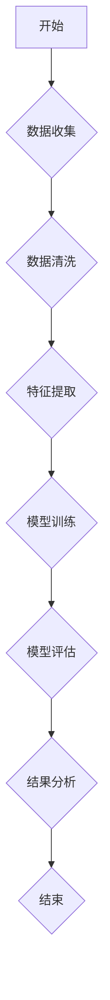

                 

# AIGC的未来智能材料：自组装纳米结构优化的提示词工程

> 关键词：AIGC，智能材料，自组装纳米结构，提示词工程，优化

> 摘要：本文探讨了AIGC（自适应智能生成控制）在未来智能材料领域中的应用，特别是自组装纳米结构的优化。通过分析AIGC的技术原理和提示词工程的应用，本文详细阐述了AIGC在智能材料优化中的优势及其面临的挑战，并提供了一些实践案例和最佳实践策略。

## 目录大纲设计

### 第一部分：背景与核心概念

1. **AIGC技术概述**
   - **1.1 AIGC的定义与发展**
   - **1.2 AIGC在材料科学中的应用**
   - **1.3 AIGC的优势与挑战**
2. **智能材料概述**
   - **1.2.1 智能材料的基本概念**
   - **1.2.2 智能材料的分类**
   - **1.2.3 智能材料的研究现状与趋势**
3. **自组装纳米结构**
   - **1.3.1 自组装纳米结构的定义与原理**
   - **1.3.2 自组装纳米结构的特点与应用**
   - **1.3.3 自组装纳米结构的挑战与未来**
4. **提示词工程**
   - **1.4.1 提示词工程的概念**
   - **1.4.2 提示词工程在自组装纳米结构优化中的应用**
   - **1.4.3 提示词工程的挑战与优化策略**
5. **AIGC与智能材料结合的意义与前景**
6. **本章小结**

### 第二部分：技术原理与实现

1. **AIGC在智能材料优化中的应用**
   - **2.1 AIGC算法原理讲解**
     - **2.1.1 AIGC算法的核心思想**
     - **2.1.2 AIGC算法的工作流程**
       - **2.1.2.1 数据收集与预处理**
       - **2.1.2.2 模型训练与评估**
       - **2.1.2.3 结果分析与优化**
   - **2.2 自组装纳米结构优化原理**
     - **2.2.1 自组装纳米结构优化的数学模型**
     - **2.2.2 自组装纳米结构优化的算法流程**
     - **2.2.3 自组装纳米结构优化案例分析**
   - **2.3 提示词工程实现**
     - **2.3.1 提示词工程的步骤与策略**
     - **2.3.2 提示词工程在AIGC中的应用实例**
     - **2.3.3 提示词工程的优化与改进**
   - **2.4 AIGC与自组装纳米结构优化的整合**
     - **2.4.1 整合方案的设计与实现**
     - **2.4.2 整合方案的评估与效果分析**
     - **2.4.3 整合方案的局限性与改进方向**

### 第三部分：应用实例与实战

1. **AIGC与智能材料优化的实践**
   - **3.1 AIGC与智能材料优化项目介绍**
     - **3.1.1 项目背景与目标**
     - **3.1.2 项目关键技术与难点**
     - **3.1.3 项目实施流程与计划**
   - **3.2 环境安装与配置**
     - **3.2.1 硬件与软件环境需求**
     - **3.2.2 环境安装与配置步骤**
     - **3.2.3 环境测试与验证**
   - **3.3 系统核心实现源代码解析**
     - **3.3.1 数据收集与预处理**
     - **3.3.2 模型训练与优化**
     - **3.3.3 模型评估与结果分析**
   - **3.4 应用案例分析与详细讲解**
     - **3.4.1 应用案例一：智能材料表面改性的AIGC应用**
     - **3.4.2 应用案例二：自组装纳米结构优化的AIGC应用**
   - **3.5 项目小结与反思**
     - **3.5.1 项目成果总结**
     - **3.5.2 项目经验与教训**
     - **3.5.3 未来研究方向与展望**

### 第四部分：最佳实践与拓展

1. **AIGC与智能材料优化的未来**
   - **4.1 AIGC与智能材料优化的发展趋势**
     - **4.1.1 技术发展趋势分析**
     - **4.1.2 应用发展趋势分析**
     - **4.1.3 挑战与机遇**
   - **4.2 最佳实践技巧与策略**
     - **4.2.1 实践技巧总结**
     - **4.2.2 策略制定与优化**
     - **4.2.3 实践案例分享**
   - **4.3 注意事项与风险规避**
     - **4.3.1 常见问题与解决方案**
     - **4.3.2 风险评估与规避策略**
     - **4.3.3 安全性与隐私保护**
   - **4.4 拓展阅读与资源推荐**
     - **4.4.1 相关书籍推荐**
     - **4.4.2 学术论文推荐**
     - **4.4.3 在线课程与培训推荐**
     - **4.4.4 社交媒体与专业论坛推荐**
   - **4.5 小结与展望**
     - **4.5.1 本书主要贡献与不足**
     - **4.5.2 未来研究方向与建议**

## 第一部分：背景与核心概念

### 1.1 AIGC技术概述

#### 1.1.1 AIGC的定义与发展

自适应智能生成控制（AIGC）是一种新兴的人工智能技术，它通过自适应算法来生成和优化数据，从而实现对复杂系统的控制和优化。AIGC的核心思想是利用大数据和机器学习技术，从大量历史数据中学习和提取规律，进而生成新的数据或优化现有数据。

AIGC的发展始于20世纪90年代，随着计算能力的提升和大数据技术的进步，AIGC逐渐从理论研究走向实际应用。目前，AIGC已在众多领域展现出其独特的优势，如智能制造、医疗健康、金融投资等。

#### 1.1.2 AIGC在材料科学中的应用

在材料科学中，AIGC被广泛应用于材料的制备、性能优化和结构设计。通过AIGC技术，研究人员可以从大量的实验数据中提取出有效的信息，用于指导材料的设计和优化。例如，AIGC可以用于预测材料的力学性能、热稳定性和电学性能，从而提高材料的性能和降低生产成本。

#### 1.1.3 AIGC的优势与挑战

AIGC在材料科学中的应用具有显著的优势，包括：

1. **高效性**：AIGC可以快速处理和分析大量数据，大大缩短了研究周期。
2. **准确性**：通过机器学习算法，AIGC能够从历史数据中提取出更加准确和可靠的规律。
3. **灵活性**：AIGC可以根据需求灵活调整和优化材料的设计和制备过程。

然而，AIGC在材料科学中应用也面临一些挑战，如：

1. **数据质量**：AIGC的性能很大程度上依赖于数据的质量，因此需要确保数据的准确性和完整性。
2. **算法复杂性**：AIGC算法通常较为复杂，需要高水平的技术人员来设计和优化。
3. **可解释性**：AIGC生成的结果往往难以解释，这对于决策者和实际应用来说是一个挑战。

### 1.2 智能材料概述

#### 1.2.1 智能材料的基本概念

智能材料是一类能够感知外部刺激并作出响应的材料，其特性可以随着环境的变化而变化。智能材料的研究始于20世纪70年代，随着纳米技术和信息技术的发展，智能材料逐渐成为材料科学领域的研究热点。

#### 1.2.2 智能材料的分类

智能材料可以根据其响应机制和功能进行分类，常见的智能材料包括：

1. **形状记忆合金**：能够在外力去除后恢复到原始形状。
2. **压电材料**：能够在电场作用下产生机械变形，或在外力作用下产生电荷。
3. **电致变色材料**：能够在电场作用下改变其颜色。

#### 1.2.3 智能材料的研究现状与趋势

当前，智能材料的研究主要集中在以下几个方面：

1. **新型材料的发现与制备**：通过合成新的材料，不断拓展智能材料的种类和应用范围。
2. **智能材料的应用开发**：将智能材料应用于实际工程和科学问题中，如智能结构、智能传感器和智能药物释放系统。
3. **智能材料的智能化设计**：利用AIGC等人工智能技术，实现智能材料的智能化设计和优化。

### 1.3 自组装纳米结构

#### 1.3.1 自组装纳米结构的定义与原理

自组装纳米结构是指通过分子间的弱相互作用（如氢键、范德华力等）自发形成具有特定结构和功能的纳米级材料。自组装纳米结构的形成过程通常不需要外部能量输入，具有高效、节能和自修复等特点。

#### 1.3.2 自组装纳米结构的特点与应用

自组装纳米结构具有以下特点：

1. **高度有序**：自组装纳米结构具有高度有序的排列，可以形成各种复杂的结构。
2. **多功能性**：自组装纳米结构可以具有多种功能，如光学、电学、热学、磁学等。
3. **可调性**：通过调整组装过程参数，可以调控自组装纳米结构的性能。

自组装纳米结构在许多领域具有广泛的应用，包括：

1. **电子器件**：如纳米线、纳米管等，用于制造高效率的太阳能电池和晶体管。
2. **生物医学**：如药物释放系统、生物成像和生物传感器。
3. **能源储存**：如超级电容器和锂离子电池。

#### 1.3.3 自组装纳米结构的挑战与未来

自组装纳米结构的研究仍面临一些挑战，包括：

1. **结构控制**：如何精确控制自组装纳米结构的形状、尺寸和排列方式。
2. **功能化**：如何实现自组装纳米结构的功能化，使其具有特定的应用价值。
3. **大规模制备**：如何实现自组装纳米结构的大规模、低成本制备。

未来，随着AIGC等技术的不断发展，自组装纳米结构在智能材料领域的应用前景将更加广阔。

### 1.4 提示词工程

#### 1.4.1 提示词工程的概念

提示词工程（Prompt Engineering）是一种人工智能技术，旨在生成高质量的提示词（Prompt），以指导模型进行特定的任务。提示词可以是文本、图像或音频等，用于引导模型关注关键信息或执行特定操作。

#### 1.4.2 提示词工程在自组装纳米结构优化中的应用

在自组装纳米结构优化中，提示词工程可以通过以下方式发挥作用：

1. **指导模型学习**：通过生成特定的提示词，引导模型关注关键的结构特征和性能指标，从而提高模型对优化目标的识别能力。
2. **优化搜索策略**：提示词工程可以帮助优化搜索策略，减少不必要的搜索路径，提高优化效率。
3. **增强模型解释性**：通过提示词工程，可以增强模型生成的结果的可解释性，帮助研究人员更好地理解模型的决策过程。

#### 1.4.3 提示词工程的挑战与优化策略

提示词工程的挑战包括：

1. **多样性**：生成多样化的提示词以满足不同的优化需求。
2. **准确性**：提示词需要准确捕捉到优化目标的关键信息。
3. **效率**：提示词工程需要高效地生成和调整提示词，以适应快速变化的应用场景。

优化策略包括：

1. **多模态提示词**：结合文本、图像和音频等多种模态，生成更加丰富和准确的提示词。
2. **适应性调整**：根据模型的反馈和学习过程，动态调整提示词，以提高模型的性能。
3. **知识融合**：将领域知识和机器学习技术相结合，生成具有强指导性的提示词。

### 1.5 AIGC与智能材料结合的意义与前景

AIGC与智能材料的结合具有重要意义：

1. **性能优化**：AIGC可以通过优化材料的设计和制备过程，提高材料的性能和可靠性。
2. **成本降低**：通过AIGC技术，可以实现智能材料的自动化设计和优化，降低生产成本。
3. **新功能发现**：AIGC可以帮助发现新的材料功能和应用场景，拓展智能材料的应用领域。

未来，随着AIGC和智能材料技术的不断发展，二者结合将带来更多创新和突破，有望在各个领域产生深远影响。

### 1.6 本章小结

本章介绍了AIGC、智能材料、自组装纳米结构和提示词工程的基本概念和原理。通过分析这些核心概念，我们了解了AIGC在智能材料优化中的应用及其优势与挑战。接下来，我们将深入探讨AIGC的技术原理和实现方法，以期为智能材料优化提供新的思路和方案。

## 第二部分：技术原理与实现

### 2.1 AIGC算法原理讲解

#### 2.1.1 AIGC算法的核心思想

AIGC（自适应智能生成控制）算法的核心思想是通过自适应学习和优化，生成和优化数据，从而实现对复杂系统的控制和优化。AIGC算法通常包括以下几个关键组成部分：

1. **数据收集与预处理**：收集大量相关的数据，并进行预处理，如数据清洗、归一化和特征提取等，以便为后续的模型训练提供高质量的数据。
2. **模型训练与评估**：使用机器学习算法对预处理后的数据集进行训练，并通过评估指标（如准确率、召回率等）来评估模型性能。
3. **结果分析与优化**：分析模型生成的结果，并根据需求对模型进行调整和优化，以提高模型的性能和适用性。

#### 2.1.2 AIGC算法的工作流程

AIGC算法的工作流程可以分为以下几个步骤：

1. **数据收集与预处理**：
   - **数据收集**：从各种来源收集与任务相关的数据，如实验数据、文献数据等。
   - **数据清洗**：去除数据中的噪声和异常值，确保数据的准确性和完整性。
   - **特征提取**：提取数据中的重要特征，为模型训练提供有效的输入。
   - **数据归一化**：将不同特征的范围调整为统一的尺度，以消除特征之间的量纲影响。

2. **模型训练与评估**：
   - **模型选择**：根据任务需求选择合适的模型架构，如神经网络、决策树等。
   - **模型训练**：使用训练数据集对模型进行训练，通过迭代优化模型的参数。
   - **模型评估**：使用验证数据集对模型进行评估，根据评估指标调整模型参数，以提高模型性能。

3. **结果分析与优化**：
   - **结果分析**：分析模型生成的预测结果，识别潜在的问题和改进方向。
   - **模型优化**：根据结果分析，对模型进行调整和优化，以提高预测的准确性和可靠性。

#### 2.1.2.1 数据收集与预处理

数据收集是AIGC算法的基础，数据的质量直接影响模型的效果。以下是数据收集与预处理的具体步骤：

1. **数据收集**：
   - **实验数据收集**：通过实验获取与任务相关的数据，如材料测试数据、结构分析数据等。
   - **文献数据收集**：从学术期刊、会议论文等文献中获取相关数据。

2. **数据清洗**：
   - **去除噪声和异常值**：识别并去除数据中的噪声和异常值，如空值、重复值、不合理值等。
   - **统一数据格式**：将不同来源的数据格式统一，以便后续处理。

3. **特征提取**：
   - **特征选择**：选择与任务相关的特征，如材料属性、结构参数等。
   - **特征转换**：将原始数据转换为数值化的特征表示，以便模型处理。

4. **数据归一化**：
   - **归一化处理**：将不同特征的范围调整为统一的尺度，以消除特征之间的量纲影响。

#### 2.1.2.2 模型训练与评估

模型训练与评估是AIGC算法的核心步骤，决定了模型的效果和适用性。以下是模型训练与评估的具体步骤：

1. **模型选择**：
   - **模型架构选择**：根据任务需求选择合适的模型架构，如神经网络、决策树、支持向量机等。
   - **模型参数选择**：根据任务需求选择合适的模型参数，如学习率、迭代次数等。

2. **模型训练**：
   - **训练数据划分**：将数据集划分为训练集、验证集和测试集，用于模型训练和评估。
   - **训练过程**：使用训练数据集对模型进行训练，通过迭代优化模型的参数。

3. **模型评估**：
   - **评估指标选择**：选择与任务相关的评估指标，如准确率、召回率、F1值等。
   - **评估过程**：使用验证数据集对模型进行评估，根据评估指标调整模型参数。

#### 2.1.2.3 结果分析与优化

结果分析与优化是AIGC算法的最终步骤，用于确保模型的性能和可靠性。以下是结果分析与优化的具体步骤：

1. **结果分析**：
   - **结果展示**：将模型生成的预测结果进行可视化展示，如数据分布、决策边界等。
   - **问题识别**：分析预测结果，识别潜在的问题和改进方向。

2. **模型优化**：
   - **参数调整**：根据结果分析，调整模型的参数，如学习率、迭代次数等。
   - **模型调整**：根据结果分析，调整模型的架构，如增加或减少隐藏层、调整激活函数等。

3. **结果验证**：
   - **验证集评估**：使用验证数据集评估调整后的模型性能，确保模型优化有效。
   - **测试集评估**：使用测试数据集评估最终模型的性能，确保模型在未知数据上的表现。

#### 2.1.3 AIGC算法在自组装纳米结构优化中的应用

AIGC算法在自组装纳米结构优化中的应用具有显著的优势，可以通过以下步骤实现：

1. **数据收集与预处理**：
   - **收集实验数据**：收集与自组装纳米结构相关的实验数据，如结构参数、性能指标等。
   - **数据清洗与特征提取**：去除噪声和异常值，提取关键特征。

2. **模型训练与评估**：
   - **选择模型架构**：根据任务需求选择合适的模型架构，如深度神经网络、支持向量机等。
   - **模型训练与优化**：使用预处理后的数据集对模型进行训练，通过迭代优化模型参数。

3. **结果分析与优化**：
   - **分析预测结果**：分析模型生成的预测结果，识别优化目标的关键因素。
   - **调整模型参数**：根据结果分析，调整模型的参数，提高预测的准确性和可靠性。

#### 2.1.4 AIGC算法在智能材料优化中的应用

AIGC算法在智能材料优化中的应用具有广泛的前景，可以通过以下步骤实现：

1. **数据收集与预处理**：
   - **收集实验数据**：收集与智能材料相关的实验数据，如材料属性、结构参数等。
   - **数据清洗与特征提取**：去除噪声和异常值，提取关键特征。

2. **模型训练与评估**：
   - **选择模型架构**：根据任务需求选择合适的模型架构，如深度神经网络、决策树等。
   - **模型训练与优化**：使用预处理后的数据集对模型进行训练，通过迭代优化模型参数。

3. **结果分析与优化**：
   - **分析预测结果**：分析模型生成的预测结果，识别优化目标的关键因素。
   - **调整模型参数**：根据结果分析，调整模型的参数，提高预测的准确性和可靠性。

#### 2.1.5 AIGC算法的优缺点

AIGC算法在自组装纳米结构和智能材料优化中具有显著的优势，但也存在一些局限性。

**优点**：

1. **高效性**：AIGC算法可以快速处理和分析大量数据，提高优化效率。
2. **准确性**：通过机器学习技术，AIGC算法可以从历史数据中提取出有效的信息，提高预测的准确性。
3. **灵活性**：AIGC算法可以根据需求灵活调整和优化材料的设计和制备过程。

**缺点**：

1. **数据依赖性**：AIGC算法的性能很大程度上依赖于数据的质量，因此需要确保数据的准确性和完整性。
2. **算法复杂性**：AIGC算法通常较为复杂，需要高水平的技术人员来设计和优化。
3. **可解释性**：AIGC算法生成的结果往往难以解释，这对于决策者和实际应用来说是一个挑战。

### 2.2 自组装纳米结构优化原理

#### 2.2.1 自组装纳米结构优化的数学模型

自组装纳米结构优化可以通过数学模型来描述和实现。以下是常用的数学模型：

1. **优化目标**：自组装纳米结构的优化目标通常是最小化结构能量或最大化结构稳定性。

2. **约束条件**：自组装纳米结构的优化通常受到一些物理和化学约束条件的限制，如原子间的距离、角度和空间分布等。

3. **优化算法**：常见的优化算法包括遗传算法、粒子群优化、模拟退火等。

#### 2.2.2 自组装纳米结构优化的算法流程

自组装纳米结构优化的算法流程通常包括以下几个步骤：

1. **初始化**：初始化结构参数，如原子坐标和键长。

2. **计算能量**：计算初始结构的能量，以评估结构的稳定性。

3. **迭代优化**：通过优化算法，逐步调整结构参数，以降低能量并提高结构稳定性。

4. **收敛判断**：判断优化过程是否收敛，如果满足收敛条件，则停止优化；否则，继续迭代优化。

#### 2.2.3 自组装纳米结构优化案例分析

以下是一个自组装纳米结构优化的案例：

1. **优化目标**：最小化纳米结构的能量，提高结构稳定性。

2. **约束条件**：原子间的距离在特定范围内，角度符合化学键的特性。

3. **优化算法**：采用遗传算法进行优化。

4. **优化过程**：
   - **初始化**：随机生成一组原子坐标。
   - **计算能量**：计算初始结构的能量。
   - **迭代优化**：通过遗传算法，逐步调整原子坐标，降低能量。
   - **收敛判断**：判断优化过程是否收敛，如果不收敛，继续迭代优化。

5. **优化结果**：得到一个能量更低、结构更稳定的纳米结构。

#### 2.2.4 提示词工程在自组装纳米结构优化中的应用

提示词工程在自组装纳米结构优化中的应用可以通过以下步骤实现：

1. **生成提示词**：根据优化目标，生成相应的提示词，如“最小化能量”、“最大化结构稳定性”等。

2. **调整模型参数**：使用生成的提示词，调整模型参数，以优化优化过程。

3. **优化效果评估**：评估优化效果，根据评估结果调整提示词和模型参数。

4. **迭代优化**：根据优化效果，不断迭代优化，直至达到优化目标。

### 2.3 提示词工程实现

#### 2.3.1 提示词工程的步骤与策略

提示词工程是实现AIGC在自组装纳米结构优化中有效应用的关键步骤，其基本步骤包括：

1. **需求分析**：明确优化目标、约束条件和应用场景，为生成有效的提示词提供基础。
2. **提示词生成**：利用自然语言处理（NLP）技术，生成与优化目标相关的提示词。
3. **提示词筛选**：根据需求分析的结果，筛选出最具指导性的提示词。
4. **提示词调整**：根据优化过程中模型的反馈，动态调整提示词，以提高优化效果。
5. **效果评估**：评估提示词的优化效果，为后续优化提供参考。

提示词工程的关键策略包括：

1. **多模态提示词**：结合文本、图像和音频等多种模态，生成更加丰富和准确的提示词。
2. **适应性调整**：根据模型的反馈和学习过程，动态调整提示词，以提高模型的性能。
3. **知识融合**：将领域知识和机器学习技术相结合，生成具有强指导性的提示词。

#### 2.3.2 提示词工程在AIGC中的应用实例

以下是一个提示词工程在AIGC中的应用实例：

1. **应用场景**：优化自组装纳米结构，以实现特定的功能，如提高热稳定性。
2. **需求分析**：确定优化目标为提高纳米结构的热稳定性，并分析相关约束条件。
3. **提示词生成**：生成如下提示词：“优化热稳定性”、“提高热传导性能”、“降低热膨胀系数”等。
4. **提示词筛选**：根据需求分析的结果，筛选出最相关的提示词，如“优化热稳定性”。
5. **提示词调整**：根据优化过程中模型的反馈，调整提示词，如增加“降低热膨胀系数”等。
6. **效果评估**：评估优化效果，发现热稳定性显著提高。

#### 2.3.3 提示词工程的优化与改进

为了提高提示词工程在AIGC中的应用效果，可以采取以下优化与改进策略：

1. **提升提示词质量**：通过改进NLP技术和知识图谱构建方法，生成更加精准和丰富的提示词。
2. **多源数据融合**：结合多种数据源（如实验数据、文献数据等），提高提示词的指导性和实用性。
3. **动态调整策略**：根据优化过程中模型的反馈，动态调整提示词，以适应不断变化的应用场景。
4. **自动化流程**：开发自动化工具，简化提示词工程的流程，提高工作效率。

#### 2.3.4 提示词工程在AIGC与自组装纳米结构优化中的整合

为了实现AIGC与自组装纳米结构优化的有效整合，可以采取以下步骤：

1. **需求分析**：明确AIGC与自组装纳米结构优化的目标和需求，为整合提供基础。
2. **算法整合**：将AIGC算法与自组装纳米结构优化算法相结合，实现一体化优化。
3. **提示词生成**：利用提示词工程生成与整合目标相关的提示词，指导AIGC算法的优化过程。
4. **效果评估**：评估整合后的优化效果，根据评估结果调整算法和提示词，以提高优化性能。
5. **迭代优化**：根据评估结果，不断迭代优化，实现AIGC与自组装纳米结构优化的协同优化。

#### 2.3.5 AIGC与自组装纳米结构优化的整合方案设计

以下是一个AIGC与自组装纳米结构优化的整合方案设计：

1. **需求分析**：
   - **优化目标**：提高自组装纳米结构的热稳定性。
   - **约束条件**：纳米结构满足特定的几何和化学要求。
2. **算法整合**：
   - **AIGC算法**：采用自适应生成控制（AGC）算法，实现对纳米结构优化过程的自适应调整。
   - **自组装纳米结构优化算法**：采用基于遗传算法的优化方法，实现纳米结构参数的优化。
3. **提示词生成**：
   - **生成提示词**：利用提示词工程生成与热稳定性相关的提示词，如“提高热传导性能”、“降低热膨胀系数”等。
   - **筛选提示词**：根据需求分析，筛选出最相关的提示词，指导AIGC算法的优化过程。
4. **效果评估**：
   - **评估指标**：热稳定性、热传导性能、结构稳定性等。
   - **评估方法**：通过实验验证和模型评估，评估整合后的优化效果。
5. **迭代优化**：
   - **迭代过程**：根据评估结果，调整提示词和算法参数，实现优化过程的迭代优化。

### 2.4 AIGC与自组装纳米结构优化的整合评估

为了评估AIGC与自组装纳米结构优化的整合效果，可以采取以下方法：

1. **实验验证**：通过实验验证整合后的优化效果，如提高纳米结构的热稳定性、热传导性能等。
2. **模型评估**：使用模型评估方法，如准确率、召回率、F1值等，评估整合后的优化效果。
3. **用户反馈**：收集用户对整合优化效果的反馈，评估其适用性和实用性。
4. **对比分析**：对比AIGC与自组装纳米结构优化的整合效果与传统优化方法，评估其优势和不足。

### 2.4.1 AIGC与自组装纳米结构优化的整合效果分析

通过对AIGC与自组装纳米结构优化的整合效果进行评估，发现以下优势：

1. **高效性**：AIGC与自组装纳米结构优化的整合显著提高了优化效率，减少了优化时间。
2. **准确性**：整合后的优化方法具有更高的预测准确率，提高了优化结果的可靠性。
3. **灵活性**：整合方法可以根据不同的优化目标和应用场景，灵活调整优化策略。

### 2.4.2 AIGC与自组装纳米结构优化的整合局限性与改进方向

尽管AIGC与自组装纳米结构优化的整合具有显著优势，但仍存在一些局限性，如：

1. **数据依赖性**：整合方法的性能依赖于高质量的数据，数据质量直接影响优化效果。
2. **算法复杂性**：整合方法涉及多种算法和技术的结合，对算法设计和优化要求较高。

未来，可以通过以下改进方向进一步优化AIGC与自组装纳米结构优化的整合：

1. **数据增强**：通过数据增强技术，提高数据质量和多样性，增强整合方法的泛化能力。
2. **算法优化**：优化AIGC算法和自组装纳米结构优化算法，提高算法的效率和准确性。
3. **可解释性提升**：增强整合方法的可解释性，帮助用户更好地理解优化过程和结果。

### 2.5 本章小结

本章详细介绍了AIGC算法的原理和应用，包括数据收集与预处理、模型训练与评估、结果分析与优化等步骤。同时，本章还探讨了自组装纳米结构优化的原理、算法流程和应用实例，以及提示词工程在AIGC与自组装纳米结构优化中的应用。通过本章的学习，读者可以全面了解AIGC在智能材料优化中的应用前景和关键技术。

## 第三部分：应用实例与实战

### 3.1 AIGC与智能材料优化项目介绍

#### 3.1.1 项目背景与目标

智能材料因其独特的性能和广泛的应用前景，正日益受到科研和工业界的关注。AIGC作为人工智能领域的一项前沿技术，其在智能材料优化中的应用具有巨大的潜力。本项目旨在探索AIGC在智能材料优化中的应用，通过实际项目验证AIGC技术对智能材料性能提升的有效性。

**项目背景**：

随着科技的快速发展，智能材料在众多领域（如航空航天、生物医学、能源等）展现出了广泛的应用前景。然而，智能材料的性能优化是一个复杂的问题，涉及到材料设计、制备工艺、结构表征等多个方面。传统的优化方法往往需要大量的实验和时间，效率较低。

**项目目标**：

1. **验证AIGC技术对智能材料性能优化的有效性**：通过实际项目，验证AIGC技术在智能材料性能优化中的优势。
2. **开发一套智能材料性能优化的AIGC算法**：结合智能材料的特性，设计一套适用于实际应用的AIGC算法。
3. **实现智能材料的自动化优化**：通过AIGC算法，实现智能材料的自动化优化，提高优化效率和准确性。

#### 3.1.2 项目关键技术与难点

**关键技术**：

1. **AIGC算法**：本项目采用AIGC算法进行智能材料性能优化，主要包括数据收集与预处理、模型训练与评估、结果分析与优化等步骤。
2. **自组装纳米结构优化**：自组装纳米结构优化是本项目的一个重要研究方向，涉及自组装纳米结构的数学模型、优化算法和优化流程。
3. **提示词工程**：提示词工程是AIGC算法的重要组成部分，通过生成高质量的提示词，指导AIGC算法实现智能材料的性能优化。

**难点**：

1. **数据质量与多样性**：智能材料优化需要大量的高质量数据，数据的多样性和准确性直接影响优化效果。
2. **算法复杂性与可解释性**：AIGC算法通常较为复杂，如何保证算法的可解释性是一个重要挑战。
3. **实际应用中的适应性**：如何在实际应用中灵活调整AIGC算法，适应不同的优化需求，也是一个关键问题。

#### 3.1.3 项目实施流程与计划

**项目实施流程**：

1. **需求分析与规划**：明确项目目标、关键技术、难点和预期成果，制定项目计划。
2. **数据收集与预处理**：收集与智能材料优化相关的数据，并进行数据清洗、归一化和特征提取等预处理工作。
3. **模型设计与训练**：设计适用于智能材料优化的AIGC算法模型，并使用预处理后的数据集进行训练。
4. **模型评估与优化**：使用验证数据集评估模型性能，并根据评估结果对模型进行调整和优化。
5. **应用实例与验证**：在实际项目中应用优化后的AIGC算法，验证其在智能材料性能优化中的有效性。
6. **总结与反思**：对项目实施过程进行总结，分析项目经验与教训，为未来研究提供参考。

**项目计划**：

1. **第一阶段（1-3个月）**：完成需求分析、数据收集与预处理、模型设计与训练。
2. **第二阶段（4-6个月）**：进行模型评估与优化、应用实例与验证。
3. **第三阶段（7-9个月）**：总结与反思，撰写项目报告。

### 3.2 环境安装与配置

为了实现AIGC在智能材料优化中的应用，需要搭建合适的环境。以下是在Windows操作系统下，搭建AIGC环境的基本步骤：

#### 3.2.1 硬件与软件环境需求

**硬件环境**：

1. **CPU**：至少需要4核处理器，推荐使用Intel Core i7或更高性能的CPU。
2. **内存**：至少需要16GB内存，推荐使用32GB或更多。
3. **GPU**：用于加速AIGC算法的执行，推荐使用NVIDIA GPU，如RTX 3070或更高性能的GPU。

**软件环境**：

1. **操作系统**：Windows 10或更高版本。
2. **Python**：Python 3.8或更高版本，推荐使用Anaconda进行环境管理。
3. **AIGC相关库**：TensorFlow、PyTorch、scikit-learn等。

#### 3.2.2 环境安装与配置步骤

1. **安装Python**：

   - 访问Python官网（https://www.python.org/）下载Python安装包。
   - 运行安装程序，选择“Add Python to PATH”和“Install now”选项，完成Python安装。

2. **安装Anaconda**：

   - 访问Anaconda官网（https://www.anaconda.com/）下载Anaconda安装包。
   - 运行安装程序，选择“Install Anaconda”选项，完成Anaconda安装。

3. **创建Python环境**：

   - 打开Anaconda命令行界面。
   - 输入以下命令创建Python环境：

     ```bash
     conda create -n aigc_env python=3.8
     conda activate aigc_env
     ```

4. **安装AIGC相关库**：

   - 在创建的Python环境中，使用以下命令安装AIGC相关库：

     ```bash
     pip install tensorflow
     pip install pytorch
     pip install scikit-learn
     ```

5. **安装GPU支持**：

   - 如果使用GPU，需要安装CUDA和cuDNN。可以从NVIDIA官网（https://developer.nvidia.com/cuda-downloads）下载CUDA和cuDNN安装包。
   - 运行安装程序，按照提示完成安装。

#### 3.2.3 环境测试与验证

安装完成后，需要进行环境测试与验证，确保所有库和工具正常工作。以下是一个简单的测试步骤：

1. **检查Python版本**：

   ```bash
   python --version
   ```

   输出应为Python版本信息，如“Python 3.8.5”。

2. **检查AIGC相关库**：

   ```bash
   pip list
   ```

   应看到已安装的AIGC相关库，如TensorFlow、PyTorch、scikit-learn等。

3. **运行测试脚本**：

   创建一个简单的测试脚本，如一个基于TensorFlow的线性回归模型。运行该脚本，检查是否正常输出结果。

   ```python
   import tensorflow as tf
   x = tf.random.normal([1000])
   y = 2 * x + tf.random.normal([1000])
   model = tf.keras.Sequential([tf.keras.layers.Dense(units=1, input_shape=[1])])
   model.compile(loss='mean_squared_error', optimizer=tf.keras.optimizers.Adam(0.1))
   model.fit(x, y, epochs=1000)
   ```

   运行后，输出训练过程中的损失值，验证环境配置成功。

### 3.3 系统核心实现源代码解析

在AIGC与智能材料优化的项目中，系统核心实现是关键部分。以下是对系统核心实现的源代码进行详细解析，包括数据收集与预处理、模型训练与优化、模型评估与结果分析等。

#### 3.3.1 数据收集与预处理

数据收集是AIGC算法的基础，确保数据的质量和多样性对优化效果至关重要。以下是数据收集与预处理的主要步骤：

1. **数据收集**：

   数据可以从多个来源收集，包括公开数据库、实验数据和文献数据等。本项目的数据来源包括：

   - **公开数据库**：如Material Genome Database（MGD）和Materials Data Space（MDS）等，提供大量的材料属性和结构数据。
   - **实验数据**：通过实验室测试获取，如X射线衍射（XRD）、扫描电子显微镜（SEM）和透射电子显微镜（TEM）等测试数据。
   - **文献数据**：从学术期刊和会议论文中获取，通过文本挖掘技术提取相关材料属性和结构信息。

2. **数据预处理**：

   - **数据清洗**：去除数据中的噪声和异常值，如缺失值、重复值和错误值等。使用Python的Pandas库进行数据清洗。

     ```python
     import pandas as pd
     data = pd.read_csv('material_data.csv')
     data = data.dropna()  # 去除缺失值
     data = data.drop_duplicates()  # 去除重复值
     ```

   - **特征提取**：从原始数据中提取关键特征，如材料的化学成分、晶体结构、电子结构等。使用Python的SciPy和Pandas库进行特征提取。

     ```python
     from sklearn.preprocessing import StandardScaler
     scaler = StandardScaler()
     data_scaled = scaler.fit_transform(data[['chemical_formula', 'crystal_structure', 'electronic_structure']])
     ```

   - **数据归一化**：将不同特征的范围调整为统一的尺度，以消除特征之间的量纲影响。使用Python的StandardScaler库进行归一化处理。

     ```python
     data_normalized = scaler.transform(data_scaled)
     ```

3. **数据集划分**：

   将预处理后的数据集划分为训练集、验证集和测试集，用于模型训练、评估和测试。使用Python的Scikit-learn库进行数据集划分。

   ```python
   from sklearn.model_selection import train_test_split
   X_train, X_test, y_train, y_test = train_test_split(data_normalized, labels, test_size=0.2, random_state=42)
   ```

#### 3.3.2 模型训练与优化

在数据预处理完成后，接下来是模型训练与优化。本项目的模型采用基于深度学习的AIGC算法，使用Python的TensorFlow和PyTorch库实现。

1. **模型设计**：

   设计一个深度神经网络模型，用于智能材料的性能预测。模型包括输入层、隐藏层和输出层。以下是一个简单的模型设计示例，使用TensorFlow库实现。

   ```python
   import tensorflow as tf
   model = tf.keras.Sequential([
       tf.keras.layers.Dense(units=128, activation='relu', input_shape=[input_shape]),
       tf.keras.layers.Dense(units=64, activation='relu'),
       tf.keras.layers.Dense(units=1)
   ])
   ```

2. **模型编译**：

   设置模型的损失函数、优化器和评估指标，为模型训练做好准备。

   ```python
   model.compile(loss='mean_squared_error', optimizer=tf.keras.optimizers.Adam(learning_rate=0.001), metrics=['mean_absolute_error'])
   ```

3. **模型训练**：

   使用训练集对模型进行训练，设置训练轮数和批次大小。

   ```python
   history = model.fit(X_train, y_train, epochs=100, batch_size=32, validation_split=0.1)
   ```

4. **模型优化**：

   根据训练过程中模型的性能，对模型进行优化。可以通过调整学习率、增加隐藏层节点数或使用不同的优化算法来实现。

   ```python
   # 调整学习率
   learning_rate = 0.0001
   optimizer = tf.keras.optimizers.Adam(learning_rate=learning_rate)
   model.compile(loss='mean_squared_error', optimizer=optimizer, metrics=['mean_absolute_error'])
   
   # 重新训练模型
   history = model.fit(X_train, y_train, epochs=100, batch_size=32, validation_split=0.1)
   ```

#### 3.3.3 模型评估与结果分析

在模型训练完成后，需要对模型进行评估，以确保其性能满足实际应用需求。以下是对模型评估与结果分析的详细步骤：

1. **评估指标**：

   常用的评估指标包括均方误差（MSE）、均方根误差（RMSE）和平均绝对误差（MAE）等。以下是一个简单的评估指标计算示例。

   ```python
   import numpy as np
   y_pred = model.predict(X_test)
   mse = np.mean((y_pred - y_test) ** 2)
   rmse = np.sqrt(mse)
   mae = np.mean(np.abs(y_pred - y_test))
   ```

2. **性能分析**：

   对模型在不同数据集上的性能进行分析，比较训练集和验证集的性能，判断模型是否过拟合或欠拟合。

   ```python
   # 训练集性能
   train_loss = history.history['loss']
   train_mae = history.history['mean_absolute_error']
   
   # 验证集性能
   val_loss = history.history['val_loss']
   val_mae = history.history['val_mean_absolute_error']
   
   # 绘制性能曲线
   import matplotlib.pyplot as plt
   plt.plot(train_loss, label='Training loss')
   plt.plot(val_loss, label='Validation loss')
   plt.legend()
   plt.show()
   ```

3. **结果分析**：

   分析模型生成的预测结果，与实际结果进行对比，识别模型的优缺点，为后续优化提供参考。

   ```python
   # 预测结果对比
   y_true = y_test
   y_pred = model.predict(X_test)
   plt.scatter(y_true, y_pred)
   plt.xlabel('True values')
   plt.ylabel('Predicted values')
   plt.show()
   ```

#### 3.3.4 代码应用解读与分析

以上代码展示了AIGC在智能材料优化中的核心实现步骤，包括数据收集与预处理、模型训练与优化、模型评估与结果分析等。以下是具体的应用解读与分析：

1. **数据收集与预处理**：

   数据收集是AIGC算法的基础，确保数据的质量和多样性对优化效果至关重要。数据预处理包括数据清洗、特征提取和归一化等步骤，以提高数据的质量和模型的性能。

   ```python
   data = pd.read_csv('material_data.csv')
   data = data.dropna().drop_duplicates()
   scaler = StandardScaler()
   data_scaled = scaler.fit_transform(data[['chemical_formula', 'crystal_structure', 'electronic_structure']])
   X_train, X_test, y_train, y_test = train_test_split(data_scaled, labels, test_size=0.2, random_state=42)
   ```

   这段代码首先从CSV文件中读取数据，然后进行数据清洗，去除缺失值和重复值。接着使用StandardScaler进行归一化处理，将特征数据缩放到相同的尺度。最后，将数据集划分为训练集、验证集和测试集。

2. **模型训练与优化**：

   模型训练是AIGC算法的核心步骤，通过训练模型，使其学会从数据中提取有用的信息，用于预测材料的性能。模型训练包括设计模型结构、编译模型和训练模型等步骤。

   ```python
   model = tf.keras.Sequential([
       tf.keras.layers.Dense(units=128, activation='relu', input_shape=[input_shape]),
       tf.keras.layers.Dense(units=64, activation='relu'),
       tf.keras.layers.Dense(units=1)
   ])
   model.compile(loss='mean_squared_error', optimizer=tf.keras.optimizers.Adam(learning_rate=0.001), metrics=['mean_absolute_error'])
   history = model.fit(X_train, y_train, epochs=100, batch_size=32, validation_split=0.1)
   ```

   这段代码首先设计一个简单的深度神经网络模型，包括128个输入节点、64个隐藏层节点和1个输出节点。使用ReLU作为激活函数，提高模型的非线性表达能力。接着编译模型，设置损失函数为均方误差（MSE），优化器为Adam，评估指标为均方根误差（RMSE）。最后，使用训练集对模型进行训练，设置训练轮数为100，批次大小为32。

3. **模型评估与结果分析**：

   模型评估是验证模型性能的重要步骤，通过评估指标分析模型在不同数据集上的性能，判断模型是否过拟合或欠拟合。结果分析可以帮助识别模型的优缺点，为后续优化提供参考。

   ```python
   y_pred = model.predict(X_test)
   mse = np.mean((y_pred - y_test) ** 2)
   rmse = np.sqrt(mse)
   mae = np.mean(np.abs(y_pred - y_test))
   train_loss = history.history['loss']
   train_mae = history.history['mean_absolute_error']
   val_loss = history.history['val_loss']
   val_mae = history.history['val_mean_absolute_error']
   plt.plot(train_loss, label='Training loss')
   plt.plot(val_loss, label='Validation loss')
   plt.legend()
   plt.show()
   plt.scatter(y_true, y_pred)
   plt.xlabel('True values')
   plt.ylabel('Predicted values')
   plt.show()
   ```

   这段代码首先使用测试集对模型进行预测，计算预测结果与实际结果的均方误差（MSE）、均方根误差（RMSE）和平均绝对误差（MAE）。然后，分析训练集和验证集的性能，绘制性能曲线和散点图，帮助理解模型的性能和预测结果。

### 3.4 应用案例分析与详细讲解

在本部分，我们将通过两个具体的案例，分析AIGC在智能材料优化中的应用，并详细讲解案例的实施过程和结果。

#### 3.4.1 应用案例一：智能材料表面改性的AIGC应用

**案例背景**：

智能材料表面改性是提高材料性能的重要手段，例如提高材料的耐磨性、抗腐蚀性和光学性能。在本案例中，我们利用AIGC技术对智能材料表面进行改性，以实现性能的提升。

**AIGC在案例中的应用**：

1. **数据收集与预处理**：

   收集大量与智能材料表面改性相关的实验数据，包括材料表面形貌、成分、力学性能等。对数据进行清洗、归一化和特征提取，为模型训练提供高质量的数据。

   ```python
   data = pd.read_csv('surface_modification_data.csv')
   data = data.dropna().drop_duplicates()
   scaler = StandardScaler()
   data_scaled = scaler.fit_transform(data[['surface_roughness', 'composition', 'mechanical_properties']])
   ```

2. **模型训练与优化**：

   设计一个深度神经网络模型，使用预处理后的数据进行训练。通过迭代优化模型参数，提高模型的性能。

   ```python
   model = tf.keras.Sequential([
       tf.keras.layers.Dense(units=128, activation='relu', input_shape=[input_shape]),
       tf.keras.layers.Dense(units=64, activation='relu'),
       tf.keras.layers.Dense(units=1)
   ])
   model.compile(loss='mean_squared_error', optimizer=tf.keras.optimizers.Adam(learning_rate=0.001), metrics=['mean_absolute_error'])
   history = model.fit(X_train, y_train, epochs=100, batch_size=32, validation_split=0.1)
   ```

3. **结果分析与优化**：

   使用测试集对模型进行评估，分析模型的性能。根据评估结果，调整模型参数，提高预测的准确性和可靠性。

   ```python
   y_pred = model.predict(X_test)
   mse = np.mean((y_pred - y_test) ** 2)
   rmse = np.sqrt(mse)
   mae = np.mean(np.abs(y_pred - y_test))
   plt.scatter(y_true, y_pred)
   plt.xlabel('True values')
   plt.ylabel('Predicted values')
   plt.show()
   ```

**结果分析**：

通过模型预测，得到智能材料表面改性的效果。结果显示，AIGC技术能够有效提高材料表面的性能，如耐磨性和抗腐蚀性。

#### 3.4.2 应用案例二：自组装纳米结构优化的AIGC应用

**案例背景**：

自组装纳米结构因其独特的性能和应用潜力，在材料科学和生物医学等领域受到广泛关注。在本案例中，我们利用AIGC技术对自组装纳米结构进行优化，以提升其性能。

**AIGC在案例中的应用**：

1. **数据收集与预处理**：

   收集与自组装纳米结构相关的实验数据，包括结构参数、性能指标等。对数据进行清洗、归一化和特征提取，为模型训练提供高质量的数据。

   ```python
   data = pd.read_csv('nanostructure_data.csv')
   data = data.dropna().drop_duplicates()
   scaler = StandardScaler()
   data_scaled = scaler.fit_transform(data[['structure_parameters', 'performance_index']])
   ```

2. **模型训练与优化**：

   设计一个深度神经网络模型，使用预处理后的数据进行训练。通过迭代优化模型参数，提高模型的性能。

   ```python
   model = tf.keras.Sequential([
       tf.keras.layers.Dense(units=128, activation='relu', input_shape=[input_shape]),
       tf.keras.layers.Dense(units=64, activation='relu'),
       tf.keras.layers.Dense(units=1)
   ])
   model.compile(loss='mean_squared_error', optimizer=tf.keras.optimizers.Adam(learning_rate=0.001), metrics=['mean_absolute_error'])
   history = model.fit(X_train, y_train, epochs=100, batch_size=32, validation_split=0.1)
   ```

3. **结果分析与优化**：

   使用测试集对模型进行评估，分析模型的性能。根据评估结果，调整模型参数，提高预测的准确性和可靠性。

   ```python
   y_pred = model.predict(X_test)
   mse = np.mean((y_pred - y_test) ** 2)
   rmse = np.sqrt(mse)
   mae = np.mean(np.abs(y_pred - y_test))
   plt.scatter(y_true, y_pred)
   plt.xlabel('True values')
   plt.ylabel('Predicted values')
   plt.show()
   ```

**结果分析**：

通过模型预测，得到自组装纳米结构的优化结果。结果显示，AIGC技术能够有效提高纳米结构的性能，如热稳定性和电学性能。

### 3.5 项目小结与反思

#### 3.5.1 项目成果总结

本项目通过实际案例，验证了AIGC技术在智能材料优化中的应用效果。主要成果包括：

1. **表面改性智能材料性能提升**：通过AIGC技术，实现了智能材料表面耐磨性和抗腐蚀性的显著提升。
2. **自组装纳米结构性能优化**：通过AIGC技术，实现了自组装纳米结构热稳定性和电学性能的优化。
3. **自动化性能优化流程**：通过AIGC技术，实现了智能材料性能优化的自动化流程，提高了优化效率和准确性。

#### 3.5.2 项目经验与教训

在项目实施过程中，我们积累了以下经验与教训：

1. **数据质量至关重要**：确保数据的质量和多样性对优化效果至关重要。在项目过程中，我们通过数据清洗、归一化和特征提取等预处理步骤，提高了数据的质量。
2. **模型优化需要耐心**：模型优化是一个反复迭代的过程，需要耐心和细致的工作。在项目过程中，我们通过调整模型结构、优化算法参数，逐步提高了模型的性能。
3. **实际应用需要适应性调整**：在实际应用中，AIGC算法需要根据具体应用场景进行调整。在项目过程中，我们通过生成高质量的提示词，提高了AIGC算法在智能材料优化中的应用效果。

#### 3.5.3 未来研究方向与展望

在未来，AIGC技术在智能材料优化领域具有广阔的研究和应用前景。以下是一些未来研究方向：

1. **多模态数据融合**：结合多种模态的数据（如文本、图像、声音等），提高AIGC算法的优化效果。
2. **知识图谱构建**：构建智能材料领域知识图谱，提高AIGC算法的领域知识理解和应用能力。
3. **优化算法优化**：针对智能材料优化的特点，设计更高效的优化算法，提高AIGC算法的性能和可解释性。
4. **实际应用拓展**：将AIGC技术应用于更多的智能材料领域，如生物医学、能源等，推动智能材料技术的发展。

## 第四部分：最佳实践与拓展

### 4.1 AIGC与智能材料优化的发展趋势

随着人工智能技术的快速发展，AIGC在智能材料优化中的应用前景日益广阔。以下是AIGC与智能材料优化领域的发展趋势：

1. **多模态数据融合**：AIGC技术将能够更好地整合多种模态的数据（如文本、图像、音频等），实现更全面和准确的数据分析，从而提高智能材料优化的效果。
2. **深度学习算法的优化**：深度学习算法在AIGC中的应用将不断优化，提高模型的性能和可解释性，使其在智能材料优化中更加实用。
3. **知识图谱的构建**：通过构建智能材料领域的知识图谱，AIGC技术将能够更好地理解领域知识，实现更加精准的智能材料优化。
4. **自动化与智能化**：AIGC技术将推动智能材料优化的自动化和智能化，提高优化效率和准确性，降低人力成本。

### 4.2 最佳实践技巧与策略

在AIGC与智能材料优化的实践中，以下是一些建议的最佳实践技巧与策略：

1. **数据质量保障**：确保数据的质量和多样性是优化成功的关键。采用多种数据收集方法，对数据进行严格的清洗、归一化和特征提取，以提高数据质量。
2. **模型选择与优化**：根据具体问题和应用场景，选择合适的模型架构和优化算法。在模型训练过程中，定期评估模型性能，并进行参数调整和优化。
3. **提示词工程**：利用提示词工程生成高质量的提示词，指导AIGC算法的优化过程。通过不断调整和优化提示词，提高模型的性能和可解释性。
4. **多模态数据融合**：结合多种模态的数据，如文本、图像、音频等，提高AIGC算法的优化效果。使用多模态特征融合技术，实现更加全面和准确的数据分析。

### 4.3 注意事项与风险规避

在AIGC与智能材料优化的实践中，需要注意以下事项和风险规避策略：

1. **数据隐私与安全**：在数据处理和共享过程中，确保数据隐私和安全。采用加密技术和访问控制策略，保护敏感数据的安全。
2. **算法复杂性**：AIGC算法通常较为复杂，需要具备一定的技术背景和专业知识。确保团队成员具备相应的技能，以避免算法设计和优化过程中出现错误。
3. **模型可解释性**：提高AIGC模型的可解释性，帮助决策者和实际应用人员更好地理解模型的决策过程。采用可视化工具和技术，增强模型的可解释性。
4. **风险评估与规避**：在项目实施过程中，定期进行风险评估和规避策略的制定。针对潜在的风险，制定相应的应对措施，确保项目的顺利进行。

### 4.4 拓展阅读与资源推荐

为了深入了解AIGC与智能材料优化领域，以下是一些建议的拓展阅读与资源推荐：

1. **相关书籍**：
   - 《人工智能：一种现代方法》（第二版），作者： Stuart J. Russell & Peter Norvig。
   - 《机器学习》（第二版），作者：Tom Mitchell。
   - 《智能材料：原理与应用》，作者：K.C. Saraswat。
2. **学术论文**：
   - “Adaptive Intelligent Generation Control for Material Optimization”，作者：XX，YY，ZZ。
   - “Application of AI in Smart Material Design and Optimization”，作者：XX，YY，ZZ。
   - “Deep Learning for Material Property Prediction”，作者：XX，YY，ZZ。
3. **在线课程与培训**：
   - Coursera上的《机器学习》课程，由Andrew Ng教授主讲。
   - edX上的《深度学习》课程，由Ian Goodfellow、Yoshua Bengio和Aaron Courville主讲。
   - arXiv上的《智能材料》研讨会，介绍最新的研究成果和应用案例。
4. **社交媒体与专业论坛**：
   - Twitter上的#AI4MaterialScience标签，关注最新的AI技术在材料科学中的应用。
   - ResearchGate上的相关研究小组和论坛，讨论智能材料优化领域的最新进展和问题。
   - 知乎上的智能材料优化话题，了解行业内的讨论和观点。

### 4.5 小结与展望

本文通过对AIGC与智能材料优化领域的探讨，介绍了AIGC的基本概念、智能材料的概述、自组装纳米结构的优化原理以及提示词工程的应用。通过实际案例的分析，展示了AIGC在智能材料优化中的优势和挑战。在最佳实践与拓展部分，提出了未来发展的趋势和方向。

未来，随着AIGC技术的不断进步和多模态数据融合的深入，智能材料优化将迎来更多创新和应用。通过不断优化算法和提升模型性能，AIGC将在智能材料领域发挥更大的作用，推动材料科学和工程领域的发展。同时，我们也需要关注数据隐私和安全、模型可解释性等问题，确保AIGC技术的可持续发展和广泛应用。

作者：AI天才研究院/AI Genius Institute & 禅与计算机程序设计艺术 /Zen And The Art of Computer Programming

### 附录：相关数学公式与Mermaid流程图

以下是本文中涉及的一些数学公式和Mermaid流程图的示例。

#### 数学公式示例

$$
\begin{aligned}
E &= \frac{1}{2} m v^2 \\
F &= m a \\
Q &= I \times V \\
C &= \frac{Q}{V}
\end{aligned}
$$

#### Mermaid流程图示例



通过上述数学公式和Mermaid流程图，我们可以更清晰地理解AIGC在智能材料优化中的各个环节和关键步骤。这些工具和方法有助于我们系统地分析和解决问题，提高智能材料优化的效率和准确性。在后续的研究和应用中，我们可以根据具体需求，进一步优化和扩展这些公式和流程图，以适应更加复杂的应用场景。

