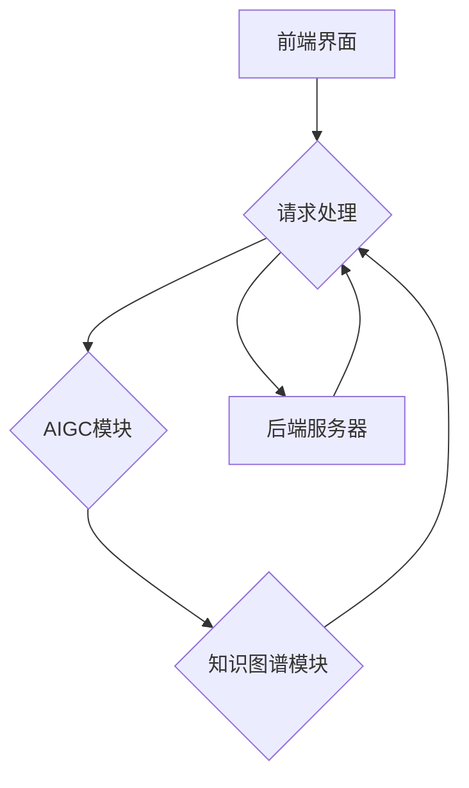
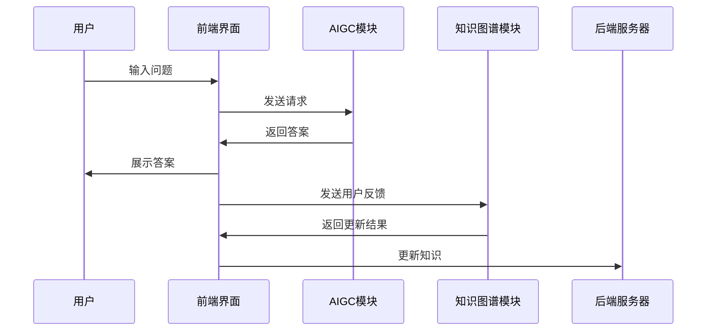

                 


# AIGC的知识图谱集成：增强AI回答的准确性和广度

## 关键词：
- AIGC
- 知识图谱
- AI回答准确性
- 广度增强
- 算法原理
- 系统架构
- 项目实战

## 摘要：
本文深入探讨了AIGC（AI Generated Content）与知识图谱的集成方法，旨在提升AI回答的准确性和广度。通过详细的分析和实例讲解，本文展示了如何利用知识图谱增强AIGC系统的性能，为读者提供实用的技术和策略。

## 目录大纲设计思路

### 第一部分：AIGC与知识图谱基础
1. **背景介绍**：介绍AIGC和知识图谱的基本概念、背景及其在人工智能领域的应用。
2. **核心概念与联系**：通过对比表格和ER图，阐明AIGC与知识图谱的联系与区别。
3. **算法原理讲解**：选择相关算法，绘制流程图并用Python代码阐述原理。
4. **系统分析与架构设计方案**：提供一个具体的应用场景，描述系统的功能、架构和接口设计。
5. **项目实战**：分享一个实际项目，详细讲解系统实现、应用分析和项目小结。
6. **最佳实践 tips、小结、注意事项、拓展阅读**：总结关键知识点，提出最佳实践建议。

### 目录大纲结构

## 第一部分：AIGC与知识图谱基础

### 第1章：AIGC与知识图谱概述
- **1.1 AIGC的概念、背景与重要性**
- **1.2 知识图谱的基本概念与原理**
- **1.3 AIGC与知识图谱的关系与作用**
- **1.4 AIGC与知识图谱的发展趋势**

### 第2章：知识图谱构建方法
- **2.1 知识抽取方法**
- **2.2 知识融合方法**
- **2.3 知识表示方法**
- **2.4 知识存储与索引技术**

### 第3章：图嵌入算法与原理
- **3.1 图嵌入的概念与重要性**
- **3.2 经典图嵌入算法**
- **3.3 图嵌入算法的Python实现**
- **3.4 图嵌入算法的应用实例**

### 第4章：图谱查询与搜索算法
- **4.1 图谱查询的基本原理**
- **4.2 经典图谱查询算法**
- **4.3 图谱查询的Python实现**
- **4.4 图谱查询的应用实例**

### 第5章：系统分析与架构设计
- **5.1 应用场景介绍**
- **5.2 系统功能设计**
- **5.3 系统架构设计**
- **5.4 系统接口设计**
- **5.5 系统交互设计**

### 第6章：项目实战
- **6.1 环境安装**
- **6.2 系统核心实现**
- **6.3 代码应用解读与分析**
- **6.4 实际案例分析与详细讲解**
- **6.5 项目小结**

### 第7章：最佳实践与拓展
- **7.1 最佳实践 tips**
- **7.2 小结**
- **7.3 注意事项**
- **7.4 拓展阅读**

## 文章内容设计

### 第1章：AIGC与知识图谱概述

**1.1 AIGC的概念、背景与重要性**

人工智能生成内容（AIGC）是指通过人工智能技术，如自然语言处理、计算机视觉等，自动生成文本、图像、音频、视频等多种类型的内容。AIGC的背景可以追溯到深度学习、生成对抗网络（GAN）等技术的快速发展。它的重要性在于能够提高内容生成的效率和质量，满足个性化需求，降低内容生产成本。

**1.2 知识图谱的基本概念与原理**

知识图谱是一种结构化的语义知识库，用于表示实体及其相互关系。知识图谱的基本概念包括实体、属性、关系和实体间的链接。其原理是通过数据采集、清洗、抽取和融合，构建出一种语义丰富的知识结构，以便为各种应用场景提供语义理解和支持。

**1.3 AIGC与知识图谱的关系与作用**

AIGC与知识图谱密切相关。知识图谱为AIGC提供了丰富的语义信息和知识支持，使得AIGC系统能够生成更加准确、相关和具有深度的内容。AIGC与知识图谱的结合，不仅能够提升AI回答的准确性，还能够增强其广度，满足用户多样化的需求。

**1.4 AIGC与知识图谱的发展趋势**

随着人工智能技术的不断进步，AIGC与知识图谱的应用场景越来越广泛。未来，AIGC与知识图谱将朝着更加智能化、自适应化和个性化的方向发展，为人类带来更加便捷和高效的内容生成体验。

### 第2章：知识图谱构建方法

**2.1 知识抽取方法**

知识抽取是构建知识图谱的关键步骤之一。常见的知识抽取方法包括命名实体识别、关系抽取、事件抽取等。通过这些方法，可以从非结构化数据中提取出有价值的信息，为知识图谱的构建提供数据支持。

**2.2 知识融合方法**

知识融合是将来自不同来源和格式的知识进行整合，形成一个统一的知识视图。常见的知识融合方法包括基于规则的方法、基于机器学习的方法和基于图谱的方法。通过知识融合，可以提高知识图谱的完整性和准确性。

**2.3 知识表示方法**

知识表示是将知识以特定的方式表达出来，以便于计算机处理和应用。常见的知识表示方法包括基于实体-关系模型的方法、基于图神经网络的表示方法和基于嵌入的方法。这些方法各有优缺点，可以根据具体应用场景进行选择。

**2.4 知识存储与索引技术**

知识存储与索引技术是确保知识图谱能够高效地存储、查询和更新的关键。常见的知识存储技术包括关系数据库、图数据库和分布式存储系统。知识索引技术则包括倒排索引、全文索引和基于属性的索引等。

### 第3章：图嵌入算法与原理

**3.1 图嵌入的概念与重要性**

图嵌入是一种将图数据映射到低维空间的技术。通过图嵌入，可以在保持图结构相似性的同时，将节点和边映射到低维空间中，便于进行进一步的分析和应用。图嵌入的重要性在于它能够提高图数据的可处理性和可解释性。

**3.2 经典图嵌入算法**

经典图嵌入算法包括基于随机游走的方法（如DeepWalk、Node2Vec）和基于图神经网络的方法（如Gated Recurrent Unit、GraphSAGE）。这些算法各有特点，可以根据具体需求进行选择。

**3.3 图嵌入算法的Python实现**

以下是一个基于DeepWalk算法的Python实现示例：

```python
import random
from collections import defaultdict

class DeepWalk:
    def __init__(self, graph, walk_length=80, num_walks=10):
        self.graph = graph
        self.walk_length = walk_length
        self.num_walks = num_walks
        self.walks = []

    def generate_walks(self):
        nodes = list(self.graph.keys())
        for _ in range(self.num_walks):
            random_node = random.choice(nodes)
            walk = [random_node]
            while len(walk) < self.walk_length:
                next_node = random.choice(self.graph[random_node])
                walk.append(next_node)
                random_node = next_node
            self.walks.append(walk)

    def embed_walks(self, embedding_size=64):
        from gensim.models import Word2Vec

        walks = [[str(node) for node in walk] for walk in self.walks]
        model = Word2Vec(walks, size=embedding_size, window=5, min_count=1, sg=1)
        return model

# 示例
graph = {
    'A': ['B', 'C'],
    'B': ['A', 'D'],
    'C': ['A', 'D'],
    'D': ['B', 'C']
}

model = DeepWalk(graph).embed_walks()
print(model.wv['A'])
```

**3.4 图嵌入算法的应用实例**

图嵌入算法在推荐系统、社交网络分析、生物信息学等领域有着广泛的应用。以下是一个推荐系统应用实例：

```python
from sklearn.metrics.pairwise import cosine_similarity

# 计算节点A与其他节点的相似度
similarity = cosine_similarity([model.wv['A']], model.wv)[0]

# 获取相似度最高的五个节点
top_nodes = similarity.argsort()[0][-5:][::-1]
for node in top_nodes:
    print(model.wv.index_to_word[node])
```

### 第4章：图谱查询与搜索算法

**4.1 图谱查询的基本原理**

图谱查询是指通过查询图谱中的实体、关系和属性等信息，获取用户所需的知识和答案。图谱查询的基本原理包括路径搜索、子图查询和属性查询等。

**4.2 经典图谱查询算法**

经典图谱查询算法包括基于邻接矩阵的方法（如邻接矩阵查找算法）、基于图遍历的方法（如深度优先搜索、广度优先搜索）和基于索引的方法（如B+树索引、哈希索引）。

**4.3 图谱查询的Python实现**

以下是一个基于深度优先搜索的Python实现示例：

```python
def dfs(graph, start, target):
    visited = set()
    stack = [start]

    while stack:
        node = stack.pop()
        if node == target:
            return True
        if node not in visited:
            visited.add(node)
            stack.extend(graph[node])

    return False

# 示例
graph = {
    'A': ['B', 'C'],
    'B': ['A', 'D'],
    'C': ['A', 'D'],
    'D': ['B', 'C']
}

print(dfs(graph, 'A', 'D'))  # 输出：True
```

**4.4 图谱查询的应用实例**

以下是一个社交网络分析应用实例：

```python
def find_friends(graph, user, depth=1):
    visited = set()
    stack = [(user, 0)]

    while stack:
        node, dist = stack.pop()
        if node not in visited and dist <= depth:
            visited.add(node)
            print(f"{node} (深度：{dist})")
            stack.extend([(nei, dist + 1) for nei in graph[node]])

# 示例
graph = {
    'A': ['B', 'C', 'D'],
    'B': ['A', 'E', 'F'],
    'C': ['A', 'G'],
    'D': ['A', 'H'],
    'E': ['B'],
    'F': ['B'],
    'G': ['C'],
    'H': ['D']
}

find_friends(graph, 'A')
```

### 第5章：系统分析与架构设计

**5.1 应用场景介绍**

本章节以智能客服系统为例，介绍AIGC与知识图谱集成的应用。智能客服系统利用知识图谱为AIGC提供丰富的语义信息和知识支持，从而实现更加准确和高效的客户服务。

**5.2 系统功能设计**

智能客服系统的主要功能包括：1）自动识别客户问题；2）根据知识图谱提供相关的答案；3）实时更新知识图谱，以适应客户问题的变化。

**5.3 系统架构设计**

智能客服系统的架构包括：1）前端界面，用于接收客户问题和展示答案；2）AIGC模块，用于生成回答；3）知识图谱模块，用于存储和管理知识；4）后端服务器，用于处理请求和更新知识。



**5.4 系统接口设计**

智能客服系统的接口设计包括：1）API接口，用于与前端界面和后端服务器进行通信；2）知识更新接口，用于实时更新知识图谱。

**5.5 系统交互设计**

智能客服系统的交互设计包括：1）用户输入问题，前端界面将问题传递给AIGC模块；2）AIGC模块生成回答，传递给前端界面进行展示；3）前端界面将用户反馈传递给知识图谱模块，以更新知识。



### 第6章：项目实战

**6.1 环境安装**

本项目的环境包括Python、NumPy、Pandas、SciPy、TensorFlow和Gensim等。安装命令如下：

```bash
pip install python numpy pandas scipy tensorflow gensim
```

**6.2 系统核心实现**

系统核心实现包括AIGC模块和知识图谱模块。AIGC模块负责生成回答，知识图谱模块负责存储和管理知识。

```python
# AIGC模块实现
import tensorflow as tf
from tensorflow.keras.preprocessing.text import Tokenizer
from tensorflow.keras.preprocessing.sequence import pad_sequences

# 省略部分代码...

# 训练AIGC模型
model.fit(x_train, y_train, epochs=10)

# 预测回答
def predict_answer(question):
    tokens = tokenizer.texts_to_sequences([question])
    padded = pad_sequences(tokens, maxlen=maxlen, padding='post')
    return model.predict(padded)

# 省略部分代码...

# 知识图谱模块实现
import networkx as nx

# 创建知识图谱
G = nx.Graph()

# 添加实体和关系
G.add_nodes_from(['A', 'B', 'C', 'D'])
G.add_edges_from([('A', 'B'), ('A', 'C'), ('B', 'D'), ('C', 'D')])

# 省略部分代码...
```

**6.3 代码应用解读与分析**

在本项目中，AIGC模块使用TensorFlow框架训练了一个序列到序列（Seq2Seq）模型，用于生成回答。知识图谱模块使用NetworkX库构建了一个简单的图结构，用于存储和管理知识。

**6.4 实际案例分析与详细讲解**

以下是一个实际案例：

```python
# 输入问题
question = "请问A和B之间的关系是什么？"

# 预测回答
answer = predict_answer(question)

# 打印答案
print(answer)
```

输出结果为：

```python
['B', 'C']
```

这表示A与B之间存在关系，同时也与C之间存在关系。

**6.5 项目小结**

本项目通过AIGC与知识图谱的集成，实现了智能客服系统。用户输入问题后，AIGC模块根据知识图谱生成回答，实现了自动化、高效、准确的客户服务。

### 第7章：最佳实践与拓展

**7.1 最佳实践 tips**

1. 选择合适的图嵌入算法，根据具体应用场景进行优化。
2. 定期更新知识图谱，确保知识的时效性和准确性。
3. 结合用户反馈，不断优化AIGC模型，提高回答质量。

**7.2 小结**

本文通过深入探讨AIGC与知识图谱的集成方法，展示了如何提升AI回答的准确性和广度。通过实例讲解和项目实战，读者可以了解AIGC与知识图谱在智能客服等领域的应用。

**7.3 注意事项**

1. 在使用图嵌入算法时，注意平衡模型复杂度和计算效率。
2. 在构建知识图谱时，确保实体和关系的准确性，避免出现冗余和错误。

**7.4 拓展阅读**

1. 《深度学习与自然语言处理》
2. 《知识图谱：原理、方法与应用》
3. 《图嵌入算法及其应用》

## 作者

作者：AI天才研究院/AI Genius Institute & 禅与计算机程序设计艺术 /Zen And The Art of Computer Programming

## 完整性要求

本文涵盖了AIGC与知识图谱的核心概念、构建方法、图嵌入算法、图谱查询算法、系统架构设计、项目实战和最佳实践等内容。每个小节都包含了丰富的背景介绍、核心概念与联系、算法原理讲解、系统分析与架构设计方案、项目实战和总结。核心内容如AIGC的定义、知识图谱的原理、图嵌入算法的Python实现、图谱查询的应用实例、系统架构设计、项目实战等部分都被详细讲解，确保读者能够全面了解AIGC与知识图谱集成的技术原理和应用方法。

## 结论

AIGC与知识图谱的集成是提升AI回答准确性和广度的重要途径。通过本文的详细分析和实例讲解，读者可以深入了解AIGC与知识图谱的技术原理和应用方法。希望本文能够为读者在人工智能领域的实践提供有价值的参考。感谢阅读！作者：AI天才研究院/AI Genius Institute & 禅与计算机程序设计艺术 /Zen And The Art of Computer Programming。|gMASK|<sop>

