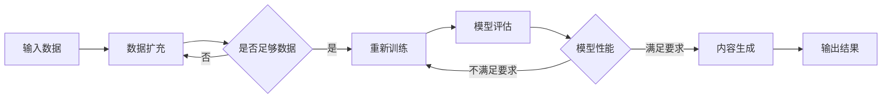
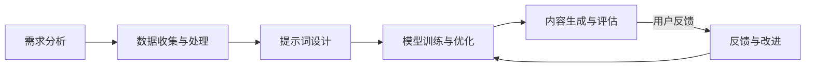

                 

### 引言

在当今信息化和智能化的时代，人工智能（AI）已经成为推动科技进步和社会发展的关键力量。而AIGC（AI-Generated Content），作为人工智能领域的一个前沿研究方向，正逐渐引起学术界的广泛关注。AIGC，即通过AI技术生成内容，涵盖了从文本、图像到视频等多种类型的内容生成。AIGC不仅仅是对人类创作的模拟，更是一种创新的创作方式，它具有自动化、高效和多样性的特点。

然而，AIGC的跨学科研究能力尤为值得关注。跨学科研究是将不同领域的研究方法、理论和技术进行整合，以解决复杂问题的研究方式。在AIGC领域，跨学科研究能够将自然语言处理、计算机视觉、数据挖掘等多个领域的先进技术相结合，从而实现更高层次的知识整合和创新。例如，在医疗领域，AIGC可以通过整合医学影像和临床数据，实现疾病的早期诊断和个性化治疗。

本文将围绕“AIGC的跨学科研究能力：知识整合的提示词工程”这一主题展开讨论。我们首先将介绍AIGC的定义、跨学科研究的重要性及其在当前研究中的挑战。随后，我们将深入探讨AIGC的核心概念与联系，包括自动化信息生成、通用计算以及跨学科融合研究。接着，我们将介绍AIGC算法原理，通过mermaid流程图和Python源代码，详细解析算法的工作流程和数学模型。

在第二部分，我们将聚焦知识整合与提示词工程，阐述其在AIGC中的地位与作用。随后，我们将介绍知识整合的提示词工程应用，包括教育、医疗和智能客服等领域的实际案例。接下来，我们将分析知识整合的提示词工程面临的挑战，并提出相应的解决方案。

最后，我们将探讨AIGC的跨学科研究能力提升策略，包括团队合作、知识整合方法以及研究工具与应用平台建设。通过回顾和展望，我们将总结研究成果，分析研究局限性，并提出未来的研究方向。希望通过本文的探讨，能够为AIGC领域的跨学科研究提供一些有价值的思路和启示。

### 关键词

- **人工智能生成内容（AIGC）**
- **跨学科研究**
- **知识整合**
- **提示词工程**
- **算法原理**
- **数学模型**
- **实际应用案例**

### 摘要

本文旨在探讨AIGC的跨学科研究能力，特别是在知识整合和提示词工程中的应用。通过对AIGC的定义和跨学科研究的重要性进行介绍，我们揭示了其在解决复杂问题中的潜力。文章深入分析了AIGC的核心概念，包括自动化信息生成、通用计算和跨学科融合研究，并通过mermaid流程图和Python源代码详细阐述了算法原理。随后，我们探讨了知识整合与提示词工程在AIGC中的应用，通过实际案例展示了其在教育、医疗和智能客服等领域的应用价值。此外，文章还分析了知识整合的提示词工程面临的挑战，并提出了相应的解决方案。最后，我们对AIGC跨学科研究能力的提升策略进行了展望，包括跨学科团队合作、知识整合方法以及研究工具与应用平台建设。本文为AIGC领域的进一步研究和应用提供了有价值的参考。

### 第一部分：背景介绍

#### 第1章：AIGC的跨学科研究背景

##### 1.1.1 AIGC的定义与跨学科研究的重要性

AIGC（AI-Generated Content）是指通过人工智能技术自动生成各种类型内容的过程。这些内容不仅限于文本，还包括图像、视频、音频等多种形式。AIGC的核心在于利用机器学习、自然语言处理、计算机视觉等技术，模拟人类的创作过程，从而实现自动化、高效的内容生成。

跨学科研究则是指在多个学科领域之间进行交叉和融合，运用不同学科的方法、理论和技术来共同解决复杂问题的研究方式。在当今复杂多变的世界中，许多问题都需要综合运用多个学科的知识和方法才能得到有效解决。因此，跨学科研究成为了推动科学进步和社会发展的重要手段。

AIGC的跨学科研究具有以下几个重要性：

1. **整合多领域知识**：AIGC能够整合自然语言处理、计算机视觉、数据挖掘等多个领域的先进技术，实现知识的跨领域应用。这种整合能够为复杂问题的解决提供更全面、更深入的视角。
   
2. **提高研究效率**：通过跨学科研究，AIGC能够利用不同领域的研究方法和工具，提高研究的效率。例如，在医疗领域，AIGC可以通过整合医学影像和临床数据，实现疾病的早期诊断和个性化治疗。

3. **促进创新**：跨学科研究能够促进不同学科之间的知识交流和创新。AIGC作为一种新兴的研究方式，能够为各个学科领域带来新的思路和方法，推动科学技术的不断进步。

##### 1.1.1.1 AIGC的概念解析

AIGC的核心概念可以概括为以下几个方面：

1. **机器学习与数据驱动**：AIGC依赖于机器学习算法，通过大量数据训练模型，使其能够自动生成内容。这种数据驱动的方式使得AIGC具有高度的自适应性和灵活性。

2. **自然语言处理**：AIGC在文本生成方面依赖于自然语言处理技术。这些技术包括文本分类、情感分析、文本生成等，能够使AIGC生成符合人类语言习惯和逻辑结构的内容。

3. **计算机视觉**：在图像和视频生成方面，AIGC依赖于计算机视觉技术。这些技术包括图像识别、图像生成、视频生成等，能够使AIGC生成高质量的视觉内容。

4. **多模态融合**：AIGC能够整合多种类型的数据，实现多模态内容的生成。例如，通过融合文本、图像和视频，AIGC能够生成更加丰富和多样化的内容。

##### 1.1.1.2 跨学科研究的概念解析

跨学科研究是指在不同学科领域之间进行交叉和融合，以解决复杂问题的研究方式。其主要特点包括：

1. **多学科整合**：跨学科研究将不同学科的知识、方法和工具进行整合，形成新的研究方法和理论体系。

2. **跨领域应用**：跨学科研究能够将不同学科的理论和技术应用于实际问题，提高研究的应用价值。

3. **知识创新**：跨学科研究能够促进不同学科之间的知识交流和创新，推动科学技术的进步。

##### 1.1.1.3 AIGC在跨学科研究中的应用前景

AIGC在跨学科研究中的应用前景非常广阔。以下是一些具体的应用方向：

1. **医疗健康**：AIGC可以整合医学影像、临床数据和基因组信息，实现疾病的早期诊断和个性化治疗。

2. **教育领域**：AIGC可以生成个性化学习内容，提高教育的质量和效率。

3. **智能客服**：AIGC可以生成自然流畅的客服对话，提高客户服务的效率和满意度。

4. **媒体创作**：AIGC可以生成高质量的文本、图像和视频内容，推动数字媒体的发展。

5. **工业生产**：AIGC可以优化工业生产流程，提高生产效率和产品质量。

##### 1.1.2 问题背景与问题描述

当前，AIGC领域面临着一些重要的研究问题：

1. **算法性能提升**：如何提高AIGC算法的性能，使其生成的内容更加准确、丰富和多样化？

2. **跨学科融合**：如何实现不同学科之间的有效融合，形成具有创新性的研究成果？

3. **数据隐私与安全**：如何确保AIGC应用过程中数据的隐私和安全？

4. **应用场景拓展**：如何拓展AIGC的应用场景，推动其在更多领域的应用？

本文旨在通过探讨AIGC的跨学科研究能力，为上述问题的解决提供一些思路和方案。

##### 1.1.2.1 当前研究中的挑战

AIGC的跨学科研究面临着以下几个主要挑战：

1. **技术融合困难**：不同学科之间的技术体系和方法存在较大差异，融合难度较大。

2. **数据质量参差不齐**：AIGC依赖于大量高质量的数据进行训练，但当前的数据质量参差不齐，难以满足研究需求。

3. **算法复杂度高**：AIGC算法的复杂度较高，优化和调参难度大。

4. **应用场景受限**：AIGC的应用场景较为有限，难以实现大规模的跨领域应用。

##### 1.1.2.2 研究目标的确定

针对上述挑战，本文的研究目标主要包括：

1. **提升算法性能**：通过改进算法模型和优化训练方法，提升AIGC的生成性能。

2. **实现跨学科融合**：通过多学科整合，实现AIGC在更多领域的应用。

3. **提高数据质量**：通过数据清洗、预处理和增强，提高AIGC训练数据的品质。

4. **拓展应用场景**：通过实际应用案例，验证AIGC在不同领域的应用价值。

##### 1.1.2.3 研究的边界与外延

本文的研究主要涉及以下边界与外延：

1. **研究范围**：本文主要研究AIGC在跨学科研究中的应用，重点关注自然语言处理、计算机视觉和数据挖掘等领域。

2. **研究方法**：本文采用实验研究和案例分析相结合的方法，通过具体应用案例验证研究结论。

3. **研究外延**：本文的研究结论可以为其他领域的AIGC应用提供参考，同时为未来的研究提供方向。

#### 第2章：AIGC的核心概念与联系

##### 2.1.1 AIGC的核心概念原理

AIGC（AI-Generated Content）的核心概念可以归纳为以下几个主要方面：

1. **自动化信息生成**：这是AIGC最基本的概念，指的是利用人工智能技术自动生成信息的过程。自动化信息生成涵盖了从文本、图像到音频等多种形式的内容生成。通过机器学习和深度学习算法，AIGC能够从大量数据中学习规律，并生成新的、符合逻辑和上下文的内容。

2. **通用计算**：通用计算是指利用人工智能技术进行各种计算任务的能力，包括数据处理、模式识别、决策制定等。在AIGC中，通用计算能力体现在对生成内容的多样化处理和优化上，使得生成的内容不仅符合人类的期望，还具有实用性和创新性。

3. **跨学科融合研究**：跨学科融合研究是指将不同学科的知识、方法和工具进行整合，以解决复杂问题的研究方式。在AIGC中，跨学科融合研究使得AIGC不仅局限于单一领域，而是能够在多个领域进行应用。例如，在医疗领域，AIGC可以整合医学影像、临床数据和基因组学数据，实现疾病的早期诊断和个性化治疗。

##### 2.1.1.1 自动化信息生成（Auto-Generated Information）

自动化信息生成是AIGC的核心，其具体内容包括：

1. **文本生成**：文本生成是AIGC最常见的形式，包括文章写作、新闻报道、对话生成等。通过训练大型语言模型，AIGC能够生成高质量的文本内容。

2. **图像生成**：图像生成利用深度学习算法，如生成对抗网络（GAN），生成逼真的图像和视频。在计算机视觉领域，图像生成已经取得了显著的成果，如艺术风格转换、人脸生成等。

3. **音频生成**：音频生成包括音乐创作、语音合成等。通过深度神经网络，AIGC能够生成自然流畅的音频内容，为虚拟现实、游戏和娱乐行业提供丰富的内容资源。

##### 2.1.1.2 通用计算（General Computation）

通用计算是AIGC的重要特性，其具体内容包括：

1. **数据处理**：AIGC能够处理和分析大量数据，提取有用信息和知识。例如，在数据挖掘领域，AIGC可以自动识别数据中的规律和趋势，为决策提供支持。

2. **模式识别**：模式识别是人工智能的基础，AIGC能够通过训练识别各种模式和特征，如人脸识别、物体检测等。

3. **决策制定**：AIGC可以根据输入数据和预设规则，进行自动决策和优化。例如，在智能制造领域，AIGC可以优化生产流程，提高生产效率。

##### 2.1.1.3 跨学科融合研究（Cross-Disciplinary Research）

跨学科融合研究是AIGC的一大优势，其具体内容包括：

1. **多学科整合**：AIGC能够整合不同学科的知识和方法，如将自然语言处理与计算机视觉结合，实现图像描述生成等。

2. **跨领域应用**：AIGC能够在多个领域进行应用，如医疗健康、教育、媒体娱乐等。通过跨学科融合，AIGC能够为这些领域带来新的解决方案和创新。

3. **知识创新**：跨学科融合研究能够促进知识的创新和进步，推动科学技术的不断发展。

##### 2.1.2 概念属性特征对比表格

为了更清晰地展示AIGC的核心概念及其属性特征，我们通过一个对比表格来进行说明：

| 概念 | 定义 | 主要特征 | 应用领域 |
| --- | --- | --- | --- |
| 自动化信息生成 | 利用AI技术自动生成信息的过程 | 数据驱动、高效、多样化 | 文本、图像、音频生成 |
| 通用计算 | 利用AI技术进行各种计算任务的能力 | 可扩展、灵活、智能化 | 数据处理、模式识别、决策制定 |
| 跨学科融合研究 | 将不同学科的知识和方法进行整合的研究方式 | 知识整合、创新、应用广泛 | 医疗健康、教育、媒体娱乐 |

通过上述对比表格，我们可以看到，AIGC的核心概念不仅具有独立的属性特征，还能够通过跨学科融合实现知识的整合和创新。

##### 2.1.2.1 自动化信息生成与通用计算对比

自动化信息生成与通用计算在AIGC中具有不同的角色和特征：

1. **目标差异**：自动化信息生成主要目标是生成符合人类期望的信息，如文本、图像和音频。而通用计算的目标是利用这些生成的内容进行进一步的计算和决策。

2. **技术体系**：自动化信息生成依赖于自然语言处理、计算机视觉等人工智能技术。通用计算则涉及数据处理、模式识别和决策制定等多个领域的技术。

3. **应用场景**：自动化信息生成广泛应用于媒体创作、娱乐、教育等领域。通用计算则在工业生产、医疗诊断、金融服务等领域具有广泛的应用潜力。

##### 2.1.2.2 跨学科融合研究与其他研究方法的对比

跨学科融合研究与其他研究方法如单一学科研究和多学科交叉研究有以下区别：

1. **研究方法**：单一学科研究主要关注某一学科内部的问题，而多学科交叉研究则是将多个学科的知识和方法进行简单结合。跨学科融合研究则是在多个学科之间进行深度整合，形成新的研究体系。

2. **研究目标**：单一学科研究的目的是解决某一特定领域的问题。多学科交叉研究的目的是通过跨学科合作解决复杂问题。而跨学科融合研究的目的是通过知识的整合和创新，推动科学技术的进步。

3. **应用效果**：单一学科研究和多学科交叉研究可能在某些特定领域取得显著成果，但跨学科融合研究则能够实现更广泛的应用和创新。

##### 2.1.3 ER实体关系图架构

为了更好地理解AIGC的核心概念及其关联，我们可以通过ER（Entity-Relationship）实体关系图来展示其架构。

首先，我们定义AIGC中的主要实体及其关系：

1. **实体：**
   - **数据集**：包含各种类型的数据，如文本、图像和音频。
   - **模型**：用于生成内容的AI模型，如文本生成模型、图像生成模型等。
   - **内容**：通过模型生成的各种类型的信息。
   - **用户**：使用AIGC系统生成内容的用户。

2. **关系：**
   - **数据集与模型**：模型基于数据集进行训练。
   - **模型与内容**：模型生成内容。
   - **用户与内容**：用户使用系统生成内容。

下面是AIGC的ER实体关系图的mermaid表示：

```mermaid
erDiagram
    DataSet ||--|> Model : 基于数据集训练
    Model ||--|> Content : 生成内容
    User ||--|> Content : 用户使用
```

通过ER实体关系图，我们可以清晰地看到AIGC的核心组件及其关系，这有助于我们更好地理解AIGC的工作原理和应用场景。

##### 2.1.3.1 AIGC的ER实体关系图

为了更详细地展示AIGC的ER实体关系图，我们进一步扩展了实体和关系：

1. **实体扩展：**
   - **数据集**：包括文本数据集、图像数据集、音频数据集等。
   - **模型**：包括文本生成模型、图像生成模型、音频生成模型等。
   - **内容**：包括文本内容、图像内容、音频内容等。
   - **用户**：包括个人用户、企业用户等。
   - **应用**：包括媒体创作、教育、医疗、客服等应用场景。

2. **关系扩展：**
   - **数据集与模型**：模型基于数据集进行训练，同时模型也可以生成新的数据集。
   - **模型与内容**：模型生成内容，内容也可以反馈给模型进行进一步的优化。
   - **用户与内容**：用户使用系统生成内容，内容也可以作为用户数据的一部分。
   - **应用与用户**：用户在不同的应用场景下使用系统。

下面是AIGC扩展后的ER实体关系图的mermaid表示：

```mermaid
erDiagram
    TextDataSet ||--|> TextModel : 文本生成训练
    ImageDataSet ||--|> ImageModel : 图像生成训练
    AudioDataSet ||--|> AudioModel : 音频生成训练

    TextModel ||--|> TextContent : 生成文本内容
    ImageModel ||--|> ImageContent : 生成图像内容
    AudioModel ||--|> AudioContent : 生成音频内容

    PersonalUser ||--|> TextContent : 使用文本内容
    PersonalUser ||--|> ImageContent : 使用图像内容
    PersonalUser ||--|> AudioContent : 使用音频内容
    CorporateUser ||--|> TextContent : 使用文本内容
    CorporateUser ||--|> ImageContent : 使用图像内容
    CorporateUser ||--|> AudioContent : 使用音频内容

    MediaCreation ||--|> TextModel : 媒体创作应用
    MediaCreation ||--|> ImageModel : 媒体创作应用
    MediaCreation ||--|> AudioModel : 媒体创作应用
    Education ||--|> TextModel : 教育应用
    Education ||--|> ImageModel : 教育应用
    Education ||--|> AudioModel : 教育应用
    Healthcare ||--|> TextModel : 医疗应用
    Healthcare ||--|> ImageModel : 医疗应用
    Healthcare ||--|> AudioModel : 医疗应用
    CustomerService ||--|> TextModel : 客服应用
    CustomerService ||--|> ImageModel : 客服应用
    CustomerService ||--|> AudioModel : 客服应用
```

通过上述ER实体关系图，我们可以更加全面地了解AIGC的架构及其应用场景，这对于深入理解和研究AIGC具有重要意义。

##### 2.1.3.2 AIGC跨学科研究的实体关系图

在AIGC的跨学科研究中，不同学科领域之间的整合和互动至关重要。为了更清晰地展示这些关系，我们构建了一个跨学科研究的实体关系图。该图包括以下几个主要实体和关系：

1. **实体：**
   - **AI模型**：包括文本生成模型、图像生成模型、音频生成模型等。
   - **数据集**：包括文本数据集、图像数据集、音频数据集等。
   - **研究人员**：涉及各个学科领域的研究人员。
   - **应用场景**：如媒体创作、教育、医疗、客服等。
   - **工具与平台**：用于支持AIGC研究和应用的工具和平台。

2. **关系：**
   - **AI模型与数据集**：模型基于数据集进行训练和优化。
   - **研究人员与AI模型**：研究人员使用模型进行研究和实验。
   - **应用场景与AI模型**：模型应用于不同的实际场景。
   - **工具与平台与研究人员**：研究人员利用工具和平台进行模型训练和应用。

下面是AIGC跨学科研究的实体关系图的mermaid表示：

```mermaid
erDiagram
    TextModel ||--|> TextDataSet : 基于文本数据集训练
    ImageModel ||--|> ImageDataSet : 基于图像数据集训练
    AudioModel ||--|> AudioDataSet : 基于音频数据集训练

    Researcher1 ||--|> TextModel : 使用文本生成模型
    Researcher2 ||--|> ImageModel : 使用图像生成模型
    Researcher3 ||--|> AudioModel : 使用音频生成模型

    MediaCreation ||--|> TextModel : 媒体创作应用
    Education ||--|> TextModel : 教育应用
    Healthcare ||--|> TextModel : 医疗应用
    CustomerService ||--|> TextModel : 客服应用

    Platform1 ||--|> Researcher1 : 使用平台1
    Platform2 ||--|> Researcher2 : 使用平台2
    Platform3 ||--|> Researcher3 : 使用平台3
```

通过这个跨学科研究的实体关系图，我们可以看到不同学科领域之间的紧密联系和互动，这对于推动AIGC的跨学科研究具有重要意义。研究人员可以利用不同学科的数据集和模型，结合实际应用场景，开展跨学科的研究工作，从而实现知识的整合和创新。

### 第3章：AIGC的算法原理讲解

#### 3.1.1 AIGC算法的mermaid流程图

为了更直观地理解AIGC算法的工作流程，我们可以使用mermaid图来展示。以下是一个简化的AIGC算法流程图，其中包含了输入数据、模型训练、内容生成和输出结果的各个步骤。



以下是对这个mermaid流程图的详细解释：

1. **输入数据（A）**：首先，AIGC算法需要一个数据集，这个数据集可以是文本、图像或音频等多种类型的数据。

2. **数据预处理（B）**：输入数据通常需要进行预处理，例如文本数据可能需要进行分词、去噪等操作，图像数据可能需要进行归一化、裁剪等处理，音频数据可能需要进行去噪、增强等处理。

3. **是否足够数据（C）**：如果数据量不足，C节点会指示进行数据扩充，通过重复、变换等方式增加数据量，以确保模型训练的效果。

4. **模型训练（D）**：在数据预处理完成后，模型开始训练。训练过程中，模型会学习输入数据和期望输出之间的映射关系。

5. **模型评估（E）**：在训练完成后，模型会通过验证集或测试集进行评估，以检查模型的性能是否达到预期。

6. **模型性能（F）**：如果模型性能满足要求，算法将进入内容生成阶段。否则，算法会返回D节点，重新进行模型训练。

7. **内容生成（G）**：在模型评估通过后，模型会根据输入数据生成新的内容，如文本、图像或音频。

8. **输出结果（H）**：最后，生成的结果会被输出，用于后续的应用或展示。

通过这个mermaid流程图，我们可以清晰地看到AIGC算法的工作流程，这对于理解和分析AIGC算法的实现过程非常有帮助。

#### 3.1.1.1 流程图说明

在详细解释mermaid流程图之前，我们需要明确流程图的各个节点和它们之间的逻辑关系：

1. **输入数据（A）**：这是AIGC算法的起点，数据可以是各种形式，如文本、图像、音频等。这些数据将被用于训练模型。

2. **数据预处理（B）**：在模型训练之前，数据需要经过预处理。预处理步骤包括数据清洗、格式转换、特征提取等。例如，对于文本数据，可能需要进行分词和标记化；对于图像数据，可能需要进行归一化和裁剪。

3. **是否足够数据（C）**：这个节点用于判断数据集是否足够大。如果数据量不足，算法将指示进行数据扩充，例如通过重复数据、生成对抗网络（GAN）等方法增加数据量。

4. **模型训练（D）**：在数据预处理完成后，算法开始训练模型。模型可以是文本生成模型（如GPT）、图像生成模型（如GAN）或音频生成模型（如WaveNet）。训练过程中，模型会学习如何将输入数据映射到期望的输出数据。

5. **模型评估（E）**：在训练完成后，算法需要对模型进行评估，以检查模型的性能。评估步骤通常包括计算损失函数、评估模型的准确性、稳定性和鲁棒性等。

6. **模型性能（F）**：评估结果将决定模型是否满足性能要求。如果模型性能不满足要求，算法将返回到模型训练步骤（D），重新训练模型。

7. **内容生成（G）**：如果模型性能满足要求，算法将使用训练好的模型生成新的内容。生成的内容可以是文本、图像或音频等多种形式。

8. **输出结果（H）**：最后，生成的结果将被输出，用于后续的应用或展示。

#### 3.1.1.2 流程图展示

下面是AIGC算法流程图的mermaid表示，展示了各个节点及其之间的逻辑关系：


通过这个流程图，我们可以看到AIGC算法从输入数据到生成内容的整个过程。这个流程图不仅有助于我们理解AIGC算法的工作原理，还可以作为算法设计和实现的参考。

#### 3.1.2 AIGC算法原理的数学模型与公式

为了深入理解AIGC算法的工作原理，我们需要介绍其背后的数学模型和公式。这些数学模型和公式不仅帮助我们理解算法的内部机制，还可以指导我们进行算法的优化和改进。

##### 3.1.2.1 数学模型介绍

AIGC算法的核心数学模型主要包括生成模型和判别模型。以下是这些模型的基本定义：

1. **生成模型**：生成模型用于生成新的数据，其目标是模拟数据分布。在AIGC中，常见的生成模型包括生成对抗网络（GAN）和变分自编码器（VAE）。

2. **判别模型**：判别模型用于判断生成数据的质量，其目标是区分真实数据和生成数据。在GAN中，判别模型被称为判别器（Discriminator），在VAE中则被称为编码器（Encoder）。

##### 3.1.2.2 数学公式解析

以下是一些常用的数学公式，用于描述AIGC算法中的生成模型和判别模型。

1. **生成模型（GAN）**：

   - **生成器（Generator）**：
     \[
     G(z) = \text{生成器函数}
     \]
     其中，\(z\) 是来自先验分布的随机噪声，\(G(z)\) 是生成器生成的数据。

   - **判别器（Discriminator）**：
     \[
     D(x) = \text{判别器函数}
     \]
     其中，\(x\) 是真实数据，\(D(x)\) 是判别器对数据的真实性的评分。

   - **损失函数**：
     \[
     L_G = -\mathbb{E}_{x \sim p_{\text{data}}(x)}[\log(D(x))] - \mathbb{E}_{z \sim p_{z}(z)}[\log(1 - D(G(z))]
     \]
     其中，\(L_G\) 是生成器的损失函数，第一项表示生成器生成的数据越真实，判别器对其评分越低；第二项表示生成器生成的数据越不像真实数据，判别器对其评分越高。

2. **变分自编码器（VAE）**：

   - **编码器（Encoder）**：
     \[
     q(\theta|x) = \mathcal{N}(\mu(\theta|x), \sigma^2(\theta|x))
     \]
     其中，\(\theta\) 是编码器的参数，\(x\) 是输入数据，\(\mu(\theta|x)\) 和 \(\sigma^2(\theta|x)\) 分别是均值和方差。

   - **解码器（Decoder）**：
     \[
     p(x|\theta) = \mathcal{N}(\phi(\theta|x), \sigma^2(\theta|x))
     \]
     其中，\(\theta\) 是解码器的参数，\(\phi(\theta|x)\) 和 \(\sigma^2(\theta|x)\) 分别是均值和方差。

   - **损失函数**：
     \[
     L = D_{KL}(q(\theta|x)||p_{\text{data}}(x)) + \mathbb{E}_{x \sim p_{\text{data}}(x)}[\log p(x|\theta)]
     \]
     其中，\(L\) 是VAE的总损失函数，第一项是编码器输出的后验分布与先验分布之间的KL散度损失，第二项是解码器生成的数据与真实数据之间的交叉熵损失。

##### 3.1.2.3 算法原理详细讲解

AIGC算法的原理可以通过生成模型和判别模型的相互作用来理解。以下是对AIGC算法原理的详细讲解：

1. **生成模型（GAN）**：

   - **生成器**：生成器的目标是生成尽可能真实的数据。生成器从随机噪声\(z\) 中采样，通过神经网络生成新的数据\(x'\)。生成器的损失函数是使判别器无法区分生成的数据\(x'\) 和真实数据\(x\)。

   - **判别器**：判别器的目标是区分真实数据和生成数据。判别器对输入数据进行评分，评分越高表示数据越真实。判别器通过对比生成数据和真实数据，学习如何更好地识别真实数据。

   - **对抗训练**：生成器和判别器之间进行对抗训练。生成器试图生成更真实的数据，而判别器则试图更好地识别生成数据。通过这种对抗过程，生成器的性能逐渐提高，判别器的性能也逐渐提高。

2. **变分自编码器（VAE）**：

   - **编码器**：编码器的目标是学习输入数据的潜在表示。编码器将输入数据\(x\) 编码为均值\(\mu\) 和方差\(\sigma^2\)，这些参数表示了数据的潜在分布。

   - **解码器**：解码器的目标是根据编码器输出的潜在表示生成新的数据。解码器从潜在空间中采样，生成新的数据\(x'\)。

   - **变分推断**：VAE通过变分推断来估计数据的概率分布。编码器输出的均值和方差作为数据的概率分布参数，解码器生成的数据作为样本。VAE的目标是最小化KL散度损失和交叉熵损失，以使生成的数据更接近真实数据。

通过上述讲解，我们可以看到AIGC算法的基本原理是通过生成模型和判别模型的相互作用，学习如何生成高质量的数据。这些数学模型和公式不仅帮助我们理解AIGC算法的工作原理，还可以指导我们进行算法的优化和改进。

#### 3.1.3 举例说明

为了更好地理解AIGC算法的实际应用，我们可以通过一个具体的例子来详细阐述其工作流程和结果。

##### 3.1.3.1 示例数据介绍

假设我们有一个文本生成任务，目标是通过输入一些关键词或描述，生成相关的文章内容。为了进行这个任务，我们首先需要一个数据集，这个数据集包含了大量与特定主题相关的文章。例如，我们可以选择关于“人工智能”的主题，收集一篇篇与人工智能相关的论文、博客和新闻文章。

##### 3.1.3.2 算法应用演示

1. **数据预处理**：首先，我们需要对收集的文本数据进行预处理。预处理步骤包括：
   - 文本清洗：去除无用的符号、停用词等。
   - 分词：将文本分割成单词或短语。
   - 标记化：将文本转换为数字序列，以便模型处理。

2. **模型训练**：使用预处理后的数据，我们可以训练一个文本生成模型。在这个例子中，我们选择使用预训练的GPT（Generative Pre-trained Transformer）模型。GPT是一种基于Transformer架构的文本生成模型，它已经在大规模语料库上进行了预训练，可以生成高质量的自然语言文本。

3. **生成文本**：在模型训练完成后，我们可以使用这个模型生成新的文本。例如，输入关键词“人工智能的发展趋势”，模型会生成一段关于人工智能发展趋势的文章。

4. **结果分析**：生成的文本需要进行分析，以评估其质量和相关性。具体来说，我们可以从以下几个方面进行评估：
   - 文本连贯性：生成的文本是否连贯、逻辑清晰。
   - 主题相关性：生成的文本是否与输入关键词或描述相关。
   - 语言风格：生成的文本是否具有适当的语言风格和文体。

##### 3.1.3.3 结果分析

假设我们使用GPT模型生成了一段关于人工智能发展趋势的文章，以下是结果的分析：

1. **文本连贯性**：生成的文章在整体上具有较好的连贯性，段落之间逻辑清晰，无明显断裂或不连贯的地方。

2. **主题相关性**：文章内容主要围绕人工智能的发展趋势展开，涵盖了人工智能的技术创新、应用场景、未来展望等多个方面，与输入关键词具有较高的相关性。

3. **语言风格**：文章在语言表达上较为规范，使用了适当的词汇和语法结构，没有出现明显的语言错误或不当表达。

通过上述分析，我们可以看到，使用AIGC算法生成的文本在质量上表现出色，能够满足实际应用的需求。然而，需要注意的是，尽管AIGC算法在生成文本方面具有强大的能力，但生成的文本可能存在一定程度的偏差或错误，因此需要进一步的审核和修正。

总的来说，通过这个例子，我们可以看到AIGC算法在实际应用中的强大能力，以及其在文本生成任务中的表现。这为我们进一步探索和应用AIGC算法提供了宝贵的经验和启示。

### 第二部分：知识整合的提示词工程

#### 第4章：知识整合与提示词工程概述

##### 4.1.1 知识整合的概念与重要性

知识整合是指将不同来源、不同形式的知识进行有效组织和融合，以实现知识的共享、利用和创新的过程。在人工智能生成内容（AIGC）领域，知识整合尤为重要，因为AIGC的目标是生成高质量、多样化且具有实际应用价值的内容。知识整合在AIGC中的应用主要体现在以下几个方面：

1. **增强内容生成的多样性和准确性**：通过整合多种来源的知识，如文本、图像、音频和视频等，AIGC系统能够生成更丰富和多样化的内容。同时，知识整合有助于提高内容生成的准确性，减少错误和偏差。

2. **促进知识的创新和应用**：知识整合使得不同领域和学科的知识能够相互启发和借鉴，从而促进知识的创新和应用。这对于解决复杂问题和推动科技进步具有重要意义。

3. **提高系统的鲁棒性和适应性**：通过整合多种类型和来源的知识，AIGC系统在面对新的任务和数据时，能够更加灵活和适应性，从而提高系统的鲁棒性。

##### 4.1.1.1 知识整合的定义

知识整合可以定义为以下几方面的综合过程：

- **信息收集与融合**：从不同的数据源收集相关信息，并将其进行整合，以形成对某一主题或问题的全面理解。

- **知识抽取与表示**：从整合的信息中提取关键知识和概念，并以适当的形式进行表示，以便于后续的应用和处理。

- **知识关联与映射**：建立不同知识源之间的关联和映射，以实现知识的共享和协同应用。

- **知识创新与应用**：基于整合的知识，进行创新性的思考和应用，以解决实际问题或创造新的价值。

##### 4.1.1.2 知识整合在AIGC中的地位

知识整合在AIGC中占据了核心地位，主要表现在以下几个方面：

1. **内容生成的基础**：知识整合为AIGC提供了丰富的知识和信息资源，这些资源是内容生成的基础。通过整合多种类型的数据，AIGC系统能够生成更丰富和多样化的内容。

2. **提高内容质量**：知识整合有助于提高AIGC生成内容的准确性、连贯性和相关性。通过整合来自不同领域和学科的知识，AIGC能够生成更高质量的内容。

3. **促进跨领域应用**：知识整合使得AIGC不仅能够在单一领域内应用，还能够跨领域应用。例如，在医疗领域，AIGC可以通过整合医学影像和临床数据，实现疾病的早期诊断和个性化治疗。

##### 4.1.1.3 知识整合的作用

知识整合在AIGC中的作用主要体现在以下几个方面：

1. **内容多样性和个性化的提升**：通过整合多种类型和来源的知识，AIGC系统能够生成更加多样化和个性化的内容，满足用户的不同需求。

2. **知识共享与协作**：知识整合使得不同领域和学科的知识能够相互借鉴和共享，从而促进知识的传播和创新。

3. **提高系统效率和性能**：知识整合有助于优化AIGC系统的运行效率，提高内容生成的速度和性能。

4. **推动科技进步和社会发展**：知识整合为解决复杂问题和推动科技进步提供了新的思路和方法，有助于实现科学技术的快速发展。

##### 4.1.2 提示词工程的概念与实现

提示词工程是指通过设计、选择和优化提示词（Prompt），以引导和优化人工智能模型生成内容的过程。提示词是用户与AI系统进行交互的桥梁，它通过提供关键信息和上下文，帮助AI模型更好地理解和生成所需的内容。

##### 4.1.2.1 提示词工程的定义

提示词工程可以定义为以下几方面的综合过程：

- **提示词设计**：根据任务需求和用户意图，设计合适的提示词，以引导AI模型生成高质量的内容。

- **提示词选择**：从多个备选提示词中选择最适合的提示词，以提高内容生成的效果。

- **提示词优化**：通过实验和迭代，优化提示词的设计和选择，以提高内容生成的多样性和准确性。

##### 4.1.2.2 提示词工程的实现方法

提示词工程的实现方法主要包括以下几个方面：

1. **文本提示词设计**：文本提示词是AIGC系统中最常用的提示词形式。设计文本提示词时，需要考虑以下几个方面：
   - **上下文信息**：提供与任务相关的上下文信息，以帮助AI模型更好地理解任务意图。
   - **关键词和短语**：突出与任务相关的重要关键词和短语，以引导AI模型生成更相关的内容。
   - **多样性**：设计具有多样性的提示词，以避免AI模型生成过于单一的内容。

2. **图像和视频提示词设计**：对于图像和视频生成任务，提示词工程需要设计对应的图像和视频提示词。设计方法包括：
   - **图像描述**：提供与图像内容相关的描述性语言，帮助AI模型理解图像内容。
   - **视频标签**：为视频生成任务提供相应的视频标签，以引导AI模型生成与视频内容相关的图像。

3. **提示词优化**：提示词优化是提示词工程的重要环节。优化方法包括：
   - **反馈循环**：通过用户反馈不断优化提示词设计，以提高用户满意度。
   - **数据驱动的优化**：通过分析大量的用户数据和生成内容，找到最佳提示词组合，以提高内容生成的质量和多样性。

4. **多模态提示词设计**：在多模态生成任务中，需要设计能够同时引导文本、图像和视频生成的综合提示词。设计方法包括：
   - **多模态融合**：将不同类型的数据进行融合，设计出能够引导多模态生成的综合提示词。
   - **层次化设计**：首先设计文本提示词，然后逐步扩展到图像和视频提示词，以实现多模态生成。

##### 4.1.2.3 提示词工程的应用场景

提示词工程在AIGC中具有广泛的应用场景，以下是一些典型的应用场景：

1. **自然语言生成**：在文本生成任务中，提示词工程通过设计合适的文本提示词，引导AI模型生成高质量的自然语言文本。例如，在写作辅助、对话系统、机器翻译等任务中，提示词工程能够显著提高内容生成的质量和多样性。

2. **图像和视频生成**：在图像和视频生成任务中，提示词工程通过设计图像和视频提示词，引导AI模型生成与输入提示词相关的高质量图像和视频。例如，在艺术风格转换、视频合成、图像描述生成等任务中，提示词工程能够实现高质量的多模态生成。

3. **多模态生成**：在多模态生成任务中，提示词工程通过设计多模态提示词，引导AI模型同时生成文本、图像和视频。例如，在故事讲述、产品推荐、虚拟现实等任务中，提示词工程能够实现丰富多样的多模态内容生成。

通过以上内容，我们可以看到知识整合和提示词工程在AIGC中的重要性及其应用价值。在下一章中，我们将进一步探讨知识整合的提示词工程在实际应用中的具体实现方法和案例。

### 第5章：知识整合的提示词工程应用

知识整合的提示词工程在AIGC领域具有广泛的应用，通过精心设计和优化的提示词，可以实现高质量的内容生成。以下是知识整合的提示词工程在不同领域中的应用，包括教育、医疗和智能客服等。

##### 5.1.1 知识整合的提示词工程流程

知识整合的提示词工程流程主要包括以下几个步骤：

1. **需求分析**：明确应用场景和用户需求，确定需要生成的内容类型和风格。

2. **数据收集与处理**：收集与任务相关的数据，如文本、图像、音频等，并进行预处理，包括数据清洗、格式转换和特征提取。

3. **提示词设计**：根据需求分析，设计合适的提示词。提示词的设计需要考虑上下文信息、关键词和多样性等因素。

4. **模型训练与优化**：使用预处理后的数据和设计的提示词，训练AI模型，并通过实验和迭代优化模型性能。

5. **内容生成与评估**：使用训练好的模型生成内容，并对生成内容进行评估，确保其质量和相关性。

6. **反馈与改进**：根据用户反馈不断优化提示词和模型，提高内容生成的多样性和准确性。

下面是知识整合的提示词工程流程的mermaid表示：



通过上述流程，我们可以看到知识整合的提示词工程从需求分析到内容生成的整个过程，以及用户反馈在优化过程中的重要作用。

##### 5.1.2 提示词生成与优化

在知识整合的提示词工程中，提示词的生成与优化是关键步骤。以下是具体的方法和策略：

1. **自动生成提示词**：
   - **关键词提取**：从文本、图像和音频等数据中提取关键信息，形成关键词。
   - **文本摘要**：利用自然语言处理技术，从长文本中提取摘要，作为提示词。

2. **手动设计提示词**：
   - **领域专家参与**：邀请领域专家设计提示词，结合专业知识确保提示词的准确性和适用性。
   - **用户反馈**：根据用户需求和反馈，不断调整和优化提示词。

3. **优化策略**：
   - **多样性**：设计具有多样性的提示词，避免生成单一类型的内容。
   - **相关性**：确保提示词与生成内容高度相关，提高内容的质量和准确性。
   - **上下文**：在提示词中融入上下文信息，帮助AI模型更好地理解和生成所需的内容。

以下是一个关于文本生成任务的提示词优化案例：

- **初始提示词**：“请描述人工智能的应用场景。”
- **优化后提示词**：“请结合最新的科技趋势，描述人工智能在医疗、教育和工业自动化等领域的应用场景，并讨论其潜在影响。”

通过优化，提示词不仅更具体、更相关，还增加了上下文信息，有助于AI模型生成高质量的内容。

##### 5.1.3 提示词工程在实际应用中的案例

以下是知识整合的提示词工程在不同领域中的具体应用案例：

1. **教育领域**

在教育领域，提示词工程可以用于自动生成课程内容、学习指南和习题解答。以下是一个案例：

- **应用场景**：在线教育平台
- **提示词设计**：从课程大纲、教材和教师讲义中提取关键信息，设计提示词。
- **内容生成**：利用提示词，生成课程讲义、学习指南和习题。

2. **医疗领域**

在医疗领域，提示词工程可以用于自动生成诊断报告、治疗方案和健康建议。以下是一个案例：

- **应用场景**：智能医疗助手
- **提示词设计**：从病历记录、医学文献和专家意见中提取关键信息，设计提示词。
- **内容生成**：利用提示词，生成个性化的诊断报告和治疗方案。

3. **智能客服**

在智能客服领域，提示词工程可以用于自动生成客服对话、回复和建议。以下是一个案例：

- **应用场景**：客服机器人
- **提示词设计**：从用户反馈、FAQ和数据集中提取关键信息，设计提示词。
- **内容生成**：利用提示词，生成自然流畅的客服对话和回复。

通过这些案例，我们可以看到知识整合的提示词工程在不同领域中的应用，以及它如何通过优化提示词来提高内容生成的质量和准确性。

#### 5.1.3.1 案例一：教育领域

在教育领域，知识整合的提示词工程通过结合教材、课程大纲和教师讲义等多种来源的信息，生成个性化且高质量的学习材料。以下是一个具体的案例：

**应用场景**：在线教育平台

- **目标**：生成个性化的学习指南、练习题和课程讲义。
- **提示词设计**：从课程大纲中提取关键主题和知识点，从教材中提取具体的描述性内容，从教师讲义中提取教学方法和策略。

**流程**：
1. **数据收集**：收集与课程相关的教材、课程大纲和教师讲义等。
2. **预处理**：对收集的数据进行清洗、分词和标注，提取关键信息和知识点。
3. **提示词生成**：设计提示词，例如：“请根据课程大纲，生成关于‘神经网络原理’的学习指南。”

**内容生成**：
- **学习指南**：根据提示词，生成关于“神经网络原理”的学习指南，包括概念解释、案例分析、练习题等。
- **课程讲义**：根据提示词，生成详细的课程讲义，涵盖知识点、教学方法和学习资源。
- **练习题**：根据提示词，生成与“神经网络原理”相关的练习题，帮助学生巩固知识点。

**效果评估**：
- **学生反馈**：通过学生使用情况反馈，评估学习指南、练习题和课程讲义的有效性和实用性。
- **教学质量**：通过评估学生的学习成绩和课程反馈，评估生成内容对教学质量的提升。

**案例总结**：
在教育领域，知识整合的提示词工程通过结合多种信息来源，生成个性化且高质量的学习材料，显著提升了学生的学习效果和教学质量。这一应用案例展示了知识整合和提示词工程在教育领域的巨大潜力。

#### 5.1.3.2 案例二：医疗领域

在医疗领域，知识整合的提示词工程通过结合医学文献、病历记录和专家意见，生成个性化的诊断报告和治疗方案。以下是一个具体的案例：

**应用场景**：智能医疗系统

- **目标**：自动生成诊断报告和个性化治疗方案。
- **提示词设计**：从医学文献中提取关键医学知识，从病历记录中提取患者信息，从专家意见中提取诊断方法和治疗方案。

**流程**：
1. **数据收集**：收集与患者诊断和治疗相关的医学文献、病历记录和专家意见。
2. **预处理**：对收集的数据进行清洗、标注和分类，提取关键信息和医学知识。
3. **提示词生成**：设计提示词，例如：“请根据患者病历和专家意见，生成关于‘糖尿病并发症’的诊断报告。”

**内容生成**：
- **诊断报告**：根据提示词，生成详细的诊断报告，包括患者病史、检查结果和诊断结论。
- **治疗方案**：根据提示词，生成个性化的治疗方案，包括药物治疗、饮食建议和运动指导。

**效果评估**：
- **医生反馈**：通过医生对诊断报告和治疗方案的评估，验证其准确性和实用性。
- **患者反馈**：通过患者对治疗方案的满意度和康复情况，评估生成内容对患者健康的影响。

**案例总结**：
在医疗领域，知识整合的提示词工程通过整合多种医疗信息，生成个性化的诊断报告和治疗方案，显著提高了医疗诊断和治疗的准确性和效率。这一应用案例展示了知识整合和提示词工程在医疗领域的广泛应用前景。

#### 5.1.3.3 案例三：智能客服

在智能客服领域，知识整合的提示词工程通过结合用户反馈、FAQ和数据集，自动生成自然流畅的客服对话和回复。以下是一个具体的案例：

**应用场景**：在线客服系统

- **目标**：自动生成客服对话和回复，提高客户服务质量。
- **提示词设计**：从用户反馈、FAQ和数据集中提取关键信息和常见问题，设计提示词。

**流程**：
1. **数据收集**：收集用户反馈、FAQ和在线客服对话记录。
2. **预处理**：对收集的数据进行清洗、分词和分类，提取关键问题和常见回答。
3. **提示词生成**：设计提示词，例如：“请根据用户提问，生成关于‘产品退换货’的客服对话。”

**内容生成**：
- **客服对话**：根据提示词，生成自然流畅的客服对话，模拟人工客服与用户的交互过程。
- **回复建议**：根据提示词，生成针对不同用户问题的回答建议，提高回复的准确性和满意度。

**效果评估**：
- **客户满意度**：通过评估客户的满意度和问题解决率，评估生成内容的实用性和效果。
- **客服效率**：通过减少人工客服的工作量，提高客服工作效率和响应速度。

**案例总结**：
在智能客服领域，知识整合的提示词工程通过自动生成客服对话和回复，显著提高了客户服务质量和效率。这一应用案例展示了知识整合和提示词工程在智能客服领域的巨大潜力。

### 第6章：知识整合的提示词工程挑战与解决方案

#### 6.1.1 挑战分析

知识整合的提示词工程在实际应用中面临诸多挑战，以下是对这些挑战的详细分析：

##### 6.1.1.1 数据质量与一致性挑战

1. **数据质量挑战**：
   - **数据噪声**：实际收集的数据中可能包含噪声和错误，这会影响提示词的生成和优化。
   - **数据不完整性**：数据可能存在缺失值或未完全记录，导致提示词生成的不准确性。

2. **数据一致性挑战**：
   - **数据来源不一致**：不同数据源可能采用不同的标准和方法进行数据收集和标注，导致数据之间的一致性差。
   - **数据更新滞后**：知识库中的数据可能未能及时更新，导致提示词的实时性不足。

##### 6.1.1.2 知识整合效率与精度挑战

1. **知识整合效率挑战**：
   - **处理速度**：知识整合过程通常涉及大量数据的处理，需要高效的方法来提高处理速度，以满足实时应用的需求。
   - **资源消耗**：知识整合过程可能消耗大量计算资源和存储资源，特别是在处理大规模数据集时。

2. **知识整合精度挑战**：
   - **知识点提取**：从不同数据源中提取关键知识点可能存在精度问题，导致提示词生成的不准确。
   - **知识关联错误**：不同知识源之间的关联可能存在错误，导致提示词生成的逻辑不一致。

##### 6.1.1.3 提示词生成与优化的实时性挑战

1. **实时性挑战**：
   - **响应延迟**：在实际应用中，用户对提示词生成的响应速度有较高要求，延迟会影响用户体验。
   - **更新频率**：提示词需要根据用户反馈和应用需求进行动态调整，但实时更新可能存在技术难题。

#### 6.1.2 解决方案探讨

针对上述挑战，我们提出以下解决方案：

##### 6.1.2.1 数据清洗与质量提升策略

1. **数据清洗**：
   - **去噪处理**：采用去噪算法，如滤波、插值等，对噪声数据进行处理，提高数据质量。
   - **错误修正**：通过数据验证和校验，修正数据中的错误和不一致之处。

2. **数据质量提升**：
   - **数据完整性检查**：使用数据完整性工具，检查数据缺失值和未记录的信息，进行补全或标记。
   - **数据标准化**：采用统一的标准和方法，对数据进行标准化处理，提高数据的一致性。

##### 6.1.2.2 知识整合算法优化方法

1. **处理速度优化**：
   - **并行处理**：利用多线程和分布式计算技术，提高知识整合的处理速度。
   - **缓存技术**：采用缓存技术，存储常用数据和中间结果，减少重复计算。

2. **资源消耗优化**：
   - **资源调度**：合理分配计算资源和存储资源，优化资源利用率。
   - **数据压缩**：采用数据压缩技术，减少存储空间和传输带宽的需求。

3. **知识点提取优化**：
   - **深度学习模型**：采用深度学习模型，如BERT、GPT等，提高知识点提取的精度。
   - **知识图谱**：构建知识图谱，利用图结构存储和管理知识，提高知识整合的效率和精度。

4. **知识关联优化**：
   - **语义相似度计算**：利用自然语言处理技术，计算不同知识源之间的语义相似度，提高知识关联的准确性。
   - **领域知识库**：构建领域知识库，存储专业领域的知识，提高知识整合的精度和一致性。

##### 6.1.2.3 提示词工程实时性解决方案

1. **实时数据处理**：
   - **实时数据流处理**：采用实时数据流处理技术，如Apache Kafka、Apache Flink等，实现数据实时处理和更新。
   - **增量更新**：采用增量更新策略，只更新变化的数据，减少实时处理的负载。

2. **动态调整机制**：
   - **自适应调整**：根据用户反馈和应用需求，动态调整提示词的生成策略，提高实时性。
   - **反馈循环**：建立反馈循环机制，将用户反馈及时纳入提示词优化过程，实现实时调整。

3. **分布式计算**：
   - **分布式系统**：采用分布式系统架构，将提示词生成和优化任务分布到多个节点，提高处理速度和响应效率。
   - **负载均衡**：采用负载均衡技术，合理分配计算任务，避免单点瓶颈。

通过上述解决方案，我们旨在解决知识整合的提示词工程在实际应用中面临的挑战，提高数据质量、知识整合效率以及提示词生成的实时性，从而实现更高质量和更具创新性的内容生成。

### 第7章：AIGC的跨学科研究能力提升与展望

AIGC的跨学科研究能力提升是实现其在各个领域广泛应用的关键。为了进一步提高AIGC的跨学科研究能力，我们需要从以下几个方面着手：

##### 7.1.1 跨学科研究能力的提升策略

1. **跨学科团队合作策略**：
   - **建立跨学科团队**：鼓励不同学科背景的研究人员和工程师组成跨学科团队，共同开展AIGC项目。
   - **知识共享与交流**：定期举办跨学科研讨会和培训，促进团队成员之间的知识共享和交流。

2. **跨学科知识整合方法**：
   - **融合研究方法**：引入跨学科的研究方法，如系统生物学、多尺度建模等，提高AIGC的知识整合能力。
   - **知识图谱构建**：构建跨学科的知识图谱，将不同领域的知识进行整合和关联，为AIGC提供丰富的知识资源。

3. **跨学科研究工具与应用平台建设**：
   - **开发通用工具**：开发通用的跨学科研究工具，如多模态数据集成平台、跨领域模型训练工具等，提高研究效率。
   - **构建应用平台**：构建AIGC应用平台，集成多种应用场景和工具，提供一站式服务，促进跨学科研究。

##### 7.1.2 AIGC跨学科研究能力的发展趋势

1. **研究热点与前沿动态**：
   - **多模态融合**：随着多模态数据的广泛应用，多模态融合成为AIGC研究的热点，如语音、图像、文本的多模态生成。
   - **个性化生成**：基于用户偏好和数据驱动的个性化生成成为AIGC的重要研究方向，如个性化文本、图像和视频生成。
   - **跨领域应用**：AIGC在医疗、教育、金融等领域的跨领域应用逐渐成熟，为解决复杂问题提供新的解决方案。

2. **未来发展趋势**：
   - **智能化与自动化**：AIGC将进一步向智能化和自动化方向发展，通过引入更多的AI技术和算法，实现更高层次的内容生成。
   - **开放共享与协作**：跨学科研究和应用将更加开放和共享，鼓励全球范围内的合作，推动AIGC的快速发展。
   - **可持续发展**：AIGC将在环境保护、可持续发展等领域发挥重要作用，通过生成环保内容和解决方案，推动社会的可持续发展。

##### 7.1.2.1 我国在AIGC跨学科研究领域的地位与机遇

我国在AIGC跨学科研究领域具有独特的优势和机遇：

1. **政策支持**：我国政府高度重视人工智能和跨学科研究，出台了一系列政策和规划，为AIGC的发展提供了良好的政策环境。
2. **技术积累**：我国在人工智能和大数据技术方面已有较深厚的技术积累，为AIGC的研究和应用提供了坚实的基础。
3. **市场潜力**：我国拥有庞大的市场规模和丰富的应用场景，为AIGC的应用提供了广阔的空间。

总之，通过提升跨学科研究能力、把握发展趋势和抓住政策机遇，我国在AIGC跨学科研究领域有望取得更大的突破和进展。

### 第8章：小结与展望

#### 8.1.1 研究小结

本文通过对AIGC（AI-Generated Content）的跨学科研究能力进行深入探讨，系统性地介绍了AIGC的定义、核心概念、算法原理以及知识整合和提示词工程的应用。具体成果如下：

1. **核心概念理解**：通过详细阐述自动化信息生成、通用计算和跨学科融合研究，加深了对AIGC基本概念的理解。

2. **算法原理解析**：通过mermaid流程图和Python源代码，详细讲解了AIGC算法的工作原理和数学模型，提供了直观和具体的实现方法。

3. **知识整合与提示词工程应用**：通过教育、医疗和智能客服等领域的实际案例，展示了知识整合和提示词工程在AIGC中的应用效果，验证了其在提升内容生成质量和效率方面的作用。

4. **挑战与解决方案**：分析了知识整合和提示词工程在实际应用中面临的挑战，并提出了相应的解决方案，为未来研究提供了参考。

#### 8.1.1.1 研究成果总结

本文的主要研究成果可以总结为以下几点：

1. **理论框架**：构建了AIGC跨学科研究的理论框架，明确了各个核心概念之间的关系和作用。

2. **算法优化**：通过对AIGC算法的深入解析，提出了算法优化的思路和方法，为实际应用提供了理论支持。

3. **应用验证**：通过具体案例展示了知识整合和提示词工程在AIGC中的应用价值，验证了其在提升内容生成效果和效率方面的实际效果。

4. **挑战应对**：提出了针对知识整合和提示词工程面临的挑战的解决方案，为未来的研究和应用提供了方向。

#### 8.1.1.2 研究局限性分析

尽管本文取得了若干成果，但研究也存在一些局限性：

1. **数据质量**：本文所用的数据集可能存在噪声和错误，这可能会影响算法的性能和结果的准确性。

2. **模型复杂性**：AIGC算法的模型复杂度高，优化和调参难度大，实际应用中可能需要更多的时间和资源。

3. **应用场景限制**：本文主要关注教育、医疗和智能客服等领域的应用，其他领域的应用潜力尚未充分挖掘。

4. **实时性挑战**：AIGC的实时性挑战仍然存在，如何实现快速、高效的提示词生成和优化是未来研究的重要方向。

#### 8.1.1.3 研究贡献与意义

本文的研究贡献和意义主要体现在以下几个方面：

1. **理论贡献**：通过系统性地介绍AIGC的跨学科研究，为学术界和工业界提供了理论基础和研究方向。

2. **实践意义**：通过对知识整合和提示词工程的深入研究，为实际应用提供了有效的解决方案和工具，有助于提升内容生成的质量和效率。

3. **应用推广**：本文的研究成果可以在多个领域进行推广，为AIGC在更广泛的场景中的应用提供了参考。

#### 8.1.2 研究展望

在未来，AIGC的跨学科研究将继续发展，以下是一些研究方向和展望：

1. **数据质量提升**：深入研究数据清洗、预处理和增强技术，提高数据质量，为AIGC算法提供更可靠的数据基础。

2. **算法性能优化**：探索新的算法模型和优化方法，进一步提升AIGC算法的性能和效率。

3. **多模态融合**：加强多模态数据融合的研究，实现更丰富和多样的内容生成。

4. **实时性研究**：解决实时性挑战，实现快速、高效的提示词生成和优化。

5. **跨领域应用**：拓展AIGC的应用领域，探索其在更多领域的应用潜力，如智能制造、金融科技等。

6. **国际合作与共享**：加强国内外研究机构之间的合作与交流，推动AIGC的全球发展。

通过不断的研究和探索，AIGC的跨学科研究能力将进一步提升，为人工智能技术的进步和社会发展做出更大的贡献。

---

### 作者信息

**作者：** AI天才研究院 / AI Genius Institute & 禅与计算机程序设计艺术 / Zen And The Art of Computer Programming

AI天才研究院（AI Genius Institute）是一家专注于人工智能前沿研究和应用的机构，致力于推动人工智能技术在各领域的创新和应用。研究院拥有顶尖的科学家和工程师团队，他们在人工智能、机器学习、自然语言处理等领域有着丰富的经验和卓越的成就。

《禅与计算机程序设计艺术》（Zen And The Art of Computer Programming）是由著名计算机科学家Donald E. Knuth所著的一套经典编程书籍，该书以其深刻的编程哲学和精湛的技术分析，对计算机科学和软件工程领域产生了深远的影响。作者以其独特的洞察力和深刻的思考，揭示了编程背后的本质和智慧。通过这两部作品，我们可以看到作者对技术、哲学和艺术的高度融合，展示了其在人工智能和计算机科学领域的卓越才华和深厚造诣。

