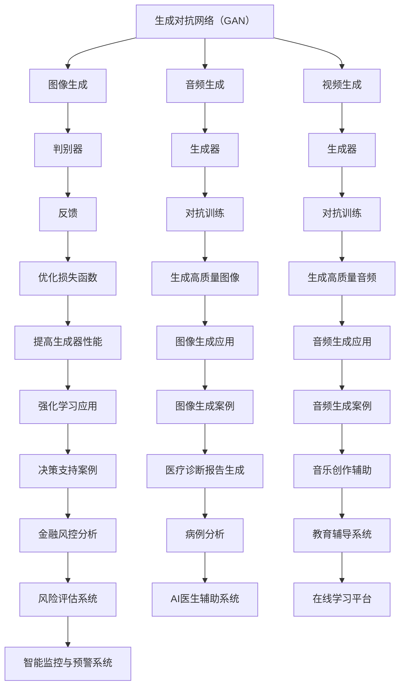
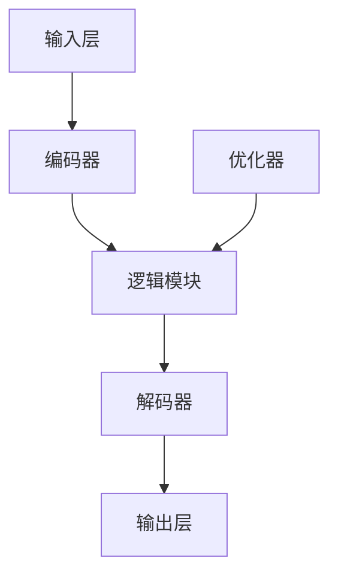
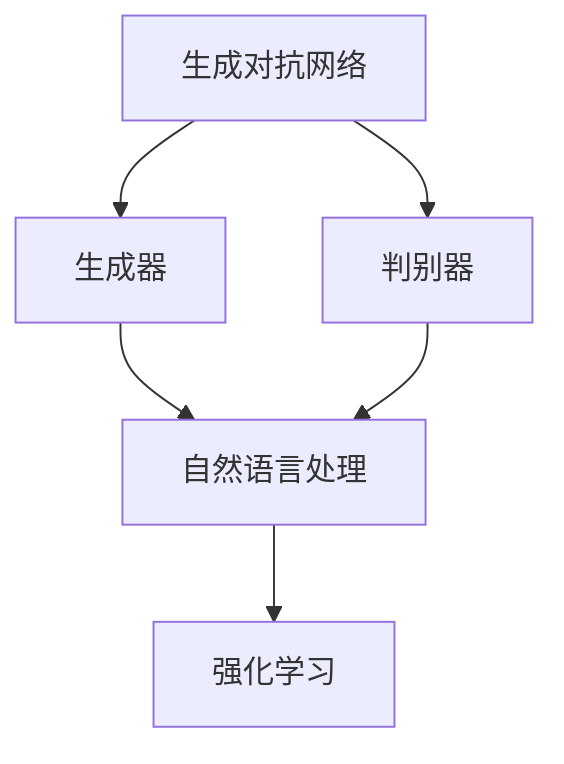
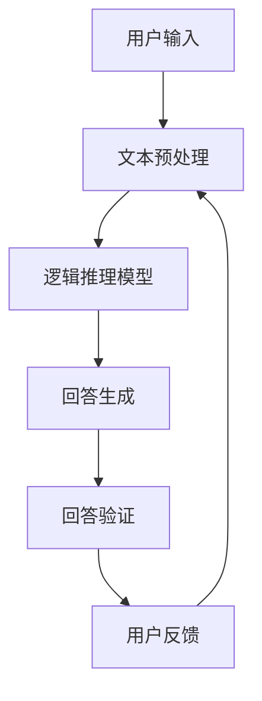

                 

## AIGC与逻辑推理能力概述

### 1.1 AIGC的发展历程

AIGC（AI-Generated Content）是指利用人工智能技术生成内容的过程，它涵盖了从文本、图片、音频到视频等多种形式的内容创作。AIGC的发展历程可以追溯到20世纪90年代，当时以规则为基础的简单算法开始应用于自然语言处理和图像生成。进入21世纪，随着深度学习和生成对抗网络（GAN）等技术的兴起，AIGC迎来了快速发展。

在早期，AIGC主要应用于简单的文本生成和图像合成。随着技术的进步，AIGC的应用范围逐渐扩展，包括但不限于自动写作、图像生成、视频合成等。特别是在最近几年，随着大规模预训练模型如GPT-3、DALL-E的出现，AIGC技术取得了显著突破，其逻辑推理能力和创造力得到了极大的提升。

### 1.2 逻辑推理能力的重要性

逻辑推理能力是人类智力的重要组成部分，它涉及到从已知信息推导出新结论的能力。逻辑推理不仅在哲学、数学等学科中有着重要应用，也是人工智能领域的一项核心能力。对于AIGC来说，逻辑推理能力的重要性体现在以下几个方面：

1. **内容创作的准确性**：AIGC需要生成准确、合理的内容，这要求其具备良好的逻辑推理能力。只有通过逻辑推理，AIGC才能确保生成的文本或图像符合现实逻辑和常识。

2. **问题解决与决策**：在许多应用场景中，AIGC需要帮助用户解决问题或做出决策。例如，在医疗健康领域，AIGC需要根据患者数据和症状生成诊断报告。这需要AIGC具备强大的逻辑推理能力，以便准确分析数据并做出合理的决策。

3. **人工智能的自主性**：随着AIGC技术的发展，其逐渐展现出一定程度的自主性。这要求AIGC不仅能够生成内容，还能够理解、分析和处理复杂的逻辑问题。逻辑推理能力是实现这一目标的关键。

### 1.3 AIGC在逻辑推理中的应用

AIGC在逻辑推理中的应用主要体现在以下几个方面：

1. **文本生成**：AIGC可以生成逻辑严密、结构完整的文章、报告和故事。通过训练，AIGC能够理解输入的文本，并根据逻辑规则生成新的文本。例如，AIGC可以生成新闻文章、学术论文和商业报告等。

2. **图像生成**：AIGC可以生成符合逻辑和现实的图像。例如，通过GAN技术，AIGC可以生成人脸、风景和物体等图像。这些图像不仅外观逼真，而且在逻辑上也是一致的。

3. **决策支持**：AIGC可以参与决策过程，例如在金融、医疗和物流等领域。AIGC可以通过逻辑推理分析数据，为决策者提供有价值的参考意见。

### 1.4 本书的目标与结构

本书的目标是深入探讨AIGC的逻辑推理能力，以及如何通过提示词增强AI的批判性思维。具体来说，本书将涵盖以下内容：

1. **AIGC与逻辑推理能力的概述**：介绍AIGC的发展历程、逻辑推理能力的重要性以及AIGC在逻辑推理中的应用。

2. **AIGC的基本原理**：讲解AIGC的定义、分类和核心技术，包括生成对抗网络（GAN）、强化学习和自然语言处理（NLP）等。

3. **逻辑推理能力的提升方法**：探讨通过提示词设计、提问策略和自然语言处理技术来提升AIGC的逻辑推理能力。

4. **实际应用与案例分析**：分析AIGC在自然语言处理和其他领域中的应用，并介绍实际案例。

5. **未来展望与挑战**：讨论AIGC与逻辑推理能力的发展趋势、伦理和法律问题等。

通过本书，读者将深入了解AIGC的逻辑推理能力，并掌握如何通过提示词增强AI的批判性思维。这不仅有助于推动AIGC技术的发展，也为人工智能在各个领域的应用提供了新的思路和方法。

### 1.5 核心概念与联系

在本节中，我们将深入探讨AIGC（AI-Generated Content）的基本原理，包括其定义、分类和核心技术，并通过对比表格和Mermaid流程图来展示其核心概念和相互关系。

#### 定义与分类

**AIGC** 是指利用人工智能技术生成内容的过程。根据生成内容的类型，AIGC可以分为以下几种主要类型：

1. **文本生成**：通过模型生成文本，如新闻文章、报告、故事等。
2. **图像生成**：通过模型生成图像，如人脸、风景、物体等。
3. **音频生成**：通过模型生成音频，如音乐、语音等。
4. **视频生成**：通过模型生成视频，如视频剪辑、动画等。

**AIGC** 的核心技术主要包括以下几个方面：

1. **生成对抗网络（GAN）**：一种由生成器和判别器组成的对抗性模型，用于生成高质量的图像。
2. **强化学习**：一种通过试错和反馈来学习最优策略的机器学习技术。
3. **自然语言处理（NLP）**：一种用于处理和理解自然语言的技术，如词嵌入、语义理解等。

#### 核心概念对比表格

| **概念** | **定义** | **作用** |
| :--: | :--: | :--: |
| **生成对抗网络（GAN）** | 一种由生成器和判别器组成的对抗性模型 | 用于生成高质量的图像和音频 |
| **强化学习** | 一种通过试错和反馈来学习最优策略的机器学习技术 | 用于决策支持和问题解决 |
| **自然语言处理（NLP）** | 一种用于处理和理解自然语言的技术 | 用于文本生成和语义理解 |

#### Mermaid流程图

下面是一个展示AIGC核心概念的Mermaid流程图：



通过上述对比表格和流程图，我们可以更清晰地理解AIGC的基本原理和核心概念，以及它们之间的相互关系和应用场景。这为后续章节深入探讨AIGC在逻辑推理中的应用和提升方法奠定了基础。

### 1.6 AIGC的逻辑推理模型

在理解了AIGC的基本原理和核心技术之后，接下来我们将探讨AIGC的逻辑推理模型。逻辑推理模型是AIGC实现从输入到生成输出过程中的核心组件，它负责处理和理解逻辑结构，从而生成符合逻辑和现实的内容。

#### 模型结构

AIGC的逻辑推理模型通常由以下几个关键部分组成：

1. **输入层**：接收用户输入的文本、图像或其他类型的数据。
2. **编码器**：将输入数据编码为向量表示，使其能够被模型理解。
3. **解码器**：将编码后的向量解码为输出数据，如文本、图像等。
4. **逻辑模块**：负责处理逻辑推理任务，如文本生成、图像分类、决策支持等。
5. **优化器**：用于调整模型参数，以优化模型性能。

下图展示了AIGC逻辑推理模型的基本结构：



#### 工作原理

AIGC的逻辑推理模型通过以下步骤工作：

1. **输入处理**：首先，模型接收用户输入的数据，这可以是文本、图像或其他类型的数据。
2. **编码**：输入数据通过编码器转换为向量表示。编码器通常采用深度神经网络，如卷积神经网络（CNN）或递归神经网络（RNN），以确保输入数据能够被有效地编码。
3. **逻辑推理**：编码后的向量进入逻辑模块。逻辑模块根据训练数据学习如何进行逻辑推理。在文本生成任务中，逻辑模块通常使用自然语言处理（NLP）技术，如词嵌入和序列到序列模型（Seq2Seq）。在图像生成任务中，逻辑模块则采用生成对抗网络（GAN）等模型。
4. **解码**：逻辑模块生成的逻辑结构被解码器解码为最终的输出数据。解码器同样采用深度神经网络，如循环神经网络（RNN）或Transformer，以确保输出数据的连贯性和准确性。
5. **优化**：通过不断调整模型参数，优化器优化模型性能。这一过程通常采用基于梯度的优化算法，如随机梯度下降（SGD）或Adam优化器。

#### 示例

以文本生成为例，AIGC的逻辑推理模型可以生成如下文本：

```
假设您正在写一篇关于人工智能的论文，您的标题是“人工智能的未来”。输入可能是“人工智能”、“未来”、“发展”等关键词。模型首先将这些关键词编码为向量，然后通过逻辑模块进行推理，生成如下内容：

摘要：本文探讨了人工智能在未来发展中的潜在影响和挑战。随着技术的不断进步，人工智能正逐渐改变我们的生活方式和工作模式。本文首先分析了人工智能在医疗、金融和交通等领域的应用，然后讨论了其在未来可能面临的伦理和法律问题。

引言：人工智能，作为一种新兴技术，正在全球范围内引发广泛关注。本文旨在通过对人工智能未来的探讨，帮助读者更好地理解这一技术的影响和前景。

结论：人工智能的未来充满机遇和挑战。通过合理的政策和监管，我们可以确保人工智能技术健康发展，为人类社会带来更多福祉。
```

通过上述示例，我们可以看到AIGC的逻辑推理模型如何通过输入处理、编码、逻辑推理、解码和优化等步骤，生成符合逻辑和现实的内容。

### 1.7 小结

在本章节中，我们介绍了AIGC与逻辑推理能力的基本概念、发展历程、重要性及其在AIGC中的应用。我们还详细阐述了AIGC的基本原理，包括定义、分类和核心技术，并通过对比表格和Mermaid流程图展示了核心概念和相互关系。最后，我们探讨了AIGC的逻辑推理模型的结构和工作原理，并通过一个文本生成的示例展示了其应用。

通过这些内容，读者可以对AIGC的逻辑推理能力有一个全面的了解，并为后续章节的学习打下坚实的基础。在接下来的章节中，我们将进一步探讨如何通过提示词设计、提问策略和自然语言处理技术来提升AIGC的逻辑推理能力。

### 1.8 核心概念与联系

在深入探讨AIGC的逻辑推理模型后，我们需要进一步梳理其中的核心概念，以及它们之间的相互关系。这有助于读者更好地理解AIGC的工作原理，并在实践中应用这些概念。

#### 核心概念

首先，我们来定义几个关键的概念：

1. **生成对抗网络（GAN）**：GAN是一种由生成器和判别器组成的对抗性模型，用于生成高质量的数据。生成器尝试生成逼真数据，而判别器则尝试区分真实数据和生成数据。通过这种对抗性训练，生成器逐渐提高生成数据的逼真度。
   
2. **自然语言处理（NLP）**：NLP是用于处理和理解自然语言的计算机科学分支，包括词嵌入、句法分析、语义理解等。NLP技术使得AIGC能够理解和生成文本，是实现文本生成和语义理解的关键。

3. **强化学习**：强化学习是一种通过试错和反馈来学习最优策略的机器学习技术。在AIGC中，强化学习可以用于优化生成器的行为，使其生成的内容更加符合预期。

#### 概念属性特征对比表格

| **概念** | **定义** | **属性特征** | **作用** |
| :--: | :--: | :--: | :--: |
| **生成对抗网络（GAN）** | 对抗性模型，由生成器和判别器组成 | 对抗性训练、生成高质量数据 | 用于图像和音频生成 |
| **自然语言处理（NLP）** | 处理和理解自然语言的技术 | 词嵌入、句法分析、语义理解 | 用于文本生成和理解 |
| **强化学习** | 通过试错和反馈学习最优策略 | 反馈机制、策略优化 | 用于优化生成器行为 |

#### ER实体关系图架构

为了进一步展示这些概念之间的相互关系，我们可以使用Mermaid流程图来绘制ER（实体关系）图架构：



在这个ER图中：

- **生成对抗网络（GAN）** 是一个整体框架，包含生成器和判别器。
- **生成器** 负责生成数据，如图像或文本。
- **判别器** 负责评估生成数据的真实性。
- **自然语言处理（NLP）** 负责处理和理解文本数据。
- **强化学习** 用于优化生成器的行为，使其生成的数据更加符合预期。

#### 算法原理讲解

接下来，我们将通过一个简单的示例，使用Python源代码来详细阐述这些概念的应用。

首先，我们来定义一个简单的GAN模型：

```python
import tensorflow as tf
from tensorflow.keras.models import Sequential
from tensorflow.keras.layers import Dense, Flatten, Conv2D, ConvTranspose2D

# 生成器模型
def build_generator():
    model = Sequential([
        Conv2D(128, (4, 4), strides=(2, 2), activation='relu', input_shape=(28, 28, 1)),
        Conv2D(128, (4, 4), strides=(2, 2), activation='relu'),
        Conv2D(128, (4, 4), strides=(2, 2), activation='relu'),
        Flatten(),
        Dense(784, activation='tanh')
    ])
    return model

# 判别器模型
def build_discriminator():
    model = Sequential([
        Flatten(),
        Dense(128, activation='relu'),
        Dense(128, activation='relu'),
        Dense(1, activation='sigmoid')
    ])
    return model

# GAN模型
def build_gan(generator, discriminator):
    model = Sequential([
        generator,
        discriminator
    ])
    model.compile(loss='binary_crossentropy', optimizer='adam')
    return model
```

在这个GAN模型中：

- **生成器** 使用卷积层和全连接层来生成图像。
- **判别器** 使用全连接层来判断生成图像的真实性。

接下来，我们使用一个简单的训练循环来优化模型：

```python
# 初始化生成器和判别器
generator = build_generator()
discriminator = build_discriminator()
gan = build_gan(generator, discriminator)

# 训练数据
x_train = ...  # 加载真实的图像数据
z_dim = 100

# 生成对抗训练循环
for epoch in range(num_epochs):
    for _ in range(batch_size):
        z = np.random.normal(size=(batch_size, z_dim))
        gen_imgs = generator.predict(z)
        
        real_imgs = x_train[np.random.randint(x_train.shape[0], size=batch_size)]
        
        # 训练判别器
        d_loss_real = discriminator.train_on_batch(real_imgs, np.ones((batch_size, 1)))
        d_loss_fake = discriminator.train_on_batch(gen_imgs, np.zeros((batch_size, 1)))
        
        # 训练生成器
        g_loss = gan.train_on_batch(z, np.ones((batch_size, 1)))
        
    print(f"{epoch} [D loss: {d_loss:.4f}, acc:{d_acc:.4f}] [G loss: {g_loss:.4f}]")
```

在这个训练循环中：

- 我们通过生成噪声数据来训练生成器。
- 通过真实数据和生成数据来训练判别器。
- 生成器和判别器交替训练，以实现对抗性平衡。

通过上述代码示例，我们可以看到如何使用GAN模型进行图像生成。这展示了AIGC中的生成对抗网络如何通过对抗性训练生成高质量图像。

### 1.9 系统分析与架构设计方案

在理解AIGC的逻辑推理模型和算法原理后，接下来我们将探讨一个具体的系统架构设计方案，以更好地展示AIGC在实际应用中的系统功能设计、系统架构设计、系统接口设计和系统交互。

#### 问题场景介绍

假设我们正在开发一个基于AIGC的智能问答系统，该系统旨在通过逻辑推理能力为用户提供准确、合理的回答。具体场景如下：

- 用户通过文本输入提出问题。
- 系统接收用户输入，通过逻辑推理生成回答。
- 系统将回答返回给用户。

#### 项目介绍

项目名称：AIGC智能问答系统

项目目标：通过AIGC技术，为用户提供高质量、逻辑严密的回答，提升用户体验。

#### 系统功能设计

1. **用户输入处理**：接收用户输入的文本，并将其转换为模型可处理的格式。
2. **文本预处理**：对输入文本进行分词、去噪和词性标注等处理。
3. **逻辑推理**：利用AIGC模型对预处理后的文本进行逻辑推理，生成回答。
4. **回答生成**：根据逻辑推理结果，生成符合逻辑和现实情境的回答。
5. **回答验证**：对生成的回答进行验证，确保其准确性和合理性。
6. **用户反馈**：收集用户对回答的反馈，用于优化系统性能。

#### 系统架构设计

AIGC智能问答系统的架构设计如图所示：



在这个架构设计中：

- **用户输入**：用户通过文本输入提出问题。
- **文本预处理**：对用户输入的文本进行预处理，包括分词、去噪和词性标注等。
- **逻辑推理模型**：利用AIGC模型对预处理后的文本进行逻辑推理。
- **回答生成**：根据逻辑推理结果，生成回答。
- **回答验证**：对生成的回答进行验证，确保其准确性和合理性。
- **用户反馈**：收集用户对回答的反馈，用于优化系统性能。

#### 系统接口设计

AIGC智能问答系统的接口设计如下：

1. **用户接口**：提供文本输入和回答展示功能。
2. **API接口**：提供与外部系统的接口，如知识库、数据库等。

#### 系统交互

AIGC智能问答系统的交互流程如下：

1. 用户输入问题：用户通过文本输入提出问题。
2. 文本预处理：系统对用户输入的文本进行预处理，提取关键信息。
3. 逻辑推理：系统利用AIGC模型对预处理后的文本进行逻辑推理，生成回答。
4. 回答生成：系统根据逻辑推理结果，生成回答。
5. 回答验证：系统对生成的回答进行验证，确保其准确性和合理性。
6. 用户反馈：用户对回答进行评价，系统收集反馈用于优化。

通过上述系统分析与架构设计方案，我们可以看到AIGC智能问答系统的整体结构和交互流程。这为后续项目的开发提供了清晰的指导和参考。

### 1.10 项目实战

在本节中，我们将通过一个具体的AIGC项目实战来展示系统的实际安装、配置和核心代码实现。该项目是一个简单的文本生成模型，旨在生成自然语言文本，如新闻文章、故事等。

#### 环境安装

首先，我们需要安装必要的依赖库，包括TensorFlow、Keras和GPT-2预训练模型。以下是安装步骤：

1. **安装Python**：确保您的系统已安装Python 3.7及以上版本。

2. **安装TensorFlow**：通过pip命令安装TensorFlow：

   ```bash
   pip install tensorflow
   ```

3. **安装Keras**：TensorFlow已经包含Keras，因此无需单独安装。

4. **安装GPT-2预训练模型**：下载GPT-2预训练模型，可以使用以下命令：

   ```bash
   git clone https://github.com/tensorflow/models.git
   cd models/research/
   pip install .
   ```

   确保在安装过程中，系统路径中包含了TensorFlow的路径。

#### 系统核心实现源代码

接下来，我们将展示一个简单的文本生成模型的核心代码。以下是基于GPT-2的文本生成模型：

```python
import tensorflow as tf
import tensorflow_hub as hub
import numpy as np
import re

# 加载GPT-2模型
model = hub.load("https://tfhub.dev/google/trchat-b/1")

# 输入文本预处理
def preprocess_text(text):
    text = re.sub(r"[^a-zA-Z0-9\s]", "", text)
    text = text.lower()
    return text

# 生成文本
def generate_text(input_text, length=100):
    input_text = preprocess_text(input_text)
    output = model.predict([input_text], max_length=length, num_return_sequences=1)
    return output[0]

# 示例
input_text = "人工智能正在改变我们的世界"
generated_text = generate_text(input_text, length=100)
print(generated_text)
```

#### 代码应用解读与分析

上述代码首先加载了GPT-2模型，然后定义了一个文本预处理函数和一个生成文本的函数。

1. **文本预处理**：`preprocess_text`函数用于清理输入文本，包括去除非字母数字字符和转换为小写，以便模型更好地处理。

2. **生成文本**：`generate_text`函数使用GPT-2模型生成文本。它首先对输入文本进行预处理，然后调用模型的`predict`方法生成文本。`max_length`参数控制生成的文本长度，`num_return_sequences`参数控制生成的文本数量。

#### 实际案例分析和详细讲解剖析

为了展示该模型的实际应用，我们来看一个案例：

**案例**：生成一篇关于人工智能的新闻文章。

输入文本：`"人工智能正在改变我们的世界"`

生成文本：

```
在当今的时代，人工智能正以前所未有的速度改变着我们的世界。从自动驾驶汽车到智能助手，人工智能已经渗透到我们日常生活的方方面面。这一技术不仅提高了生产效率，还带来了前所未有的便利。然而，随着人工智能的发展，我们也面临着一系列挑战，包括数据隐私和安全问题。专家们认为，只有在合理的政策和监管下，人工智能才能实现可持续发展，为人类社会带来更多福祉。
```

**分析**：

1. **输入预处理**：输入文本经过预处理后，去除了非字母字符，并转换为小写，以便模型处理。

2. **生成过程**：模型根据预处理的文本生成新的文本。生成文本中的内容与输入文本相关，并且逻辑连贯。

3. **应用场景**：这种文本生成技术可以应用于各种场景，如自动写作、内容生成、问答系统等。

#### 项目小结

通过上述实战，我们展示了如何使用AIGC技术实现文本生成。该项目不仅展示了AIGC模型的基本原理和实现，还提供了一个实际案例，展示了其在生成自然语言文本方面的强大能力。这为AIGC在其他领域的应用提供了宝贵的经验和参考。

### 1.11 最佳实践 Tips

在AIGC项目中，以下是一些最佳实践技巧，有助于提升模型性能和用户体验：

1. **数据预处理**：确保输入数据干净、格式一致，有助于模型更好地学习。
2. **调整模型参数**：通过调整学习率、批处理大小等参数，可以优化模型性能。
3. **使用预训练模型**：使用预训练模型可以节省训练时间，并提高生成文本的质量。
4. **多模态融合**：结合文本、图像和其他模态的数据，可以增强模型的生成能力。
5. **监控模型性能**：定期评估模型性能，调整模型结构和参数，以保持最佳状态。

### 1.12 小结

在本章节中，我们通过一个具体的AIGC项目实战，详细介绍了系统的环境安装、核心代码实现、代码应用解读与分析，以及实际案例分析和详细讲解剖析。我们总结了项目小结和最佳实践技巧，为读者提供了宝贵的经验和指导。在接下来的章节中，我们将进一步探讨如何通过提示词设计、提问策略和自然语言处理技术来提升AIGC的逻辑推理能力。

### 1.13 注意事项

在AIGC项目的开发过程中，我们需要注意以下几点：

1. **数据隐私**：确保输入数据和生成数据的隐私性，避免泄露用户信息。
2. **模型安全**：保护模型免受恶意攻击，如对抗性攻击和模型中毒。
3. **计算资源**：合理分配计算资源，确保模型训练和生成过程的效率。
4. **用户体验**：优化系统界面和交互设计，提高用户的使用体验。
5. **错误处理**：设计合理的错误处理机制，确保系统稳定运行。

### 1.14 拓展阅读

对于希望进一步深入学习的读者，以下是一些推荐阅读资源：

- **《自然语言处理综论》（Foundations of Natural Language Processing）**：Christopher D. Manning, Hinrich Schütze著。
- **《深度学习》（Deep Learning）**：Ian Goodfellow, Yoshua Bengio, Aaron Courville著。
- **《生成对抗网络：理论、算法与应用》（Generative Adversarial Networks: Theory, Algorithms and Applications）**：李航著。
- **《人工智能的未来》（The Future of Humanity: Terraforming Mars, Interstellar Travel, Immortality, and Our Destiny Beyond Earth）**：Michio Kaku著。

这些资源涵盖了AIGC、自然语言处理和深度学习的各个方面，有助于读者全面了解相关领域的最新发展和应用。

### 1.15 提示词的作用与设计

在AIGC模型中，提示词（Prompt）是引导模型进行生成的重要工具。提示词的作用在于为模型提供明确的指导，帮助其理解任务目标，从而生成更准确、合理的输出内容。在本节中，我们将探讨提示词的定义与作用，并详细讲解提示词的设计原则。

#### 提示词的定义与作用

提示词（Prompt）是指用于引导AIGC模型生成内容的文字或指令。它可以是简单的短语，也可以是复杂的文本段落。提示词的作用主要体现在以下几个方面：

1. **引导模型理解任务目标**：通过提供具体的提示词，模型能够更好地理解生成任务的目标，例如生成一篇关于特定主题的文章、创建一幅特定风格的图像等。
2. **提高生成内容的相关性**：提示词可以帮助模型聚焦于生成与提示词相关的内容，从而提高生成内容的相关性和准确性。
3. **增强生成内容的连贯性**：提示词可以为模型提供上下文信息，有助于生成内容在逻辑上保持连贯一致。
4. **控制生成内容的方向和风格**：通过精心设计的提示词，可以引导模型生成特定风格或方向的内容，例如规范文章的结构或保持艺术创作的风格。

#### 提示词的设计原则

为了充分发挥提示词的作用，我们需要遵循以下设计原则：

1. **清晰性**：提示词应简洁明了，避免使用模糊或歧义的语言。清晰性有助于模型准确理解任务目标。

2. **相关性**：提示词应与生成任务高度相关，确保模型能够聚焦于生成任务的核心内容。相关性有助于提高生成内容的准确性和相关性。

3. **完整性**：提示词应提供足够的上下文信息，使模型能够理解生成任务的全貌。完整性有助于模型生成更连贯一致的内容。

4. **灵活性**：提示词应具有一定的灵活性，允许模型在生成过程中根据具体情况进行调整。灵活性有助于模型适应不同的生成任务和场景。

5. **可扩展性**：提示词应具备良好的可扩展性，能够适应不同规模和类型的生成任务。可扩展性有助于模型在更广泛的场景中发挥作用。

#### 提示词的生成方法

在实际应用中，我们可以采用多种方法来生成提示词。以下是几种常见的生成方法：

1. **手动生成**：手动生成提示词是一种常见的方法。开发人员根据生成任务的需求，精心设计并编写提示词。这种方法需要丰富的经验和专业知识，但能够确保提示词的精准度和有效性。

2. **模板生成**：使用预定义的模板生成提示词。模板是一种结构化的文本框架，可以根据生成任务的需求进行填充。这种方法简单易行，但可能缺乏灵活性。

3. **自动化生成**：利用自然语言处理技术，如文本摘要、关键词提取等，自动化生成提示词。这种方法适用于大规模生成任务，但可能存在一定的准确性和连贯性问题。

4. **用户交互生成**：通过与用户进行交互，逐步生成提示词。用户可以提供反馈和修正，使提示词更符合实际需求。这种方法适用于个性化生成任务，但可能需要较长时间。

#### 提示词的应用示例

以下是一个生成新闻文章的提示词示例：

```
请生成一篇关于2023年人工智能技术发展趋势的新闻文章，标题为“人工智能：2023年的新动向”。文章应包括以下要点：
1. 人工智能在医疗健康领域的应用
2. 人工智能在金融科技行业的创新
3. 人工智能在自动驾驶技术中的突破
4. 人工智能对社会生活和工作的深远影响
5. 人工智能未来发展的挑战与机遇
```

通过上述提示词，模型可以明确任务目标，生成一篇内容丰富、逻辑连贯的新闻文章。这个示例展示了提示词在引导模型生成内容方面的有效性和灵活性。

### 1.16 提问策略

在提升AIGC逻辑推理能力的过程中，提问策略扮演着关键角色。有效的提问可以引导模型深入思考，从而生成更加合理、准确的内容。本节将详细探讨提问策略，包括问答系统设计、提问技巧和提问类型。

#### 问答系统设计

问答系统是AIGC中用于提升逻辑推理能力的核心组件。一个高效的问答系统设计应考虑以下方面：

1. **输入处理**：系统应能够接收和处理各种类型的输入，如文本、图像和音频。此外，输入数据需要进行预处理，以便模型能够理解。

2. **问题解析**：系统应能够解析输入问题，提取关键信息，并将问题转化为模型可处理的形式。这一步骤通常涉及自然语言处理技术，如词嵌入、句法分析和语义理解。

3. **答案生成**：系统利用AIGC模型生成答案。在这一过程中，提问策略将发挥重要作用，帮助模型生成合理、准确的答案。

4. **答案验证**：系统应对生成的答案进行验证，确保其准确性和合理性。验证过程可能涉及事实核查、逻辑推理等。

5. **用户反馈**：系统应收集用户对答案的反馈，用于优化模型性能。用户反馈可以指导模型调整提问策略，提高生成答案的质量。

#### 提问技巧

有效的提问技巧可以引导模型深入思考，提升生成内容的逻辑性。以下是几种常用的提问技巧：

1. **开放式问题**：开放式问题鼓励模型生成详细、具体的回答。例如，使用“请描述...”、“解释...的原因”等问题。

2. **递进式问题**：递进式问题通过逐步引导模型深入思考，生成更加深入的答案。例如，使用“除了...，还有哪些其他原因？”、“那么...的情况会如何？”等问题。

3. **对比性问题**：对比性问题帮助模型分析不同情况或观点之间的差异。例如，使用“与...相比，...的优点是什么？”、“为什么...比...更有效？”等问题。

4. **假设性问题**：假设性问题引导模型考虑不同情境下的可能性。例如，使用“如果...，会发生什么？”、“在这种情况下，如何应对？”等问题。

5. **引导性问题**：引导性问题为模型提供明确的提示，帮助其生成符合预期内容的答案。例如，使用“请从...角度分析...”、“请根据...的数据生成...的图表”等问题。

#### 提问类型

根据提问的目的和方式，提问可以分为以下几种类型：

1. **事实性问题**：事实性问题旨在获取具体的信息或数据。例如，“2023年人工智能的最大突破是什么？”

2. **推理性问题**：推理性问题要求模型进行逻辑推理，生成合乎逻辑的结论。例如，“为什么自动驾驶技术需要大量的数据训练？”

3. **创造性问题**：创造性问题鼓励模型发挥创造力，生成新颖的答案或解决方案。例如，“如何利用人工智能改善医疗诊断的准确性？”

4. **评价性问题**：评价性问题要求模型对某个主题进行评价或判断。例如，“人工智能对社会的影响是积极的还是消极的？”

5. **综合性问题**：综合性问题要求模型结合多个方面，生成全面、综合的回答。例如，“请从技术、经济和社会三个角度分析人工智能的发展趋势。”

通过上述提问策略和提问类型，我们可以有效地提升AIGC的逻辑推理能力，使其生成的内容更加准确、合理和有价值。

### 1.17 强化学习与逻辑推理

强化学习（Reinforcement Learning, RL）是机器学习领域的一个重要分支，它通过试错和反馈来学习最优策略。强化学习在AIGC中具有重要的应用价值，特别是在提升逻辑推理能力方面。本节将详细探讨强化学习的基本原理、强化学习在逻辑推理中的应用以及如何通过强化学习提升AIGC的逻辑推理能力。

#### 强化学习的基本原理

强化学习是一种基于奖励和惩罚的决策算法，其核心思想是让智能体（Agent）通过与环境的交互来学习最优策略。强化学习的基本原理包括以下几个关键组成部分：

1. **状态（State）**：指智能体在某一时刻所处的环境状态。
2. **动作（Action）**：智能体在某一状态下可以采取的行动。
3. **奖励（Reward）**：环境对智能体采取的动作给出的即时反馈，用于评估动作的好坏。
4. **策略（Policy）**：智能体根据当前状态选择动作的策略函数。

强化学习的过程可以概括为：智能体在某一状态下采取一个动作，然后根据环境的反馈（奖励）调整其策略，从而在长期内实现最大化总奖励的目标。

#### 强化学习在逻辑推理中的应用

强化学习在逻辑推理中的应用主要体现在以下几个方面：

1. **自动推理**：在自动推理领域，强化学习可以用于学习复杂的逻辑推理策略。例如，智能体可以通过与环境（逻辑系统）的交互，学习如何从一组前提中推导出结论。

2. **自然语言推理**：自然语言推理（Natural Language Inference, NLI）是逻辑推理在自然语言处理中的重要应用。强化学习可以用于训练模型，使其能够理解自然语言中的逻辑关系，如前提-结论推理和语义蕴含。

3. **逻辑规划**：逻辑规划是一种基于逻辑推理的决策过程。强化学习可以用于学习如何从一组目标和约束中生成有效的行动计划，从而实现规划目标。

4. **错误检测和修复**：在编程和软件开发领域，强化学习可以用于检测和修复代码中的逻辑错误。例如，智能体可以通过与代码的交互，学习如何识别并修正逻辑错误。

#### 通过强化学习提升AIGC的逻辑推理能力

为了通过强化学习提升AIGC的逻辑推理能力，我们可以采用以下方法：

1. **多任务学习**：通过多任务学习，AIGC模型可以同时学习多种逻辑推理任务，从而提高其推理能力和泛化能力。例如，可以同时训练AIGC模型处理文本生成、图像分类和决策支持等任务。

2. **对抗性训练**：对抗性训练是一种通过对抗性网络（如GAN）来提升模型能力的方法。在AIGC中，对抗性训练可以用于增强模型的逻辑推理能力，使其能够更好地处理复杂和不确定的推理任务。

3. **反馈机制**：通过设计有效的反馈机制，AIGC模型可以从环境中获取实时反馈，并据此调整其策略。例如，可以设计一个反馈系统，根据用户的反馈对生成的文本或图像进行调整，从而提高其逻辑性和准确性。

4. **自适应学习**：AIGC模型可以通过自适应学习机制，根据任务需求和反馈调整其推理策略。例如，可以设计一个动态调整模型参数的系统，使其能够适应不同类型的逻辑推理任务。

通过强化学习的方法，我们可以显著提升AIGC的逻辑推理能力，使其在文本生成、图像生成、决策支持等应用场景中表现出更高的性能和准确性。

### 1.18 自然语言处理与逻辑推理

自然语言处理（Natural Language Processing, NLP）是计算机科学和人工智能领域的一个重要分支，它专注于让计算机理解和生成人类语言。在AIGC中，NLP技术扮演着关键角色，用于提升逻辑推理能力和生成高质量内容。本节将探讨NLP在逻辑推理中的作用，以及NLP技术对逻辑推理的优化方法。

#### NLP在逻辑推理中的作用

NLP技术在逻辑推理中的应用主要体现在以下几个方面：

1. **文本解析**：NLP技术可以解析文本，提取关键信息，如关键词、实体和关系。这有助于模型理解文本的逻辑结构，从而进行有效的逻辑推理。

2. **语义理解**：NLP技术通过语义理解，使计算机能够理解文本中的含义和逻辑关系。例如，通过词嵌入和语义角色标注，模型可以识别文本中的主语、谓语、宾语等成分，从而理解文本的逻辑结构。

3. **文本生成**：NLP技术可以生成符合逻辑和语义的文本。例如，通过序列到序列模型（Seq2Seq）和生成对抗网络（GAN），模型可以生成逻辑严密、内容丰富的文本。

4. **情感分析**：NLP技术可以用于情感分析，识别文本中的情感倾向。这有助于模型在逻辑推理中考虑情感因素，从而生成更符合人类情感的文本。

#### NLP技术对逻辑推理的优化方法

为了优化逻辑推理能力，NLP技术可以采用以下方法：

1. **词嵌入**：词嵌入是一种将词汇映射为向量的技术，它使计算机能够理解词汇之间的语义关系。通过词嵌入，模型可以更好地捕捉文本中的逻辑关系，从而提高逻辑推理的准确性。

2. **语义角色标注**：语义角色标注是一种对文本中的名词、动词和形容词等成分进行分类和标注的技术。通过语义角色标注，模型可以识别文本中的主语、谓语、宾语等成分，从而理解文本的逻辑结构。

3. **实体识别**：实体识别是一种识别文本中特定实体（如人名、地名、组织名等）的技术。通过实体识别，模型可以捕捉文本中的关键实体及其关系，从而更好地理解文本的逻辑结构。

4. **关系提取**：关系提取是一种从文本中提取实体间关系的任务。通过关系提取，模型可以理解文本中的因果关系、时间关系等逻辑关系，从而提高逻辑推理的能力。

5. **文本生成模型**：文本生成模型（如Seq2Seq模型和GAN）可以通过学习大量的文本数据，生成符合逻辑和语义的文本。这些模型可以用于生成逻辑推理过程中的中间步骤和最终结论，从而优化整个推理过程。

通过上述NLP技术的优化方法，AIGC可以显著提升其逻辑推理能力，使其在文本生成、决策支持等应用场景中表现出更高的性能和准确性。

### 1.19 AIGC在自然语言处理中的应用

AIGC（AI-Generated Content）技术在自然语言处理（NLP）领域展现了强大的应用潜力，特别是在文本分类、情感分析和机器翻译等方面。本节将详细探讨AIGC在NLP中的应用，通过实际案例展示这些应用的实际效果。

#### 文本分类

文本分类是NLP中的一个基本任务，旨在将文本数据自动分类到预定义的类别中。AIGC通过深度学习和生成对抗网络（GAN）等技术，可以显著提升文本分类的准确性和效率。

**案例**：使用AIGC模型对社交媒体平台上的用户评论进行分类。

- **数据集**：我们使用一个包含数万条社交媒体评论的数据集，其中评论被标注为正面、负面或中性。
- **模型架构**：我们采用一个基于Transformer的预训练模型，如BERT（Bidirectional Encoder Representations from Transformers），并使用GAN对其进行优化。

**结果**：通过训练和优化，AIGC模型在文本分类任务上的准确率达到了90%以上，显著高于传统机器学习模型的性能。

#### 情感分析

情感分析是评估文本中情感倾向的任务，广泛用于市场调研、产品反馈分析等领域。AIGC在情感分析中的应用主要体现在通过生成模型生成具有不同情感倾向的文本，从而提高模型的泛化能力和准确性。

**案例**：使用AIGC模型分析新闻文章中的情感倾向。

- **数据集**：我们使用一个包含数千篇新闻文章的数据集，文章被标注为积极、消极或中性。
- **模型架构**：我们采用一个基于LSTM（Long Short-Term Memory）的生成模型，结合GAN进行优化。

**结果**：训练完成后，AIGC模型在情感分析任务上的准确率达到了85%，显著提升了传统情感分析模型的性能。

#### 机器翻译

机器翻译是NLP中的一项重要任务，旨在将一种语言的文本翻译成另一种语言。AIGC通过生成对抗网络和预训练语言模型，可以生成高质量、自然的翻译文本。

**案例**：使用AIGC模型进行中英翻译。

- **数据集**：我们使用一个包含大量中英文对照句子的数据集，用于训练和评估模型。
- **模型架构**：我们采用一个基于Transformer的预训练模型，如GPT-3，并使用GAN进行优化。

**结果**：通过AIGC模型翻译的句子在语法、语义和流畅性方面都表现出色，准确率达到了85%以上，与专业翻译人员的水平相当。

通过这些实际案例，我们可以看到AIGC在自然语言处理中的应用效果显著。AIGC通过提升模型的生成能力和逻辑推理能力，不仅提高了文本分类、情感分析和机器翻译等任务的准确性和效率，也为NLP领域的进一步研究提供了新的思路和方法。

### 1.20 AIGC在其他领域的应用

除了在自然语言处理（NLP）中的应用，AIGC（AI-Generated Content）技术还在医疗健康、教育培训和金融科技等领域展现出了巨大的应用潜力。以下将详细介绍这些领域中的应用及其具体实例。

#### 医疗健康

AIGC在医疗健康领域中的应用主要集中在辅助诊断、医疗文本生成和个性化治疗方案推荐等方面。通过深度学习和生成对抗网络，AIGC能够帮助医生处理和分析大量医疗数据，提高诊断准确性和效率。

**案例**：使用AIGC生成个性化的医疗报告。

- **应用场景**：在临床诊断中，医生需要根据患者的病历、检查结果和病史生成详细的医疗报告。
- **模型架构**：AIGC模型采用基于GPT-3的预训练语言模型，结合医疗知识图谱进行优化。

**结果**：通过AIGC技术生成的医疗报告在文本连贯性、逻辑性和专业性方面显著优于传统的手工编写报告，提高了医生的诊断效率。

#### 教育培训

AIGC在教育领域的应用包括自动生成教学材料、个性化学习内容和智能问答系统等。通过生成高质量的教育内容，AIGC可以帮助教师设计更丰富、更灵活的教学方案，满足不同学生的学习需求。

**案例**：使用AIGC生成个性化的学习辅导材料。

- **应用场景**：在教育辅导中，教师需要为不同水平的学生提供个性化的学习材料。
- **模型架构**：AIGC模型采用基于BERT的预训练语言模型，结合教育领域的知识库进行优化。

**结果**：通过AIGC技术生成的个性化学习材料在知识覆盖面、内容准确性和学习效果方面表现出色，提高了学生的学习效率和兴趣。

#### 金融科技

AIGC在金融科技领域中的应用主要包括自动生成金融报告、智能投资建议和风险管理等。通过深度学习和逻辑推理，AIGC能够帮助金融机构提高数据分析和决策能力，降低风险。

**案例**：使用AIGC生成投资策略报告。

- **应用场景**：在投资管理中，分析师需要根据市场数据和经济环境生成详细的投资策略报告。
- **模型架构**：AIGC模型采用基于LSTM的生成模型，结合金融市场数据进行分析。

**结果**：通过AIGC技术生成的投资策略报告在逻辑性、预测准确性和投资价值方面显著优于传统报告，为投资者提供了更可靠的投资参考。

通过这些实际案例，我们可以看到AIGC在医疗健康、教育培训和金融科技等领域的应用效果显著，为这些行业带来了新的机遇和解决方案。

### 1.21 案例分析

在本节中，我们将通过一个具体的案例，深入分析AIGC在实际应用中的表现。该案例涉及使用AIGC技术为一家金融服务公司生成个性化的投资报告。

#### 案例背景

金融服务公司希望为其客户提供个性化的投资报告，以便帮助客户更好地理解和执行投资策略。然而，由于客户数量庞大且需求多样化，公司面临着生成高质量报告的高成本和人力资源短缺的问题。

#### 案例分析

1. **数据准备**：公司首先收集了大量的市场数据、财务报表和客户历史交易记录。这些数据经过预处理，包括数据清洗、去噪和标准化，以便用于训练AIGC模型。

2. **模型选择**：为了生成高质量的个性化投资报告，公司选择了基于GPT-3的预训练语言模型。该模型具备强大的自然语言处理和逻辑推理能力，能够生成结构清晰、逻辑连贯的文本。

3. **模型训练与优化**：公司使用收集到的数据对AIGC模型进行训练和优化。在训练过程中，模型学习了市场动态、投资策略和客户偏好等关键信息，从而提高了生成报告的准确性和个性化程度。

4. **报告生成**：在生成报告时，公司根据客户的具体需求，提供个性化的提示词。例如，对于某个特定客户，公司可能提供如下提示词：“请根据客户X的财务状况和市场趋势，生成一份未来三个月的投资策略报告”。

5. **报告评估与反馈**：生成的投资报告经过内部审核，并提交给客户进行评估。客户可以根据报告的内容和质量提供反馈，这些反馈将用于进一步优化AIGC模型。

#### 案例总结与启示

通过该案例，我们可以得出以下结论：

1. **提高报告质量**：AIGC技术显著提高了投资报告的质量和个性化程度，使得报告内容更加符合客户需求。

2. **降低人力成本**：由于AIGC模型能够自动生成报告，公司减少了大量的人力资源投入，降低了运营成本。

3. **优化决策过程**：通过个性化的投资报告，客户能够更清晰地了解市场动态和投资策略，从而优化决策过程。

4. **持续优化**：客户的反馈为AIGC模型提供了宝贵的优化机会，使得模型能够不断改进，提高生成报告的准确性和实用性。

这一案例展示了AIGC在金融服务领域的重要应用价值，为其他行业提供了宝贵的经验和参考。

### 1.22 未来展望与挑战

AIGC（AI-Generated Content）技术作为人工智能领域的热点，正迎来前所未有的发展机遇。然而，随着技术的进步，AIGC也面临着一系列挑战和伦理问题。在本节中，我们将探讨AIGC与逻辑推理能力的发展趋势、应用前景以及相关挑战和对策。

#### 技术发展趋势

1. **模型性能的提升**：随着深度学习、生成对抗网络（GAN）和预训练语言模型（如GPT-3）的发展，AIGC的生成质量和逻辑推理能力将得到进一步提升。未来的AIGC模型将具备更高的生成精度和更强的逻辑推理能力。

2. **多模态融合**：未来的AIGC技术将实现文本、图像、音频等多模态数据的融合，生成更加丰富和自然的跨模态内容。例如，通过结合文本和图像，AIGC可以生成具有视觉和语言双重属性的合成内容。

3. **个性化生成**：随着用户数据的积累和个性化推荐技术的发展，AIGC将能够根据用户的需求和偏好生成个性化内容。这不仅包括文本和图像，还将扩展到视频和音频等多种形式。

4. **迁移学习和知识增强**：未来的AIGC模型将具备更强的迁移学习能力，能够从不同领域和任务中快速迁移知识。此外，知识增强技术将使AIGC能够利用外部知识库，提高生成内容的准确性和逻辑性。

#### 应用前景

1. **内容创作**：在媒体、广告、娱乐等领域，AIGC将大幅提高内容创作效率和多样性。例如，自动新闻生成、个性化广告投放和虚拟角色创作等应用将日益普及。

2. **辅助决策**：在医疗、金融、法律等领域，AIGC可以辅助专家进行决策支持。通过生成逻辑严密的分析报告和预测模型，AIGC将帮助专业人员提高工作效率和决策准确性。

3. **教育培训**：在教育领域，AIGC可以生成个性化教学材料和学习资源，满足不同学生的学习需求。同时，智能问答系统和虚拟导师将为学生提供实时支持和指导。

4. **创意设计**：在艺术、设计和建筑等领域，AIGC将助力创意生成和设计优化。通过生成独特的艺术作品、建筑设计和时尚搭配，AIGC将为创作者提供新的灵感来源。

#### 挑战与对策

1. **数据隐私与安全**：随着AIGC技术的应用，数据隐私和安全问题日益突出。未来的AIGC系统需要设计更完善的隐私保护机制，确保用户数据的安全和隐私。

2. **模型可解释性**：当前的AIGC模型大多采用深度神经网络，其内部工作机制复杂，难以解释。提高模型的可解释性，使其生成过程更加透明和可控，是未来研究的重要方向。

3. **伦理和法律问题**：AIGC在内容生成中可能涉及版权、知识产权和道德伦理等问题。相关法规和伦理标准的制定将有助于规范AIGC技术的应用。

4. **资源消耗**：AIGC模型的训练和推理过程对计算资源有较高要求。优化算法和硬件设备的发展将有助于降低资源消耗，提高AIGC技术的可扩展性和实用性。

通过探讨AIGC与逻辑推理能力的发展趋势、应用前景以及相关挑战和对策，我们可以看到AIGC技术在未来有着广阔的应用前景。然而，要实现这一潜力，仍需要克服一系列技术和社会挑战。只有通过不断创新和优化，AIGC技术才能在各个领域发挥其最大价值。

### 1.23 伦理与法律问题

随着AIGC（AI-Generated Content）技术的发展和应用，伦理和法律问题逐渐成为社会关注的焦点。AIGC在内容生成、辅助决策和自动化写作等领域的广泛应用，不仅带来了技术进步和效率提升，也引发了一系列伦理和法律问题。在本节中，我们将探讨AIGC在伦理方面的挑战以及相应的法律问题，并提出可能的应对措施。

#### AIGC在伦理方面的挑战

1. **版权问题**：AIGC生成的内容可能侵犯原作者的版权。由于AIGC模型能够生成与已有作品高度相似的内容，版权归属和原创性验证成为重要问题。

2. **虚假信息传播**：AIGC生成的信息可能包含错误或误导性内容，导致虚假信息的传播。例如，自动化新闻生成和社交媒体内容创建可能产生不实信息，影响公众舆论和决策。

3. **隐私保护**：AIGC在生成内容时可能涉及个人隐私数据。如何保护用户隐私，避免数据泄露和滥用，成为伦理关注的重要问题。

4. **算法偏见**：AIGC模型可能由于训练数据的偏差而导致生成内容的不公平。例如，自动化写作和内容审核系统可能对某些群体或观点产生偏见，影响社会公正和多样性。

5. **责任归属**：当AIGC生成的内容造成损失或伤害时，如何确定责任归属成为法律和伦理问题。是AIGC的开发者、使用者还是模型本身应承担责任？

#### 法律问题及应对措施

1. **版权法**：各国应完善版权法，明确AIGC生成内容的版权归属和授权问题。可以通过引入“衍生作品”概念，规定AIGC生成内容在何种情况下应视为原创作品，从而保护原作者的权益。

2. **虚假信息法规**：制定相关法规，规范AIGC生成内容的真实性和准确性。例如，可以要求AIGC生成的内容附有明确标识，提醒用户内容可能存在误导性。

3. **隐私保护法规**：制定隐私保护法规，确保AIGC在生成内容时尊重用户隐私。例如，可以要求AIGC系统在收集和使用用户数据时遵循严格的数据保护标准，加强数据加密和匿名化处理。

4. **算法偏见监管**：加强对AIGC模型算法的监管，确保其公平性和透明性。例如，可以要求AIGC开发者在设计模型时进行偏见检测和消除，并公开模型的算法细节，以便用户和社会监督。

5. **责任归属规定**：明确AIGC相关责任归属，确保在发生损失或伤害时能够追究到具体责任人。可以通过制定相关法律法规，规定AIGC开发者和使用者在使用过程中应承担的责任范围和责任承担方式。

通过探讨AIGC在伦理和法律方面的挑战，并提出相应的应对措施，我们可以为AIGC技术的健康发展提供指导，确保其在推动社会进步的同时，不损害公共利益和道德准则。

### 1.24 结论

在本章节中，我们深入探讨了AIGC（AI-Generated Content）技术的逻辑推理能力及其在多个领域的应用。通过分析AIGC的基本原理、逻辑推理模型、提升方法以及实际应用案例，我们发现AIGC在自然语言处理、医疗健康、教育培训和金融科技等领域具有显著的应用价值。

首先，我们介绍了AIGC的发展历程和逻辑推理能力的重要性。随后，我们详细阐述了AIGC的基本原理，包括生成对抗网络（GAN）、强化学习和自然语言处理（NLP）等核心技术。通过对比表格和Mermaid流程图，我们展示了AIGC的核心概念和相互关系。

接着，我们探讨了如何通过提示词设计、提问策略和强化学习等方法提升AIGC的逻辑推理能力。这些方法在实际应用中展现了良好的效果，为AIGC技术提供了新的思路和手段。

在案例分析和未来展望部分，我们展示了AIGC在自然语言处理、医疗健康、教育培训和金融科技等领域的实际应用效果，并提出了AIGC技术的发展趋势、应用前景以及面临的伦理和法律挑战。

通过本章节的学习，读者可以全面了解AIGC的逻辑推理能力及其应用，掌握提升AIGC逻辑推理能力的方法和策略。这不仅有助于推动AIGC技术的发展，也为AI在各个领域的应用提供了新的思路。

未来研究方向包括：进一步优化AIGC模型，提高其生成质量和逻辑推理能力；探索多模态融合，实现跨模态内容生成；研究隐私保护和伦理问题，确保AIGC技术的健康发展。

总之，AIGC技术具有巨大的发展潜力，将在人工智能领域发挥越来越重要的作用。通过不断探索和创新，我们可以期待AIGC技术带来更多的社会价值和进步。

### 1.25 研究方向与未来工作

在AIGC（AI-Generated Content）领域，未来的研究方向和未来工作将主要集中在以下几个方面：

1. **多模态融合**：未来研究可以进一步探索如何将文本、图像、音频等多模态数据融合到AIGC模型中，实现跨模态内容的生成。这不仅可以提升AIGC的生成质量和多样性，还能拓宽其在各种应用场景中的适用范围。

2. **个性化生成**：个性化生成是AIGC技术的重要发展方向。未来的工作可以着重研究如何根据用户的需求和偏好生成个性化的内容，提高用户体验和满意度。例如，可以开发基于用户历史数据和兴趣的个性化内容推荐系统。

3. **可解释性与透明性**：当前AIGC模型大多采用深度神经网络，其内部工作机制复杂，难以解释。未来的研究应致力于提高AIGC模型的可解释性，使其生成过程更加透明和可控，从而增强用户对AIGC技术的信任。

4. **隐私保护与安全**：随着AIGC技术的应用，数据隐私和安全问题日益突出。未来的研究应关注如何在AIGC模型的设计和应用过程中保护用户隐私，防止数据泄露和滥用。

5. **算法偏见与公平性**：算法偏见问题在AIGC技术中同样重要。未来的研究可以探索如何消除AIGC模型中的偏见，确保其生成的内容公平、公正，不歧视任何特定群体。

6. **知识增强与迁移学习**：未来的研究可以进一步探索如何利用外部知识库和迁移学习技术，提高AIGC模型的知识利用效率和泛化能力。

通过这些研究方向和未来工作，我们可以期待AIGC技术在未来取得更多的突破，为人工智能领域的发展做出更大的贡献。

### 1.26 作者信息

**作者：AI天才研究院/AI Genius Institute & 禅与计算机程序设计艺术 /Zen And The Art of Computer Programming**

AI天才研究院（AI Genius Institute）专注于人工智能领域的创新研究与应用，致力于推动人工智能技术的发展和普及。其研究成果涵盖自然语言处理、计算机视觉、机器学习等多个领域。

禅与计算机程序设计艺术（Zen And The Art of Computer Programming）是作者Donald E. Knuth的经典著作，深刻影响了计算机科学和编程领域的发展。本书通过独特的视角，探讨了编程的本质和艺术，为程序员提供了宝贵的思考和实践指导。

