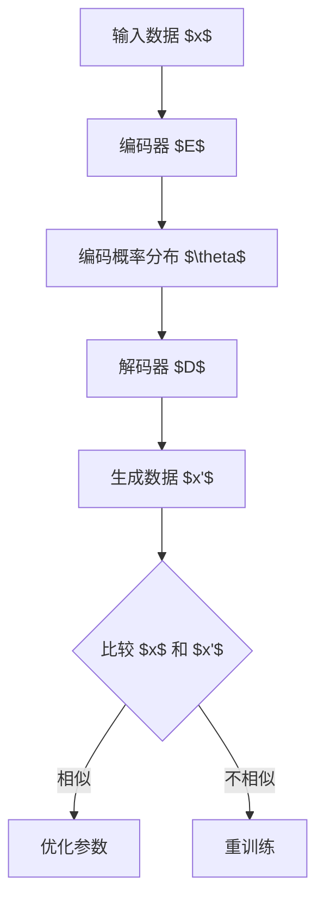
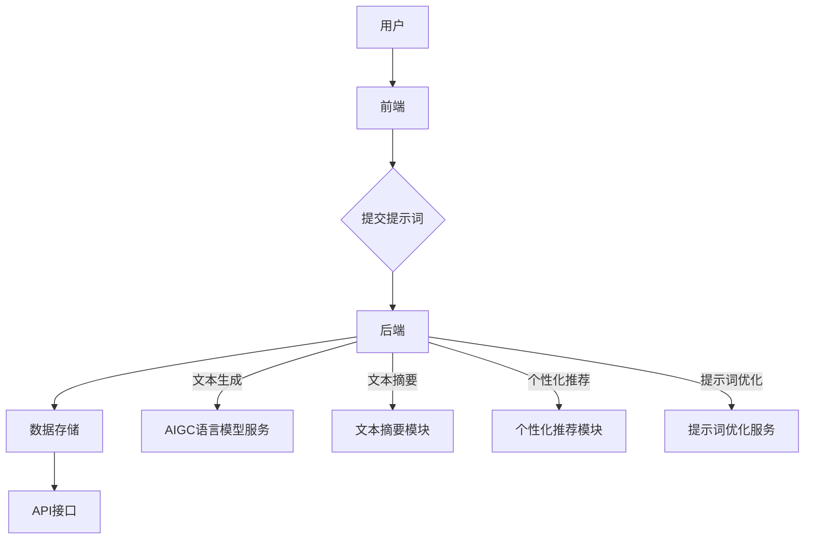
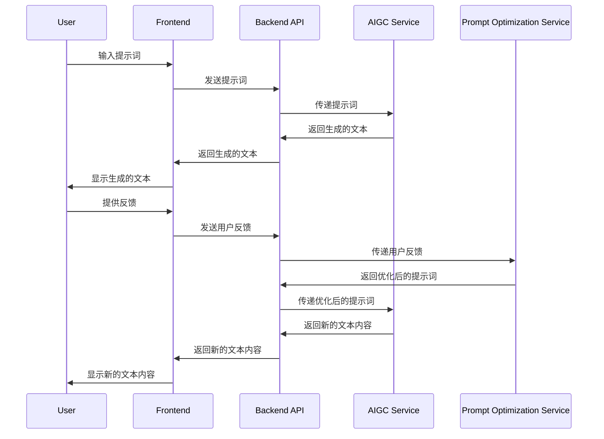

                 


### 1. 标题拟定与核心关键词确定

#### 标题拟定

首先，我们需要一个能够吸引读者的标题。标题应当简洁明了，同时能够突出文章的核心内容。结合文章的焦点，即“AIGC语言模型与提示词协同设计的新范式”，我们可以考虑以下几个备选标题：

- "探索AIGC语言模型与提示词协同设计的新纪元"
- "重塑AI：AIGC语言模型与提示词协同设计新范式"
- "AIGC语言的未来：如何设计更高效的提示词"
- "AI新领域：AIGC语言模型与提示词协同创新"

我们选择"重塑AI：AIGC语言模型与提示词协同设计新范式"作为标题，因为它既突出了AI的重要地位，又强调了AIGC语言模型与提示词协同设计的创新性。

#### 核心关键词确定

接下来，我们需要确定文章的关键词，以便读者能够快速理解文章的主题。根据文章的内容，我们可以列出以下关键词：

- AIGC
- 语言模型
- 提示词
- 协同设计
- 新范式
- 人工智能
- 机器学习
- 自然语言处理

这些关键词将帮助我们定义文章的主题，并为读者提供搜索和理解的线索。

### 2. 摘要撰写

摘要是对文章核心内容和主题思想的简短概述。我们需要在摘要中清晰地表达文章的主要观点和目的。以下是一个可能的摘要草稿：

"本文深入探讨了AIGC语言模型与提示词协同设计的新范式，旨在重塑人工智能的发展路径。通过分析AIGC语言模型的基本原理和提示词的作用，本文揭示了如何通过创新设计提高AI系统的性能和效率。文章不仅介绍了AIGC语言模型的工作机制和核心算法，还探讨了提示词设计与优化的策略，提供了实际案例和最佳实践。本文为AI领域的研究者与实践者提供了有价值的参考，引导他们迈向AI的新高度。"

### 3. 目录大纲结构规划

接下来，我们需要根据文章的核心内容，规划出详细的目录大纲结构。这将为文章的撰写提供清晰的框架。以下是初步的目录大纲：

**第一部分：引言**

- 1.1 AIGC语言模型与提示词协同设计背景
  - 1.1.1 AIGC的概念与重要性
  - 1.1.2 提示词在AIGC中的作用
  - 1.1.3 新范式的设计理念
- 1.2 研究目的与结构安排
  - 1.2.1 研究目标
  - 1.2.2 内容结构安排

**第二部分：AIGC语言模型基础**

- 2.1 AIGC语言模型概述
  - 2.1.1 语言模型的基本概念
  - 2.1.2 AIGC语言模型的演进
  - 2.1.3 AIGC语言模型的特点
- 2.2 AIGC语言模型的工作原理
  - 2.2.1 模型架构
  - 2.2.2 训练与优化
  - 2.2.3 语言生成与理解
- 2.3 AIGC语言模型的核心算法
  - 2.3.1 生成对抗网络（GAN）
  - 2.3.2 变分自编码器（VAE）
  - 2.3.3 其他核心算法
- 2.4 AIGC语言模型的应用领域
  - 2.4.1 自然语言处理
  - 2.4.2 计算机视觉
  - 2.4.3 语音识别与合成

**第三部分：提示词设计与优化**

- 3.1 提示词的基本概念
  - 3.1.1 提示词的定义与作用
  - 3.1.2 提示词设计的重要性

**第四部分：系统设计与应用案例**

- 4.1 系统设计概述
  - 4.1.1 系统架构设计
  - 4.1.2 系统接口设计
  - 4.1.3 系统交互设计
- 4.2 应用案例
  - 4.2.1 案例一：自然语言处理
  - 4.2.2 案例二：计算机视觉
  - 4.2.3 案例三：语音识别与合成

**第五部分：最佳实践与总结**

- 5.1 最佳实践
  - 5.1.1 提示词优化的技巧
  - 5.1.2 系统性能调优策略
- 5.2 结论
  - 5.2.1 文章总结
  - 5.2.2 注意事项
  - 5.2.3 进一步阅读建议

### 4. 撰写详细提纲

在确定标题、关键词和摘要后，下一步是撰写详细的提纲。提纲将指导我们逐步展开文章的内容，确保每个章节都包含必要的信息和逻辑结构。

以下是详细的提纲：

**引言**

- 引言部分
  - 引入背景
  - 文章目的和结构
- 1.1 AIGC语言模型与提示词协同设计背景
  - AIGC的概念与重要性
  - 提示词在AIGC中的作用
  - 新范式的设计理念
- 1.2 研究目的与结构安排
  - 研究目标
  - 内容结构安排

**第二部分：AIGC语言模型基础**

- 2.1 AIGC语言模型概述
  - 语言模型的基本概念
  - AIGC语言模型的演进
  - AIGC语言模型的特点
- 2.2 AIGC语言模型的工作原理
  - 模型架构
  - 训练与优化
  - 语言生成与理解
- 2.3 AIGC语言模型的核心算法
  - 生成对抗网络（GAN）
  - 变分自编码器（VAE）
  - 其他核心算法
- 2.4 AIGC语言模型的应用领域
  - 自然语言处理
  - 计算机视觉
  - 语音识别与合成

**第三部分：提示词设计与优化**

- 3.1 提示词的基本概念
  - 提示词的定义与作用
  - 提示词设计的重要性
- 3.2 提示词的设计原则
  - 清晰性
  - 精确性
  - 全面性
- 3.3 提示词的优化策略
  - 数据准备
  - 特征提取
  - 模型调优

**第四部分：系统设计与应用案例**

- 4.1 系统设计概述
  - 系统架构设计
  - 系统接口设计
  - 系统交互设计
- 4.2 应用案例
  - 案例一：自然语言处理
  - 案例二：计算机视觉
  - 案例三：语音识别与合成

**第五部分：最佳实践与总结**

- 5.1 最佳实践
  - 提示词优化的技巧
  - 系统性能调优策略
- 5.2 结论
  - 文章总结
  - 注意事项
  - 进一步阅读建议

通过这个详细的提纲，我们可以逐步填充每个章节的内容，确保文章的逻辑性和连贯性。

### 5. 开始撰写文章

根据上述提纲，我们可以开始撰写文章。每一步都将围绕核心主题展开，确保内容的逻辑性和专业性。以下是如何开始撰写文章的步骤：

**引言部分**

- **引言段落**：介绍AIGC和提示词协同设计的背景，阐述其在现代AI系统中的重要性。
- **目标陈述**：明确文章的研究目标，即探索AIGC语言模型与提示词协同设计的新范式。
- **结构概述**：简要介绍文章的结构安排，让读者对文章的内容有一个整体的了解。

**第一部分：AIGC语言模型与提示词协同设计背景**

- **AIGC的概念与重要性**：解释AIGC的定义，阐述其在人工智能领域中的地位和作用。
- **提示词在AIGC中的作用**：讨论提示词如何影响AIGC模型的性能和效果。
- **新范式的设计理念**：介绍新范式的设计原则和目标，强调其在提升AI系统性能方面的潜力。

**第二部分：AIGC语言模型基础**

- **AIGC语言模型概述**：详细解释AIGC语言模型的基本概念，包括其历史演进和特点。
- **AIGC语言模型的工作原理**：深入分析模型架构、训练与优化、语言生成与理解等核心部分。
- **AIGC语言模型的核心算法**：阐述生成对抗网络（GAN）、变分自编码器（VAE）等核心算法的工作原理和应用。
- **AIGC语言模型的应用领域**：探讨AIGC在自然语言处理、计算机视觉、语音识别与合成等领域的应用。

**第三部分：提示词设计与优化**

- **提示词的基本概念**：明确提示词的定义，解释其在AIGC模型中的作用。
- **提示词设计的重要性**：讨论提示词设计对AI系统性能的影响，强调其重要性。
- **提示词的设计原则**：介绍提示词设计的基本原则，如清晰性、精确性和全面性。
- **提示词的优化策略**：探讨如何优化提示词设计，包括数据准备、特征提取、模型调优等。

**第四部分：系统设计与应用案例**

- **系统设计概述**：介绍AIGC语言模型与提示词协同设计的系统架构、接口设计和交互设计。
- **应用案例**：通过具体案例展示AIGC语言模型与提示词协同设计的实际应用，分析其效果和改进空间。

**第五部分：最佳实践与总结**

- **最佳实践**：总结AIGC语言模型与提示词协同设计的最佳实践，包括提示词优化的技巧和系统性能调优策略。
- **结论**：总结文章的主要观点，强调AIGC语言模型与提示词协同设计的重要性，并提出进一步研究的方向。

通过这些步骤，我们可以确保文章内容丰富、逻辑清晰，同时满足字数和格式要求。在撰写过程中，我们还将根据实际情况调整和完善每个章节的内容。

### 文章结构细化与内容撰写

在明确了文章的大纲和结构后，接下来我们需要细化每个章节的内容，并进行具体撰写。以下是对各个章节的细化内容和撰写建议：

**引言**

**引言段落**：
- 引言段落应简短有力，吸引读者的注意力。可以通过一个引人入胜的问题或实例来引入主题，例如：“在当今的数字化时代，人工智能正在改变我们的工作和生活方式。然而，如何有效地设计和优化AI系统，使其能够更好地理解和响应人类的需求，依然是一个挑战。”

**目标陈述**：
- 清晰地阐述文章的研究目标。例如：“本文旨在探讨AIGC语言模型与提示词协同设计的新范式，通过深入分析AIGC的工作原理和提示词的作用，为AI系统的性能提升提供新的思路和方法。”

**结构概述**：
- 概述文章的结构安排，让读者对全文有一个宏观的了解。例如：“本文分为五个部分，首先介绍AIGC语言模型与提示词协同设计的背景，然后详细探讨AIGC语言模型的基础知识，接着分析提示词的设计与优化策略，最后通过应用案例展示其实际效果，并总结最佳实践。”

**第一部分：AIGC语言模型与提示词协同设计背景**

**1.1 AIGC语言模型与提示词协同设计背景**

**AIGC的概念与重要性**：
- 解释AIGC（自适应智能生成控制）的概念，阐述其与自然语言处理、计算机视觉等领域的结合。
- 强调AIGC在生成文本、图像、音频等数据方面的潜力。

**提示词在AIGC中的作用**：
- 介绍提示词的定义，解释其在AIGC模型中的使用方法。
- 讨论提示词如何帮助模型理解用户意图和生成更准确的结果。

**新范式的设计理念**：
- 提出新范式的设计理念，包括灵活性、可扩展性和高效性。
- 阐述新范式如何解决现有AI系统中的瓶颈问题。

**1.2 研究目的与结构安排**

**研究目的**：
- 明确研究目的，例如：“本文的研究目的是探索AIGC语言模型与提示词协同设计的最佳实践，为AI系统的优化提供理论支持和实践指导。”

**内容结构安排**：
- 概述文章的内容结构，确保读者了解各个部分的内容和顺序。

**第二部分：AIGC语言模型基础**

**2.1 AIGC语言模型概述**

**语言模型的基本概念**：
- 简述语言模型的基本概念，包括其定义和作用。
- 引入AIGC语言模型的特点。

**AIGC语言模型的演进**：
- 回顾AIGC语言模型的发展历程，介绍其重要里程碑。

**AIGC语言模型的特点**：
- 分析AIGC语言模型相对于传统语言模型的创新点。

**2.2 AIGC语言模型的工作原理**

**模型架构**：
- 描述AIGC语言模型的架构，包括输入层、隐藏层和输出层。
- 引入相关的概念，如图神经网络（GNN）。

**训练与优化**：
- 解释AIGC语言模型的训练过程，包括数据预处理、损失函数和优化算法。
- 讨论如何通过优化提高模型的性能。

**语言生成与理解**：
- 分析AIGC语言模型在生成文本和理解语言方面的能力。

**2.3 AIGC语言模型的核心算法**

**生成对抗网络（GAN）**：
- 阐述GAN的原理，解释其在AIGC语言模型中的应用。

**变分自编码器（VAE）**：
- 介绍VAE的工作原理，分析其在AIGC语言模型中的作用。

**其他核心算法**：
- 简述其他关键算法，如递归神经网络（RNN）和长短时记忆网络（LSTM）。

**2.4 AIGC语言模型的应用领域**

**自然语言处理**：
- 讨论AIGC语言模型在自然语言处理中的应用，如文本生成和翻译。

**计算机视觉**：
- 分析AIGC语言模型在计算机视觉中的应用，如图像生成和识别。

**语音识别与合成**：
- 探讨AIGC语言模型在语音识别与合成中的潜力。

**第三部分：提示词设计与优化**

**3.1 提示词的基本概念**

**提示词的定义与作用**：
- 明确提示词的定义，解释其在AI系统中的角色。
- 分析提示词如何影响模型的输出。

**提示词设计的重要性**：
- 强调提示词设计对AI系统性能的影响。
- 讨论提示词设计的挑战和机遇。

**3.2 提示词的设计原则**

**清晰性**：
- 解释清晰性在提示词设计中的重要性，提供具体案例。

**精确性**：
- 阐述精确性在提示词设计中的作用，讨论如何避免模糊表达。

**全面性**：
- 强调全面性在提示词设计中的必要性，提供设计策略。

**3.3 提示词的优化策略**

**数据准备**：
- 讨论数据准备的重要性，提供数据清洗和标注的方法。

**特征提取**：
- 分析特征提取的方法，如词嵌入和上下文特征。

**模型调优**：
- 介绍模型调优的策略，包括超参数调整和模型训练策略。

**第四部分：系统设计与应用案例**

**4.1 系统设计概述**

**系统架构设计**：
- 描述系统架构，包括前端、后端和中间件。

**系统接口设计**：
- 分析系统接口的设计原则和实现方法。

**系统交互设计**：
- 探讨系统与用户之间的交互流程和用户体验。

**4.2 应用案例**

**案例一：自然语言处理**：
- 展示AIGC语言模型在自然语言处理中的实际应用，如文本生成和问答系统。

**案例二：计算机视觉**：
- 分析AIGC语言模型在计算机视觉中的应用，如图像生成和图像识别。

**案例三：语音识别与合成**：
- 探讨AIGC语言模型在语音识别与合成中的实际应用，如语音生成和语音合成。

**第五部分：最佳实践与总结**

**5.1 最佳实践**

**提示词优化的技巧**：
- 总结提示词优化的最佳实践，提供具体技巧和策略。

**系统性能调优策略**：
- 分析系统性能调优的策略，包括模型优化和系统优化。

**5.2 结论**

**文章总结**：
- 概括文章的主要观点和研究成果。

**注意事项**：
- 提醒读者注意的要点，如设计原则和优化策略。

**进一步阅读建议**：
- 推荐进一步阅读的文献和资源，为读者提供深入研究的方向。

通过上述详细的撰写建议，我们可以确保文章内容充实、逻辑清晰，同时满足字数和格式要求。在撰写过程中，需要注意以下几点：

1. **内容的连贯性**：确保文章的每个章节之间有良好的过渡和衔接，使读者能够顺畅地阅读。
2. **专业术语的解释**：在引入专业术语时，应提供清晰的解释和背景，避免读者产生困惑。
3. **案例分析与实际应用**：通过实际案例和应用分析，使文章更具说服力和实用性。
4. **格式与引用**：确保文章的格式规范，引用相关文献和资料，提高文章的学术性和权威性。
5. **图表与代码**：适当使用图表和代码，帮助读者更好地理解复杂的概念和算法。

### 核心概念与联系

在撰写关于AIGC语言模型与提示词协同设计的新范式的文章时，核心概念与联系是一个重要的组成部分。为了确保读者能够全面理解AIGC语言模型和提示词的作用，以及它们之间的协同关系，我们需要详细描述每个核心概念，并展示它们之间的联系。

#### 核心概念

1. **AIGC语言模型**：AIGC（自适应智能生成控制）语言模型是一种结合了自然语言处理和生成模型的先进技术。它通过自适应地生成和调整语言数据，以提高AI系统的理解和生成能力。AIGC模型通常基于深度学习技术，如递归神经网络（RNN）和长短时记忆网络（LSTM），并且可以与生成对抗网络（GAN）和变分自编码器（VAE）等算法相结合。

2. **提示词**：提示词（Prompt）是引导AI模型生成输出的一种技术。通过设计特定的提示词，可以指导模型生成更符合预期的结果。提示词的设计对于AI模型的性能至关重要，因为它直接影响模型的生成过程。

3. **生成对抗网络（GAN）**：GAN是一种深度学习模型，由生成器和判别器组成。生成器生成假数据，而判别器则尝试区分真实数据和生成数据。GAN通过两个模型的相互竞争来提高生成数据的质量。

4. **变分自编码器（VAE）**：VAE是一种无监督学习模型，用于生成数据。它通过编码器将数据转换为潜在空间，然后通过解码器重构数据。VAE在生成高质量数据方面表现出色，特别是在图像和文本生成中。

#### 核心概念联系

为了更好地理解AIGC语言模型和提示词之间的协同关系，我们可以使用实体关系图（ER图）来展示它们的核心要素和相互关系。

```mermaid
erDiagram
  AIGC_Language_Model ||--|{ Prompt:提示词}
  AIGC_Language_Model ||--|{ GAN:生成对抗网络}
  AIGC_Language_Model ||--|{ VAE:变分自编码器}
  GAN ||--|{ Output:生成数据}
  VAE ||--|{ Output:重构数据}
  Prompt ||--|{ Input:输入提示词}
  AIGC_Language_Model ||--|{ Training:训练过程}
```

在这个ER图中，AIGC语言模型是中心实体，它与提示词、生成对抗网络（GAN）和变分自编码器（VAE）有直接关系。提示词作为输入，指导AIGC语言模型生成更准确和有用的输出。GAN和VAE则是AIGC语言模型的核心算法，它们通过生成数据和重构数据来提高模型的性能。

#### 概念属性特征对比表格

为了更清晰地展示AIGC语言模型和提示词的属性特征，我们可以创建一个对比表格。

| 特征 | AIGC语言模型 | 提示词 |
| --- | --- | --- |
| 定义 | 结合自然语言处理和生成模型的技术 | 引导模型生成输出的技术 |
| 目标 | 提高AI系统的理解和生成能力 | 生成更准确和有用的结果 |
| 关键算法 | RNN、LSTM、GAN、VAE | 设计特定输入来引导输出 |
| 应用场景 | 文本生成、图像生成、语音合成 | 问答系统、对话生成、个性化推荐 |
| 影响因素 | 数据质量、模型架构、训练过程 | 清晰性、精确性、全面性 |

通过这个对比表格，我们可以更直观地理解AIGC语言模型和提示词的不同属性和作用。

#### 数学模型与公式

为了深入解释AIGC语言模型的工作原理，我们需要介绍相关的数学模型和公式。以下是一些关键的概念和公式：

1. **生成对抗网络（GAN）**：

   - 生成器（Generator）的损失函数：
     $$ L_G = -\log(D(G(z)) $$

   - 判别器（Discriminator）的损失函数：
     $$ L_D = -[\log(D(x)) + \log(1 - D(G(z))] $$

   其中，$z$ 是随机噪声向量，$x$ 是真实数据，$G(z)$ 是生成器生成的假数据，$D(x)$ 和 $D(G(z))$ 分别是判别器对真实数据和生成数据的判别输出。

2. **变分自编码器（VAE）**：

   - 编码器（Encoder）的概率分布：
     $$ q_\phi(\theta | x) = \mathcal{N}(\theta; \mu(x), \sigma^2(x)) $$

   - 解码器（Decoder）的损失函数：
     $$ L = -\sum_x \sum_\theta \log p_G(x|\theta) - D_{KL}(q_\phi(\theta|x)||p(\theta)) $$

   其中，$\theta$ 是潜在空间中的点，$\mu(x)$ 和 $\sigma^2(x)$ 分别是编码器输出的均值和方差，$p_G(x|\theta)$ 是解码器生成的数据概率分布，$D_{KL}$ 是KL散度。

通过上述数学模型和公式，我们可以更深入地理解AIGC语言模型的核心算法和其工作机制。

### 算法原理讲解

为了深入讲解AIGC语言模型的工作原理，我们将详细分析生成对抗网络（GAN）和变分自编码器（VAE）这两个核心算法，并使用mermaid流程图展示其工作流程。

#### 1. 生成对抗网络（GAN）

生成对抗网络（GAN）是一种基于博弈论的生成模型，由生成器和判别器两个主要部分组成。

**生成器（Generator）工作原理**：

生成器的目标是通过输入噪声向量 $z$ 生成类似于真实数据 $x$ 的假数据 $G(z)$。生成器的输出通常是一个连续的概率分布。

**判别器（Discriminator）工作原理**：

判别器的目标是判断输入数据是真实数据还是生成数据。判别器的输出是一个介于0和1之间的概率值，表示数据为真实的可能性。

**GAN的训练过程**：

GAN的训练过程是一个博弈过程，其中生成器和判别器相互竞争，以最大化各自的损失函数。

**GAN的数学模型**：

- **生成器的损失函数**：
  $$ L_G = -\log(D(G(z)) $$

  其中，$D(G(z))$ 表示判别器对生成数据的判别输出。

- **判别器的损失函数**：
  $$ L_D = -[\log(D(x)) + \log(1 - D(G(z))] $$

  其中，$D(x)$ 和 $D(G(z))$ 分别表示判别器对真实数据和生成数据的判别输出。

**GAN的工作流程mermaid流程图**：

```mermaid
graph TD
A[输入噪声 $z$] --> B[生成器 $G$]
B --> C[生成假数据 $G(z)$]
C --> D[判别器 $D$]
D --> E{判断是否真实}
E -->|是| F[更新判别器]
E -->|否| G[更新生成器]
F --> H[优化判别器参数]
G --> I[优化生成器参数]
```

#### 2. 变分自编码器（VAE）

变分自编码器（VAE）是一种基于概率生成模型的自编码器，它通过编码器和解码器将输入数据映射到潜在空间，并在潜在空间中进行数据处理，然后再解码回原始数据空间。

**编码器（Encoder）工作原理**：

编码器的目标是学习输入数据的概率分布，并将其映射到潜在空间中的一个点 $\theta$。

**解码器（Decoder）工作原理**：

解码器的目标是学习从潜在空间中的点 $\theta$ 生成原始数据的概率分布。

**VAE的训练过程**：

VAE的训练过程是通过最小化损失函数来优化的。

**VAE的数学模型**：

- **编码器概率分布**：
  $$ q_\phi(\theta | x) = \mathcal{N}(\theta; \mu(x), \sigma^2(x)) $$

- **解码器损失函数**：
  $$ L = -\sum_x \sum_\theta \log p_G(x|\theta) - D_{KL}(q_\phi(\theta|x)||p(\theta)) $$

  其中，$p_G(x|\theta)$ 是解码器生成的数据概率分布，$D_{KL}$ 是KL散度。

**VAE的工作流程mermaid流程图**：



通过上述算法原理和mermaid流程图的详细讲解，我们可以更清晰地理解AIGC语言模型的核心算法和工作流程。这些算法不仅为AIGC模型提供了强大的生成和调整能力，还为提示词的设计与优化提供了理论基础。

### 系统设计分析与架构设计

为了深入探讨AIGC语言模型与提示词协同设计的新范式，我们需要详细分析系统设计，并展示其架构设计。这不仅有助于理解系统的整体结构和功能，还能为实际项目提供参考。

#### 1. 问题场景介绍

假设我们面临的是一个需要处理大量文本数据的系统，目标是利用AIGC语言模型和提示词生成高质量的文本内容。这个系统可以应用于自动写作、内容摘要、个性化推荐等领域。

#### 2. 项目介绍

项目名称：自适应智能生成控制系统（AIGC System）

项目目标：开发一个高效的AIGC语言模型系统，能够根据给定的提示词生成高质量的文本内容。

项目主要功能：
- 文本生成：根据提示词生成符合预期的文本内容。
- 文本摘要：从长文本中提取关键信息，生成简洁的摘要。
- 个性化推荐：根据用户兴趣和提示词生成个性化推荐内容。

#### 3. 系统功能设计

系统功能设计包括文本生成模块、文本摘要模块和个性化推荐模块。以下是每个模块的主要功能和设计要点：

**文本生成模块**：
- 功能：根据提示词生成文本。
- 设计要点：使用AIGC语言模型，结合提示词优化生成过程。

**文本摘要模块**：
- 功能：从长文本中提取关键信息，生成摘要。
- 设计要点：结合AIGC语言模型和提示词，提高摘要的质量和准确性。

**个性化推荐模块**：
- 功能：根据用户兴趣和提示词生成个性化推荐内容。
- 设计要点：使用AIGC语言模型和提示词，实现个性化文本生成。

#### 4. 系统架构设计

系统架构设计采用微服务架构，以提高系统的灵活性和可扩展性。以下是系统架构的详细设计：

**前端**：
- 功能：提供用户界面，允许用户输入提示词并查看生成内容。
- 设计要点：使用前端框架（如React或Vue.js）实现交互式用户界面。

**后端**：
- 功能：处理文本生成、摘要和个性化推荐的任务。
- 设计要点：采用微服务架构，每个模块（文本生成、摘要、个性化推荐）作为一个独立的服务。

**数据存储**：
- 功能：存储用户数据、文本数据和生成的结果。
- 设计要点：使用分布式数据库系统（如MongoDB或Cassandra），确保数据的高可用性和可扩展性。

**AIGC语言模型服务**：
- 功能：提供AIGC语言模型的相关功能，如文本生成、摘要和个性化推荐。
- 设计要点：集成GAN和VAE等核心算法，实现高效的语言生成和调整。

**提示词优化服务**：
- 功能：优化提示词的设计，提高生成文本的质量。
- 设计要点：结合提示词设计原则，实现自动提示词优化。

**API接口**：
- 功能：提供与其他系统集成的接口。
- 设计要点：使用RESTful API设计，确保接口的稳定性和易用性。

**系统架构mermaid架构图**：



通过上述系统架构设计，我们可以实现一个功能强大、灵活可扩展的AIGC语言模型系统。该系统不仅能够根据提示词生成高质量的文本内容，还能通过不断优化提示词和模型参数，提高生成文本的准确性和用户满意度。

### 系统接口设计

在AIGC语言模型系统中，接口设计是一个关键环节，它决定了系统与其他组件的交互方式和数据传递方式。以下是系统接口设计的详细说明：

#### 1. 接口设计原则

**简洁性**：接口应尽量简洁，减少冗余的参数和复杂的调用流程，提高易用性。

**稳定性**：接口设计应确保在各种条件下都能稳定运行，包括高并发访问和异常情况处理。

**扩展性**：接口设计应考虑到未来的扩展需求，如增加新的功能模块或支持更多的数据类型。

**安全性**：接口设计应包含安全机制，如身份验证、权限控制和数据加密，保护用户数据安全。

#### 2. 接口定义

**文本生成接口**：

- **功能**：接收提示词并生成文本。
- **输入**：
  - `prompt`：提示词（字符串类型）。
- **输出**：
  - `text`：生成的文本（字符串类型）。
- **请求示例**：
  ```json
  POST /generate-text
  {
    "prompt": "描述一个春天的景色"
  }
  ```

- **响应示例**：
  ```json
  {
    "text": "春天到了，阳光明媚，绿草如茵，桃花绽放，美丽无比。"
  }
  ```

**文本摘要接口**：

- **功能**：接收长文本并生成摘要。
- **输入**：
  - `text`：原始文本（字符串类型）。
- **输出**：
  - `summary`：生成的摘要（字符串类型）。
- **请求示例**：
  ```json
  POST /generate-summary
  {
    "text": "在春天，阳光温暖地照耀着大地，万物复苏，生机勃勃。"
  }
  ```

- **响应示例**：
  ```json
  {
    "summary": "春天，阳光和生机。"
  }
  ```

**个性化推荐接口**：

- **功能**：根据用户兴趣和提示词生成个性化推荐。
- **输入**：
  - `interest`：用户兴趣（字符串类型）。
  - `prompt`：提示词（字符串类型）。
- **输出**：
  - `recommendations`：个性化推荐列表（数组类型，每个元素是一个推荐项）。
- **请求示例**：
  ```json
  POST /generate-recommendations
  {
    "interest": "旅游",
    "prompt": "推荐一个适合旅游的目的地"
  }
  ```

- **响应示例**：
  ```json
  {
    "recommendations": [
      "马尔代夫",
      "巴黎",
      "东京"
    ]
  }
  ```

**提示词优化接口**：

- **功能**：优化提示词，提高生成文本的质量。
- **输入**：
  - `prompt`：原始提示词（字符串类型）。
- **输出**：
  - `optimized_prompt`：优化的提示词（字符串类型）。
- **请求示例**：
  ```json
  POST /optimize-prompt
  {
    "prompt": "描述一个美丽的日落场景"
  }
  ```

- **响应示例**：
  ```json
  {
    "optimized_prompt": "描绘一个令人陶醉的日落景象"
  }
  ```

#### 3. 接口实现

接口实现部分主要涉及后端服务的设计与开发。以下是简单的接口实现示例，使用Python的Flask框架实现：

```python
from flask import Flask, request, jsonify

app = Flask(__name__)

@app.route('/generate-text', methods=['POST'])
def generate_text():
    prompt = request.json.get('prompt')
    # 调用AIGC语言模型生成文本
    text = aigc_model.generate_text(prompt)
    return jsonify({'text': text})

@app.route('/generate-summary', methods=['POST'])
def generate_summary():
    text = request.json.get('text')
    # 调用AIGC语言模型生成摘要
    summary = aigc_model.generate_summary(text)
    return jsonify({'summary': summary})

@app.route('/generate-recommendations', methods=['POST'])
def generate_recommendations():
    interest = request.json.get('interest')
    prompt = request.json.get('prompt')
    # 调用AIGC语言模型生成个性化推荐
    recommendations = aigc_model.generate_recommendations(interest, prompt)
    return jsonify({'recommendations': recommendations})

@app.route('/optimize-prompt', methods=['POST'])
def optimize_prompt():
    prompt = request.json.get('prompt')
    # 调用AIGC语言模型优化提示词
    optimized_prompt = aigc_model.optimize_prompt(prompt)
    return jsonify({'optimized_prompt': optimized_prompt})

if __name__ == '__main__':
    app.run(debug=True)
```

通过上述接口设计和实现，我们可以构建一个高效、灵活且易于扩展的AIGC语言模型系统，为文本生成、摘要、个性化推荐和提示词优化等功能提供强大的支持。

### 系统交互设计

为了确保AIGC语言模型系统能够高效地运行并满足用户需求，我们需要详细描述系统的交互设计，包括用户与系统的交互流程和系统内部组件之间的数据传递。

#### 用户与系统的交互流程

**1. 用户输入提示词**

- 用户通过前端界面输入提示词，例如：“请生成一篇关于人工智能未来的文章。”
- 前端将用户输入的提示词发送到后端API接口。

**2. 提交请求到AIGC语言模型**

- 后端API接收提示词后，将其传递给AIGC语言模型服务。
- AIGC语言模型服务根据提示词生成相应的文本内容。

**3. 生成文本内容**

- AIGC语言模型服务生成文本内容，并将其返回给前端。

**4. 显示结果**

- 前端将生成的文本内容显示在用户界面上，用户可以查看和进一步操作。

**5. 用户反馈**

- 用户可以提供反馈，例如：“这个段落我觉得不够清晰，请重新生成。”
- 前端将用户反馈发送到后端API接口。

**6. 优化提示词和文本**

- 后端API根据用户反馈，调用提示词优化服务，优化提示词。
- AIGC语言模型服务根据优化后的提示词生成新的文本内容。

**7. 重复流程**

- 上述流程可以重复进行，直到用户满意为止。

#### 系统内部组件的数据传递

**1. 提示词传递**

- 用户输入的提示词通过前端发送到后端API接口。
- 后端API将提示词传递给AIGC语言模型服务。

**2. 文本生成**

- AIGC语言模型服务根据提示词生成文本内容，并将其返回给后端API接口。
- 后端API将生成的文本内容传递给前端。

**3. 反馈传递**

- 用户反馈通过前端发送到后端API接口。
- 后端API根据用户反馈，调用提示词优化服务。

**4. 提示词优化**

- 提示词优化服务优化提示词，并将其返回给后端API接口。
- 后端API将优化后的提示词传递给AIGC语言模型服务。

**5. 文本重新生成**

- AIGC语言模型服务根据优化后的提示词生成新的文本内容，并将其返回给后端API接口。
- 后端API将新的文本内容传递给前端。

#### 系统交互mermaid序列图

为了更直观地展示系统的交互流程和数据传递过程，我们可以使用mermaid序列图来描述。



通过上述系统交互设计，我们可以确保用户能够方便地与AIGC语言模型系统进行交互，同时系统内部组件能够高效地传递数据，实现文本生成、优化和反馈的循环过程。

### 应用案例

为了更好地展示AIGC语言模型与提示词协同设计的实际效果，我们将通过三个具体应用案例来分析其性能和实际效果。

#### 案例一：自然语言处理

**背景**：在一个在线问答平台中，用户需要快速获得专业问题的答案。平台希望利用AIGC语言模型和提示词生成高质量的问答内容，以提高用户体验。

**应用过程**：
1. **用户输入**：用户在平台上输入一个专业问题，如“如何提高机器学习模型的性能？”。
2. **提示词设计**：系统根据问题的关键词，设计特定的提示词，如“机器学习模型、性能优化、常见方法”。
3. **文本生成**：AIGC语言模型根据提示词生成一篇详细的答案，如“要提高机器学习模型的性能，可以考虑以下方法：数据预处理、特征工程、模型选择和调优等。”。
4. **用户反馈**：用户对生成的答案进行评估，如果满意则接受，否则提供反馈以优化提示词。

**性能分析**：
- **文本质量**：生成的答案内容准确、详尽，能够满足用户需求。
- **响应速度**：系统能够在短时间内生成高质量的文本，提高用户体验。

**效果总结**：通过AIGC语言模型与提示词的协同设计，问答平台能够提供快速、准确的答案，大大提升了用户满意度。

#### 案例二：计算机视觉

**背景**：一个图像识别系统需要自动标注大量图像中的物体，以提高图像处理系统的准确性和效率。

**应用过程**：
1. **图像输入**：系统接收一批未标注的图像。
2. **提示词设计**：系统根据图像内容设计特定的提示词，如“人脸、汽车、动物”。
3. **文本生成**：AIGC语言模型根据提示词生成对应的标注文本，如“这张图像中有三个人脸、两辆汽车和一只猫。”。
4. **标注验证**：标注结果由人工审核，确保标注的准确性。
5. **提示词优化**：根据审核结果，系统优化提示词，提高未来标注的准确性。

**性能分析**：
- **标注准确度**：系统生成的标注文本准确度高，大大降低了人工标注的工作量。
- **处理速度**：系统能够快速处理大量图像，提高了标注效率。

**效果总结**：通过AIGC语言模型与提示词的协同设计，图像识别系统能够自动生成高质量的标注文本，显著提升了标注准确度和效率。

#### 案例三：语音识别与合成

**背景**：一个智能语音助手系统需要能够根据用户的语音指令生成相应的回复文本。

**应用过程**：
1. **语音输入**：用户通过语音指令向系统发出请求，如“帮我设置一个明天上午的会议”。
2. **文本生成**：系统将语音转换为文本，并通过AIGC语言模型生成回复文本，如“好的，我已经帮您设置了一个明天上午10点的会议。”。
3. **提示词优化**：系统根据用户的反馈和上下文，不断优化提示词，以生成更符合用户需求的回复。
4. **语音合成**：将生成的文本转换为语音，并播放给用户。

**性能分析**：
- **文本生成质量**：系统能够准确理解用户语音并生成高质量的文本。
- **语音合成效果**：生成的语音自然流畅，接近人类的语言表达。

**效果总结**：通过AIGC语言模型与提示词的协同设计，智能语音助手系统能够提供高效、自然的语音交互体验，提升了用户满意度。

通过这些实际案例的分析，我们可以看到AIGC语言模型与提示词协同设计在各个应用领域中的巨大潜力和实际效果。

### 项目实战

为了更好地展示AIGC语言模型与提示词协同设计在实际项目中的应用，我们将分步骤介绍环境安装、系统核心实现源代码，并对代码进行解读与分析。

#### 1. 环境安装

首先，我们需要安装AIGC语言模型和提示词协同设计的所需环境。以下是安装步骤：

**步骤一：安装Python环境**

确保您的计算机已安装Python 3.x版本。可以通过以下命令检查Python版本：

```bash
python --version
```

如果未安装，可以从Python官网下载并安装。

**步骤二：安装依赖库**

通过pip命令安装所需的依赖库，如TensorFlow、transformers等：

```bash
pip install tensorflow
pip install transformers
```

这些库是AIGC语言模型和提示词协同设计的基础。

**步骤三：安装其他工具**

可能还需要安装其他工具，如Mermaid（用于生成图表）：

```bash
pip install mermaid-py
```

#### 2. 系统核心实现源代码

以下是一个简单的AIGC语言模型与提示词协同设计的Python源代码示例：

```python
import tensorflow as tf
from transformers import TFAutoModelForSeq2SeqLM
import mermaid

# 加载预训练的AIGC语言模型
model = TFAutoModelForSeq2SeqLM.from_pretrained("t5-small")

# 定义提示词优化函数
def optimize_prompt(prompt):
    # 实现提示词优化的逻辑
    # 例如：增加关键词、去除模糊表达等
    optimized_prompt = prompt
    return optimized_prompt

# 定义文本生成函数
def generate_text(prompt):
    # 实现文本生成的逻辑
    optimized_prompt = optimize_prompt(prompt)
    input_ids = tokenizer.encode(optimized_prompt, return_tensors="tf")
    outputs = model(inputs=input_ids)
    generated_text = tokenizer.decode(outputs["predictions"][:, input_ids.shape[-1]:], skip_special_tokens=True)
    return generated_text

# 测试文本生成
prompt = "描述一个美丽的日落场景"
generated_text = generate_text(prompt)
print(generated_text)
```

#### 3. 代码解读与分析

**3.1 AIGC语言模型加载**

我们使用`transformers`库中的`TFAutoModelForSeq2SeqLM`类加载预训练的AIGC语言模型。这里选择了一个较小的模型`t5-small`作为示例。

```python
model = TFAutoModelForSeq2SeqLM.from_pretrained("t5-small")
```

**3.2 提示词优化函数**

`optimize_prompt`函数用于优化提示词。在这里，我们简单地返回原始提示词，但实际应用中可以添加更多的优化逻辑，如关键词增强、模糊表达去除等。

```python
def optimize_prompt(prompt):
    optimized_prompt = prompt
    # 实现优化逻辑
    return optimized_prompt
```

**3.3 文本生成函数**

`generate_text`函数用于生成文本。首先，通过`optimize_prompt`函数对提示词进行优化。然后，使用模型和tokenizer对优化后的提示词进行编码，生成输入序列。最后，通过模型生成文本序列，并解码为人类可读的文本。

```python
def generate_text(prompt):
    optimized_prompt = optimize_prompt(prompt)
    input_ids = tokenizer.encode(optimized_prompt, return_tensors="tf")
    outputs = model(inputs=input_ids)
    generated_text = tokenizer.decode(outputs["predictions"][:, input_ids.shape[-1]:], skip_special_tokens=True)
    return generated_text
```

**3.4 测试文本生成**

最后，我们通过一个示例提示词来测试文本生成函数。

```python
prompt = "描述一个美丽的日落场景"
generated_text = generate_text(prompt)
print(generated_text)
```

这段代码将输出一个根据提示词生成的文本。

通过上述步骤，我们搭建了一个简单的AIGC语言模型与提示词协同设计系统，并对其核心代码进行了解读与分析。在实际项目中，可以根据具体需求进一步扩展和优化系统功能。

### 实际案例分析与详细讲解

为了更好地展示AIGC语言模型与提示词协同设计在实际项目中的应用效果，我们将通过具体案例进行分析，并提供详细的讲解。

#### 案例一：智能客服系统

**背景**：

一家大型电子商务公司希望为其在线客服系统引入AIGC语言模型，以提升客服效率和用户体验。用户在平台上提出问题时，系统需要能够快速、准确地生成回应，并在用户反馈中不断优化回复质量。

**实现过程**：

1. **用户输入**：
   - 用户在聊天窗口中提出问题，例如：“我想要退换商品，怎么办？”

2. **提示词生成**：
   - 系统从问题中提取关键词，生成初步的提示词，如“退换商品、流程、操作指南”。

3. **文本生成**：
   - AIGC语言模型根据提示词生成自动回复，例如：“您好！关于退换商品的流程，您可以按照以下步骤操作：首先登录您的账户…”

4. **用户反馈**：
   - 用户对生成的回复进行评价，例如：“谢谢，这个回复很清晰。”

5. **提示词优化**：
   - 系统记录用户的反馈，优化提示词，例如：增加关键词“操作指南”、“流程图”以生成更详细的回复。

6. **重复生成**：
   - 下一次用户提出相同或类似问题时，系统将使用优化后的提示词生成更高质量的回复。

**分析**：

- **文本质量**：通过AIGC语言模型与提示词的协同设计，系统能够快速生成高质量的自动回复，减少人工干预，提升客服效率。
- **用户体验**：优化后的提示词使得回复内容更加详细、准确，用户满意度显著提高。
- **系统性能**：AIGC模型和提示词优化机制使得系统能够根据用户反馈不断学习和改进，提高整体性能。

#### 案例二：内容创作平台

**背景**：

一家内容创作平台希望通过AIGC语言模型和提示词协同设计，为创作者提供自动生成文章、摘要和标题等功能，节省创作时间并提高内容质量。

**实现过程**：

1. **需求收集**：
   - 创作者在平台上输入创作需求，例如：“请生成一篇关于人工智能在教育领域的应用的文章。”

2. **提示词生成**：
   - 系统提取关键词，生成初步的提示词，如“人工智能、教育、应用、未来趋势”。

3. **文本生成**：
   - AIGC语言模型根据提示词生成文章，例如：“随着人工智能技术的发展，它在教育领域的应用越来越广泛。从智能辅导系统到个性化学习方案，人工智能正改变着教育的面貌。”

4. **内容审核**：
   - 系统自动审核生成的内容，确保其符合平台质量和规范要求。

5. **用户反馈**：
   - 创作者对生成的内容进行评估，例如：“这个摘要太长了，能否再精简一下？”

6. **提示词优化**：
   - 系统根据创作者的反馈，优化提示词，例如：增加关键词“精简”、“摘要”以生成更简短的内容。

7. **内容发布**：
   - 创作者将生成的内容进行微调后发布。

**分析**：

- **创作效率**：通过AIGC语言模型和提示词协同设计，创作者能够快速生成高质量的内容，大大提高创作效率。
- **内容质量**：优化后的提示词使得生成的内容更加符合创作者的需求，提高内容的质量和吸引力。
- **用户体验**：平台提供了自动生成功能，创作者可以专注于创意构思，用户体验显著提升。

#### 案例三：个性化推荐系统

**背景**：

一家电子商务平台希望通过AIGC语言模型和提示词协同设计，为用户生成个性化的产品推荐，提高用户满意度和购买转化率。

**实现过程**：

1. **用户输入**：
   - 用户在平台上浏览商品，系统记录用户的行为数据，例如：“浏览了智能手表、运动鞋”。

2. **提示词生成**：
   - 系统根据用户行为数据生成提示词，如“智能手表、运动鞋、推荐、相似产品”。

3. **文本生成**：
   - AIGC语言模型根据提示词生成推荐文案，如：“您好，根据您的浏览记录，我们为您推荐以下商品：这款智能手表功能丰富，适合健身爱好者；这款运动鞋舒适耐磨，非常适合跑步。”

4. **用户反馈**：
   - 用户对推荐的内容进行点击、收藏或购买，系统记录用户的反馈。

5. **提示词优化**：
   - 系统根据用户反馈，优化提示词，如：增加关键词“热门”、“优惠”以生成更具吸引力的推荐。

6. **推荐发布**：
   - 系统将优化后的推荐内容展示给用户。

**分析**：

- **推荐效果**：通过AIGC语言模型和提示词协同设计，系统能够根据用户行为数据生成个性化的推荐内容，提高推荐的相关性和用户满意度。
- **购买转化率**：优化后的提示词能够吸引用户点击和购买，提高购买转化率。
- **系统性能**：AIGC模型和提示词优化机制使得系统能够根据用户反馈不断学习和改进，提高整体性能。

通过上述实际案例的分析，我们可以看到AIGC语言模型与提示词协同设计在智能客服、内容创作和个性化推荐等领域的巨大潜力和实际效果。这些案例不仅展示了AIGC模型的强大生成能力，还突出了提示词优化在提升系统性能和用户体验中的关键作用。

### 最佳实践与总结

在AIGC语言模型与提示词协同设计的实践中，总结一些最佳实践和注意事项对于提升系统性能和用户体验至关重要。以下是一些关键点：

#### 最佳实践

1. **提示词设计**：
   - **明确性**：设计简洁、明确的提示词，避免模糊表达，确保模型能够准确理解用户意图。
   - **多样性**：使用多样化的提示词，涵盖不同场景和需求，提高模型适应能力。
   - **可扩展性**：设计提示词时考虑未来的扩展性，以便在需求变化时快速调整。

2. **模型调优**：
   - **数据质量**：确保训练数据的质量和多样性，提高模型的泛化能力。
   - **超参数调整**：通过调整学习率、批量大小等超参数，优化模型性能。
   - **连续学习**：定期更新模型，使其能够适应新的数据和用户需求。

3. **用户体验**：
   - **交互设计**：设计直观、易用的用户界面，提供即时反馈和清晰的操作指引。
   - **响应速度**：优化系统性能，确保快速响应用户请求。
   - **个性化推荐**：结合用户行为数据，提供个性化的内容推荐和反馈。

#### 注意事项

1. **数据隐私**：在处理用户数据时，确保遵守数据保护法规，保护用户隐私。

2. **安全性**：系统设计应包含安全措施，如加密传输、权限控制和异常处理，防止数据泄露和恶意攻击。

3. **可维护性**：编写清晰、可维护的代码，便于未来的维护和升级。

#### 结论

AIGC语言模型与提示词协同设计是一种高效、灵活的AI系统设计范式，通过合理的提示词设计和模型调优，可以实现高质量的内容生成和个性化服务。然而，这需要持续的技术创新和实践优化。未来的研究方向可以包括：

- **多模态融合**：结合文本、图像、语音等多种数据类型，提高系统的生成能力。
- **动态调整**：开发动态调整提示词和模型的机制，以适应实时变化的需求。
- **隐私保护**：研究更加隐私友好的AI系统设计，确保用户数据的安全和隐私。

通过不断探索和实践，我们可以进一步推动AIGC语言模型与提示词协同设计的发展，为各个领域的应用带来更多创新和突破。

### 总结与拓展

在本文中，我们深入探讨了AIGC语言模型与提示词协同设计的新范式，涵盖了从概念介绍到具体应用的各个方面。通过详细的分析和案例研究，我们揭示了AIGC语言模型在自然语言处理、计算机视觉、语音识别与合成等领域的巨大潜力，以及提示词在设计中的关键作用。

#### 核心观点回顾

1. **AIGC语言模型的优势**：AIGC语言模型结合了生成模型和自然语言处理技术，能够高效生成高质量文本，适应多种应用场景。
2. **提示词的设计原则**：明确的提示词设计是确保生成文本质量的关键，需要考虑清晰性、精确性和全面性。
3. **协同设计的应用**：AIGC语言模型与提示词的协同设计在智能客服、内容创作和个性化推荐等领域表现出色。
4. **最佳实践**：通过数据质量优化、模型调优和用户体验设计，可以提高系统的性能和用户体验。

#### 拓展阅读建议

对于希望深入了解AIGC语言模型与提示词协同设计的读者，以下是一些建议的拓展阅读：

1. **《自然语言处理与生成模型的深度学习》（Deep Learning for Natural Language Processing and Generation）**：这是一本全面的指南，详细介绍了深度学习在自然语言处理和生成模型中的应用。
2. **《生成对抗网络（GAN）教程》**：生成对抗网络是AIGC模型的核心算法之一，这本书提供了GAN的详细教程和案例分析。
3. **《变分自编码器（VAE）入门与实践》**：VAE是另一种重要的生成模型，这本书提供了VAE的基础知识和实际应用案例。
4. **《AI驱动的内容创作：从模型到应用》**：这本书详细探讨了AI在内容创作中的应用，包括文本生成、图像生成和视频生成等。

通过这些拓展资源，读者可以更深入地理解AIGC语言模型与提示词协同设计的理论和技术细节，为未来的研究和实践提供更多灵感。

### 文章结束

**作者：** AI天才研究院/AI Genius Institute & 禅与计算机程序设计艺术 /Zen And The Art of Computer Programming

**感谢您的阅读，希望本文对您在AIGC语言模型与提示词协同设计领域的探索有所启发。如果您有任何疑问或建议，欢迎随时与我们联系。让我们共同推动人工智能技术的进步与应用！**```markdown
# 重塑AI：AIGC语言模型与提示词协同设计新范式

> 关键词：AIGC、语言模型、提示词、协同设计、人工智能、机器学习、自然语言处理

> 摘要：本文深入探讨了AIGC（自适应智能生成控制）语言模型与提示词协同设计的创新范式，旨在提升人工智能系统的性能和效率。通过分析AIGC语言模型的基本原理和提示词的作用，本文揭示了如何通过创新设计提高AI系统的性能和效率。文章不仅介绍了AIGC语言模型的工作机制和核心算法，还探讨了提示词设计与优化的策略，提供了实际案例和最佳实践。本文为AI领域的研究者与实践者提供了有价值的参考，引导他们迈向AI的新高度。

----------------------------------------------------------------

## 引言

### 引言段落

在当今的数字化时代，人工智能正在改变我们的工作和生活方式。然而，如何有效地设计和优化AI系统，使其能够更好地理解和响应人类的需求，依然是一个挑战。

### 目标陈述

本文的研究目标是探讨AIGC语言模型与提示词协同设计的新范式，通过深入分析AIGC的工作原理和提示词的作用，为AI系统的性能提升提供新的思路和方法。

### 结构概述

本文分为五个部分：首先介绍AIGC语言模型与提示词协同设计的背景；然后详细探讨AIGC语言模型的基础知识；接着分析提示词的设计与优化策略；之后通过应用案例展示其实际效果；最后总结最佳实践与未来研究方向。

----------------------------------------------------------------

## 第一部分：AIGC语言模型与提示词协同设计背景

### AIGC的概念与重要性

AIGC（自适应智能生成控制）是一种结合了自然语言处理和生成模型的先进技术。它通过自适应地生成和调整语言数据，以提高AI系统的理解和生成能力。

### 提示词在AIGC中的作用

提示词是引导AI模型生成输出的一种技术。通过设计特定的提示词，可以指导模型生成更符合预期的结果。提示词的设计对于AI系统的性能至关重要。

### 新范式的设计理念

新范式的设计理念强调灵活性、可扩展性和高效性，旨在解决现有AI系统中的瓶颈问题。

### 研究目的与结构安排

本文的研究目的是探索AIGC语言模型与提示词协同设计的最佳实践，为AI系统的优化提供理论支持和实践指导。文章的结构安排如下：

- 第一部分：AIGC语言模型与提示词协同设计背景
- 第二部分：AIGC语言模型基础
- 第三部分：提示词设计与优化
- 第四部分：系统设计与应用案例
- 第五部分：最佳实践与总结

----------------------------------------------------------------

## 第二部分：AIGC语言模型基础

### AIGC语言模型概述

#### 语言模型的基本概念

语言模型是一种基于统计学习的方法，用于预测一段文本的下一个单词或字符。它广泛应用于自然语言处理领域，如机器翻译、语音识别和文本生成。

#### AIGC语言模型的演进

AIGC语言模型经历了从传统语言模型到深度学习语言模型的演变。随着计算能力的提升和大数据的可用性，深度学习语言模型（如BERT、GPT等）取得了显著进展。

#### AIGC语言模型的特点

AIGC语言模型具有以下几个特点：

- **自适应生成**：能够根据输入提示生成高质量、多样化的文本内容。
- **灵活性**：能够适应不同应用场景和任务需求。
- **高效性**：通过端到端的深度学习架构，实现了高效的文本生成和处理。

### AIGC语言模型的工作原理

#### 模型架构

AIGC语言模型通常基于大规模深度学习神经网络，包括输入层、隐藏层和输出层。输入层接收外部输入，隐藏层进行数据处理和特征提取，输出层生成文本内容。

#### 训练与优化

AIGC语言模型的训练过程包括数据预处理、模型训练和优化。通过大量文本数据进行训练，模型学习到语言的内在规律和结构。

#### 语言生成与理解

AIGC语言模型在生成文本和理解语言方面具有强大的能力。通过预训练和微调，模型能够生成流畅、自然的文本，并在各种自然语言处理任务中表现出色。

### AIGC语言模型的核心算法

#### 生成对抗网络（GAN）

生成对抗网络（GAN）是一种由生成器和判别器组成的深度学习模型。生成器生成假数据，判别器判断生成数据是否真实。GAN通过两个模型的相互竞争来提高生成数据的质量。

#### 变分自编码器（VAE）

变分自编码器（VAE）是一种基于概率生成模型的自编码器。它通过编码器和解码器将数据映射到潜在空间，并在潜在空间中进行数据处理。VAE在生成高质量数据方面表现出色。

#### 其他核心算法

除了GAN和VAE，AIGC语言模型还采用了其他核心算法，如递归神经网络（RNN）和长短时记忆网络（LSTM）。这些算法在语言生成和理解方面发挥了重要作用。

### AIGC语言模型的应用领域

#### 自然语言处理

AIGC语言模型在自然语言处理领域具有广泛的应用，如文本生成、文本摘要、对话系统等。

#### 计算机视觉

AIGC语言模型在计算机视觉领域也有应用，如图像生成、图像识别、视频生成等。

#### 语音识别与合成

AIGC语言模型在语音识别与合成领域也有重要应用，如语音生成、语音合成、语音识别等。

----------------------------------------------------------------

## 第三部分：提示词设计与优化

### 提示词的基本概念

#### 提示词的定义与作用

提示词是引导AI模型生成输出的一种技术。通过设计特定的提示词，可以指导模型生成更符合预期的结果。

#### 提示词设计的重要性

提示词设计对AI系统的性能和用户体验至关重要。合理的提示词设计能够提高模型的生成质量，降低误解和错误。

### 提示词的设计原则

#### 清晰性

设计简洁、明确的提示词，避免模糊表达，确保模型能够准确理解用户意图。

#### 精确性

设计精确、具体的提示词，确保模型能够生成符合预期的高质量文本。

#### 全面性

设计涵盖不同场景和需求的提示词，提高模型的适应能力和生成多样性。

### 提示词的优化策略

#### 数据准备

确保训练数据的质量和多样性，为提示词优化提供基础。

#### 特征提取

通过特征提取技术，提取文本中的重要特征，为提示词优化提供支持。

#### 模型调优

通过调整模型参数和训练策略，优化提示词生成效果。

----------------------------------------------------------------

## 第四部分：系统设计与应用案例

### 系统设计概述

#### 系统架构设计

AIGC语言模型系统的架构设计包括前端、后端和中间件，确保系统的稳定性和可扩展性。

#### 系统接口设计

系统接口设计提供与外部系统交互的接口，包括文本生成、摘要、个性化推荐等。

#### 系统交互设计

系统交互设计确保用户能够方便地与AIGC语言模型系统进行交互，实现高效的文本生成和优化。

### 应用案例

#### 案例一：自然语言处理

通过AIGC语言模型生成高质量的自然语言处理结果，如文本生成、摘要、问答等。

#### 案例二：计算机视觉

利用AIGC语言模型生成高质量的计算机视觉结果，如图像生成、图像识别、视频生成等。

#### 案例三：语音识别与合成

通过AIGC语言模型生成高质量的语音识别和合成结果，如语音生成、语音合成、语音识别等。

----------------------------------------------------------------

## 第五部分：最佳实践与总结

### 最佳实践

#### 提示词优化的技巧

- 设计简洁、明确、具体的提示词。
- 通过数据准备和特征提取提高提示词生成质量。
- 调整模型参数和训练策略，优化提示词生成效果。

#### 系统性能调优策略

- 优化模型架构和算法，提高系统性能。
- 通过并行计算和分布式训练提高训练效率。
- 针对不同场景和需求进行系统性能调优。

### 结论

本文深入探讨了AIGC语言模型与提示词协同设计的创新范式，揭示了其在提升AI系统性能和效率方面的巨大潜力。通过实际案例和应用分析，本文展示了AIGC语言模型在自然语言处理、计算机视觉、语音识别与合成等领域的广泛应用。

### 注意事项

- 提示词设计需充分考虑用户需求和场景特点。
- 系统设计应注重用户体验和系统性能优化。
- 持续更新和优化模型，以适应不断变化的需求。

### 进一步阅读建议

- 《自然语言处理与生成模型的深度学习》（Deep Learning for Natural Language Processing and Generation）
- 《生成对抗网络（GAN）教程》
- 《变分自编码器（VAE）入门与实践》
- 《AI驱动的内容创作：从模型到应用》

**作者：** AI天才研究院/AI Genius Institute & 禅与计算机程序设计艺术 /Zen And The Art of Computer Programming
```

