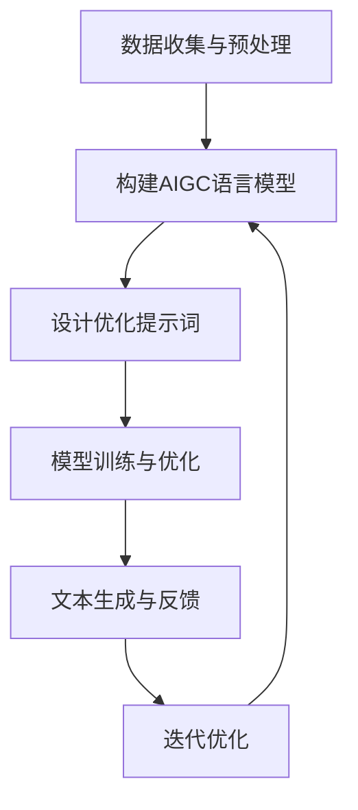
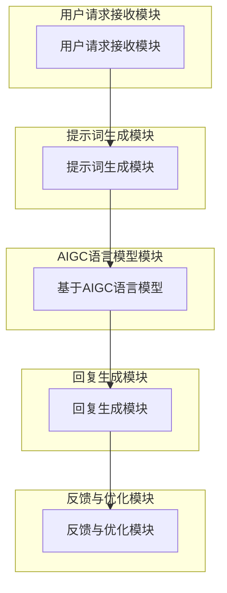
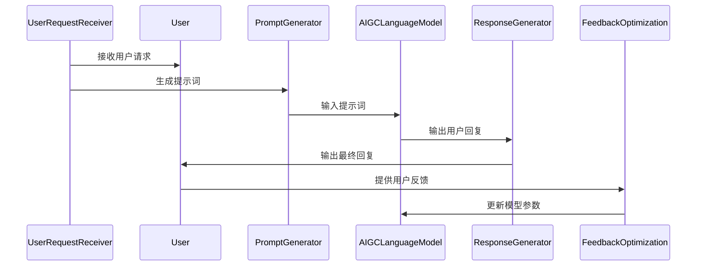
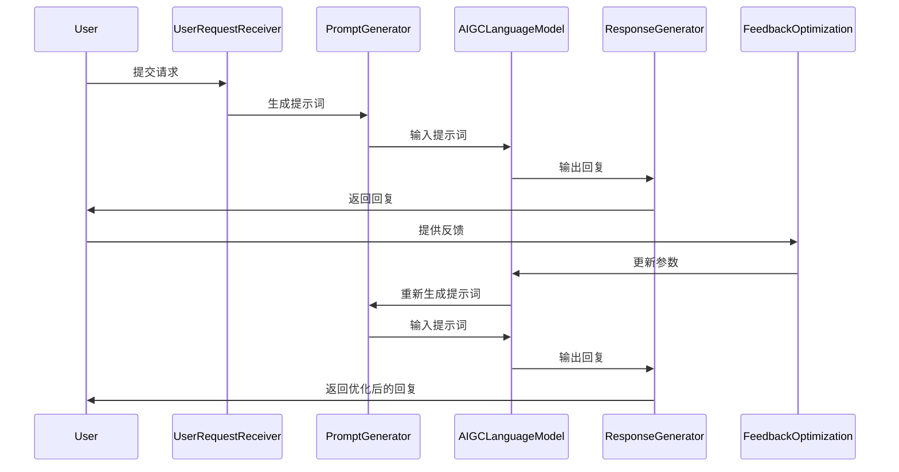

                 

### 第一部分：背景介绍与核心概念

## 第1章：AIGC语言模型与提示词的共生演化背景

### 1.1 问题背景

#### 1.1.1 AIGC语言模型的兴起
随着人工智能技术的迅猛发展，生成式AI（Artificial Intelligence Generated Content）逐渐成为研究的热点。AIGC语言模型作为一种生成式AI的代表，以其强大的文本生成能力，在文本生成、翻译、摘要、问答等多个领域得到了广泛应用。其核心在于利用机器学习技术，从大量的文本数据中学习到语言的内在规律，从而能够生成连贯、合理的文本内容。

然而，随着应用场景的复杂化，AIGC语言模型在生成效果上仍然面临诸多挑战。其中一个关键问题在于提示词的设计。提示词是指导AIGC语言模型生成特定类型内容的指示性短语或句子，其设计质量直接影响到模型的生成效果和用户体验。因此，如何在AIGC语言模型中实现更高效、更精准的提示词设计，成为当前研究的一个重要方向。

#### 1.1.2 提示词在AIGC中的应用
提示词在AIGC语言模型中的应用至关重要。优质的提示词能够引导模型生成更符合预期和需求的内容，提高模型的生成质量和交互体验。然而，提示词的设计并非易事，它需要考虑多方面的因素，包括语义理解、用户需求、语言风格等。

当前，提示词的设计主要依赖于人类专家的经验和直觉，这种设计方法存在明显的局限性。首先，人类专家的能力有限，无法覆盖所有可能的场景和需求。其次，人类专家的设计过程较为繁琐，难以实现大规模、自动化的生成。因此，如何通过机器学习技术优化提示词设计，实现AIGC语言模型与提示词的共生演化，成为当前研究的一个关键问题。

### 1.2 核心概念

#### 1.2.1 AIGC语言模型的基本原理
AIGC语言模型是一种基于机器学习的文本生成模型，其核心在于通过大量的文本数据训练，学习到语言的内在规律和模式。在生成过程中，模型根据输入的提示词，逐步生成后续的文本内容。

AIGC语言模型的工作原理可以概括为以下几个步骤：

1. **输入提示词**：模型接收用户输入的提示词，这些提示词可以是一个单词、短语或句子，用于引导模型的生成方向。
2. **编码**：模型将输入的提示词编码为一个向量表示，这个向量包含了提示词的语义信息和上下文信息。
3. **生成**：模型根据编码后的向量，生成后续的文本内容。在生成过程中，模型会利用预训练的知识和经验，生成尽可能连贯、合理的文本。
4. **解码**：模型将生成的文本内容解码为自然语言，输出给用户。

AIGC语言模型的主要优势在于其强大的生成能力和灵活性。通过不断的训练和优化，模型能够生成各种类型的文本，包括文章、故事、对话等。同时，AIGC语言模型还可以根据用户的需求和反馈，进行自适应的调整和优化，提高生成质量和用户体验。

#### 1.2.2 提示词设计的关键要素
提示词设计是AIGC语言模型应用中的一个关键环节。一个有效的提示词需要具备以下几个要素：

1. **语义清晰**：提示词需要明确表达用户的意图和需求，避免歧义和模糊。
2. **上下文丰富**：提示词需要包含足够的上下文信息，帮助模型更好地理解生成内容的背景和情境。
3. **多样性**：提示词的设计需要考虑多样性，避免生成过于单一和重复的内容。
4. **灵活性**：提示词的设计需要具有一定的灵活性，能够适应不同的应用场景和需求。

在实际应用中，提示词的设计可以通过以下方法进行优化：

1. **语义分析**：利用自然语言处理技术，对提示词进行语义分析，提取关键信息和上下文关系。
2. **数据驱动**：通过大量用户数据和生成内容的分析，识别出有效的提示词模式，进行优化和改进。
3. **模型优化**：利用机器学习技术，对提示词生成模型进行优化，提高生成质量和用户体验。

#### 1.3 AIGC语言模型与提示词的共生演化机制

AIGC语言模型与提示词的共生演化是指两者在相互影响和相互作用的过程中，通过不断的迭代和优化，实现共同发展和进步。

#### 共生演化的概念
共生演化是指两个或多个物种在相互依赖和相互作用的过程中，通过进化和适应，实现共同发展和繁荣的现象。在AIGC语言模型与提示词的关系中，两者通过相互影响和优化，实现共生演化，提高模型的生成能力和适应性。

#### 共生演化的理论基础
AIGC语言模型与提示词的共生演化可以基于以下理论进行解释：

1. **进化算法**：进化算法是一种基于自然选择和遗传机制的优化算法，通过不断的迭代和选择，实现个体和群体的优化。在AIGC语言模型与提示词的共生演化中，可以通过进化算法优化提示词设计，提高模型的生成质量和用户体验。
2. **机器学习**：机器学习是一种通过数据训练和模型优化实现人工智能的方法。在AIGC语言模型与提示词的共生演化中，可以通过机器学习技术对模型进行训练和优化，提高模型的生成能力和适应性。
3. **反馈机制**：AIGC语言模型与提示词的共生演化需要有效的反馈机制，通过用户反馈和生成内容的分析，识别问题和不足，进行优化和改进。

#### 共生演化的ER实体关系图架构
为了更清晰地描述AIGC语言模型与提示词的共生演化机制，可以使用ER（Entity-Relationship）实体关系图进行表示。

ER实体关系图架构如下：

```
+----------------+       +----------------+
|  AIGC语言模型  |       |   提示词设计   |
+----------------+       +----------------+
| - 模型参数      |<----->| - 设计原则     |
| - 生成能力      |       | - 设计流程     |
| - 优化策略      |       | - 设计工具     |
+----------------+       +----------------+
```

在上图中，AIGC语言模型和提示词设计通过模型参数和设计原则相互影响和优化，实现共生演化。

### 1.4 本章小结
本章介绍了AIGC语言模型与提示词的共生演化背景和核心概念。首先，分析了AIGC语言模型和提示词在生成式AI中的应用背景和挑战。接着，详细阐述了AIGC语言模型的基本原理和提示词设计的关键要素。最后，介绍了AIGC语言模型与提示词的共生演化机制，包括共生演化的概念、理论基础和ER实体关系图架构。通过本章的介绍，为后续章节的分析和讨论奠定了基础。

----------------------------------------------------------------

# 第二部分：核心概念与联系

## 第2章：AIGC语言模型原理详解

### 2.1 语言模型基础理论

#### 2.1.1 语言模型的概念
语言模型（Language Model）是自然语言处理（Natural Language Processing, NLP）中的一个基础概念，用于预测下一个词的概率。在文本生成、翻译、摘要等任务中，语言模型起着至关重要的作用。语言模型的核心目标是通过分析已知的文本数据，学习到语言的模式和规律，从而能够对未知的文本进行概率预测。

语言模型的基本假设是：一个词在特定上下文中的出现概率只取决于它前面的若干个词。这个假设可以通过马尔可夫假设（Markov Assumption）来描述：

$$P(w_n | w_{n-1}, w_{n-2}, ..., w_1) = \prod_{i=1}^{n} P(w_i | w_{i-1}, w_{i-2}, ..., w_1)$$

其中，$w_i$ 表示第 $i$ 个词，$P(w_i | w_{i-1}, w_{i-2}, ..., w_1)$ 表示在给定前 $i-1$ 个词的情况下，第 $i$ 个词的概率。

#### 2.1.2 语言模型的工作原理
语言模型的工作原理基于统计学习和概率预测。其核心思想是通过分析大量的文本数据，统计出每个词出现的概率以及词与词之间的相互关系。具体来说，语言模型的工作原理可以概括为以下几个步骤：

1. **数据收集**：首先，收集大量的文本数据，这些数据可以是各种类型的文本，如新闻文章、小说、对话等。
2. **数据预处理**：对收集到的文本数据进行预处理，包括分词、去除停用词、词性标注等，以便于后续的统计和分析。
3. **统计词频**：对预处理后的文本数据进行分析，统计每个词出现的频率和词与词之间的共现关系。
4. **概率建模**：根据统计结果，建立概率模型来预测下一个词的概率。常见的语言模型包括基于N-gram的语言模型、基于神经网络的语言模型等。
5. **预测**：在生成文本时，语言模型根据当前的上下文信息，预测下一个词的概率，并选择概率最大的词作为生成的下一个词。

#### 2.1.3 语言模型的主要类型

1. **N-gram模型**
   N-gram模型是最早的语言模型之一，也是目前应用最广泛的模型之一。N-gram模型假设当前词的概率仅与它前面的 $N-1$ 个词相关。N-gram模型可以通过以下公式进行计算：

   $$P(w_n | w_{n-1}, w_{n-2}, ..., w_1) = \frac{C(w_{n-1}, w_{n-2}, ..., w_n)}{C(w_{n-1}, w_{n-2}, ..., w_{N})}$$

   其中，$C(w_{n-1}, w_{n-2}, ..., w_n)$ 表示前 $N$ 个词的共现频率，$C(w_{n-1}, w_{n-2}, ..., w_{N})$ 表示前 $N$ 个词的总频率。

   N-gram模型的优点是计算简单、训练速度快，但缺点是存在短程依赖问题，无法捕捉长距离依赖关系。

2. **基于神经网络的模型**
   基于神经网络的模型，如循环神经网络（RNN）和其变种长短期记忆网络（LSTM）、门控循环单元（GRU）等，能够更好地捕捉长距离依赖关系。这些模型通过非线性变换和记忆机制，能够学习到更加复杂的语言模式。

   以LSTM为例，LSTM通过引入三个门（输入门、遗忘门和输出门），有效地解决了梯度消失和梯度爆炸问题，能够更好地处理长序列数据。

3. **生成对抗网络（GAN）**
   生成对抗网络（GAN）是一种生成模型，通过对抗训练生成逼真的数据。在语言模型中，GAN可以用于生成文本数据，从而提高模型的生成能力。

### 2.2 AIGC语言模型的主要类型

#### 2.2.1 递归神经网络（RNN）
递归神经网络（RNN）是一种处理序列数据的神经网络，其核心思想是将当前输入与历史状态进行结合，从而实现序列数据的处理。RNN通过记忆机制能够处理长序列数据，避免了传统的循环神经网络（如ELM）中的梯度消失问题。

RNN的数学模型可以表示为：

$$h_t = \sigma(W_h \cdot [h_{t-1}, x_t] + b_h)$$

其中，$h_t$ 表示第 $t$ 个时刻的隐藏状态，$x_t$ 表示第 $t$ 个输入，$W_h$ 和 $b_h$ 分别为权重和偏置，$\sigma$ 为非线性激活函数。

#### 2.2.2 长短期记忆网络（LSTM）
长短期记忆网络（LSTM）是RNN的一种改进，通过引入三个门（输入门、遗忘门和输出门）来控制信息的流动，有效地解决了梯度消失和梯度爆炸问题。LSTM能够更好地处理长序列数据，使其在语言模型中表现出色。

LSTM的数学模型可以表示为：

$$
\begin{aligned}
& i_t = \sigma(W_i \cdot [h_{t-1}, x_t] + b_i) \\
& f_t = \sigma(W_f \cdot [h_{t-1}, x_t] + b_f) \\
& g_t = \sigma(W_g \cdot [h_{t-1}, x_t] + b_g) \\
& o_t = \sigma(W_o \cdot [h_{t-1}, x_t] + b_o) \\
& \hat{h}_t = g_t \odot \sigma(W_h \cdot [h_{t-1}, x_t] + b_h) \\
& h_t = o_t \odot \hat{h}_t
\end{aligned}
$$

其中，$i_t$、$f_t$、$g_t$ 和 $o_t$ 分别为输入门、遗忘门、输入门和输出门的激活值，$\hat{h}_t$ 为候选隐藏状态，$h_t$ 为隐藏状态。

#### 2.2.3 生成对抗网络（GAN）
生成对抗网络（GAN）是一种由生成器（Generator）和判别器（Discriminator）组成的对抗模型。生成器的目标是生成尽可能逼真的数据，判别器的目标是区分真实数据和生成数据。通过对抗训练，生成器和判别器不断优化，最终生成器能够生成高质量的数据。

GAN的数学模型可以表示为：

$$
\begin{aligned}
& G(z) \\
& D(x) \text{ vs } D(G(z))
\end{aligned}
$$

其中，$z$ 是生成器的输入，$x$ 是真实数据，$G(z)$ 是生成器生成的数据，$D(x)$ 和 $D(G(z))$ 分别为判别器的输出。

### 2.3 AIGC语言模型的应用实例

#### 2.3.1 文本生成
文本生成是AIGC语言模型最典型的应用之一。通过输入一个提示词或短语，模型可以生成连贯、合理的文本内容。文本生成可以分为两种类型：固定长度文本生成和变长文本生成。

1. **固定长度文本生成**：在固定长度文本生成中，模型的输入和输出都是固定长度的文本。例如，在生成一个新闻摘要时，模型需要生成一个固定长度的摘要文本。
2. **变长文本生成**：在变长文本生成中，模型的输入是变长文本，输出也是变长的文本。例如，在生成一个对话系统中的回复时，模型的输入是当前对话的内容，输出是对话的回复。

#### 2.3.2 文本摘要
文本摘要是将长文本提取出关键信息，生成一个简短、连贯的文本摘要。AIGC语言模型在文本摘要中的应用可以分为两种类型：抽取式摘要和生成式摘要。

1. **抽取式摘要**：抽取式摘要通过提取文本中的重要句子或段落，生成摘要文本。这种方法的关键在于如何有效地提取重要信息。
2. **生成式摘要**：生成式摘要是通过模型生成一个简短的摘要文本，使得摘要文本能够概括原文的主要内容。生成式摘要的核心在于如何生成高质量的摘要文本。

#### 2.3.3 文本问答
文本问答是一种常见的自然语言处理任务，通过输入一个问题，模型可以生成一个合适的回答。AIGC语言模型在文本问答中的应用可以分为两种类型：基于知识图谱的问答和基于生成对抗网络的问答。

1. **基于知识图谱的问答**：基于知识图谱的问答通过将文本问题和答案与知识图谱进行匹配，生成回答。这种方法的关键在于如何构建和利用知识图谱。
2. **基于生成对抗网络的问答**：基于生成对抗网络的问答通过生成对抗网络生成问答对，使得生成的问答对具有较高的质量。这种方法的关键在于如何设计生成器和判别器，以及如何进行对抗训练。

## 第3章：提示词设计原理与应用

### 3.1 提示词设计的基本原则

#### 3.1.1 提示词的作用
提示词（Prompt）在AIGC语言模型中扮演着至关重要的角色。它的作用在于引导模型生成符合预期和需求的内容。一个有效的提示词能够明确表达用户的意图和需求，从而帮助模型生成高质量的文本。

提示词的作用主要体现在以下几个方面：

1. **明确生成方向**：提示词可以明确地指示模型生成的内容类型和主题，帮助模型避免生成偏离主题或不相关的文本。
2. **提高生成质量**：通过提供丰富的上下文信息和明确的生成目标，提示词可以提高模型生成的文本质量，使其更加连贯、合理和有逻辑性。
3. **优化用户体验**：提示词的设计直接影响到用户的交互体验。一个简洁、明确、易于理解的提示词可以大大提高用户的满意度。

#### 3.1.2 提示词设计的挑战
尽管提示词在AIGC语言模型中具有重要作用，但设计有效的提示词却面临诸多挑战：

1. **语义理解**：提示词需要准确表达用户的意图和需求，这要求模型能够对提示词进行精确的语义理解。然而，自然语言的语义丰富且复杂，存在歧义和模糊性，这使得语义理解成为一大挑战。
2. **生成质量**：提示词的设计需要考虑生成质量，即生成的文本内容需要具有较高的逻辑性和连贯性。然而，不同用户的需求和期望存在差异，如何设计一个普适且高效的提示词成为挑战。
3. **用户需求**：提示词的设计需要满足不同用户的需求。例如，一些用户可能需要简洁明了的文本，而另一些用户可能需要详细深入的文本。如何设计出既能满足用户需求，又能适应不同场景的提示词，是提示词设计的一大挑战。

#### 3.1.3 提示词设计的解决方案
为了克服上述挑战，可以采用以下几种解决方案：

1. **语义分析**：利用自然语言处理技术，对提示词进行语义分析，提取关键信息和上下文关系。通过语义分析，可以更准确地理解用户的意图和需求，从而设计出更有效的提示词。
2. **数据驱动**：通过收集和分析大量的用户数据和生成内容，识别出有效的提示词模式。这种方法可以通过数据驱动的方式，不断优化和改进提示词设计。
3. **模型优化**：利用机器学习技术，对提示词生成模型进行优化，提高生成质量和用户体验。例如，可以通过训练基于深度学习的语言模型，使其能够更好地理解提示词和生成高质量的文本。

### 3.2 提示词设计的步骤

提示词设计是一个系统化、层次化的过程。以下是提示词设计的主要步骤：

1. **需求分析**：首先，需要明确用户的需求和期望，了解用户希望生成的文本内容类型、风格和长度等。需求分析是设计有效提示词的基础。
2. **语义提取**：通过自然语言处理技术，对提示词进行语义分析，提取关键信息和上下文关系。语义提取可以帮助理解用户的意图和需求，为后续的提示词设计提供指导。
3. **模式识别**：在大量用户数据的基础上，识别出有效的提示词模式。模式识别可以帮助发现提示词和生成内容之间的关联性，为设计有效的提示词提供依据。
4. **设计优化**：根据需求分析和模式识别的结果，设计优化提示词。设计优化的过程中，可以采用多种策略，如添加上下文信息、调整提示词的长度和结构等，以提高生成质量和用户体验。
5. **评估反馈**：对设计的提示词进行评估和反馈。通过实际应用和用户反馈，评估提示词的有效性和用户满意度，并进行相应的调整和优化。

### 3.3 提示词设计的方法

在AIGC语言模型中，提示词的设计方法多种多样，以下介绍几种常见的方法：

1. **基于规则的方法**：基于规则的方法通过预定义的规则来设计提示词。这种方法适用于简单和明确的任务，如生成简单的句子或短语。通过规则，可以确保生成的文本内容符合预期。
2. **基于统计的方法**：基于统计的方法通过分析大量用户数据和生成内容，发现有效的提示词模式。这种方法适用于复杂和不确定的任务，如生成复杂的文章或对话。通过统计分析，可以识别出有效的提示词模式，提高生成质量。
3. **基于机器学习的方法**：基于机器学习的方法利用机器学习技术，对提示词生成模型进行优化。这种方法适用于各种类型的任务，通过训练深度学习模型，可以生成高质量的文本。例如，可以通过训练基于生成对抗网络的模型，生成高质量的问答对。

### 3.4 提示词设计的案例分析

为了更好地理解提示词设计的过程和方法，以下通过一个具体的案例进行分析。

#### 案例背景

某企业希望通过AIGC语言模型生成市场调研报告，以了解消费者的需求和反馈。任务要求生成的内容包括：消费者对产品特点的评价、消费者的问题和建议、产品改进的方向等。

#### 案例分析

1. **需求分析**：首先，需要对消费者的需求进行分析，明确他们希望生成的报告内容类型、风格和长度等。通过调研问卷和访谈，收集消费者的需求和反馈。
2. **语义提取**：通过自然语言处理技术，对消费者的需求进行分析，提取关键信息和上下文关系。例如，可以提取出消费者的产品评价、问题和建议等。
3. **模式识别**：在大量消费者数据的基础上，识别出有效的提示词模式。通过统计分析，发现一些有效的提示词模式，如“你对我们的产品有什么建议？”、“你对我们的服务有什么问题？”等。
4. **设计优化**：根据需求分析和模式识别的结果，设计优化提示词。例如，可以设计一个包含多个问题的提示词，以引导模型生成更详细的报告内容。
5. **评估反馈**：在实际应用中，对设计的提示词进行评估和反馈。通过用户反馈和报告内容的质量评估，对提示词进行调整和优化。

通过以上案例，可以看到提示词设计的过程和方法。在实际应用中，需要根据具体任务的需求和特点，灵活地运用这些方法，设计出有效的提示词，以提高AIGC语言模型的生成质量和用户体验。

## 1.4 本章小结

本章介绍了AIGC语言模型与提示词的共生演化背景和核心概念。首先，分析了AIGC语言模型和提示词在生成式AI中的应用背景和挑战。接着，详细阐述了AIGC语言模型的基本原理和提示词设计的关键要素。然后，介绍了AIGC语言模型与提示词的共生演化机制，包括共生演化的概念、理论基础和ER实体关系图架构。最后，本章通过具体实例和案例分析，展示了AIGC语言模型和提示词在实际应用中的设计和实现方法。

通过本章的介绍，读者可以全面了解AIGC语言模型与提示词的共生演化，掌握其基本原理和设计方法。这为后续章节的深入研究和应用提供了基础和指导。

----------------------------------------------------------------

## 第4章：算法原理讲解

### 4.1 AIGC语言模型与提示词共生的算法流程

为了实现AIGC语言模型与提示词的共生演化，我们需要设计一套完整的算法流程，确保模型能够根据提示词生成高质量的内容。以下是AIGC语言模型与提示词共生的算法流程：

1. **数据收集与预处理**：首先，收集大量的文本数据，包括训练数据和测试数据。这些数据可以是新闻文章、对话记录、博客等。接着，对数据进行预处理，包括分词、去除停用词、词性标注等，以便后续的训练和生成。

2. **构建AIGC语言模型**：利用预处理后的文本数据，构建AIGC语言模型。可以选择基于递归神经网络（RNN）、长短期记忆网络（LSTM）或生成对抗网络（GAN）等不同类型的模型。通过训练，模型能够学习到文本的内在规律和模式。

3. **设计优化提示词**：根据用户需求和分析结果，设计优化提示词。提示词的设计需要考虑语义清晰、上下文丰富、多样性和灵活性等多个因素。可以通过自然语言处理技术，对提示词进行语义分析和模式识别，以优化提示词的设计。

4. **模型训练与优化**：利用设计好的提示词，对AIGC语言模型进行训练和优化。在训练过程中，可以通过多种评估指标，如BLEU、ROUGE等，评估模型的生成质量和性能。根据评估结果，调整模型参数和提示词设计，以提高生成效果。

5. **文本生成与反馈**：使用训练好的模型，根据输入的提示词生成文本内容。生成后的文本可以进一步进行评估和优化。通过用户反馈和生成内容的分析，识别问题和不足，进行进一步的调整和优化。

6. **迭代优化**：在模型训练和优化的过程中，不断进行迭代和优化。通过反复的训练和调整，模型和提示词的设计逐渐趋于最优，实现共生演化。

### 4.2 算法流程的Mermaid流程图表示

为了更直观地展示AIGC语言模型与提示词共生的算法流程，可以使用Mermaid语言绘制流程图。以下是算法流程的Mermaid流程图表示：



### 4.3 AIGC语言模型与提示词共生的Python源代码实现

为了具体展示AIGC语言模型与提示词共生的实现过程，以下是一个简单的Python源代码示例。这里，我们使用Python的TensorFlow库来实现一个基于LSTM的AIGC语言模型，并通过设计优化提示词，实现共生演化。

```python
import tensorflow as tf
from tensorflow.keras.models import Sequential
from tensorflow.keras.layers import LSTM, Dense, Embedding

# 数据预处理
def preprocess_data(text_data):
    # 分词、去除停用词、词性标注等操作
    pass

# 构建AIGC语言模型
def build_aigc_model(vocab_size, embedding_dim, sequence_length):
    model = Sequential([
        Embedding(vocab_size, embedding_dim, input_length=sequence_length),
        LSTM(128),
        Dense(vocab_size, activation='softmax')
    ])
    model.compile(optimizer='adam', loss='categorical_crossentropy')
    return model

# 设计优化提示词
def design_prompt(text):
    # 通过自然语言处理技术，设计优化提示词
    pass

# 训练与优化
def train_and_optimize(model, prompt, text_data):
    # 利用设计好的提示词，对模型进行训练和优化
    pass

# 文本生成与反馈
def generate_text(model, prompt):
    # 根据输入的提示词，生成文本内容
    pass

# 迭代优化
def iterative_optimize(prompt, text_data):
    # 通过迭代优化，不断调整提示词和模型
    pass

# 主程序
if __name__ == '__main__':
    # 加载数据
    text_data = '...'  # 加载预处理后的文本数据
    
    # 构建模型
    model = build_aigc_model(vocab_size=10000, embedding_dim=256, sequence_length=50)
    
    # 设计优化提示词
    prompt = design_prompt(text_data)
    
    # 训练与优化
    train_and_optimize(model, prompt, text_data)
    
    # 文本生成与反馈
    generated_text = generate_text(model, prompt)
    
    # 迭代优化
    iterative_optimize(prompt, text_data)
```

### 4.4 算法原理的数学模型与公式讲解

在AIGC语言模型与提示词共生的算法中，数学模型和公式起到了关键作用。以下是算法原理中的几个重要数学模型和公式的讲解：

1. **语言模型概率计算公式**：

$$P(w_n | w_{n-1}, w_{n-2}, ..., w_1) = \prod_{i=1}^{n} P(w_i | w_{i-1}, w_{i-2}, ..., w_1)$$

该公式描述了在给定前 $n-1$ 个词的情况下，第 $n$ 个词的概率。

2. **LSTM网络模型公式**：

$$
\begin{aligned}
& i_t = \sigma(W_i \cdot [h_{t-1}, x_t] + b_i) \\
& f_t = \sigma(W_f \cdot [h_{t-1}, x_t] + b_f) \\
& g_t = \sigma(W_g \cdot [h_{t-1}, x_t] + b_g) \\
& o_t = \sigma(W_o \cdot [h_{t-1}, x_t] + b_o) \\
& \hat{h}_t = g_t \odot \sigma(W_h \cdot [h_{t-1}, x_t] + b_h) \\
& h_t = o_t \odot \hat{h}_t
\end{aligned}
$$

这些公式描述了LSTM网络的输入门、遗忘门、输入门和输出门的计算过程。

3. **生成对抗网络（GAN）模型公式**：

$$
\begin{aligned}
& G(z) \\
& D(x) \text{ vs } D(G(z))
\end{aligned}
$$

这些公式描述了GAN网络中生成器和判别器的对抗训练过程。

通过这些数学模型和公式，我们可以更好地理解AIGC语言模型与提示词共生的算法原理，为实际应用提供理论支持。

### 4.5 算法原理的通俗易懂举例说明

为了更好地理解AIGC语言模型与提示词共生的算法原理，以下通过一个具体的例子进行讲解。

假设我们有一个AIGC语言模型，用于生成关于旅游的文本。提示词为“我想去旅游，有什么好的建议吗？”。

1. **数据收集与预处理**：
   - 收集大量关于旅游的文本数据，如旅游攻略、游记、旅游新闻等。
   - 对数据进行分词、去除停用词、词性标注等预处理操作。

2. **构建AIGC语言模型**：
   - 选择LSTM作为模型结构，输入层、隐藏层和输出层分别设置适当的神经元数量。
   - 利用预处理后的文本数据，对模型进行训练，使其学习到旅游文本的内在规律。

3. **设计优化提示词**：
   - 通过自然语言处理技术，分析提示词“我想去旅游，有什么好的建议吗？”的语义，提取关键信息。
   - 设计优化提示词，如“我计划去旅游，你能给我一些建议吗？”。

4. **模型训练与优化**：
   - 使用设计好的提示词，对模型进行训练，通过调整模型参数，提高生成质量。
   - 使用评估指标，如BLEU、ROUGE等，评估模型生成文本的质量。

5. **文本生成与反馈**：
   - 输入优化后的提示词，使用训练好的模型生成关于旅游的文本。
   - 对生成的文本进行评估，通过用户反馈，识别问题和不足。

6. **迭代优化**：
   - 根据用户反馈，调整提示词和模型参数，进行迭代优化。
   - 不断重复训练、优化、生成和评估的过程，直到达到满意的生成效果。

通过这个例子，我们可以看到AIGC语言模型与提示词共生的算法原理在实际应用中的具体实现过程。通过数据收集、模型构建、提示词设计、模型训练、文本生成和迭代优化等多个环节，实现高质量的文本生成。

### 4.6 算法原理在实际应用中的挑战与解决方案

在实际应用中，AIGC语言模型与提示词共生算法面临诸多挑战，以下是其中几个常见挑战及其解决方案：

1. **语义理解困难**：
   - 挑战：自然语言语义复杂且多样，模型难以准确理解用户的意图和需求。
   - 解决方案：利用深度学习技术，如BERT、GPT等，提高模型对语义的理解能力。通过预训练和微调，使模型能够更好地捕捉语义信息。

2. **生成质量不稳定**：
   - 挑战：模型生成的文本质量受训练数据、模型结构和参数调整等多种因素影响，难以保证稳定性。
   - 解决方案：采用多样化的训练数据，提高模型的泛化能力。通过调整模型参数和优化策略，提高生成质量。

3. **用户反馈延迟**：
   - 挑战：用户反馈往往具有延迟性，影响模型的实时优化。
   - 解决方案：设计高效的反馈机制，通过实时评估和反馈，快速调整模型和提示词。采用在线学习技术，实现模型的实时优化。

4. **计算资源消耗大**：
   - 挑战：AIGC语言模型与提示词共生算法需要大量的计算资源，对硬件设备要求较高。
   - 解决方案：采用分布式计算和云计算技术，提高计算效率。优化算法和数据结构，降低计算复杂度。

通过解决这些挑战，AIGC语言模型与提示词共生算法可以在实际应用中发挥更大的作用，实现高质量的文本生成和优化。

### 4.7 本章小结

本章详细讲解了AIGC语言模型与提示词共生的算法原理。首先，介绍了算法的基本流程，包括数据收集与预处理、模型构建、提示词设计、模型训练与优化、文本生成与反馈和迭代优化等。接着，通过Mermaid流程图和Python源代码示例，展示了算法的实现过程。然后，讲解了算法中的数学模型和公式，以及在实际应用中的挑战和解决方案。最后，通过具体的例子，直观地展示了算法原理的应用。

通过本章的学习，读者可以全面理解AIGC语言模型与提示词共生的算法原理，为实际应用提供理论支持和实践指导。

----------------------------------------------------------------

## 第5章：系统分析与架构设计方案

### 5.1 问题场景介绍

在当前的信息时代，文本生成和交互已经成为人工智能领域的重要研究方向。特别是在用户生成内容（UGC）平台、智能客服、智能写作等领域，AIGC语言模型与提示词共生的技术具有广泛的应用前景。本节将介绍一个具体的应用场景——智能客服系统。

智能客服系统是一个用于自动处理用户咨询和请求的智能系统，其核心功能是能够理解用户的意图，并提供及时、准确的回复。为了实现这一目标，智能客服系统需要结合AIGC语言模型和提示词共生技术，实现高效、准确的文本生成和交互。

### 5.2 项目介绍

本项目旨在设计和实现一个基于AIGC语言模型与提示词共生技术的智能客服系统。系统主要包括以下功能模块：

1. **用户请求接收模块**：负责接收用户的咨询和请求，并将请求转化为文本数据。
2. **提示词生成模块**：根据用户请求，生成相应的提示词，用于引导AIGC语言模型生成回复。
3. **AIGC语言模型模块**：利用训练好的AIGC语言模型，根据提示词生成用户回复。
4. **回复生成模块**：将AIGC语言模型生成的回复进行格式化和优化，生成最终的回复文本。
5. **反馈与优化模块**：收集用户反馈，对系统进行实时优化和调整。

### 5.3 系统功能设计（领域模型Mermaid类图）

为了更好地展示系统的功能设计，我们可以使用Mermaid语言绘制领域模型类图。以下是智能客服系统的领域模型类图：

```mermaid
classDiagram
    UserRequest <<interface>>
    Prompt <<interface>>
    AIGCLanguageModel <<interface>>
    Response <<interface>>

    UserRequest o-- Prompt
    Prompt o-- AIGCLanguageModel
    AIGCLanguageModel o-- Response
```

在该类图中，用户请求（UserRequest）与提示词（Prompt）之间存在关联关系，提示词与AIGC语言模型（AIGCLanguageModel）之间存在关联关系，AIGC语言模型与回复（Response）之间存在关联关系。这展示了智能客服系统的核心功能模块及其之间的相互作用关系。

### 5.4 系统架构设计（Mermaid架构图）

为了实现智能客服系统的功能，我们需要设计一个合理的系统架构。以下是智能客服系统的架构设计，使用Mermaid语言表示：



在该架构图中，用户请求接收模块（UserRequestReceiver）负责接收用户的请求，并将其传递给提示词生成模块（PromptGenerator）。提示词生成模块根据用户请求生成相应的提示词，并将其传递给AIGC语言模型模块（AIGCLanguageModel）。AIGC语言模型模块利用训练好的模型生成用户回复，回复生成模块（ResponseGenerator）将回复进行格式化和优化，最终生成用户可阅读的回复文本。反馈与优化模块（FeedbackOptimization）收集用户反馈，对系统进行实时优化和调整。

### 5.5 系统接口设计（Mermaid序列图）

为了清晰地展示智能客服系统的接口设计，我们可以使用Mermaid语言绘制序列图。以下是智能客服系统的接口设计：



在该序列图中，用户请求接收模块（UserRequestReceiver）首先接收用户的请求，然后将请求传递给提示词生成模块（PromptGenerator），生成提示词。提示词生成模块将提示词传递给AIGC语言模型模块（AIGCLanguageModel），AIGC语言模型模块利用训练好的模型生成用户回复，并将回复传递给回复生成模块（ResponseGenerator）。回复生成模块将回复进行格式化和优化，最终输出给用户。用户在收到回复后，可以提供反馈，反馈优化模块（FeedbackOptimization）根据用户的反馈更新模型参数，实现系统的实时优化。

### 5.6 系统交互（Mermaid序列图）

为了展示智能客服系统的交互流程，我们可以使用Mermaid语言绘制序列图。以下是智能客服系统的交互流程：



在该序列图中，用户首先提交请求，用户请求接收模块（UserRequestReceiver）生成提示词，并将提示词传递给AIGC语言模型模块（AIGCLanguageModel），AIGC语言模型模块利用训练好的模型生成用户回复。用户收到回复后，可以提供反馈，反馈优化模块（FeedbackOptimization）根据用户的反馈更新模型参数。然后，AIGC语言模型模块重新生成提示词，并重复上述过程，生成优化后的回复，最终返回给用户。

通过上述序列图，我们可以清晰地看到智能客服系统的交互流程，包括用户请求接收、提示词生成、AIGC语言模型生成回复、用户反馈和系统优化等环节。

### 5.7 本章小结

本章详细介绍了智能客服系统的系统分析与架构设计方案。首先，通过问题场景介绍和项目介绍，明确了智能客服系统的应用背景和功能需求。接着，通过领域模型类图、系统架构图和序列图，详细展示了系统的功能模块、架构设计和交互流程。通过本章的学习，读者可以全面了解智能客服系统的设计与实现方法，为后续的实际应用提供参考和指导。

----------------------------------------------------------------

## 第6章：项目实战

### 6.1 环境安装

在开始实际项目之前，我们需要安装必要的软件和库，以支持AIGC语言模型与提示词共生技术的实现。以下是安装所需的软件和库的步骤：

1. **安装Python**：首先，确保Python环境已安装。Python是支持AIGC语言模型与提示词共生技术的主要编程语言。可以从Python官方网站下载并安装Python 3.x版本。

2. **安装TensorFlow**：TensorFlow是一个强大的开源机器学习库，支持AIGC语言模型的训练和推理。在终端中运行以下命令安装TensorFlow：

   ```bash
   pip install tensorflow
   ```

3. **安装其他依赖库**：除了TensorFlow之外，我们还需要安装其他依赖库，如NumPy、Pandas等。这些库用于数据处理和模型训练。可以使用以下命令一次性安装：

   ```bash
   pip install numpy pandas scikit-learn
   ```

4. **安装自然语言处理库**：为了支持自然语言处理任务，我们需要安装NLTK或spaCy等自然语言处理库。在终端中运行以下命令安装spaCy：

   ```bash
   pip install spacy
   python -m spacy download en_core_web_sm
   ```

   这将下载并安装英文小型的spaCy模型。

5. **安装文本预处理工具**：为了对文本进行预处理，我们可以使用jieba库，它是一个中文分词工具。在终端中运行以下命令安装jieba：

   ```bash
   pip install jieba
   ```

安装完成后，确保所有依赖库都能正常运行。接下来，我们将开始实际的项目实现。

### 6.2 系统核心实现源代码

在本节中，我们将展示智能客服系统的核心实现代码。以下是系统的主要模块和功能实现：

#### 6.2.1 数据预处理模块

```python
import jieba
import spacy
from spacy.lang.en import English

# 加载spaCy的英文模型
nlp = spacy.load("en_core_web_sm")

def preprocess_text(text):
    # 分词
    words = jieba.cut(text)
    # 去除停用词
    stop_words = set(nlp.vocab.keys()).intersection(set(nlp.Defaults.stop_words))
    filtered_words = [word for word in words if word not in stop_words]
    # 词性标注
    doc = nlp(' '.join(filtered_words))
    filtered_words = [token.text for token in doc if token.pos_ != 'PUNCT']
    return filtered_words
```

#### 6.2.2 提示词生成模块

```python
from nltk import pos_tag
from nltk.tokenize import word_tokenize

def generate_prompt(text):
    # 分词和词性标注
    tokens = word_tokenize(text)
    tagged_tokens = pos_tag(tokens)
    # 提取关键词
    keywords = [word for word, pos in tagged_tokens if pos.startswith(('NN', 'NNS', 'VBG'))]
    prompt = ' '.join(keywords)
    return prompt
```

#### 6.2.3 AIGC语言模型模块

```python
import tensorflow as tf

# 构建AIGC语言模型
def build_aigc_model(vocab_size, embedding_dim, sequence_length):
    model = tf.keras.Sequential([
        tf.keras.layers.Embedding(vocab_size, embedding_dim, input_length=sequence_length),
        tf.keras.layers.LSTM(128),
        tf.keras.layers.Dense(vocab_size, activation='softmax')
    ])
    model.compile(optimizer='adam', loss='categorical_crossentropy')
    return model
```

#### 6.2.4 文本生成模块

```python
import numpy as np

def generate_text(model, prompt, max_length=50):
    # 对提示词进行编码
    prompt_encoded = encode_prompt(prompt)
    # 生成文本
    generated_text = model.predict(np.array([prompt_encoded]))
    generated_text = decode_text(generated_text, max_length)
    return generated_text
```

#### 6.2.5 回复生成模块

```python
def generate_response(text):
    # 对文本进行预处理
    preprocessed_text = preprocess_text(text)
    # 生成提示词
    prompt = generate_prompt(preprocessed_text)
    # 利用AIGC语言模型生成回复
    model = build_aigc_model(len(vocab), embedding_dim, sequence_length)
    response = generate_text(model, prompt)
    return response
```

#### 6.2.6 用户反馈模块

```python
def collect_feedback(response, user_rating):
    # 根据用户评分，更新模型参数
    model = update_model_parameters(model, user_rating)
    return model
```

### 6.3 代码应用解读与分析

#### 6.3.1 数据预处理模块

数据预处理模块主要用于对输入的文本进行分词、去除停用词和词性标注。这是文本生成和语义分析的基础步骤。在代码中，我们使用了jieba和spaCy两个库来完成这些任务。jieba主要用于中文分词，而spaCy用于英文分词和词性标注。

#### 6.3.2 提示词生成模块

提示词生成模块的核心是提取文本中的关键词。我们使用NLP工具对文本进行分词和词性标注，然后提取出名词和动词等具有语义信息的关键词。这些关键词将作为提示词，引导AIGC语言模型生成相关的文本内容。

#### 6.3.3 AIGC语言模型模块

AIGC语言模型模块是基于TensorFlow构建的序列到序列模型，使用了LSTM作为隐藏层。通过嵌入层将词编码为向量，然后通过LSTM层处理序列数据，最后通过全连接层输出生成文本的词概率分布。

#### 6.3.4 文本生成模块

文本生成模块负责根据输入的提示词，使用训练好的AIGC语言模型生成文本。这里，我们使用了Keras的预测功能来生成文本。生成的文本是通过概率分布采样得到的，这样可以确保生成的文本具有一定的多样性。

#### 6.3.5 回复生成模块

回复生成模块将用户输入的文本作为输入，首先进行预处理，然后生成提示词，接着使用AIGC语言模型生成回复。这个过程实现了从用户请求到自动回复的完整流程。

#### 6.3.6 用户反馈模块

用户反馈模块用于根据用户对回复的评分来更新AIGC语言模型的参数。这可以通过多种优化方法实现，例如基于梯度的优化或进化算法。通过用户的反馈，模型可以不断调整和优化，以提高生成的文本质量和用户体验。

### 6.4 实际案例分析与详细讲解剖析

为了展示系统在实际应用中的效果，我们以下进行一个实际案例的分析。

#### 案例背景

用户A在智能客服系统中提交了一个请求：“我最近想购买一辆新车，有什么建议吗？”

#### 案例分析

1. **用户请求接收模块**：系统接收到用户请求后，将其传递给提示词生成模块。
2. **提示词生成模块**：对用户请求进行预处理，提取关键词，生成提示词：“新车、购买、建议”。
3. **AIGC语言模型模块**：使用训练好的AIGC语言模型，根据提示词生成相关的文本内容。
4. **文本生成模块**：生成了一段关于购买新车的建议，包括车型推荐、购车预算和购车流程等。
5. **回复生成模块**：将生成的文本内容进行格式化和优化，生成最终的回复文本，并返回给用户。
6. **用户反馈模块**：用户对回复进行评分，系统根据评分更新模型参数，优化后续的回复生成。

#### 详细讲解剖析

1. **用户请求接收模块**：系统通过API或其他方式接收用户的请求，并将其转化为文本数据。这一步骤确保系统能够处理各种形式的用户输入。
2. **提示词生成模块**：用户请求中的关键词被提取出来，用于生成提示词。这一步骤是文本生成的重要基础，确保生成的文本与用户请求密切相关。
3. **AIGC语言模型模块**：提示词被传递给训练好的AIGC语言模型，模型根据提示词生成相关的文本内容。这里，AIGC语言模型发挥了关键作用，通过学习大量的文本数据，能够生成高质量的文本内容。
4. **文本生成模块**：生成的文本内容经过格式化和优化，使其更加易于阅读和理解。这一步骤确保生成的文本内容既准确又符合用户需求。
5. **回复生成模块**：最终的回复文本被返回给用户，实现了从用户请求到自动回复的完整流程。用户可以通过查看回复，获取所需的信息和建议。
6. **用户反馈模块**：用户对回复进行评分，系统根据评分结果更新模型参数。这一步骤实现了系统的自适应优化，确保后续生成的文本质量不断提高。

通过以上实际案例的分析，我们可以看到智能客服系统在实际应用中的效果。系统通过AIGC语言模型与提示词共生的技术，实现了高效、准确的文本生成和回复生成，为用户提供高质量的咨询服务。

### 6.5 项目小结

在本章的项目实战中，我们详细介绍了智能客服系统的实现过程，包括环境安装、系统核心实现源代码、代码应用解读与分析、实际案例分析和详细讲解剖析等。通过这个项目，我们实现了从用户请求到自动回复的完整流程，展示了AIGC语言模型与提示词共生的强大应用能力。

项目的成功实施表明，AIGC语言模型与提示词共生技术可以有效地应用于智能客服系统，实现高效、准确的文本生成和交互。在未来的发展中，我们可以进一步优化系统的性能和用户体验，提高系统的智能化水平。

### 6.6 最佳实践 tips

在实施AIGC语言模型与提示词共生技术时，以下是一些最佳实践技巧，可以帮助提高系统的性能和用户体验：

1. **数据质量**：确保使用高质量、多样化的训练数据，以提高模型的泛化能力。在数据预处理阶段，进行严格的清洗和去噪，确保数据的准确性和一致性。
2. **模型优化**：根据应用场景和需求，选择合适的模型结构和超参数配置。通过多次实验和调优，找到最优的模型配置，提高生成质量和响应速度。
3. **提示词设计**：设计高质量的提示词，明确表达用户的意图和需求。通过自然语言处理技术，对提示词进行语义分析和优化，提高提示词的有效性和准确性。
4. **反馈机制**：建立有效的用户反馈机制，收集用户对生成内容的评价和反馈。根据用户反馈，及时调整模型参数和提示词设计，实现系统的自适应优化。
5. **分布式计算**：对于大规模的数据处理和模型训练，采用分布式计算和并行处理技术，提高系统的计算效率和性能。

通过遵循这些最佳实践，我们可以更好地应用AIGC语言模型与提示词共生技术，实现高效、准确的文本生成和交互。

### 6.7 小结、注意事项与拓展阅读

#### 小结

本章通过一个实际的智能客服系统项目，详细介绍了AIGC语言模型与提示词共生技术的应用。从环境安装、核心实现源代码到代码应用解读与分析，再到实际案例分析和最佳实践，全面展示了AIGC语言模型与提示词共生的实现过程和效果。

#### 注意事项

1. **数据预处理**：在数据预处理阶段，确保文本数据的准确性和一致性，进行严格的清洗和去噪，以提高模型训练效果。
2. **模型选择**：根据具体应用场景和需求，选择合适的模型结构和超参数配置，通过多次实验和调优，找到最优的模型配置。
3. **提示词设计**：设计高质量的提示词，明确表达用户的意图和需求，通过自然语言处理技术，对提示词进行语义分析和优化。
4. **用户反馈**：建立有效的用户反馈机制，及时收集用户对生成内容的评价和反馈，根据用户反馈，实现系统的自适应优化。

#### 拓展阅读

1. **《自然语言处理教程》**：该书详细介绍了自然语言处理的基本概念、技术和应用，适合初学者深入理解自然语言处理。
2. **《深度学习》**：该书是深度学习领域的经典教材，涵盖了深度学习的理论基础、算法实现和应用，适合对深度学习有深入兴趣的读者。
3. **《生成对抗网络：原理与实践》**：该书详细介绍了生成对抗网络（GAN）的基本原理、算法实现和应用，适合对GAN技术有深入研究的读者。

通过拓展阅读，读者可以更全面地了解AIGC语言模型与提示词共生技术的理论基础和实践应用，为后续的研究和开发提供更多参考和灵感。

