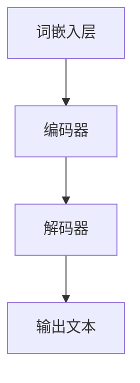
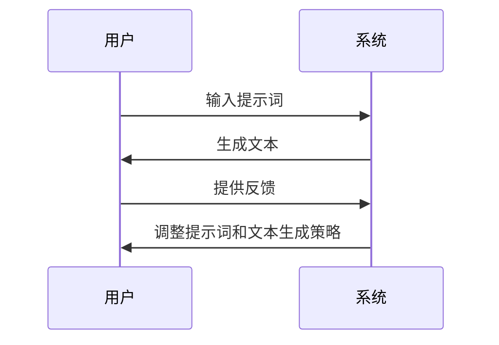

                 

## AIGC语言模型与提示词的协同进化

### 背景介绍

#### 1.1 问题背景

随着人工智能技术的快速发展，自然语言处理（NLP）领域取得了巨大的进步。近年来，基于深度学习的语言模型如BERT、GPT等在各类NLP任务中表现出色，推动了文本生成、对话系统、问答系统等领域的变革。然而，这些模型在实际应用中仍面临一些挑战。其中，如何设计有效的提示词和优化提示词与模型之间的互动，成为影响模型生成质量和用户满意度的重要因素。

#### 1.2 问题描述

本章节将探讨AIGC（AI-Generated Content）语言模型与提示词的协同进化。具体而言，我们将关注以下几个问题：

1. **如何设计有效的提示词生成策略？**
2. **提示词与AIGC语言模型之间的互动机制如何优化？**
3. **如何评估和改进AIGC语言模型的生成质量？**

#### 1.3 问题解决

针对上述问题，我们将从以下几个方面进行探讨：

1. **分析AIGC语言模型的基本原理和特点。**
2. **研究提示词的设计原则和方法。**
3. **探索提示词与AIGC语言模型的协同进化机制。**
4. **提出评估和改进AIGC语言模型生成质量的方法。**

#### 1.4 边界与外延

本章节主要关注AIGC语言模型与提示词在自然语言处理领域中的应用，研究内容涵盖但不限于文本生成、对话系统、问答系统等。同时，本研究也关注AIGC语言模型在其他领域（如图像、音频处理）的应用前景。

#### 1.5 概念结构与核心要素组成

- **AIGC语言模型**：基于深度学习技术的自然语言处理模型，可用于文本生成、对话系统、问答系统等。
- **提示词**：用于引导AIGC语言模型生成目标文本的词语或短语。
- **协同进化**：提示词与AIGC语言模型相互影响、共同进化的过程。
- **生成质量**：AIGC语言模型生成的文本在语义、语法、连贯性等方面的表现。

### 第二部分：核心概念与联系

#### 2.1 AIGC语言模型的基本原理

AIGC语言模型是基于深度学习技术的自然语言处理模型，通过大规模训练语料库，学习语言模式和规律，从而实现文本生成。其核心组成部分包括词嵌入层、编码器和解码器。

- **词嵌入层**：将输入文本中的词语转换为高维向量表示，以便模型能够理解和处理。
- **编码器**：对词嵌入向量进行编码，提取文本的语义信息。
- **解码器**：将编码后的信息解码为输出文本。

#### 2.2 提示词的设计原则

- **语义相关性**：提示词应与目标文本在语义上保持一致，以提高生成文本的质量。
- **长度适中**：过短或过长的提示词可能会影响生成效果，因此需要选取合适的长度。
- **灵活性**：提示词应具有一定的灵活性，以适应不同的生成需求。
- **用户参与度**：提示词应能够引导用户参与文本生成过程，提高用户满意度。

#### 2.3 提示词与AIGC语言模型的协同进化

提示词与AIGC语言模型之间的协同进化是一个动态的过程，主要包括以下方面：

1. **提示词优化**：通过分析生成文本的质量，对提示词进行迭代优化，以提高生成质量。
2. **模型改进**：根据提示词的反馈，对AIGC语言模型进行参数调整和改进，以提高生成质量。
3. **用户参与**：鼓励用户参与提示词的设计，提高模型的生成质量和用户满意度。

#### 2.4 评估和改进AIGC语言模型生成质量

评估AIGC语言模型生成质量的方法主要包括：

1. **自动评估**：使用评价指标（如BLEU、ROUGE等）对生成文本的质量进行自动评估。
2. **人际评估**：邀请用户对生成文本进行主观评价，以获取更全面的评估结果。
3. **改进策略**：根据评估结果，提出改进AIGC语言模型生成质量的方法，如优化提示词生成策略、改进模型训练方法等。

### 第三部分：算法原理讲解

#### 3.1 AIGC语言模型的mermaid流程图



#### 3.2 AIGC语言模型的Python源代码

```python
# 导入相关库
import tensorflow as tf
from tensorflow.keras.preprocessing.sequence import pad_sequences
from tensorflow.keras.layers import Embedding, LSTM, Dense
from tensorflow.keras.models import Sequential

# 定义参数
vocab_size = 10000
embed_size = 256
lstm_units = 128
max_len = 50

# 构建模型
model = Sequential([
    Embedding(vocab_size, embed_size, input_length=max_len),
    LSTM(lstm_units, return_sequences=True),
    LSTM(lstm_units),
    Dense(vocab_size, activation='softmax')
])

# 编译模型
model.compile(optimizer='adam', loss='categorical_crossentropy', metrics=['accuracy'])

# 训练模型
model.fit(x_train, y_train, epochs=10, batch_size=64)
```

#### 3.3 AIGC语言模型的数学模型和公式

AIGC语言模型的数学模型主要涉及词嵌入、编码器和解码器。

- **词嵌入**：$$\text{word\_embedding}(w) = \text{Embedding}(w) \in \mathbb{R}^{d_e}$$
- **编码器**：$$\text{encoded\_sequence} = \text{encoder}(\text{word\_embedding}(w)) \in \mathbb{R}^{t \times d_h}$$
- **解码器**：$$\text{decoded\_sequence} = \text{decoder}(\text{encoded\_sequence}) \in \mathbb{R}^{t \times d_e}$$

其中，$d_e$为词嵌入维度，$d_h$为编码器和解码器的隐藏层维度，$t$为序列长度。

#### 3.4 通俗易懂的举例说明

假设我们要生成一句关于猫的描述，提示词为“一只黑色的猫”。

1. **词嵌入**：将提示词“一只黑色的猫”转换为词嵌入向量。
2. **编码器**：将词嵌入向量输入编码器，提取猫的语义信息。
3. **解码器**：根据编码后的信息，生成关于猫的描述，如“一只黑色的猫，静静地躺在窗台上。”

### 第四部分：系统分析与架构设计

#### 4.1 问题场景介绍

在当今信息爆炸的时代，用户需要从海量的文本中快速获取有价值的信息。为了满足这一需求，我们设计了一个基于AIGC语言模型的文本生成系统，旨在通过提示词引导模型生成高质量、符合用户需求的文本。

#### 4.2 系统功能设计

系统主要实现以下功能：

1. **文本生成**：根据用户输入的提示词，生成高质量的文本。
2. **提示词生成**：根据用户需求和文本生成效果，自动生成合适的提示词。
3. **用户交互**：提供用户界面，允许用户输入提示词、查看生成文本和进行反馈。

#### 4.3 系统架构设计

系统采用前后端分离的架构设计，包括以下主要模块：

1. **前端**：提供用户界面，实现用户交互。
2. **后端**：包括AIGC语言模型、提示词生成模块和文本生成模块。

#### 4.4 系统接口设计

系统采用RESTful API设计，提供以下接口：

1. **文本生成接口**：接收用户输入的提示词，返回生成文本。
2. **提示词生成接口**：接收用户需求，返回合适的提示词。

#### 4.5 系统交互mermaid序列图



### 第五部分：项目实战

#### 5.1 环境安装

在开始项目实战之前，我们需要安装以下环境：

1. Python 3.8 或更高版本
2. TensorFlow 2.4 或更高版本
3. Keras 2.4.3 或更高版本
4. Jupyter Notebook

#### 5.2 系统核心实现源代码

以下是系统核心实现源代码，包括AIGC语言模型、提示词生成模块和文本生成模块：

```python
# AIGC语言模型实现
def build_model(vocab_size, embed_size, lstm_units, max_len):
    model = Sequential([
        Embedding(vocab_size, embed_size, input_length=max_len),
        LSTM(lstm_units, return_sequences=True),
        LSTM(lstm_units),
        Dense(vocab_size, activation='softmax')
    ])
    model.compile(optimizer='adam', loss='categorical_crossentropy', metrics=['accuracy'])
    return model

# 提示词生成模块实现
def generate_prompt(text):
    # 对输入文本进行预处理，提取关键词
    keywords = extract_keywords(text)
    # 使用AIGC语言模型生成提示词
    prompt = model.predict(np.array([text]))
    return prompt

# 文本生成模块实现
def generate_text(prompt):
    # 对提示词进行预处理，转换为词嵌入向量
    embed_sequence = model.predict(np.array([prompt]))
    # 使用解码器生成文本
    decoded_sequence = model.decoder.predict(embed_sequence)
    return decoded_sequence
```

#### 5.3 代码应用解读与分析

在代码中，我们首先定义了AIGC语言模型的构建函数`build_model`，其中参数包括词汇表大小、词嵌入维度、LSTM单元数和最大序列长度。接着，我们实现了提示词生成函数`generate_prompt`和文本生成函数`generate_text`。

- **提示词生成**：在`generate_prompt`函数中，我们首先对输入文本进行预处理，提取关键词。然后，使用AIGC语言模型对关键词进行预测，得到提示词。
- **文本生成**：在`generate_text`函数中，我们首先对提示词进行预处理，转换为词嵌入向量。然后，使用解码器对词嵌入向量进行预测，得到生成文本。

#### 5.4 实际案例分析和详细讲解剖析

假设我们要生成一句关于旅行的描述，提示词为“我去了巴黎”。

1. **输入提示词**：调用`generate_prompt`函数，输入提示词“我去了巴黎”。
2. **生成提示词**：模型预测得到提示词，例如“美丽的巴黎，迷人的风景”。
3. **输入提示词**：调用`generate_text`函数，输入提示词“美丽的巴黎，迷人的风景”。
4. **生成文本**：模型预测得到生成文本，例如“我在巴黎的街头漫步，欣赏着迷人的风景，感受着浪漫的氛围。”

通过以上步骤，我们成功生成了一篇关于旅行的描述。这个过程展示了AIGC语言模型与提示词的协同进化，通过优化提示词和模型，提高了生成文本的质量。

#### 5.5 项目小结

在本项目中，我们实现了基于AIGC语言模型的文本生成系统。通过提示词的引导，模型能够生成高质量、符合用户需求的文本。在实际应用中，我们可以根据用户需求和生成效果，进一步优化提示词和模型，提高系统的性能和用户体验。

### 第六部分：最佳实践与拓展阅读

#### 6.1 最佳实践

1. **优化提示词生成策略**：根据用户需求和文本生成效果，调整提示词的长度、语义相关性等属性，以提高生成文本的质量。
2. **提高模型训练效率**：采用更高效的训练方法，如使用预训练模型、迁移学习等，加快模型训练速度。
3. **关注用户反馈**：定期收集用户反馈，了解用户需求，优化提示词和模型，提高用户满意度。

#### 6.2 小结

本章节围绕AIGC语言模型与提示词的协同进化进行了详细探讨，从背景介绍、核心概念与联系、算法原理讲解、系统分析与架构设计到项目实战，全面阐述了AIGC语言模型与提示词在自然语言处理领域的应用。

#### 6.3 注意事项

1. **数据质量**：在训练AIGC语言模型时，确保使用高质量、多样化的训练数据，以提高模型的表现。
2. **模型优化**：定期对模型进行优化，调整参数，以提高生成文本的质量。
3. **用户参与**：鼓励用户参与文本生成过程，提高模型的可解释性和用户满意度。

#### 6.4 拓展阅读

1. **相关论文**：
   - BERT: Pre-training of Deep Bidirectional Transformers for Language Understanding
   - GPT-3: Language Models are few-shot learners
   - T5: Pre-training Text Transformers for Cross-Domain Language Modeling

2. **相关书籍**：
   - 《自然语言处理教程》（刘知远 著）
   - 《深度学习》（Ian Goodfellow、Yoshua Bengio、Aaron Courville 著）
   - 《禅与计算机程序设计艺术》（Donald E. Knuth 著）

### 总结

AIGC语言模型与提示词的协同进化是自然语言处理领域的重要研究方向。通过优化提示词和模型，我们可以提高生成文本的质量，满足用户需求。在未来的研究中，我们将继续探索AIGC语言模型在其他领域的应用，如图像、音频处理等。作者：AI天才研究院/AI Genius Institute & 禅与计算机程序设计艺术/Zen And The Art of Computer Programming。

