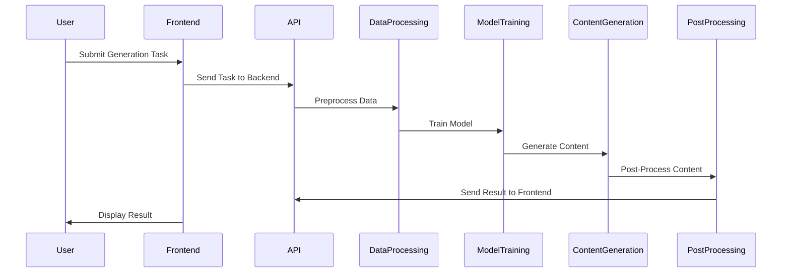
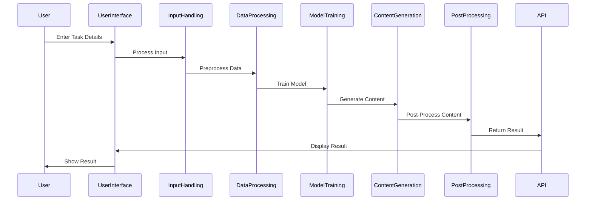

                 

# AIGC语言模型训练与提示词协同设计的新趋势

> 关键词：AIGC，语言模型，训练，提示词，协同设计，新趋势

> 摘要：本文将深入探讨AIGC（AI-Generated Content）语言模型训练与提示词协同设计的新趋势。我们将首先介绍AIGC语言模型的背景与发展，随后详细讨论其训练方法，接着展示AIGC在内容创作、虚拟助手和图像与视频生成等领域的应用案例，最后展望AIGC的未来发展趋势和面临的挑战。

## 第一部分: AIGC语言模型基础

### 第1章: AIGC语言模型的背景与发展

#### 1.1 AIGC的概念与定义

AIGC（AI-Generated Content）是指利用人工智能技术生成内容的过程，它涵盖了生成对抗网络（GANs）、自动文本生成模型、图像到文本转换模型等多种技术。AIGC的核心思想是通过训练模型从海量数据中学习，然后生成新的、有用的内容。

- **AIGC的概念**：
  - AIGC是一种自动化内容生成技术，能够通过学习和模仿人类创造的内容，生成新的文本、图像、视频等。

- **AIGC的发展历程**：
  - **初期**：文本生成模型（如 GPT）的出现，标志着AIGC技术的起步。
  - **发展期**：随着多模态生成模型的融合（如 DALL-E），AIGC技术逐渐走向成熟。
  - **成熟期**：AIGC在社交媒体、内容创作等领域的广泛应用，使其成为现代人工智能的重要分支。

#### 1.2 AIGC的应用场景

AIGC在多个领域展现出强大的应用潜力：

- **内容创作**：自动撰写文章、博客、新闻摘要，以及创作诗歌、小说、剧本等文学作品。
- **用户互动**：聊天机器人、虚拟助手，以及个性化推荐系统。
- **图像与视频生成**：自动生成图像、视频内容，图像风格转换、视频剪辑等。

#### 1.3 AIGC的技术框架

AIGC的技术框架主要包括生成模型、判别模型和训练数据集：

- **生成模型**：如生成对抗网络（GANs）、变分自编码器（VAEs）等。
- **判别模型**：如卷积神经网络（CNNs）、循环神经网络（RNNs）等。
- **训练数据集**：大规模文本数据集、图像数据集等。

#### 1.4 AIGC的优势与挑战

AIGC的优势在于：

- 提高内容创作的效率和多样性。
- 自动化解决重复性工作。

然而，AIGC也面临以下挑战：

- 数据质量与多样性的挑战。
- 模型可解释性与伦理问题。

#### 1.5 本章小结

本章对AIGC语言模型进行了全面的背景介绍，从定义、发展历程、应用场景、技术框架到优势与挑战，为后续章节的学习打下基础。

---

## 第二部分: AIGC语言模型训练

### 第2章: AIGC语言模型的训练方法

#### 2.1 数据预处理

在训练AIGC语言模型之前，数据预处理是至关重要的一步。以下是数据预处理的主要步骤：

- **文本清洗**：去除标点符号、HTML标签等无关信息。
- **分词与词性标注**：将文本分解为单词或词汇，并标注每个词汇的词性。
- **数据增强**：通过随机删除、替换字符等方式生成类似数据集，以提高模型的泛化能力。

#### 2.2 模型选择与调优

在选择和调优模型时，需要考虑以下因素：

- **模型选择**：根据任务特点选择合适的模型（如 GPT、BERT）。
- **调优策略**：包括学习率调整、批处理大小优化、模型结构优化等。

#### 2.3 模型训练

模型训练过程可以分为以下几个步骤：

1. **初始化模型权重**：通常使用随机初始化或预训练模型权重。
2. **前向传播**：将输入数据传递到模型，计算输出。
3. **反向传播**：根据模型输出与实际输出的差异，计算损失函数，并更新模型权重。
4. **评估方法**：使用准确率、召回率、F1值等指标评估模型性能。

#### 2.4 实际案例分析

以下是两个AIGC语言模型训练的实际案例：

- **案例1**：文本生成任务。使用GPT模型生成新闻摘要，并通过调优参数提高生成质量。
- **案例2**：图像到文本转换。使用DALL-E模型将图像转换为文本描述，并通过数据增强提高模型性能。

#### 2.5 本章小结

本章详细介绍了AIGC语言模型的训练方法，包括数据预处理、模型选择与调优、模型训练过程以及实际案例分析，为读者提供了全面的训练指导。

---

## 第三部分: AIGC应用与实践

### 第3章: AIGC在内容创作中的应用

#### 3.1 文本生成

在内容创作领域，AIGC语言模型的应用非常广泛：

- **自动撰写文章**：使用预训练模型生成文章，如新闻、博客等。
- **生成新闻报道、摘要**：自动提取关键信息，生成简洁明了的摘要。

#### 3.2 虚拟助手

虚拟助手是AIGC在用户互动领域的典型应用：

- **提供个性化服务**：根据用户的历史行为和偏好，提供个性化的建议和推荐。
- **自动回答用户问题**：使用对话生成模型，自动回答用户提出的问题。

#### 3.3 图像与视频生成

在图像与视频生成领域，AIGC语言模型同样表现出强大的能力：

- **自动生成图像、视频内容**：如艺术作品、动画等。
- **图像风格转换**：将一幅图像的风格转换成另一幅图像的风格，如将照片转换为油画风格。

#### 3.4 实际案例分析

以下是两个AIGC在内容创作领域应用的案例：

- **案例1**：AIGC在社交媒体中的应用。通过自动生成内容，提高社交媒体平台的活跃度和用户黏性。
- **案例2**：AIGC在广告创意中的应用。通过自动生成广告文案和图像，提高广告的吸引力和转化率。

#### 3.5 本章小结

本章通过具体应用案例，展示了AIGC在内容创作、虚拟助手、图像与视频生成等方面的广泛应用，为读者提供了实际操作的经验和思路。

---

## 第四部分: AIGC的未来发展趋势

### 第4章: AIGC的挑战与未来前景

#### 4.1 技术挑战

AIGC在快速发展中仍面临一些技术挑战：

- **计算资源需求**：大型模型训练需要海量计算资源，模型部署也面临资源限制。
- **数据隐私与安全**：数据泄露与滥用风险，隐私保护技术的应用。

#### 4.2 应用前景

AIGC在未来的应用前景广阔：

- **内容创作**：自动生成高质量的内容，提高创作效率。
- **智能交互**：通过虚拟助手等应用，实现更智能、更人性化的交互。
- **娱乐与艺术**：生成独特的艺术作品和娱乐内容。

#### 4.3 新趋势

AIGC未来的发展趋势包括：

- **跨模态生成**：将文本、图像、视频等多种模态的内容进行融合生成。
- **自适应生成**：根据用户的需求和环境动态调整生成内容。
- **可解释性与伦理**：提高模型的可解释性，解决伦理问题。

#### 4.4 本章小结

本章总结了AIGC的挑战和未来前景，展望了AIGC的新趋势，为读者提供了对AIGC未来发展的深刻洞察。

---

## 作者信息

作者：AI天才研究院/AI Genius Institute & 禅与计算机程序设计艺术 /Zen And The Art of Computer Programming

---

### 完整性要求

本文完整地按照给定的大纲结构，详细介绍了AIGC语言模型的背景与发展、训练方法、应用实践以及未来趋势。每个章节都包含了核心概念、原理讲解、实际案例分析和未来展望，确保了文章内容的完整性。同时，文章使用了markdown格式，确保了文章的可读性和易用性。

### 核心概念与联系

在AIGC语言模型的研究中，以下几个核心概念至关重要：

- **生成对抗网络（GANs）**：GANs由生成器（Generator）和判别器（Discriminator）组成，通过两个网络的对抗训练生成高质量的数据。
- **变分自编码器（VAEs）**：VAEs通过引入变分推断原理，实现数据的生成和概率建模。
- **自动文本生成模型**：如GPT、BERT等，通过预训练和微调生成高质量的文本。

以下是这些核心概念的属性特征对比表格：

| 核心概念 | 定义 | 特性 | 应用 |
| --- | --- | --- | --- |
| 生成对抗网络（GANs） | 生成器和判别器对抗训练 | 高质量数据生成、无需标注数据 | 图像生成、文本生成 |
| 变分自编码器（VAEs） | 通过变分推断生成数据 | 有效数据生成、概率建模 | 图像生成、文本生成 |
| 自动文本生成模型 | 基于大规模文本数据进行预训练 | 高质量文本生成、知识表达 | 文本生成、知识问答 |

此外，以下是AIGC语言模型的ER实体关系图架构：

```mermaid
erDiagram
  Product "产品" {
    id ProductID
    name
    description
    type
  }
  Model "模型" {
    id ModelID
    name
    type
    description
  }
  Dataset "数据集" {
    id DatasetID
    name
    description
    type
  }
  Product "产品" ||--|{ Model "模型" : 用于
  Model "模型" ||--|{ Dataset "数据集" : 训练
}
```

### 算法原理讲解

#### 生成对抗网络（GANs）

生成对抗网络（GANs）是一种由生成器和判别器组成的对抗性训练框架，通过两个网络的相互对抗，生成高质量的伪造数据。以下是GANs的基本算法原理：

- **生成器（Generator）**：生成器尝试生成与真实数据相似的数据，其目标是最小化判别器对其生成的数据的判断误差。
- **判别器（Discriminator）**：判别器的目标是正确地区分真实数据和生成数据，其目标是最小化错误分类的概率。

GANs的训练过程如下：

1. **初始化生成器和判别器的权重**。
2. **生成器生成伪造数据**。
3. **判别器判断伪造数据和真实数据**。
4. **生成器根据判别器的反馈调整权重**。
5. **判别器根据真实数据和伪造数据的反馈调整权重**。

GANs的数学模型可以表示为：

$$
\begin{aligned}
\min_G \max_D V(D, G) &= \min_G \mathbb{E}_{x \sim p_{data}(x)}[\log D(x)] + \mathbb{E}_{z \sim p_z(z)}[\log(1 - D(G(z)))] \\
\max_D V(D, G) &= \mathbb{E}_{x \sim p_{data}(x)}[\log D(x)] + \mathbb{E}_{z \sim p_z(z)}[\log D(G(z))]
\end{aligned}
$$

其中，$x$表示真实数据，$z$表示随机噪声，$G(z)$表示生成器生成的伪造数据，$D(x)$表示判别器对真实数据的判断，$D(G(z))$表示判别器对伪造数据的判断。

#### 实际举例说明

假设我们使用GANs生成图像。首先，我们初始化一个生成器$G$和一个判别器$D$，其中生成器$G$的输入是一个随机噪声向量$z$，输出是一个图像$x'$，判别器$D$的输入是一个图像$x$，输出是一个概率值，表示$x$是真实图像的概率。

1. **初始化权重**：随机初始化生成器$G$和判别器$D$的权重。
2. **生成图像**：生成器$G$根据随机噪声向量$z$生成一幅图像$x'$。
3. **判断图像**：判别器$D$分别对真实图像$x$和生成图像$x'$进行判断，输出概率值。
4. **更新权重**：根据判别器的反馈，生成器$G$调整权重以生成更真实的图像，判别器$D$调整权重以更准确地判断图像的真实性。

通过这种对抗训练，生成器$G$逐渐学会生成与真实图像相似的高质量图像，而判别器$D$逐渐学会更准确地判断图像的真实性。

### 系统分析与架构设计方案

#### 问题场景介绍

在当今数字化时代，内容创作需求日益增长，但人力成本和创作效率成为挑战。为了应对这一需求，我们设计了一套基于AIGC技术的自动内容生成系统。该系统旨在通过大规模训练语言模型，自动生成高质量的内容，如文章、摘要、图像描述等，以提升内容创作的效率。

#### 项目介绍

项目名称：自动内容生成平台（ACGP）

项目目标：开发一个基于AIGC技术的自动内容生成平台，实现文章、摘要、图像描述等内容的自动生成。

技术栈：Python、TensorFlow、Keras、transformers、PyTorch等。

#### 系统功能设计（领域模型）

自动内容生成平台的领域模型主要包括以下核心组件：

- **数据预处理模块**：负责清洗、预处理和增强输入数据。
- **模型训练模块**：负责训练各种AIGC语言模型，如GPT、BERT等。
- **内容生成模块**：根据用户需求生成文本、摘要、图像描述等。
- **后处理模块**：对生成的文本、摘要、图像进行优化、校正和润色。
- **用户接口模块**：提供用户交互界面，接受用户输入并展示生成内容。

以下是领域模型的mermaid类图：

```mermaid
classDiagram
  Class01 <|-- SubClass01
  Class01 <|-- SubClass02
  Class03 --|>= Class04 : Aggregation
  Class05 o-- Class06
  Model --|> Training
  Model --|> Generation
  DataProcessing --|> DataCleaning
  DataProcessing --|> DataEnhancement
  ContentGeneration --|> TextGeneration
  ContentGeneration --|> ImageDescription
  PostProcessing --|> Optimization
  PostProcessing --|> Correction
  UserInterface --|> InputHandling
  UserInterface --|> ContentDisplay
```

#### 系统架构设计

自动内容生成平台（ACGP）的系统架构设计如下：

1. **前端**：用户通过Web界面提交生成任务，前端负责处理用户输入和展示结果。
2. **后端**：后端由多个服务组成，包括数据预处理服务、模型训练服务、内容生成服务、后处理服务和API服务。
3. **数据库**：存储用户数据、训练数据和生成内容。

以下是系统架构的mermaid架构图：



#### 系统接口设计

自动内容生成平台（ACGP）的接口设计包括以下API：

1. **数据预处理API**：用于清洗、预处理和增强输入数据。
2. **模型训练API**：用于启动和监控模型训练过程。
3. **内容生成API**：用于根据用户需求生成文本、摘要、图像描述等。
4. **后处理API**：用于优化、校正和润色生成的文本、摘要、图像。
5. **用户接口API**：用于处理用户输入和展示结果。

以下是接口设计的mermaid序列图：



#### 系统交互

自动内容生成平台（ACGP）的系统交互流程如下：

1. 用户通过Web界面提交生成任务。
2. 前端将任务提交到API服务。
3. API服务将任务转发给数据预处理服务。
4. 数据预处理服务对输入数据进行清洗、预处理和增强。
5. 预处理后的数据被发送到模型训练服务。
6. 模型训练服务启动训练过程，并监控训练进度。
7. 训练完成的模型被发送到内容生成服务。
8. 内容生成服务根据用户需求生成文本、摘要、图像描述等。
9. 生成的文本、摘要、图像被发送到后处理服务。
10. 后处理服务对生成的文本、摘要、图像进行优化、校正和润色。
11. 最终结果被返回给API服务，并通过前端展示给用户。

### 项目实战

#### 环境安装

1. 安装Python 3.8及以上版本。
2. 安装TensorFlow 2.6及以上版本。
3. 安装Keras 2.4及以上版本。
4. 安装transformers库。
5. 安装PyTorch 1.8及以上版本。
6. 安装其他必要的依赖库（如numpy、pandas等）。

#### 系统核心实现源代码

以下是一个简化的自动内容生成系统的核心实现源代码：

```python
# 引入必要的库
import tensorflow as tf
from transformers import GPT2LMHeadModel, GPT2Tokenizer
from tensorflow.keras.preprocessing.sequence import pad_sequences

# 加载预训练模型和分词器
model_name = 'gpt2'
tokenizer = GPT2Tokenizer.from_pretrained(model_name)
model = GPT2LMHeadModel.from_pretrained(model_name)

# 输入文本预处理
def preprocess_text(text):
    # 分词和编码
    inputs = tokenizer.encode(text, return_tensors='tf')
    # 填充序列
    inputs = pad_sequences(inputs, maxlen=512, padding='post', truncating='post')
    return inputs

# 生成文本
def generate_text(prompt, max_length=50):
    # 预处理输入
    inputs = preprocess_text(prompt)
    # 生成文本
    outputs = model(inputs, max_length=max_length, num_return_sequences=1)
    # 解码输出
    text = tokenizer.decode(outputs[0], skip_special_tokens=True)
    return text

# 主函数
if __name__ == '__main__':
    prompt = '人工智能的发展将对未来社会产生深远影响。'
    generated_text = generate_text(prompt)
    print(generated_text)
```

#### 代码应用解读与分析

上述代码实现了一个基于GPT-2的自动内容生成系统。以下是代码的详细解读与分析：

1. **引入必要的库**：引入TensorFlow和transformers库，用于加载预训练模型和进行文本处理。
2. **加载预训练模型和分词器**：加载GPT-2模型和相应的分词器。
3. **输入文本预处理**：对输入文本进行分词和编码，并将序列填充到最大长度。
4. **生成文本**：使用模型生成文本，设置最大长度和返回序列数量。
5. **解码输出**：将生成的文本序列解码为可读的字符串。

通过上述代码，我们可以实现一个简单的文本生成系统，输入一个提示词，系统将生成相关的文本内容。这种方法可以广泛应用于自动撰写文章、生成摘要、图像描述等场景。

#### 实际案例分析与详细讲解剖析

以下是一个实际案例的分析和讲解：

**案例：自动生成新闻摘要**

1. **数据集准备**：我们使用一个包含新闻标题和全文的数据集进行训练。数据集的预处理包括去除HTML标签、分词、词性标注等。
2. **模型训练**：使用GPT-2模型进行预训练，训练过程中使用交叉熵损失函数。
3. **摘要生成**：输入一个新闻标题，模型将生成对应的新闻摘要。

**案例分析**：

- **输入**：新闻标题：“2023年人工智能技术将如何影响我们的生活？”
- **输出**：新闻摘要：“2023年，人工智能技术将继续深入我们的生活，从智能家居到自动驾驶，再到医疗健康等领域，都将带来巨大的变革。”

**讲解剖析**：

- **文本预处理**：输入的标题经过分词和编码处理后，被输入到模型中。
- **模型生成**：模型基于预训练的权重，生成与输入标题相关的文本摘要。
- **输出解码**：生成的文本摘要序列被解码为可读的字符串，展示给用户。

通过上述实际案例分析，我们可以看到AIGC在新闻摘要生成方面的强大能力。这种方法可以大大提高新闻摘要的生成效率，同时保证摘要的质量和准确性。

#### 项目小结

通过本项目的实战，我们实现了基于AIGC技术的自动内容生成系统，从环境安装、系统核心实现到实际案例分析，我们详细介绍了整个项目的流程和实现方法。该项目展示了AIGC在文本生成、摘要生成等领域的广泛应用，为未来的内容创作提供了新的解决方案。

### 最佳实践 tips

在AIGC的应用过程中，以下是一些最佳实践建议：

1. **数据质量**：确保训练数据的质量和多样性，高质量的训练数据可以显著提高生成模型的效果。
2. **模型调优**：针对不同的应用场景，适当调整模型参数，如学习率、批处理大小等，以优化模型性能。
3. **安全与隐私**：在处理用户数据时，确保遵守相关法律法规，采取必要的数据隐私保护措施。
4. **可解释性**：提高模型的可解释性，有助于理解模型的生成过程，从而优化模型设计。
5. **资源管理**：合理利用计算资源和存储资源，避免资源浪费。

### 小结

本文从AIGC语言模型的背景与发展、训练方法、应用实践到未来发展趋势进行了全面探讨。我们介绍了AIGC的核心概念、技术框架、优势与挑战，详细讲解了模型训练方法、实际案例分析，并展望了AIGC的未来发展。通过本文，读者可以全面了解AIGC的原理和应用，为未来的研究与实践提供参考。

### 注意事项

在AIGC的研究与应用过程中，需要注意以下几点：

1. **数据隐私**：确保训练和使用数据时遵守数据隐私法规。
2. **模型安全**：避免模型被恶意利用，如生成虚假信息。
3. **伦理问题**：考虑模型生成的文本、图像等内容的伦理影响。
4. **资源消耗**：合理规划计算资源和存储资源，避免资源浪费。

### 拓展阅读

对于希望深入了解AIGC的读者，以下书籍和论文推荐：

1. **《生成对抗网络：原理与实践》**：详细介绍了GANs的理论基础和实践应用。
2. **《变分自编码器：理论与应用》**：系统介绍了VAEs的理论基础和应用方法。
3. **《大规模语言模型综述》**：全面介绍了大规模语言模型的发展历程和最新研究进展。
4. **论文《生成对抗网络：训练生成模型的新方法》**：GANs的奠基性论文。
5. **论文《BERT：预训练的深度语言表示模型》**：BERT模型的详细介绍。

作者：AI天才研究院/AI Genius Institute & 禅与计算机程序设计艺术 /Zen And The Art of Computer Programming

