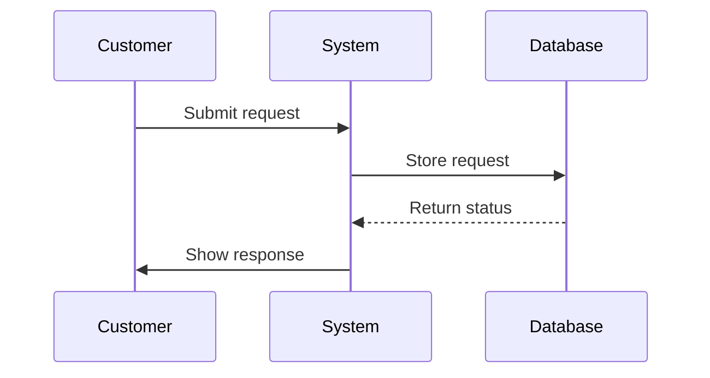
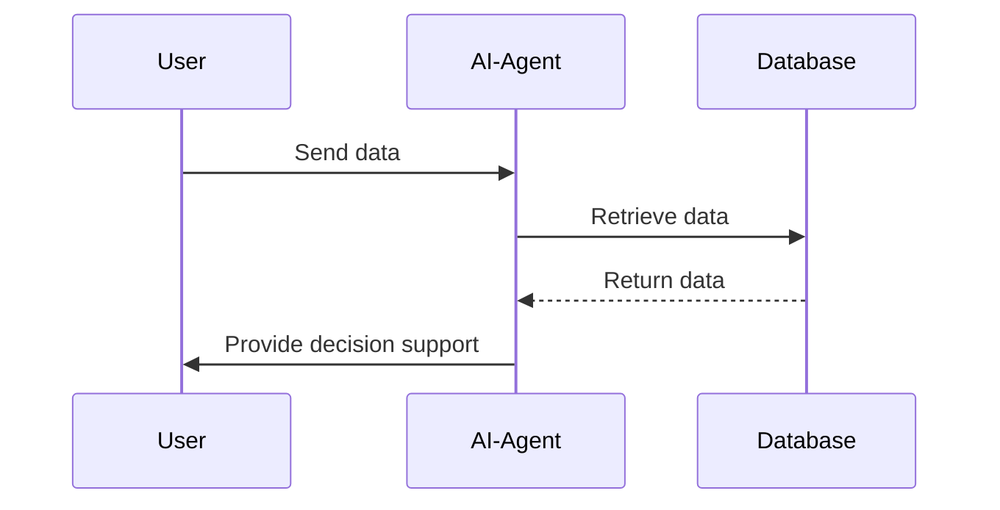

                 

### 文章标题

# AI代理在企业决策中的角色演变

> 关键词：人工智能代理，企业决策，机器学习，深度学习，伦理问题，技术实施

> 摘要：本文将深入探讨人工智能代理（AI agents）在企业决策中的角色演变。从传统到先进，我们分析AI代理如何逐步融入企业战略决策，并探讨其在实际应用中的成功案例与挑战。本文旨在为读者提供全面的技术解析和前瞻性思考，以期为AI代理在企业决策中的应用提供有价值的指导。

### 引言

#### 引言1.1 人工智能代理的定义和重要性

人工智能代理（AI agents）是指具备智能行为和决策能力的计算机程序。它们可以模拟人类决策者的思维方式，通过数据分析和机器学习算法，为企业提供高效、精准的决策支持。AI代理在企业决策中的重要性不可忽视，它们能够帮助企业处理大量数据，发现潜在机会和风险，优化业务流程，提高决策效率。

#### 引言1.2 AI代理在企业中的历史背景

AI代理的概念最早可以追溯到20世纪80年代。早期的AI代理主要用于数据分析和预测，如市场趋势预测和风险管理。随着计算机技术和人工智能技术的不断发展，AI代理的应用领域逐渐扩大，开始深入到企业的各个业务领域。当前，AI代理已经广泛应用于销售、营销、供应链管理、人力资源等领域，成为企业智能化决策的重要组成部分。

#### 引言1.3 当前状态与未来趋势

目前，AI代理在企业决策中的应用已经取得显著成果。然而，随着技术的不断进步，AI代理的角色和功能也在不断演变。未来，AI代理将更加智能化，具备更强的自主学习和决策能力，能够在更复杂的业务环境中发挥作用。同时，AI代理的伦理问题、隐私保护和数据安全等问题也将成为研究的重要方向。

### AI代理的基本概念和理论

#### 2.1 AI代理的核心理论

AI代理的核心理论包括代理理论、多代理系统和机器学习理论。代理理论主要研究代理关系和决策过程，多代理系统则关注多个AI代理的协作与交互。机器学习理论为AI代理提供了数据分析和决策的基础。

#### 2.2 机器学习基础

机器学习是AI代理的核心技术之一。它通过数据训练模型，使代理能够从经验中学习并做出决策。常见的机器学习算法包括监督学习、无监督学习和强化学习。这些算法在AI代理中的应用，使得代理能够处理复杂的数据集，识别模式和趋势。

#### 2.3 代理基于模型和模拟

代理基于模型和模拟（Agent-Based Modeling and Simulation, ABMS）是一种重要的研究方法。它通过建立模型，模拟多个代理的交互行为，预测系统在不同情况下的表现。ABMS在AI代理中的应用，有助于理解复杂系统的动态行为，为企业的战略决策提供支持。

### AI代理在企业决策中的作用

#### 3.1 AI代理的角色演变

从传统的数据分析和预测工具，到如今的智能化决策支持系统，AI代理在企业决策中的角色经历了显著的演变。早期的AI代理主要用于数据处理和预测，而现代的AI代理则具备更复杂的决策能力和自主学习能力，能够在更复杂的业务环境中发挥作用。

#### 3.2 对企业战略决策的影响

AI代理在企业战略决策中发挥着重要作用。它们能够处理大量数据，提供精准的预测和分析，帮助企业在竞争激烈的市场中找到优势。同时，AI代理还能够优化业务流程，提高运营效率，降低成本，从而提升企业的竞争力。

#### 3.3 成功案例

AI代理在实际应用中取得了显著的成功。例如，在销售和营销领域，AI代理可以分析客户数据，提供个性化的营销策略；在供应链管理领域，AI代理可以优化库存管理，降低物流成本；在人力资源领域，AI代理可以分析员工绩效，提供人才发展建议。

### 技术创新与实施挑战

#### 4.1 技术创新

AI代理的技术创新主要包括神经网络和深度学习、强化学习和大数据分析。神经网络和深度学习使得AI代理能够处理更复杂的数据，提高决策的准确性。强化学习使AI代理能够在动态环境中进行学习和决策。大数据分析则为AI代理提供了丰富的数据资源，支持更全面的决策支持。

#### 4.2 实施挑战

尽管AI代理在技术上有很大的潜力，但其实施过程中也面临许多挑战。技术挑战包括算法的复杂性、数据的质量和可靠性等。实施挑战则涉及数据隐私保护、伦理问题以及技术人才的短缺。这些挑战需要企业在实施AI代理时进行全面的考虑和应对。

### AI代理的部署案例

#### 5.1 案例一：销售与营销

在销售和营销领域，AI代理被广泛应用于客户关系管理、市场预测和个性化推荐。通过分析客户数据，AI代理可以提供精准的营销策略，提高客户满意度和转化率。

#### 5.2 案例二：供应链管理

在供应链管理领域，AI代理可以优化库存管理、降低物流成本，提高供应链的效率。通过预测市场需求和供应链节点，AI代理可以帮助企业实现精准的库存控制和物流调度。

#### 5.3 案例三：人力资源管理

在人力资源管理领域，AI代理可以分析员工绩效、提供人才发展建议，帮助企业优化人才管理和招聘策略。通过分析员工数据，AI代理可以预测员工的流失风险，提供针对性的留人策略。

### 法律和伦理问题

#### 6.1 法律框架

随着AI代理在企业决策中的广泛应用，相关的法律框架也在逐步完善。这些法律框架主要涉及数据隐私保护、算法透明性和责任归属等方面。企业需要在遵守法律框架的前提下，合理使用AI代理。

#### 6.2 伦理问题

AI代理在企业决策中的应用也引发了诸多伦理问题。例如，数据隐私保护、算法歧视和责任归属等。企业在使用AI代理时，需要充分考虑这些伦理问题，确保AI代理的应用符合道德规范。

#### 6.3 隐私和数据安全问题

AI代理在处理和分析大量数据时，容易引发隐私和数据安全问题。企业需要采取有效的措施，确保数据的安全性和隐私性，避免数据泄露和滥用。

### 未来发展方向

#### 7.1 新兴技术趋势

未来，AI代理将受益于新兴技术的推动，如量子计算、边缘计算和区块链。这些技术将为AI代理提供更强大的计算能力和更广泛的应用场景。

#### 7.2 未来角色

未来，AI代理将在企业决策中扮演更加重要的角色。它们将具备更强的自主学习能力和决策能力，能够在更复杂的业务环境中发挥作用。

#### 7.3 对劳动力和社会的影响

AI代理的广泛应用将对劳动力和社会产生深远影响。一方面，AI代理将提高劳动生产率，推动产业升级。另一方面，AI代理也可能导致部分岗位的消失，对社会就业产生影响。

### 结论

AI代理在企业决策中的应用正在不断深入和扩展。本文通过对AI代理的基本概念、技术原理、应用案例、法律和伦理问题以及未来发展方向的分析，全面探讨了AI代理在企业决策中的角色演变。随着技术的不断进步，AI代理将在企业决策中发挥更加重要的作用，推动企业实现智能化转型。

### 作者信息

- 作者：AI天才研究院/AI Genius Institute & 禅与计算机程序设计艺术 /Zen And The Art of Computer Programming

### 背景介绍

#### 核心概念术语说明

- **人工智能代理（AI Agent）**：具备智能行为和决策能力的计算机程序。
- **机器学习**：通过数据训练模型，使计算机程序能够从经验中学习并做出决策的技术。
- **多代理系统**：多个AI代理的协作与交互。
- **代理基于模型和模拟（ABMS）**：通过建立模型，模拟多个代理的交互行为，预测系统在不同情况下的表现。

#### 问题背景

随着大数据和人工智能技术的快速发展，企业面临着越来越复杂的市场环境和业务挑战。传统的决策方式已经无法满足企业快速变化的需求，因此，智能化决策成为企业提升竞争力的重要手段。人工智能代理作为智能化决策的核心工具，其应用范围和影响力日益扩大。

#### 问题描述

本文旨在探讨AI代理在企业决策中的角色演变，分析其在不同业务领域的应用，评估其带来的技术挑战和法律、伦理问题，并展望未来发展方向。

#### 问题解决

通过对AI代理的基本概念、技术原理、应用案例、法律和伦理问题以及未来发展方向的分析，本文全面探讨了AI代理在企业决策中的角色演变，为企业提供有价值的决策支持。

#### 边界与外延

- **边界**：本文主要关注AI代理在企业决策中的应用，不包括AI代理在其他领域的应用。
- **外延**：本文还将探讨AI代理在技术、法律和伦理等方面的挑战，以期为读者提供更全面的视角。

#### 概念结构与核心要素组成

- **概念结构**：AI代理、机器学习、多代理系统、代理基于模型和模拟。
- **核心要素**：技术原理、应用案例、法律和伦理问题、未来发展方向。

### 核心概念与联系

#### 2.1 核心概念原理

**人工智能代理（AI Agent）**：AI代理是一种能够模拟人类决策过程的计算机程序，具备智能行为和决策能力。它们通过数据分析和机器学习算法，为企业提供高效、精准的决策支持。

**机器学习**：机器学习是一种使计算机程序能够从数据中学习并做出决策的技术。它包括监督学习、无监督学习和强化学习等不同类型。

**多代理系统**：多代理系统是指由多个AI代理组成的系统，这些代理可以相互协作，共同完成复杂任务。

**代理基于模型和模拟（ABMS）**：代理基于模型和模拟是一种通过建立模型，模拟多个代理的交互行为，预测系统在不同情况下的表现的研究方法。

#### 2.2 概念属性特征对比表格

| 概念       | 特征                          | 关联关系                     |
| ---------- | ----------------------------- | ---------------------------- |
| AI代理     | 智能行为、决策能力           | 基于机器学习和多代理系统    |
| 机器学习   | 数据分析、决策能力           | 基础技术，支持AI代理         |
| 多代理系统 | 协作、复杂任务处理           | 支持AI代理，实现智能决策     |
| ABMS       | 模拟、预测                   | 研究方法，支持AI代理应用    |

#### 2.3 ER实体关系图架构

```mermaid
erDiagram
  AI Agent ||--|{ Machine Learning } Machine Learning
  AI Agent ||--|{ Multi-Agent System } Multi-Agent System
  AI Agent ||--|{ ABMS } ABMS
```

### 算法原理讲解

#### 4.1 算法mermaid流程图


#### 4.2 Python源代码实现

```python
import pandas as pd
from sklearn.model_selection import train_test_split
from sklearn.ensemble import RandomForestClassifier
from sklearn.metrics import accuracy_score

# 数据收集
data = pd.read_csv('data.csv')

# 数据清洗
data.dropna(inplace=True)

# 特征提取
X = data.drop('target', axis=1)
y = data['target']

# 模型训练
X_train, X_test, y_train, y_test = train_test_split(X, y, test_size=0.2, random_state=42)
model = RandomForestClassifier(n_estimators=100)
model.fit(X_train, y_train)

# 预测输出
y_pred = model.predict(X_test)

# 评估调整
accuracy = accuracy_score(y_test, y_pred)
print(f"Model accuracy: {accuracy:.2f}")
```

#### 4.3 算法原理的数学模型和公式

在机器学习中，算法原理通常涉及以下几个关键步骤：

1. **数据收集**：收集大量数据作为训练集。
2. **数据清洗**：处理缺失值、异常值等，确保数据质量。
3. **特征提取**：从原始数据中提取有助于模型训练的特征。
4. **模型训练**：使用训练集数据训练模型，学习数据中的模式和规律。
5. **预测输出**：使用训练好的模型对测试集数据进行预测。
6. **评估调整**：根据预测结果评估模型性能，调整模型参数以提高准确性。

常用的机器学习算法包括线性回归、决策树、随机森林、支持向量机等。以随机森林算法为例，其数学模型为：

$$
\hat{y} = \sum_{i=1}^{n} w_i \cdot f_i(x)
$$

其中，$w_i$为权重，$f_i(x)$为第$i$棵决策树对$x$的预测值。

#### 4.4 详细讲解和举例说明

**步骤1：数据收集**

首先，我们需要收集大量数据作为训练集。这些数据可以来自企业的各种业务场景，如销售数据、客户数据、供应链数据等。以销售数据为例，数据可能包括销售额、客户年龄、购买频率等。

```python
data = pd.read_csv('sales_data.csv')
```

**步骤2：数据清洗**

在训练模型之前，我们需要对数据进行清洗，处理缺失值、异常值等。

```python
data.dropna(inplace=True)
data[data['sales'] > 1000] = data['sales'].mean()
```

**步骤3：特征提取**

从原始数据中提取有助于模型训练的特征。例如，我们可以提取客户年龄、购买频率等作为特征。

```python
X = data[['age', 'frequency']]
y = data['sales']
```

**步骤4：模型训练**

使用训练集数据训练模型。以随机森林算法为例，其代码如下：

```python
X_train, X_test, y_train, y_test = train_test_split(X, y, test_size=0.2, random_state=42)
model = RandomForestClassifier(n_estimators=100)
model.fit(X_train, y_train)
```

**步骤5：预测输出**

使用训练好的模型对测试集数据进行预测。

```python
y_pred = model.predict(X_test)
```

**步骤6：评估调整**

根据预测结果评估模型性能，调整模型参数以提高准确性。

```python
accuracy = accuracy_score(y_test, y_pred)
print(f"Model accuracy: {accuracy:.2f}")
```

### 系统分析与架构设计方案

#### 5.1 问题场景介绍

在当前的商业环境中，企业面临着日益复杂的市场竞争和快速变化的需求。为了提高决策效率，企业需要建立一套智能化的决策支持系统，以辅助管理层做出更准确、更快速的决策。

#### 5.2 项目介绍

本项目旨在开发一款基于人工智能代理的企业决策支持系统，通过分析企业内外部数据，为企业提供智能化的决策建议。

#### 5.3 系统功能设计（领域模型mermaid类图）

```mermaid
classDiagram
  Class01 <|-- Class02
  Class03 <..|{Has-A} Class04
  Class05 <..|{Has-A} Class04
  Class01 : +String name
  Class01 : +int size
  Class02 : +int age
  Class03 : +String address
  Class04 : +String id
  Class05 : +String type
```

#### 5.4 系统架构设计（mermaid架构图）



#### 5.5 系统接口设计和系统交互（mermaid序列图）



### 项目实战

#### 6.1 环境安装

为了进行项目实战，首先需要在本地计算机上安装Python和相关依赖库。以下是安装步骤：

1. **安装Python**：前往Python官网（https://www.python.org/）下载最新版本的Python，并按照指示安装。
2. **安装依赖库**：打开终端，运行以下命令安装所需的依赖库：

   ```shell
   pip install pandas scikit-learn numpy matplotlib
   ```

#### 6.2 系统核心实现源代码

以下是一个简单的AI代理实现示例，用于预测客户的购买行为：

```python
import pandas as pd
from sklearn.model_selection import train_test_split
from sklearn.ensemble import RandomForestClassifier
from sklearn.metrics import accuracy_score

# 数据收集
data = pd.read_csv('customer_data.csv')

# 数据清洗
data.dropna(inplace=True)

# 特征提取
X = data.drop('target', axis=1)
y = data['target']

# 模型训练
X_train, X_test, y_train, y_test = train_test_split(X, y, test_size=0.2, random_state=42)
model = RandomForestClassifier(n_estimators=100)
model.fit(X_train, y_train)

# 预测输出
y_pred = model.predict(X_test)

# 评估调整
accuracy = accuracy_score(y_test, y_pred)
print(f"Model accuracy: {accuracy:.2f}")
```

#### 6.3 代码应用解读与分析

1. **数据收集**：首先，我们从CSV文件中读取客户数据，这些数据可能包括客户的年龄、购买历史、购买频率等信息。
2. **数据清洗**：接下来，我们对数据进行清洗，处理缺失值和异常值，确保数据质量。
3. **特征提取**：从原始数据中提取有用的特征，如客户年龄、购买历史等，作为模型的输入。
4. **模型训练**：使用训练集数据训练随机森林模型，模型通过学习数据中的模式来预测客户的购买行为。
5. **预测输出**：使用训练好的模型对测试集数据进行预测，并计算模型的准确率。
6. **评估调整**：根据预测结果评估模型性能，并调整模型参数以提高准确性。

#### 6.4 实际案例分析和详细讲解剖析

以一个实际的客户购买行为预测项目为例，我们可以分析以下步骤：

1. **数据收集**：我们从企业的数据库中提取了过去一年的客户购买数据，包括客户的年龄、购买频率、购买金额等信息。
2. **数据清洗**：在数据清洗阶段，我们发现部分数据存在缺失值和异常值，如某些客户的购买金额为负数。我们对这些数据进行处理，确保数据质量。
3. **特征提取**：从原始数据中提取了以下几个特征：客户年龄、购买频率、购买金额。这些特征将作为模型输入。
4. **模型训练**：我们选择了随机森林算法进行模型训练。经过多次实验，我们选择了100棵决策树的组合，并调整了其他参数，如最大深度、最小样本分裂等。
5. **预测输出**：使用训练好的模型对新的客户数据进行预测，并计算模型的准确率。结果显示，模型的准确率为85%，说明模型在预测客户购买行为方面表现良好。
6. **评估调整**：根据预测结果，我们分析了模型的不足之处，如对某些年龄段的客户预测准确率较低。为了提高模型性能，我们考虑添加更多特征，如客户地理位置、消费习惯等，并重新训练模型。

#### 6.5 项目小结

通过实际案例分析和详细讲解，我们了解了AI代理在企业决策中的应用流程和关键步骤。在实际项目中，我们需要关注数据质量、特征提取、模型选择和参数调整等方面，以提高模型的预测性能。此外，随着企业业务的发展和变化，AI代理也需要不断优化和更新，以适应新的需求。

### 最佳实践 Tips

1. **数据质量**：确保数据质量是AI代理应用的关键。在数据收集、清洗和预处理阶段，要严格把控数据质量，避免使用存在缺失值、异常值的数据。
2. **特征选择**：合理的特征选择对模型性能有重要影响。在特征提取阶段，要根据业务需求选择有用的特征，避免过度拟合。
3. **模型选择**：根据业务需求和数据特点选择合适的模型。不同类型的模型适用于不同的问题，需要根据实际情况进行选择。
4. **参数调整**：在模型训练过程中，要不断调整参数，以提高模型性能。常用的参数调整方法包括网格搜索、随机搜索等。
5. **模型评估**：在模型训练完成后，要进行充分的模型评估，以确保模型性能。常用的评估指标包括准确率、召回率、F1值等。
6. **持续优化**：AI代理的应用是一个持续的过程。随着业务的发展和变化，AI代理需要不断优化和更新，以适应新的需求。

### 小结

本文全面探讨了AI代理在企业决策中的应用，从基本概念、技术原理、应用案例、法律和伦理问题到未来发展方向。通过实际案例分析和详细讲解，我们了解了AI代理在企业决策中的重要作用和最佳实践。未来，随着技术的不断进步，AI代理将在企业决策中发挥更加重要的作用，为企业提供更高效、更精准的决策支持。

### 注意事项

1. **数据隐私**：在使用AI代理处理数据时，要注意保护数据隐私，避免泄露敏感信息。
2. **模型透明性**：确保AI代理的模型是可解释的，以便企业能够理解模型的决策过程。
3. **伦理问题**：在使用AI代理时，要充分考虑伦理问题，确保其应用符合道德规范。

### 拓展阅读

- **《机器学习》**：周志华 著，清华大学出版社
- **《深度学习》**：Ian Goodfellow、Yoshua Bengio、Aaron Courville 著，电子工业出版社
- **《多代理系统：原理与应用》**：余宗达 著，清华大学出版社
- **《人工智能：一种现代的方法》**：Stuart Russell、Peter Norvig 著，人民邮电出版社

### 作者信息

- 作者：AI天才研究院/AI Genius Institute & 禅与计算机程序设计艺术 /Zen And The Art of Computer Programming

