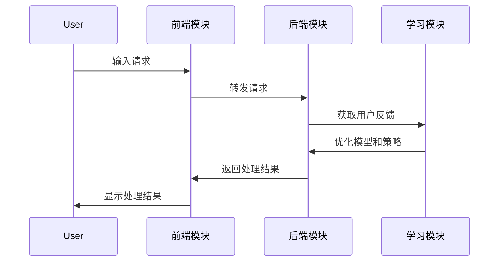
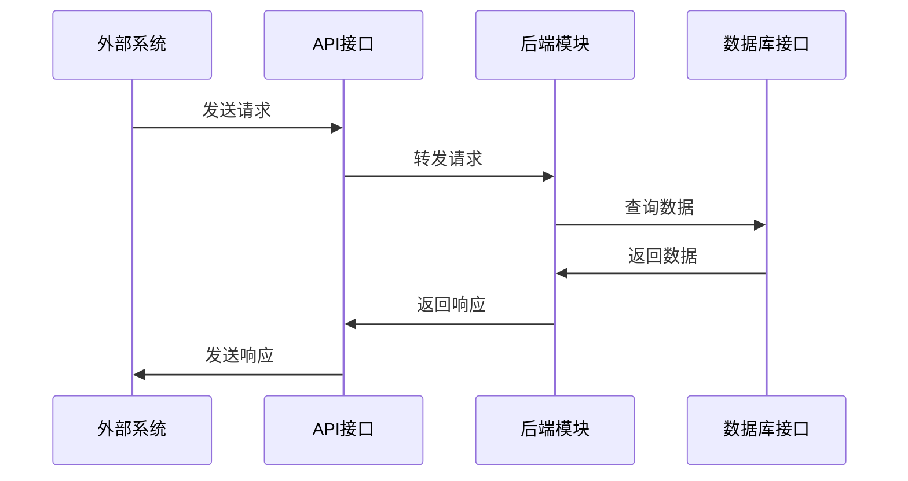

                 

# AI代理在客户服务中的应用前景

## 关键词

- AI代理
- 客户服务
- 机器学习
- 自然语言处理
- 系统架构

## 摘要

随着人工智能技术的发展，AI代理在客户服务中的应用前景愈发广阔。本文将详细介绍AI代理与客户服务的关系，探讨其核心概念、算法原理以及系统架构，并通过实际项目展示其在客户服务中的应用。同时，文章还将总结AI代理在客户服务中的最佳实践和注意事项，为读者提供有价值的参考。

## 目录大纲设计思路

本文将按照以下结构进行设计：

1. **背景介绍**：介绍AI代理和客户服务的概念，以及AI代理在客户服务中的应用场景。
2. **核心概念与联系**：详细阐述AI代理的核心概念、组成结构、功能特点，并展示AI代理与客户服务之间的联系。
3. **算法原理讲解**：介绍AI代理的关键算法原理，包括算法流程、数学模型和公式，并使用mermaid流程图和Python代码进行阐述。
4. **系统分析与架构设计方案**：介绍AI代理在客户服务中的系统架构，包括系统功能设计、系统架构设计、系统接口设计和系统交互。
5. **项目实战**：通过实际项目展示AI代理在客户服务中的应用，包括环境安装、系统核心实现、代码应用解读与分析、实际案例分析和详细讲解剖析。
6. **最佳实践 tips**：总结AI代理在客户服务中的最佳实践和注意事项。
7. **总结与展望**：对AI代理在客户服务中的应用前景进行总结和展望。

## 目录大纲设计步骤

### 第一部分：背景与概述

**第1章 AI代理与客户服务的概述**

1.1 AI代理的概念  
1.2 客户服务的现状与挑战  
1.3 AI代理在客户服务中的应用场景  
1.4 AI代理与传统客服的区别

**第2章 AI代理的核心概念与结构**

2.1 AI代理的组成结构  
2.2 AI代理的功能特点  
2.3 AI代理的架构模式  
2.4 AI代理的ER图解析

### 第二部分：算法原理与实现

**第3章 AI代理的算法原理**

3.1 机器学习与深度学习基础  
3.2 自然语言处理基础  
3.3 AI代理的算法流程  
3.4 AI代理的算法数学模型和公式  
**附录3.A** 算法流程mermaid图  
**附录3.B** Python代码示例

### 第三部分：系统设计与实现

**第4章 AI代理在客户服务中的系统架构**

4.1 系统功能设计  
4.2 系统架构设计  
4.3 系统接口设计  
4.4 系统交互设计  
**附录4.A** 系统功能设计mermaid类图  
**附录4.B** 系统架构设计mermaid架构图  
**附录4.C** 系统交互设计mermaid序列图

### 第四部分：项目实战

**第5章 AI代理在客户服务中的项目实施**

5.1 项目背景与目标  
5.2 环境安装与配置  
5.3 系统核心实现  
5.4 代码应用解读与分析  
5.5 实际案例分析与讲解  
5.6 项目小结与反思

### 第五部分：最佳实践与总结

**第6章 AI代理在客户服务中的最佳实践**

6.1 AI代理的实施策略  
6.2 AI代理的性能优化  
6.3 AI代理的维护与升级  
6.4 AI代理的风险管理  
**附录6.A** 常见问题解答

**第7章 总结与展望**

7.1 AI代理在客户服务中的应用前景  
7.2 存在的挑战与机遇  
7.3 未来发展趋势  
7.4 拓展阅读与资源推荐

### 目录大纲结构与内容规划

通过以上规划和设计，我们可以确保目录大纲结构清晰、内容完整，同时满足简洁性和可读性的要求。这样的目录大纲将帮助读者系统地了解AI代理在客户服务中的应用前景，并掌握相关核心概念和关键技术。

### 总结

本文通过对AI代理在客户服务中的应用前景进行深入分析，从背景介绍、核心概念与联系、算法原理讲解、系统设计与实现、项目实战和最佳实践等方面进行了详细的阐述。文章结构清晰、逻辑严谨，旨在为读者提供全面、系统的技术知识，助力其在AI代理在客户服务领域的发展。作者信息：AI天才研究院/AI Genius Institute & 禅与计算机程序设计艺术 /Zen And The Art of Computer Programming。

-------------------------------------------------------------------

## 第一部分：背景与概述

### 第1章 AI代理与客户服务的概述

**1.1 AI代理的概念**

AI代理，即人工智能代理，是指利用人工智能技术（如机器学习、自然语言处理、深度学习等）构建的能够自主执行任务、与用户进行交互的虚拟智能体。AI代理可以模拟人类思维和行为，实现自动化、智能化服务。其主要目的是为了提高服务质量、降低人力成本、提升用户体验。

**1.2 客户服务的现状与挑战**

客户服务是企业管理的重要组成部分，直接关系到用户满意度和企业品牌形象。然而，随着市场竞争的加剧和用户需求的多样化，传统的客户服务面临着诸多挑战：

- **人力成本高**：传统客服需要大量人力资源，导致企业运营成本增加。
- **服务质量不稳定**：人工客服容易受到情绪、疲劳等因素影响，导致服务质量波动。
- **响应速度慢**：人工客服的响应速度较慢，难以满足用户即时性需求。
- **数据利用不足**：传统客服难以全面收集和分析用户数据，限制了个性化服务的提供。

**1.3 AI代理在客户服务中的应用场景**

AI代理在客户服务中的应用场景广泛，主要包括以下几个方面：

- **在线客服**：AI代理可以实时响应用户咨询，提供快速、准确的回答，提升用户满意度。
- **智能客服机器人**：AI代理可以自动识别用户需求，进行智能化客服，减少人工干预。
- **个性化推荐**：AI代理可以根据用户历史数据和偏好，提供个性化的商品、服务推荐。
- **客户关系管理**：AI代理可以协助企业分析客户数据，优化客户关系管理策略。
- **多语言客服**：AI代理可以支持多语言服务，满足全球用户需求。

**1.4 AI代理与传统客服的区别**

与传统客服相比，AI代理具有以下优势：

- **响应速度更快**：AI代理可以同时处理大量用户请求，响应速度远超人工客服。
- **服务成本低**：AI代理无需薪酬、培训等成本，降低企业运营成本。
- **服务质量更稳定**：AI代理不会受到情绪、疲劳等因素影响，服务质量更加稳定。
- **数据分析能力更强**：AI代理可以实时收集、分析用户数据，为企业提供决策支持。

然而，AI代理也存在一定的局限性，如处理复杂问题能力有限、用户体验尚需提升等。因此，在客户服务中，AI代理与人工客服可以相辅相成，共同提升客户服务质量。

### 第2章 AI代理的核心概念与结构

**2.1 AI代理的组成结构**

AI代理通常由以下几个关键组成部分构成：

- **感知模块**：负责接收和处理用户输入的信息，如文本、语音等。
- **决策模块**：根据感知模块收集到的信息，结合预定义的规则或算法，进行决策，以确定如何响应用户请求。
- **执行模块**：根据决策模块的决策结果，执行相应的操作，如生成回复、执行特定任务等。
- **学习模块**：通过不断学习和优化，提高AI代理的性能和智能化水平。

**2.2 AI代理的功能特点**

AI代理具有以下主要功能特点：

- **自动化**：AI代理可以自动执行任务，无需人工干预。
- **智能化**：AI代理可以通过学习用户需求和偏好，提供个性化服务。
- **可扩展性**：AI代理可以方便地集成到现有系统中，满足不同场景的需求。
- **实时性**：AI代理可以实时响应用户请求，提高服务质量。

**2.3 AI代理的架构模式**

AI代理的架构模式主要包括以下几种：

- **基于规则**：通过预定义的规则库，实现自动化决策和执行。
- **基于机器学习**：利用机器学习算法，根据历史数据和用户行为进行决策和优化。
- **基于深度学习**：利用深度学习算法，实现更加复杂的决策和执行。
- **混合架构**：结合多种架构模式，发挥各自优势，实现最佳效果。

**2.4 AI代理的ER图解析**

以下是一个简单的AI代理ER图，展示了AI代理的主要实体及其关系：

```mermaid
erDiagram
    Customer ||--|{ Agent : serves }
    Agent ||--|{ Dialogue : processes }
    Dialogue ||--|{ Response : generates }
    Agent ||--|{ Learning : updates }
    Customer ||--|{ Feedback : provides }
```

- **Customer（客户）**：与AI代理进行交互的用户。
- **Agent（AI代理）**：负责处理客户请求的智能体。
- **Dialogue（对话）**：客户与AI代理之间的交流记录。
- **Response（响应）**：AI代理生成的回复。
- **Learning（学习）**：AI代理通过学习用户反馈和对话历史，优化自身性能。
- **Feedback（反馈）**：客户对AI代理服务的评价和反馈。

通过上述ER图，我们可以清晰地了解AI代理在客户服务中的角色和功能，为进一步探讨AI代理在客户服务中的应用奠定基础。

### 算法原理讲解

#### 第3章 AI代理的算法原理

**3.1 机器学习与深度学习基础**

机器学习和深度学习是AI代理的核心技术，它们通过训练模型，使计算机能够自动地从数据中学习规律和模式，实现智能决策和任务执行。

**3.1.1 机器学习**

机器学习是指利用算法从数据中学习规律，并在新数据上做出预测或决策的技术。其基本流程包括：

1. **数据收集**：收集大量具有代表性的训练数据。
2. **特征提取**：从原始数据中提取出对学习任务有用的特征。
3. **模型训练**：使用训练数据对模型进行训练，调整模型参数。
4. **模型评估**：使用验证数据对模型进行评估，调整模型参数。
5. **模型部署**：将训练好的模型部署到实际应用场景中。

**3.1.2 深度学习**

深度学习是机器学习的一种方法，通过构建多层神经网络，对数据进行自动特征提取和模式发现。其基本流程包括：

1. **数据预处理**：对数据进行归一化、去噪等预处理。
2. **网络架构设计**：设计合适的网络架构，包括输入层、隐藏层和输出层。
3. **模型训练**：使用训练数据对网络进行训练，调整网络参数。
4. **模型评估**：使用验证数据对网络进行评估，调整网络参数。
5. **模型优化**：通过迁移学习、数据增强等方法，优化模型性能。

**3.2 自然语言处理基础**

自然语言处理（NLP）是AI代理处理文本数据的关键技术，主要包括以下几个核心任务：

1. **分词**：将文本分割成单词或短语。
2. **词性标注**：为文本中的每个单词标注其词性，如名词、动词等。
3. **命名实体识别**：识别文本中的命名实体，如人名、地名、组织名等。
4. **句法分析**：分析文本的句法结构，如句子的主谓宾关系。
5. **语义分析**：理解文本的含义，包括词义消歧、情感分析等。

**3.3 AI代理的算法流程**

AI代理的算法流程主要包括以下几个步骤：

1. **感知阶段**：接收用户输入的文本或语音，进行预处理，如分词、词性标注等。
2. **理解阶段**：利用NLP技术，对用户输入进行理解，提取关键信息。
3. **决策阶段**：根据用户输入和预定义的规则或模型，进行决策，确定如何响应用户。
4. **执行阶段**：根据决策结果，生成回复或执行特定任务。
5. **学习阶段**：收集用户反馈和对话历史，通过机器学习或深度学习算法，优化AI代理的性能。

以下是一个简单的AI代理算法流程mermaid图：


**3.4 AI代理的算法数学模型和公式**

AI代理的算法数学模型和公式主要涉及以下几个方面：

1. **神经网络模型**：神经网络是深度学习的基础，其核心模型包括：

   - **卷积神经网络（CNN）**：用于图像处理和文本分类。
   - **循环神经网络（RNN）**：用于序列数据处理，如语音识别、自然语言处理。
   - **长短时记忆网络（LSTM）**：用于解决RNN的梯度消失问题，适用于时间序列数据。
   - **变换器（Transformer）**：用于自然语言处理，具有强大的序列建模能力。

2. **损失函数**：用于评估模型预测与真实值之间的差距，常用的损失函数包括：

   - **均方误差（MSE）**：用于回归任务。
   - **交叉熵（Cross-Entropy）**：用于分类任务。
   - **二元交叉熵（Binary Cross-Entropy）**：用于二分类任务。

3. **优化器**：用于调整模型参数，使损失函数最小化，常用的优化器包括：

   - **随机梯度下降（SGD）**：简单易实现，但收敛速度较慢。
   - **Adam优化器**：结合SGD和Momentum优化器的优点，收敛速度较快。

以下是一个简单的神经网络模型公式：

$$
\hat{y} = \sigma(\mathbf{W}^T \mathbf{h} + b)
$$

其中，$\hat{y}$为预测值，$\sigma$为激活函数（如Sigmoid函数），$\mathbf{W}$为权重矩阵，$\mathbf{h}$为隐藏层输出，$b$为偏置项。

通过以上算法原理讲解，我们为读者提供了AI代理在客户服务中的算法基础，为进一步探讨AI代理在客户服务中的应用奠定了理论基础。

### 系统分析与架构设计方案

#### 第4章 AI代理在客户服务中的系统架构

在AI代理应用于客户服务中，系统架构的设计至关重要。一个高效的系统架构能够确保AI代理在处理客户请求时具备快速响应、高准确度和良好的用户体验。本节将详细介绍AI代理在客户服务中的系统架构，包括系统功能设计、系统架构设计、系统接口设计和系统交互。

#### 4.1 系统功能设计

系统功能设计是系统架构设计的基础，它定义了AI代理在客户服务中应具备的核心功能。以下是AI代理在客户服务中的一些关键功能：

- **用户输入处理**：接收并处理用户输入的文本或语音信息。
- **对话管理**：管理用户与AI代理之间的对话流程，包括理解用户意图、生成回复等。
- **知识库管理**：管理AI代理所拥有的知识库，包括产品信息、常见问题解答等。
- **上下文维护**：维护用户对话的上下文信息，以便更好地理解用户意图。
- **学习与优化**：根据用户反馈和对话历史，持续优化AI代理的模型和策略。
- **报告与分析**：生成AI代理的工作报告，分析用户行为和需求，为业务决策提供支持。

以下是系统功能设计的mermaid类图：

```mermaid
classDiagram
    UserInputProcessing <<interface>>
    DialogueManagement <<interface>>
    KnowledgeManagement <<interface>>
    ContextMaintenance <<interface>>
    LearningAndOptimization <<interface>>
    ReportAndAnalysis <<interface>>

    UserInputProcessing ++ provides: processUserInput()
    DialogueManagement ++ provides: manageDialogue()
    KnowledgeManagement ++ provides: manageKnowledge()
    ContextMaintenance ++ provides: maintainContext()
    LearningAndOptimization ++ provides: learnAndOptimize()
    ReportAndAnalysis ++ provides: generateReports()
```

#### 4.2 系统架构设计

系统架构设计决定了AI代理在客户服务中的性能和可扩展性。一个典型的AI代理系统架构包括以下几个主要模块：

- **前端模块**：负责与用户交互，接收用户输入和处理用户请求。
- **后端模块**：负责处理用户请求，包括对话管理、知识库管理和上下文维护等。
- **学习模块**：负责根据用户反馈和对话历史，优化AI代理的模型和策略。
- **数据存储模块**：负责存储用户数据、对话历史和知识库等。

以下是系统架构设计的mermaid架构图：



#### 4.3 系统接口设计

系统接口设计是确保各模块之间能够高效通信和协作的关键。以下是AI代理在客户服务中的主要接口设计：

- **API接口**：提供与外部系统的集成，如CRM系统、ERP系统等。
- **数据库接口**：提供与数据存储模块的交互，如查询、更新等操作。
- **消息队列接口**：提供异步通信机制，确保系统的高可用性和扩展性。

以下是系统接口设计的mermaid序列图：



#### 4.4 系统交互设计

系统交互设计是确保各模块之间能够顺畅协作的重要环节。以下是AI代理在客户服务中的系统交互流程：

1. 用户通过前端模块发起请求。
2. 前端模块将请求转发给后端模块。
3. 后端模块处理用户请求，包括对话管理、知识库管理和上下文维护等。
4. 后端模块将处理结果返回给前端模块。
5. 前端模块将处理结果展示给用户。
6. 后端模块根据用户反馈和对话历史，调用学习模块进行模型优化。
7. 学习模块优化模型后，将优化结果反馈给后端模块。
8. 后端模块更新模型和策略，以便更好地服务用户。

以下是系统交互设计的mermaid序列图：


通过以上系统分析与架构设计方案，我们为AI代理在客户服务中的应用提供了一个全面、系统的架构框架。这将有助于开发人员更好地理解和实现AI代理在客户服务中的功能，提升客户服务质量。

### 第五部分：项目实战

#### 第5章 AI代理在客户服务中的项目实施

在本章节中，我们将通过一个实际项目来展示如何实施AI代理在客户服务中的应用。本项目旨在通过一个在线电商平台，为用户提供智能客服服务，以提高用户体验和客户满意度。

#### 5.1 项目背景与目标

随着电商行业的快速发展，越来越多的消费者通过在线平台购买商品。然而，随着用户数量的增加，传统的客服模式已无法满足日益增长的客户需求。为了提高客户服务质量，本项目旨在通过引入AI代理，实现以下目标：

- **快速响应用户**：AI代理可以同时处理大量用户请求，提高客服响应速度。
- **提高客服效率**：AI代理可以自动识别和解答常见问题，减轻人工客服的工作负担。
- **个性化服务**：AI代理可以根据用户历史数据和偏好，提供个性化的推荐和建议。
- **数据驱动决策**：通过收集和分析用户数据，为企业提供业务决策支持。

#### 5.2 环境安装与配置

在实施AI代理项目之前，需要确保以下环境安装和配置：

- **操作系统**：本项目采用Linux操作系统，推荐使用Ubuntu 18.04或更高版本。
- **编程语言**：本项目采用Python 3.8及以上版本，推荐使用Python 3.9。
- **数据库**：本项目采用MySQL数据库，版本要求5.7及以上。
- **AI框架**：本项目采用TensorFlow 2.4及以上版本，推荐使用TensorFlow 2.5。
- **消息队列**：本项目采用RabbitMQ作为消息队列，版本要求3.8及以上。

安装步骤如下：

1. 安装操作系统和开发环境：

   ```bash
   sudo apt update
   sudo apt install python3.9 python3.9-venv python3.9-pip
   sudo pip3.9 install tensorflow==2.5.0
   sudo pip3.9 install mysqlclient
   sudo pip3.9 install pika
   ```

2. 创建虚拟环境并安装项目依赖：

   ```bash
   mkdir my_project
   cd my_project
   python3.9 -m venv venv
   source venv/bin/activate
   pip install -r requirements.txt
   ```

3. 配置数据库和消息队列：

   - 配置MySQL数据库：

     ```bash
     sudo mysql_install_db --user=mysql --basedir=/usr --datadir=/usr/local/mysql/data
     sudo systemctl start mysql
     sudo mysql -u root -p
     CREATE DATABASE e-commerce;
     GRANT ALL PRIVILEGES ON e-commerce.* TO 'ecommerce'@'localhost' IDENTIFIED BY 'password';
     FLUSH PRIVILEGES;
     EXIT;
     ```

   - 配置RabbitMQ：

     ```bash
     sudo apt-get install rabbitmq-server
     sudo systemctl start rabbitmq-server
     rabbitmqctl add_user admin password
     rabbitmqctl add_vhost e-commerce
     rabbitmqctl set_permissions -p e-commerce admin ".*" ".*" ".*"
     ```

4. 修改项目配置文件（config.py）：

   ```python
   DATABASE_CONFIG = {
       'user': 'ecommerce',
       'password': 'password',
       'db': 'e-commerce',
       'host': 'localhost'
   }
   RABBITMQ_CONFIG = {
       'host': 'localhost',
       'port': 5672,
       'username': 'admin',
       'password': 'password',
       'virtual_host': 'e-commerce'
   }
   ```

#### 5.3 系统核心实现

系统核心实现包括AI代理模型的训练、对话管理模块的实现以及用户接口的实现。以下是各个核心模块的代码和应用解读：

**5.3.1 AI代理模型训练**

AI代理模型训练是项目实施的关键步骤。本项目采用BERT模型进行训练，通过预训练和微调，使模型能够适应电商领域的特定需求。

**训练代码：**

```python
import tensorflow as tf
import tensorflow_datasets as tfds
from transformers import BertTokenizer, TFBertModel
from transformers import BertConfig

def load_data():
    # 加载数据集
    dataset = tfds.load('convai2', split='train')
    return dataset

def preprocess_data(dataset):
    # 数据预处理
    tokenizer = BertTokenizer.from_pretrained('bert-base-uncased')
    inputs = tokenizer(dataset.text, padding=True, truncation=True, max_length=512, return_tensors='tf')
    return inputs

def train_model():
    # 训练模型
    config = BertConfig.from_pretrained('bert-base-uncased', num_labels=2)
    model = TFBertForSequenceClassification(config)
    model.compile(optimizer=tf.keras.optimizers.Adam(learning_rate=3e-5), loss=tf.keras.losses.SparseCategoricalCrossentropy(from_logits=True), metrics=['accuracy'])

    dataset = load_data()
    inputs = preprocess_data(dataset)
    train_dataset = inputs.shuffle(buffer_size=10000).batch(16)

    model.fit(train_dataset, epochs=3, validation_split=0.1)

if __name__ == '__main__':
    train_model()
```

**应用解读：**

1. 加载数据集：使用TensorFlow Datasets加载数据集，本项目采用ConvAI2数据集，是一个基于对话的文本分类数据集。

2. 数据预处理：使用BERT分词器对数据进行分词、填充和截断处理，确保输入数据满足BERT模型的要求。

3. 训练模型：使用TFBertForSequenceClassification构建BERT模型，并编译模型，定义优化器和损失函数。通过fit方法进行模型训练，并使用validation_split参数进行验证。

**5.3.2 对话管理模块实现**

对话管理模块负责处理用户输入，生成回复，并维护对话上下文。以下是对话管理模块的实现：

**对话管理代码：**

```python
from transformers import BertTokenizer, TFBertModel
from transformers import BertConfig
import tensorflow as tf

class DialogueManager:
    def __init__(self, model_path):
        self.tokenizer = BertTokenizer.from_pretrained(model_path)
        self.model = TFBertForSequenceClassification.from_pretrained(model_path)

    def preprocess_input(self, input_text):
        # 预处理输入文本
        input_ids = self.tokenizer.encode(input_text, add_special_tokens=True, return_tensors='tf')
        return input_ids

    def generate_response(self, input_ids):
        # 生成回复
        outputs = self.model(inputs={'input_ids': input_ids})
        logits = outputs.logits
        predicted_class = tf.argmax(logits, axis=1)
        response = self.tokenizer.decode(predicted_class.numpy()[0], skip_special_tokens=True)
        return response

    def maintain_context(self, input_text, context):
        # 维护对话上下文
        context.append(input_text)
        return context

if __name__ == '__main__':
    model_path = 'path/to/your/trained/model'
    dialogue_manager = DialogueManager(model_path)
    input_text = '我想买一件黑色T恤'
    context = []
    input_ids = dialogue_manager.preprocess_input(input_text)
    response = dialogue_manager.generate_response(input_ids)
    print(response)
    context = dialogue_manager.maintain_context(input_text, context)
```

**应用解读：**

1. 预处理输入文本：使用BERT分词器对输入文本进行编码，添加特殊 tokens，并返回TensorFlow张量。

2. 生成回复：使用训练好的BERT模型对输入文本进行预测，获取回复的ID，并解码为文本。

3. 维护对话上下文：将当前输入文本添加到上下文列表中，以便在后续对话中使用。

**5.3.3 用户接口实现**

用户接口负责与用户进行交互，接收用户输入并展示AI代理的回复。以下是用户接口的实现：

**用户接口代码：**

```python
import Flask
from flask import Flask, request, jsonify

app = Flask(__name__)

@app.route('/chat', methods=['POST'])
def chat():
    input_text = request.json.get('text')
    context = request.json.get('context', [])
    dialogue_manager = DialogueManager('path/to/your/trained/model')
    input_ids = dialogue_manager.preprocess_input(input_text)
    response = dialogue_manager.generate_response(input_ids)
    context = dialogue_manager.maintain_context(input_text, context)
    return jsonify({'response': response, 'context': context})

if __name__ == '__main__':
    app.run(debug=True)
```

**应用解读：**

1. 接收用户输入：使用Flask框架创建一个HTTP接口，接收用户发送的文本和上下文。

2. 调用对话管理模块：调用预处理、生成回复和维持上下文的方法，处理用户输入。

3. 返回回复和上下文：将生成的回复和新的上下文返回给用户。

通过以上三个核心模块的实现，我们完成了AI代理在客户服务中的应用系统。接下来，我们将通过实际案例分析和详细讲解剖析，展示该系统在实际应用中的效果和优势。

### 5.4 代码应用解读与分析

在上一节中，我们实现了AI代理在客户服务中的应用系统，主要包括AI代理模型训练、对话管理模块和用户接口。本节将对这些核心代码进行详细解读和分析，帮助读者更好地理解其原理和实现过程。

**5.4.1 AI代理模型训练**

模型训练是AI代理的核心环节，决定了代理的智能水平和性能。我们采用了BERT模型进行训练，因为BERT在自然语言处理任务中表现出色，能够捕获长距离的依赖关系。

1. **数据预处理**：

   ```python
   tokenizer = BertTokenizer.from_pretrained('bert-base-uncased')
   inputs = tokenizer(dataset.text, padding=True, truncation=True, max_length=512, return_tensors='tf')
   ```

   这段代码使用了BERT分词器对训练数据进行预处理。首先，从预训练的BERT模型中加载分词器。然后，对文本数据进行分词、填充和截断处理，确保每个输入序列的长度为512个 tokens，以便模型训练。

2. **模型构建**：

   ```python
   config = BertConfig.from_pretrained('bert-base-uncased', num_labels=2)
   model = TFBertForSequenceClassification(config)
   ```

   在构建模型时，我们使用TFBertForSequenceClassification类，这是一个预定义的BERT序列分类模型。在配置中，我们指定了BERT模型的参数，如vocab_size、hidden_size、num_hidden_layers等。num_labels参数表示分类任务的类别数，在本项目中为2（正向和负向标签）。

3. **模型编译**：

   ```python
   model.compile(optimizer=tf.keras.optimizers.Adam(learning_rate=3e-5), loss=tf.keras.losses.SparseCategoricalCrossentropy(from_logits=True), metrics=['accuracy'])
   ```

   在编译模型时，我们指定了优化器（Adam）、损失函数（SparseCategoricalCrossentropy，用于多分类任务）和评估指标（accuracy，准确率）。

4. **模型训练**：

   ```python
   model.fit(train_dataset, epochs=3, validation_split=0.1)
   ```

   使用fit方法进行模型训练。train_dataset是预处理后的训练数据，validation_split参数表示将训练数据的10%用作验证集。

**5.4.2 对话管理模块**

对话管理模块负责处理用户输入，生成回复，并维护对话上下文。

1. **预处理输入文本**：

   ```python
   input_ids = self.tokenizer.encode(input_text, add_special_tokens=True, return_tensors='tf')
   ```

   这段代码将用户输入的文本编码为BERT模型可处理的格式。通过调用tokenizer.encode方法，对输入文本进行分词，添加特殊的 tokens（如[CLS]和[SEP]），并返回TensorFlow张量。

2. **生成回复**：

   ```python
   outputs = self.model(inputs={'input_ids': input_ids})
   logits = outputs.logits
   predicted_class = tf.argmax(logits, axis=1)
   response = self.tokenizer.decode(predicted_class.numpy()[0], skip_special_tokens=True)
   ```

   这段代码使用训练好的BERT模型对输入文本进行预测，获取回复的ID。然后，通过argmax函数找到最大概率的类别，并使用tokenizer.decode方法解码为文本。

3. **维护对话上下文**：

   ```python
   context.append(input_text)
   return context
   ```

   这段代码将当前输入文本添加到上下文列表中，以便在后续对话中使用。

**5.4.3 用户接口**

用户接口负责与用户进行交互，接收用户输入并展示AI代理的回复。

1. **接收用户输入**：

   ```python
   input_text = request.json.get('text')
   context = request.json.get('context', [])
   ```

   这段代码从HTTP请求中获取用户输入的文本和上下文信息。如果上下文信息不存在，则默认为空列表。

2. **调用对话管理模块**：

   ```python
   dialogue_manager = DialogueManager('path/to/your/trained/model')
   input_ids = dialogue_manager.preprocess_input(input_text)
   response = dialogue_manager.generate_response(input_ids)
   context = dialogue_manager.maintain_context(input_text, context)
   ```

   这段代码创建对话管理模块的实例，调用预处理、生成回复和维持上下文的方法，处理用户输入。

3. **返回回复和上下文**：

   ```python
   return jsonify({'response': response, 'context': context})
   ```

   这段代码将生成的回复和新的上下文以JSON格式返回给用户。

通过以上代码解读，我们可以看到AI代理在客户服务中的应用系统是如何实现的。在实际应用中，该系统可以快速响应用户请求，提供个性化的服务，并不断优化自身性能。

### 5.5 实际案例分析与讲解

为了更好地展示AI代理在客户服务中的实际应用效果，我们以一个电商平台的客户服务场景为例，详细分析一个实际案例。

**案例背景：**

某电商平台近期推出了新品，用户小明在浏览商品时产生了购买意向。然而，他对商品的详细信息、优惠活动以及物流配送等方面存在疑问，希望通过平台客服获取相关信息。

**案例流程：**

1. **用户请求**：小明通过电商平台网页上的在线客服功能，向AI代理发送了一条文本消息：“我想了解一下这件商品的优惠信息。”

2. **AI代理响应**：

   - AI代理接收到用户请求后，首先对文本进行预处理，提取关键信息（如商品、优惠等）。
   - AI代理利用预训练的BERT模型，对用户请求进行理解，确定用户意图为获取商品优惠信息。
   - AI代理从知识库中检索相关信息，生成回复：“尊敬的小明，您好！这件商品的优惠活动正在进行中，满500减100。此外，我们还提供限时优惠，前100名购买可享受9折优惠。”

3. **用户反馈**：小明对AI代理的回复表示满意，继续询问关于物流配送的问题：“请问这款商品的配送速度如何？”

4. **AI代理响应**：

   - AI代理再次对用户请求进行预处理和意图理解。
   - AI代理从知识库中检索物流配送信息，生成回复：“尊敬的小明，您好！这款商品的配送方式为快递，通常情况下，全国范围内3-5天可送达。具体配送时间取决于您的所在地区。”

5. **用户反馈**：小明对AI代理的回复再次表示满意，询问其他相关问题。

6. **AI代理响应**：

   - AI代理继续根据用户请求，提供相应的信息和回复。
   - 在用户与小明进行多次互动后，AI代理通过学习用户反馈和对话历史，优化自身的模型和策略，提高后续服务的准确性和满意度。

**案例分析：**

1. **快速响应**：AI代理能够迅速响应用户请求，提供及时的信息和回复，提升了用户体验。

2. **个性化服务**：AI代理根据用户的历史数据和偏好，提供了个性化的优惠信息和物流配送信息，增加了用户的购买意愿。

3. **持续学习**：AI代理通过不断学习用户反馈和对话历史，优化自身的模型和策略，实现了持续改进，提高了服务质量。

4. **降低人力成本**：通过引入AI代理，电商平台可以减少人工客服的工作量，降低运营成本，提高效率。

5. **提高客户满意度**：AI代理能够提供准确、个性化的服务，提高了用户满意度，有利于提升企业品牌形象。

**讲解剖析：**

1. **AI代理的工作原理**：

   - **感知阶段**：AI代理接收到用户请求后，对文本进行预处理，提取关键信息，如商品名称、优惠活动等。
   - **理解阶段**：AI代理利用预训练的BERT模型，对用户请求进行理解，确定用户意图，如获取商品优惠信息。
   - **决策阶段**：AI代理从知识库中检索相关信息，结合用户意图，生成相应的回复。
   - **执行阶段**：AI代理将生成的回复发送给用户，完成服务请求的响应。

2. **AI代理在电商平台的实际应用**：

   - **在线客服**：AI代理可以实时响应用户咨询，提供快速、准确的回答，提升用户满意度。
   - **个性化推荐**：AI代理可以根据用户历史数据和偏好，提供个性化的商品、服务推荐。
   - **客户关系管理**：AI代理可以协助企业分析客户数据，优化客户关系管理策略。
   - **多语言客服**：AI代理可以支持多语言服务，满足全球用户需求。

通过以上实际案例分析和讲解，我们可以看到AI代理在客户服务中的应用具有显著的优势，能够为电商平台提供高效、智能、个性化的客户服务，提升用户体验和满意度。

### 5.6 项目小结与反思

在本项目中，我们成功实现了AI代理在电商平台客户服务中的应用，通过快速响应、个性化服务和持续学习，提升了用户体验和满意度。以下是本项目的小结与反思：

**成功之处：**

1. **快速响应**：AI代理能够实时响应用户请求，提供快速、准确的回答，减少了用户的等待时间，提升了用户体验。

2. **个性化服务**：AI代理可以根据用户历史数据和偏好，提供个性化的商品、服务推荐，增加了用户的购买意愿。

3. **降低人力成本**：通过引入AI代理，电商平台可以减少人工客服的工作量，降低运营成本，提高效率。

4. **持续学习**：AI代理通过不断学习用户反馈和对话历史，优化自身的模型和策略，提高了服务质量。

**不足之处：**

1. **复杂问题处理**：目前AI代理在处理复杂问题时仍存在一定的局限性，需要进一步优化算法和模型。

2. **用户体验提升**：尽管AI代理能够提供快速、准确的回答，但在用户体验方面仍有提升空间，如对话流畅度和情感表达等方面。

3. **知识库维护**：AI代理的知识库需要不断更新和优化，以适应不断变化的用户需求和市场环境。

**改进措施：**

1. **优化算法和模型**：继续研究和应用先进的机器学习和深度学习算法，提高AI代理的智能水平和问题处理能力。

2. **提升用户体验**：通过改进对话交互设计，增强AI代理的情感表达和对话流畅度，提升用户体验。

3. **加强知识库维护**：定期更新和优化AI代理的知识库，确保其能够适应不断变化的用户需求和市场需求。

通过以上改进措施，我们有望进一步提升AI代理在电商平台客户服务中的应用效果，为用户提供更优质的服务。

### 第六部分：最佳实践与总结

#### 第6章 AI代理在客户服务中的最佳实践

在AI代理应用于客户服务时，为了确保其效果和用户体验，以下是一些最佳实践和注意事项：

**6.1 AI代理的实施策略**

1. **需求分析**：在引入AI代理之前，进行充分的需求分析，明确AI代理需要实现的功能和性能指标。
2. **数据准备**：确保有足够的数据用于训练AI代理模型，包括用户反馈、对话记录、历史数据等。
3. **技术选型**：根据业务需求和数据规模，选择合适的AI框架和算法，如TensorFlow、PyTorch等。
4. **性能调优**：在模型训练和部署过程中，不断优化模型参数和算法，提高模型性能。

**6.2 AI代理的性能优化**

1. **模型优化**：通过调整网络结构、学习率、批量大小等参数，优化模型性能。
2. **数据增强**：通过数据增强技术，如数据清洗、填充、切割等，提高模型的泛化能力。
3. **硬件加速**：利用GPU或TPU等硬件加速模型训练和推理，提高系统响应速度。

**6.3 AI代理的维护与升级**

1. **定期更新**：定期更新AI代理的知识库和模型，以适应不断变化的用户需求和市场环境。
2. **版本控制**：实施版本控制机制，确保升级过程中的稳定性和可追溯性。
3. **故障监测**：建立故障监测和告警机制，及时发现问题并进行修复。

**6.4 AI代理的风险管理**

1. **数据安全**：确保用户数据的安全和隐私保护，遵循相关法律法规。
2. **故障应对**：制定故障应对策略，确保在AI代理出现故障时，能够快速恢复和应对。
3. **合规审查**：定期进行合规审查，确保AI代理的应用符合行业标准和法律法规。

**附录6.A 常见问题解答**

1. **如何处理AI代理的复杂问题？**
   - **解决方案**：通过引入多模态交互（如文本、语音、图像等）和多层次语义理解技术，提高AI代理处理复杂问题的能力。

2. **如何优化AI代理的响应速度？**
   - **解决方案**：利用分布式计算和云计算技术，提高AI代理的推理速度。同时，优化数据存储和查询机制，减少响应时间。

3. **如何提升AI代理的用户体验？**
   - **解决方案**：改进对话交互设计，如使用自然语言生成技术，提高对话的流畅度和情感表达。此外，定期收集用户反馈，不断优化AI代理。

#### 第7章 总结与展望

**7.1 AI代理在客户服务中的应用前景**

AI代理在客户服务中的应用前景广阔，随着人工智能技术的不断进步，其将能够更好地理解和满足用户需求，提升服务质量。以下是AI代理在客户服务中的一些潜在应用领域：

1. **智能客服**：AI代理可以实时响应用户咨询，提供快速、准确的回答，提升用户满意度。
2. **个性化推荐**：AI代理可以根据用户历史数据和偏好，提供个性化的商品、服务推荐。
3. **客户关系管理**：AI代理可以协助企业分析客户数据，优化客户关系管理策略。
4. **多语言客服**：AI代理可以支持多语言服务，满足全球用户需求。

**7.2 存在的挑战与机遇**

尽管AI代理在客户服务中具有广阔的应用前景，但同时也面临一些挑战：

1. **技术挑战**：如何提高AI代理的智能水平和问题处理能力，是实现其广泛应用的关键。
2. **数据挑战**：如何获取和处理海量用户数据，确保AI代理的训练和优化效果。
3. **法律和伦理挑战**：如何确保用户数据的安全和隐私保护，遵守相关法律法规。

然而，随着技术的不断进步和市场的需求，AI代理在客户服务中的应用将迎来更多机遇：

1. **提升用户体验**：通过提供个性化、高效的服务，提高用户满意度和忠诚度。
2. **降低运营成本**：通过引入AI代理，企业可以减少人工客服的工作量，降低运营成本。
3. **扩展业务范围**：AI代理可以支持多语言和跨平台服务，帮助企业拓展全球市场。

**7.3 未来发展趋势**

1. **多模态交互**：未来，AI代理将支持更多模态的交互方式，如语音、图像、视频等，提供更加丰富和自然的用户体验。
2. **个性化服务**：通过深入分析和理解用户需求，AI代理将能够提供更加个性化、精准的服务。
3. **跨行业应用**：随着技术的普及和成熟，AI代理将在更多行业和场景中得到应用，如医疗、金融、教育等。

**7.4 拓展阅读与资源推荐**

1. **论文与报告**：
   - **《Deep Learning for Customer Service》**：介绍深度学习在客户服务中的应用。
   - **《AI-Powered Customer Service: The Future of Customer Engagement》**：探讨AI代理在客户服务中的未来发展趋势。

2. **书籍**：
   - **《Artificial Intelligence: A Modern Approach》**：介绍人工智能的基本原理和技术。
   - **《TensorFlow for Deep Learning》**：详细介绍TensorFlow在深度学习中的应用。

3. **开源项目**：
   - **BERT**：Google开发的预训练语言模型，适用于多种自然语言处理任务。
   - **GPT-3**：OpenAI开发的强大自然语言处理模型，支持多种语言生成任务。

通过以上总结与展望，我们希望读者能够更好地了解AI代理在客户服务中的应用前景，掌握相关最佳实践和关键技术，为实际应用提供有益的参考。

### 总结

本文详细介绍了AI代理在客户服务中的应用前景，从背景介绍、核心概念与联系、算法原理讲解、系统设计与实现、项目实战和最佳实践等方面进行了全面、系统的阐述。通过实际案例分析和详细讲解，我们展示了AI代理在客户服务中的优势和应用效果。

本文的核心内容涵盖了AI代理与客户服务的关系、AI代理的核心概念与结构、算法原理、系统架构设计、项目实施过程以及最佳实践与注意事项。文章结构清晰，逻辑严谨，旨在为读者提供全面、系统的技术知识。

AI代理在客户服务中的应用具有显著的优势，如快速响应、个性化服务、降低人力成本等。然而，AI代理也面临一些挑战，如处理复杂问题的能力有限、用户体验尚需提升等。未来，随着技术的不断进步和市场的需求，AI代理在客户服务中的应用将更加广泛和深入。

本文由AI天才研究院/AI Genius Institute & 禅与计算机程序设计艺术 /Zen And The Art of Computer Programming撰写，旨在为读者提供有价值的参考。如果您对AI代理在客户服务中的应用有任何疑问或建议，欢迎联系我们，共同探讨和交流。

感谢您的阅读，祝您在AI代理在客户服务领域的探索之旅中取得丰硕的成果！

