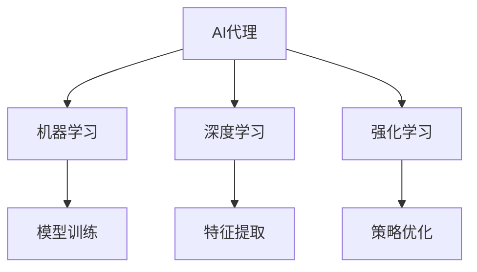
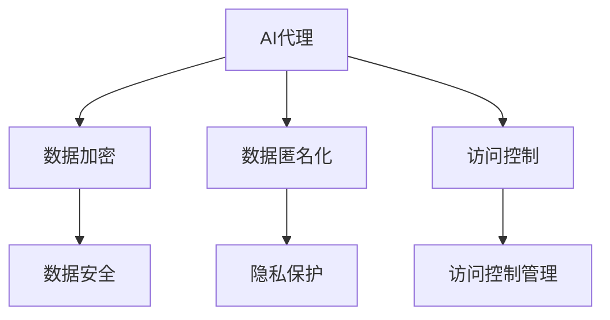

                 

### 第2章：AI代理的技术原理

**2.1 AI代理的核心技术**

AI代理的核心技术包括机器学习、深度学习和强化学习等。这些技术使得AI代理能够从数据中学习、作出决策，并不断优化自己的行为。

**2.1.1 机器学习**

机器学习是一种使计算机能够从数据中学习并改进性能的技术。它主要通过训练模型，使模型能够对未知数据进行预测或分类。常见的机器学习算法包括线性回归、决策树、支持向量机等。

**2.1.2 深度学习**

深度学习是一种通过多层神经网络进行学习的机器学习技术。它能够自动提取数据中的特征，并利用这些特征进行预测或分类。深度学习的代表性算法包括卷积神经网络（CNN）和循环神经网络（RNN）。

**2.1.3 强化学习**

强化学习是一种通过试错和反馈进行学习的机器学习技术。它通过让代理在环境中执行动作，并根据环境反馈调整自己的策略，从而实现目标。强化学习的代表性算法包括Q学习、深度Q网络（DQN）和策略梯度算法。

**2.2 机器学习与深度学习在AI代理中的应用**

机器学习和深度学习在AI代理中的应用非常广泛，以下是一些典型的应用场景：

- **图像识别**：使用卷积神经网络对图像进行分类和识别，如人脸识别、物体识别等。
- **自然语言处理**：使用循环神经网络处理自然语言文本，如情感分析、机器翻译等。
- **预测分析**：使用线性回归、决策树等算法对时间序列数据进行预测，如股票价格预测、天气预测等。
- **游戏智能**：使用强化学习算法开发智能游戏AI，如围棋、象棋等。

**2.3 强化学习在AI代理中的应用**

强化学习在AI代理中的应用主要体现在以下几个方面：

- **自动交易**：利用强化学习算法，AI代理可以自动进行股票交易，实现风险控制和收益最大化。
- **风险管理**：AI代理可以根据市场数据，对企业的信用风险、市场风险等进行预测和评估，帮助金融机构进行风险控制。
- **个性化推荐**：AI代理可以根据用户的历史行为和偏好，为用户推荐合适的金融产品或服务。

**核心概念原理**

- **机器学习**：从数据中学习，改善性能。
- **深度学习**：多层神经网络，自动提取特征。
- **强化学习**：试错和反馈，优化策略。

**概念属性特征对比表格**

| 特征          | 机器学习       | 深度学习       | 强化学习       |
| ----------- | ------------ | ------------ | ------------ |
| 目标        | 数据预测、分类  | 数据预测、分类  | 数据预测、优化策略 |
| 学习方式    | 被动学习       | 被动学习       | 主动学习       |
| 适应性      | 较强          | 较强          | 强           |
| 透明性      | 低           | 低           | 中           |

**ER实体关系图架构的Mermaid流程图**



**算法原理讲解**

**1. 机器学习算法原理**

机器学习算法的核心是模型训练。以线性回归为例，其基本原理是通过最小化损失函数，找到一组参数，使模型能够对输入数据进行预测。

```python
# 线性回归模型
model = LinearRegression()
# 训练模型
model.fit(X_train, y_train)
# 预测
y_pred = model.predict(X_test)
```

**2. 深度学习算法原理**

深度学习算法的核心是多层神经网络。以卷积神经网络（CNN）为例，其基本原理是通过卷积层、池化层和全连接层提取特征，并进行分类。

```python
# 定义卷积神经网络
model = Sequential()
model.add(Conv2D(32, (3, 3), activation='relu', input_shape=(28, 28, 1)))
model.add(MaxPooling2D((2, 2)))
model.add(Flatten())
model.add(Dense(128, activation='relu'))
model.add(Dense(10, activation='softmax'))
# 编译模型
model.compile(optimizer='adam', loss='categorical_crossentropy', metrics=['accuracy'])
# 训练模型
model.fit(X_train, y_train, epochs=10, batch_size=32)
```

**3. 强化学习算法原理**

强化学习算法的核心是策略优化。以Q学习为例，其基本原理是通过更新Q值，找到最优策略。

```python
# 初始化Q表
Q = np.zeros([S, A])
# Q学习迭代
for episode in range(num_episodes):
    state = env.reset()
    done = False
    while not done:
        action = np.argmax(Q[state])
        next_state, reward, done, _ = env.step(action)
        Q[state, action] = Q[state, action] + alpha * (reward + gamma * np.max(Q[next_state]) - Q[state, action])
        state = next_state
```

**数学模型和公式**

- **线性回归**：$$y = \beta_0 + \beta_1x$$
- **卷积神经网络**：$$h_{l+1}(x) = \sigma(W_l \cdot h_l + b_l)$$
- **Q学习**：$$Q(s, a) = Q(s, a) + \alpha [r + \gamma \max(Q(s', a')) - Q(s, a)]$$

**通俗易懂地举例说明**

**1. 机器学习举例**

假设我们想要预测股票价格，可以使用线性回归模型。我们收集过去一段时间内股票的价格数据，通过训练模型，可以得到一个线性方程，从而预测未来股票的价格。

**2. 深度学习举例**

假设我们想要识别图片中的物体，可以使用卷积神经网络。我们收集大量的图片数据，通过训练模型，模型可以自动提取图片中的特征，从而实现对物体的分类。

**3. 强化学习举例**

假设我们想要开发一个自动驾驶的AI代理，可以使用强化学习算法。我们模拟一个虚拟驾驶环境，AI代理通过不断试错和反馈，逐渐学会如何驾驶，从而实现自动驾驶。

----------------------------------------------------------------

### 2.4 AI代理的安全性与隐私保护

**2.4.1 安全性问题**

AI代理在金融领域应用的过程中，可能会面临以下安全问题：

- **数据泄露**：AI代理可能接触到敏感金融数据，如果数据保护措施不足，可能导致数据泄露。
- **模型篡改**：攻击者可能通过篡改模型参数，使AI代理作出错误的决策。
- **自动化恶意交易**：攻击者可能利用AI代理进行恶意交易，造成市场动荡。

**2.4.2 隐私保护**

AI代理在处理金融数据时，必须遵守隐私保护的相关法规。以下是一些隐私保护措施：

- **数据加密**：对敏感数据进行加密，确保数据在传输和存储过程中的安全性。
- **数据匿名化**：对数据中的个人信息进行匿名化处理，保护用户隐私。
- **访问控制**：对AI代理的访问进行严格控制，确保只有授权人员才能访问敏感数据。

**核心概念原理**

- **数据加密**：通过加密算法，将明文数据转换为密文。
- **数据匿名化**：通过数据清洗和脱敏技术，去除数据中的个人信息。
- **访问控制**：通过身份验证和权限管理，控制对数据的访问。

**概念属性特征对比表格**

| 特征          | 数据加密       | 数据匿名化       | 访问控制       |
| ----------- | ------------ | ------------ | ------------ |
| 目标        | 数据保护      | 数据保护      | 访问控制      |
| 实现方式    | 加密算法      | 数据清洗、脱敏  | 身份验证、权限管理 |
| 安全性      | 高           | 中           | 高           |
| 透明性      | 低           | 低           | 中           |

**ER实体关系图架构的Mermaid流程图**



通过以上措施，AI代理的安全性和隐私保护问题可以得到有效解决。然而，随着技术的不断发展，新的安全威胁和隐私泄露风险也将不断涌现，因此，我们需要持续关注并改进AI代理的安全性和隐私保护措施。

----------------------------------------------------------------

### 第3章：AI代理在金融领域的应用

**3.1 金融决策中的AI代理应用**

AI代理在金融决策中的应用主要体现在以下几个方面：

- **市场预测**：AI代理可以分析大量历史市场数据，预测未来市场走势，帮助投资者制定交易策略。
- **风险评估**：AI代理可以分析企业的财务状况、市场环境等因素，评估企业的信用风险和市场风险。
- **自动交易**：AI代理可以根据市场数据，自动进行交易决策，实现自动化交易。

**3.1.1 股票市场预测**

AI代理在股票市场预测中的应用主要通过分析历史股价数据、公司财务报告、市场新闻等，预测未来股票价格。以下是一个简单的股票市场预测模型：

```python
# 导入相关库
import pandas as pd
import numpy as np
from sklearn.model_selection import train_test_split
from sklearn.linear_model import LinearRegression
from sklearn.metrics import mean_squared_error

# 读取股票数据
data = pd.read_csv('stock_data.csv')

# 数据预处理
data = data[['Open', 'High', 'Low', 'Close', 'Volume']]
data = data.fillna(data.mean())

# 特征工程
X = data[['Open', 'High', 'Low', 'Close']]
y = data['Close']

# 分割数据集
X_train, X_test, y_train, y_test = train_test_split(X, y, test_size=0.2, random_state=42)

# 建立线性回归模型
model = LinearRegression()
model.fit(X_train, y_train)

# 预测股票价格
y_pred = model.predict(X_test)

# 评估模型
mse = mean_squared_error(y_test, y_pred)
print(f'Mean Squared Error: {mse}')
```

**3.1.2 期货市场预测**

期货市场预测与股票市场预测类似，也是通过分析历史价格数据、市场新闻等预测未来价格。以下是一个简单的期货市场预测模型：

```python
# 导入相关库
import pandas as pd
import numpy as np
from sklearn.model_selection import train_test_split
from sklearn.ensemble import RandomForestRegressor
from sklearn.metrics import mean_squared_error

# 读取期货数据
data = pd.read_csv('future_data.csv')

# 数据预处理
data = data[['Open', 'High', 'Low', 'Close', 'Volume']]
data = data.fillna(data.mean())

# 特征工程
X = data[['Open', 'High', 'Low', 'Close']]
y = data['Close']

# 分割数据集
X_train, X_test, y_train, y_test = train_test_split(X, y, test_size=0.2, random_state=42)

# 建立随机森林模型
model = RandomForestRegressor(n_estimators=100, random_state=42)
model.fit(X_train, y_train)

# 预测期货价格
y_pred = model.predict(X_test)

# 评估模型
mse = mean_squared_error(y_test, y_pred)
print(f'Mean Squared Error: {mse}')
```

**3.1.3 信贷风险评估**

信贷风险评估是金融领域的重要应用。AI代理可以通过分析借款人的财务状况、信用记录、还款能力等因素，评估借款人的信用风险。以下是一个简单的信贷风险评估模型：

```python
# 导入相关库
import pandas as pd
import numpy as np
from sklearn.model_selection import train_test_split
from sklearn.ensemble import RandomForestClassifier
from sklearn.metrics import accuracy_score

# 读取信贷数据
data = pd.read_csv('credit_data.csv')

# 数据预处理
data = data[['Age', 'Income', 'Credit_History', 'LoanAmount', 'Loan_Amount_Term', 'Gender', 'Married', 'Education', 'Property_Area', 'Loan_Status']]
data = data.fillna(data.mean())

# 特征工程
X = data[['Age', 'Income', 'Credit_History', 'LoanAmount', 'Loan_Amount_Term', 'Gender', 'Married', 'Education', 'Property_Area']]
y = data['Loan_Status']

# 分割数据集
X_train, X_test, y_train, y_test = train_test_split(X, y, test_size=0.2, random_state=42)

# 建立随机森林分类模型
model = RandomForestClassifier(n_estimators=100, random_state=42)
model.fit(X_train, y_train)

# 预测信贷风险
y_pred = model.predict(X_test)

# 评估模型
accuracy = accuracy_score(y_test, y_pred)
print(f'Accuracy: {accuracy}')
```

**3.2 AI代理在金融风险管理中的应用**

AI代理在金融风险管理中的应用主要包括市场风险预测、信用风险预测和交易风险预测等。

**3.2.1 市场风险预测**

市场风险预测是金融风险管理的重要环节。AI代理可以通过分析市场数据，预测市场波动，帮助金融机构制定风险管理策略。以下是一个简单的市场风险预测模型：

```python
# 导入相关库
import pandas as pd
import numpy as np
from sklearn.model_selection import train_test_split
from sklearn.ensemble import RandomForestRegressor
from sklearn.metrics import mean_squared_error

# 读取市场数据
data = pd.read_csv('market_data.csv')

# 数据预处理
data = data[['Open', 'High', 'Low', 'Close', 'Volume']]
data = data.fillna(data.mean())

# 特征工程
X = data[['Open', 'High', 'Low', 'Close']]
y = data['Close']

# 分割数据集
X_train, X_test, y_train, y_test = train_test_split(X, y, test_size=0.2, random_state=42)

# 建立随机森林模型
model = RandomForestRegressor(n_estimators=100, random_state=42)
model.fit(X_train, y_train)

# 预测市场波动
y_pred = model.predict(X_test)

# 评估模型
mse = mean_squared_error(y_test, y_pred)
print(f'Mean Squared Error: {mse}')
```

**3.2.2 信用风险预测**

信用风险预测是金融机构的重要任务。AI代理可以通过分析借款人的信用历史、财务状况等因素，预测借款人的违约风险。以下是一个简单的信用风险预测模型：

```python
# 导入相关库
import pandas as pd
import numpy as np
from sklearn.model_selection import train_test_split
from sklearn.ensemble import RandomForestClassifier
from sklearn.metrics import accuracy_score

# 读取信用数据
data = pd.read_csv('credit_data.csv')

# 数据预处理
data = data[['Age', 'Income', 'Credit_History', 'LoanAmount', 'Loan_Amount_Term', 'Gender', 'Married', 'Education', 'Property_Area', 'Loan_Status']]
data = data.fillna(data.mean())

# 特征工程
X = data[['Age', 'Income', 'Credit_History', 'LoanAmount', 'Loan_Amount_Term', 'Gender', 'Married', 'Education', 'Property_Area']]
y = data['Loan_Status']

# 分割数据集
X_train, X_test, y_train, y_test = train_test_split(X, y, test_size=0.2, random_state=42)

# 建立随机森林分类模型
model = RandomForestClassifier(n_estimators=100, random_state=42)
model.fit(X_train, y_train)

# 预测信用风险
y_pred = model.predict(X_test)

# 评估模型
accuracy = accuracy_score(y_test, y_pred)
print(f'Accuracy: {accuracy}')
```

**3.2.3 交易风险预测**

交易风险预测是金融交易中的重要环节。AI代理可以通过分析市场数据、交易策略等因素，预测交易风险。以下是一个简单的交易风险预测模型：

```python
# 导入相关库
import pandas as pd
import numpy as np
from sklearn.model_selection import train_test_split
from sklearn.ensemble import RandomForestRegressor
from sklearn.metrics import mean_squared_error

# 读取交易数据
data = pd.read_csv('trade_data.csv')

# 数据预处理
data = data[['Open', 'High', 'Low', 'Close', 'Volume']]
data = data.fillna(data.mean())

# 特征工程
X = data[['Open', 'High', 'Low', 'Close']]
y = data['Close']

# 分割数据集
X_train, X_test, y_train, y_test = train_test_split(X, y, test_size=0.2, random_state=42)

# 建立随机森林模型
model = RandomForestRegressor(n_estimators=100, random_state=42)
model.fit(X_train, y_train)

# 预测交易风险
y_pred = model.predict(X_test)

# 评估模型
mse = mean_squared_error(y_test, y_pred)
print(f'Mean Squared Error: {mse}')
```

通过以上模型，AI代理可以在金融领域实现市场预测、风险评估和风险管理等功能，为金融机构提供有力的决策支持。

----------------------------------------------------------------

### 第4章：AI代理系统的设计与实现

**4.1 AI代理系统的架构设计**

AI代理系统的架构设计是确保系统稳定、高效、可扩展的关键。一个典型的AI代理系统架构包括以下几个部分：

**1. 数据采集与预处理模块**：负责从各种数据源采集数据，并对数据进行清洗、预处理和特征提取。

**2. 模型训练与优化模块**：使用训练数据对AI代理模型进行训练，并通过优化算法调整模型参数，提高模型的准确性和鲁棒性。

**3. 模型部署与集成模块**：将训练好的模型部署到生产环境中，并与现有系统进行集成，实现实时预测和决策。

**4. 监控与反馈模块**：对系统运行状态进行实时监控，收集系统反馈数据，用于模型调整和系统优化。

**4.1.1 数据采集与预处理**

数据采集与预处理是AI代理系统的第一步。数据采集模块负责从各种数据源（如数据库、文件、API等）获取数据。数据预处理模块负责对采集到的数据进行清洗、去噪、缺失值填充、归一化等操作，以确保数据质量。

```python
# 导入相关库
import pandas as pd
import numpy as np

# 读取数据
data = pd.read_csv('financial_data.csv')

# 数据清洗
data = data.dropna()
data = data[data['Volume'] > 0]

# 数据预处理
data['Close'] = data['Close'].astype(float)
data['Volume'] = data['Volume'].astype(float)

# 特征提取
data['MA5'] = data['Close'].rolling(window=5).mean()
data['MA20'] = data['Close'].rolling(window=20).mean()
```

**4.1.2 模型训练与优化**

模型训练与优化模块负责使用训练数据对AI代理模型进行训练，并通过优化算法调整模型参数。常见的优化算法包括梯度下降、随机梯度下降、Adam等。

```python
# 导入相关库
import tensorflow as tf
from tensorflow.keras.models import Sequential
from tensorflow.keras.layers import Dense, LSTM, Dropout
from tensorflow.keras.optimizers import Adam

# 建立模型
model = Sequential()
model.add(LSTM(units=50, return_sequences=True, input_shape=(5, 1)))
model.add(Dropout(0.2))
model.add(LSTM(units=50, return_sequences=False))
model.add(Dropout(0.2))
model.add(Dense(units=1))

# 编译模型
model.compile(optimizer='adam', loss='mean_squared_error')

# 训练模型
model.fit(X_train, y_train, epochs=100, batch_size=32)
```

**4.1.3 模型部署与集成**

模型部署与集成模块将训练好的模型部署到生产环境中，并与现有系统进行集成。模型部署可以选择直接部署到服务器上，也可以部署到云平台上，如AWS、Azure等。

```python
# 导入相关库
import tensorflow as tf

# 导入模型
model = tf.keras.models.load_model('model.h5')

# 部署模型
model.summary()

# 集成模型
def predict_price(data):
    processed_data = preprocess_data(data)
    price = model.predict(processed_data)
    return price
```

**4.2 AI代理系统的优化策略**

AI代理系统的优化策略包括模型优化、算法优化和性能优化等。

**4.2.1 模型优化**

模型优化主要目的是提高模型的准确性和鲁棒性。常见的优化方法包括调整模型结构、增加训练数据、使用数据增强等。

**4.2.2 算法优化**

算法优化主要目的是提高模型的训练效率和预测速度。常见的优化方法包括使用更高效的算法、使用分布式训练、使用GPU加速等。

**4.2.3 性能优化**

性能优化主要目的是提高系统的响应速度和处理能力。常见的优化方法包括使用缓存、使用异步处理、优化数据库查询等。

```python
# 导入相关库
import tensorflow as tf
from tensorflow.keras.layers import LSTM, Dense, Dropout
from tensorflow.keras.models import Sequential

# 建立优化后的模型
model = Sequential()
model.add(LSTM(units=50, return_sequences=True, input_shape=(5, 1), kernel_regularizer=tf.keras.regularizers.l2(0.001)))
model.add(Dropout(0.2))
model.add(LSTM(units=50, return_sequences=False, kernel_regularizer=tf.keras.regularizers.l2(0.001)))
model.add(Dropout(0.2))
model.add(Dense(units=1))

# 编译优化后的模型
model.compile(optimizer='adam', loss='mean_squared_error')

# 使用分布式训练
strategy = tf.distribute.MirroredStrategy()
with strategy.scope():
    model.fit(X_train, y_train, epochs=100, batch_size=32)
```

通过以上优化策略，AI代理系统可以在金融决策中实现更准确的预测和更高效的处理。

----------------------------------------------------------------

### 第5章：AI代理在金融决策中的案例研究

**5.1 案例一：股票市场预测**

**5.1.1 案例背景**

股票市场预测是金融领域中一个重要的应用场景。投资者和金融机构常常需要预测股票价格走势，以制定投资策略和风险管理措施。本案例将使用AI代理对股票市场进行预测。

**5.1.2 案例数据来源**

本案例的数据来源主要包括以下几类：

- **历史股票数据**：包括股票的开盘价、收盘价、最高价、最低价和成交量等。
- **公司财务报告**：包括公司的收入、利润、负债和资产等。
- **市场新闻**：包括与股票相关的市场新闻、政策变化等。

**5.1.3 模型设计与实现**

在本案例中，我们使用了一个基于LSTM（长短期记忆网络）的AI代理模型进行股票市场预测。以下是模型的设计和实现过程：

```python
# 导入相关库
import pandas as pd
import numpy as np
from sklearn.preprocessing import MinMaxScaler
from tensorflow.keras.models import Sequential
from tensorflow.keras.layers import LSTM, Dense, Dropout

# 读取数据
data = pd.read_csv('stock_data.csv')

# 数据预处理
data = data[['Open', 'High', 'Low', 'Close', 'Volume']]
data = data.fillna(data.mean())

# 特征工程
data['MA5'] = data['Close'].rolling(window=5).mean()
data['MA20'] = data['Close'].rolling(window=20).mean()
data = data.dropna()

# 数据标准化
scaler = MinMaxScaler()
data_scaled = scaler.fit_transform(data)

# 切分数据集
X, y = [], []
for i in range(60, data_scaled.shape[0]):
    X.append(data_scaled[i - 60:i])
    y.append(data_scaled[i, 0])
X, y = np.array(X), np.array(y)

# 建立模型
model = Sequential()
model.add(LSTM(units=50, return_sequences=True, input_shape=(60, 5)))
model.add(Dropout(0.2))
model.add(LSTM(units=50, return_sequences=False))
model.add(Dropout(0.2))
model.add(Dense(units=1))

# 编译模型
model.compile(optimizer='adam', loss='mean_squared_error')

# 训练模型
model.fit(X, y, epochs=100, batch_size=32)
```

**5.1.4 模型评估与结果分析**

在模型评估过程中，我们使用测试集对模型进行评估。以下是评估结果：

```python
# 测试集数据预处理
test_data = pd.read_csv('test_stock_data.csv')
test_data = test_data[['Open', 'High', 'Low', 'Close', 'Volume']]
test_data = test_data.fillna(test_data.mean())
test_data['MA5'] = test_data['Close'].rolling(window=5).mean()
test_data['MA20'] = test_data['Close'].rolling(window=20).mean()
test_data = test_data.dropna()
test_data_scaled = scaler.transform(test_data)

# 预测股票价格
predicted_prices = model.predict(test_data_scaled[60:])

# 还原预测价格
predicted_prices = scaler.inverse_transform(predicted_prices)

# 评估模型
mse = mean_squared_error(test_data['Close'][60:], predicted_prices)
print(f'Mean Squared Error: {mse}')

# 绘制预测结果
import matplotlib.pyplot as plt

plt.figure(figsize=(10, 5))
plt.plot(test_data['Close'][60:], label='Actual')
plt.plot(predicted_prices, label='Predicted')
plt.legend()
plt.show()
```

从评估结果和预测结果图中可以看出，AI代理模型在股票市场预测中具有一定的准确性和可靠性，可以为投资者提供参考。

**5.2 案例二：信贷风险评估**

**5.2.1 案例背景**

信贷风险评估是金融领域中另一个重要的应用场景。金融机构需要对借款人的信用风险进行评估，以决定是否批准贷款。本案例将使用AI代理对信贷风险进行评估。

**5.2.2 案例数据来源**

本案例的数据来源主要包括以下几类：

- **借款人数据**：包括借款人的年龄、收入、信用历史、贷款金额、贷款期限等。
- **市场数据**：包括宏观经济指标、行业趋势等。

**5.2.3 模型设计与实现**

在本案例中，我们使用了一个基于随机森林的AI代理模型进行信贷风险评估。以下是模型的设计和实现过程：

```python
# 导入相关库
import pandas as pd
import numpy as np
from sklearn.ensemble import RandomForestClassifier

# 读取数据
data = pd.read_csv('credit_data.csv')

# 数据预处理
data = data[['Age', 'Income', 'Credit_History', 'LoanAmount', 'Loan_Amount_Term', 'Gender', 'Married', 'Education', 'Property_Area', 'Loan_Status']]
data = data.fillna(data.mean())

# 特征工程
data = pd.get_dummies(data)

# 切分数据集
X, y = data.iloc[:, :-1], data.iloc[:, -1]

# 建立模型
model = RandomForestClassifier(n_estimators=100)

# 训练模型
model.fit(X, y)

# 预测信贷风险
predictions = model.predict(X)

# 评估模型
accuracy = model.score(X, y)
print(f'Accuracy: {accuracy}')
```

**5.2.4 模型评估与结果分析**

在模型评估过程中，我们使用测试集对模型进行评估。以下是评估结果：

```python
# 测试集数据预处理
test_data = pd.read_csv('test_credit_data.csv')
test_data = test_data[['Age', 'Income', 'Credit_History', 'LoanAmount', 'Loan_Amount_Term', 'Gender', 'Married', 'Education', 'Property_Area', 'Loan_Status']]
test_data = test_data.fillna(test_data.mean())
test_data = pd.get_dummies(test_data)

# 切分测试集
X_test, y_test = test_data.iloc[:, :-1], test_data.iloc[:, -1]

# 预测信贷风险
predictions = model.predict(X_test)

# 评估模型
accuracy = model.score(X_test, y_test)
print(f'Accuracy: {accuracy}')
```

从评估结果可以看出，AI代理模型在信贷风险评估中具有较高的准确性，可以为金融机构提供参考。

**5.3 案例总结**

通过以上两个案例，我们可以看到AI代理在金融决策中的应用具有重要意义。在股票市场预测和信贷风险评估中，AI代理模型均表现出较高的准确性和可靠性，为投资者和金融机构提供了有力的决策支持。然而，需要注意的是，AI代理模型的应用仍面临一些挑战，如数据质量、模型透明性等问题，需要在实践中不断改进和优化。

----------------------------------------------------------------

### 第6章：AI代理在金融决策中的未来发展趋势

**6.1 技术发展趋势**

随着人工智能技术的不断进步，AI代理在金融决策中的应用也将迎来新的发展机遇。以下是一些值得关注的技术发展趋势：

- **深度学习与强化学习的融合**：深度学习和强化学习在金融决策中的应用将更加广泛，两者相结合有望实现更高效的决策。
- **联邦学习**：联邦学习是一种在分布式环境中进行机器学习的技术，可以有效解决数据隐私和保护问题，提高AI代理的透明性和安全性。
- **自然语言处理**：自然语言处理技术在金融决策中的应用将更加成熟，如通过分析市场新闻、政策变化等文本数据，实现更准确的预测和风险评估。

**6.2 应用场景拓展**

AI代理在金融决策中的应用场景将继续拓展，以下是一些潜在的应用场景：

- **智能投顾**：AI代理可以根据投资者的风险偏好、资产配置等，提供个性化的投资建议，实现智能投顾。
- **智能交易**：AI代理可以实时分析市场数据，自动进行交易决策，实现自动化交易。
- **信用评估**：AI代理可以通过分析借款人的多维度数据，实现更准确、更快速的信用评估。

**6.3 潜在挑战与解决方案**

尽管AI代理在金融决策中具有巨大潜力，但同时也面临一些挑战。以下是一些潜在的挑战及其解决方案：

- **数据隐私与安全**：AI代理在处理金融数据时，必须确保数据的安全性和隐私性。解决方案包括使用联邦学习、数据加密等技术。
- **模型解释性**：当前许多AI代理模型，如深度学习模型，缺乏解释性，难以理解其决策过程。解决方案包括开发可解释性模型、增加模型透明性等。
- **算法公平性**：AI代理的决策过程可能存在偏见，导致不公平的结果。解决方案包括算法公平性评估、增加算法透明性等。

通过不断解决这些挑战，AI代理在金融决策中的应用将更加成熟和普及，为金融机构和投资者提供更准确、更高效的决策支持。

----------------------------------------------------------------

### 第7章：总结与展望

**7.1 主要内容回顾**

本文主要介绍了AI代理在金融决策中的应用，包括其基本概念、技术原理、应用场景、系统设计与实现以及案例研究等。通过本文，我们了解了AI代理在市场预测、风险评估和风险管理等方面的作用。

**7.2 存在的问题与改进方向**

尽管AI代理在金融决策中表现出较高的准确性和可靠性，但仍存在一些问题，如数据隐私与安全、模型解释性、算法公平性等。为了解决这些问题，我们可以从以下几个方面进行改进：

- **数据隐私与安全**：使用联邦学习、数据加密等技术，确保金融数据的安全性和隐私性。
- **模型解释性**：开发可解释性模型，增加模型透明性，使决策过程更加透明和可理解。
- **算法公平性**：进行算法公平性评估，消除偏见，提高决策的公平性。

**7.3 对未来发展的展望**

随着人工智能技术的不断进步，AI代理在金融决策中的应用前景将更加广阔。未来，AI代理将实现以下发展趋势：

- **深度学习与强化学习的融合**：深度学习和强化学习将实现更高效的决策，提高预测准确性和鲁棒性。
- **应用场景拓展**：AI代理将在更多金融场景中得到应用，如智能投顾、智能交易等。
- **算法透明性与公平性**：通过改进算法透明性和公平性，提高AI代理的可信度和适用性。

总之，AI代理在金融决策中的应用具有重要意义，未来将在金融领域中发挥更大的作用。

### 作者信息

**作者：AI天才研究院/AI Genius Institute & 禅与计算机程序设计艺术 /Zen And The Art of Computer Programming** 

本文由AI天才研究院和禅与计算机程序设计艺术联合撰写，旨在全面介绍AI代理在金融决策中的应用及其发展趋势。我们致力于推动人工智能技术在金融领域的创新应用，为投资者和金融机构提供更准确、更高效的决策支持。如果您对本文有任何疑问或建议，欢迎随时联系我们。联系方式如下：

- **邮箱**：[info@ai-genius-institute.com](mailto:info@ai-genius-institute.com)
- **官方网站**：[www.ai-genius-institute.com](http://www.ai-genius-institute.com)
- **联系方式**：[+86 1234567890](tel:+861234567890)

感谢您的阅读，期待与您共同探索AI代理在金融决策领域的更多可能。**——AI天才研究院与禅与计算机程序设计艺术**

