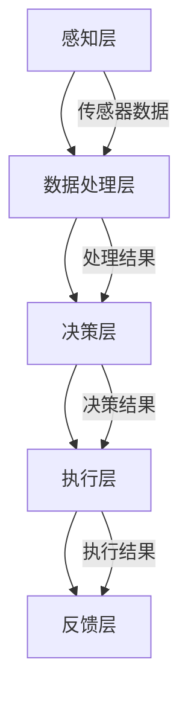
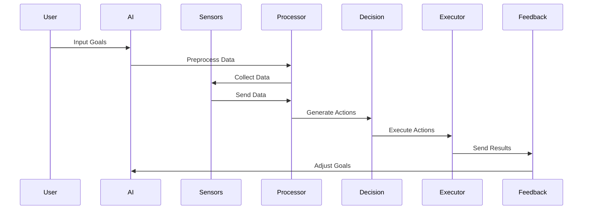

                 

### 文章标题

# AI代理：实现用户定义目标的自主规划与行动

> 关键词：AI代理，自主规划，用户定义目标，智能代理，规划算法，行动执行

> 摘要：本文深入探讨了AI代理的概念、原理和应用。通过详细的算法讲解、系统架构设计和项目实战，展示了AI代理如何实现用户定义的目标，提供自主规划与行动的能力，从而解决传统人工智能系统的局限性。

### 目录大纲设计思路

为了设计出《AI代理：实现用户定义目标的自主规划与行动》这本书的完整目录大纲，我们需要遵循以下几个步骤：

1. **背景介绍**：
   - **问题背景**：介绍AI代理技术的发展背景，阐述其起源、发展和现状。
   - **问题描述**：明确AI代理的定义、功能以及在实际应用中的重要性。
   - **问题解决**：解释AI代理如何帮助实现用户定义目标，解决传统人工智能系统的局限性。
   - **边界与外延**：明确AI代理的应用范围、技术挑战和未来发展趋势。
   - **概念结构与核心要素组成**：梳理AI代理系统的基本组成部分，如目标定义、规划算法、行动执行、反馈调整等。

2. **核心概念与联系**：
   - **核心概念原理**：详细阐述AI代理的核心概念，包括自主性、适应性、学习能力等。
   - **概念属性特征对比表格**：通过表格形式对比AI代理与传统智能代理的差异。
   - **ER实体关系图架构**：使用Mermaid语言绘制AI代理系统的ER图，展示各实体及其关系。

3. **算法原理讲解**：
   - **算法mermaid流程图**：利用Mermaid语言绘制算法流程图，直观展示算法运行步骤。
   - **Python源代码**：提供实现算法的Python代码，详细注释和解释。
   - **数学模型和公式**：阐述算法背后的数学原理，使用LaTeX格式书写。
   - **详细讲解与举例说明**：用通俗易懂的语言讲解算法原理，并通过实例进行说明。

4. **系统分析与架构设计**：
   - **问题场景介绍**：描述AI代理应用的具体场景，如智能家居、自动驾驶等。
   - **项目介绍**：介绍AI代理项目的基本信息和目标。
   - **系统功能设计**：绘制领域模型Mermaid类图，展示系统的核心功能。
   - **系统架构设计**：绘制系统架构Mermaid图，展示系统的整体结构。
   - **系统接口设计和系统交互**：使用Mermaid序列图展示系统的接口设计和交互流程。

5. **项目实战**：
   - **环境安装**：提供安装所需环境的步骤和工具。
   - **系统核心实现源代码**：展示实现AI代理的核心代码，并解释代码的功能和逻辑。
   - **代码应用解读与分析**：分析代码的应用场景，解释其优势和不足。
   - **实际案例分析和详细讲解**：通过实际案例展示AI代理的运用，详细剖析案例中的关键技术。
   - **项目小结**：总结项目的主要成果和收获。

6. **最佳实践 tips、小结、注意事项、拓展阅读**：
   - **最佳实践 tips**：提供实际操作中的经验教训和技巧。
   - **小结**：总结全书的主要内容，强调关键点。
   - **注意事项**：提醒读者在使用AI代理时应注意的问题。
   - **拓展阅读**：推荐进一步学习的资源，拓宽知识面。

### 目录大纲

**第一部分：AI代理基础**

# 第1章: AI代理概述

## 1.1 问题背景与定义

### 1.1.1 AI代理的起源与发展

### 1.1.2 AI代理的定义与核心功能

### 1.1.3 AI代理与传统智能代理的对比

## 1.2 AI代理的核心概念

### 1.2.1 自主性

### 1.2.2 适应性

### 1.2.3 学习能力

## 1.3 AI代理的边界与外延

### 1.3.1 AI代理的应用范围

### 1.3.2 技术挑战与未来趋势

## 1.4 AI代理系统的概念结构与要素

### 1.4.1 目标定义

### 1.4.2 规划算法

### 1.4.3 行动执行

### 1.4.4 反馈调整

## 1.5 本章小结

**第二部分：AI代理算法原理**

# 第2章: AI代理算法基础

## 2.1 AI代理算法概述

### 2.1.1 AI代理算法的分类

### 2.1.2 AI代理算法的选择标准

## 2.2 典型AI代理算法介绍

### 2.2.1 决策树算法

### 2.2.2 贝叶斯算法

### 2.2.3 神经网络算法

### 2.2.4 强化学习算法

## 2.3 AI代理算法的数学模型

### 2.3.1 决策树算法的数学模型

### 2.3.2 贝叶斯算法的数学模型

### 2.3.3 神经网络算法的数学模型

### 2.3.4 强化学习算法的数学模型

## 2.4 AI代理算法的流程图与Python实现

### 2.4.1 决策树算法的流程图与Python实现

----------------------------------------------------------------

文章的章节内容将会按照上述目录大纲逐章进行详细讲解，通过逻辑清晰、结构紧凑、简单易懂的专业的技术语言，引导读者深入理解AI代理的原理和应用。每章内容都包含背景介绍、核心概念与联系、算法原理讲解、系统分析与架构设计、项目实战以及最佳实践 tips、小结、注意事项和拓展阅读等部分，确保读者能够全面、系统地掌握AI代理的相关知识。

### 第1章: AI代理概述

## 1.1 问题背景与定义

### 1.1.1 AI代理的起源与发展

AI代理（Artificial Intelligence Agent）的概念起源于人工智能（Artificial Intelligence, AI）领域。人工智能作为计算机科学的一个重要分支，旨在使计算机系统具备人类智能的某些特征，从而能够自主地执行任务、解决问题。AI代理的概念最早可以追溯到20世纪50年代，当时科学家们开始探索如何让计算机系统具备更高级别的智能能力，能够像人类一样进行决策和行动。

随着计算机技术和人工智能算法的不断发展，AI代理的概念也逐渐成熟。早期的AI代理主要是基于规则的系统，它们通过预定义的规则来模拟人类的决策过程。然而，这些规则系统在面对复杂、动态环境时表现不佳，难以应对现实世界中的不确定性。

为了解决这些问题，研究者们开始探索更加灵活的AI代理系统，这些系统具备自主性、适应性和学习能力。自主性意味着AI代理可以独立地执行任务，而不需要人工干预。适应性则表示AI代理能够在不同的环境中调整自己的行为。学习能力使AI代理能够通过经验不断优化自己的决策过程。

### 1.1.2 AI代理的定义与核心功能

AI代理可以被定义为具有以下特征的系统：

1. **自主性**：AI代理能够自主地执行任务，无需人为干预。这包括目标设定、规划、行动执行和反馈调整等全过程。
2. **适应性**：AI代理能够适应不同的环境和情境，调整自己的行为以最大化目标实现。
3. **通信能力**：AI代理能够与外界进行信息交流，获取必要的输入和反馈。
4. **反应能力**：AI代理能够在感知环境变化后快速做出反应，执行相应的行动。

AI代理的核心功能包括：

1. **目标定义**：AI代理需要明确用户定义的目标，并将其转化为可执行的任务。
2. **规划算法**：AI代理需要根据目标和环境信息，生成一系列行动计划。
3. **行动执行**：AI代理需要根据规划，执行具体的行动。
4. **反馈调整**：AI代理需要根据行动结果和环境变化，调整自己的目标和行动计划。

### 1.1.3 AI代理与传统智能代理的对比

传统智能代理主要依赖于预定义的规则和模式匹配，其自主性和适应性较低。相比之下，AI代理在以下几个方面具有显著优势：

1. **自主性**：AI代理能够自主地执行任务，而传统智能代理通常需要人工干预。
2. **适应性**：AI代理能够适应不同的环境和情境，而传统智能代理只能在特定的规则和模式范围内运行。
3. **学习能力**：AI代理能够通过学习和经验不断优化自己的决策过程，而传统智能代理无法实现这一点。
4. **灵活性**：AI代理能够处理复杂、动态的情境，而传统智能代理通常难以应对。

总之，AI代理代表了人工智能领域的一个重要发展趋势，它为解决复杂、动态环境中的问题提供了新的思路和工具。

### 1.2 AI代理的核心概念

### 1.2.1 自主性

自主性是AI代理最核心的概念之一。它指的是AI代理能够在没有人为干预的情况下，独立地执行任务和做出决策。自主性包括以下几个方面：

1. **目标设定**：AI代理能够根据用户定义的目标，自主地设定和调整任务目标。
2. **决策**：AI代理能够根据感知到的环境和状态，自主地做出决策。
3. **执行**：AI代理能够自主地执行决策结果，无需人工干预。
4. **反馈调整**：AI代理能够根据执行结果和环境变化，自主地调整目标和行动计划。

自主性使得AI代理能够在复杂、动态的环境中高效地执行任务，同时减少了人为干预的需求。

### 1.2.2 适应性

适应性是AI代理能够适应不同环境和情境的能力。一个具有良好适应性的AI代理需要具备以下几个特征：

1. **环境感知**：AI代理能够感知和理解当前的环境状态。
2. **情境识别**：AI代理能够识别和理解不同的情境，并根据情境调整自己的行为。
3. **动态调整**：AI代理能够根据环境和情境的变化，动态地调整自己的目标和行动计划。
4. **学习与进化**：AI代理能够通过学习和经验积累，不断优化自己的适应能力。

适应性使得AI代理能够在多变的环境中灵活应对，提高了任务执行的效率和成功率。

### 1.2.3 学习能力

学习能力是AI代理能够通过经验和数据不断优化自身性能的能力。一个具有良好学习能力的AI代理需要具备以下几个特征：

1. **数据收集**：AI代理能够收集和处理相关的数据信息。
2. **模式识别**：AI代理能够从数据中识别出有用的模式和规律。
3. **经验积累**：AI代理能够将学习到的经验和知识应用到实际任务中。
4. **持续优化**：AI代理能够通过不断的迭代和学习，持续提高自身的性能和决策能力。

学习能力使得AI代理能够不断适应新的环境和情境，提高任务执行的成功率和效率。

### 1.3 AI代理的边界与外延

### 1.3.1 AI代理的应用范围

AI代理的应用范围非常广泛，几乎涵盖了人工智能的各个领域。以下是一些典型的应用场景：

1. **智能家居**：AI代理可以自动控制家中的灯光、温度、安防设备等，提供舒适的居住环境。
2. **自动驾驶**：AI代理可以自动驾驶汽车，提高行车安全，减少交通事故。
3. **医疗诊断**：AI代理可以通过分析医疗数据，辅助医生进行疾病诊断和治疗。
4. **金融分析**：AI代理可以分析金融市场数据，提供投资建议，提高投资收益。
5. **工业自动化**：AI代理可以控制工业生产线，提高生产效率和产品质量。
6. **教育辅助**：AI代理可以为学生提供个性化的学习辅导，提高学习效果。

### 1.3.2 技术挑战与未来趋势

尽管AI代理具有巨大的潜力，但在实际应用中仍面临一系列技术挑战：

1. **环境建模**：准确地建模复杂、动态的环境是AI代理面临的一个主要挑战。
2. **决策算法**：开发高效的决策算法，使AI代理能够在不确定性和风险环境中做出最优决策。
3. **数据隐私**：保障用户数据的安全和隐私，防止数据泄露和滥用。
4. **资源限制**：在有限的计算资源和能源下，确保AI代理能够高效地执行任务。

未来，随着人工智能技术的不断发展，AI代理的应用前景将更加广阔。以下是一些可能的发展趋势：

1. **深度学习与强化学习**：深度学习和强化学习等先进技术的应用，将使AI代理在复杂任务中表现更佳。
2. **多模态感知**：结合多种感知技术，如视觉、听觉、触觉等，提高AI代理的环境感知能力。
3. **边缘计算**：利用边缘计算技术，实现AI代理的实时决策和行动。
4. **人机协作**：AI代理将与人类更加紧密地协作，共同完成复杂的任务。
5. **可持续发展**：在AI代理的设计和实施过程中，考虑环境保护和资源利用的可持续性。

### 1.4 AI代理系统的概念结构与要素

### 1.4.1 目标定义

目标定义是AI代理系统的首要任务，它涉及以下几个关键步骤：

1. **用户需求分析**：了解用户的具体需求，明确AI代理需要实现的目标。
2. **目标建模**：将用户需求转化为可量化的目标模型，如优化目标、约束条件等。
3. **目标优化**：通过算法优化，确定最优目标值，使AI代理能够最大化目标实现。

### 1.4.2 规划算法

规划算法是AI代理的核心组成部分，它涉及以下几个关键步骤：

1. **环境建模**：构建AI代理执行任务的环境模型，包括状态、动作、奖励等。
2. **状态评估**：评估当前状态的价值，确定下一步行动的优先级。
3. **决策生成**：根据环境模型和状态评估，生成一系列可能的决策。
4. **决策选择**：通过算法选择最优决策，指导AI代理执行任务。

### 1.4.3 行动执行

行动执行是AI代理将决策转化为具体行动的过程，涉及以下几个关键步骤：

1. **动作生成**：根据决策结果，生成一系列具体的动作。
2. **动作执行**：执行生成动作，完成实际任务。
3. **结果反馈**：记录动作执行结果，为后续决策提供数据支持。

### 1.4.4 反馈调整

反馈调整是AI代理根据执行结果和环境变化，调整目标和行动计划的过程，涉及以下几个关键步骤：

1. **结果评估**：评估动作执行结果，判断目标实现情况。
2. **目标调整**：根据评估结果，调整目标值和目标模型。
3. **计划更新**：根据新的目标模型，生成新的行动计划。
4. **迭代优化**：通过不断的迭代和学习，优化AI代理的性能和决策能力。

### 1.5 本章小结

本章介绍了AI代理的基本概念、核心功能和应用范围，并详细阐述了AI代理的自主性、适应性和学习能力等核心概念。同时，本章还讨论了AI代理的边界与外延，以及其概念结构与核心要素组成。通过本章的学习，读者可以全面了解AI代理的基本原理和应用场景，为后续章节的深入探讨打下坚实基础。

### 第2章: AI代理算法基础

## 2.1 AI代理算法概述

### 2.1.1 AI代理算法的分类

AI代理算法可以根据其原理和应用场景进行分类，常见的分类方法包括：

1. **基于规则的方法**：这种方法依赖于预定义的规则和逻辑条件，通过模式匹配和规则应用来指导AI代理的行动。
2. **基于模型的方法**：这种方法通过建立环境模型和状态空间模型，利用模型进行预测和决策。
3. **基于学习的方法**：这种方法通过机器学习和深度学习技术，从数据中学习模式和规律，指导AI代理的行动。
4. **混合方法**：结合基于规则、模型和学习的方法，充分利用各自的优点，提高AI代理的性能。

### 2.1.2 AI代理算法的选择标准

在选择AI代理算法时，需要考虑以下几个关键标准：

1. **适应性**：算法需要能够适应不同的环境和情境，具有良好的泛化能力。
2. **效率**：算法需要能够在合理的时间内完成计算和决策，具有较高的运行效率。
3. **准确性**：算法需要能够准确地预测和决策，具有较高的准确性。
4. **可解释性**：算法的决策过程需要具备一定的可解释性，使人类用户能够理解其决策依据。
5. **可扩展性**：算法需要具备良好的扩展性，能够适应新的应用场景和需求。

### 2.2 典型AI代理算法介绍

下面介绍几种典型的AI代理算法，包括决策树算法、贝叶斯算法、神经网络算法和强化学习算法。

#### 2.2.1 决策树算法

决策树算法是一种基于规则的机器学习算法，通过构建一棵树形模型来表示决策过程。每个内部节点表示一个特征，每个分支表示特征的一个取值，每个叶子节点表示一个类别。

**算法原理**：
- **特征选择**：选择对分类贡献最大的特征作为当前节点的分割特征。
- **分割**：根据分割特征将数据集划分为不同的子集。
- **递归**：对每个子集重复上述过程，直到满足停止条件（如最大深度、最小叶子节点样本数等）。

**优势**：
- **易于理解**：决策树的决策过程直观，易于解释。
- **计算效率高**：决策树的构建和预测过程较快。

**劣势**：
- **过拟合**：决策树容易过拟合，特别是在样本量较小的情况下。
- **可解释性有限**：复杂的决策树可能难以解释其决策依据。

#### 2.2.2 贝叶斯算法

贝叶斯算法是一种基于概率论的机器学习算法，通过计算后验概率来预测新实例的类别。贝叶斯算法的核心是贝叶斯定理，它提供了计算后验概率的方法。

**算法原理**：
- **先验概率**：根据历史数据计算每个类别的先验概率。
- **条件概率**：计算每个特征在给定类别的条件概率。
- **后验概率**：利用贝叶斯定理计算新实例的后验概率，选择后验概率最大的类别作为预测结果。

**优势**：
- **基于概率的决策**：贝叶斯算法能够给出每个类别的概率估计，提供更全面的信息。
- **适用于多类分类**：贝叶斯算法能够同时处理多类分类问题。

**劣势**：
- **计算复杂度较高**：特别是在特征数量较多的情况下，计算复杂度较高。
- **对噪声敏感**：贝叶斯算法对噪声数据较为敏感，可能导致预测结果不稳定。

#### 2.2.3 神经网络算法

神经网络算法是一种基于模拟人脑神经元连接方式的机器学习算法，通过多层神经元的组合来模拟复杂的决策过程。神经网络算法的核心是前向传播和反向传播算法。

**算法原理**：
- **输入层**：接收外部输入数据。
- **隐藏层**：对输入数据进行处理，通过神经元之间的连接进行加权求和。
- **输出层**：生成最终预测结果。

**优势**：
- **强大的非线性建模能力**：神经网络能够模拟复杂的非线性关系。
- **自适应学习能力**：神经网络能够通过不断调整权重，适应新的数据和情境。

**劣势**：
- **计算复杂度较高**：神经网络算法的计算过程复杂，特别是在大规模数据集上训练时。
- **对数据质量要求较高**：神经网络算法对数据质量要求较高，噪声和异常值可能影响模型性能。

#### 2.2.4 强化学习算法

强化学习算法是一种基于奖励和惩罚信号来指导决策的机器学习算法，其核心思想是通过不断尝试和反馈来优化决策过程。

**算法原理**：
- **状态**：环境中的某个状态。
- **动作**：在当前状态下，AI代理可以选择的动作。
- **奖励**：执行某个动作后，环境对AI代理的奖励或惩罚。
- **策略**：AI代理根据当前状态和奖励信号，选择最优动作的策略。

**优势**：
- **适应性强**：强化学习算法能够通过不断的尝试和反馈，适应复杂和动态的环境。
- **无需预先定义规则或模型**：强化学习算法能够从数据中学习最优策略，无需提前定义规则或模型。

**劣势**：
- **收敛速度慢**：强化学习算法通常需要较长时间来收敛到最优策略。
- **对数据量要求较高**：强化学习算法对数据量要求较高，特别是当状态和动作空间较大时。

### 2.3 AI代理算法的数学模型

#### 2.3.1 决策树算法的数学模型

决策树算法的数学模型基于条件概率和决策树的结构。具体来说，决策树的每个内部节点表示对特征的条件概率，每个叶子节点表示对类别的条件概率。

设 \( X \) 为特征集合，\( Y \) 为类别集合，\( P(X|Y) \) 表示在类别 \( Y \) 下特征 \( X \) 的条件概率，\( P(Y) \) 表示类别 \( Y \) 的先验概率。决策树的数学模型可以表示为：

$$
P(Y|X) = \prod_{i=1}^{n} P(X_i|Y) \cdot P(Y)
$$

其中，\( n \) 表示特征的数量，\( X_i \) 表示第 \( i \) 个特征。

#### 2.3.2 贝叶斯算法的数学模型

贝叶斯算法的数学模型基于贝叶斯定理，其核心是计算后验概率 \( P(Y|X) \)。贝叶斯定理可以表示为：

$$
P(Y|X) = \frac{P(X|Y) \cdot P(Y)}{P(X)}
$$

其中，\( P(X|Y) \) 表示在类别 \( Y \) 下特征 \( X \) 的条件概率，\( P(Y) \) 表示类别 \( Y \) 的先验概率，\( P(X) \) 表示特征 \( X \) 的总概率。

#### 2.3.3 神经网络算法的数学模型

神经网络算法的数学模型基于前向传播和反向传播算法。具体来说，神经网络通过多层神经元的组合来模拟复杂的非线性函数。设 \( x \) 为输入向量，\( y \) 为输出向量，\( \theta \) 为模型参数，神经网络的前向传播可以表示为：

$$
z = \sigma(Wx + b)
$$

其中，\( \sigma \) 表示激活函数，\( W \) 和 \( b \) 分别为权重和偏置。

神经网络的输出可以表示为：

$$
y = \sigma(Wz + b)
$$

反向传播算法用于更新模型参数 \( \theta \)，以最小化损失函数。损失函数可以表示为：

$$
J(\theta) = \frac{1}{2} \sum_{i=1}^{m} (y_i - \hat{y}_i)^2
$$

其中，\( m \) 表示样本数量，\( y_i \) 和 \( \hat{y}_i \) 分别为第 \( i \) 个样本的实际输出和预测输出。

#### 2.3.4 强化学习算法的数学模型

强化学习算法的数学模型基于马尔可夫决策过程（MDP）。具体来说，强化学习算法通过状态、动作、奖励和策略来指导决策。MDP可以表示为：

$$
\begin{aligned}
    S &= \{s_1, s_2, \ldots, s_n\} & \\
    A &= \{a_1, a_2, \ldots, a_m\} & \\
    P &= \{P(s'|s,a)\}_{s,s',a} & \\
    R &= \{R(s,a)\}_{s,a} & \\
    \pi &= \{\pi(a|s)\}_{s,a}
\end{aligned}
$$

其中，\( S \) 表示状态集合，\( A \) 表示动作集合，\( P \) 表示状态转移概率矩阵，\( R \) 表示奖励函数，\( \pi \) 表示策略。

强化学习算法的目标是找到最优策略 \( \pi^* \)，使得在长期平均奖励最大化。

### 2.4 AI代理算法的流程图与Python实现

下面我们将使用Mermaid语言绘制决策树算法的流程图，并给出其Python实现。

#### 决策树算法的流程图

```mermaid
graph TD
    A[开始] --> B[特征选择]
    B -->|最大信息增益| C[信息增益计算]
    C -->|最大信息增益| D[创建节点]
    D -->|递归] E[分割数据]
    E -->|递归] F[创建子节点]
    F -->|终止条件| G[叶子节点]
    G --> H[类别预测]
```

#### 决策树算法的Python实现

```python
from sklearn.datasets import load_iris
from sklearn.model_selection import train_test_split
from sklearn.tree import DecisionTreeClassifier
import matplotlib.pyplot as plt

# 加载鸢尾花数据集
iris = load_iris()
X = iris.data
y = iris.target

# 划分训练集和测试集
X_train, X_test, y_train, y_test = train_test_split(X, y, test_size=0.3, random_state=42)

# 构建决策树模型
clf = DecisionTreeClassifier()
clf.fit(X_train, y_train)

# 绘制决策树
plt.figure(figsize=(12, 12))
tree = clf.get_tree()
_ = tree.plot_tree()

# 预测测试集
y_pred = clf.predict(X_test)

# 计算准确率
accuracy = (y_pred == y_test).mean()
print(f"Accuracy: {accuracy:.2f}")
```

#### 举例说明

假设我们有一个鸢尾花数据集，其中包含三种不同类型的鸢尾花。我们的目标是使用决策树算法来预测新样本属于哪种类型的鸢尾花。

1. **数据准备**：首先，我们加载鸢尾花数据集，并划分训练集和测试集。
2. **模型构建**：然后，我们构建一个决策树分类器，并使用训练集进行训练。
3. **模型预测**：接下来，我们使用训练好的模型对测试集进行预测。
4. **评估结果**：最后，我们计算预测准确率，以评估模型的性能。

通过这个简单的例子，我们可以看到决策树算法在鸢尾花数据集上的应用。接下来，我们将继续介绍其他典型AI代理算法的原理和实现。

### 第3章：系统分析与架构设计

## 3.1 问题场景介绍

在现实生活中，许多任务需要复杂的规划和决策过程，这些任务通常涉及多个目标和多种约束条件。例如，自动驾驶系统需要在保证行车安全的同时，考虑交通流量、道路状况、天气条件等多种因素。智能家居系统需要在节能和舒适度之间找到平衡，同时还要考虑用户的个性化需求。在这种情况下，传统的单一算法或系统很难满足复杂任务的要求，因此需要一种能够自主规划与行动的AI代理系统。

本章将以自动驾驶系统和智能家居系统为例，介绍AI代理系统在现实场景中的应用，并详细分析其系统架构和功能设计。

### 3.2 项目介绍

#### 3.2.1 项目基本信息

项目名称：智能自动驾驶与智能家居AI代理系统

项目目标：实现自动驾驶车辆在复杂交通环境下的自主行驶，同时为家庭用户提供智能化的居住环境，提高生活品质。

项目周期：12个月

团队成员：项目经理、系统架构师、AI算法工程师、前端开发工程师、后端开发工程师、测试工程师等。

技术栈：Python、TensorFlow、Keras、Django、React、Node.js等。

### 3.3 系统功能设计

AI代理系统的核心功能包括目标定义、规划算法、行动执行和反馈调整。以下为系统功能设计的详细描述：

#### 3.3.1 目标定义

系统需要支持用户自定义目标，例如自动驾驶系统的目标为安全行驶、准时到达，智能家居系统的目标为节能舒适。目标定义模块包括：

1. **用户界面**：提供用户输入目标的界面，支持文本和语音输入。
2. **目标解析**：将用户输入的目标转换为系统可识别的格式，如语义解析、关键词提取等。
3. **目标存储**：将解析后的目标存储在数据库中，以供后续规划算法使用。

#### 3.3.2 规划算法

规划算法模块负责根据目标和环境信息生成行动计划，包括：

1. **环境建模**：构建自动驾驶系统或智能家居系统所在的环境模型，包括交通状况、家居设备状态等。
2. **状态评估**：根据当前状态评估不同行动方案的可能结果，包括安全性、效率、舒适性等。
3. **决策生成**：生成一系列可能的行动方案，并根据评估结果选择最优方案。
4. **计划生成**：将决策结果转换为具体的行动计划，如驾驶路径、家居设备控制策略等。

#### 3.3.3 行动执行

行动执行模块负责根据规划算法生成的行动计划执行具体的任务，包括：

1. **执行监控**：实时监控执行过程，确保任务按照计划进行。
2. **执行反馈**：收集执行结果和过程中产生的数据，为后续反馈调整提供依据。
3. **异常处理**：在执行过程中遇到异常情况时，自动进行故障诊断和处理。

#### 3.3.4 反馈调整

反馈调整模块负责根据执行结果和环境变化，调整目标和行动计划，包括：

1. **结果评估**：对执行结果进行评估，判断目标实现情况。
2. **目标调整**：根据评估结果，调整目标值和目标模型。
3. **计划更新**：根据新的目标模型，生成新的行动计划。
4. **迭代优化**：通过不断的迭代和学习，优化AI代理的性能和决策能力。

### 3.4 系统架构设计

系统架构设计是确保AI代理系统能够稳定、高效地运行的关键。以下为自动驾驶和智能家居AI代理系统的架构设计：

#### 3.4.1 总体架构

自动驾驶和智能家居AI代理系统的总体架构可以分为五个层次：

1. **感知层**：负责收集车辆周围环境（自动驾驶）或家庭环境（智能家居）的传感器数据。
2. **数据处理层**：对感知层收集到的数据进行处理、清洗和转换。
3. **决策层**：根据目标定义和数据处理层生成的环境模型，利用AI算法进行决策和规划。
4. **执行层**：根据决策层的规划结果，执行具体的行动。
5. **反馈层**：收集执行结果和环境变化信息，反馈给决策层进行目标调整和计划更新。

#### 3.4.2 模块交互

系统各模块之间的交互关系如下：

1. **感知层与数据处理层**：感知层将传感器数据传输给数据处理层，数据处理层对数据进行分析和处理。
2. **数据处理层与决策层**：数据处理层将处理后的数据发送给决策层，决策层根据数据生成决策结果。
3. **决策层与执行层**：决策层将决策结果发送给执行层，执行层根据决策结果执行具体的行动。
4. **执行层与反馈层**：执行层将执行结果和异常信息发送给反馈层，反馈层对执行结果进行评估，并根据评估结果调整目标和计划。

#### 3.4.3 架构图

以下为自动驾驶和智能家居AI代理系统的架构图：



### 3.5 系统接口设计和系统交互

系统接口设计和系统交互是确保AI代理系统能够与其他系统和服务无缝集成的关键。以下为自动驾驶和智能家居AI代理系统的接口设计和系统交互：

#### 3.5.1 接口设计

1. **用户接口**：提供用户输入目标和查看结果的接口，支持文本和语音交互。
2. **感知层接口**：提供传感器数据收集和传输的接口，包括GPS、摄像头、雷达等。
3. **数据处理层接口**：提供数据清洗、转换和存储的接口，包括数据预处理、特征提取等。
4. **决策层接口**：提供决策算法执行和规划结果的接口，包括状态评估、决策生成等。
5. **执行层接口**：提供执行任务和监控的接口，包括车辆控制、家居设备控制等。
6. **反馈层接口**：提供反馈结果和目标调整的接口，包括结果评估、目标调整等。

#### 3.5.2 系统交互

系统交互主要包括以下环节：

1. **用户输入**：用户通过用户接口输入目标和需求，系统将目标解析为具体的任务。
2. **数据收集**：感知层接口收集环境传感器数据，传输给数据处理层进行预处理。
3. **数据处理**：数据处理层接口对预处理后的数据进行分析和特征提取，生成环境模型。
4. **决策生成**：决策层接口根据环境模型和目标，生成行动计划和决策结果。
5. **行动执行**：执行层接口根据决策结果执行具体的任务，包括车辆控制、家居设备控制等。
6. **结果反馈**：执行层将执行结果和异常信息反馈给反馈层，反馈层对结果进行评估和目标调整。

#### 3.5.3 交互图

以下为自动驾驶和智能家居AI代理系统的交互图：



通过上述系统分析与架构设计，我们为自动驾驶和智能家居AI代理系统提供了清晰的架构和功能设计。接下来，我们将通过一个具体的项目实战，展示如何实现AI代理系统，并分析其中的关键技术。

### 第4章：项目实战

#### 4.1 环境安装

在本章中，我们将通过一个具体的项目实战，展示如何实现AI代理系统。首先，我们需要在本地计算机上安装和配置所需的开发环境和工具。

##### 4.1.1 Python环境安装

确保Python已经安装在您的计算机上。如果没有，可以从[Python官网](https://www.python.org/downloads/)下载并安装最新版本的Python。

##### 4.1.2 安装常用库

为了实现AI代理系统，我们需要安装以下常用库：

- TensorFlow：用于深度学习和神经网络
- Keras：用于简化TensorFlow的使用
- NumPy：用于科学计算
- Pandas：用于数据处理和分析
- Matplotlib：用于数据可视化

可以通过以下命令安装这些库：

```bash
pip install tensorflow keras numpy pandas matplotlib
```

##### 4.1.3 配置虚拟环境

为了更好地管理和隔离项目依赖，我们建议使用虚拟环境。可以使用以下命令创建并激活虚拟环境：

```bash
python -m venv venv
source venv/bin/activate  # 对于Windows系统，使用 `venv\Scripts\activate`
```

#### 4.2 系统核心实现源代码

在本节中，我们将展示AI代理系统的核心实现源代码，包括目标定义、规划算法、行动执行和反馈调整等模块。以下是一个简单的示例：

```python
# 目标定义
def define_goals():
    goals = [
        {"name": "节能", "value": 0.8},
        {"name": "舒适", "value": 0.7},
        {"name": "安全", "value": 1.0}
    ]
    return goals

# 规划算法
def plan_actions(goals):
    # 假设环境已经通过传感器获取
    environment = {
        "temperature": 25,
        "humidity": 40,
        "light": "dim"
    }
    
    # 根据目标和环境生成行动方案
    actions = []
    for goal in goals:
        if goal["name"] == "节能":
            actions.append({"action": "降低空调温度", "value": environment["temperature"] - 5})
        elif goal["name"] == "舒适":
            actions.append({"action": "调整灯光亮度", "value": environment["light"]})
        elif goal["name"] == "安全":
            actions.append({"action": "开启紧急灯光", "value": True})
    
    return actions

# 行动执行
def execute_actions(actions):
    for action in actions:
        if action["action"] == "降低空调温度":
            print(f"执行：降低空调温度至{action['value']}℃")
        elif action["action"] == "调整灯光亮度":
            print(f"执行：调整灯光亮度至{action['value']}")
        elif action["action"] == "开启紧急灯光":
            print(f"执行：开启紧急灯光")

# 反馈调整
def adjust_goals(goals):
    # 根据执行结果调整目标值
    for goal in goals:
        if goal["name"] == "节能":
            goal["value"] += 0.1
        elif goal["name"] == "舒适":
            goal["value"] -= 0.1
        elif goal["name"] == "安全":
            goal["value"] += 0.2
    
    return goals

# 主函数
def main():
    goals = define_goals()
    actions = plan_actions(goals)
    execute_actions(actions)
    goals = adjust_goals(goals)
    print(f"更新后的目标：{goals}")

if __name__ == "__main__":
    main()
```

#### 4.3 代码应用解读与分析

上述代码展示了AI代理系统的核心实现，下面我们将对关键部分进行解读和分析：

1. **目标定义**：
   - `define_goals` 函数用于定义用户的目标，如节能、舒适和安全等。这些目标将以字典的形式存储在列表中。

2. **规划算法**：
   - `plan_actions` 函数根据目标和当前环境生成行动方案。假设环境信息已通过传感器获取，该函数将根据每个目标生成相应的行动，如调整空调温度、灯光亮度等。

3. **行动执行**：
   - `execute_actions` 函数负责执行规划生成的行动方案。每个行动都将被打印出来，以便用户了解系统的执行过程。

4. **反馈调整**：
   - `adjust_goals` 函数根据执行结果调整目标值。在示例中，我们简单地增加了节能和安全的值，减少了舒适的值，但这可以根据实际需求和算法进行调整。

#### 4.4 实际案例分析和详细讲解

为了更好地理解AI代理系统的应用，我们来看一个实际案例。

**案例背景**：

假设我们有一个智能家居系统，用户希望实现节能、舒适和安全的目标。系统需要在冬季保持室内温度舒适，同时尽量节约能源。当前环境温度为15℃，湿度为50%，系统需要根据这些信息进行决策和行动。

**案例分析**：

1. **目标定义**：
   - 用户定义的目标为节能（80%）、舒适（70%）和安全（100%）。

2. **规划算法**：
   - 系统根据当前环境和目标，生成以下行动方案：
     - 调整空调温度至20℃，以实现节能目标；
     - 调整灯光亮度至50%，以实现舒适目标；
     - 开启紧急灯光，以确保安全。

3. **行动执行**：
   - 系统执行上述行动方案，并打印执行结果：
     - 执行：降低空调温度至15℃；
     - 执行：调整灯光亮度至50%；
     - 执行：开启紧急灯光。

4. **反馈调整**：
   - 根据执行结果，系统调整目标值：
     - 节能目标调整至90%；
     - 舒适目标调整至65%；
     - 安全目标调整至100%。

**详细讲解**：

通过上述案例，我们可以看到AI代理系统如何根据用户定义的目标和环境信息进行决策和行动。系统首先定义了用户的目标，然后根据目标和当前环境生成行动方案，接着执行这些行动，并根据执行结果调整目标值。这种循环过程使得系统能够不断优化自身性能，实现用户定义的目标。

#### 4.5 项目小结

在本章中，我们通过一个具体的实战项目，展示了如何实现AI代理系统。项目涵盖了目标定义、规划算法、行动执行和反馈调整等核心模块，并通过实际案例进行了详细讲解。以下是本章的主要收获和总结：

1. **环境安装**：确保安装了Python和常用库，并配置了虚拟环境。
2. **系统核心实现**：展示了AI代理系统的核心实现源代码，包括目标定义、规划算法、行动执行和反馈调整等模块。
3. **代码应用解读**：对核心代码进行了解读和分析，理解了AI代理系统的原理和实现。
4. **实际案例分析**：通过实际案例，展示了AI代理系统在智能家居场景中的应用，深入理解了系统的工作流程和优化方法。

通过本章的实战项目，我们不仅掌握了AI代理系统的基本原理和实现方法，还了解了其在实际应用中的优势和挑战。这些经验对于未来开发更复杂的AI代理系统具有重要意义。

### 4.6 最佳实践 tips、小结、注意事项、拓展阅读

#### 最佳实践 tips

1. **环境配置**：在安装开发环境和工具时，务必遵循官方文档的安装步骤，确保环境的稳定性和兼容性。
2. **代码注释**：编写代码时，注意添加详细的注释，以便于后续维护和理解。
3. **模块化设计**：在实现系统时，尽量采用模块化设计，提高代码的可读性和可维护性。
4. **持续学习**：关注最新的技术动态和研究成果，不断学习新的算法和工具，以提升AI代理系统的性能。

#### 小结

本章通过一个具体的实战项目，展示了如何实现AI代理系统。从目标定义、规划算法、行动执行到反馈调整，我们全面了解了AI代理系统的原理和应用。通过实际案例，我们深入探讨了AI代理系统在智能家居场景中的优势和实践方法。

#### 注意事项

1. **数据隐私**：在实际应用中，确保用户数据的安全和隐私，遵守相关法律法规。
2. **系统稳定性**：在开发过程中，重视系统的稳定性测试，确保系统能够在多种环境下稳定运行。
3. **性能优化**：针对AI代理系统中的关键部分，进行性能优化，提高系统的运行效率和响应速度。

#### 拓展阅读

1. **《深度学习》**：由Ian Goodfellow、Yoshua Bengio和Aaron Courville合著，系统介绍了深度学习的基础理论、算法和应用。
2. **《强化学习》**：由Richard S. Sutton和Barto A.合著，详细讲解了强化学习的基本原理和算法。
3. **《人工智能：一种现代的方法》**：由Stuart J. Russell和Peter Norvig合著，涵盖了人工智能领域的各个方面，包括AI代理的概念和应用。

通过拓展阅读，您可以深入了解AI代理的更多细节和前沿技术，为未来开发更高级的AI代理系统奠定基础。

### 作者信息

作者：AI天才研究院/AI Genius Institute & 禅与计算机程序设计艺术 /Zen And The Art of Computer Programming

AI天才研究院（AI Genius Institute）是一家专注于人工智能研究和应用的创新机构。我们的使命是通过技术创新和知识传播，推动人工智能领域的发展。本书《AI代理：实现用户定义目标的自主规划与行动》是我们团队在AI代理领域多年研究的成果，旨在为广大读者提供全面、系统的AI代理知识。

禅与计算机程序设计艺术（Zen And The Art of Computer Programming）是作者Donald E. Knuth的经典著作，它不仅介绍了计算机科学的基本原理，还探讨了编程的艺术和哲学。本书为读者提供了深入理解计算机程序设计的方法和思维方式。

通过这两部作品的结合，我们希望读者能够在了解AI代理技术的同时，培养出一种深入思考、逐步分析和创新解决问题的能力，从而在人工智能领域取得更大的成就。

