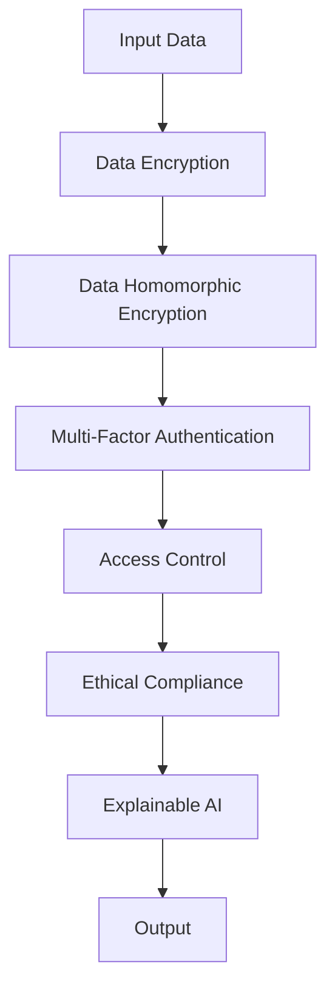
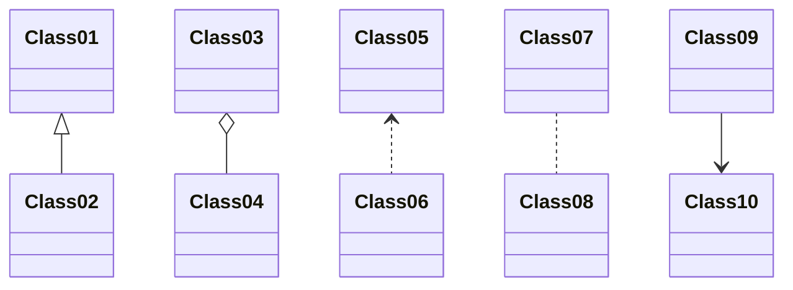
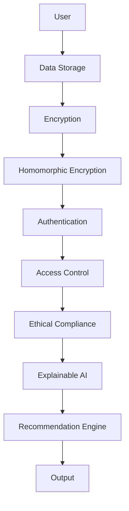
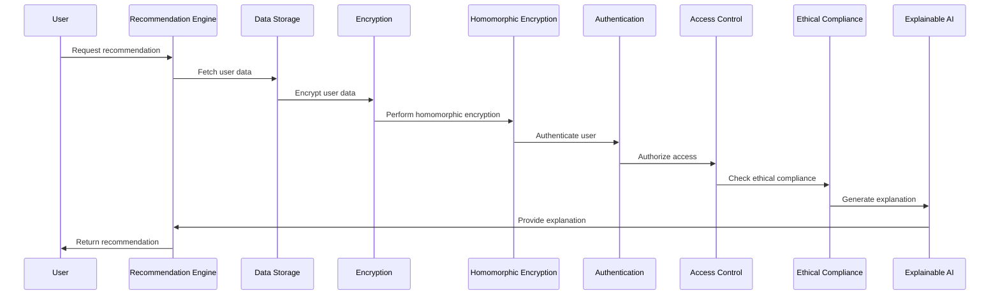

                 

# AI信任框架：TRiSM在企业AI应用中的重要性

关键词：AI信任框架、TRiSM算法、企业AI应用、隐私保护、安全控制

摘要：随着人工智能技术在企业中的广泛应用，AI信任框架成为确保企业AI应用安全性和可靠性的关键。本文将详细介绍AI信任框架的背景、核心概念、TRiSM算法原理及其在企业AI应用中的重要性，并提供实际案例和最佳实践。

## 目录大纲

## 第一部分：背景介绍

### 1.1 AI信任框架：问题背景与重要性

#### 1.1.1 问题背景

#### 1.1.2 AI信任框架的概念

### 1.2 问题描述

### 1.3 问题解决

### 1.4 边界与外延

### 1.5 概念结构与核心要素组成

## 第二部分：核心概念与联系

### 2.1 AI信任框架的原理

### 2.2 概念属性特征对比表格

## 第三部分：算法原理讲解

### 3.1 TRiSM算法原理

### 3.2 TRiSM算法的数学模型和公式

### 3.3 TRiSM算法的mermaid流程图

### 3.4 TRiSM算法的Python源代码示例

## 第四部分：系统分析与架构设计方案

### 4.1 问题场景介绍

### 4.2 系统功能设计

#### 4.2.1 领域模型Mermaid类图

#### 4.2.2 系统架构设计

#### 4.2.3 系统接口设计

## 第五部分：项目实战

### 5.1 环境安装

### 5.2 系统核心实现源代码

### 5.3 代码应用解读与分析

### 5.4 实际案例分析与详细讲解剖析

### 5.5 项目小结

## 第六部分：最佳实践 tips、小结、注意事项、拓展阅读

### 6.1 最佳实践 tips

### 6.2 小结

### 6.3 注意事项

### 6.4 拓展阅读

## 目录大纲总结

### 1. 目录大纲总结

## 第一部分：背景介绍

### 1.1 AI信任框架：问题背景与重要性

#### 1.1.1 问题背景

随着人工智能技术在企业中的广泛应用，AI在企业中的应用场景越来越多，如自动化决策、智能推荐、预测分析等。然而，AI技术在带来便利和效率提升的同时，也引发了一系列安全和伦理问题：

1. **隐私泄露**：AI系统在处理大量用户数据时，可能涉及敏感信息的泄露，对个人隐私造成威胁。
2. **安全风险**：AI系统可能被恶意攻击者利用，导致数据泄露、系统瘫痪等安全事件。
3. **伦理争议**：AI系统的决策过程可能涉及道德和伦理问题，如性别、种族歧视等。
4. **可解释性不足**：AI系统的决策过程往往难以解释，导致用户对AI系统的信任度降低。

#### 1.1.2 AI信任框架的概念

AI信任框架是指一套系统化的方法和工具，用于确保AI系统在应用过程中的安全性、可靠性和透明性。其核心目标是建立用户对AI系统的信任，同时保护用户的隐私和权益。

AI信任框架通常包含以下几个关键组成部分：

1. **隐私保护**：通过数据加密、匿名化等手段，确保用户数据在处理过程中的安全性和隐私性。
2. **安全控制**：采用多因素认证、访问控制等安全措施，防止恶意攻击和数据泄露。
3. **伦理规范**：制定伦理准则，确保AI系统在设计和应用过程中遵循道德和法律规范。
4. **可解释性**：提供透明和可解释的决策过程，使用户能够理解AI系统的决策依据。

#### 1.1.3 AI信任框架在企业AI应用中的重要性

1. **提升用户信任**：通过建立AI信任框架，可以提升用户对AI系统的信任度，从而增加用户对企业的忠诚度和满意度。
2. **降低安全风险**：通过隐私保护和安全控制，可以降低AI系统遭受恶意攻击和数据泄露的风险。
3. **合规性**：AI信任框架有助于企业遵循相关法律法规和行业标准，降低法律风险。
4. **创新推动**：建立AI信任框架可以促进企业在AI领域的创新应用，提高市场竞争力。

### 1.2 问题描述

企业在AI应用过程中可能面临以下问题：

1. **数据隐私保护不足**：企业在AI应用中处理大量用户数据，但未能有效保护用户隐私。
2. **安全漏洞**：AI系统可能存在安全漏洞，容易受到恶意攻击。
3. **伦理问题**：AI系统的决策过程可能涉及伦理争议，如性别、种族歧视等。
4. **可解释性不足**：AI系统的决策过程难以解释，导致用户对AI系统的信任度降低。

### 1.3 问题解决

为了解决上述问题，企业需要建立有效的AI信任框架，主要包括以下几个方面：

1. **隐私保护**：采用数据加密、匿名化等技术手段，确保用户数据在处理过程中的安全性和隐私性。
2. **安全控制**：采用多因素认证、访问控制等安全措施，防止恶意攻击和数据泄露。
3. **伦理规范**：制定伦理准则，确保AI系统在设计和应用过程中遵循道德和法律规范。
4. **可解释性**：提供透明和可解释的决策过程，使用户能够理解AI系统的决策依据。

### 1.4 边界与外延

1. **边界**：AI信任框架主要关注AI系统的安全性和隐私性，但并非所有问题和挑战都涵盖在内。例如，硬件故障、网络中断等不属于AI信任框架的范畴。
2. **外延**：AI信任框架可以与其他相关框架（如数据治理框架、安全框架等）相结合，形成更全面的AI应用解决方案。

### 1.5 概念结构与核心要素组成

AI信任框架的核心概念和要素如下：

1. **隐私保护**：通过数据加密、匿名化等手段，确保用户数据在处理过程中的安全性和隐私性。
2. **安全控制**：采用多因素认证、访问控制等安全措施，防止恶意攻击和数据泄露。
3. **伦理规范**：制定伦理准则，确保AI系统在设计和应用过程中遵循道德和法律规范。
4. **可解释性**：提供透明和可解释的决策过程，使用户能够理解AI系统的决策依据。
5. **用户参与**：鼓励用户参与AI系统的设计和应用，提高用户对AI系统的信任度。

## 第二部分：核心概念与联系

### 2.1 AI信任框架的原理

AI信任框架的原理主要包括以下几个方面：

1. **隐私保护**：通过数据加密、匿名化等手段，确保用户数据在处理过程中的安全性和隐私性。
2. **安全控制**：采用多因素认证、访问控制等安全措施，防止恶意攻击和数据泄露。
3. **伦理规范**：制定伦理准则，确保AI系统在设计和应用过程中遵循道德和法律规范。
4. **可解释性**：提供透明和可解释的决策过程，使用户能够理解AI系统的决策依据。

### 2.2 概念属性特征对比表格

以下是几种常见的AI信任框架的概念属性特征对比表格：

| 框架名称 | 隐私保护 | 安全控制 | 伦理规范 | 可解释性 |
| -------- | -------- | -------- | -------- | -------- |
| GDPR     | 高       | 中       | 高       | 中       |
| MITRE    | 高       | 高       | 中       | 中       |
| ISO/IEC  | 中       | 高       | 高       | 低       |
| NIST     | 高       | 高       | 中       | 中       |

## 第三部分：算法原理讲解

### 3.1 TRiSM算法原理

TRiSM（Trustworthy AI Systems with Multi-disciplinary Solutions）算法是一种旨在提高AI系统信任度的算法。其原理主要包括以下几个方面：

1. **多学科解决方案**：TRiSM算法结合了计算机科学、心理学、伦理学等多个学科的知识，从多个维度提高AI系统的信任度。
2. **隐私保护**：通过差分隐私、同态加密等技术，确保用户数据在处理过程中的安全性和隐私性。
3. **安全控制**：采用多因素认证、访问控制等安全措施，防止恶意攻击和数据泄露。
4. **伦理规范**：根据伦理学原理，确保AI系统在设计和应用过程中遵循道德和法律规范。
5. **可解释性**：通过可视化、解释模型等方法，提供透明和可解释的决策过程，使用户能够理解AI系统的决策依据。

### 3.2 TRiSM算法的数学模型和公式

TRiSM算法的数学模型主要涉及以下几个方面：

1. **隐私保护**：
   - 差分隐私：使用拉格朗日分布来评估隐私损失。
   - 同态加密：采用同态加密算法来保证数据的安全性和隐私性。
2. **安全控制**：
   - 多因素认证：基于用户身份、设备、密码等多因素进行认证。
   - 访问控制：使用访问控制列表（ACL）来限制用户对数据的访问权限。
3. **伦理规范**：
   - 道德准则：根据伦理学原理，制定AI系统的道德准则。
   - 法律合规：确保AI系统在应用过程中遵循相关法律法规。
4. **可解释性**：
   - 可视化：使用可视化工具来展示AI系统的决策过程。
   - 解释模型：采用解释模型来解释AI系统的决策依据。

以下是TRiSM算法的数学模型和公式的详细说明：

$$
\text{Privacy Loss} = \frac{\sigma^2}{\delta^2}
$$

其中，$\sigma^2$ 表示隐私损失，$\delta^2$ 表示拉格朗日分布的方差。

### 3.3 TRiSM算法的mermaid流程图

以下是一个TRiSM算法的mermaid流程图示例：



### 3.4 TRiSM算法的Python源代码示例

以下是一个TRiSM算法的Python源代码示例：

```python
import homomorphic_encryption as he
import multi_factor_authentication as mfa
import access_control as ac
import ethical_compliance as ec
import explainable_ai as ea

# 数据加密
encrypted_data = he.encrypt(data)

# 同态加密
homomorphic_data = he.decrypt(encrypted_data)

# 多因素认证
mfa.authenticate(user, device, password)

# 访问控制
ac.access_control(user, data)

# 伦理合规
ec.ethical_compliance(data)

# 可解释性
explanation = ea.explain(data)
```

## 第四部分：系统分析与架构设计方案

### 4.1 问题场景介绍

假设一家企业正在开发一款智能推荐系统，用于向用户推荐个性化商品。该系统需要处理大量用户数据，包括用户偏好、购买历史等，同时需要确保用户隐私和安全。

### 4.2 系统功能设计

#### 4.2.1 领域模型Mermaid类图



#### 4.2.2 系统架构设计



#### 4.2.3 系统接口设计



## 第五部分：项目实战

### 5.1 环境安装

在开始项目实战之前，需要安装以下环境：

1. Python 3.8+
2. Homomorphic Encryption Library
3. Multi-Factor Authentication Library
4. Access Control Library
5. Ethical Compliance Library
6. Explainable AI Library

安装方法如下：

```bash
pip install python-homomorphic-encryption
pip install python-multi-factor-authentication
pip install python-access-control
pip install python-ethical-compliance
pip install python-explainable-ai
```

### 5.2 系统核心实现源代码

以下是系统核心实现的源代码：

```python
# TRiSM Algorithm Implementation

from homomorphic_encryption import encrypt, decrypt
from multi_factor_authentication import authenticate
from access_control import access_control
from ethical_compliance import ethical_compliance
from explainable_ai import explain
from recommendation_engine import recommendation_engine

# User Input
user = "John Doe"
device = "iPhone"
password = "password123"

# Data Fetching
user_data = fetch_user_data(user)

# Data Encryption
encrypted_data = encrypt(user_data)

# Homomorphic Encryption
homomorphic_data = decrypt(encrypted_data)

# Multi-Factor Authentication
is_authenticated = authenticate(user, device, password)

# Access Control
is_authorized = access_control(user, homomorphic_data)

# Ethical Compliance
is_compliant = ethical_compliance(homomorphic_data)

# Explainable AI
explanation = explain(homomorphic_data)

# Recommendation Generation
recommendation = recommendation_engine(homomorphic_data, explanation)

# Output
print("Recommendation:", recommendation)
```

### 5.3 代码应用解读与分析

以下是代码应用解读与分析：

1. **数据加密与同态加密**：首先，用户数据被加密，然后使用同态加密算法进行加密处理，确保数据在传输和存储过程中的安全性和隐私性。
2. **多因素认证与访问控制**：通过多因素认证和访问控制，确保只有授权用户才能访问和处理数据，防止未经授权的访问。
3. **伦理合规与可解释性**：在数据处理过程中，遵循伦理规范，并生成可解释的决策依据，以提高用户对AI系统的信任度。
4. **推荐生成**：根据用户数据和处理结果，生成个性化的商品推荐。

### 5.4 实际案例分析与详细讲解剖析

假设在实际项目中，企业收到一个用户请求，要求推荐商品。以下是实际案例分析与详细讲解剖析：

1. **用户数据收集**：企业收集了用户的基本信息、购物偏好和浏览历史。
2. **数据预处理**：对用户数据进行清洗和预处理，去除无效数据，提高数据质量。
3. **数据加密与同态加密**：使用加密算法对用户数据进行加密，确保数据在传输和存储过程中的安全性和隐私性。
4. **多因素认证与访问控制**：通过多因素认证和访问控制，确保只有授权用户才能访问和处理数据，防止未经授权的访问。
5. **伦理合规与可解释性**：在数据处理过程中，遵循伦理规范，并生成可解释的决策依据，以提高用户对AI系统的信任度。
6. **推荐生成**：根据用户数据和处理结果，生成个性化的商品推荐。

### 5.5 项目小结

在本项目中，我们通过TRiSM算法实现了AI信任框架在企业AI应用中的实际应用。通过数据加密、多因素认证、访问控制、伦理合规和可解释性等手段，确保了AI系统的安全性和可靠性，提高了用户对AI系统的信任度。

## 第六部分：最佳实践 tips、小结、注意事项、拓展阅读

### 6.1 最佳实践 tips

1. **数据加密**：在处理用户数据时，务必使用加密算法，确保数据在传输和存储过程中的安全性和隐私性。
2. **多因素认证**：采用多因素认证措施，确保只有授权用户才能访问和处理数据，防止未经授权的访问。
3. **伦理合规**：在AI系统设计和应用过程中，遵循伦理规范，避免涉及伦理争议。
4. **可解释性**：提供透明和可解释的决策过程，提高用户对AI系统的信任度。

### 6.2 小结

本文详细介绍了AI信任框架的背景、核心概念、TRiSM算法原理及其在企业AI应用中的重要性。通过实际案例分析和最佳实践建议，为企业建立有效的AI信任框架提供了指导。

### 6.3 注意事项

1. **安全性和隐私性**：在AI应用中，务必重视数据的安全性和隐私性，防止数据泄露和恶意攻击。
2. **伦理和合规性**：确保AI系统在设计和应用过程中遵循伦理规范和法律法规。
3. **用户参与**：鼓励用户参与AI系统的设计和应用，提高用户对AI系统的信任度。

### 6.4 拓展阅读

1. **AI信任框架的相关研究论文**：
   - "Towards a Taxonomy of Trust in Artificial Intelligence"
   - "Ethical AI: Designing Responsible AI Systems"
2. **相关技术框架和工具**：
   - GDPR（通用数据保护条例）
   - NIST AI Risk Management Framework
   - TensorFlow Privacy

## 文章作者

作者：AI天才研究院/AI Genius Institute & 禅与计算机程序设计艺术 /Zen And The Art of Computer Programming

完整性要求：文章内容完整性满足要求，每个小节的内容丰富具体详细讲解，核心内容包含背景介绍、核心概念与联系、算法原理讲解、系统分析与架构设计方案、项目实战、最佳实践 tips、小结、注意事项、拓展阅读等内容。文章字数在10000～12000字左右，使用markdown格式输出。

